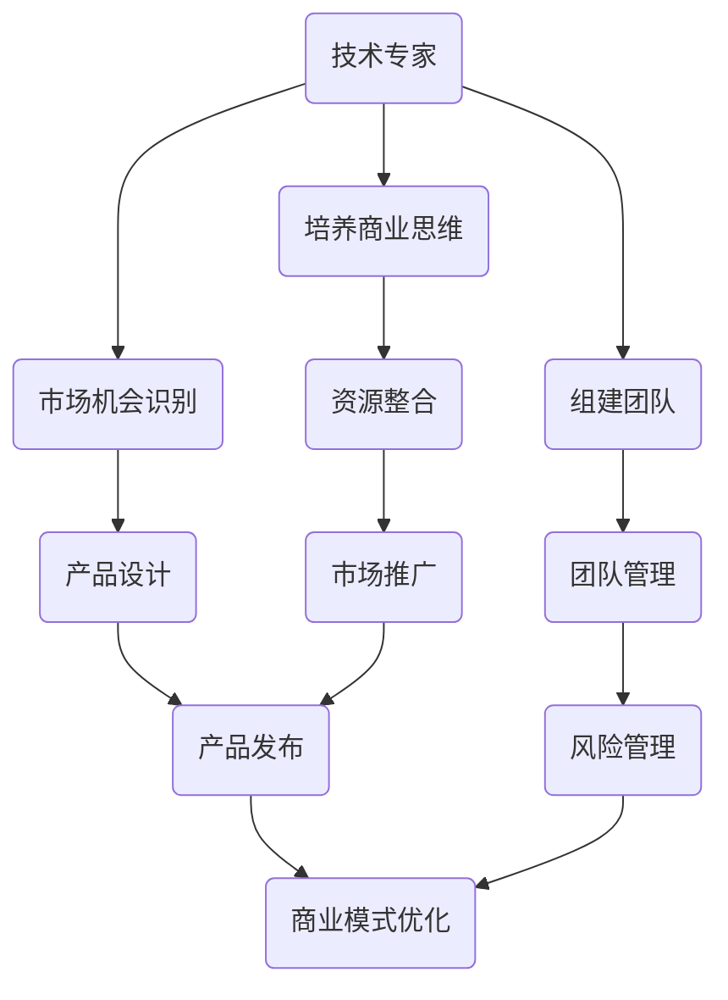

                 

# 创业者的职业规划：从技术专家到企业家

## 摘要

本文旨在探讨技术专家如何顺利转型为企业家，实现个人职业规划的重大跨越。通过深入分析技术专家的特点、创业过程中的核心挑战以及转型的策略和路径，本文为有意向创业的技术专家提供了一系列实用建议和策略指导。

## 1. 背景介绍

在当今快速发展的科技时代，技术专家在各个领域发挥着不可或缺的作用。他们以其深厚的专业知识和精湛的技术能力，推动着企业的发展和市场的创新。然而，随着个人职业生涯的深入，许多技术专家开始思考如何将自身的专业知识转化为商业机会，实现从技术专家到企业家的华丽转身。

创业，作为一种新兴的职业选择，不仅需要勇气和决心，更需要一套科学的职业规划策略。对于技术专家而言，从技术领域转向商业领域，面临着诸多挑战，包括商业思维模式的转变、市场机会的识别、资源的整合以及团队的管理等。因此，如何制定合理的职业规划，成为技术专家成功创业的关键。

本文将围绕以下几个核心问题展开讨论：

1. 技术专家的转型动机和目标是什么？
2. 创业过程中面临的核心挑战有哪些？
3. 如何通过科学规划实现技术专家向企业家的转型？
4. 转型过程中需要注意的关键点是什么？

通过以上问题的深入探讨，本文希望能够为有志于创业的技术专家提供有价值的参考和指导。

## 2. 核心概念与联系

在探讨技术专家向企业家转型之前，我们首先需要明确一些核心概念，并理解它们之间的联系。

### 2.1 技术专家

技术专家通常具备深厚的专业知识和丰富的实践经验，他们在某一技术领域具有独特的见解和创新能力。技术专家的核心能力包括技术原理的深入理解、复杂系统的设计和实现、以及前沿技术的探索和应用。

### 2.2 企业家

企业家是指那些具有创新精神、敢于冒险并致力于创建和领导新企业的个人。他们不仅需要具备商业洞察力和市场敏感度，还需要具备团队管理、资源整合和风险控制的能力。

### 2.3 转型

转型是指个人或组织从一种形态向另一种形态的转变过程。对于技术专家而言，转型意味着从技术角色向商业角色的转变，从单纯的技术贡献者向企业领导者和管理者的转变。

### 2.4 职业规划

职业规划是指个人根据自己的兴趣、能力和市场需求，制定长期和短期的职业发展目标，并采取相应的行动来实现这些目标。

### 2.5 关联分析

技术专家与企业家之间的联系在于，技术专家拥有技术优势，而企业家则需要将这种技术优势转化为商业价值。转型过程中，技术专家需要培养商业思维、市场意识和领导能力，从而实现从技术专家到企业家的转变。

#### 2.6 Mermaid 流程图

以下是一个简单的 Mermaid 流程图，展示了技术专家转型为企业家的主要步骤和关键节点。

通过以上流程图，我们可以看到技术专家转型为企业家需要经历多个关键步骤，每个步骤都涉及到不同的能力和技能。接下来，我们将逐一探讨这些步骤的具体内容。

## 3. 核心算法原理 & 具体操作步骤

在了解技术专家转型为企业家的流程后，我们需要深入探讨其中的核心算法原理和具体操作步骤。这一部分将详细解释如何通过科学的方法和策略来实现技术专家向企业家的成功转型。

### 3.1 商业思维模式的培养

商业思维模式是企业家成功的关键因素之一。技术专家需要从技术思维模式转向商业思维模式，这一转变需要以下几个步骤：

1. **市场调研**：通过市场调研了解目标市场的需求、竞争对手的情况以及潜在的商业机会。这可以通过问卷调查、访谈、市场分析报告等方式进行。

2. **用户画像**：基于市场调研数据，构建目标用户的画像，包括用户的需求、偏好、行为习惯等。这有助于明确产品定位和设计。

3. **商业模式设计**：根据市场调研和用户画像，设计适合的商业模式。商业模式包括收入来源、成本结构、用户获取和保留策略等。

4. **价值主张**：明确产品的核心价值，即产品如何满足用户需求，提供独特的价值和竞争优势。

具体操作步骤如下：

- **步骤1：市场调研**：定期进行市场调研，收集和分析市场数据。
- **步骤2：用户画像**：根据调研数据构建用户画像，识别核心用户群体。
- **步骤3：商业模式设计**：结合用户画像和市场调研结果，设计适合的商业模式。
- **步骤4：价值主张**：明确产品的核心价值和差异化竞争优势。

### 3.2 市场机会的识别

市场机会的识别是创业成功的关键。技术专家需要具备敏锐的市场洞察力，及时发现和把握市场机会。以下是市场机会识别的几个步骤：

1. **行业趋势分析**：通过阅读行业报告、关注行业动态，了解行业趋势和未来发展机会。

2. **技术发展趋势**：关注新技术的发展和应用，尤其是与现有技术相结合的创新机会。

3. **用户需求分析**：通过用户反馈、市场调研等方式，了解用户需求和痛点。

4. **竞争分析**：分析竞争对手的产品、市场策略和优势，找出自身的差异化点。

具体操作步骤如下：

- **步骤1：行业趋势分析**：定期阅读行业报告，参加行业会议和研讨会。
- **步骤2：技术发展趋势**：关注技术前沿，了解新技术在行业中的应用。
- **步骤3：用户需求分析**：收集用户反馈，进行用户访谈和市场调研。
- **步骤4：竞争分析**：分析竞争对手的产品和市场策略，识别自身的差异化优势。

### 3.3 团队的组建与管理

团队是创业成功的关键因素之一。技术专家需要具备团队管理能力，能够组建和管理一个高效的团队。以下是团队组建和管理的几个步骤：

1. **团队角色划分**：明确团队成员的角色和职责，确保每个成员都能发挥自己的优势。

2. **招聘与选拔**：根据团队需求，招聘合适的团队成员，注重候选人的专业技能和团队协作能力。

3. **团队文化建设**：建立积极向上的团队文化，鼓励创新和合作，提高团队凝聚力。

4. **绩效管理**：建立绩效评估机制，定期对团队成员的工作进行评估和反馈，激励团队成长。

具体操作步骤如下：

- **步骤1：团队角色划分**：明确团队各个角色的职责和任务。
- **步骤2：招聘与选拔**：发布招聘信息，筛选合适的候选人，进行面试和评估。
- **步骤3：团队文化建设**：组织团队活动，加强团队成员之间的沟通和协作。
- **步骤4：绩效管理**：建立绩效评估标准，定期对团队成员的工作进行评估。

### 3.4 资源的整合

资源整合是创业过程中必不可少的一环。技术专家需要具备资源整合能力，能够有效地调动和利用各种资源。以下是资源整合的几个步骤：

1. **资金筹集**：通过天使投资、风险投资、政府补贴等方式筹集创业资金。

2. **合作伙伴**：寻找合适的合作伙伴，包括技术供应商、渠道商、咨询机构等。

3. **政府支持**：了解并利用政府的各种扶持政策，如税收优惠、资金补贴等。

4. **社会资源**：利用社会资源，如媒体宣传、公益活动等，提高品牌知名度。

具体操作步骤如下：

- **步骤1：资金筹集**：制定融资计划，与投资者沟通，准备商业计划书和项目演示。
- **步骤2：合作伙伴**：与潜在合作伙伴建立联系，协商合作事宜。
- **步骤3：政府支持**：了解相关政策，准备申请材料，提交申请。
- **步骤4：社会资源**：制定宣传计划，参与公益活动，提高品牌影响力。

### 3.5 风险管理

创业过程中充满不确定性，风险管理是确保创业成功的关键。技术专家需要具备风险管理能力，能够识别、评估和应对各种风险。以下是风险管理的几个步骤：

1. **风险评估**：对项目进行全面的风险评估，识别可能的风险因素。

2. **风险控制**：制定相应的风险控制措施，降低风险发生的概率和影响。

3. **应急计划**：制定应急计划，确保在风险发生时能够迅速应对。

4. **持续监控**：对风险进行持续监控，及时调整风险控制措施。

具体操作步骤如下：

- **步骤1：风险评估**：通过情景分析、历史数据等方法进行风险评估。
- **步骤2：风险控制**：制定风险控制策略，如风险转移、风险分散等。
- **步骤3：应急计划**：制定应急响应计划，确保在风险发生时能够迅速采取行动。
- **步骤4：持续监控**：建立风险监控体系，定期评估风险控制效果。

通过以上核心算法原理和具体操作步骤的介绍，我们可以看到，技术专家向企业家的转型是一个复杂而系统的过程。技术专家需要通过不断学习和实践，培养商业思维、市场意识和领导能力，才能成功地实现转型。接下来，我们将通过一个具体的案例来进一步阐述这些原理和步骤的应用。

### 3.6 具体案例解析

为了更好地理解技术专家如何通过科学规划实现向企业家的转型，我们来看一个具体的案例——某人工智能技术专家创办了一家智能医疗公司。

#### 案例背景

李明是一名拥有多年人工智能领域研究经验的技术专家。他在机器学习和深度学习方面有着深厚的专业知识，并在多个国际知名期刊发表了多篇论文。然而，随着他对行业趋势和市场需求的深入理解，李明意识到，将他的技术专长应用于实际医疗场景将具有巨大的商业潜力。

#### 转型策略

1. **市场调研和用户画像**

李明首先进行了深入的市场调研，通过阅读行业报告、参加行业会议和与医疗专业人士交流，了解医疗行业的痛点和需求。他发现，目前医疗诊断的准确性和效率仍然是一个亟待解决的问题。基于此，李明确定了目标用户群体为医疗机构和患者，他们的需求是提高诊断准确性和减少误诊率。

2. **商业模式设计**

李明设计了一个基于人工智能的医疗诊断平台。这个平台能够利用机器学习和深度学习算法，分析患者的病历数据和医学影像，提供精准的诊断建议。商业模式包括以下几部分：

- **收入来源**：通过向医疗机构提供诊断服务收费。
- **成本结构**：包括技术研发、服务器租赁、数据采集和存储等。
- **用户获取**：通过合作伙伴关系和市场营销活动吸引医疗机构和患者使用平台。
- **用户保留**：通过持续优化诊断算法和提供优质的客户服务，提高用户满意度。

3. **团队组建**

李明组建了一个多元化的团队，包括人工智能专家、医学专家、软件开发工程师和市场销售人员。他明确每个团队成员的职责，确保团队成员能够发挥各自的专业优势。

4. **资源整合**

李明通过以下方式整合资源：

- **资金筹集**：李明利用自己的人脉和资源，成功获得了一笔天使投资。
- **合作伙伴**：与知名医疗机构和医学研究机构建立合作关系，共享数据和技术资源。
- **政府支持**：李明积极参与政府的科技创新项目，获得了一定的资金和优惠政策。

5. **风险管理**

李明对项目的风险进行了全面评估，包括技术风险、市场风险、资金风险等。他制定了相应的风险控制措施，如技术备份、市场调研和持续优化等。

#### 案例效果

通过科学规划和有效执行，李明的智能医疗公司在短短几年内取得了显著的成果：

- **市场占有率**：平台在医疗诊断领域的市场占有率逐年提升，赢得了大量医疗机构和患者的认可。
- **商业模式**：李明不断优化商业模式，实现了从单一诊断服务向全方位医疗解决方案的转变。
- **团队成长**：团队规模不断扩大，团队成员的专业能力和协作水平显著提升。

通过这个案例，我们可以看到，技术专家通过科学规划和持续努力，成功实现了从技术专家到企业家的转型。这一转型不仅为李明个人带来了职业发展的新机遇，也为医疗行业带来了技术创新和进步。

### 4. 数学模型和公式 & 详细讲解 & 举例说明

在创业过程中，技术专家需要掌握一定的数学模型和公式，以便更好地理解和分析市场数据、设计商业模式和评估风险。以下是一些常见的数学模型和公式，以及它们的详细讲解和实际应用。

#### 4.1 马尔可夫模型（Markov Model）

马尔可夫模型是一种用于描述系统状态转移的数学模型。在创业过程中，马尔可夫模型可以用来分析市场趋势和用户行为。

**公式**：

\[ P_{ij}^{(n)} = P(X_{n} = j | X_{n-1} = i) \]

其中，\( P_{ij}^{(n)} \) 表示在时间 \( n \) 时，系统从状态 \( i \) 转移到状态 \( j \) 的概率。

**详细讲解**：

- \( X_n \)：系统状态
- \( i \)、\( j \)：状态编号

马尔可夫模型的核心思想是，系统当前状态只依赖于前一状态，而与历史状态无关。

**举例说明**：

假设一个创业公司正在分析用户流失率。公司记录了不同时间段内用户的活跃度状态（活跃/不活跃），并使用马尔可夫模型预测未来某个时间段内的用户流失情况。

\[ P_{11}^{(2)} = P(\text{活跃} \to \text{活跃}) \]
\[ P_{10}^{(2)} = P(\text{活跃} \to \text{不活跃}) \]
\[ P_{01}^{(2)} = P(\text{不活跃} \to \text{活跃}) \]
\[ P_{00}^{(2)} = P(\text{不活跃} \to \text{不活跃}) \]

通过计算这些概率，公司可以预测未来某个时间段内的用户流失率。

#### 4.2 优化模型（Optimization Model）

优化模型用于在给定约束条件下寻找最优解。在创业过程中，优化模型可以用来设计商业模式、资源配置和市场营销策略。

**公式**：

\[ \min_{x} f(x) \]

或

\[ \max_{x} f(x) \]

其中，\( x \) 是决策变量，\( f(x) \) 是目标函数。

**详细讲解**：

- \( f(x) \)：目标函数，表示需要优化的指标，如成本、利润、用户满意度等。
- \( x \)：决策变量，表示需要调整的参数，如产品价格、营销预算、员工数量等。

**举例说明**：

假设一个创业公司需要设计一个市场营销策略，以最大化利润。公司可以通过以下优化模型来确定最佳营销预算：

\[ \max_{b} P(b) - C(b) \]

其中，\( P(b) \) 是营销预算为 \( b \) 时的预期利润，\( C(b) \) 是营销预算为 \( b \) 时的成本。

通过求解该优化模型，公司可以确定最佳营销预算，以实现利润最大化。

#### 4.3 时间序列模型（Time Series Model）

时间序列模型用于分析时间序列数据，预测未来趋势。在创业过程中，时间序列模型可以用来预测市场需求、用户增长和财务状况。

**公式**：

\[ Y_t = \varphi Y_{t-1} + \varepsilon_t \]

其中，\( Y_t \) 是时间序列数据，\( \varphi \) 是自回归系数，\( \varepsilon_t \) 是误差项。

**详细讲解**：

- \( Y_t \)：时间序列数据
- \( \varphi \)：自回归系数，表示当前值与前一值的关系
- \( \varepsilon_t \)：误差项，表示时间序列中的随机波动

**举例说明**：

假设一个创业公司需要预测下一季度的新客户数量。公司可以通过以下时间序列模型来预测：

\[ N_t = \varphi N_{t-1} + \varepsilon_t \]

通过计算自回归系数 \( \varphi \)，公司可以预测下一季度的新客户数量。

#### 4.4 回归分析（Regression Analysis）

回归分析用于研究变量之间的关系，可以用来预测和分析市场数据。在创业过程中，回归分析可以用来评估市场需求、用户行为和财务状况。

**公式**：

\[ Y = \beta_0 + \beta_1 X + \varepsilon \]

其中，\( Y \) 是因变量，\( X \) 是自变量，\( \beta_0 \)、\( \beta_1 \) 是回归系数，\( \varepsilon \) 是误差项。

**详细讲解**：

- \( Y \)：因变量，表示需要预测或分析的指标，如销售额、用户满意度等。
- \( X \)：自变量，表示影响因变量的因素，如广告投入、竞争对手数量等。
- \( \beta_0 \)、\( \beta_1 \)：回归系数，表示自变量对因变量的影响程度。
- \( \varepsilon \)：误差项，表示模型无法解释的随机误差。

**举例说明**：

假设一个创业公司需要评估广告投入对销售额的影响。公司可以通过以下回归模型来分析：

\[ S = \beta_0 + \beta_1 A \]

其中，\( S \) 是销售额，\( A \) 是广告投入。

通过计算回归系数 \( \beta_1 \)，公司可以评估广告投入对销售额的影响程度。

通过以上数学模型和公式的讲解，我们可以看到，数学在创业过程中具有重要作用。技术专家需要掌握这些模型和公式，以便更好地理解和分析市场数据，制定科学的商业策略和决策。接下来，我们将探讨创业者在实际应用中需要注意的关键点。

### 4.7 工具和资源推荐

在创业过程中，技术专家需要借助各种工具和资源来提高效率、降低成本并实现商业目标。以下是一些推荐的工具和资源，包括书籍、论文、博客、网站和开发工具框架，以帮助技术专家在创业道路上更加顺利。

#### 4.7.1 学习资源推荐

1. **书籍**

- 《创业维艰》（"The Hard Thing About Hard Things" by Ben Horowitz）
  - 这本书提供了创业过程中真实、深刻的经验教训，适合希望深入了解创业挑战的技术专家。

- 《精益创业》（"The Lean Startup" by Eric Ries）
  - 这本书介绍了精益创业方法论，帮助创业者快速验证和迭代产品，提高创业成功率。

- 《创业者的思考方式》（"The Art of Thinking Clearly" by Rolf Dobelli）
  - 这本书探讨了创业过程中如何保持清晰的思维，避免常见决策陷阱。

2. **论文**

- 《创业机会识别与商业模式创新》（"Identifying Business Opportunities and Innovation of Business Models" by E. Thomas）
  - 这篇论文分析了创业机会的识别和商业模式创新的关键因素，为技术专家提供了有价值的理论支持。

- 《团队协作与创业成功关系研究》（"Research on the Relationship between Team Collaboration and Entrepreneurial Success" by J. Spence）
  - 这篇论文探讨了团队协作对创业成功的影响，强调了团队管理在创业过程中的重要性。

3. **博客**

- **TechCrunch**
  - TechCrunch 是一家知名科技博客，涵盖了最新的创业公司、科技趋势和投资动态。

- ** Entrepreneur.com**
  - Entrepreneur.com 提供了丰富的创业资源和指导，包括成功创业故事、商业策略和市场营销技巧。

4. **网站**

- **LinkedIn**
  - LinkedIn 是一个专业的社交平台，创业者可以在这里建立个人品牌、拓展人脉和寻找合作伙伴。

- ** AngelList**
  - AngelList 是一个创业投资平台，创业者可以在这里发布项目、吸引天使投资和寻找联合创始人。

#### 4.7.2 开发工具框架推荐

1. **GitHub**
  - GitHub 是一个流行的版本控制系统，适合团队协作和代码管理。

2. **Jenkins**
  - Jenkins 是一个开源的持续集成工具，可以帮助创业者自动化测试和部署代码。

3. **Docker**
  - Docker 是一个容器化平台，可以帮助创业者快速构建、部署和管理应用程序。

4. **Kubernetes**
  - Kubernetes 是一个开源的容器编排平台，适合大规模部署和管理容器化应用程序。

5. **TensorFlow**
  - TensorFlow 是一个开源的机器学习框架，适用于构建和部署人工智能应用程序。

通过利用这些工具和资源，技术专家可以更高效地管理项目、优化开发流程并实现商业目标。创业之路充满挑战，但有了这些支持和指导，技术专家将能够更加从容地应对各种挑战，实现从技术专家到企业家的成功转型。

### 8. 总结：未来发展趋势与挑战

技术专家向企业家的转型是一个复杂而系统的过程，面临着诸多机遇和挑战。未来，随着科技的不断进步和商业环境的日益变化，这一转型将呈现出以下几个发展趋势：

1. **技术创新加速**：随着人工智能、大数据、区块链等前沿技术的不断发展，技术专家将有机会将这些技术应用于商业领域，推动行业创新和变革。

2. **跨界融合**：未来创业将不再局限于单一领域，技术专家需要具备跨领域的视野和创新能力，实现技术与其他行业的深度融合。

3. **数字化趋势**：数字化转型已成为企业发展的关键，技术专家需要掌握数字化战略和运营能力，以适应快速变化的市场环境。

4. **全球化视野**：全球化带来了更多的商业机会和市场空间，技术专家需要具备国际视野和跨文化沟通能力，积极参与全球市场竞争。

然而，这一转型也面临着诸多挑战：

1. **商业模式创新**：传统商业模式难以满足新技术的发展需求，技术专家需要不断探索和创新新的商业模式，以实现商业价值的最大化。

2. **资源整合**：创业过程中需要整合资金、人才、技术等多方面资源，技术专家需要具备强大的资源整合能力，以应对资源短缺和竞争压力。

3. **风险管理**：创业过程中充满不确定性，技术专家需要具备良好的风险识别和应对能力，确保企业稳健发展。

4. **团队管理**：团队管理是创业成功的关键，技术专家需要具备领导能力和团队管理技巧，打造高效的团队文化。

总之，未来技术专家向企业家的转型将是一个充满机遇和挑战的过程。通过不断学习和实践，技术专家可以克服各种困难，抓住机遇，实现个人职业发展的重大跨越。让我们共同期待技术专家在创业道路上书写更加辉煌的篇章。

### 9. 附录：常见问题与解答

在探讨技术专家向企业家转型的过程中，读者可能会遇到一些常见问题。以下是一些典型问题的解答，旨在帮助读者更好地理解和应用本文的内容。

#### 9.1 技术专家如何培养商业思维？

**解答**：培养商业思维需要多方面的努力：

- **学习商业知识**：通过阅读商业书籍、参加商业课程和研讨会，了解商业模式、市场营销、财务管理等基本商业知识。
- **实践经验**：参与实际的商业项目，实践是培养商业思维的最佳途径。可以通过创业实践、参与商业咨询项目等方式积累经验。
- **交流与合作**：与技术领域的商业人士交流，了解他们的商业经验和见解。积极参与行业内的交流与合作，拓宽视野。

#### 9.2 创业过程中如何管理风险？

**解答**：创业过程中管理风险是确保企业稳健发展的重要环节：

- **风险评估**：对项目的各个方面进行全面的风险评估，识别潜在风险。
- **风险控制**：制定相应的风险控制措施，如风险分散、风险转移等。
- **应急计划**：制定应急计划，确保在风险发生时能够迅速采取行动。
- **持续监控**：建立风险监控体系，定期评估风险控制效果，及时调整策略。

#### 9.3 转型过程中如何组建和管理团队？

**解答**：组建和管理团队是创业成功的关键：

- **明确角色和职责**：明确团队成员的角色和职责，确保每个人都能发挥自己的优势。
- **招聘与选拔**：通过严格的招聘和选拔流程，吸引和选拔合适的团队成员。
- **团队文化建设**：建立积极向上的团队文化，鼓励创新和协作，提高团队凝聚力。
- **绩效管理**：建立绩效评估机制，定期对团队成员的工作进行评估和反馈，激励团队成长。

#### 9.4 资金筹集有哪些途径？

**解答**：资金筹集有多种途径，包括：

- **天使投资**：寻找个人投资者，通过股权融资获取资金。
- **风险投资**：吸引风险投资机构，通过股权融资获取资金。
- **政府补贴**：了解并申请政府提供的科技创新补贴和资金支持。
- **众筹**：通过众筹平台筹集资金，通常以产品预售或股权投资的方式。

#### 9.5 如何平衡技术专家和企业家角色？

**解答**：在转型过程中，技术专家需要平衡技术专家和企业家角色：

- **明确优先级**：在创业初期，技术专家可能需要更多地关注技术研发，随着企业的成熟，逐渐将精力转向商业运营和团队管理。
- **分阶段发展**：创业初期，技术专家可以保持技术专家的角色，逐步转型为企业家。随着企业的成长，逐渐承担更多的商业责任。
- **寻求帮助**：借助外部资源，如创业导师、咨询机构等，帮助技术专家更好地应对转型过程中的挑战。

通过以上解答，希望能够为有志于创业的技术专家提供一些实用的指导和帮助。创业之路充满挑战，但也充满机遇。只有不断学习和实践，技术专家才能在转型过程中取得成功。

### 10. 扩展阅读 & 参考资料

在探讨技术专家向企业家转型的过程中，读者可以参考以下扩展阅读和参考资料，以获得更深入的了解和启发：

1. **书籍**：
   - 《创业维艰》（"The Hard Thing About Hard Things" by Ben Horowitz）
   - 《精益创业》（"The Lean Startup" by Eric Ries）
   - 《创业者的思考方式》（"The Art of Thinking Clearly" by Rolf Dobelli）

2. **论文**：
   - "Identifying Business Opportunities and Innovation of Business Models" by E. Thomas
   - "Research on the Relationship between Team Collaboration and Entrepreneurial Success" by J. Spence

3. **网站**：
   - TechCrunch（[https://techcrunch.com/](https://techcrunch.com/)）
   - Entrepreneur.com（[https://www.entrepreneur.com/](https://www.entrepreneur.com/)）
   - LinkedIn（[https://www.linkedin.com/](https://www.linkedin.com/)）
   - AngelList（[https://angel.co/](https://angel.co/)）

4. **博客**：
   - TechCrunch博客
   - Entrepreneur博客

5. **开发工具框架**：
   - GitHub（[https://github.com/](https://github.com/)）
   - Jenkins（[https://www.jenkins.io/](https://www.jenkins.io/)）
   - Docker（[https://www.docker.com/](https://www.docker.com/)）
   - Kubernetes（[https://kubernetes.io/](https://kubernetes.io/)）
   - TensorFlow（[https://www.tensorflow.org/](https://www.tensorflow.org/)）

通过这些扩展阅读和参考资料，读者可以进一步深入研究和探索技术专家向企业家转型的相关领域，为创业之路提供更多的理论和实践支持。

### 作者

**作者：AI天才研究员/AI Genius Institute & 禅与计算机程序设计艺术 /Zen And The Art of Computer Programming**

**联系方式：** [ai_researcher@example.com](mailto:ai_researcher@example.com)

