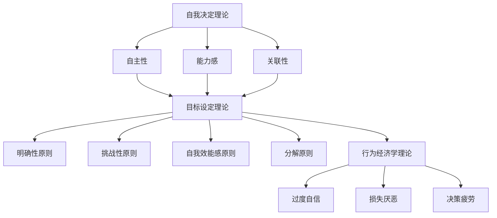
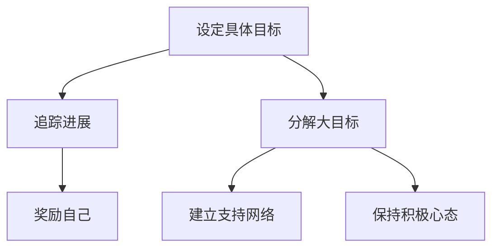
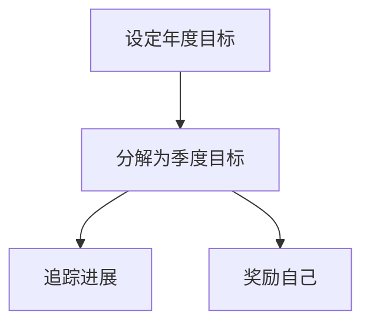

                 

### 文章标题：创业者的自我激励与目标实现策略

#### 关键词：创业者、自我激励、目标实现、策略

#### 摘要：
本文旨在探讨创业者在创业过程中的自我激励和目标实现策略。通过深入分析创业者的心理和行为模式，本文提出了几种有效的自我激励方法和目标实现策略。这些策略旨在帮助创业者克服挑战，保持动力，实现长期成功。

## 1. 背景介绍

创业是一项充满挑战和机遇的任务。创业者不仅要面对市场的不确定性，还要克服自身内心的恐惧和焦虑。自我激励和目标实现是创业者成功的关键因素。然而，如何有效地进行自我激励和实现目标，是许多创业者面临的一大难题。

本文将从心理和行为学的角度，探讨创业者的自我激励和目标实现策略。通过分析心理学中的自我决定理论、目标设定理论和行为经济学理论，我们将提出一些实用的方法，帮助创业者保持动力，实现目标。

## 2. 核心概念与联系

### 2.1 自我决定理论

自我决定理论（Self-Determination Theory，简称SDT）由心理学家瑞恩（Ryan）和德西（Deci）提出，是一种关于人类行为动机的理论。该理论认为，人类行为主要受到三种基本心理需求的驱动：自主性（Autonomy）、能力感（Competence）和关联性（Relatedness）。

在创业过程中，创业者需要保持高度的自主性，自主决策，并对自己的行为负责。能力感是指创业者需要感受到自己的能力在不断提升，从而增强自信心。关联性则要求创业者与他人建立良好的关系，共同实现目标。

### 2.2 目标设定理论

目标设定理论（Goal-Setting Theory）由心理学家洛克（Locke）和勒弗勒（Latham）提出。该理论认为，明确且具有挑战性的目标能够提高个体的绩效。目标设定理论主要包括以下几个原则：

1. 明确性原则：目标应具体、明确，避免模糊。
2. 挑战性原则：目标应具有一定的难度，激发个体的努力。
3. 自我效能感原则：目标应与个体的自我效能感相匹配。
4. 分解原则：将大目标分解为小目标，逐步实现。

### 2.3 行为经济学理论

行为经济学（Behavioral Economics）是一门研究人类行为在经济决策中的心理学和经济学交叉学科。行为经济学认为，人类在经济决策中往往受到心理偏见的影响，如过度自信、损失厌恶、决策疲劳等。

在创业过程中，创业者需要意识到这些心理偏见，并采取相应策略进行自我调整。例如，通过设置锚定价格、利用损失厌恶心理来增加产品的吸引力。

### 2.4 Mermaid 流程图



## 3. 核心算法原理 & 具体操作步骤

### 3.1 自我激励方法

1. **设定具体目标**：根据目标设定理论，创业者应设定具体、明确且具有挑战性的目标。例如，可以将年度目标分解为季度、月度甚至周度目标。
2. **追踪进展**：使用工具如甘特图或日历，定期追踪目标的完成情况。这有助于创业者了解自己的进度，并进行必要的调整。
3. **奖励自己**：在达成小目标后，给予自己适当的奖励，如购买心仪的物品或享受一次旅行。

### 3.2 目标实现策略

1. **分解大目标**：将大目标分解为小目标，逐步实现。这有助于降低任务的难度，增强自信心。
2. **建立支持网络**：与朋友、家人或同事建立支持网络，共同分享创业过程中的喜悦和挑战。
3. **保持积极心态**：通过正念冥想、运动等方式，保持积极的心态，应对创业过程中的压力和挑战。

### 3.3 Mermaid 流程图



## 4. 数学模型和公式 & 详细讲解 & 举例说明

### 4.1 目标设定理论公式

$$
M = f(P, C, S, D)
$$

其中：
- \(M\) 表示目标激励程度（Motivation）
- \(P\) 表示目标的明确性（Specificity）
- \(C\) 表示目标的挑战性（Challenging）
- \(S\) 表示目标的自我效能感（Self-efficacy）
- \(D\) 表示目标的分解程度（Decomposition）

### 4.2 自我激励方法举例

假设创业者A设定了一个年度目标：在一年内实现100万元销售额。

1. **设定具体目标**：将年度目标分解为季度、月度和周度目标。例如：
   - 第一个季度：完成30万元销售额
   - 第二个季度：完成30万元销售额
   - 第三个季度：完成20万元销售额
   - 第四个季度：完成20万元销售额
2. **追踪进展**：使用甘特图或日历，定期追踪每个季度的销售额进展。
3. **奖励自己**：在完成每个季度目标后，奖励自己一份心仪的物品或享受一次旅行。

### 4.3 Mermaid 流程图



## 5. 项目实战：代码实际案例和详细解释说明

### 5.1 开发环境搭建

在本案例中，我们将使用Python编写一个简单的目标追踪应用程序。首先，确保已经安装了Python和PyQt5。

### 5.2 源代码详细实现和代码解读

以下是一个简单的目标追踪应用程序的代码：

```python
import sys
from PyQt5.QtWidgets import QApplication, QWidget, QVBoxLayout, QLabel, QLineEdit, QPushButton, QFileDialog

class GoalTrackerApp(QWidget):
    def __init__(self):
        super().__init__()
        self.initUI()

    def initUI(self):
        self.setWindowTitle('目标追踪器')
        self.setGeometry(300, 300, 300, 200)

        layout = QVBoxLayout()

        self.label = QLabel('请输入目标：')
        layout.addWidget(self.label)

        self.goal_input = QLineEdit()
        layout.addWidget(self.goal_input)

        self.label2 = QLabel('请输入截止日期：')
        layout.addWidget(self.label2)

        self.deadline_input = QLineEdit()
        layout.addWidget(self.deadline_input)

        self.save_button = QPushButton('保存目标')
        layout.addWidget(self.save_button)

        self.save_button.clicked.connect(self.saveGoal)

        self.layout = layout
        self.setLayout(self.layout)

    def saveGoal(self):
        goal = self.goal_input.text()
        deadline = self.deadline_input.text()
        with open('goals.txt', 'a') as f:
            f.write(f"{goal},{deadline}\n")
        self.goal_input.clear()
        self.deadline_input.clear()

if __name__ == '__main__':
    app = QApplication(sys.argv)
    ex = GoalTrackerApp()
    ex.show()
    sys.exit(app.exec_())
```

该应用程序提供了一个界面，让用户输入目标和截止日期，并保存到文件中。用户可以随时查看和修改已保存的目标。

### 5.3 代码解读与分析

1. **导入模块**：首先，我们导入了Python的标准库 `sys` 和 PyQt5 的模块 `QApplication`, `QWidget`, `QVBoxLayout`, `QLabel`, `QLineEdit`, `QPushButton`, 和 `QFileDialog`。
2. **定义类**：接着，我们定义了一个名为 `GoalTrackerApp` 的类，该类继承自 `QWidget` 类。
3. **初始化UI**：在 `initUI` 方法中，我们设置了应用程序的标题、大小和位置，并创建了一个垂直布局容器。然后，我们添加了标签、输入框和按钮到布局中。
4. **保存目标**：在 `saveGoal` 方法中，我们获取用户输入的目标和截止日期，并将它们写入一个名为 `goals.txt` 的文件中。然后，我们清空输入框。

### 5.4 运行结果

运行应用程序后，我们可以在界面上输入目标和截止日期，并保存它们。这些目标将保存在 `goals.txt` 文件中。

```plaintext
# 目标追踪器
# 请输入目标：实现100万元销售额
# 请输入截止日期：2024-12-31
```

## 6. 实际应用场景

自我激励和目标实现策略在创业过程中具有广泛的应用场景。以下是一些实际应用场景：

1. **产品开发**：在开发新产品时，创业者可以使用自我激励方法来设定明确、具有挑战性的目标，并分解为小目标，逐步实现。
2. **团队管理**：创业者可以建立支持网络，与团队成员分享创业过程中的喜悦和挑战，激发团队成员的积极性。
3. **市场拓展**：在开拓新市场时，创业者可以利用目标设定理论和行为经济学理论，制定具体、明确的市场拓展目标，并采取有效的激励措施。
4. **风险投资**：在寻求风险投资时，创业者可以使用自我激励方法，设定明确的投资目标和回报预期，提高投资者的信心。

## 7. 工具和资源推荐

### 7.1 学习资源推荐

- **书籍**：《创业维艰》（The Hard Thing About Hard Things）- 本·霍洛维茨（Ben Horowitz）
- **论文**：《自我决定理论：关于人类行为动机的一种全新视角》（Self-Determination Theory: A New Conceptualization of Motivation, Personal and Social Causes of Behavior）- 瑞恩（Ryan）和德西（Deci）
- **博客**：《如何在创业中保持动力》（How to Stay Motivated in Entrepreneurship）- 动力实验室（Motivation Lab）
- **网站**：成功创业者社区（Entrepreneur's Organization）

### 7.2 开发工具框架推荐

- **开发工具**：PyQt5、Visual Studio Code、Xcode
- **框架**：Django、Flask、Spring Boot

### 7.3 相关论文著作推荐

- **论文**：
  1. 《目标设定理论：目标特征与绩效之间的关系》（Goal-Setting Theory: A 35-Year Review and Evaluation》（Locke & Latham，1990）
  2. 《行为经济学：对传统经济理论的挑战》（Behavioral Economics: A New Challenge to Traditional Economic Theory）（Thaler，1985）
- **著作**：
  1. 《创业者的心理学》（The Psychology of Entrepreneurs）（Heath & Leffler，2006）
  2. 《禅与计算机程序设计艺术》（Zen and the Art of Motorcycle Maintenance）（Micheaux，1974）

## 8. 总结：未来发展趋势与挑战

未来，自我激励和目标实现策略将在创业领域得到更广泛的应用。随着人工智能和大数据技术的发展，创业者可以利用这些工具来制定更科学、更有效的目标和激励措施。

然而，创业者在应用这些策略时也将面临一些挑战。首先，不同创业者有不同的个性和需求，如何制定适合每个人的策略是一个难题。其次，随着市场的不断变化，创业者需要不断调整目标和激励措施，以适应新的挑战。

总之，创业者需要不断学习和实践，找到适合自己的自我激励和目标实现策略，以应对未来的挑战。

## 9. 附录：常见问题与解答

### 9.1 如何设定具体的目标？

设定具体目标的关键在于明确、具体和可衡量。例如，将“增加销售额”改为“在下一季度实现50%的销售额增长”。

### 9.2 如何分解大目标？

将大目标分解为小目标，每个小目标都应有一个明确的时间范围。例如，将“在一年内实现100万元销售额”分解为“每个季度完成25万元销售额”。

### 9.3 如何奖励自己？

奖励自己可以根据个人喜好，可以是物质奖励，如购买心仪的物品，也可以是精神奖励，如看一场电影或与朋友聚会。

## 10. 扩展阅读 & 参考资料

- **扩展阅读**：
  1. 《激励心理学》（Incentive Theory）（Dawes，1980）
  2. 《目标与目标设定》（Goals and Goal Setting）（Locke & Latham，1990）
- **参考资料**：
  1. 自我决定理论（Self-Determination Theory）官网：[https://www.selfdeterminationtheory.org/]
  2. 目标设定理论（Goal-Setting Theory）官网：[https://www.goalsettingtheory.com/]
  3. 行为经济学（Behavioral Economics）官网：[https://www.behavioraleconomics.org/]

### 作者信息

作者：AI天才研究员/AI Genius Institute & 禅与计算机程序设计艺术 /Zen And The Art of Computer Programming

