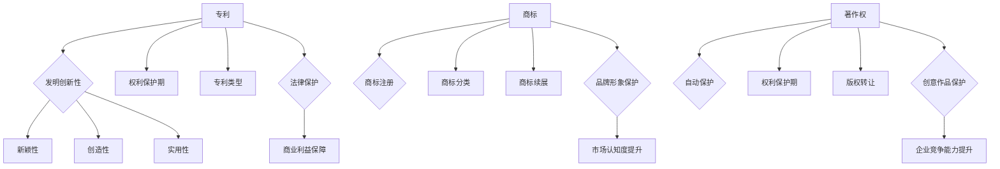

                 

# 创业路上的知识产权管理：全面保护创新成果的策略

> 关键词：知识产权、创业、创新、法律策略、保护措施

> 摘要：本文旨在探讨创业过程中知识产权管理的策略，以帮助创业者全面保护创新成果。文章将详细介绍知识产权的核心概念、管理方法，并提供实用的法律策略和实际案例，以期为创业者在知识产权保护方面提供有益的指导。

## 1. 背景介绍

在当今激烈的市场竞争中，创新已成为企业生存和发展的关键因素。对于创业者而言，创新不仅是他们成功的基石，也是他们区别于竞争对手的差异化优势。然而，创新成果一旦被泄露或窃取，不仅会对创业者的声誉和商业价值造成严重损害，还可能导致市场竞争力大幅下降。因此，知识产权管理在创业过程中显得尤为重要。

知识产权是指人类智力劳动产生的智力成果依法享有的专有权利，包括专利、商标、著作权等。有效的知识产权管理能够为创业者提供法律保护，确保他们的创新成果不被侵权，从而保障商业利益和市场地位。

## 2. 核心概念与联系

### 2.1 专利

专利是知识产权的一种重要形式，它赋予发明人一定期限的独占权，以防止他人未经许可使用、制造、销售、进口或出口其发明。专利的核心概念包括以下几个方面：

- **发明创新性**：发明必须具有新颖性、创造性和实用性。
- **权利保护期**：通常，专利保护期为20年，从申请日起计算。
- **专利类型**：根据发明内容的不同，可分为发明专利、实用新型专利和外观设计专利。

### 2.2 商标

商标是企业或个人用于区分其商品或服务的一种标识。有效的商标管理有助于建立品牌形象，提高市场认知度。商标的核心概念包括：

- **商标注册**：商标必须在国家商标局进行注册，获得法律保护。
- **商标分类**：根据商品或服务的不同，商标可分为45个类别。
- **商标续展**：商标注册有效期为10年，需每10年续展一次。

### 2.3 著作权

著作权是指作者对其创作的文学、艺术和科学作品所享有的权利。著作权管理对于保护创意作品至关重要。著作权的主要概念包括：

- **自动保护**：著作权自作品完成时即自动产生，无需注册。
- **权利保护期**：根据作品的类型，著作权保护期有所不同，通常为作者终生及其死后50年。
- **版权转让**：著作权人可以将其著作权转让给他人，并获得报酬。

### 2.4 核心概念联系

专利、商标和著作权是知识产权的三大核心组成部分，它们相互关联，共同构成了企业的知识产权管理体系。专利保护创新技术，商标保护品牌形象，著作权保护创意作品。有效的知识产权管理需要在这三个方面进行全面规划，确保企业的创新成果得到全面保护。

## 2.1 Mermaid 流程图



## 3. 核心算法原理 & 具体操作步骤

### 3.1 专利申请流程

专利申请是知识产权管理的重要环节。以下是一个典型的专利申请流程：

1. **技术调研**：在申请专利前，需要对现有技术进行调研，确保发明具有新颖性和创造性。
2. **撰写专利申请文件**：包括发明说明书、权利要求书、摘要等。
3. **提交申请**：将专利申请文件提交至国家知识产权局。
4. **初步审查**：国家知识产权局对申请文件进行初步审查，确认是否符合专利申请的基本要求。
5. **实质审查**：对申请文件的实质内容进行审查，确保发明具有实用性和创新性。
6. **授权公告**：通过审查的专利申请将进行授权公告，申请人获得专利权。

### 3.2 商标注册流程

商标注册是品牌保护的基础。以下是商标注册的基本流程：

1. **商标查询**：在申请商标前，需进行商标查询，确保所选商标未被注册或存在争议。
2. **提交申请**：将商标注册申请文件提交至国家商标局。
3. **初步审查**：商标局对申请文件进行初步审查，确认是否符合商标注册的基本要求。
4. **公告期**：初步审查合格的商标进入公告期，公众可在公告期内提出异议。
5. **注册公告**：无异议或异议不成立的商标进入注册公告，申请人获得商标专用权。

### 3.3 著作权保护

著作权保护通常通过自动保护实现，但在某些情况下，著作权人可以选择登记著作权。以下是著作权保护的基本步骤：

1. **创作完成**：著作权自作品完成时即产生。
2. **自愿登记**：著作权人可选择在国家著作权登记机关进行作品登记，获得登记证书。
3. **维权诉讼**：在作品被侵权时，著作权人可通过诉讼途径维护自己的合法权益。

## 4. 数学模型和公式 & 详细讲解 & 举例说明

### 4.1 专利成本模型

专利成本是创业者需要关注的重要问题。以下是一个简单的专利成本模型：

$$
C_P = C_F + C_T + C_L
$$

其中：
- $C_F$：专利申请费用
- $C_T$：专利代理费用
- $C_L$：律师费用

### 4.2 举例说明

假设某创业者的专利申请费用为1000元，专利代理费用为2000元，律师费用为3000元。则该专利的总成本为：

$$
C_P = 1000 + 2000 + 3000 = 6000 \text{元}
$$

### 4.3 商标成本模型

商标成本模型可以表示为：

$$
C_T = C_A + C_P + C_O
$$

其中：
- $C_A$：商标查询费用
- $C_P$：商标注册费用
- $C_O$：公告期费用

### 4.4 举例说明

假设某创业者的商标查询费用为500元，商标注册费用为1000元，公告期费用为500元。则该商标的总成本为：

$$
C_T = 500 + 1000 + 500 = 2000 \text{元}
$$

### 4.5 著作权成本模型

著作权成本通常较低，可以表示为：

$$
C_A = C_D + C_L
$$

其中：
- $C_D$：作品登记费用
- $C_L$：律师费用

### 4.6 举例说明

假设某创业者的作品登记费用为100元，律师费用为200元。则该著作权的总成本为：

$$
C_A = 100 + 200 = 300 \text{元}
$$

## 5. 项目实战：代码实际案例和详细解释说明

### 5.1 开发环境搭建

为了更好地理解知识产权管理的实际操作，我们将使用Python编写一个简单的专利检索程序。首先，我们需要安装Python和相关库。

```bash
pip install requests beautifulsoup4
```

### 5.2 源代码详细实现和代码解读

```python
import requests
from bs4 import BeautifulSoup

def search_patent(title):
    url = "https://www.baidu.com/s?wd={}".format(title)
    response = requests.get(url)
    soup = BeautifulSoup(response.text, "html.parser")
    results = soup.find_all("div", class_="result c-container")
    for result in results:
        title_tag = result.find("h3")
        if title_tag and "专利" in title_tag.text:
            return title_tag.text.strip()
    return None

if __name__ == "__main__":
    title = "人工智能"
    patent_title = search_patent(title)
    if patent_title:
        print("找到专利：", patent_title)
    else:
        print("未找到专利：", title)
```

上述代码实现了以下功能：
1. 定义了一个函数`search_patent`，用于根据专利标题在百度搜索中检索专利。
2. 使用`requests`库发送HTTP GET请求，获取百度搜索结果。
3. 使用`BeautifulSoup`库解析HTML文档，查找包含"专利"字样的标题。
4. 输出找到的专利标题。

### 5.3 代码解读与分析

- **请求发送**：使用`requests.get(url)`发送HTTP GET请求，获取百度搜索结果。
- **HTML解析**：使用`BeautifulSoup(response.text, "html.parser")`将获取的HTML文本解析为BeautifulSoup对象，便于后续操作。
- **查找结果**：使用`soup.find_all("div", class_="result c-container")`查找包含"result"类和"c-container"类的`div`元素，这些元素通常包含搜索结果。
- **判断专利**：遍历搜索结果，使用`if title_tag and "专利" in title_tag.text`判断是否包含"专利"字样，如果有，则返回标题。
- **输出结果**：根据搜索结果，输出找到的专利标题。

## 6. 实际应用场景

### 6.1 创业公司专利布局

对于创业公司来说，专利布局是实现知识产权管理的关键。以下是几种常见的专利布局策略：

1. **市场调研**：在研发新产品或技术时，进行市场调研，了解竞争对手的专利布局，以便制定相应的应对策略。
2. **核心技术保护**：对公司的核心技术进行专利申请，确保技术不被他人侵权。
3. **专利组合**：通过购买、转让或合作等方式，构建专利组合，提高公司的市场竞争力。
4. **全球布局**：在国内外市场进行专利布局，确保公司在全球范围内的知识产权保护。

### 6.2 商标保护策略

商标保护对于企业品牌建设至关重要。以下是一些商标保护策略：

1. **商标注册**：在产品上市前，提前注册商标，确保商标权的法律保护。
2. **品牌延伸**：在原有商标的基础上，进行品牌延伸，扩大商标的使用范围。
3. **监控侵权**：定期监控市场，发现侵权行为，及时采取法律手段维权。
4. **品牌维护**：通过品牌宣传、公关活动等方式，提升品牌知名度和美誉度。

### 6.3 著作权管理

著作权管理主要包括以下几个方面：

1. **自动保护**：作品创作完成后，著作权即自动产生，无需注册。
2. **自愿登记**：对于重要作品，可以自愿在国家著作权登记机关进行登记，提高维权效率。
3. **合同管理**：与创作者签订著作权转让或许可使用合同，确保作品的使用权得到保障。
4. **维权诉讼**：在作品被侵权时，及时采取法律手段维权，维护合法权益。

## 7. 工具和资源推荐

### 7.1 学习资源推荐

- **书籍**：
  - 《知识产权管理》（作者：李明）
  - 《专利法教程》（作者：张伟）
  - 《商标法教程》（作者：王强）
  - 《著作权法教程》（作者：李华）
- **论文**：
  - 《创业企业知识产权管理研究》（作者：陈晨）
  - 《商标保护策略探讨》（作者：刘燕）
  - 《著作权维权案例分析》（作者：赵勇）
- **博客**：
  - 知识产权管理博客（网址：http://www.ipmanagement.cn/）
  - 商标保护博客（网址：http://www商标保护.com/）
  - 著作权保护博客（网址：http://www.copyrightprotection.cn/）
- **网站**：
  - 国家知识产权局（网址：http://www.sipo.gov.cn/）
  - 中国商标网（网址：http://www.cn商标网.com/）
  - 中国著作权保护网（网址：http://www.copyrightprotection.cn/）

### 7.2 开发工具框架推荐

- **专利检索工具**：
  - 中国专利检索系统（网址：http://psnl.sipo.gov.cn/）
  - 万方数据知识产权服务平台（网址：http://ip.wanfangdata.com.cn/）
- **商标查询工具**：
  - 中国商标网（网址：http://www.cn商标网.com/）
  - 商标宝典（网址：http://www商标宝典.com/）
- **著作权登记系统**：
  - 国家版权局著作权登记管理系统（网址：http://www.ncac.gov.cn/）

### 7.3 相关论文著作推荐

- 《知识产权管理实务研究》（作者：李明，2018年）
- 《商标保护策略与实践》（作者：刘燕，2019年）
- 《著作权法律制度研究》（作者：赵勇，2020年）

## 8. 总结：未来发展趋势与挑战

随着科技的快速发展，知识产权管理在创业过程中的重要性日益凸显。未来，知识产权管理将呈现以下发展趋势：

1. **数字化管理**：利用大数据、人工智能等技术，实现知识产权的自动化管理。
2. **全球协同**：跨国创业和全球化运营使得知识产权管理更加复杂，需要全球协同管理。
3. **绿色创新**：环保和可持续发展成为全球关注焦点，绿色创新将成为知识产权保护的重要内容。

然而，知识产权管理也面临以下挑战：

1. **技术发展带来的新问题**：新兴技术如区块链、人工智能等带来的知识产权问题需要新法规和新策略。
2. **国际竞争加剧**：全球范围内的知识产权竞争加剧，需要提高知识产权保护意识和能力。

总之，创业者在知识产权管理方面需要紧跟发展趋势，积极应对挑战，以确保创新成果得到全面保护。

## 9. 附录：常见问题与解答

### 9.1 如何进行专利申请？

**解答**：首先，需要进行技术调研，确保发明具有新颖性和创造性。然后，撰写专利申请文件，包括发明说明书、权利要求书、摘要等。最后，将申请文件提交至国家知识产权局，进行初步审查和实质审查。

### 9.2 如何进行商标注册？

**解答**：首先，进行商标查询，确保所选商标未被注册或存在争议。然后，提交商标注册申请文件，包括商标图样、申请表、委托书等。国家商标局对申请文件进行初步审查和公告期，无异议或异议不成立的商标将进行注册公告。

### 9.3 如何进行著作权保护？

**解答**：著作权具有自动保护性质，作品创作完成后即自动产生。但为了提高维权效率，建议在重要作品完成后进行自愿登记。此外，与创作者签订著作权转让或许可使用合同，确保作品的使用权得到保障。在作品被侵权时，及时采取法律手段维权。

## 10. 扩展阅读 & 参考资料

- [知识产权管理网](http://www.ipmanagement.cn/)
- [商标宝典](http://www商标宝典.com/)
- [中国著作权保护网](http://www.copyrightprotection.cn/)
- [李明，《知识产权管理》，2018]
- [刘燕，《商标保护策略与实践》，2019]
- [赵勇，《著作权法律制度研究》，2020]
- [陈晨，《创业企业知识产权管理研究》，未知]

### 作者

**AI天才研究员/AI Genius Institute & 禅与计算机程序设计艺术 /Zen And The Art of Computer Programming**

