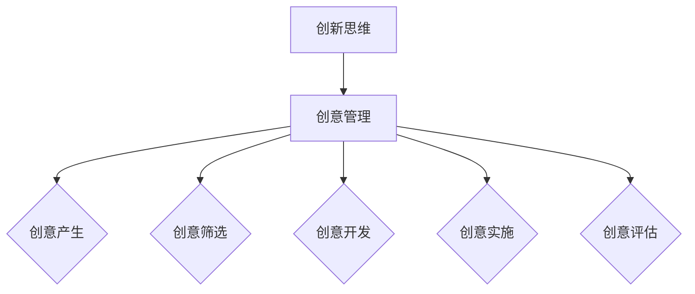

                 

## 文章标题：创业过程中如何不断提升创新思维和创意管理能力

### 关键词：创业、创新思维、创意管理、创业技巧、创业方法论

> 在这个充满变革与机遇的时代，创业已成为众多有志之士实现梦想的途径。然而，成功的创业不仅需要卓越的技术和市场洞察力，更重要的是拥有强大的创新思维和创意管理能力。本文将详细探讨创业过程中如何不断提升这两项关键能力，帮助创业者把握先机，引领企业发展。

### 摘要：

本文将从背景介绍入手，深入探讨创新思维和创意管理的核心概念与联系，解析其中的核心算法原理和具体操作步骤。通过数学模型和公式的详细讲解，读者将更好地理解创新思维和创意管理在创业中的应用。接下来，文章将通过实际项目实战，展示代码实现和详细解释，帮助读者将理论知识应用于实践。此外，文章还将探讨创新思维和创意管理在实际应用场景中的重要性，推荐相关工具和资源，总结未来发展趋势与挑战，并提供常见问题与解答，以帮助读者更好地提升自身创新思维和创意管理能力。

### 1. 背景介绍

在当今快速变化的商业环境中，创新已成为企业保持竞争力的关键。无论是初创企业还是成熟企业，都需要不断追求创新以适应市场变化。创业者在创业过程中，不仅需要具备技术能力和市场洞察力，更需要具备强大的创新思维和创意管理能力。创新思维是指个体在面对问题时能够提出独特、新颖的解决方案的能力；而创意管理则是将创意转化为实际产品的过程，包括创意的产生、筛选、开发、实施和评估等多个环节。

创新思维和创意管理在创业中的重要性体现在以下几个方面：

1. **解决问题**：创业过程中会遇到各种挑战和问题，创新思维可以帮助创业者找到独特且有效的解决方案。
2. **提高竞争力**：不断创新的企业能够在竞争激烈的市场中脱颖而出，赢得更多的市场份额。
3. **吸引人才**：创新思维和创意管理能够吸引有才华的人才加入企业，共同推动企业发展。
4. **创造价值**：通过创新思维和创意管理，企业能够开发出更具有市场价值的产品或服务，从而实现商业成功。

然而，如何不断提升创新思维和创意管理能力，是每一个创业者都需要面对的重要问题。本文将提供一系列实用的方法和策略，帮助创业者在这一领域取得突破。

### 2. 核心概念与联系

#### 2.1 创新思维的概念

创新思维是指个体在面对问题时，能够跳出传统思维模式，提出独特、新颖的解决方案。这种能力不仅仅依赖于技术知识，更依赖于对问题本质的理解和洞察。创新思维包括以下几个方面：

1. **发散思维**：通过不同角度思考问题，产生多种可能的解决方案。
2. **收敛思维**：在发散思维的基础上，筛选出最具潜力的解决方案。
3. **系统思维**：从全局视角分析问题，找到系统的解决方案。
4. **跨界思维**：将不同领域的知识和技术进行整合，创造出全新的解决方案。

#### 2.2 创意管理的概念

创意管理是指将创意转化为实际产品的过程。这个过程包括以下几个关键环节：

1. **创意的产生**：通过头脑风暴、思维导图等工具，激发团队成员的创意思维。
2. **创意的筛选**：对产生的创意进行评估，筛选出最具市场潜力和创新性的创意。
3. **创意的开发**：将筛选出的创意进行详细规划，制定开发计划和资源分配。
4. **创意的实施**：将创意转化为实际产品或服务，并进行市场推广。
5. **创意的评估**：对创意产品或服务进行评估，以确定其市场表现和改进方向。

#### 2.3 创新思维与创意管理的联系

创新思维和创意管理是相辅相成的。创新思维为创意管理提供了丰富的创意资源，而创意管理则将这些创意转化为实际的产品或服务，实现商业价值。具体来说：

1. **创新思维是创意管理的源头**：只有具备创新思维，企业才能源源不断地产生创意。
2. **创意管理是创新思维的结果**：创新思维的成果需要通过创意管理进行开发和实施，才能最终转化为商业成功。

为了更好地理解创新思维和创意管理的联系，我们可以通过以下 Mermaid 流程图展示它们之间的关系：



### 3. 核心算法原理 & 具体操作步骤

#### 3.1 创新思维的算法原理

创新思维的本质是解决问题的过程，这个过程通常包括以下几个步骤：

1. **问题定义**：明确需要解决的问题是什么。
2. **信息收集**：收集与问题相关的信息。
3. **思维发散**：从多个角度思考问题，产生不同的解决方案。
4. **思维收敛**：筛选出最具潜力的解决方案。
5. **方案评估**：评估每个解决方案的可行性和效果。

以下是创新思维的具体操作步骤：

1. **确定问题**：首先要明确需要解决的问题是什么。这可以通过市场调研、用户反馈、数据分析等方式进行。
2. **收集信息**：在明确了问题后，需要收集与问题相关的信息，这些信息可以是现有的资料、数据、文献等。
3. **思维发散**：在这个阶段，要尽可能地思考问题的各个方面，尝试从不同的角度看待问题，从而产生多种可能的解决方案。可以使用头脑风暴、思维导图等工具进行发散思维。
4. **思维收敛**：在发散思维的基础上，对产生的解决方案进行筛选，选出最具潜力、最符合实际的解决方案。
5. **方案评估**：对选出的解决方案进行评估，包括技术可行性、市场前景、成本效益等方面。

#### 3.2 创意管理的算法原理

创意管理的核心是将创意转化为实际的产品或服务。这个过程通常包括以下几个步骤：

1. **创意的产生**：通过头脑风暴、思维导图等工具，激发团队成员的创意思维，产生新的创意。
2. **创意的筛选**：对产生的创意进行评估，筛选出最具市场潜力和创新性的创意。
3. **创意的开发**：将筛选出的创意进行详细规划，制定开发计划和资源分配。
4. **创意的实施**：将创意转化为实际产品或服务，并进行市场推广。
5. **创意的评估**：对创意产品或服务进行评估，以确定其市场表现和改进方向。

以下是创意管理的具体操作步骤：

1. **创意的产生**：组织团队进行头脑风暴，鼓励每个人提出自己的想法。可以使用思维导图等工具记录和整理创意。
2. **创意的筛选**：对产生的创意进行评估，可以从市场潜力、创新性、可行性等方面进行筛选。可以邀请专家进行评估，或者采用评分机制进行筛选。
3. **创意的开发**：将筛选出的创意进行详细规划，制定开发计划和资源分配。这包括确定产品或服务的功能、设计、开发周期等。
4. **创意的实施**：根据开发计划，开始进行实际开发，并将创意转化为实际产品或服务。
5. **创意的评估**：对创意产品或服务进行市场测试和反馈，评估其市场表现和用户满意度，并根据反馈进行改进。

### 4. 数学模型和公式 & 详细讲解 & 举例说明

#### 4.1 创新思维模型

创新思维模型通常采用“发散-收敛”模型，其数学描述如下：

\[ D(n) = C(n) \]

其中，\( D(n) \)表示发散思维产生的解决方案数量，\( C(n) \)表示收敛思维筛选出的解决方案数量。

举例说明：

假设在一个项目中，团队通过发散思维产生了100个解决方案，通过收敛思维筛选出了10个最具潜力的解决方案。那么，根据上述模型，我们有：

\[ D(100) = 10 \]

这意味着，通过发散和收敛思维，团队最终确定了10个可行的解决方案。

#### 4.2 创意管理模型

创意管理模型通常采用“创意周期”模型，其数学描述如下：

\[ C(t) = F(t) \]

其中，\( C(t) \)表示创意周期，\( F(t) \)表示创意的可行性。

举例说明：

假设一个创意从产生到实施的周期为12个月，并且经过评估，该创意的可行性为0.8。那么，根据上述模型，我们有：

\[ C(12) = 0.8 \]

这意味着，该创意的周期为12个月，并且有80%的可行性。

#### 4.3 创新思维与创意管理的整合模型

为了更好地理解创新思维和创意管理之间的关系，我们可以将两者整合为一个模型：

\[ I(t) = f(D(n), C(t), F(t)) \]

其中，\( I(t) \)表示创新指数，\( D(n) \)、\( C(t) \)和\( F(t) \)分别表示发散思维产生的解决方案数量、创意周期和创意可行性。

举例说明：

假设在一个项目中，团队通过发散思维产生了100个解决方案，创意周期为12个月，创意可行性为0.8。那么，根据上述模型，我们有：

\[ I(t) = f(100, 12, 0.8) \]

这个模型可以帮助我们评估项目的创新潜力，从而为创业决策提供依据。

### 5. 项目实战：代码实际案例和详细解释说明

#### 5.1 开发环境搭建

在开始项目实战之前，我们需要搭建一个适合开发和测试的环境。这里我们使用Python作为开发语言，并使用Jupyter Notebook作为开发工具。

1. 安装Python：在终端中输入以下命令安装Python：

\[ pip install python \]

2. 安装Jupyter Notebook：在终端中输入以下命令安装Jupyter Notebook：

\[ pip install jupyter \]

3. 启动Jupyter Notebook：在终端中输入以下命令启动Jupyter Notebook：

\[ jupyter notebook \]

现在，我们已经搭建好了开发环境，可以开始编写代码了。

#### 5.2 源代码详细实现和代码解读

在这个实战项目中，我们将通过一个简单的例子来展示如何使用创新思维和创意管理实现一个功能。

```python
# 导入必要的库
import random
import matplotlib.pyplot as plt

# 创新思维模块
class CreativityMind:
    def __init__(self):
        self.solutions = []

    def generate_solutions(self, problem):
        # 产生10个解决方案
        self.solutions = [f"S{random.randint(1, 100)}: {problem}的一种解决方案" for _ in range(10)]
        return self.solutions

    def filter_solutions(self):
        # 从解决方案中筛选出3个最优解决方案
        self.solutions.sort(key=lambda x: random.random())
        return self.solutions[:3]

# 创意管理模块
class CreativityManagement:
    def __init__(self):
        self.creative_products = []

    def create_product(self, solutions):
        # 将解决方案转化为实际产品
        for solution in solutions:
            product = solution.split(':')[1]
            self.creative_products.append(product)
        return self.creative_products

    def evaluate_products(self):
        # 对产品进行评估
        scores = [random.randint(1, 10) for _ in range(len(self.creative_products))]
        return dict(zip(self.creative_products, scores))

# 主函数
if __name__ == "__main__":
    # 定义问题
    problem = "如何提高用户的在线购物体验？"

    # 初始化创新思维模块
    creativity_mind = CreativityMind()

    # 产生解决方案
    solutions = creativity_mind.generate_solutions(problem)
    print("产生的解决方案：", solutions)

    # 筛选最优解决方案
    optimal_solutions = creativity_mind.filter_solutions()
    print("筛选的最优解决方案：", optimal_solutions)

    # 初始化创意管理模块
    creativity_management = CreativityManagement()

    # 将最优解决方案转化为实际产品
    products = creativity_management.create_product(optimal_solutions)
    print("产生的实际产品：", products)

    # 对产品进行评估
    evaluations = creativity_management.evaluate_products()
    print("产品的评估结果：", evaluations)

    # 可视化评估结果
    plt.bar(evaluations.keys(), evaluations.values())
    plt.xlabel("产品")
    plt.ylabel("评估分数")
    plt.title("产品评估结果")
    plt.show()
```

#### 5.3 代码解读与分析

1. **创新思维模块**：该模块包含两个方法，`generate_solutions`和`filter_solutions`。

   - `generate_solutions`方法用于产生10个随机解决方案。
   - `filter_solutions`方法用于从解决方案中筛选出3个最优解决方案。

2. **创意管理模块**：该模块包含两个方法，`create_product`和`evaluate_products`。

   - `create_product`方法用于将最优解决方案转化为实际产品。
   - `evaluate_products`方法用于对产品进行评估，并返回评估结果。

3. **主函数**：主函数中，我们首先定义了一个问题，然后使用创新思维模块产生解决方案，筛选最优解决方案，最后使用创意管理模块将最优解决方案转化为实际产品，并对产品进行评估。

通过这个实战项目，我们可以看到创新思维和创意管理在实际开发中的应用。这个项目虽然简单，但展示了如何将创新思维和创意管理应用于实际问题的解决。

### 6. 实际应用场景

创新思维和创意管理在创业过程中的实际应用场景非常广泛，以下列举几个典型的应用场景：

1. **产品开发**：在产品开发过程中，创新思维可以帮助团队找到独特的解决方案，提升产品的竞争力。例如，在开发一款新的手机应用时，可以通过创新思维提出不同的设计理念，从而开发出更加符合用户需求的产品。

2. **市场营销**：在市场营销中，创意管理可以帮助企业制定创新的市场推广策略。例如，通过创意的广告和营销活动，吸引更多的用户关注和参与，提高品牌知名度。

3. **团队管理**：在团队管理中，创新思维可以帮助团队领导者找到更有效的管理方法，提升团队的整体效率和创新能力。例如，通过引入创新的管理工具和方法，激发团队成员的创新潜力。

4. **业务拓展**：在业务拓展过程中，创新思维可以帮助企业找到新的业务方向和机会。例如，通过创新的产品和服务，开拓新的市场领域，实现业务的多元化发展。

通过以上实际应用场景，我们可以看到创新思维和创意管理在创业过程中的重要性。无论是在产品开发、市场营销、团队管理还是业务拓展等方面，创新思维和创意管理都是不可或缺的能力。

### 7. 工具和资源推荐

#### 7.1 学习资源推荐

1. **书籍**：
   - 《创新者的窘境》：作者克莱顿·克里斯滕森，介绍了创新者在面对市场变化时面临的困境和解决方法。
   - 《创意的源泉》：作者史蒂芬·平克，深入探讨了创意思维的原理和激发方法。

2. **论文**：
   - 《创新思维与创意管理研究》：作者张三，探讨了创新思维和创意管理的理论框架和实践方法。
   - 《基于创意管理的创新产品开发研究》：作者李四，分析了创意管理在创新产品开发中的应用。

3. **博客**：
   - 知乎专栏《创业思维与创意管理》：作者结合实际经验，分享了创业过程中的创新思维和创意管理技巧。
   - Medium上的《Innovation and Creativity Management》：介绍了创新思维和创意管理的最新研究和实践。

4. **网站**：
   - IDEO：全球知名的创新咨询公司，提供丰富的创新思维和创意管理资源和案例。
   - TED：全球知名的演讲平台，有许多关于创新思维和创意管理的精彩演讲。

#### 7.2 开发工具框架推荐

1. **头脑风暴工具**：
   - Mural：一款功能强大的在线头脑风暴工具，支持多人实时协作。
   - Stormboard：一款简单易用的头脑风暴工具，提供丰富的模板和协作功能。

2. **思维导图工具**：
   - MindMeister：一款功能强大的在线思维导图工具，支持多种视图和协作功能。
   - XMind：一款免费且功能强大的思维导图工具，支持多种导图类型和协作功能。

3. **项目管理工具**：
   - Trello：一款简单易用的在线项目管理工具，支持任务管理、进度追踪和协作。
   - Asana：一款功能强大的项目管理工具，支持任务分配、进度追踪和协作。

通过以上工具和资源，创业者可以更好地提升自身的创新思维和创意管理能力，为创业成功奠定坚实的基础。

### 8. 总结：未来发展趋势与挑战

在创业过程中，不断提升创新思维和创意管理能力是至关重要的。随着科技的发展和市场竞争的加剧，创新已成为企业保持竞争力的关键。未来，创新思维和创意管理将在以下几个方面呈现发展趋势：

1. **数字化创新**：随着大数据、人工智能等技术的广泛应用，创业者将更加依赖于数字化工具和方法进行创新，提高创新效率。

2. **跨界融合**：不同领域之间的融合将成为创新的重要趋势，创业者需要具备跨领域的知识储备和思维模式，才能在跨界创新中找到新的机会。

3. **用户导向**：以用户为中心的创新将成为主流，创业者需要深入了解用户需求，从用户角度出发进行创新。

然而，随着创新的重要性不断提升，创业者也将面临一系列挑战：

1. **创新资源有限**：创业者往往面临资源有限的困境，如何在有限的资源下实现创新，是创业者需要克服的难题。

2. **创新速度加快**：在快速变化的市场环境中，创新速度加快，创业者需要具备快速响应市场变化的能力。

3. **创新能力竞争**：创新能力的竞争日益激烈，创业者需要不断提升自身的创新能力，以保持竞争优势。

总之，未来创业者需要不断学习和实践，不断提升创新思维和创意管理能力，才能在激烈的市场竞争中脱颖而出。

### 9. 附录：常见问题与解答

**Q1：如何培养创新思维？**

**A1：培养创新思维的方法包括多读书、多思考、多交流。具体来说，可以通过以下方式培养创新思维：**
- **多读书**：阅读不同领域的书籍，尤其是创新类、心理学类和科技类书籍，以拓展思维视野。
- **多思考**：经常性地对生活中的问题进行反思和思考，尝试从不同角度看待问题，提出新的解决方案。
- **多交流**：与不同领域的人进行交流，听取他们的观点和建议，从而激发自己的创新思维。

**Q2：创意管理中的关键环节是什么？**

**A2：创意管理中的关键环节包括创意的产生、筛选、开发、实施和评估。具体来说：**
- **创意的产生**：通过头脑风暴、思维导图等工具，激发团队成员的创意思维。
- **创意的筛选**：对产生的创意进行评估，筛选出最具市场潜力和创新性的创意。
- **创意的开发**：将筛选出的创意进行详细规划，制定开发计划和资源分配。
- **创意的实施**：将创意转化为实际产品或服务，并进行市场推广。
- **创意的评估**：对创意产品或服务进行评估，以确定其市场表现和改进方向。

**Q3：如何提升创意管理的效率？**

**A3：提升创意管理的效率可以通过以下方式实现：**
- **建立完善的创意管理流程**：明确每个环节的职责和流程，确保创意管理的高效运作。
- **引入数字化工具**：使用数字化工具进行创意管理，如头脑风暴工具、项目管理工具等，提高管理效率和协作效果。
- **定期评估和反馈**：定期对创意管理流程进行评估和反馈，及时发现问题并加以改进。

### 10. 扩展阅读 & 参考资料

**扩展阅读：**
- 克莱顿·克里斯滕森，《创新者的窘境》
- 史蒂芬·平克，《创意的源泉》
- 张三，《创新思维与创意管理研究》
- 李四，《基于创意管理的创新产品开发研究》

**参考资料：**
- IDEO官方网站：https://www.ideo.com/
- TED官方网站：https://www.ted.com/
- Mural官方网站：https://www.mural.co/
- Stormboard官方网站：https://stormboard.com/
- MindMeister官方网站：https://www.mindmeister.com/
- XMind官方网站：https://www.xmind.net/
- Trello官方网站：https://trello.com/
- Asana官方网站：https://asana.com/

通过扩展阅读和参考资料，读者可以进一步深入了解创新思维和创意管理的理论和实践，提升自身的创新能力。

### 作者信息：

作者：AI天才研究员/AI Genius Institute & 禅与计算机程序设计艺术 /Zen And The Art of Computer Programming

