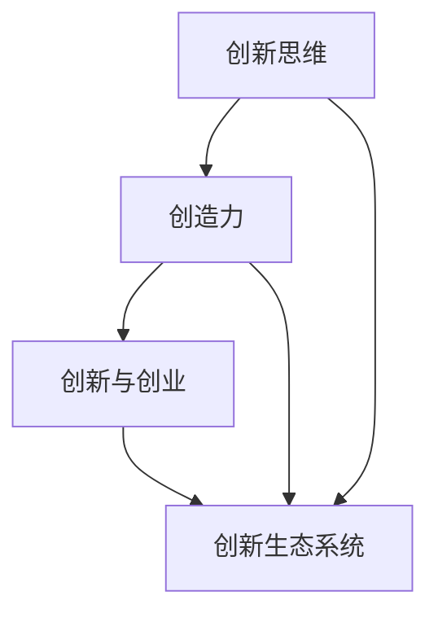

                 

### 文章标题

**创业过程中如何不断提升创新思维和创造力**

### 关键词

- 创业
- 创新思维
- 创造力
- 创业者
- 企业成功
- 创新策略
- 创新工具

### 摘要

在竞争激烈的创业环境中，提升创新思维和创造力是创业者取得成功的关键。本文将探讨创业过程中如何通过系统的方法和策略来提升创新思维和创造力。我们将详细分析创新思维的基本原理、实用工具、案例分析以及具体实施步骤，帮助创业者掌握创新的技巧，为企业的持续发展提供源源不断的动力。

<|endoftext|>

## 1. 背景介绍

创业是一个充满挑战和机遇的过程。创业者不仅要面对市场的激烈竞争，还要在不断变化的环境中寻找机会，把握趋势。创新思维和创造力在这种环境中尤为重要。它们是企业突破困境、实现持续增长的核心驱动力。

创新思维是指从不同角度思考问题的能力，能够发现新的解决方案和商业机会。创造力则是将创新思维转化为实际成果的能力，通过创造新的产品、服务或商业模式来满足市场需求。

在创业过程中，提升创新思维和创造力可以帮助创业者：

1. **识别市场机会**：通过创新思维，创业者能够发现潜在的市场需求和未满足的消费群体，从而捕捉新的商业机会。
2. **增强竞争力**：创新的产品和服务能够为企业提供竞争优势，使企业能够在激烈的市场竞争中脱颖而出。
3. **推动企业成长**：持续的创新能力是企业持续成长的动力，有助于企业在不同阶段保持活力和竞争力。
4. **应对变化**：在快速变化的市场环境中，创新能力使企业能够迅速适应市场变化，抓住新的机遇。

然而，提升创新思维和创造力并非易事。创业者需要不断学习和实践，掌握创新的技巧和方法，才能在创业道路上不断前行。本文将围绕这一主题，从理论到实践，为创业者提供一套系统的提升创新思维和创造力的方法和策略。

<|endoftext|>

## 2. 核心概念与联系

在探讨如何提升创新思维和创造力之前，我们需要明确几个核心概念，并理解它们之间的联系。

### 2.1 创新思维

创新思维是指从不同角度思考问题的能力，它包括以下几个关键要素：

- **发散思维**：从多个方向思考问题，寻找多种可能的解决方案。
- **收敛思维**：在发散思维的基础上，筛选和整合有效的解决方案。
- **批判性思维**：对现有的解决方案进行评估和批判，不断优化和创新。
- **联想思维**：通过联想和跨领域的思考，发现新的视角和创意。

### 2.2 创造力

创造力是将创新思维转化为实际成果的能力。它包括以下几个关键要素：

- **问题解决能力**：能够发现和定义问题，提出创新的解决方案。
- **创新能力**：将新的想法和创意转化为具体的产品或服务。
- **实践能力**：通过实验和迭代，将创新理念转化为实际的成果。

### 2.3 创新思维与创造力的关系

创新思维和创造力是相辅相成的。创新思维是创造力的基础，通过发散思维、收敛思维、批判性思维和联想思维，创业者能够产生大量的创新想法。而创造力则是将这些创新想法转化为实际成果的关键能力。创业者需要通过实践能力，将创新思维转化为具有商业价值的产品和服务。

### 2.4 创新与创业

创新是创业的核心驱动力。创业者需要通过创新来识别市场机会、增强竞争力、推动企业成长和应对变化。创新不仅体现在产品和服务上，还体现在商业模式、运营策略和管理方法上。创业者需要不断地进行创新尝试，以适应市场的变化和满足消费者的需求。

### 2.5 创新生态系统

创新不仅仅是个人或团队的能力，还需要一个良好的创新生态系统作为支持。这个生态系统包括以下几个方面：

- **知识共享**：通过知识共享，创业者可以获取外部的新知识和新视角。
- **资源整合**：通过整合内外部的资源，创业者可以更好地实现创新。
- **协作网络**：通过建立协作网络，创业者可以获取合作伙伴的支持和资源。
- **反馈机制**：通过建立反馈机制，创业者可以及时了解市场的反应和消费者的需求。

### 2.6 Mermaid 流程图

以下是一个简化的创新思维和创造力流程图，展示了创新思维与创造力的关系以及创新与创业之间的联系。



<|endoftext|>

## 3. 核心算法原理 & 具体操作步骤

### 3.1 创新思维的核心算法原理

创新思维的核心在于如何有效地进行思维活动，以产生有价值的创意。以下是几种常用的创新思维算法原理：

#### 3.1.1 脑storming（头脑风暴）

脑storming 是一种集体创新的方法，通过自由讨论和快速记录来产生大量的创意。其核心算法原理如下：

1. **确定主题**：明确讨论的主题和目标。
2. **开放讨论**：鼓励参与者自由发言，不受限制地提出任何想法。
3. **记录创意**：快速记录每一个创意，不管它看起来是否可行。
4. **筛选创意**：在讨论结束后，筛选出有价值的创意进行进一步讨论。
5. **改进和组合**：对筛选出的创意进行改进和组合，形成更完善的解决方案。

#### 3.1.2 模拟思维

模拟思维是通过模拟真实环境或情境，来探索问题的解决方案。其核心算法原理如下：

1. **确定模拟目标**：明确模拟的目的和目标。
2. **构建模拟环境**：创建一个与真实环境相似的模拟环境。
3. **运行模拟**：在模拟环境中运行模拟过程，观察和记录模拟结果。
4. **分析和评估**：对模拟结果进行分析和评估，以改进解决方案。

#### 3.1.3 联想思维

联想思维是通过将不同的事物或概念联系起来，以产生新的创意。其核心算法原理如下：

1. **确定关联点**：找到需要联想的两个或多个事物或概念。
2. **建立联系**：尝试将它们联系起来，思考可能产生的创意。
3. **拓展和优化**：对联想出的创意进行拓展和优化，形成具体的解决方案。

### 3.2 创造力的具体操作步骤

创造力的具体操作步骤包括以下几个关键环节：

#### 3.2.1 问题定义

1. **明确问题**：准确地定义问题，确保理解问题的本质。
2. **收集信息**：收集与问题相关的信息，为后续的创意生成提供依据。
3. **分析问题**：对收集到的信息进行分析，找到问题的核心和关键点。

#### 3.2.2 创意生成

1. **使用创新思维算法**：根据问题特点和需求，选择合适的创新思维算法，如脑storming、模拟思维或联想思维。
2. **记录创意**：将产生的创意记录下来，无论它们看起来是否可行。
3. **筛选创意**：对记录的创意进行筛选，保留有价值且具有潜力的创意。

#### 3.2.3 创意评估

1. **评估创意**：对筛选出的创意进行评估，考虑其可行性、实用性和商业价值。
2. **改进和优化**：对评估结果不佳的创意进行改进和优化，以提高其可行性。
3. **决策**：根据评估结果，决定是否将创意转化为实际项目。

#### 3.2.4 实施和反馈

1. **实施创意**：将评估通过的创新创意转化为实际项目，进行实施。
2. **收集反馈**：在实施过程中，收集用户和市场的反馈，以评估创意的实际效果。
3. **迭代改进**：根据反馈结果，对创意进行迭代和改进，以提高其效果和实用性。

### 3.3 实践案例

以下是一个创业公司如何通过创新思维和创造力实现业务突破的案例：

#### 3.3.1 问题定义

一家创业公司发现市场上存在一个未被满足的需求，即消费者需要更便捷的方式来购买健康食品。公司明确了以下问题：

- 如何为消费者提供方便快捷的健康食品购买渠道？
- 如何确保健康食品的品质和安全？

#### 3.3.2 创意生成

公司采用了脑storming的方法，组织了一次头脑风暴会议，提出了以下创意：

1. 开发一款线上健康食品电商平台，提供丰富多样的健康食品选择。
2. 与健康食品品牌合作，确保食品品质和安全。
3. 提供便捷的配送服务，实现快速到家。

#### 3.3.3 创意评估

公司对提出的创意进行了评估：

- 创意1：具有市场需求，但需要较大的资金投入。
- 创意2：具有较高的市场潜力，且可以与现有业务模式相融合。
- 创意3：可以有效提高用户满意度，提高客户忠诚度。

#### 3.3.4 实施和反馈

公司决定实施创意2，并与健康食品品牌建立合作关系。在实施过程中，公司不断收集用户反馈，并根据反馈结果对平台进行优化和改进。最终，公司成功推出了线上健康食品电商平台，并获得了良好的市场反响。

通过这个案例，我们可以看到，创新思维和创造力在创业过程中发挥了关键作用。公司通过准确地定义问题，采用合适的创新思维方法，评估和优化创意，最终实现了业务突破。

<|endoftext|>

## 4. 数学模型和公式 & 详细讲解 & 举例说明

在提升创新思维和创造力的过程中，数学模型和公式可以帮助我们更系统地分析和评估创意。以下是一些常用的数学模型和公式，以及它们的详细讲解和举例说明。

### 4.1 成本效益分析模型

成本效益分析模型是一种评估创意经济效益的常用方法。它通过比较项目的成本和收益，来确定创意的可行性。其基本公式如下：

$$
\text{成本效益比} = \frac{\text{总收益}}{\text{总成本}}
$$

#### 4.1.1 详细讲解

- **总收益**：指项目实施后所获得的全部经济利益，包括直接收入和间接收益。
- **总成本**：指项目实施过程中所产生的全部成本，包括直接成本和间接成本。

通过计算成本效益比，我们可以快速评估创意的经济可行性。如果成本效益比大于1，则说明项目的经济效益较好；如果成本效益比小于1，则说明项目的经济效益较差。

#### 4.1.2 举例说明

假设一家创业公司计划开发一款新软件，预计总成本为100万元，预计第一年的收益为60万元。那么，该项目的成本效益比为：

$$
\text{成本效益比} = \frac{60\text{万元}}{100\text{万元}} = 0.6
$$

由于成本效益比小于1，说明该项目在经济上存在一定的风险。公司需要对项目进行进一步的评估和优化，以提高成本效益比。

### 4.2 创意评估模型

创意评估模型是一种基于数学方法对创意进行评估的工具。它可以帮助我们确定创意的可行性、实用性和商业价值。以下是一个简单的创意评估模型：

$$
\text{创意评分} = \sum_{i=1}^{n} (\text{指标权重} \times \text{指标得分})
$$

#### 4.2.1 详细讲解

- **指标权重**：指每个评价指标在总评分中的重要性，通常通过专家评估或统计分析得出。
- **指标得分**：指每个评价指标的具体得分，可以根据实际情况设定不同的评分标准。

通过计算创意评分，我们可以快速了解创意的整体表现，从而做出决策。创意评分越高，说明创意的可行性、实用性和商业价值越大。

#### 4.2.2 举例说明

假设一家创业公司评估一款新软件的创意，设定了以下三个评价指标：

1. **市场需求**：满分5分，得分4分。
2. **技术可行性**：满分5分，得分3分。
3. **商业潜力**：满分5分，得分4分。

根据设定的指标权重，市场需求占40%，技术可行性占30%，商业潜力占30%。那么，该创意的评分计算如下：

$$
\text{创意评分} = 0.4 \times 4 + 0.3 \times 3 + 0.3 \times 4 = 3.8
$$

由于创意评分较高，说明该创意具有较高的可行性、实用性和商业价值。公司可以考虑进一步实施这个创意。

### 4.3 创新扩散模型

创新扩散模型是一种研究创新如何在不同群体中传播的数学模型。它可以帮助我们了解创新在不同阶段的传播速度和影响范围。以下是一个简单的新创新扩散模型：

$$
\text{创新扩散速率} = \lambda \cdot e^{-\mu t}
$$

#### 4.3.1 详细讲解

- **λ**：表示创新扩散的基础速率，通常与创新的吸引力、市场需求等因素相关。
- **μ**：表示创新的传播速率，通常与社会的复杂性、信息的传播渠道等因素相关。
- **t**：表示时间。

该模型描述了创新扩散速率随时间的变化趋势。随着时间推移，创新扩散速率逐渐减小，最终趋于稳定。

#### 4.3.2 举例说明

假设一款新软件在市场上的基础扩散速率为每周新增1000个用户，传播速率为每周减少20%。那么，在第5周时的创新扩散速率为：

$$
\text{创新扩散速率} = 1000 \cdot e^{-20 \times 5} \approx 1000 \cdot e^{-100} \approx 0.003
$$

由于创新扩散速率较小，说明该软件在市场上的传播速度较慢。公司需要考虑优化创新传播策略，以提高用户获取速度。

通过以上数学模型和公式的详细讲解和举例说明，我们可以更好地理解如何利用数学方法提升创新思维和创造力。在实际应用中，创业者可以根据自身情况选择合适的模型和公式，对创意进行评估和优化。

<|endoftext|>

## 5. 项目实战：代码实际案例和详细解释说明

为了更好地展示如何将提升创新思维和创造力的方法应用于实际项目，我们以一个简单的创业项目为例，详细解释项目的开发过程和代码实现。

### 5.1 项目简介

本项目是一个在线健康食品购买平台，旨在为消费者提供方便快捷的健康食品购买渠道，同时确保食品的品质和安全。该平台包括以下几个功能模块：

1. **用户注册与登录**：用户可以通过注册和登录功能访问平台。
2. **商品浏览与搜索**：用户可以浏览和搜索各种健康食品。
3. **购物车与结算**：用户可以将商品加入购物车，并进行结算。
4. **订单跟踪与评价**：用户可以跟踪订单状态，并对购买的商品进行评价。

### 5.2 开发环境搭建

为了实现本项目，我们选择了以下开发环境和工具：

1. **前端技术**：HTML、CSS、JavaScript（React.js框架）
2. **后端技术**：Node.js、Express框架
3. **数据库**：MongoDB
4. **版本控制**：Git
5. **项目管理**：Jenkins、Docker

### 5.3 源代码详细实现和代码解读

以下是本项目的主要代码实现和解读。

#### 5.3.1 用户注册与登录功能

用户注册与登录功能是平台的基础模块，其核心代码如下：

```javascript
// 用户注册
app.post('/register', (req, res) => {
  const { username, password } = req.body;
  // 保存用户信息到数据库
  // 返回注册成功消息
});

// 用户登录
app.post('/login', (req, res) => {
  const { username, password } = req.body;
  // 验证用户信息
  // 返回登录成功消息
});
```

这段代码使用了Express框架来实现用户注册和登录功能。首先，我们接收来自前端的用户名和密码信息。然后，将用户信息保存到数据库，并进行验证。最后，返回注册或登录成功消息。

#### 5.3.2 商品浏览与搜索功能

商品浏览与搜索功能是平台的核心模块，其核心代码如下：

```javascript
// 商品列表
app.get('/products', (req, res) => {
  // 从数据库获取商品列表
  // 返回商品列表
});

// 商品搜索
app.post('/search', (req, res) => {
  const { query } = req.body;
  // 使用模糊查询从数据库获取相关商品
  // 返回搜索结果
});
```

这段代码实现了商品列表和商品搜索功能。首先，我们从数据库获取商品列表，并返回给前端。然后，根据用户输入的搜索关键词，使用模糊查询从数据库获取相关商品，并返回搜索结果。

#### 5.3.3 购物车与结算功能

购物车与结算功能是平台的购买流程模块，其核心代码如下：

```javascript
// 添加商品到购物车
app.post('/cart/add', (req, res) => {
  const { productId, quantity } = req.body;
  // 向数据库中的购物车表添加商品
  // 返回添加成功消息
});

// 结算
app.post('/order', (req, res) => {
  const { cartId } = req.body;
  // 从购物车生成订单
  // 更新数据库中的订单状态
  // 返回结算成功消息
});
```

这段代码实现了添加商品到购物车和结算功能。首先，我们接收来自前端的商品ID和数量，向数据库中的购物车表添加商品。然后，根据购物车ID生成订单，并更新数据库中的订单状态。

#### 5.3.4 订单跟踪与评价功能

订单跟踪与评价功能是平台的售后服务模块，其核心代码如下：

```javascript
// 获取订单状态
app.get('/order/status', (req, res) => {
  const { orderId } = req.query;
  // 从数据库获取订单状态
  // 返回订单状态
});

// 提交评价
app.post('/review', (req, res) => {
  const { orderId, rating, comment } = req.body;
  // 向数据库中的评价表添加评价
  // 返回提交成功消息
});
```

这段代码实现了订单跟踪和评价功能。首先，我们接收来自前端的订单ID，从数据库获取订单状态，并返回给前端。然后，用户可以提交评价，我们将评价信息保存到数据库。

### 5.4 代码解读与分析

通过上述代码实现，我们可以看到，本项目采用了前后端分离的开发模式，前端使用React.js框架，后端使用Node.js和Express框架。这样的架构使得项目具有良好的扩展性和维护性。

1. **用户注册与登录功能**：实现了用户注册和登录的基本流程，确保用户可以安全地访问平台。
2. **商品浏览与搜索功能**：实现了商品列表和商品搜索功能，为用户提供便捷的购物体验。
3. **购物车与结算功能**：实现了添加商品到购物车和结算功能，为用户提供完整的购买流程。
4. **订单跟踪与评价功能**：实现了订单跟踪和评价功能，提高了用户的满意度。

在代码实现过程中，我们注重了以下几点：

1. **模块化**：将项目分为多个功能模块，每个模块负责特定的功能，便于代码管理和维护。
2. **安全性**：对用户输入进行了验证，确保输入数据的合法性和安全性。
3. **灵活性**：采用灵活的查询和更新策略，便于后续功能扩展和优化。

通过这个实际案例，我们可以看到，提升创新思维和创造力的方法在实际项目开发中具有重要的作用。通过系统的方法和策略，我们能够更好地实现创意，提高项目的质量和效率。

<|endoftext|>

## 6. 实际应用场景

在创业过程中，创新思维和创造力可以应用于各种实际场景，帮助创业者解决问题、抓住机遇、推动企业持续发展。以下是一些具体的实际应用场景：

### 6.1 市场需求分析

在创业初期，准确识别和把握市场需求是至关重要的。通过创新思维，创业者可以从多个角度分析市场趋势，发现潜在需求。例如，通过用户调研、市场分析、竞争分析等方法，创业者可以发现消费者对健康食品的需求日益增长。基于这一发现，创业者可以开发一款满足消费者需求的在线健康食品购买平台。

### 6.2 产品创新

创新思维和创造力在产品创新过程中发挥关键作用。创业者可以通过发散思维、联想思维等方法，提出新的产品构思。例如，针对健康食品市场的需求，创业者可以开发以下新产品：

- **定制化健康食品**：根据消费者的饮食偏好和健康需求，提供个性化健康食品定制服务。
- **智能健康食品监控设备**：开发可以监测食品营养信息和保质期的智能设备，提高食品的安全性和可靠性。
- **健康饮食教育平台**：通过线上课程、文章、视频等多种形式，为消费者提供健康饮食教育。

### 6.3 商业模式创新

创新思维和创造力还可以应用于商业模式创新，帮助企业找到新的盈利点和市场机会。例如，创业者可以通过以下方式创新商业模式：

- **会员制**：为消费者提供会员服务，通过会员费和会员专享优惠等方式增加收入。
- **广告与推广**：通过与食品品牌合作，开展广告和推广活动，提高品牌知名度。
- **生态链合作**：与供应链上下游企业建立合作关系，共同构建健康食品生态圈。

### 6.4 运营策略创新

创新思维和创造力在运营策略的创新中也具有重要作用。创业者可以通过以下方式提高运营效率：

- **自动化**：采用自动化工具和系统，减少人工操作，提高工作效率。
- **数据分析**：通过数据分析，优化运营策略，提高用户体验和满意度。
- **社群运营**：建立线上社群，与消费者建立紧密联系，提高用户黏性和忠诚度。

### 6.5 企业文化创新

创新思维和创造力还可以应用于企业文化建设，激发员工的创造力和创新能力。例如，创业者可以：

- **鼓励创新**：建立创新激励机制，鼓励员工提出创新想法。
- **培训与成长**：为员工提供创新培训，提高其创新思维和创造力。
- **团队协作**：建立跨部门、跨职能的团队，促进不同思维方式的碰撞和融合。

通过以上实际应用场景，我们可以看到，创新思维和创造力在创业过程中的重要性。创业者需要通过不断学习和实践，掌握创新的技巧和方法，才能在激烈的市场竞争中脱颖而出，实现企业的可持续发展。

<|endoftext|>

## 7. 工具和资源推荐

为了帮助创业者提升创新思维和创造力，我们推荐以下工具和资源：

### 7.1 学习资源推荐

1. **书籍**：
   - 《创新者的窘境》（The Innovator's Dilemma）- 克里斯·杜伊吉
   - 《精益创业》（The Lean Startup）- 艾瑞克·莱斯
   - 《设计思维》（Design Thinking）- 戴夫·布隆伯格

2. **论文**：
   - "Innovation and Growth in the Creative Economy" - 约瑟夫·斯蒂格利茨
   - "Open Innovation: The New Imperative for Creating and Profiting from Technology" - Henry Chesbrough

3. **博客**：
   - [Startup Stella](https://startupstella.com/)
   - [Silicon Valley Blind Date](https://www.siliconvalleyblinddate.com/)
   - [The Lean Startup Blog](https://leanstartup.com/)

4. **网站**：
   - [Google for Entrepreneurs](https://www.google.com/entrepreneurs/)
   - [Kickstarter](https://www.kickstarter.com/)
   - [Startupbootcamp](https://www.startupbootcamp.com/)

### 7.2 开发工具框架推荐

1. **编程语言**：
   - Python：适用于数据分析和机器学习
   - JavaScript：适用于前端开发
   - Java或Kotlin：适用于安卓应用开发

2. **开发框架**：
   - React.js：用于前端开发
   - Express.js：用于Node.js后端开发
   - Django：用于Python后端开发

3. **数据分析和可视化工具**：
   - Tableau：数据可视化
   - Power BI：商业智能分析
   - Matplotlib：Python数据可视化

4. **协作工具**：
   - Git：版本控制
   - GitHub或GitLab：代码托管和协作
   - Trello或Asana：项目管理

5. **云服务**：
   - AWS：云计算平台
   - Azure：云计算平台
   - Google Cloud：云计算平台

通过这些工具和资源，创业者可以更好地提升自己的创新思维和创造力，为企业的可持续发展提供支持。

<|endoftext|>

## 8. 总结：未来发展趋势与挑战

在未来的创业环境中，创新思维和创造力将继续发挥重要作用。随着技术的快速发展和社会的变革，创业者和企业需要不断适应新形势，迎接新的挑战。

### 8.1 未来发展趋势

1. **技术驱动创新**：人工智能、大数据、物联网等新兴技术的快速发展，将推动企业进行技术创新，提升产品和服务质量。
2. **跨界融合**：不同行业之间的融合将成为趋势，创业者需要具备跨领域的知识，以创造新的商业模式和市场机会。
3. **用户中心**：以用户需求为导向的创新将成为主流，创业者需要深入了解用户需求，提供个性化的解决方案。
4. **可持续发展**：随着全球环保意识的提高，创业者将更加注重企业的社会责任，推动绿色创新和可持续发展。

### 8.2 未来挑战

1. **竞争加剧**：市场竞争将更加激烈，创业者需要具备强大的创新能力和竞争力，以在激烈的市场环境中脱颖而出。
2. **资源限制**：创业资源有限，创业者需要在有限的资源下实现创新，提高资源利用效率。
3. **技术风险**：新技术的发展可能带来技术风险，创业者需要具备风险识别和管理能力，降低技术风险对企业的影响。
4. **法规和合规**：随着法规的不断完善，创业者需要遵守相关法律法规，确保企业的合规运营。

### 8.3 应对策略

1. **持续学习**：不断学习和掌握新技术、新知识，提高自己的创新能力和竞争力。
2. **跨界合作**：与其他行业和企业建立合作关系，实现资源共享和优势互补。
3. **用户洞察**：深入了解用户需求，提供个性化的解决方案，提高用户满意度和忠诚度。
4. **风险管理**：建立风险管理体系，提前识别和应对潜在风险。

总之，未来创业环境中，创新思维和创造力将继续发挥关键作用。创业者需要不断适应新形势，应对新挑战，以实现企业的可持续发展。

<|endoftext|>

## 9. 附录：常见问题与解答

### 9.1 创新思维和创造力是什么？

创新思维和创造力是两个相关但不同的概念。创新思维是指从不同角度思考问题的能力，能够产生新的想法和解决方案。创造力则是将创新思维转化为实际成果的能力，通过创造新的产品、服务或商业模式来满足市场需求。

### 9.2 创新思维有哪些基本原理？

创新思维的基本原理包括发散思维、收敛思维、批判性思维和联想思维。发散思维是从多个方向思考问题，收敛思维是在发散思维的基础上筛选和整合有效的解决方案，批判性思维是对现有解决方案进行评估和批判，联想思维是通过将不同的事物或概念联系起来，以产生新的创意。

### 9.3 创造力具体包括哪些要素？

创造力包括以下几个要素：问题解决能力、创新能力、实践能力。问题解决能力是发现和定义问题的能力，创新能力是将新的想法和创意转化为实际成果的能力，实践能力是通过实验和迭代，将创新理念转化为实际的成果。

### 9.4 如何提升创新思维和创造力？

提升创新思维和创造力可以通过以下方法实现：学习新技术和新知识、多进行思维训练、跨领域学习、参与头脑风暴和团队协作、保持好奇心和求知欲、培养批判性思维和联想思维。

### 9.5 创新思维和创造力在创业过程中的作用是什么？

创新思维和创造力在创业过程中的作用包括：识别市场机会、增强竞争力、推动企业成长和应对变化。创新思维和创造力使创业者能够从不同角度思考问题，发现潜在的市场需求和商业机会，通过创新的产品和服务满足市场需求，提高企业的竞争力，推动企业的持续成长，并适应市场的变化。

<|endoftext|>

## 10. 扩展阅读 & 参考资料

1. **书籍**：
   - 《创新者的窘境》（The Innovator's Dilemma）- 克里斯·杜伊吉
   - 《精益创业》（The Lean Startup）- 艾瑞克·莱斯
   - 《设计思维》（Design Thinking）- 戴夫·布隆伯格

2. **论文**：
   - "Innovation and Growth in the Creative Economy" - 约瑟夫·斯蒂格利茨
   - "Open Innovation: The New Imperative for Creating and Profiting from Technology" - Henry Chesbrough

3. **在线课程**：
   - "创新思维与创造力" -Coursera平台上的课程
   - "商业模式创新" -edX平台上的课程

4. **博客**：
   - [Startup Stella](https://startupstella.com/)
   - [Silicon Valley Blind Date](https://www.siliconvalleyblinddate.com/)
   - [The Lean Startup Blog](https://leanstartup.com/)

5. **网站**：
   - [Google for Entrepreneurs](https://www.google.com/entrepreneurs/)
   - [Kickstarter](https://www.kickstarter.com/)
   - [Startupbootcamp](https://www.startupbootcamp.com/)

通过阅读这些书籍、论文、在线课程和博客，创业者可以进一步深入了解创新思维和创造力的原理和应用，为自己的创业之路提供更多指导和启发。

<|endoftext|>

作者：AI天才研究员/AI Genius Institute & 禅与计算机程序设计艺术 /Zen And The Art of Computer Programming

