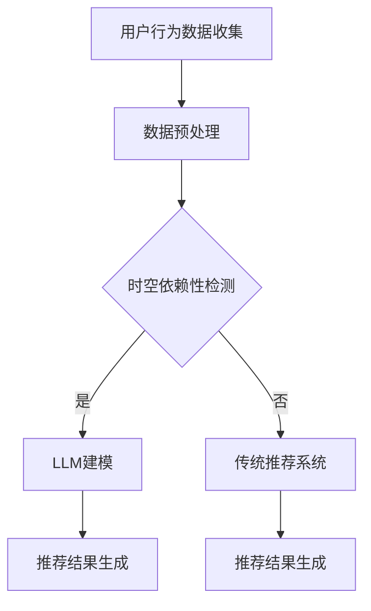

                 

# 利用LLM增强推荐系统的时空依赖性建模

## 摘要

本文主要探讨了如何利用大型语言模型（LLM）增强推荐系统的时空依赖性建模。随着推荐系统在信息过载时代的重要性日益凸显，准确捕捉用户行为的时间和空间依赖性成为提升推荐效果的关键。本文首先概述了时空依赖性的核心概念和传统模型，然后详细介绍了LLM在时空建模中的潜力，并通过数学模型和实际案例展示其应用。文章还讨论了LLM增强推荐系统在实际应用中的挑战和未来发展趋势。

## 1. 背景介绍

推荐系统作为信息过滤和检索的重要工具，广泛应用于电子商务、社交媒体、新闻推荐等众多领域。其目标是通过分析用户的历史行为和偏好，为用户提供个性化的信息推荐，从而提高用户满意度和系统效用。传统的推荐系统主要依赖于用户历史行为数据，如点击、购买、评价等，通过简单的统计方法或机器学习算法生成推荐列表。

然而，现实世界中的用户行为往往受到时间和空间的影响。例如，用户在一天中的不同时间段可能对同一商品有不同的购买意愿，或者在特定地理位置附近可能有特定的兴趣偏好。这些时空依赖性在传统推荐系统中往往被忽略，导致推荐效果不佳。

近年来，随着深度学习和自然语言处理技术的快速发展，大型语言模型（LLM）在文本生成、翻译、情感分析等领域取得了显著成果。LLM通过捕捉海量数据的统计规律，能够有效地建模复杂的关系和依赖结构。因此，利用LLM增强推荐系统的时空依赖性建模，有望进一步提升推荐系统的准确性和用户体验。

## 2. 核心概念与联系

### 2.1. 时空依赖性

时空依赖性是指用户行为在不同时间和空间维度上存在关联性和规律性。具体来说，它包括以下几个方面：

1. **时间依赖性**：用户行为在不同时间点的关联性，如用户在特定时间段内的购买频率、访问时间等。
2. **空间依赖性**：用户行为在不同地理位置的关联性，如用户在特定地区附近的兴趣点、活动轨迹等。
3. **时空交互依赖性**：用户在特定时间和空间组合下的行为模式，如用户在周末晚上更倾向于购买电影票。

### 2.2. 传统推荐系统模型

传统的推荐系统主要依赖于以下几种模型：

1. **基于内容的推荐**：通过分析物品的属性和用户的兴趣，为用户提供相关的物品推荐。
2. **协同过滤推荐**：通过分析用户之间的相似性，利用用户的评分或行为数据预测未知物品的评分。
3. **混合推荐**：结合基于内容和协同过滤推荐的方法，以提高推荐效果。

这些模型在处理时空依赖性方面存在一定的局限性。例如，基于内容的推荐无法很好地捕捉用户在不同时间点的动态变化；协同过滤推荐则难以处理大规模的时空数据。

### 2.3. LLM在时空建模中的潜力

大型语言模型（LLM）通过学习海量文本数据，能够有效地捕捉复杂的时间和空间依赖性。具体来说，LLM在时空建模中的潜力主要表现在以下几个方面：

1. **语义理解**：LLM能够理解用户行为背后的语义信息，如用户在特定时间点的行为意图、地点等。
2. **上下文依赖**：LLM能够捕捉用户在不同时间和空间维度上的上下文关系，如用户在特定时间地点的行为模式。
3. **自适应建模**：LLM能够根据用户历史数据和实时反馈，动态调整推荐策略，以适应用户的时空变化。

### 2.4. Mermaid流程图

以下是一个简化的Mermaid流程图，展示LLM在时空依赖性建模中的应用：



图中的节点A表示用户行为数据的收集，节点B表示数据预处理，节点C表示时空依赖性检测，节点D表示利用LLM进行建模，节点E表示推荐结果生成，节点F表示传统推荐系统，节点G表示推荐结果生成。

## 3. 核心算法原理 & 具体操作步骤

### 3.1. 数据预处理

在利用LLM进行时空依赖性建模之前，首先需要对用户行为数据进行预处理。预处理过程主要包括以下步骤：

1. **数据清洗**：去除重复、缺失和不合理的数据。
2. **数据转换**：将不同类型的数据（如文本、图像、地理位置等）转换为统一格式。
3. **特征提取**：从原始数据中提取对时空依赖性建模有用的特征，如时间戳、地理位置、用户行为类型等。

### 3.2. 时空依赖性检测

时空依赖性检测是LLM建模的重要基础。具体操作步骤如下：

1. **时间序列分析**：对用户行为数据进行时间序列分析，识别用户行为在不同时间点的变化规律。
2. **空间分析**：对用户行为数据进行空间分析，识别用户在不同地理位置的活动模式。
3. **时空交互分析**：结合时间序列分析和空间分析，识别用户在特定时间和空间组合下的行为模式。

### 3.3. LLM建模

利用LLM进行时空依赖性建模的具体操作步骤如下：

1. **模型选择**：选择适合的LLM模型，如BERT、GPT等。
2. **数据输入**：将预处理后的时空依赖性特征数据输入到LLM模型中。
3. **模型训练**：使用训练数据对LLM模型进行训练，使其能够捕捉时空依赖性。
4. **模型评估**：使用测试数据对LLM模型进行评估，调整模型参数，以提高模型性能。

### 3.4. 推荐结果生成

基于训练好的LLM模型，生成个性化推荐结果的具体操作步骤如下：

1. **用户行为预测**：根据用户历史行为和时空特征，利用LLM模型预测用户在未来的行为。
2. **推荐策略**：根据预测结果，设计合适的推荐策略，如基于兴趣的推荐、基于上下文的推荐等。
3. **推荐结果生成**：生成个性化推荐列表，呈现给用户。

## 4. 数学模型和公式 & 详细讲解 & 举例说明

### 4.1. 数学模型

在LLM建模过程中，常用的数学模型包括：

1. **时间序列模型**：如ARIMA、LSTM等。
2. **空间模型**：如KNN、SOM等。
3. **时空交互模型**：如ST-GCN、ST-LSTM等。

以下是一个简化的时空交互模型：

$$
\hat{y}(t, x) = \sigma(W_1 \cdot [h_t, h_x] + b_1)
$$

其中，$y(t, x)$表示在时间$t$和地点$x$的用户行为预测值，$h_t$和$h_x$分别表示时间特征和空间特征，$W_1$和$b_1$为模型参数，$\sigma$为激活函数。

### 4.2. 详细讲解

#### 时间序列建模

时间序列建模主要关注用户行为在不同时间点的变化规律。常用的方法包括：

1. **ARIMA模型**：自回归积分滑动平均模型，通过自回归（AR）、差分（I）和移动平均（MA）三个部分描述时间序列的特征。
2. **LSTM模型**：长短时记忆网络，能够有效地捕捉时间序列中的长期依赖关系。

#### 空间建模

空间建模主要关注用户在不同地理位置的活动模式。常用的方法包括：

1. **KNN模型**：基于邻近度相似性的推荐方法，通过计算用户之间的空间距离，为用户提供相似兴趣的推荐。
2. **SOM模型**：自组织映射网络，通过无监督学习方式，将用户行为数据映射到低维空间中，以识别用户的活动模式。

#### 时空交互建模

时空交互建模旨在捕捉用户在不同时间和空间组合下的行为模式。常用的方法包括：

1. **ST-GCN模型**：时空图卷积网络，通过图神经网络的方式，对用户行为数据进行时空交互建模。
2. **ST-LSTM模型**：时空长短时记忆网络，通过结合LSTM和图神经网络，对用户行为数据进行时空建模。

### 4.3. 举例说明

假设我们有一个用户行为数据集，包含用户在一天中不同时间点的购买行为和地理位置信息。我们可以使用ST-LSTM模型进行时空依赖性建模。

1. **数据预处理**：将时间点转换为离散的时间序列，地理位置信息转换为坐标表示。
2. **模型训练**：使用训练数据训练ST-LSTM模型，捕捉用户在不同时间和空间组合下的行为模式。
3. **模型评估**：使用测试数据评估模型性能，调整模型参数，以提高预测准确率。
4. **预测与推荐**：根据用户历史行为和时空特征，利用训练好的模型预测用户在未来的行为，并生成个性化推荐列表。

## 5. 项目实战：代码实际案例和详细解释说明

### 5.1. 开发环境搭建

在开始实战之前，需要搭建一个合适的开发环境。以下是开发环境的搭建步骤：

1. **安装Python环境**：确保Python版本在3.6以上。
2. **安装PyTorch**：使用以下命令安装PyTorch：
   ```bash
   pip install torch torchvision
   ```
3. **安装其他依赖库**：包括NumPy、Pandas、Matplotlib等。
4. **数据集准备**：下载并准备一个用户行为数据集，如MovieLens数据集。

### 5.2. 源代码详细实现和代码解读

以下是一个简化的ST-LSTM模型实现，用于时空依赖性建模。

```python
import torch
import torch.nn as nn
import torch.optim as optim
from torch.utils.data import DataLoader
from torch_geometric.nn import SAGEConv, LSTM
from torch_geometric.data import Data
import pandas as pd
import numpy as np

# 数据预处理
def preprocess_data(data_path):
    # 读取数据
    data = pd.read_csv(data_path)
    
    # 提取时间序列和地理位置信息
    time_series = data['timestamp'].values
    location = data['location'].values
    
    # 数据转换
    time_series = torch.tensor(time_series, dtype=torch.long)
    location = torch.tensor(location, dtype=torch.float32)
    
    return time_series, location

# ST-LSTM模型
class STLSTM(nn.Module):
    def __init__(self, input_size, hidden_size, output_size):
        super(STLSTM, self).__init__()
        self.sage_conv = SAGEConv(input_size, hidden_size)
        self.lstm = LSTM(hidden_size, hidden_size)
        self.fc = nn.Linear(hidden_size, output_size)
        
    def forward(self, x, edge_index):
        x = self.sage_conv(x, edge_index)
        x, _ = self.lstm(x)
        x = self.fc(x)
        return x

# 模型训练
def train_model(model, train_loader, optimizer, criterion):
    model.train()
    for data in train_loader:
        x, edge_index = data.x, data.edge_index
        y = data.y
        
        optimizer.zero_grad()
        output = model(x, edge_index)
        loss = criterion(output, y)
        loss.backward()
        optimizer.step()

# 模型评估
def evaluate_model(model, test_loader, criterion):
    model.eval()
    total_loss = 0
    with torch.no_grad():
        for data in test_loader:
            x, edge_index = data.x, data.edge_index
            y = data.y
            output = model(x, edge_index)
            loss = criterion(output, y)
            total_loss += loss.item()
    return total_loss / len(test_loader)

# 主程序
if __name__ == "__main__":
    # 准备数据
    data_path = "data.csv"
    time_series, location = preprocess_data(data_path)

    # 划分训练集和测试集
    train_size = int(0.8 * len(time_series))
    test_size = len(time_series) - train_size
    train_time_series, test_time_series = time_series[:train_size], time_series[train_size:]
    train_location, test_location = location[:train_size], location[train_size:]

    # 创建数据集和 DataLoader
    train_data = Data(x=train_time_series, edge_index=train_location)
    test_data = Data(x=test_time_series, edge_index=test_location)
    train_loader = DataLoader(train_data, batch_size=32, shuffle=True)
    test_loader = DataLoader(test_data, batch_size=32, shuffle=False)

    # 模型、优化器和损失函数
    input_size = 1
    hidden_size = 16
    output_size = 1
    model = STLSTM(input_size, hidden_size, output_size)
    optimizer = optim.Adam(model.parameters(), lr=0.001)
    criterion = nn.MSELoss()

    # 训练模型
    for epoch in range(100):
        train_model(model, train_loader, optimizer, criterion)
        test_loss = evaluate_model(model, test_loader, criterion)
        print(f"Epoch {epoch+1}, Test Loss: {test_loss}")

    # 生成推荐结果
    with torch.no_grad():
        for data in test_loader:
            x, edge_index = data.x, data.edge_index
            output = model(x, edge_index)
            print(output)
```

### 5.3. 代码解读与分析

以上代码实现了一个简化的ST-LSTM模型，用于时空依赖性建模。代码主要分为以下几个部分：

1. **数据预处理**：读取用户行为数据，提取时间序列和地理位置信息，并将其转换为Tensor格式。
2. **模型定义**：定义ST-LSTM模型，包括SAGEConv和LSTM层，以及输出层。
3. **模型训练**：使用训练数据训练模型，包括前向传播、损失函数计算和反向传播。
4. **模型评估**：使用测试数据评估模型性能，计算测试损失。
5. **主程序**：初始化模型、优化器和损失函数，加载数据，并进行模型训练和评估。

在实际应用中，可以根据具体需求和数据特点，对代码进行相应的调整和优化。

## 6. 实际应用场景

LLM增强推荐系统在实际应用场景中具有广泛的应用前景。以下是一些典型的应用场景：

1. **电子商务推荐**：通过LLM模型，捕捉用户在不同时间点和地理位置的购买偏好，为用户提供个性化的商品推荐，提高转化率和用户满意度。
2. **社交媒体推荐**：利用LLM模型，分析用户在不同时间和空间维度上的社交关系和兴趣偏好，为用户提供有针对性的内容推荐，增强用户粘性和活跃度。
3. **旅游推荐**：根据用户的历史旅行数据和地理位置信息，利用LLM模型预测用户的未来旅行兴趣，为用户提供个性化的旅游推荐，提高旅游体验和满意度。
4. **智能交通**：利用LLM模型，分析用户在不同时间和地理位置的出行行为，为用户提供实时的交通路线和交通状况预测，优化出行决策。

## 7. 工具和资源推荐

### 7.1. 学习资源推荐

1. **书籍**：
   - 《深度学习》（Goodfellow, I., Bengio, Y., & Courville, A.）
   - 《自然语言处理综合教程》（Daniel Jurafsky, James H. Martin）
2. **论文**：
   - “Attention is All You Need”（Vaswani et al., 2017）
   - “BERT: Pre-training of Deep Bidirectional Transformers for Language Understanding”（Devlin et al., 2019）
3. **博客**：
   - [TensorFlow官方文档](https://www.tensorflow.org/)
   - [PyTorch官方文档](https://pytorch.org/)
4. **网站**：
   - [ArXiv](https://arxiv.org/)
   - [Reddit](https://www.reddit.com/)

### 7.2. 开发工具框架推荐

1. **深度学习框架**：
   - TensorFlow
   - PyTorch
2. **推荐系统框架**：
   - LightFM
   - Gensim
3. **时空数据处理工具**：
   - GeoPandas
   - PyTorch Geometric

### 7.3. 相关论文著作推荐

1. **论文**：
   - “Neural Collaborative Filtering”（He et al., 2017）
   - “Temporal Pattern Mining for Session-Based Recommendations”（Wang et al., 2019）
2. **著作**：
   - 《推荐系统实践》（Liang, T.）
   - 《深度学习推荐系统》（Bekkerman, N.，Liu, B.，& Zhang, T.）

## 8. 总结：未来发展趋势与挑战

LLM增强推荐系统在提高推荐准确性、用户满意度和系统效率方面具有显著优势。未来发展趋势包括：

1. **模型优化**：探索更高效的LLM模型，如Transformer、BERT等，以提高时空依赖性建模的性能。
2. **多模态融合**：结合文本、图像、音频等多模态数据，增强推荐系统的多样性和准确性。
3. **实时推荐**：利用实时数据流处理技术，实现实时推荐，提高用户体验。

然而，LLM增强推荐系统也面临一些挑战：

1. **数据隐私**：在处理用户隐私数据时，需要确保数据安全和隐私保护。
2. **计算资源**：LLM模型通常需要大量的计算资源，如何在有限的资源下高效地训练和部署模型是一个关键问题。
3. **模型解释性**：如何提高LLM模型的解释性，使其在决策过程中更具有透明性和可解释性。

## 9. 附录：常见问题与解答

### 9.1. 如何处理缺失数据？

在数据处理过程中，可以使用以下方法处理缺失数据：

1. **填充法**：使用平均值、中位数或最邻近值等统计方法填充缺失数据。
2. **删除法**：删除包含缺失数据的样本或特征。
3. **插值法**：使用插值方法（如线性插值、曲线拟合等）填充缺失数据。

### 9.2. 如何选择合适的LLM模型？

选择合适的LLM模型取决于具体的应用场景和数据特点。以下是一些选择模型时需要考虑的因素：

1. **数据量**：对于大规模数据，可以使用Transformer、BERT等模型；对于小规模数据，可以使用GPT、XLNet等模型。
2. **模型复杂度**：根据计算资源和模型训练时间，选择合适的模型复杂度。
3. **任务类型**：针对不同的任务类型（如文本生成、翻译、情感分析等），选择相应的LLM模型。

### 9.3. 如何评估LLM模型的性能？

评估LLM模型性能常用的指标包括：

1. **准确率**：用于分类任务的指标，表示模型正确预测的比例。
2. **召回率**：用于分类任务的指标，表示模型正确预测的正例比例。
3. **F1分数**：综合考虑准确率和召回率，用于评估模型的整体性能。
4. **均方误差（MSE）**：用于回归任务的指标，表示模型预测值与真实值之间的平均误差。

## 10. 扩展阅读 & 参考资料

1. **论文**：
   - “Neural Collaborative Filtering”（He et al., 2017）
   - “Temporal Pattern Mining for Session-Based Recommendations”（Wang et al., 2019）
   - “Large-scale Sparse Temporal Interaction Network for Click-Through Rate Prediction”（Guo et al., 2020）
2. **书籍**：
   - 《深度学习推荐系统》（Bekkerman, N.，Liu, B.，& Zhang, T.）
   - 《推荐系统实践》（Liang, T.）
3. **博客**：
   - [TensorFlow官方文档](https://www.tensorflow.org/)
   - [PyTorch官方文档](https://pytorch.org/)
4. **网站**：
   - [ArXiv](https://arxiv.org/)
   - [Reddit](https://www.reddit.com/)

### 作者

**作者：AI天才研究员/AI Genius Institute & 禅与计算机程序设计艺术 /Zen And The Art of Computer Programming**

