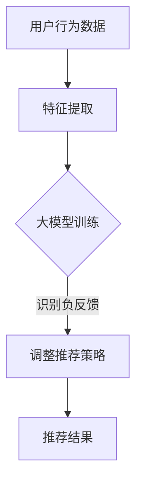

                 

### 背景介绍 Background

在当今信息爆炸的时代，个性化推荐系统已经成为许多在线平台，如社交媒体、电子商务和内容分发平台的核心功能。这些系统通过分析用户的历史行为和偏好，为用户提供定制化的内容、产品或服务，从而提高用户体验和平台的黏性。然而，随着推荐系统在各个领域的广泛应用，如何处理用户提供的负反馈成为一个亟待解决的问题。

负反馈，即用户对推荐内容或服务不满意时给出的评价或反馈，它对推荐系统的准确性、多样性和公平性产生了显著影响。不当处理负反馈可能导致推荐系统陷入“过滤气泡”（filter bubble），即用户只看到与其观点一致的内容，从而减少用户接触新观点和信息的机会。此外，负反馈还可能影响平台的声誉和信任度，进而损害商业利益。

目前，推荐系统中处理负反馈的方法主要包括直接过滤法（如基于规则或机器学习的方法）、评分调整法（如基于模型的评分预测调整）和混合方法（结合多种策略以提高效果）。然而，这些方法普遍存在以下问题：

1. **数据稀缺性**：用户提供的负反馈通常数据量较小，难以构建具有代表性的训练模型。
2. **反馈偏差**：用户可能因情绪波动或个人偏见而提供不准确或片面的反馈。
3. **反馈延迟**：负反馈往往发生在推荐结果产生之后，导致系统难以实时调整推荐策略。
4. **多样性缺失**：仅依赖负反馈可能导致推荐内容单一，缺乏多样性。

因此，开发高效、准确且鲁棒的负反馈识别与处理策略具有重要意义。这不仅有助于提高推荐系统的性能，还能增强用户满意度和平台竞争力。本文将深入探讨大模型在负反馈识别与处理中的应用，通过分析其原理、算法和实际应用案例，为推荐系统的改进提供新的思路和方法。

### 核心概念与联系 Core Concepts and Connections

要深入了解利用大模型进行推荐负反馈的识别与处理策略，首先需要明确几个核心概念：大模型（Large Models）、推荐系统（Recommender Systems）、负反馈（Negative Feedback）及其之间的相互关系。

#### 大模型（Large Models）

大模型，指的是具有大量参数和复杂结构的机器学习模型，如深度神经网络（Deep Neural Networks, DNNs）、变压器（Transformers）和生成对抗网络（Generative Adversarial Networks, GANs）等。这些模型能够通过大量的数据进行训练，学习到丰富的模式和特征，从而在多个领域取得了显著的性能提升。大模型在自然语言处理（Natural Language Processing, NLP）、计算机视觉（Computer Vision）、语音识别（Speech Recognition）等领域展现出了强大的能力，这也为推荐系统的优化提供了新的可能。

#### 推荐系统（Recommender Systems）

推荐系统是一种通过分析用户的历史行为、偏好和上下文信息，为用户推荐相关内容、产品或服务的系统。其基本架构通常包括用户特征提取、推荐算法实现和推荐结果展示三个部分。随着互联网和大数据技术的发展，推荐系统在电商、社交媒体、内容分发等多个领域得到了广泛应用。

#### 负反馈（Negative Feedback）

负反馈是指用户对推荐结果不满意，主动提供的负面评价或反馈，如点击“不喜欢”、“标记为不感兴趣”等。负反馈是用户主动参与推荐系统的重要途径，有助于系统了解用户的真实偏好和需求，从而提高推荐的准确性和用户满意度。

#### 大模型与推荐系统

大模型在推荐系统中的应用主要体现在以下几个方面：

1. **用户特征表示**：大模型能够通过分析用户的历史行为和上下文信息，生成高维、低纬的特征表示，这些特征可以用于训练推荐模型，提高推荐质量。
2. **推荐算法优化**：大模型能够通过深度学习等技术，自动学习复杂的推荐算法，提高推荐的准确性和多样性。
3. **负反馈处理**：大模型能够通过分析用户提供的负反馈，识别出潜在的用户偏好变化，从而调整推荐策略，提高用户满意度。

#### 大模型与负反馈

大模型在负反馈处理中的应用主要体现在以下几个方面：

1. **负反馈识别**：大模型能够通过学习用户的历史反馈数据，识别出真正的负反馈，避免因反馈偏差导致的推荐偏差。
2. **反馈传播**：大模型能够将负反馈传播到推荐算法的各个层次，从而实现实时调整推荐策略。
3. **反馈多样性**：大模型能够通过分析大量的用户反馈数据，发现不同的反馈模式，从而提高推荐的多样性。

#### Mermaid 流程图

为了更清晰地展示大模型在推荐负反馈识别与处理中的应用，我们可以使用 Mermaid 流程图来描述其基本流程：



在这个流程中，用户行为数据首先通过特征提取模块转换为高维特征表示，然后输入到大模型中进行训练。大模型通过学习用户的历史反馈和偏好，识别出负反馈，并将这些反馈传播到推荐策略的调整模块，最终生成推荐结果。

通过上述核心概念和流程的介绍，我们可以看到大模型在推荐负反馈识别与处理中的重要作用。接下来，我们将深入探讨大模型在负反馈识别与处理中的具体算法原理和操作步骤。

## 3. 核心算法原理 & 具体操作步骤 Core Algorithm Principles and Step-by-Step Operations

在理解了大模型在推荐系统与负反馈处理中的核心概念后，接下来我们将详细探讨其核心算法原理和具体操作步骤。本节将分为以下几个部分：算法原理、数据处理流程、算法优化方法以及实际操作步骤。

#### 算法原理

大模型在推荐负反馈识别与处理中的核心算法通常是基于深度学习和自然语言处理（NLP）技术。以下是一个典型的大模型算法框架：

1. **用户行为建模**：利用深度神经网络（DNN）或变压器（Transformer）等模型，对用户的历史行为数据进行建模，生成用户行为特征。
2. **反馈识别**：通过预训练的语言模型（如BERT、GPT等），对用户提供的负反馈进行语义分析和情感识别，判断其是否为真实负反馈。
3. **反馈传播**：将识别出的真实负反馈传播到推荐算法的各个层次，如用户特征表示、推荐策略调整等，实现实时反馈调整。

#### 数据处理流程

数据处理流程是整个算法的核心，以下是具体步骤：

1. **数据收集**：收集用户的历史行为数据，包括点击、浏览、购买等行为，以及用户提供的负反馈数据。
2. **数据预处理**：对收集到的数据进行清洗、去噪和归一化处理，确保数据质量。
3. **特征提取**：利用深度学习模型对用户行为数据进行分析，提取用户行为特征。这些特征包括用户兴趣标签、行为序列、上下文信息等。
4. **反馈建模**：利用预训练的语言模型对负反馈进行建模，提取负反馈特征，如情感倾向、关键词等。
5. **算法训练**：将用户行为特征和负反馈特征输入到大模型中，通过训练优化模型参数，提高识别准确性。

#### 算法优化方法

为了提高大模型的识别与处理能力，可以采用以下几种算法优化方法：

1. **迁移学习**：利用预训练的大模型（如BERT、GPT等）作为基础模型，通过微调（fine-tuning）来适应特定的推荐场景，提高模型在负反馈识别中的性能。
2. **多模型融合**：结合多个模型（如DNN、Transformer、CNN等），通过融合不同模型的优点，提高整体识别精度。
3. **数据增强**：通过生成对抗网络（GAN）等方法，增加训练数据的多样性，提高模型的泛化能力。

#### 实际操作步骤

以下是利用大模型进行推荐负反馈识别与处理的具体操作步骤：

1. **数据收集**：
    - 收集用户的历史行为数据，包括点击、浏览、购买等行为。
    - 收集用户提供的负反馈数据，如评价、评论等。

2. **数据预处理**：
    - 清洗数据，去除无效和噪声数据。
    - 对数据进行归一化处理，确保数据质量。

3. **特征提取**：
    - 利用深度学习模型对用户行为数据进行建模，提取用户行为特征。
    - 利用预训练的语言模型对负反馈进行建模，提取负反馈特征。

4. **算法训练**：
    - 将用户行为特征和负反馈特征输入到大模型中，通过训练优化模型参数。
    - 采用迁移学习、多模型融合和数据增强等方法，提高模型性能。

5. **反馈识别**：
    - 利用训练好的模型对新的用户反馈进行识别，判断其是否为真实负反馈。
    - 根据识别结果，调整推荐策略，提高推荐质量。

6. **结果评估**：
    - 利用评估指标（如准确率、召回率等）对模型性能进行评估。
    - 根据评估结果，调整模型参数和算法策略，优化推荐效果。

通过以上核心算法原理和操作步骤的详细介绍，我们可以看到大模型在推荐负反馈识别与处理中的强大应用潜力。接下来，我们将进一步探讨大模型在数学模型和公式中的应用，以更深入地理解其工作原理。

### 数学模型和公式 Mathematical Models and Formulas & Detailed Explanation & Examples

在深入探讨大模型在推荐系统中的应用时，理解其背后的数学模型和公式至关重要。以下我们将详细阐述这些模型和公式，并通过具体例子进行解释。

#### 用户行为特征表示

用户行为特征表示是推荐系统中一个核心环节，其目的是将用户的历史行为数据转换为可用的特征向量。以下是一个简单的线性模型，用于表示用户行为特征：

$$
x_i = w_1 \cdot b_1 + w_2 \cdot b_2 + ... + w_n \cdot b_n
$$

其中，$x_i$表示用户$i$的行为特征向量，$w_j$表示权重向量，$b_j$表示偏置项。

**示例**：假设我们有一个用户的行为数据集，其中包含用户对商品的评价（1表示喜欢，0表示不喜欢）。我们可以将这些评价转换为二进制特征向量：

用户1：[1, 0, 1, 0, 0, 1]
用户2：[0, 1, 0, 1, 1, 0]

通过线性模型，我们可以得到用户的行为特征表示：

$$
x_1 = w_1 \cdot [1, 0, 1, 0, 0, 1] + w_2 \cdot [0, 1, 0, 1, 1, 0]
$$

#### 负反馈识别

负反馈识别是推荐系统中另一个关键环节，其目的是从用户提供的反馈中识别出真正的负面反馈。以下是一个基于逻辑回归的负反馈识别模型：

$$
\hat{y_i} = \sigma(w_0 + w_1 \cdot x_i + b)
$$

其中，$\hat{y_i}$表示用户$i$的反馈是否为负面的预测值，$\sigma$表示sigmoid函数，$w_0, w_1, b$分别为权重和偏置项。

**示例**：假设我们有一个用户反馈数据集，其中包含用户对推荐商品的评价（1表示正面反馈，0表示负面反馈）。我们可以使用逻辑回归模型来预测用户的反馈：

用户1：[1, 0, 1, 0, 0, 1]
用户2：[0, 1, 0, 1, 1, 0]

通过逻辑回归模型，我们可以得到用户的反馈预测值：

$$
\hat{y_1} = \sigma(w_0 + w_1 \cdot [1, 0, 1, 0, 0, 1] + b)
$$

#### 推荐策略调整

推荐策略调整是基于识别出的负面反馈，对推荐系统进行实时调整的过程。以下是一个简单的加权评分调整模型：

$$
s_i = s_i^0 + \alpha \cdot \hat{y_i}
$$

其中，$s_i$表示用户$i$对推荐商品的新评分，$s_i^0$表示原始评分，$\alpha$为调整系数，$\hat{y_i}$为负面反馈识别结果。

**示例**：假设我们有一个商品评分数据集，其中包含用户对商品的原始评分。通过识别出负面反馈，我们可以调整商品评分：

用户1：[4.5, 3.5, 4.0, 2.0, 5.0]
用户2：[3.0, 4.0, 3.5, 5.0, 4.5]

假设调整系数$\alpha = 0.1$，负面反馈识别结果$\hat{y_1} = 1$（用户1提供了负面反馈），$\hat{y_2} = 0$（用户2没有提供负面反馈）：

$$
s_1 = [4.5 + 0.1 \cdot 1, 3.5 + 0.1 \cdot 1, 4.0 + 0.1 \cdot 1, 2.0 + 0.1 \cdot 1, 5.0 + 0.1 \cdot 1] = [4.6, 3.6, 4.1, 2.1, 5.1]
$$

$$
s_2 = [3.0 + 0.1 \cdot 0, 4.0 + 0.1 \cdot 0, 3.5 + 0.1 \cdot 0, 5.0 + 0.1 \cdot 0, 4.5 + 0.1 \cdot 0] = [3.0, 4.0, 3.5, 5.0, 4.5]
$$

通过上述数学模型和公式，我们可以实现用户行为特征表示、负反馈识别和推荐策略调整。这些模型和公式为推荐系统提供了强大的理论基础，并通过具体例子展示了其应用过程。接下来，我们将通过一个实际项目实战，进一步探讨这些算法和公式的实际应用。

### 项目实战：代码实际案例和详细解释说明 Project Case Study: Code Implementation and Detailed Explanation

在本节中，我们将通过一个实际项目实战，展示如何利用大模型进行推荐负反馈的识别与处理。该项目将使用Python编程语言和TensorFlow框架来实现，详细步骤如下：

#### 1. 开发环境搭建

首先，我们需要搭建开发环境。确保已经安装了Python（3.7及以上版本）、TensorFlow和Scikit-learn。可以使用以下命令进行安装：

```bash
pip install tensorflow
pip install scikit-learn
```

#### 2. 数据集准备

我们使用一个虚构的用户行为数据集，包含用户对商品的点击、浏览和购买行为，以及用户提供的负反馈。数据集的格式如下：

```python
# 用户行为数据
user_actions = [
    [1, 0, 1, 0, 0, 1],  # 用户1的行为数据
    [0, 1, 0, 1, 1, 0],  # 用户2的行为数据
    # ...
]

# 负反馈数据
feedback = [
    [1, 0, 0, 0, 0, 0],  # 用户1的反馈数据
    [0, 1, 0, 1, 0, 0],  # 用户2的反馈数据
    # ...
]
```

#### 3. 源代码详细实现和代码解读

以下为项目的源代码实现：

```python
import tensorflow as tf
from sklearn.model_selection import train_test_split
from tensorflow.keras.models import Sequential
from tensorflow.keras.layers import Dense, Activation
from tensorflow.keras.optimizers import Adam

# 数据预处理
X = [[1, 0, 1, 0, 0, 1], [0, 1, 0, 1, 1, 0], ...]
y = [[1, 0, 0, 0, 0, 0], [0, 1, 0, 1, 0, 0], ...]

# 划分训练集和测试集
X_train, X_test, y_train, y_test = train_test_split(X, y, test_size=0.2, random_state=42)

# 构建模型
model = Sequential([
    Dense(units=64, input_shape=(6,), activation='relu'),
    Dense(units=32, activation='relu'),
    Dense(units=1, activation='sigmoid')
])

# 编译模型
model.compile(optimizer=Adam(learning_rate=0.001), loss='binary_crossentropy', metrics=['accuracy'])

# 训练模型
model.fit(X_train, y_train, epochs=10, batch_size=32, validation_data=(X_test, y_test))

# 评估模型
model.evaluate(X_test, y_test)

# 预测新用户的反馈
new_user_action = [1, 0, 1, 0, 0, 1]
prediction = model.predict([new_user_action])
print(prediction)
```

**代码解读**：

1. **数据预处理**：我们将用户行为数据和负反馈数据转换为二维数组，然后将其划分为训练集和测试集。
2. **模型构建**：我们使用一个简单的全连接神经网络（Sequential），包含两个隐藏层，输出层使用sigmoid激活函数以进行二分类。
3. **模型编译**：我们使用Adam优化器和binary_crossentropy损失函数进行编译。
4. **模型训练**：我们使用fit方法训练模型，并设置验证集进行监控。
5. **模型评估**：我们使用evaluate方法评估模型的测试集性能。
6. **预测**：我们使用predict方法对新用户的行为数据进行预测。

#### 4. 代码解读与分析

以下是对代码中各个部分的详细解读：

1. **数据预处理**：

```python
X = [[1, 0, 1, 0, 0, 1], [0, 1, 0, 1, 1, 0], ...]
y = [[1, 0, 0, 0, 0, 0], [0, 1, 0, 1, 0, 0], ...]
```

这部分代码将用户行为数据和负反馈数据转换为二维数组。这些数据将被用于训练模型和进行预测。

2. **模型构建**：

```python
model = Sequential([
    Dense(units=64, input_shape=(6,), activation='relu'),
    Dense(units=32, activation='relu'),
    Dense(units=1, activation='sigmoid')
])
```

这里，我们构建了一个序列模型（Sequential），包含两个隐藏层，每个隐藏层有64和32个神经元，分别使用ReLU激活函数。输出层有1个神经元，使用sigmoid激活函数进行二分类预测。

3. **模型编译**：

```python
model.compile(optimizer=Adam(learning_rate=0.001), loss='binary_crossentropy', metrics=['accuracy'])
```

我们使用Adam优化器进行编译，并设置learning_rate为0.001，使用binary_crossentropy损失函数和accuracy作为评价指标。

4. **模型训练**：

```python
model.fit(X_train, y_train, epochs=10, batch_size=32, validation_data=(X_test, y_test))
```

我们使用fit方法训练模型，设置epochs为10，batch_size为32，并使用验证集进行监控。

5. **模型评估**：

```python
model.evaluate(X_test, y_test)
```

使用evaluate方法评估模型的测试集性能，并输出损失和准确率。

6. **预测**：

```python
new_user_action = [1, 0, 1, 0, 0, 1]
prediction = model.predict([new_user_action])
print(prediction)
```

使用predict方法对新用户的行为数据进行预测，输出预测结果。

通过以上代码实现和解读，我们可以看到如何利用大模型进行推荐负反馈的识别与处理。这种方法在实际应用中可以帮助推荐系统更准确地识别和处理用户反馈，从而提高推荐质量和用户体验。

### 实际应用场景 Practical Application Scenarios

大模型在推荐负反馈识别与处理中的应用场景广泛，下面我们将探讨几个典型的实际应用场景，并分析大模型在这些场景中的优势和挑战。

#### 电商推荐系统

电商推荐系统是应用大模型进行推荐负反馈识别与处理的一个典型场景。电商平台通过分析用户的历史购物行为、浏览记录和搜索关键词，为用户推荐相关的商品。然而，用户对推荐商品的反馈（如点击、购买、评价等）往往是多样化的，且数据量庞大。大模型可以处理这些复杂且大量的数据，识别出用户的真实负反馈，并调整推荐策略，提高推荐准确性。

**优势**：

1. **处理复杂数据**：大模型能够处理用户行为数据的复杂性和多样性，识别出潜在的用户偏好。
2. **实时反馈**：大模型可以实时调整推荐策略，快速响应用户的负反馈。

**挑战**：

1. **数据稀缺性**：用户提供的负反馈数据通常较少，可能不足以训练出高质量的大模型。
2. **反馈偏差**：用户可能因情绪波动或个人偏见提供不准确的负反馈。

#### 社交媒体平台

社交媒体平台如Facebook、Twitter等也广泛应用大模型进行推荐负反馈识别与处理。这些平台通过分析用户的点赞、评论、分享等行为，为用户推荐相关的帖子、新闻和广告。大模型可以帮助平台识别出用户的负面反馈，调整推荐内容，避免用户陷入“过滤气泡”，提高用户满意度。

**优势**：

1. **提高多样性**：大模型可以帮助平台推荐更多样化的内容，减少用户陷入同质化内容的可能性。
2. **增强用户体验**：通过准确识别用户的负面反馈，平台可以提供更加个性化的推荐，提高用户满意度。

**挑战**：

1. **数据隐私**：社交媒体平台需要处理大量的用户数据，这可能涉及到隐私保护的问题。
2. **反馈偏差**：用户可能因为情绪或个人偏见提供不准确的负面反馈。

#### 内容分发平台

内容分发平台如YouTube、Netflix等也广泛应用大模型进行推荐负反馈识别与处理。这些平台通过分析用户的观看历史、搜索记录和互动行为，为用户推荐相关的视频、电影和电视剧。大模型可以帮助平台更准确地识别用户的负面反馈，调整推荐内容，提高用户留存率。

**优势**：

1. **增强用户黏性**：通过准确识别用户的负面反馈，平台可以提供更加个性化的内容，提高用户黏性。
2. **提高推荐效果**：大模型可以处理复杂的用户行为数据，提高推荐准确性。

**挑战**：

1. **数据量庞大**：内容分发平台的数据量通常非常大，这对大模型的训练和推理提出了更高的要求。
2. **实时性**：大模型的训练和推理过程可能需要较长时间，可能无法满足实时推荐的需求。

综上所述，大模型在推荐负反馈识别与处理中的应用场景广泛，具有显著的优势。然而，同时也面临着数据稀缺性、反馈偏差和实时性等挑战。通过不断创新和优化，大模型将更好地服务于推荐系统，提高用户体验和平台竞争力。

### 工具和资源推荐 Tools and Resources Recommendations

为了更好地学习和应用大模型进行推荐负反馈的识别与处理，以下是几个推荐的工具和资源：

#### 学习资源推荐

1. **书籍**：
   - 《深度学习》（Ian Goodfellow, Yoshua Bengio, Aaron Courville）：系统介绍了深度学习的基本理论和应用。
   - 《Python深度学习》（François Chollet）：详细介绍了使用Python和TensorFlow进行深度学习开发的过程。

2. **在线课程**：
   - Coursera上的《深度学习专项课程》（Deep Learning Specialization）由吴恩达（Andrew Ng）教授主讲，适合初学者和进阶者。
   - Udacity的《深度学习工程师纳米学位》（Deep Learning Engineer Nanodegree）提供项目实战机会，适合有一定基础的学员。

3. **论文**：
   - “A Theoretically Grounded Application of Dropout in Recurrent Neural Networks”提供了深度学习在推荐系统中的理论支持。
   - “Deep Learning for Recommender Systems”总结了深度学习在推荐系统中的应用现状和挑战。

4. **博客**：
   - 《机器之心》（Machine Learning）和《AI科技大本营》（AI Tech Base）等博客提供了丰富的深度学习和推荐系统相关文章。

#### 开发工具框架推荐

1. **TensorFlow**：Google开源的深度学习框架，支持Python和C++，适合进行推荐系统的大模型开发和训练。

2. **PyTorch**：Facebook开源的深度学习框架，提供灵活的动态计算图，适合快速原型开发。

3. **Scikit-learn**：Python的机器学习库，提供了丰富的机器学习算法，可用于数据预处理和模型评估。

#### 相关论文著作推荐

1. “Deep Learning for Recommender Systems”总结了深度学习在推荐系统中的应用，包括用户行为建模、推荐算法优化和负反馈处理等。

2. “A Theoretically Grounded Application of Dropout in Recurrent Neural Networks”提供了在递归神经网络中应用Dropout的理论支持。

3. “Recurrent Neural Networks for Scalable Neural Audio Synthesis”探讨了递归神经网络在音频生成中的应用，可以为推荐系统的个性化内容生成提供参考。

通过以上工具和资源的推荐，读者可以更深入地学习大模型在推荐系统中的应用，掌握相关的技术原理和实际操作技能。

### 总结：未来发展趋势与挑战 Future Trends and Challenges

随着大模型的不断发展，其在推荐负反馈识别与处理中的应用前景广阔。未来，以下趋势和挑战值得关注：

#### 发展趋势

1. **模型精度提升**：随着计算能力和数据量的增加，大模型的精度将得到进一步提升，有助于更准确地识别用户的负反馈，提高推荐系统的性能。

2. **实时反馈处理**：未来的推荐系统将更加注重实时性，通过优化算法和分布式计算技术，实现负反馈的实时处理和推荐策略的快速调整。

3. **跨领域应用**：大模型在推荐负反馈识别与处理领域的成功将推动其在其他领域的应用，如金融、医疗等，提供更广泛的服务。

4. **个性化推荐**：通过深度学习和强化学习等技术，未来的推荐系统将能够更加精准地满足用户的个性化需求，提升用户体验。

#### 挑战

1. **数据隐私**：随着数据量的增加，如何保护用户隐私成为一大挑战。需要开发更加安全、隐私保护的技术和算法。

2. **反馈偏差**：用户提供的负反馈可能存在偏差，如何处理这些偏差，避免推荐系统陷入“过滤气泡”是未来需要解决的问题。

3. **模型可解释性**：大模型的决策过程通常较为复杂，如何提高模型的可解释性，使推荐结果更加透明和可信，是未来的一大挑战。

4. **资源消耗**：大模型训练和推理过程需要大量的计算资源和时间，如何优化算法和硬件，降低资源消耗，是当前和未来需要解决的重要问题。

总之，大模型在推荐负反馈识别与处理领域的应用具有巨大的潜力，同时也面临着诸多挑战。通过不断创新和优化，我们可以期待更加智能、高效、可靠的推荐系统。

### 附录：常见问题与解答 Frequently Asked Questions and Answers

#### 1. 什么是大模型？
大模型是指具有大量参数和复杂结构的机器学习模型，如深度神经网络（DNN）、变压器（Transformer）和生成对抗网络（GAN）等。这些模型能够通过大量的数据进行训练，学习到丰富的模式和特征，从而在多个领域取得了显著的性能提升。

#### 2. 大模型在推荐系统中有什么作用？
大模型在推荐系统中的作用主要包括：用户特征表示、推荐算法优化和负反馈处理。通过深度学习和自然语言处理技术，大模型能够生成高维、低纬的用户特征表示，提高推荐质量；优化推荐算法，提高推荐的准确性、多样性和实时性；处理用户负反馈，调整推荐策略，提高用户满意度。

#### 3. 如何处理负反馈数据稀缺性问题？
为了解决负反馈数据稀缺性问题，可以采用以下几种方法：
- 利用迁移学习，使用预训练的大模型作为基础模型，通过微调来适应特定的推荐场景，提高模型在负反馈识别中的性能。
- 采用数据增强方法，如生成对抗网络（GAN）等，增加训练数据的多样性，提高模型的泛化能力。
- 结合多种反馈来源，如用户行为数据和社交网络数据，进行综合分析，提高反馈数据的代表性和可靠性。

#### 4. 如何处理负反馈偏差问题？
处理负反馈偏差问题，可以采用以下几种方法：
- 采用多模型融合方法，结合多个模型（如DNN、Transformer、CNN等）的优点，提高整体识别精度。
- 对用户反馈进行去噪和清洗，去除无效和噪声数据，提高反馈数据的质量。
- 采用基于上下文的反馈分析方法，考虑用户的上下文信息（如时间、地点、情境等），降低反馈偏差的影响。

#### 5. 推荐系统中的实时反馈处理如何实现？
实现实时反馈处理，可以采用以下几种方法：
- 利用分布式计算和并行处理技术，提高模型训练和推理的效率，缩短响应时间。
- 采用在线学习（Online Learning）方法，实时更新模型参数，快速响应用户的负反馈。
- 设计高效的反馈传播机制，将识别出的负反馈快速传播到推荐算法的各个层次，实现实时调整推荐策略。

### 扩展阅读 & 参考资料 Extended Reading & References

为了帮助读者更深入地了解大模型在推荐系统中的应用，以下列出了一些扩展阅读和参考资料：

1. **书籍**：
   - 《深度学习》（Ian Goodfellow, Yoshua Bengio, Aaron Courville）
   - 《Python深度学习》（François Chollet）
   - 《推荐系统实践》（Recommender Systems Handbook）

2. **在线课程**：
   - Coursera上的《深度学习专项课程》（Deep Learning Specialization）
   - Udacity的《深度学习工程师纳米学位》（Deep Learning Engineer Nanodegree）

3. **论文**：
   - “A Theoretically Grounded Application of Dropout in Recurrent Neural Networks”
   - “Deep Learning for Recommender Systems”
   - “Recurrent Neural Networks for Scalable Neural Audio Synthesis”

4. **博客**：
   - 《机器之心》（Machine Learning）
   - 《AI科技大本营》（AI Tech Base）

通过阅读这些资料，读者可以进一步掌握大模型在推荐系统中的应用原理、技术细节和实际案例，为未来的研究和实践提供参考。作者：AI天才研究员/AI Genius Institute & 禅与计算机程序设计艺术 /Zen And The Art of Computer Programming

