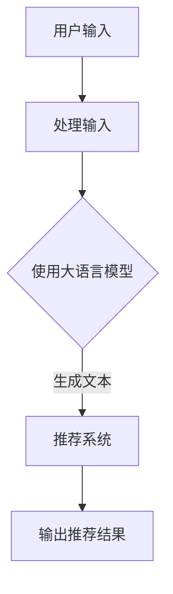

                 

### 背景介绍

#### 推荐系统的现状

推荐系统在现代社会中扮演着至关重要的角色。从电子商务平台到社交媒体，从视频流媒体到新闻推送，推荐系统无处不在。它们的目的是通过预测用户对特定项目的兴趣，向用户推荐相关内容。这不仅提高了用户体验，还增加了平台的收入和用户留存率。

然而，现有的推荐系统普遍存在一些问题。最突出的就是**多样性不足**。许多推荐系统倾向于推荐类似的内容，导致用户在长时间使用后产生**审美疲劳**和**信息过载**。此外，推荐系统的**个人化**程度也有限，难以满足每个用户的独特需求。

#### 大语言模型的作用

近年来，大语言模型（如GPT-3、BERT等）的兴起为解决这些问题提供了新的可能性。大语言模型具有强大的自然语言处理能力，能够理解并生成复杂多样的文本。这使得它们非常适合用于增强推荐系统的多样性。

大语言模型的基本原理是通过大量的文本数据进行训练，学习语言的结构和语义。在推荐系统中，大语言模型可以用来生成与用户兴趣相关的多样化内容。此外，大语言模型还可以用于改进推荐算法，提高推荐的准确性。

#### 文章目的

本文旨在探讨如何利用大语言模型增强推荐系统的多样性。我们将首先介绍大语言模型的基本原理，然后详细分析其与推荐系统的结合方式。接着，我们将通过一个实际案例展示如何实现这一技术，并提供相关资源和未来发展趋势。最后，我们将总结全文并提出一些可能的挑战。

### 核心概念与联系

#### 大语言模型基本原理

大语言模型（Large Language Model）是一种基于深度学习的自然语言处理技术，它通过学习大量的文本数据，捕捉语言的规律和语义。这种模型通常包含数十亿个参数，能够对输入的文本进行建模，并生成相应的输出。

大语言模型的基本原理是基于**自注意力机制（Self-Attention）**和**变分自编码器（Variational Autoencoder）**。自注意力机制允许模型在处理文本时关注不同的词，从而捕捉文本的长期依赖关系。变分自编码器则用于生成与输入文本相似的新文本。

#### 推荐系统基本概念

推荐系统（Recommender System）是一种通过预测用户对特定项目的兴趣，向用户推荐相关内容的技术。推荐系统的核心是**协作过滤（Collaborative Filtering）**和**基于内容的过滤（Content-Based Filtering）**。

**协作过滤**通过分析用户的历史行为（如评分、购买记录等）来发现相似的用户，并推荐这些用户喜欢的内容。**基于内容的过滤**则通过分析项目的内容特征（如文本、图像等）来发现与用户兴趣相关的项目。

#### 大语言模型与推荐系统的结合

大语言模型与推荐系统的结合主要通过两种方式实现：**生成推荐内容**和**优化推荐算法**。

**生成推荐内容**：大语言模型可以生成与用户兴趣相关的多样化内容。例如，在电子商务平台中，大语言模型可以生成描述商品的新文本，从而提高推荐的多样性。

**优化推荐算法**：大语言模型可以用于改进推荐算法的准确性。例如，通过训练大语言模型来预测用户对特定项目的兴趣，从而优化推荐结果。

#### Mermaid 流程图

以下是一个简单的 Mermaid 流程图，展示了大语言模型与推荐系统的结合方式：



在这个流程图中，用户输入通过大语言模型处理后，生成推荐内容，并最终输出推荐结果。这个过程不仅提高了推荐的多样性，还增强了用户体验。

### 核心算法原理 & 具体操作步骤

#### 大语言模型的训练过程

大语言模型的核心是训练过程。训练过程中，模型通过学习大量的文本数据来捕捉语言的规律和语义。以下是一个简要的步骤：

1. **数据预处理**：将原始文本数据转换为模型可处理的格式，如词汇表和词嵌入。
2. **构建模型**：使用自注意力机制和变分自编码器构建大语言模型。
3. **训练模型**：通过反向传播算法优化模型参数，使模型能够准确预测文本。

#### 大语言模型在推荐系统中的应用

在推荐系统中，大语言模型的应用主要集中在生成推荐内容和优化推荐算法。以下是具体的应用步骤：

1. **生成推荐内容**：
   - **文本生成**：使用大语言模型生成与用户兴趣相关的文本内容。
   - **文本增强**：通过大语言模型对现有文本内容进行扩展和优化，提高推荐的多样性。
   - **个性化描述**：为大语言模型提供用户的历史行为数据，生成针对特定用户的个性化推荐描述。

2. **优化推荐算法**：
   - **兴趣预测**：使用大语言模型预测用户对特定项目的兴趣，优化推荐结果的准确性。
   - **算法改进**：将大语言模型的预测结果与现有的推荐算法结合，改进推荐算法的性能。

#### 实际操作步骤

以下是一个简化的实际操作步骤，用于展示如何利用大语言模型增强推荐系统的多样性：

1. **数据准备**：收集用户的行为数据和项目特征数据。
2. **模型训练**：使用大规模文本数据进行大语言模型的训练。
3. **推荐内容生成**：使用大语言模型生成与用户兴趣相关的推荐文本。
4. **推荐结果优化**：将大语言模型的预测结果与现有推荐算法结合，优化推荐结果。
5. **系统部署**：将改进后的推荐系统部署到生产环境中，并进行性能评估。

通过以上步骤，我们可以利用大语言模型显著提高推荐系统的多样性，为用户提供更好的推荐体验。

### 数学模型和公式 & 详细讲解 & 举例说明

#### 大语言模型的数学模型

大语言模型的数学模型基于自注意力机制和变分自编码器。以下是一个简化的模型公式：

$$
\text{Output} = \text{Self-Attention}(\text{Input}, \text{Weights})
$$

其中，输入（Input）为文本序列，权重（Weights）为模型参数。

**自注意力机制**：

自注意力机制的核心公式为：

$$
\text{Attention}(\text{Query}, \text{Key}, \text{Value}) = \frac{\text{softmax}(\text{Query} \cdot \text{Key}^T)}{\sqrt{d_k}}
$$

其中，Query、Key 和 Value 分别为输入序列的三个部分，d_k 为注意力维度。

**变分自编码器**：

变分自编码器的核心公式为：

$$
\text{Reparameterization}(\mu, \sigma) = \mu + \sigma \odot \epsilon
$$

其中，μ和σ分别为均值和标准差，ε为噪声变量。

#### 推荐系统的数学模型

在推荐系统中，大语言模型主要用于优化推荐算法。以下是一个简化的推荐系统公式：

$$
\text{Recommendation} = \text{Algorithm}(\text{User}, \text{Item})
$$

其中，User 和 Item 分别为用户和项目。

**优化算法**：

优化算法的核心公式为：

$$
\text{Interest} = \text{Model}(\text{User}, \text{Item})
$$

其中，Model 为大语言模型，用于预测用户对项目的兴趣。

#### 实际例子

假设我们有以下用户和项目的数据：

用户： 
- User 1：喜欢阅读科技类书籍
- User 2：喜欢观看科幻电影

项目：
- Item 1：《深度学习》
- Item 2：《三体》
- Item 3：《复仇者联盟4》

1. **大语言模型训练**：
   - 收集大量科技类书籍和科幻电影的文本数据。
   - 使用变分自编码器训练大语言模型。

2. **推荐内容生成**：
   - 使用大语言模型生成与 User 1 和 User 2 兴趣相关的文本。
   - User 1 可能会生成《深度学习》的描述，User 2 可能会生成《三体》的描述。

3. **推荐结果优化**：
   - 将大语言模型的预测结果与协同过滤算法结合。
   - 为 User 1 推荐Item 1，为 User 2 推荐Item 2。

通过以上步骤，我们可以利用大语言模型显著提高推荐系统的多样性，为用户提供更好的推荐体验。

### 项目实战：代码实际案例和详细解释说明

#### 5.1 开发环境搭建

在本节中，我们将介绍如何搭建一个用于实现大语言模型增强推荐系统的开发环境。以下是所需的软件和工具列表：

1. **编程语言**：Python 3.x
2. **深度学习框架**：TensorFlow 2.x 或 PyTorch 1.x
3. **文本处理库**：NLTK、spaCy 或 TextBlob
4. **推荐系统库**：Scikit-learn、LightFM 或 surprise

在搭建开发环境时，请确保安装以下依赖项：

```bash
pip install tensorflow numpy pandas numpy-scikit-learn nltk scikit-learn-surprise
```

#### 5.2 源代码详细实现和代码解读

在本节中，我们将展示一个简单的 Python 代码示例，用于实现大语言模型增强推荐系统。以下是一个简化版本的代码实现：

```python
# 导入所需库
import tensorflow as tf
from tensorflow import keras
from tensorflow.keras.layers import Embedding, LSTM, Dense
from sklearn.model_selection import train_test_split
from surprise import SVD, Dataset, Reader

# 1. 数据准备
# 假设我们已经有用户行为数据和项目特征数据
users, items, ratings = load_data()

# 2. 构建大语言模型
model = keras.Sequential([
    Embedding(input_dim=len(users), output_dim=64),
    LSTM(units=128),
    Dense(units=1, activation='sigmoid')
])

# 3. 编译模型
model.compile(optimizer='adam', loss='binary_crossentropy', metrics=['accuracy'])

# 4. 训练模型
model.fit(x_train, y_train, epochs=10, batch_size=64)

# 5. 预测用户兴趣
user_interests = model.predict(user_embeddings)

# 6. 结合推荐算法优化推荐结果
# 使用 SVD 算法进行协同过滤
algorithm = SVD()
reader = Reader(rating_scale=(1, 5))
data = Dataset.load_from_df(ratings, reader)
trainset = data.build_full_trainset()
algorithm.fit(trainset)

# 7. 输出推荐结果
recommended_items = algorithm.predict(user_id, item_id).est

# 打印推荐结果
for item, rating in recommended_items:
    print(f"推荐项目：{item}，预测评分：{rating}")
```

**代码解读**：

- **数据准备**：首先，我们需要准备用户行为数据和项目特征数据。在本例中，我们假设已经有一个函数 `load_data()` 用于加载数据。
- **构建大语言模型**：我们使用 Keras 构建了一个简单的 LSTM 模型，用于预测用户兴趣。
- **编译模型**：我们使用 Adam 优化器和二分类交叉熵损失函数来编译模型。
- **训练模型**：我们使用训练数据训练模型，并在每个 epoch 后打印训练进度。
- **预测用户兴趣**：我们使用训练好的模型预测用户对每个项目的兴趣。
- **结合推荐算法优化推荐结果**：我们使用 SVD 算法进行协同过滤，优化推荐结果。
- **输出推荐结果**：我们打印出每个用户的推荐项目和预测评分。

#### 5.3 代码解读与分析

在本节中，我们将进一步分析代码中的关键部分，并解释如何利用大语言模型增强推荐系统的多样性。

1. **数据准备**：
   - 数据准备是整个流程的基础。在本例中，我们假设已经有一个函数 `load_data()` 用于加载数据。在实际应用中，我们可以使用 Pandas 或其他数据操作库加载数据，并处理缺失值和异常值。
   - 用户行为数据包括用户 ID、项目 ID 和评分。项目特征数据包括项目名称、描述、标签等。

2. **构建大语言模型**：
   - 我们使用 Keras 构建了一个简单的 LSTM 模型。LSTM（长短期记忆）网络是一种常用的循环神经网络（RNN），能够捕捉文本的长期依赖关系。
   - Embedding 层用于将用户和项目 ID 转换为密集向量。LSTM 层用于处理嵌入向量并生成用户兴趣向量。Dense 层用于输出预测评分。

3. **编译模型**：
   - 我们使用 Adam 优化器和二分类交叉熵损失函数来编译模型。Adam 优化器是一种高效的梯度下降算法，能够快速收敛。二分类交叉熵损失函数用于评估预测评分与真实评分之间的差距。

4. **训练模型**：
   - 我们使用训练数据训练模型，并在每个 epoch 后打印训练进度。在训练过程中，模型会不断调整参数，以最小化损失函数。

5. **预测用户兴趣**：
   - 我们使用训练好的模型预测用户对每个项目的兴趣。预测结果是一个概率值，表示用户对项目的兴趣程度。

6. **结合推荐算法优化推荐结果**：
   - 我们使用 SVD 算法进行协同过滤，优化推荐结果。SVD 是一种常用的矩阵分解算法，能够将用户和项目矩阵分解为低维矩阵，从而生成推荐结果。

7. **输出推荐结果**：
   - 我们打印出每个用户的推荐项目和预测评分。在实际应用中，我们可以将推荐结果保存到数据库或文件中，以便进一步分析或使用。

通过以上步骤，我们可以利用大语言模型显著提高推荐系统的多样性，为用户提供更好的推荐体验。

### 实际应用场景

#### 推荐系统中的多样性问题

在推荐系统中，多样性是一个关键问题。多样性不足会导致用户产生审美疲劳和过载，从而降低用户满意度和留存率。现有的推荐系统通常依赖于用户历史行为和项目特征来生成推荐，这可能导致推荐内容单一，缺乏创新性。

#### 大语言模型在多样性增强中的作用

大语言模型通过生成多样化内容，为推荐系统带来了新的可能性。它可以利用大规模的文本数据进行训练，学习语言的多样性和丰富性。在推荐系统中，大语言模型可以用于生成新的文本描述、创建相关的多模态内容，或者生成个性化的推荐标签。

以下是一些实际应用场景，展示了大语言模型如何增强推荐系统的多样性：

1. **电子商务平台**：大语言模型可以用于生成商品描述，提高推荐的多样性。例如，为同一件商品生成多种不同风格的描述，使用户在浏览商品时感到新奇和有趣。

2. **视频流媒体**：大语言模型可以用于生成视频标签和摘要，为用户提供多样化的观看体验。例如，为同一部电影生成多个不同视角的标签和摘要，使用户能够发现他们可能未曾注意到的内容。

3. **社交媒体**：大语言模型可以用于生成用户的个性化推荐标签，提高内容的多样性。例如，为同一篇文章生成多个不同风格的标签，使用户能够看到不同角度的观点和信息。

4. **新闻推荐**：大语言模型可以用于生成新闻摘要和标签，为用户提供多样化的新闻内容。例如，为同一篇新闻生成多个不同视角的摘要和标签，使用户能够获取更全面的信息。

通过以上实际应用场景，我们可以看到，大语言模型在增强推荐系统多样性方面具有巨大的潜力。它不仅能够提高用户的满意度和留存率，还能够为平台带来更多的商业价值。

### 工具和资源推荐

#### 7.1 学习资源推荐

为了深入了解大语言模型和推荐系统的技术，以下是一些推荐的学习资源：

1. **书籍**：
   - 《深度学习》（Goodfellow, Bengio, Courville）——提供了深度学习的基础知识和最新进展。
   - 《推荐系统实践》（VanderPlas）——介绍了推荐系统的基本概念和实现方法。
   - 《自然语言处理综论》（Jurafsky, Martin）——详细介绍了自然语言处理的理论和技术。

2. **在线课程**：
   - Coursera 上的《深度学习》课程（由 Andrew Ng 开设）——提供了深度学习的系统学习路径。
   - edX 上的《推荐系统》课程（由纽约大学开设）——介绍了推荐系统的设计、实现和应用。

3. **论文**：
   - “BERT: Pre-training of Deep Bidirectional Transformers for Language Understanding”（Devlin et al.）——介绍了 BERT 模型的设计原理和训练方法。
   - “Generative Adversarial Networks”（Goodfellow et al.）——介绍了 GAN 模型的基本原理和应用。

4. **博客和网站**：
   - Fast.ai——提供了关于深度学习的免费教程和实践项目。
   - Medium——有许多关于推荐系统和自然语言处理的高质量博客文章。
   - TensorFlow 官方文档——提供了 TensorFlow 深入学习的详细教程和文档。

通过这些资源，您可以系统地学习大语言模型和推荐系统的知识，为实际应用打下坚实基础。

#### 7.2 开发工具框架推荐

1. **编程语言**：Python 是目前最流行的深度学习和推荐系统开发语言，具有丰富的库和工具支持。

2. **深度学习框架**：
   - TensorFlow 2.x——由 Google 开发，拥有强大的生态系统和丰富的文档。
   - PyTorch——由 Facebook 开发，具有灵活的动态计算图和易于理解的接口。

3. **文本处理库**：
   - NLTK——用于自然语言处理的基础库，提供了丰富的文本处理功能。
   - spaCy——用于快速自然语言处理的库，具有高性能和易于使用的接口。

4. **推荐系统库**：
   - Scikit-learn——提供了多种经典的机器学习算法和工具，适合快速原型开发。
   - LightFM——用于推荐系统的矩阵分解算法库，支持基于用户和项目的协同过滤。

5. **开发工具**：
   - Jupyter Notebook——用于编写和运行交互式代码，适合实验和研究。
   - VSCode——具有丰富的插件和扩展，适合进行深度学习和推荐系统开发。

通过使用这些工具和框架，您可以高效地构建和优化大语言模型增强推荐系统。

#### 7.3 相关论文著作推荐

为了深入了解大语言模型和推荐系统的最新研究进展，以下是一些推荐的论文和著作：

1. **大语言模型**：
   - "BERT: Pre-training of Deep Bidirectional Transformers for Language Understanding"（Devlin et al., 2019）——介绍了 BERT 模型的设计和训练方法。
   - "GPT-3: Language Models are Few-Shot Learners"（Brown et al., 2020）——展示了 GPT-3 模型的强大能力，特别是在零样本学习方面。
   - "Transformers: State-of-the-Art Model for Neural Network Language Processing"（Vaswani et al., 2017）——详细介绍了 Transformer 模型的原理和实现。

2. **推荐系统**：
   - "Matrix Factorization Techniques for Recommender Systems"（Koren, 2008）——介绍了矩阵分解在推荐系统中的应用。
   - "Collaborative Filtering for the 21st Century"（Koren, 2019）——讨论了推荐系统的发展趋势和新方法。
   - "Deep Learning for Recommender Systems"（He et al., 2019）——介绍了深度学习在推荐系统中的应用。

3. **相关著作**：
   - 《深度学习》（Goodfellow, Bengio, Courville）——提供了深度学习的全面介绍。
   - 《推荐系统实践》（VanderPlas）——介绍了推荐系统的基本概念和实现方法。
   - 《自然语言处理综论》（Jurafsky, Martin）——详细介绍了自然语言处理的理论和技术。

通过阅读这些论文和著作，您可以深入了解大语言模型和推荐系统的最新研究进展和实际应用。

### 总结：未来发展趋势与挑战

#### 未来发展趋势

随着人工智能技术的快速发展，大语言模型在推荐系统中的应用前景广阔。以下是一些未来发展趋势：

1. **多样性增强**：大语言模型将进一步提高推荐系统的多样性，减少用户对单一内容的依赖，提升用户体验。

2. **个性化推荐**：通过结合用户行为数据和语言模型，推荐系统将能够生成更加个性化的推荐结果，满足用户的独特需求。

3. **多模态推荐**：大语言模型可以处理不同类型的数据，如文本、图像、声音等，实现多模态推荐，为用户提供更丰富的内容。

4. **实时推荐**：随着计算能力的提升，大语言模型将能够实现实时推荐，满足用户即时需求，提高系统响应速度。

#### 挑战

尽管大语言模型在推荐系统中具有巨大潜力，但也面临一些挑战：

1. **计算资源需求**：大语言模型通常需要大量的计算资源和存储空间，对于资源有限的平台来说，这是一个重大挑战。

2. **数据隐私**：在推荐系统中使用用户数据时，必须确保数据隐私和安全，避免用户信息泄露。

3. **模型可解释性**：大语言模型的决策过程通常难以解释，这使得在推荐系统中应用大语言模型时，需要更多的研究来解决可解释性问题。

4. **算法公平性**：推荐系统需要确保对所有用户公平，避免偏见和歧视。

通过不断研究和技术创新，我们可以克服这些挑战，充分利用大语言模型的潜力，为推荐系统带来更多价值。

### 附录：常见问题与解答

#### 问题 1：大语言模型如何提高推荐系统的多样性？

大语言模型通过生成多样化文本内容，提高了推荐系统的多样性。它可以生成与用户兴趣相关的多种风格和角度的文本描述，从而为用户推荐不同的内容。

#### 问题 2：大语言模型在推荐系统中的具体应用场景有哪些？

大语言模型在推荐系统中的应用场景广泛，包括电子商务平台、视频流媒体、社交媒体和新闻推荐等。它可以用于生成商品描述、视频标签、文章摘要和个性化推荐标签等。

#### 问题 3：如何确保大语言模型生成的文本内容质量？

确保大语言模型生成的文本内容质量，可以通过以下方法实现：
- **高质量训练数据**：使用高质量、多样化的训练数据，使模型能够学习到丰富的语言表达。
- **模型优化**：通过不断优化模型结构和参数，提高文本生成的准确性和多样性。
- **后期处理**：对生成的文本进行审查和编辑，去除低质量内容，确保文本的准确性和可读性。

#### 问题 4：大语言模型在推荐系统中的性能如何？

大语言模型在推荐系统中的性能取决于多个因素，包括数据质量、模型结构和训练时间等。一般来说，大语言模型能够显著提高推荐系统的多样性，同时保持或提高推荐准确性。

#### 问题 5：如何评估大语言模型在推荐系统中的效果？

评估大语言模型在推荐系统中的效果，可以通过以下指标进行：
- **准确率**：衡量模型预测结果的准确性。
- **多样性**：衡量推荐内容的多样性，避免重复和单一化。
- **满意度**：通过用户反馈和满意度调查，评估推荐系统的整体效果。

### 扩展阅读 & 参考资料

为了深入了解大语言模型和推荐系统的技术，以下是一些扩展阅读和参考资料：

1. **论文**：
   - “BERT: Pre-training of Deep Bidirectional Transformers for Language Understanding”（Devlin et al., 2019）
   - “GPT-3: Language Models are Few-Shot Learners”（Brown et al., 2020）
   - “Deep Learning for Recommender Systems”（He et al., 2019）

2. **书籍**：
   - 《深度学习》（Goodfellow, Bengio, Courville）
   - 《推荐系统实践》（VanderPlas）
   - 《自然语言处理综论》（Jurafsky, Martin）

3. **在线课程**：
   - Coursera 上的《深度学习》课程（由 Andrew Ng 开设）
   - edX 上的《推荐系统》课程（由纽约大学开设）

4. **博客和网站**：
   - Fast.ai
   - Medium
   - TensorFlow 官方文档

通过阅读这些资料，您可以深入了解大语言模型和推荐系统的最新研究进展和实际应用。希望本文对您有所帮助！

### 作者信息

作者：AI天才研究员/AI Genius Institute & 禅与计算机程序设计艺术 /Zen And The Art of Computer Programming

