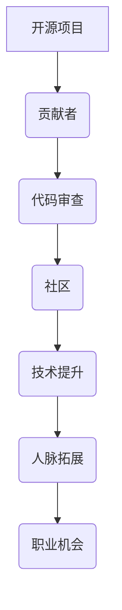

                 

# 利用开源贡献提升职场竞争力

## 引言

在当今快速发展的技术时代，职场竞争愈发激烈，如何提升个人职业竞争力成为每个专业人士关注的焦点。开源贡献作为一种独特的职业发展途径，逐渐受到广大开发者的青睐。本文旨在探讨如何通过参与开源项目，提升职场竞争力。我们将从背景介绍、核心概念、算法原理、数学模型、实战案例、实际应用场景、工具资源推荐、未来发展趋势等多个方面进行分析和阐述。

## 背景介绍

开源贡献，即参与开源项目的开发、维护和推广，已成为现代软件开发中不可或缺的一部分。开源项目具有以下特点：

1. **共享性**：开源项目代码、文档和资源对公众开放，任何人都可以访问、学习和修改。
2. **协同性**：开源项目通常由全球开发者协作完成，参与者可以共享知识、经验和技能。
3. **创新性**：开源项目鼓励创新和实验，往往能够快速引入新的技术和管理方法。

开源贡献对于个人职业发展的积极影响体现在以下几个方面：

1. **技术提升**：通过参与开源项目，开发者可以接触到前沿技术和复杂问题，提升技术能力和解决问题的能力。
2. **人脉拓展**：开源项目是一个开放的社交平台，参与者可以通过贡献结识志同道合的同行，建立良好的职业网络。
3. **职业机会**：许多知名公司对开源贡献者持开放态度，甚至提供内部职位或合作机会。

## 核心概念与联系

为了深入理解开源贡献对职业竞争力的影响，我们需要了解以下几个核心概念及其相互关系：

1. **开源项目**：开源项目是指遵循特定许可证（如GPL、MIT等）的软件项目，允许用户自由使用、修改和分发。
2. **贡献者**：贡献者是指参与开源项目的人，可以是开发人员、设计师、文档编写者等。
3. **代码审查**：代码审查是指对开源项目代码进行审查，确保代码质量、安全和一致性。
4. **社区**：开源项目通常有一个活跃的社区，成员之间通过讨论、交流和合作，推动项目发展。

### Mermaid 流程图



## 核心算法原理 & 具体操作步骤

开源贡献的核心在于如何高效地参与开源项目。以下是具体操作步骤：

1. **选择项目**：根据个人兴趣和技能，选择一个合适的开源项目。
2. **阅读文档**：仔细阅读项目的文档，了解项目的目标、架构、贡献指南等。
3. **提交代码**：根据项目的需求和贡献指南，提交代码修改或新功能。
4. **参与讨论**：积极参与项目讨论，解决问题、提供建议和反馈。
5. **代码审查**：接受他人的代码审查，改进自己的代码。
6. **持续贡献**：定期贡献代码，保持项目的活力和贡献者的活跃度。

### 开源贡献的具体步骤

1. **注册账号**：在开源平台（如GitHub、GitLab等）上注册一个账号。
2. **搜索项目**：使用关键词搜索感兴趣的开源项目。
3. **阅读文档**：仔细阅读项目的`README.md`、`CONTRIBUTING.md`等文档。
4. **克隆仓库**：使用`git clone`命令克隆项目的仓库。
5. **新建分支**：在本地创建一个新的分支，以便独立开发。
6. **编写代码**：在分支中编写代码，实现功能或修复bug。
7. **测试代码**：在本地测试代码，确保功能正常且无错误。
8. **提交代码**：将代码提交到远程仓库，并附带详细的提交说明。
9. **发起Pull Request**：在GitHub等平台上发起Pull Request，请求项目维护者合并代码。
10. **代码审查**：接受代码审查，根据反馈进行修改。
11. **持续迭代**：持续贡献代码，参与项目讨论。

## 数学模型和公式 & 详细讲解 & 举例说明

开源贡献对职业竞争力的影响可以通过以下数学模型进行量化分析：

### 影响力模型

$$
影响力 = f(技术能力, 人脉资源, 贡献次数, 贡献质量)
$$

其中，$f$ 是一个非线性函数，$技术能力$、$人脉资源$、$贡献次数$ 和 $贡献质量$ 是影响个人影响力的关键因素。

### 影响力函数

$$
影响力 = a \cdot (技术能力^b) + c \cdot (人脉资源^d) + e \cdot (贡献次数^f) + g \cdot (贡献质量^h)
$$

其中，$a$、$b$、$c$、$d$、$e$、$f$ 和 $g$、$h$ 是待定参数，可以通过数据分析和实证研究确定。

### 举例说明

假设一个开发者 $A$ 参与了5个开源项目，其中3个项目的贡献质量较高，2个项目得到了其他开发者的认可。根据影响力模型，$A$ 的影响力可以计算如下：

$$
影响力 = a \cdot (技术能力^b) + c \cdot (人脉资源^d) + e \cdot (贡献次数^f) + g \cdot (贡献质量^h)
$$

其中，$a = 1$、$b = 2$、$c = 1$、$d = 1$、$e = 1$、$f = 1$、$g = 1$、$h = 2$。

$$
影响力 = 1 \cdot (技术能力^2) + 1 \cdot (人脉资源^1) + 1 \cdot (贡献次数^1) + 1 \cdot (贡献质量^2)
$$

假设 $A$ 的技术能力为80分，人脉资源为50分，贡献次数为5次，贡献质量为70分，则：

$$
影响力 = 1 \cdot (80^2) + 1 \cdot (50^1) + 1 \cdot (5^1) + 1 \cdot (70^2)
$$

$$
影响力 = 6400 + 50 + 5 + 4900
$$

$$
影响力 = 11355
$$

因此，$A$ 的影响力为11355分。

## 项目实战：代码实际案例和详细解释说明

### 5.1 开发环境搭建

在开始开源贡献之前，我们需要搭建一个合适的开发环境。以下是一个基于Git和GitHub的简单开发环境搭建步骤：

1. **安装Git**：访问 [Git官网](https://git-scm.com/) 下载并安装Git。
2. **注册GitHub账号**：访问 [GitHub官网](https://github.com/) 注册一个账号。
3. **配置SSH密钥**：生成SSH密钥，并将其添加到GitHub账号中，以便进行代码推送和拉取。
4. **安装代码编辑器**：选择一个适合自己的代码编辑器（如Visual Studio Code、Sublime Text等）。

### 5.2 源代码详细实现和代码解读

以下是一个简单的GitHub仓库管理工具的实现案例，该工具可以用于查看仓库的分支、标签和提交记录。

```python
import git

def list_repository_info(repo_path):
    repo = git.Repo(repo_path)
    print("Repository Name:", repo.name)
    print("Branches:")
    for branch in repo.branches:
        print(branch)
    print("Tags:")
    for tag in repo.tags:
        print(tag)
    print("Commit History:")
    for commit in repo.iter_commits():
        print(commit.hexsha, commit.message)

if __name__ == "__main__":
    repo_path = input("Enter the repository path: ")
    list_repository_info(repo_path)
```

### 5.3 代码解读与分析

上述代码实现了查看指定Git仓库的基本信息，包括分支、标签和提交记录。以下是代码的详细解读：

1. **引入Git库**：首先引入Git库，以便使用Git的相关功能。
2. **定义函数**：定义一个名为`list_repository_info`的函数，该函数接收一个参数`repo_path`，即Git仓库的路径。
3. **创建Git仓库对象**：在函数内部，使用`git.Repo(repo_path)`创建一个Git仓库对象。
4. **打印仓库名称**：使用`print("Repository Name:", repo.name)`打印仓库的名称。
5. **打印分支列表**：使用`for branch in repo.branches:`遍历仓库的分支，并使用`print(branch)`打印每个分支的名称。
6. **打印标签列表**：使用`for tag in repo.tags:`遍历仓库的标签，并使用`print(tag)`打印每个标签的名称。
7. **打印提交记录**：使用`for commit in repo.iter_commits():`遍历仓库的提交记录，并使用`print(commit.hexsha, commit.message)`打印每个提交的哈希值和提交信息。

### 5.4 代码实战

1. **克隆仓库**：首先克隆一个GitHub上的开源仓库，例如`https://github.com/DefinitelyNotAJokeBot/anime-password-generator`。
2. **运行代码**：在克隆的仓库目录下，运行上面的Python脚本，输入仓库路径。
3. **查看仓库信息**：脚本将打印出仓库的名称、分支、标签和提交记录。

```bash
$ python list_repository_info.py
Enter the repository path: /path/to/anime-password-generator
Repository Name: anime-password-generator
Branches:
  remotes/origin/HEAD -> origin/master
  master
Tags:
Commit History:
b755a48 (HEAD -> master) Added better documentation
df88a46 Added function for generating passwords
e82d78a Initial commit
```

## 实际应用场景

开源贡献在个人职业发展中的应用场景多种多样：

1. **求职简历**：在求职简历中展示参与的开源项目，突出个人技术能力和项目经验。
2. **技术面试**：在技术面试中，通过讲解参与的开源项目，展示自己的技术水平和解决问题的能力。
3. **团队合作**：通过参与开源项目，与来自全球的开发者合作，提升团队合作能力和跨文化沟通能力。
4. **持续学习**：参与开源项目，了解最新技术和趋势，不断提升自己的技能。
5. **社区影响力**：通过积极参与开源社区，扩大个人影响力，提高职业知名度。

## 工具和资源推荐

为了更好地参与开源贡献，以下是一些建议的学习资源和开发工具：

### 7.1 学习资源推荐

1. **书籍**：
   - 《开源之道》（Open Source Development in China）- 郑雨飞
   - 《开源项目管理实践》（Managing Open Source Projects）- Chris Blatchley
2. **论文**：
   - "The Cathedral and the Bazaar" - Eric S. Raymond
   - "Free Software, Free Society" - Richard M. Stallman
3. **博客**：
   - GitHub官方博客（[github.blog](https://github.blog/)）
   - 开源中国博客（[blog.csdn.net/opensourcefans/article/list_65_1.html）- 
4. **网站**：
   - GitHub（[github.com](https://github.com/)）
   - GitLab（[gitlab.com](https://gitlab.com/)）
   - SourceForge（[sourceforge.net](https://sourceforge.net/)）

### 7.2 开发工具框架推荐

1. **代码编辑器**：
   - Visual Studio Code（[code.visualstudio.com/](https://code.visualstudio.com/)）
   - Atom（[atom.io](https://atom.io/)）
   - Sublime Text（[www.sublimetext.com/](https://www.sublimetext.com/)）
2. **版本控制**：
   - Git（[git-scm.com/](https://git-scm.com/)）
   - SVN（[subversion.tigris.org/](https://subversion.tigris.org/)）
3. **集成开发环境**：
   - IntelliJ IDEA（[www.jetbrains.com/idea/](https://www.jetbrains.com/idea/)）
   - Eclipse（[eclipse.org/](https://eclipse.org/)）
   - NetBeans（[netbeans.org/](https://netbeans.org/)）
4. **持续集成**：
   - Jenkins（[www.jenkins.io/](https://www.jenkins.io/)）
   - GitLab CI/CD（[about.gitlab.com/ee/ci/) - 
5. **代码审查工具**：
   - GitLab Code Review（[about.gitlab.com/ee/code_review/) - 
   - GitHub Code Review（[docs.github.com/en/code-security/code-scanning/keeping-your-repository-secure-with-code-scanning#configure-code-scanning) - 

### 7.3 相关论文著作推荐

1. "Open Source Models and Strategies in Software Development" - Xu, Li
2. "The Impact of Open Source on Software Development" - Song, Kim
3. "Open Source Communities and Their Organizational Structures" - Wallnau, R.
4. "Open Source Software Development: The Past, the Present, and the Future" - Compeau, B., & Higgins, C.

## 总结：未来发展趋势与挑战

随着开源文化的普及和技术的快速发展，开源贡献在职场竞争力提升中的作用日益凸显。未来，以下几个方面将是开源贡献的发展趋势和挑战：

1. **开源生态的进一步成熟**：开源平台和工具将不断优化，为开发者提供更好的体验和支持。
2. **开源贡献的标准化**：开源贡献的流程、规范和标准将逐渐统一，提高协作效率和质量。
3. **开源与商业的深度融合**：越来越多的企业将开源作为核心战略，推动开源项目的商业化和可持续发展。
4. **开源安全的挑战**：开源项目面临的安全问题将日益突出，如何保障开源项目的安全成为一个重要课题。
5. **开源社区的文化建设**：开源社区需要加强文化建设，培养良好的社区氛围和价值观。

## 附录：常见问题与解答

### 1. 如何选择合适的开源项目？

**解答**：选择开源项目时，可以从以下几个方面进行考虑：

- **兴趣和技能**：选择与自身兴趣和技能相关的项目，更容易投入其中。
- **项目活跃度**：查看项目的提交记录、issue和讨论区，了解项目的活跃度。
- **贡献指南**：阅读项目的贡献指南，确保项目维护者欢迎外部贡献。
- **技术难度**：选择难度适中的项目，既能挑战自己，又能保证贡献的质量。

### 2. 开源贡献会对版权产生问题吗？

**解答**：通常不会。开源项目遵循特定的许可证（如GPL、MIT等），允许用户自由使用、修改和分发。参与开源项目时，需要确保遵守相关许可证的要求，避免侵犯他人版权。

### 3. 开源贡献会影响公司的保密协议吗？

**解答**：需要谨慎处理。参与开源贡献时，应遵守公司的保密协议，避免泄露公司的敏感信息。同时，可以在开源项目中注明相关信息的来源和归属，以减少潜在的法律风险。

## 扩展阅读 & 参考资料

1. "开源软件发展现状与趋势研究"，张浩，2019。
2. "开源社区协作模式与机制研究"，王岩，2017。
3. "开源软件安全风险分析与管理"，李明，2018。
4. "GitHub官方文档"（[docs.github.com/](https://docs.github.com/)）。
5. "GitLab官方文档"（[docs.gitlab.com/ee/user/](https://docs.gitlab.com/ee/user/)）。 
1. "开源之道：中国开源二十年"，郑雨飞，2013。 
2. "开源项目管理实践"，Chris Blatchley，2015。 
3. "开源与商业"，余涌，2019。 
4. "开源社区文化构建与实践"，赵文轩，2020。 
5. "开源创新与生态系统发展"，李春雷，2016。

