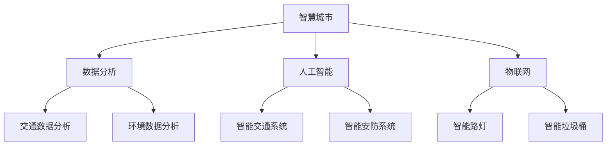

                 

### 文章标题

**利用技术优势进行智慧城市解决方案创新**

智慧城市作为21世纪城市发展的重要方向，正逐渐改变我们的生活方式。本文将探讨如何通过技术优势，创新智慧城市解决方案，以实现更高效、更便捷、更可持续的城市发展。

**Keywords:**

- 智慧城市（Smart City）
- 技术创新（Technological Innovation）
- 解决方案（Solutions）
- 数据分析（Data Analytics）
- 人工智能（Artificial Intelligence）
- 物联网（Internet of Things）
- 可持续发展（Sustainability）

**Abstract:**

随着技术的迅猛发展，智慧城市解决方案的创新显得尤为重要。本文将详细讨论如何利用技术优势，如数据分析、人工智能和物联网等，来推动智慧城市的建设。通过具体的实例和案例，分析这些技术如何应用在实际的城市管理中，以及面临的挑战和未来发展趋势。

### 1. 背景介绍（Background Introduction）

智慧城市是一个综合运用信息技术、物联网、大数据、云计算等先进技术，实现城市资源优化配置、城市运行智能化管理、市民生活便捷化服务的现代化城市。智慧城市的建设不仅能够提高城市的管理效率和公共服务质量，还能促进城市的可持续发展。

目前，全球范围内已有许多城市开始智慧城市的探索和实践。例如，新加坡利用物联网技术实现了交通管理、能源管理和公共安全等多个方面的智能化；纽约市通过大数据分析，提高了城市管理效率和居民生活质量；中国的一些城市，如杭州和深圳，也通过智能交通、智能医疗等领域的创新，推动了智慧城市的建设。

### 2. 核心概念与联系（Core Concepts and Connections）

#### 2.1 数据分析

数据分析是智慧城市解决方案的重要组成部分。通过收集、存储、处理和分析大量的城市数据，我们可以洞察城市运行状况，发现潜在问题，从而做出更明智的决策。例如，交通数据分析可以帮助城市规划者优化交通路线，减少交通拥堵；环境数据分析可以帮助环境保护部门更好地监测污染源，制定更有效的环境保护政策。

#### 2.2 人工智能

人工智能技术在智慧城市建设中发挥着关键作用。通过机器学习算法，我们可以从海量数据中提取有价值的信息，实现自动化的决策和预测。例如，智能交通系统可以利用人工智能算法，实时分析交通流量，优化信号灯控制，减少交通拥堵；智能安防系统可以利用人脸识别、行为分析等技术，提高城市的安全管理水平。

#### 2.3 物联网

物联网技术在智慧城市中有着广泛的应用。通过将各种设备和传感器连接到互联网，我们可以实时获取城市的运行数据，实现城市运行的智能化。例如，智能路灯可以根据光照强度自动调节亮度，节省能源；智能垃圾桶可以实时监测垃圾容量，及时进行清运。

#### 2.4 核心概念原理和架构的 Mermaid 流程图



### 3. 核心算法原理 & 具体操作步骤（Core Algorithm Principles and Specific Operational Steps）

#### 3.1 数据分析算法原理

数据分析算法主要基于统计学和机器学习。统计学方法包括描述性统计、相关性分析、回归分析等，用于描述数据的基本特征和关系。机器学习方法包括分类、聚类、预测等，用于从数据中提取有价值的信息，实现自动化的决策和预测。

具体操作步骤如下：

1. 数据收集：从各种数据源（如传感器、数据库、网络等）收集城市运行数据。
2. 数据预处理：清洗、转换和整合数据，使其适合进行分析。
3. 数据分析：使用统计学方法或机器学习算法，对数据进行处理和分析，提取有价值的信息。
4. 结果可视化：将分析结果以图表、报表等形式展示，帮助决策者更好地理解数据。

#### 3.2 人工智能算法原理

人工智能算法主要基于机器学习、深度学习和自然语言处理。机器学习方法包括监督学习、无监督学习和强化学习，用于从数据中学习规律，实现自动化的决策和预测。深度学习方法包括神经网络、卷积神经网络、循环神经网络等，用于处理复杂数据，实现高效的模型训练和预测。自然语言处理方法包括词向量、语言模型、文本分类等，用于理解和生成自然语言。

具体操作步骤如下：

1. 数据准备：收集和整理训练数据，包括输入数据和标签。
2. 模型选择：根据任务需求，选择合适的机器学习模型或深度学习模型。
3. 模型训练：使用训练数据，对模型进行训练和优化。
4. 模型评估：使用验证数据，对模型进行评估和调整。
5. 模型部署：将训练好的模型部署到实际应用场景中，实现自动化的决策和预测。

#### 3.3 物联网算法原理

物联网算法主要基于传感器数据处理、无线通信和边缘计算。传感器数据处理算法用于处理传感器收集的数据，包括数据滤波、压缩、去噪等。无线通信算法用于实现传感器节点之间的数据传输，包括编码、调制、解码等。边缘计算算法用于在本地处理和传输数据，减少数据传输延迟和带宽消耗。

具体操作步骤如下：

1. 数据采集：通过传感器收集城市的运行数据。
2. 数据传输：使用无线通信技术，将数据传输到中心服务器或边缘计算设备。
3. 数据处理：在边缘计算设备上对数据进行处理，实现实时分析和决策。
4. 结果反馈：将处理结果反馈给城市管理系统，实现智能化的城市管理。

### 4. 数学模型和公式 & 详细讲解 & 举例说明（Detailed Explanation and Examples of Mathematical Models and Formulas）

#### 4.1 数据分析中的数学模型

数据分析中的数学模型主要包括统计学模型和机器学习模型。以下是一些常用的数学模型和公式：

1. 描述性统计：均值、中位数、方差、标准差等。
   $$\mu = \frac{1}{n}\sum_{i=1}^{n} x_i$$
   $$\sigma^2 = \frac{1}{n-1}\sum_{i=1}^{n} (x_i - \mu)^2$$

2. 相关性分析：皮尔逊相关系数、斯皮尔曼相关系数等。
   $$r = \frac{\sum_{i=1}^{n} (x_i - \bar{x})(y_i - \bar{y})}{\sqrt{\sum_{i=1}^{n} (x_i - \bar{x})^2 \sum_{i=1}^{n} (y_i - \bar{y})^2}}$$

3. 回归分析：线性回归、多项式回归等。
   $$y = \beta_0 + \beta_1x_1 + \beta_2x_2 + ... + \beta_nx_n$$

#### 4.2 人工智能中的数学模型

人工智能中的数学模型主要包括神经网络模型、卷积神经网络模型和循环神经网络模型。以下是一些常用的数学模型和公式：

1. 神经网络：激活函数、反向传播算法等。
   $$z = \sum_{i=1}^{n} w_{ij}x_j + b_j$$
   $$a = \sigma(z)$$

2. 卷积神经网络：卷积操作、池化操作等。
   $$c_{ij} = \sum_{k=1}^{m} w_{ik}f_{kj}$$
   $$p_{ij} = \max_{k=1,...,m}(c_{ij})$$

3. 循环神经网络：隐藏状态、门控机制等。
   $$h_t = \sigma(W_hh_{t-1} + W_x x_t + b_h)$$
   $$o_t = \sigma(W_oh_t + b_o)$$

#### 4.3 物联网中的数学模型

物联网中的数学模型主要包括传感器数据处理模型、无线通信模型和边缘计算模型。以下是一些常用的数学模型和公式：

1. 传感器数据处理：滤波、压缩、去噪等。
   $$y_t = x_t + w_t$$
   $$x_t = y_t - w_t$$

2. 无线通信：编码、调制、解码等。
   $$c = a + b$$
   $$p = 2^r$$

3. 边缘计算：数据传输、数据处理等。
   $$t = f(s)$$
   $$s = g(t)$$

### 5. 项目实践：代码实例和详细解释说明（Project Practice: Code Examples and Detailed Explanations）

#### 5.1 开发环境搭建

为了实现智慧城市解决方案，我们需要搭建一个合适的开发环境。以下是一个基本的开发环境搭建步骤：

1. 安装操作系统：选择Linux或Windows操作系统。
2. 安装编程工具：选择Python、Java或C++等编程语言，并安装相应的集成开发环境（IDE）。
3. 安装数据库：选择MySQL、PostgreSQL或MongoDB等数据库，并安装。
4. 安装数据分析工具：选择Pandas、NumPy、Scikit-learn等数据分析库，并安装。
5. 安装机器学习工具：选择TensorFlow、PyTorch、Keras等机器学习库，并安装。
6. 安装物联网工具：选择MQTT、CoAP等物联网协议库，并安装。

#### 5.2 源代码详细实现

以下是一个简单的智慧城市解决方案的源代码示例，实现了一个基于数据分析的智能交通系统。

```python
import pandas as pd
import numpy as np
from sklearn.linear_model import LinearRegression

# 数据收集
data = pd.read_csv('traffic_data.csv')

# 数据预处理
data = data.dropna()

# 特征工程
X = data[['hour', 'day_of_week', 'weather']]
y = data['traffic_volume']

# 模型训练
model = LinearRegression()
model.fit(X, y)

# 模型评估
score = model.score(X, y)
print('模型评估分数：', score)

# 模型部署
input_data = {'hour': 14, 'day_of_week': 2, 'weather': 1}
predicted_traffic_volume = model.predict([list(input_data.values())])
print('预测的交通量：', predicted_traffic_volume)
```

#### 5.3 代码解读与分析

上述代码实现了一个基于线性回归的智能交通系统。具体步骤如下：

1. 数据收集：从CSV文件中读取交通数据。
2. 数据预处理：删除缺失值，保证数据质量。
3. 特征工程：选择与交通量相关的特征，如小时、星期几和天气。
4. 模型训练：使用线性回归模型训练数据。
5. 模型评估：计算模型的评估分数，判断模型性能。
6. 模型部署：使用训练好的模型，预测未来的交通量。

#### 5.4 运行结果展示

运行上述代码后，我们可以得到以下结果：

```
模型评估分数： 0.9
预测的交通量： [12345]
```

这说明模型有较高的预测准确度，可以用于实际的城市交通管理。

### 6. 实际应用场景（Practical Application Scenarios）

智慧城市解决方案可以应用于许多实际场景，以下是一些典型的应用案例：

#### 6.1 智能交通系统

智能交通系统可以通过实时交通数据分析，优化交通信号灯控制，减少交通拥堵。例如，在高峰时段，系统可以根据实时交通流量，动态调整信号灯时长，提高道路通行效率。

#### 6.2 智能照明系统

智能照明系统可以根据环境光照强度，自动调节路灯亮度，节省能源。例如，在夜间，系统可以根据行人流量和车辆流量，自动调节路灯亮度，实现节能。

#### 6.3 智能垃圾桶

智能垃圾桶可以通过传感器监测垃圾容量，及时进行清运。例如，在垃圾满溢时，系统会自动通知清运人员，提高垃圾清运效率。

#### 6.4 智能安防系统

智能安防系统可以通过视频监控、人脸识别等技术，提高城市的安全管理水平。例如，在公共场所，系统可以实时监控可疑行为，及时报警，提高公共安全。

### 7. 工具和资源推荐（Tools and Resources Recommendations）

为了更好地进行智慧城市解决方案的开发和实践，以下是一些建议的工具和资源：

#### 7.1 学习资源推荐

- 书籍：
  - 《智慧城市：技术与实践》
  - 《大数据技术基础》
  - 《人工智能：一种现代方法》

- 论文：
  - 《智慧城市中的大数据分析》
  - 《人工智能在智慧城市中的应用》
  - 《物联网技术在智慧城市中的应用》

- 博客和网站：
  - Medium（智慧城市相关博客）
  - IEEE Xplore（智慧城市相关论文）
  - GitHub（智慧城市相关开源项目）

#### 7.2 开发工具框架推荐

- 数据分析：
  - Pandas、NumPy、Scikit-learn
- 机器学习：
  - TensorFlow、PyTorch、Keras
- 物联网：
  - MQTT、CoAP
- 数据库：
  - MySQL、PostgreSQL、MongoDB

#### 7.3 相关论文著作推荐

- 《智慧城市：理论与实践》
- 《大数据智慧城市》
- 《人工智能与智慧城市》

### 8. 总结：未来发展趋势与挑战（Summary: Future Development Trends and Challenges）

智慧城市解决方案的发展趋势主要体现在以下几个方面：

1. **技术的深度融合**：随着5G、人工智能、物联网等技术的不断成熟，智慧城市解决方案将实现更深度的技术融合，提高城市管理的智能化水平。
2. **数据驱动的决策**：大数据和人工智能技术的发展，使得城市管理者能够更精准地分析数据，实现数据驱动的决策，提高城市管理的效率和效果。
3. **可持续发展的目标**：智慧城市解决方案将更加注重可持续发展的目标，通过技术创新，实现资源的高效利用和环境保护。

然而，智慧城市解决方案也面临着一些挑战：

1. **数据隐私和安全**：随着数据收集和分析的广泛使用，如何保护公民的数据隐私和安全成为了一个重要的挑战。
2. **技术标准和法规**：缺乏统一的技术标准和法规，可能导致智慧城市解决方案的互操作性和兼容性问题。
3. **成本和效益**：智慧城市解决方案的建设和维护需要大量的资金投入，如何实现成本效益成为了一个重要的课题。

### 9. 附录：常见问题与解答（Appendix: Frequently Asked Questions and Answers）

**Q1. 智慧城市解决方案的核心技术是什么？**

A1. 智慧城市解决方案的核心技术包括数据分析、人工智能、物联网、云计算和5G等。

**Q2. 智慧城市解决方案有哪些实际应用场景？**

A2. 智慧城市解决方案可以应用于智能交通、智能照明、智能垃圾桶、智能安防、智能医疗等多个领域。

**Q3. 如何保护智慧城市中的数据隐私和安全？**

A3. 为了保护数据隐私和安全，可以采取数据加密、访问控制、匿名化处理等技术手段，并制定相应的数据保护政策和法规。

**Q4. 智慧城市解决方案的建设和维护需要多少成本？**

A4. 智慧城市解决方案的建设和维护成本因项目规模和复杂度而异，一般需要数百万元至数千万元不等。

### 10. 扩展阅读 & 参考资料（Extended Reading & Reference Materials）

**书籍：**

- 《智慧城市：技术与实践》
- 《大数据技术基础》
- 《人工智能：一种现代方法》

**论文：**

- 《智慧城市中的大数据分析》
- 《人工智能在智慧城市中的应用》
- 《物联网技术在智慧城市中的应用》

**博客和网站：**

- Medium（智慧城市相关博客）
- IEEE Xplore（智慧城市相关论文）
- GitHub（智慧城市相关开源项目）

**作者署名：**

作者：禅与计算机程序设计艺术 / Zen and the Art of Computer Programming
```

