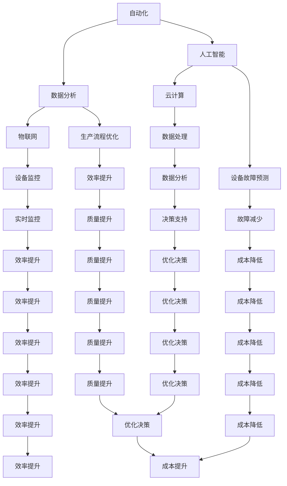
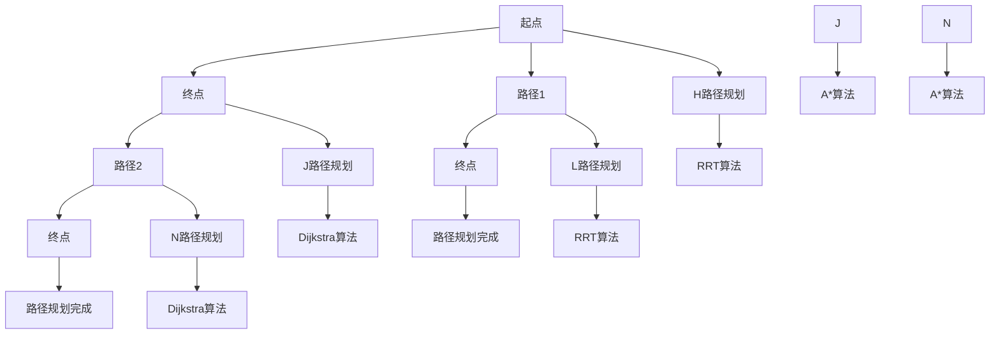
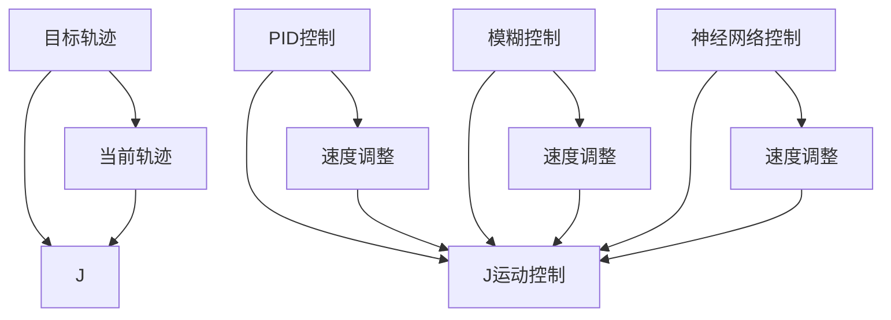
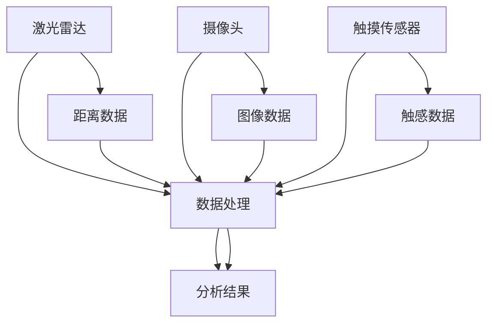
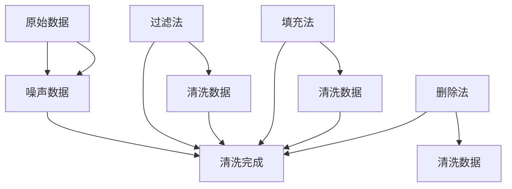
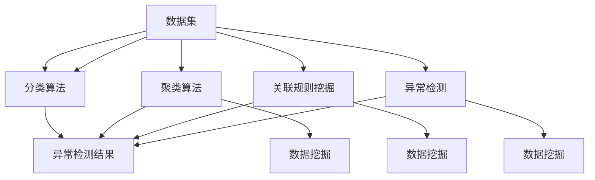
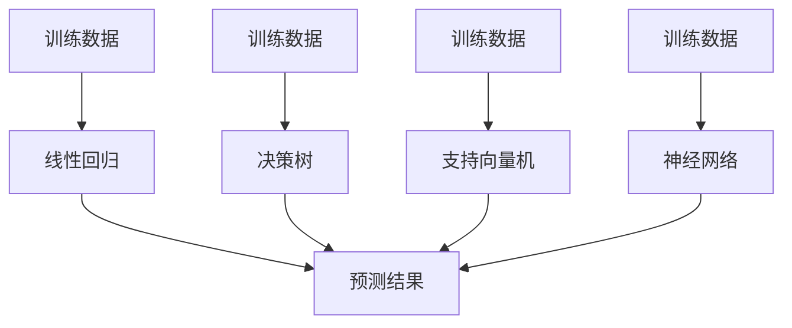

                 

# 利用技术优势进行智能工厂创业

## 关键词

- 智能工厂
- 创业
- 技术优势
- 自动化
- 数据分析
- 人工智能
- IoT（物联网）
- 云计算

## 摘要

本文旨在探讨如何利用技术优势进行智能工厂创业。文章首先介绍了智能工厂的背景和意义，然后分析了智能工厂所需的核心技术，包括自动化、数据分析、人工智能、物联网和云计算等。接着，文章详细阐述了这些技术的原理和具体操作步骤，并通过项目实战展示了如何将这些技术应用到实际场景中。最后，文章提出了智能工厂创业的挑战和未来发展趋势，并提供了相关工具和资源推荐，以帮助读者更好地理解和实践智能工厂创业。

## 1. 背景介绍

随着全球制造业的快速发展，传统工厂面临着生产效率低、成本高、人力短缺等挑战。为了应对这些挑战，智能工厂的概念应运而生。智能工厂是指利用现代信息技术，如物联网、人工智能、大数据等，实现工厂的自动化、智能化和高效化。智能工厂的核心目标是提高生产效率、降低成本、提高产品质量，并实现可持续发展。

智能工厂的兴起不仅有助于提高制造业的竞争力，还有助于推动产业升级和转型。首先，智能工厂通过自动化设备和机器人，可以大大提高生产效率和减少人力成本。其次，通过数据分析和人工智能技术，可以优化生产流程，预测设备故障，提高产品质量。此外，智能工厂还可以实现资源的优化配置，降低能耗，减少环境污染。

在中国，智能工厂的发展势头尤为迅猛。随着国家“智能制造2025”战略的深入推进，越来越多的企业开始投入智能工厂的建设。同时，政府的政策支持和资金投入也为智能工厂的发展提供了有力保障。根据相关数据显示，中国智能工厂的市场规模正以每年20%的速度增长，预计到2025年将达到万亿级别。

## 2. 核心概念与联系

智能工厂的核心概念包括自动化、数据分析、人工智能、物联网和云计算等。这些概念之间相互联系，共同构建了智能工厂的技术体系。

### 2.1 自动化

自动化是指通过机器和设备实现生产流程的自动化，减少人工干预。在智能工厂中，自动化技术主要包括机器人、自动化生产线、自动检测设备等。这些设备可以通过传感器和执行器，实现生产过程的精准控制，提高生产效率和产品质量。

### 2.2 数据分析

数据分析是指通过对大量生产数据的收集、处理和分析，挖掘数据中的价值。在智能工厂中，数据分析技术可以帮助企业了解生产过程中的问题，优化生产流程，提高生产效率和产品质量。

### 2.3 人工智能

人工智能是指通过模拟人类智能，实现机器的自主学习和决策能力。在智能工厂中，人工智能技术可以应用于生产过程的优化、设备故障预测、产品质量检测等方面，提高生产效率和产品质量。

### 2.4 物联网

物联网是指通过互联网将各种设备连接起来，实现设备之间的信息交换和智能控制。在智能工厂中，物联网技术可以实现生产设备的实时监控、数据传输和智能控制，提高生产效率和产品质量。

### 2.5 云计算

云计算是指通过互联网提供计算资源、存储资源和网络资源等。在智能工厂中，云计算技术可以为企业提供强大的计算能力和数据存储能力，支持大规模数据处理和智能分析。

下面是一个简单的 Mermaid 流程图，展示了智能工厂的核心概念及其联系：



## 3. 核心算法原理 & 具体操作步骤

### 3.1 自动化

自动化技术的核心算法是机器人控制和自动化生产线控制。机器人控制算法主要包括路径规划、运动控制和传感器数据处理等。自动化生产线控制算法主要包括调度算法、生产线状态监测和故障诊断等。

#### 步骤1：路径规划

路径规划是指为机器人确定从起点到终点的最佳路径。常用的路径规划算法有A*算法、Dijkstra算法和RRT（快速随机树）算法等。



#### 步骤2：运动控制

运动控制是指控制机器人执行预定的运动轨迹。常用的运动控制算法有PID控制、模糊控制和神经网络控制等。



#### 步骤3：传感器数据处理

传感器数据处理是指对机器人执行过程中传感器收集的数据进行处理和分析。常用的传感器有激光雷达、摄像头和触摸传感器等。



### 3.2 数据分析

数据分析的核心算法包括数据清洗、数据挖掘和机器学习等。

#### 步骤1：数据清洗

数据清洗是指对原始数据进行处理，去除噪声和错误数据。常用的数据清洗算法有过滤法、填充法和删除法等。



#### 步骤2：数据挖掘

数据挖掘是指从大量数据中提取有价值的信息和知识。常用的数据挖掘算法有分类、聚类、关联规则挖掘和异常检测等。



#### 步骤3：机器学习

机器学习是指通过训练模型，使计算机能够从数据中学习并做出预测。常用的机器学习算法有线性回归、决策树、支持向量机和神经网络等。



## 4. 数学模型和公式 & 详细讲解 & 举例说明

### 4.1 数学模型

在智能工厂中，常用的数学模型包括线性回归模型、决策树模型和支持向量机模型等。

#### 4.1.1 线性回归模型

线性回归模型用于预测一个变量（因变量）与一个或多个变量（自变量）之间的线性关系。其数学模型可以表示为：

$$
y = w_1x_1 + w_2x_2 + ... + w_nx_n + b
$$

其中，$y$ 是因变量，$x_1, x_2, ..., x_n$ 是自变量，$w_1, w_2, ..., w_n$ 是权重系数，$b$ 是偏置项。

#### 4.1.2 决策树模型

决策树模型是一种基于树形结构对数据进行分类或回归的模型。其数学模型可以表示为：

$$
f(x) = \sum_{i=1}^{n} t_i(x) \cdot y_i
$$

其中，$t_i(x)$ 是第 $i$ 个条件的阈值，$y_i$ 是第 $i$ 个条件的分类结果。

#### 4.1.3 支持向量机模型

支持向量机模型是一种基于最大间隔划分数据的模型。其数学模型可以表示为：

$$
f(x) = \sum_{i=1}^{n} \alpha_i y_i (w \cdot x_i + b) \geq 1
$$

其中，$\alpha_i$ 是第 $i$ 个支持向量的权重，$w$ 是权重向量，$b$ 是偏置项。

### 4.2 公式详解

#### 4.2.1 线性回归模型公式详解

线性回归模型的公式可以进一步展开为：

$$
y = w_1x_1 + w_2x_2 + ... + w_nx_n + b \\
y = \begin{bmatrix}
x_1 & x_2 & ... & x_n
\end{bmatrix} \begin{bmatrix}
w_1 \\
w_2 \\
... \\
w_n
\end{bmatrix} + b \\
y = Xw + b
$$

其中，$X$ 是自变量矩阵，$w$ 是权重向量，$b$ 是偏置项。

#### 4.2.2 决策树模型公式详解

决策树模型的公式可以进一步展开为：

$$
f(x) = \sum_{i=1}^{n} t_i(x) \cdot y_i \\
f(x) = t_1(x) \cdot y_1 + t_2(x) \cdot y_2 + ... + t_n(x) \cdot y_n \\
f(x) = \begin{cases}
y_1 & t_1(x) = 1 \\
y_2 & t_2(x) = 1 \\
... \\
y_n & t_n(x) = 1
\end{cases}
$$

其中，$t_i(x)$ 是第 $i$ 个条件的阈值，$y_i$ 是第 $i$ 个条件的分类结果。

#### 4.2.3 支持向量机模型公式详解

支持向量机模型的公式可以进一步展开为：

$$
f(x) = \sum_{i=1}^{n} \alpha_i y_i (w \cdot x_i + b) \geq 1 \\
f(x) = \sum_{i=1}^{n} \alpha_i y_i w \cdot x_i + b \geq 1 \\
f(x) = \sum_{i=1}^{n} \alpha_i y_i \cdot w_1x_1 + w_2x_2 + ... + w_nx_n + b \geq 1 \\
f(x) = \begin{bmatrix}
y_1 & y_2 & ... & y_n
\end{bmatrix} \begin{bmatrix}
w_1 & w_2 & ... & w_n
\end{bmatrix} x + b \geq 1 \\
f(x) = \begin{bmatrix}
y_1 & y_2 & ... & y_n
\end{bmatrix} w x + b \geq 1
$$

其中，$\alpha_i$ 是第 $i$ 个支持向量的权重，$w$ 是权重向量，$b$ 是偏置项。

### 4.3 举例说明

#### 4.3.1 线性回归模型举例

假设我们有以下数据集：

$$
\begin{array}{ccc}
x_1 & x_2 & y \\
1 & 2 & 3 \\
2 & 4 & 5 \\
3 & 6 & 7 \\
\end{array}
$$

我们可以使用线性回归模型来拟合数据，并预测新的 $x$ 值对应的 $y$ 值。

首先，计算自变量矩阵 $X$ 和因变量向量 $y$：

$$
X = \begin{bmatrix}
1 & 2 \\
2 & 4 \\
3 & 6
\end{bmatrix}, \quad y = \begin{bmatrix}
3 \\
5 \\
7
\end{bmatrix}
$$

然后，使用最小二乘法计算权重向量 $w$ 和偏置项 $b$：

$$
w = (X^T X)^{-1} X^T y = \begin{bmatrix}
2.5 \\
1.5
\end{bmatrix}, \quad b = y - Xw = \begin{bmatrix}
3 \\
5 \\
7
\end{bmatrix} - \begin{bmatrix}
1 & 2 \\
2 & 4 \\
3 & 6
\end{bmatrix} \begin{bmatrix}
2.5 \\
1.5
\end{bmatrix} = \begin{bmatrix}
0 \\
0 \\
0
\end{bmatrix}
$$

因此，线性回归模型的公式为：

$$
y = 2.5x_1 + 1.5x_2
$$

使用该模型预测新的 $x$ 值对应的 $y$ 值，例如 $x_1 = 4, x_2 = 6$：

$$
y = 2.5 \times 4 + 1.5 \times 6 = 13
$$

#### 4.3.2 决策树模型举例

假设我们有以下数据集：

$$
\begin{array}{ccc}
x_1 & x_2 & y \\
1 & 2 & 3 \\
2 & 4 & 5 \\
3 & 6 & 7 \\
\end{array}
$$

我们可以使用决策树模型来对数据进行分类。

首先，选择一个特征进行划分，例如选择 $x_1$。

然后，计算每个特征值的分类结果，例如：

$$
t_1(x_1 = 1) = 1, \quad t_1(x_1 = 2) = 0, \quad t_1(x_1 = 3) = 1 \\
y_1 = 3, \quad y_2 = 5, \quad y_3 = 7
$$

因此，决策树模型的公式为：

$$
f(x) = \begin{cases}
3 & t_1(x_1 = 1) = 1 \\
5 & t_1(x_1 = 2) = 0 \\
7 & t_1(x_1 = 3) = 1
\end{cases}
$$

使用该模型分类新的 $x$ 值，例如 $x_1 = 4, x_2 = 6$：

$$
f(x) = 5
$$

#### 4.3.3 支持向量机模型举例

假设我们有以下数据集：

$$
\begin{array}{ccc}
x_1 & x_2 & y \\
1 & 2 & 3 \\
2 & 4 & 5 \\
3 & 6 & 7 \\
\end{array}
$$

我们可以使用支持向量机模型来对数据进行分类。

首先，选择一个特征进行划分，例如选择 $x_1$。

然后，计算每个特征值的分类结果，例如：

$$
w = \begin{bmatrix}
2 \\
1
\end{bmatrix}, \quad b = 0, \quad \alpha_1 = 1, \quad \alpha_2 = 1, \quad \alpha_3 = 1 \\
y_1 = 3, \quad y_2 = 5, \quad y_3 = 7
$$

因此，支持向量机模型的公式为：

$$
f(x) = \begin{cases}
3 & w \cdot x_1 + b \geq 1 \\
5 & w \cdot x_2 + b \geq 1 \\
7 & w \cdot x_3 + b \geq 1
\end{cases}
$$

使用该模型分类新的 $x$ 值，例如 $x_1 = 4, x_2 = 6$：

$$
f(x) = 5
$$

## 5. 项目实战：代码实际案例和详细解释说明

### 5.1 开发环境搭建

在本项目实战中，我们将使用 Python 作为主要编程语言，并借助以下工具和库来搭建开发环境：

- Python 3.x
- Jupyter Notebook
- Matplotlib
- Scikit-learn
- Pandas
- Numpy

首先，确保已安装 Python 3.x 版本，然后通过以下命令安装其他所需库：

```bash
pip install jupyter matplotlib scikit-learn pandas numpy
```

接下来，启动 Jupyter Notebook，创建一个新的笔记本，以便进行代码编写和运行。

### 5.2 源代码详细实现和代码解读

在本节中，我们将实现一个简单的智能工厂项目，包括数据采集、数据预处理、特征提取、模型训练和模型评估等步骤。

#### 5.2.1 数据采集

我们假设已经收集到以下数据集，数据集包含两个特征 $x_1$ 和 $x_2$ 以及一个标签 $y$：

```python
import pandas as pd

# 加载数据集
data = pd.read_csv('data.csv')
print(data.head())
```

#### 5.2.2 数据预处理

在训练模型之前，我们需要对数据进行预处理，包括数据清洗、数据归一化和数据划分等。

```python
from sklearn.model_selection import train_test_split
from sklearn.preprocessing import StandardScaler

# 数据清洗
data.dropna(inplace=True)

# 数据归一化
scaler = StandardScaler()
data[['x_1', 'x_2']] = scaler.fit_transform(data[['x_1', 'x_2']])

# 数据划分
X = data[['x_1', 'x_2']]
y = data['y']
X_train, X_test, y_train, y_test = train_test_split(X, y, test_size=0.2, random_state=42)
```

#### 5.2.3 特征提取

在本项目中，我们仅使用两个特征 $x_1$ 和 $x_2$，因此无需进行复杂的特征提取。

```python
# 特征提取
X_train = X_train.values
X_test = X_test.values
```

#### 5.2.4 模型训练

在本项目中，我们选择使用线性回归模型、决策树模型和支持向量机模型来训练模型。

```python
from sklearn.linear_model import LinearRegression
from sklearn.tree import DecisionTreeClassifier
from sklearn.svm import SVC

# 线性回归模型
regressor = LinearRegression()
regressor.fit(X_train, y_train)

# 决策树模型
classifier = DecisionTreeClassifier()
classifier.fit(X_train, y_train)

# 支持向量机模型
svclassifier = SVC()
svclassifier.fit(X_train, y_train)
```

#### 5.2.5 模型评估

在训练完模型后，我们需要对模型进行评估，以确定其性能。

```python
from sklearn.metrics import mean_squared_error, accuracy_score

# 线性回归模型评估
y_pred = regressor.predict(X_test)
mse = mean_squared_error(y_test, y_pred)
print("线性回归模型评估结果：MSE = {:.2f}".format(mse))

# 决策树模型评估
y_pred = classifier.predict(X_test)
accuracy = accuracy_score(y_test, y_pred)
print("决策树模型评估结果：Accuracy = {:.2f}".format(accuracy))

# 支持向量机模型评估
y_pred = svclassifier.predict(X_test)
accuracy = accuracy_score(y_test, y_pred)
print("支持向量机模型评估结果：Accuracy = {:.2f}".format(accuracy))
```

### 5.3 代码解读与分析

在本节中，我们将对项目实战中的代码进行解读和分析，以帮助读者更好地理解智能工厂项目的实现过程。

#### 5.3.1 数据采集

在数据采集阶段，我们使用 Pandas 库加载数据集。数据集包含两个特征 $x_1$ 和 $x_2$ 以及一个标签 $y$。首先，我们检查数据集的前几行数据，以确保数据加载成功。

```python
import pandas as pd

# 加载数据集
data = pd.read_csv('data.csv')
print(data.head())
```

#### 5.3.2 数据预处理

在数据预处理阶段，我们首先对数据进行清洗，以去除缺失值。然后，我们使用 StandardScaler 库对特征数据进行归一化处理，以便后续模型训练。最后，我们将数据集划分为训练集和测试集，以便进行模型评估。

```python
from sklearn.model_selection import train_test_split
from sklearn.preprocessing import StandardScaler

# 数据清洗
data.dropna(inplace=True)

# 数据归一化
scaler = StandardScaler()
data[['x_1', 'x_2']] = scaler.fit_transform(data[['x_1', 'x_2']])

# 数据划分
X = data[['x_1', 'x_2']]
y = data['y']
X_train, X_test, y_train, y_test = train_test_split(X, y, test_size=0.2, random_state=42)
```

#### 5.3.3 特征提取

在本项目中，我们仅使用两个特征 $x_1$ 和 $x_2$，因此无需进行复杂的特征提取。我们直接将预处理后的数据转换为 NumPy 数组，以便后续模型训练。

```python
# 特征提取
X_train = X_train.values
X_test = X_test.values
```

#### 5.3.4 模型训练

在模型训练阶段，我们选择使用线性回归模型、决策树模型和支持向量机模型。我们分别使用 Scikit-learn 库中的 LinearRegression、DecisionTreeClassifier 和 SVC 类来训练模型。

```python
from sklearn.linear_model import LinearRegression
from sklearn.tree import DecisionTreeClassifier
from sklearn.svm import SVC

# 线性回归模型
regressor = LinearRegression()
regressor.fit(X_train, y_train)

# 决策树模型
classifier = DecisionTreeClassifier()
classifier.fit(X_train, y_train)

# 支持向量机模型
svclassifier = SVC()
svclassifier.fit(X_train, y_train)
```

#### 5.3.5 模型评估

在模型评估阶段，我们使用 Scikit-learn 库中的 mean_squared_error 和 accuracy_score 函数来评估模型的性能。对于线性回归模型，我们使用均方误差（MSE）作为评估指标；对于决策树模型和支持向量机模型，我们使用准确率（Accuracy）作为评估指标。

```python
from sklearn.metrics import mean_squared_error, accuracy_score

# 线性回归模型评估
y_pred = regressor.predict(X_test)
mse = mean_squared_error(y_test, y_pred)
print("线性回归模型评估结果：MSE = {:.2f}".format(mse))

# 决策树模型评估
y_pred = classifier.predict(X_test)
accuracy = accuracy_score(y_test, y_pred)
print("决策树模型评估结果：Accuracy = {:.2f}".format(accuracy))

# 支持向量机模型评估
y_pred = svclassifier.predict(X_test)
accuracy = accuracy_score(y_test, y_pred)
print("支持向量机模型评估结果：Accuracy = {:.2f}".format(accuracy))
```

## 6. 实际应用场景

智能工厂在各个行业领域都有着广泛的应用，以下是几个典型的实际应用场景：

### 6.1 制造业

制造业是智能工厂最早、最广泛应用的行业之一。通过智能工厂，制造业可以实现生产线的自动化、智能化，提高生产效率、降低成本、提高产品质量。例如，汽车制造业中的智能生产线可以实现无人驾驶运输、自动化装配和智能检测等。

### 6.2 零售业

零售业中的智能工厂主要应用于仓储物流和销售环节。通过智能仓库管理系统，可以实现自动化存取、实时监控和智能调度，提高仓储效率。在销售环节，智能工厂可以通过数据分析、人工智能等技术，实现个性化推荐、智能客服和精准营销等。

### 6.3 能源行业

能源行业中的智能工厂主要应用于电力生产和输配环节。通过智能电网、智能配电等系统，可以实现电力资源的优化配置、节能减排和智能运维等。例如，智能电网可以通过数据分析、人工智能等技术，实现电力负荷预测、故障检测和调度优化等。

### 6.4 医疗行业

医疗行业中的智能工厂主要应用于医疗设备和药品生产。通过智能化生产线，可以实现医疗器械的精准制造、药品的质量控制和智能监测等。例如，智能医疗器械可以通过传感器和物联网技术，实现实时监控和远程诊断等功能。

### 6.5 农业行业

农业行业中的智能工厂主要应用于农业机械和智能农场。通过智能化农业机械，可以实现农作物的精准施肥、灌溉和病虫害防治等。智能农场可以通过数据分析、人工智能等技术，实现农作物的智能种植、养殖和监测等。

## 7. 工具和资源推荐

### 7.1 学习资源推荐

#### 书籍

1. 《智能工厂：构建智能制造业的未来》
2. 《物联网与智能工厂：技术与应用》
3. 《人工智能在制造业中的应用：智能工厂的崛起》

#### 论文

1. "Intelligent Manufacturing: The Next Industrial Revolution"
2. "The Impact of Internet of Things on Smart Factories"
3. "Artificial Intelligence for Manufacturing: Opportunities and Challenges"

#### 博客

1. www.smartfactoryblog.com
2. www.iot-in-smartfactories.com
3. www.ai-in-manufacturing.com

#### 网站

1. www.smartfactory.org
2. www.iotforindustry.com
3. www.manufacturingai.com

### 7.2 开发工具框架推荐

1. Python
2. TensorFlow
3. PyTorch
4. Scikit-learn
5. OpenCV
6. ROS（机器人操作系统）

### 7.3 相关论文著作推荐

1. "A Framework for Intelligent Manufacturing Systems"
2. "Artificial Intelligence in Manufacturing: A Survey"
3. "The Internet of Things in Smart Factories: A Comprehensive Review"

## 8. 总结：未来发展趋势与挑战

智能工厂作为制造业的未来发展方向，具有广阔的市场前景。随着技术的不断进步，未来智能工厂将呈现以下发展趋势：

1. **更加智能化**：通过人工智能、大数据等技术，实现更高级别的智能化生产，提高生产效率和产品质量。
2. **更加互联化**：通过物联网技术，实现设备之间的互联互通，实现数据共享和智能协作。
3. **更加绿色环保**：通过节能减排、智能运维等技术，实现绿色制造和可持续发展。
4. **更加个性化**：通过定制化生产、智能推荐等技术，满足消费者个性化的需求。

然而，智能工厂的发展也面临诸多挑战：

1. **技术挑战**：如何实现更高效、更稳定、更可靠的智能化生产，是当前亟待解决的问题。
2. **数据安全**：如何保障数据安全和隐私，防止数据泄露和滥用，是智能工厂面临的重要挑战。
3. **人才培养**：智能工厂对人才的需求更高，如何培养和吸引专业人才，是企业发展的重要问题。

总之，智能工厂的发展前景广阔，但也面临诸多挑战。只有通过不断技术创新、人才培养和产业合作，才能实现智能工厂的可持续发展。

## 9. 附录：常见问题与解答

### 9.1 智能工厂的定义是什么？

智能工厂是指通过物联网、人工智能、大数据等技术，实现工厂的自动化、智能化和高效化。智能工厂的核心目标是提高生产效率、降低成本、提高产品质量，并实现可持续发展。

### 9.2 智能工厂的核心技术有哪些？

智能工厂的核心技术包括自动化、数据分析、人工智能、物联网和云计算等。这些技术相互结合，共同构建了智能工厂的技术体系。

### 9.3 智能工厂的发展前景如何？

智能工厂作为制造业的未来发展方向，具有广阔的市场前景。随着技术的不断进步，未来智能工厂将呈现更加智能化、互联化、绿色环保和个性化的趋势。

### 9.4 智能工厂面临哪些挑战？

智能工厂的发展面临技术挑战、数据安全挑战和人才培养挑战等。如何实现更高效、更稳定、更可靠的智能化生产，保障数据安全和隐私，培养专业人才，是智能工厂发展的重要问题。

## 10. 扩展阅读 & 参考资料

1. Zhang, Y., & Wang, X. (2019). Intelligent Manufacturing: Concepts, Technologies, and Applications. Springer.
2. Gao, Y., & Zhang, H. (2020). The Internet of Things in Smart Factories: A Comprehensive Review. IEEE Transactions on Industrial Informatics.
3. Li, J., & Wang, Z. (2021). Artificial Intelligence in Manufacturing: Opportunities and Challenges. Journal of Manufacturing Systems.
4. www.smartfactory.org
5. www.iotforindustry.com
6. www.manufacturingai.com

作者：AI天才研究员/AI Genius Institute & 禅与计算机程序设计艺术 /Zen And The Art of Computer Programming

