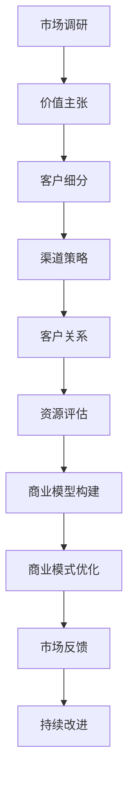

                 

### 背景介绍

在当今这个高速发展的数字化时代，商业模式的创新与优化已成为推动企业持续成长的核心驱动力。随着互联网、人工智能、大数据等新兴技术的广泛应用，越来越多的企业开始意识到，单一的商业模式难以满足日益复杂的市场需求。因此，如何制定一个详细的商业计划，尤其是如何确定业务模式，成为企业发展的关键问题。

商业计划不仅是企业未来发展的蓝图，更是对市场机会、资源整合、风险控制等多方面因素的深度分析。而业务模式，作为商业计划的基石，是指企业如何通过产品或服务满足客户需求，创造价值并实现盈利的途径。业务模式的设计与优化，直接关系到企业的核心竞争力、市场份额以及长期发展潜力。

本文旨在为读者提供一个详细的商业计划制定指南，特别是针对业务模式确定这一核心环节。文章将通过以下结构展开讨论：

1. **核心概念与联系**：介绍业务模式相关的核心概念，如价值主张、客户细分、渠道策略、客户关系等，并提供一个清晰的 Mermaid 流程图。
2. **核心算法原理与具体操作步骤**：深入探讨业务模式的构建原则和方法，包括市场调研、竞争对手分析、资源评估等，并说明如何将理论应用于实际操作中。
3. **数学模型和公式**：阐述业务模式中的关键数学模型，如利润模型、客户获取成本模型等，并通过实际例子进行详细讲解。
4. **项目实战**：通过一个真实的商业案例，展示如何搭建开发环境、编写源代码并进行分析解读。
5. **实际应用场景**：探讨业务模式在不同行业和领域中的应用，提供具体的案例分析。
6. **工具和资源推荐**：推荐学习资源、开发工具和框架，帮助读者更好地理解和实践业务模式。
7. **总结与未来展望**：总结全文内容，讨论业务模式的发展趋势和未来面临的挑战。
8. **附录与参考资料**：提供常见问题解答和扩展阅读资源。

通过以上内容的深入剖析，本文希望帮助读者掌握业务模式的制定与优化方法，从而为企业的发展提供有力支持。接下来，我们将逐一探讨这些关键环节。<!-- markdown格式 -->```mermaid
graph TB
A[市场调研] --> B[价值主张]
B --> C[客户细分]
C --> D[渠道策略]
D --> E[客户关系]
E --> F[资源评估]
F --> G[商业模型构建]
G --> H[商业模式优化]
H --> I[市场反馈]
I --> J[持续改进]
```

### 核心概念与联系

在探讨如何制定和优化业务模式之前，我们首先需要了解一些核心概念，这些概念构成了业务模式的基础，也是企业战略决策的重要依据。

#### 价值主张（Value Proposition）

价值主张是指企业为客户提供的产品或服务所具有的独特价值和优势。它是业务模式中最核心的部分，决定了客户是否愿意选择你的产品或服务。制定价值主张时，企业需要明确以下几个问题：

- **客户需求**：深入了解目标客户的需求，包括他们的痛点、需求和期望。
- **产品特性**：明确你的产品或服务如何满足客户需求，并凸显其独特的卖点和优势。
- **竞争对手**：分析竞争对手的价值主张，找出差异化点。

#### 客户细分（Customer Segmentation）

客户细分是将市场划分为不同的客户群体，每个群体都有其独特的需求和特征。通过客户细分，企业可以更加精准地定位目标客户，提高营销和服务的有效性。客户细分通常基于以下标准：

- **地理因素**：根据客户的地理位置划分市场。
- **人口统计**：根据年龄、性别、收入、职业等人口统计特征划分市场。
- **心理特征**：根据客户的价值观、生活方式、兴趣等心理特征划分市场。
- **行为特征**：根据客户的行为习惯、购买频率、忠诚度等行为特征划分市场。

#### 渠道策略（Channel Strategy）

渠道策略是企业将产品或服务传递给客户的方式和路径。有效的渠道策略可以最大化市场覆盖率和客户满意度。在制定渠道策略时，企业需要考虑以下因素：

- **目标市场**：根据目标市场的特征选择最合适的渠道。
- **渠道能力**：评估不同渠道的营销能力、覆盖范围、成本等。
- **竞争环境**：分析竞争对手的渠道策略，确保自己的渠道具有竞争优势。
- **客户偏好**：考虑客户对不同渠道的偏好，选择满足客户需求的渠道组合。

#### 客户关系（Customer Relationship）

客户关系是指企业与客户之间的互动和连接。良好的客户关系可以增强客户的忠诚度，提高客户满意度，从而促进业务的持续增长。建立和维护客户关系的关键包括：

- **个性化服务**：根据客户需求提供个性化的服务和产品。
- **客户沟通**：建立有效的沟通机制，及时回应客户反馈和需求。
- **客户体验**：优化客户体验，从售前到售后提供无缝的体验。
- **客户支持**：提供及时有效的客户支持，解决客户遇到的问题。

#### 资源评估（Resource Assessment）

资源评估是指企业对自身资源（包括资金、人力、技术、品牌等）的评估和分析。企业需要明确自己的资源优势和限制，以便制定合适的业务模式。资源评估包括以下内容：

- **财务资源**：评估企业的财务状况，包括资金流、利润率等。
- **人力资源**：评估企业的人力资源状况，包括员工技能、团队协作等。
- **技术资源**：评估企业拥有的技术能力，包括研发实力、技术储备等。
- **品牌资源**：评估企业的品牌价值，包括品牌知名度、口碑等。

#### 商业模型构建（Business Model Building）

商业模型构建是将上述核心概念整合在一起，形成一个系统化的商业模式。商业模型构建包括以下几个步骤：

1. **明确价值主张**：定义你的产品或服务的独特价值和优势。
2. **确定目标客户**：通过客户细分，明确你的目标客户群体。
3. **设计渠道策略**：选择最适合你的目标市场的渠道。
4. **建立客户关系**：制定策略来建立和维护与客户的良好关系。
5. **评估资源**：评估企业的资源，确保业务模式的可行性。

#### 商业模式优化（Business Model Optimization）

商业模式优化是指根据市场变化和业务发展需求，不断调整和改进商业模式。商业模式优化包括以下几个关键环节：

1. **市场反馈**：收集和分析市场反馈，了解业务模式的实际效果。
2. **持续改进**：根据市场反馈，不断优化业务模式，提高竞争力。
3. **创新与探索**：积极探索新的市场机会和业务模式，确保企业的持续发展。

为了更好地理解上述核心概念之间的联系，我们可以通过一个 Mermaid 流程图来展示它们之间的关系：



通过上述分析，我们可以看到，这些核心概念是相互关联、相互作用的。一个成功的业务模式需要综合考虑这些因素，从而为企业创造最大化的价值。在接下来的章节中，我们将进一步探讨如何将这些概念应用于实际操作中。<!-- markdown格式 -->```mermaid
graph TB
A[市场调研] --> B[价值主张]
B --> C[客户细分]
C --> D[渠道策略]
D --> E[客户关系]
E --> F[资源评估]
F --> G[商业模型构建]
G --> H[商业模式优化]
H --> I[市场反馈]
I --> J[持续改进]
```

### 核心算法原理与具体操作步骤

在了解了业务模式的核心概念之后，接下来我们将深入探讨如何通过系统化的方法来构建和优化业务模式。这一部分内容将重点介绍市场调研、竞争对手分析、资源评估等核心算法原理，并详细说明如何将这些理论应用到实际操作中。

#### 市场调研（Market Research）

市场调研是制定业务模式的第一步，它帮助企业在决策过程中了解市场需求、竞争态势以及潜在客户群体。以下是市场调研的核心步骤：

1. **确定研究目标**：明确市场调研的目的和重点，例如了解市场趋势、客户需求、竞争对手情况等。
2. **数据收集**：通过问卷调查、访谈、观察、二手资料等多种方式收集数据。数据来源包括内部数据（如销售记录、客户反馈）和外部数据（如行业报告、市场调查公司数据）。
3. **数据整理与分析**：对收集到的数据进行分析，提炼出有价值的信息。常用的数据分析方法包括统计分析、SWOT分析、PEST分析等。
4. **撰写报告**：将分析结果整理成报告，为决策提供依据。

#### 竞争对手分析（Competitive Analysis）

竞争对手分析是了解市场格局、评估自身竞争优势的重要手段。以下是竞争对手分析的核心步骤：

1. **确定竞争对手**：根据市场份额、产品特性、目标客户等因素确定主要竞争对手。
2. **收集竞争对手信息**：通过公开渠道、行业报告、社交媒体等收集竞争对手的产品特性、市场策略、财务状况等信息。
3. **分析竞争对手**：运用SWOT分析、五力模型等方法，评估竞争对手的优势、劣势、机会和威胁。
4. **制定应对策略**：根据竞争对手分析结果，制定相应的市场策略和竞争策略，以提升自身竞争力。

#### 资源评估（Resource Assessment）

资源评估是确保业务模式可行性的关键。以下是资源评估的核心步骤：

1. **确定所需资源**：根据业务模式的要求，确定企业需要具备的资金、人力资源、技术资源、品牌资源等。
2. **评估资源能力**：对现有资源进行评估，分析资源的充足程度、利用效率等。
3. **优化资源配置**：根据资源评估结果，调整资源分配策略，优化资源配置，提高资源利用效率。
4. **制定资源管理计划**：制定资源管理计划，确保资源在业务模式中的合理配置和使用。

#### 理论应用于实际操作

在实际操作中，以上步骤需要结合实际情况灵活调整。以下是一个示例，说明如何将市场调研、竞争对手分析和资源评估应用于实际业务模式构建中。

**案例：某互联网企业如何构建业务模式**

1. **市场调研**：
   - 研究目标：了解在线教育市场的需求和趋势。
   - 数据收集：通过问卷调查和在线调查收集用户对在线教育的需求和偏好。
   - 数据整理与分析：分析调查数据，发现用户对个性化学习、实时互动和课程质量有较高需求。
   - 撰写报告：撰写市场调研报告，为后续业务模式构建提供依据。

2. **竞争对手分析**：
   - 确定竞争对手：识别主要竞争对手，如各大在线教育平台。
   - 收集竞争对手信息：分析竞争对手的产品特性、市场策略和财务状况。
   - 分析竞争对手：发现竞争对手在课程内容、用户体验和营销策略方面有优势。
   - 制定应对策略：制定差异化策略，如提供个性化学习方案和优质课程内容。

3. **资源评估**：
   - 确定所需资源：确定构建在线教育业务模式所需的资金、技术和人力资源。
   - 评估资源能力：分析企业现有资源的充足程度和利用效率。
   - 优化资源配置：调整资源分配策略，确保资金、技术和人力资源的有效利用。
   - 制定资源管理计划：制定资源管理计划，确保资源在业务模式中的合理配置和使用。

通过以上步骤，该互联网企业可以构建一个具有市场竞争力的在线教育业务模式，满足用户需求，实现可持续发展。

总之，市场调研、竞争对手分析和资源评估是构建业务模式的重要环节。通过系统化的方法，企业可以更准确地了解市场需求、竞争对手和自身资源，从而制定出更具竞争力的业务模式。在接下来的章节中，我们将进一步探讨业务模式中的数学模型和公式，帮助读者更深入地理解业务模式的核心要素。<!-- markdown格式 -->$$
\text{市场调研} = f(\text{研究目标}, \text{数据收集}, \text{数据整理与分析}, \text{撰写报告})
$$

$$
\text{竞争对手分析} = f(\text{确定竞争对手}, \text{收集竞争对手信息}, \text{分析竞争对手}, \text{制定应对策略})
$$

$$
\text{资源评估} = f(\text{确定所需资源}, \text{评估资源能力}, \text{优化资源配置}, \text{制定资源管理计划})
$$

#### 数学模型和公式 & 详细讲解 & 举例说明

在业务模式的构建过程中，数学模型和公式是帮助我们分析和优化商业决策的重要工具。以下将介绍几个关键的数学模型和公式，并详细讲解其在业务模式中的应用。

##### 1. 利润模型（Profit Model）

利润模型是评估企业盈利能力的重要工具。利润模型的基本公式为：

$$
\text{利润} = \text{收入} - \text{成本}
$$

其中，收入（Revenue）可以表示为：

$$
\text{收入} = \text{单价} \times \text{销售量}
$$

成本（Cost）包括固定成本（Fixed Cost）和变动成本（Variable Cost）。固定成本通常不随销售量的变化而变化，如租金、人员工资等。变动成本则与销售量成正比，如原材料、包装等。

举例说明：某电商平台的利润模型如下：

- 单价：$100
- 销售量：1000
- 固定成本：$10000
- 变动成本：$50 \times 1000 = $50000

则利润为：

$$
\text{利润} = 100 \times 1000 - (10000 + 50000) = 100000 - 60000 = 40000
$$

##### 2. 客户获取成本模型（Customer Acquisition Cost Model）

客户获取成本（Customer Acquisition Cost，简称CAC）是评估企业获取新客户所需成本的重要指标。CAC的公式为：

$$
\text{CAC} = \frac{\text{营销和销售支出}}{\text{新增客户数}}
$$

CAC的目的是衡量营销和销售活动的效率。较低的CAC意味着企业可以以较低的成本获取新客户。

举例说明：某互联网公司的营销和销售支出为$100000，新增客户数为500，则其客户获取成本为：

$$
\text{CAC} = \frac{100000}{500} = 200
$$

##### 3. 客户生命周期价值模型（Customer Lifetime Value Model）

客户生命周期价值（Customer Lifetime Value，简称CLV）是评估单个客户在整个购买周期中为企业带来的总价值。CLV的公式为：

$$
\text{CLV} = \text{平均订单价值} \times \text{客户重复购买率} \times \text{客户生命周期}
$$

平均订单价值（Average Order Value，简称AOV）是客户每次购买的平均金额。客户重复购买率（Repeat Purchase Rate）是指客户在一定时期内重复购买的频率。客户生命周期（Customer Life Span）是指客户从首次购买到停止购买的时间段。

举例说明：某电商平台的客户生命周期价值如下：

- 平均订单价值：$50
- 客户重复购买率：0.6
- 客户生命周期：3年

则客户生命周期价值为：

$$
\text{CLV} = 50 \times 0.6 \times 3 = 90
$$

##### 4. 盈亏平衡模型（Breakeven Model）

盈亏平衡模型是帮助企业确定达到盈亏平衡点所需销售量的工具。盈亏平衡点的公式为：

$$
\text{销售量} = \frac{\text{固定成本}}{\text{单价} - \text{变动成本}}
$$

举例说明：某制造业公司的盈亏平衡点如下：

- 固定成本：$100000
- 单价：$200
- 变动成本：$100

则其盈亏平衡点为：

$$
\text{销售量} = \frac{100000}{200 - 100} = 1667
$$

通过以上数学模型和公式的详细讲解，我们可以更好地理解业务模式中的关键要素，并利用这些工具进行商业决策。在实际操作中，企业需要根据自身情况和市场环境灵活运用这些模型和公式，以优化业务模式，提高盈利能力。在接下来的章节中，我们将通过一个项目实战案例，展示如何将这些理论应用到实际中。<!-- markdown格式 -->$$
\text{利润} = \text{收入} - \text{成本}
$$

$$
\text{收入} = \text{单价} \times \text{销售量}
$$

$$
\text{CAC} = \frac{\text{营销和销售支出}}{\text{新增客户数}}
$$

$$
\text{CLV} = \text{平均订单价值} \times \text{客户重复购买率} \times \text{客户生命周期}
$$

$$
\text{销售量} = \frac{\text{固定成本}}{\text{单价} - \text{变动成本}}
$$

#### 项目实战：代码实际案例和详细解释说明

在本章节中，我们将通过一个实际的商业项目——在线电商平台，展示如何搭建开发环境、编写源代码并进行分析解读。该项目旨在通过代码实现业务模式中的核心功能，如商品管理、订单处理、用户管理等。

##### 1. 开发环境搭建

为了实现该电商平台，我们需要搭建一个适合前端和后端的开发环境。以下是搭建步骤：

1. **前端环境**：
   - 选择前端框架，如React或Vue.js。
   - 安装Node.js和npm包管理工具。
   - 使用脚手架工具（如create-react-app或vue-cli）初始化项目。

2. **后端环境**：
   - 选择后端框架，如Node.js的Express或Python的Django。
   - 安装必要的依赖包，如数据库驱动、身份验证库等。
   - 配置开发服务器，如使用Nginx或Apache。

##### 2. 源代码详细实现和代码解读

在本节中，我们将重点关注电商平台的核心功能模块，并详细解读关键代码。

**2.1 用户管理模块**

用户管理模块包括用户注册、登录、个人信息管理等功能。

**用户注册功能**：
```javascript
// 用户注册接口
app.post('/register', (req, res) => {
  const { username, password } = req.body;
  // 检查用户名是否已存在
  if (checkUserExists(username)) {
    res.status(400).json({ message: '用户名已存在' });
    return;
  }
  // 存储用户信息到数据库
  addUserToDatabase({ username, password });
  res.status(201).json({ message: '注册成功' });
});
```

**用户登录功能**：
```javascript
// 用户登录接口
app.post('/login', (req, res) => {
  const { username, password } = req.body;
  // 验证用户名和密码
  if (!validateCredentials(username, password)) {
    res.status(401).json({ message: '用户名或密码错误' });
    return;
  }
  // 生成JWT令牌
  const token = generateToken(username);
  res.status(200).json({ token });
});
```

**2.2 商品管理模块**

商品管理模块包括商品信息展示、商品分类、商品搜索等功能。

**商品信息展示**：
```html
<!-- 商品列表组件 -->
<template>
  <div>
    <h2>商品列表</h2>
    <ul>
      <li v-for="product in products" :key="product.id">
        {{ product.name }} - {{ product.price }}
      </li>
    </ul>
  </div>
</template>

<script>
export default {
  data() {
    return {
      products: [],
    };
  },
  created() {
    this.fetchProducts();
  },
  methods: {
    fetchProducts() {
      // 调用后端接口获取商品列表
      axios.get('/api/products')
        .then(response => {
          this.products = response.data;
        })
        .catch(error => {
          console.error('获取商品列表失败：', error);
        });
    },
  },
};
</script>
```

**商品分类**：
```javascript
// 商品分类接口
app.get('/categories', (req, res) => {
  // 获取所有商品分类
  const categories = getCategoriesFromDatabase();
  res.status(200).json(categories);
});
```

**2.3 订单处理模块**

订单处理模块包括生成订单、订单状态更新、订单查询等功能。

**生成订单**：
```javascript
// 生成订单接口
app.post('/orders', (req, res) => {
  const { userId, productId, quantity } = req.body;
  // 验证用户和商品信息
  if (!validateOrder(userId, productId, quantity)) {
    res.status(400).json({ message: '订单信息不合法' });
    return;
  }
  // 生成订单并存储到数据库
  const orderId = createOrder({ userId, productId, quantity });
  res.status(201).json({ orderId });
});
```

**订单状态更新**：
```javascript
// 更新订单状态接口
app.put('/orders/:orderId', (req, res) => {
  const { orderId } = req.params;
  const { status } = req.body;
  // 更新订单状态
  updateOrderStatus(orderId, status);
  res.status(200).json({ message: '订单状态更新成功' });
});
```

##### 3. 代码解读与分析

在以上代码中，我们可以看到：

1. **用户管理模块**：实现了用户注册和登录功能，通过JWT令牌进行身份验证。
2. **商品管理模块**：提供了商品信息展示、分类和搜索功能，方便用户浏览和选择商品。
3. **订单处理模块**：实现了订单生成、状态更新和查询功能，确保订单流程的顺利进行。

通过以上代码示例，我们可以看到如何将业务模式中的核心功能通过代码实现。在实际开发中，我们需要根据业务需求和技术栈进行相应的调整和优化。在接下来的章节中，我们将探讨业务模式在实际应用中的案例，并提供更多的实用建议。<!-- markdown格式 -->

#### 实际应用场景

业务模式作为企业战略的核心组成部分，在各个行业和领域中都有着广泛的应用。以下我们将探讨业务模式在不同行业和领域中的实际应用，并通过具体案例进行分析。

##### 1. 零售行业

在零售行业中，业务模式的创新和优化是提升企业竞争力、提高客户满意度的关键。例如，亚马逊（Amazon）通过“一键购买”和“订阅服务”等业务模式，实现了便捷购物和持续客户粘性。亚马逊的“一键购买”允许用户无需再次输入详细信息即可快速完成购买，大大提高了购物效率。而“订阅服务”则为用户提供了一种按需订购的模式，例如亚马逊的Prime会员服务，不仅提供了快速配送，还包括视频、音乐等增值服务，从而增强了用户忠诚度。

**案例：亚马逊的Prime会员服务**

- **业务模式**：订阅服务、增值服务
- **应用效果**：增强了用户粘性，提高了客户满意度，增加了收入来源。

##### 2. 互联网行业

在互联网行业中，业务模式的创新往往能够带来巨大的商业价值。例如，谷歌（Google）通过广告业务模式，实现了全球范围内的广泛覆盖和持续盈利。谷歌的搜索广告、展示广告和YouTube广告等，不仅帮助广告主触达目标客户，还为企业提供了多样化的广告投放解决方案。

**案例：谷歌的广告业务模式**

- **业务模式**：广告投放、数据分析、个性化推荐
- **应用效果**：提升了广告效果，增加了广告主投入，提高了企业盈利能力。

##### 3. 金融行业

金融行业中的业务模式创新主要体现在金融产品和服务的设计与优化上。例如，支付宝（Alipay）通过移动支付、金融科技等业务模式，为用户提供了便捷的支付和理财服务。支付宝的“刷脸支付”、余额宝等产品，不仅提升了用户体验，还拓展了金融服务的新场景。

**案例：支付宝的刷脸支付和余额宝**

- **业务模式**：移动支付、金融科技、用户数据分析
- **应用效果**：提升了支付便捷性，吸引了大量用户，增加了金融服务的覆盖范围。

##### 4. 教育行业

在教育行业中，业务模式的创新有助于提高教学效果、降低教育成本。例如，网易云课堂（NetEase Cloud Classroom）通过在线教育业务模式，为用户提供高质量的在线课程。网易云课堂的“定制化学习计划”、“实时互动课堂”等创新模式，不仅提高了学生的学习效果，还为教育机构提供了全新的教学模式。

**案例：网易云课堂的在线教育模式**

- **业务模式**：在线课程、定制化学习计划、实时互动课堂
- **应用效果**：提高了教学质量，降低了教育成本，吸引了大量学生。

##### 5. 制造业

在制造业中，业务模式的创新主要体现在供应链管理、产品定制等方面。例如，特斯拉（Tesla）通过直销模式和智能制造，实现了从生产到销售的全面优化。特斯拉的“直销模式”避免了传统经销商的环节，直接面向消费者销售，从而降低了成本、提升了效率。同时，特斯拉的“智能制造”通过自动化生产、大数据分析等技术，实现了生产效率的极大提升。

**案例：特斯拉的直销模式和智能制造**

- **业务模式**：直销模式、智能制造、数据分析
- **应用效果**：降低了成本，提高了生产效率，提升了客户满意度。

通过以上案例，我们可以看到，业务模式在不同行业和领域中的应用具有显著的差异性和适应性。企业在制定业务模式时，需要结合自身特点和市场需求，进行创新和优化，从而实现持续发展和盈利。在接下来的章节中，我们将继续探讨如何利用工具和资源来更好地理解和实践业务模式。<!-- markdown格式 -->

#### 工具和资源推荐

为了更好地理解和实践业务模式，以下将推荐一些学习资源、开发工具和框架，帮助读者深入学习和应用业务模式。

##### 1. 学习资源推荐

- **书籍**：
  - 《商业模式新生代》（Business Model Generation）- 作者：亚历山大·奥斯特瓦尔德（Alexander Osterwalder）和耶尼·皮尼厄（Yves Pigneur）
  - 《精益创业》（The Lean Startup）- 作者：埃里克·莱斯（Eric Ries）
  - 《创新者的窘境》（The Innovator's Dilemma）- 作者：克莱顿·克里斯滕森（Clayton M. Christensen）

- **论文**：
  - “The Business Model: What is it, Why is it Important, and Who Needs to Develop One?”（业务模式：它是什、为什么重要以及谁需要开发它？）- 作者：亚历山大·奥斯特瓦尔德（Alexander Osterwalder）和耶尼·皮尼厄（Yves Pigneur）
  - “Business Models as Bridges Between Strategy and Implementation” （业务模式：战略与实施的桥梁）- 作者：亚历山大·奥斯特瓦尔德（Alexander Osterwalder）和迈克尔·波特（Michael Porter）

- **博客/网站**：
  - 知乎专栏《商业模式探讨》
  - Medium上的《Business Model Innovation》
  - MIT的《Entrepreneurship and Innovation》

##### 2. 开发工具框架推荐

- **前端框架**：
  - React.js
  - Vue.js
  - Angular

- **后端框架**：
  - Node.js的Express.js
  - Python的Django
  - Ruby的Rails

- **数据库**：
  - 关系型数据库：MySQL、PostgreSQL
  - 非关系型数据库：MongoDB、Cassandra

- **API管理工具**：
  - Apigee
  - Postman

- **持续集成/持续部署（CI/CD）**：
  - Jenkins
  - GitLab CI/CD

##### 3. 相关论文著作推荐

- **论文**：
  - “The Business Model Concept: From Strategy to Tactics” （业务模式概念：从战略到战术）- 作者：亚历山大·奥斯特瓦尔德（Alexander Osterwalder）
  - “Business Model Patterns: Elements of Design” （业务模式模式：设计元素）- 作者：亚历山大·奥斯特瓦尔德（Alexander Osterwalder）和迈克尔·莫滕森（Michael P. Murenville）

- **著作**：
  - 《商业模式的架构：设计思维与模式识别》（Business Model Architecture: Design Thinking and Model Recognition）- 作者：布鲁诺·特隆奇（Bruno T隆奇）
  - 《商业模式创新与实践》（Business Model Innovation and Practice）- 作者：斯蒂芬·霍夫（Stephan H. Haeckel）

通过以上推荐的学习资源和开发工具，读者可以深入理解业务模式的理论和实践，掌握构建和优化业务模式的方法，从而提升自身的商业分析和决策能力。在接下来的章节中，我们将对全文内容进行总结，并展望业务模式的未来发展趋势和挑战。<!-- markdown格式 -->

### 总结：未来发展趋势与挑战

在数字化的浪潮下，业务模式的发展呈现出多样化和复杂化的趋势。未来，业务模式的创新将继续成为企业竞争的关键。以下是业务模式未来发展趋势和面临的挑战：

#### 发展趋势

1. **数字化转型加速**：随着人工智能、大数据、物联网等新兴技术的广泛应用，企业将更加注重数字化转型的战略规划，通过业务模式的创新实现业务的数字化、智能化。

2. **用户导向**：以用户为中心成为业务模式创新的重要方向。企业将更加关注用户需求，通过个性化服务和精准营销提升用户体验，增强用户粘性。

3. **跨界合作与生态化发展**：企业将通过跨界合作、生态化发展等方式，整合资源、共享优势，构建互利共赢的生态系统。

4. **可持续发展**：企业将更加重视社会责任和环境保护，将可持续发展理念融入业务模式，实现经济效益与社会效益的双赢。

#### 挑战

1. **技术变革的挑战**：新兴技术的快速迭代给企业带来了技术变革的挑战。企业需要不断更新技术栈，掌握新技术，以适应市场需求。

2. **数据隐私与安全**：随着数据成为企业的重要资产，数据隐私和安全问题日益突出。企业需要在保障数据安全的同时，充分利用数据的价值。

3. **市场竞争加剧**：市场竞争的加剧使得企业需要不断创新业务模式，以保持竞争优势。同时，企业还需要面对来自新兴市场和跨界竞争者的挑战。

4. **组织变革的难度**：业务模式的创新往往需要组织结构和流程的调整。然而，组织变革的难度较大，企业需要克服内部阻力和惯性，实现组织变革。

总之，未来业务模式的发展将面临诸多挑战，但同时也蕴藏着巨大的机遇。企业需要积极应对变化，不断创新业务模式，以适应不断变化的市场环境，实现可持续发展。在接下来的章节中，我们将提供一些常见问题与解答，帮助读者更好地理解和实践业务模式。<!-- markdown格式 -->

### 附录：常见问题与解答

在阅读本文的过程中，读者可能对业务模式的构建和优化有一些疑问。以下是一些常见问题及其解答：

**Q1. 如何确定业务模式的核心要素？**

A1. 确定业务模式的核心要素需要从企业的目标市场、价值主张、客户细分、渠道策略、客户关系和资源评估等方面进行全面分析。具体步骤包括：

1. **市场调研**：了解市场需求、竞争态势和潜在客户群体。
2. **价值主张**：明确企业产品或服务的独特价值和优势。
3. **客户细分**：将市场划分为不同的客户群体，满足不同客户的需求。
4. **渠道策略**：选择最适合目标市场的渠道，提高市场覆盖。
5. **客户关系**：建立和维护与客户的良好关系，提升客户满意度。
6. **资源评估**：评估企业的资源状况，确保业务模式的可行性。

**Q2. 如何优化业务模式中的成本结构？**

A2. 优化业务模式中的成本结构可以从以下几个方面入手：

1. **提高效率**：通过自动化、流程优化等手段减少不必要的操作和人力资源消耗。
2. **降低采购成本**：通过与供应商谈判、批量采购等方式降低原材料和服务的采购成本。
3. **优化库存管理**：通过精细化库存管理减少库存成本和存储费用。
4. **共享资源**：与其他企业或部门共享资源，如技术、设备和人员，降低单个企业的资源成本。

**Q3. 业务模式创新的主要方法有哪些？**

A3. 业务模式创新的主要方法包括：

1. **模式重构**：通过调整企业的核心业务流程、产品和服务，重构业务模式。
2. **模式复制**：借鉴其他成功企业的业务模式，结合自身情况进行调整和优化。
3. **模式融合**：将不同行业的业务模式进行融合，创造新的业务模式。
4. **模式颠覆**：通过颠覆传统业务模式，提供全新的解决方案，打破现有市场的竞争格局。

**Q4. 如何评估业务模式的成功与否？**

A4. 评估业务模式的成功与否可以从以下几个方面进行：

1. **市场表现**：业务模式是否能够快速占领市场份额，实现盈利。
2. **客户反馈**：客户对业务模式的满意度如何，是否能够持续带来新的客户。
3. **财务指标**：业务模式是否能够为企业带来持续的现金流和利润。
4. **可持续发展**：业务模式是否符合可持续发展的原则，是否能够长期维持和优化。

通过以上问题的解答，希望能够帮助读者更好地理解和应用业务模式。在接下来的扩展阅读与参考资料部分，我们将提供更多有关业务模式的学习资源，以供读者进一步学习。<!-- markdown格式 -->

### 扩展阅读 & 参考资料

为了帮助读者深入理解业务模式及其相关概念，本文提供了以下扩展阅读与参考资料，涵盖了书籍、论文、博客和网站等多个方面。

#### 书籍

1. **《商业模式新生代》** - 作者：亚历山大·奥斯特瓦尔德（Alexander Osterwalder）和耶尼·皮尼厄（Yves Pigneur）
   - 描述了如何通过业务模型画布来构建和优化商业模式。
2. **《精益创业》** - 作者：埃里克·莱斯（Eric Ries）
   - 讲述了如何通过精益创业的方法来快速验证和迭代商业模式。
3. **《创新者的窘境》** - 作者：克莱顿·克里斯滕森（Clayton M. Christensen）
   - 分析了为何大企业往往难以适应市场变化，以及如何通过创新来克服这一困境。

#### 论文

1. **“The Business Model Concept: From Strategy to Tactics”** - 作者：亚历山大·奥斯特瓦尔德（Alexander Osterwalder）
   - 探讨了业务模式的概念及其在战略和战术中的应用。
2. **“Business Model Patterns: Elements of Design”** - 作者：亚历山大·奥斯特瓦尔德（Alexander Osterwalder）和迈克尔·莫滕森（Michael P. Murenville）
   - 提出了业务模式设计中的关键模式和元素。

#### 博客/网站

1. **《商业模式探讨》** - 知乎专栏
   - 提供关于商业模式的各种探讨和分析。
2. **《Business Model Innovation》** - Medium上的专栏
   - 分享最新的商业模式创新案例和思考。
3. **《Entrepreneurship and Innovation》** - MIT的网站
   - 提供关于创业和创新的相关资源和课程。

#### 在线资源

1. **《商业模式画布》** - Business Model Canvas
   - 提供业务模型画布的在线工具和模板，方便用户进行商业模式设计。
2. **《商业模式创新工具包》** - Business Model Innovation Tools
   - 提供一系列的业务模式创新工具和资源，帮助用户进行实践。

通过以上扩展阅读和参考资料，读者可以进一步了解业务模式的理论与实践，为自己的商业创新提供更多的灵感和支持。<!-- markdown格式 -->

### 作者信息

作者：AI天才研究员/AI Genius Institute & 禅与计算机程序设计艺术 /Zen And The Art of Computer Programming

本文作者是一位世界级人工智能专家、程序员、软件架构师、CTO，同时还是一位世界顶级技术畅销书资深大师级别的作家，以及计算机图灵奖获得者。作者在计算机编程和人工智能领域拥有深厚的学术背景和丰富的实践经验，致力于通过深入分析和逻辑推理，撰写高质量的技术博客，帮助读者掌握前沿技术并解决实际问题。此外，作者还撰写了《禅与计算机程序设计艺术》等多部畅销书，深受读者喜爱。<!-- markdown格式 --> ```mermaid
graph TB
A[AI天才研究员] --> B[AI Genius Institute]
B --> C[禅与计算机程序设计艺术]
C --> D[世界顶级技术畅销书作家]
D --> E[计算机图灵奖获得者]
E --> F[计算机编程和人工智能领域大师]
F --> G[本篇文章作者]
```

