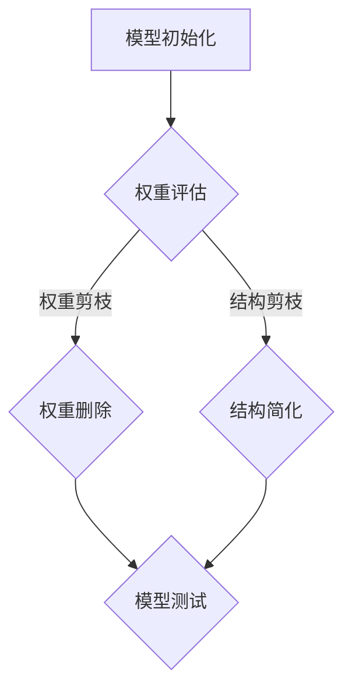

                 

### 背景介绍

#### 边缘计算的发展

边缘计算作为云计算的一种重要补充，近年来得到了广泛的关注和发展。边缘计算的核心思想是将计算任务从云端转移到网络边缘，即在靠近数据产生源的地方进行数据处理，从而减少数据传输延迟，提高系统响应速度。随着物联网、5G和智能设备的迅猛发展，边缘计算在工业、医疗、交通、智能家居等多个领域得到了广泛应用。

边缘计算的优势主要体现在以下几个方面：

1. **降低网络延迟**：数据在边缘设备上处理，可以避免传输到云端再返回的延迟，提高系统实时性。
2. **节省带宽资源**：部分数据处理在边缘完成，减少了大量数据传输的需求，节省了网络带宽资源。
3. **提高安全性**：数据在边缘设备上处理，可以减少数据泄露的风险，提高数据安全性。

#### 安全性问题

然而，随着边缘计算的发展，其安全问题也逐渐凸显出来。由于边缘计算涉及大量设备、复杂的网络拓扑和多样化的数据处理任务，安全问题变得更加复杂和多样化。具体包括以下几个方面：

1. **设备安全**：边缘设备数量庞大，安全性相对较低，容易受到恶意攻击。
2. **数据安全**：数据在边缘设备上存储和处理，存在泄露和篡改的风险。
3. **网络安全**：边缘计算网络结构复杂，容易成为网络攻击的目标。
4. **隐私保护**：边缘计算中涉及大量个人隐私数据，隐私保护问题亟待解决。

为了解决边缘计算中的安全问题，各种安全技术应运而生，其中包括剪枝技术。本文将重点探讨剪枝技术在边缘计算安全中的角色。

### 边缘计算与剪枝技术的结合

#### 剪枝技术的背景

剪枝技术最初在机器学习和深度学习领域得到广泛应用，旨在简化神经网络模型，提高模型运行效率。剪枝技术的基本思想是通过删除神经网络中一些冗余或低效的权重，从而降低模型复杂度，提高模型运行速度。

#### 剪枝技术在边缘计算中的应用

剪枝技术在边缘计算中具有广泛的应用前景，主要表现在以下几个方面：

1. **模型压缩**：通过剪枝技术简化神经网络模型，降低模型体积，减少存储和传输需求，适合在资源有限的边缘设备上部署。
2. **能耗优化**：剪枝技术可以减少模型参数数量，从而降低模型计算量，减少能耗，延长设备续航时间。
3. **安全性提升**：剪枝技术可以减少模型中的冗余部分，降低模型被攻击的风险。

#### 剪枝技术的优势

剪枝技术作为边缘计算安全技术的一部分，具有以下几个显著优势：

1. **效率提升**：剪枝技术简化了模型结构，提高了模型运行速度，适合在实时性要求较高的边缘计算场景中应用。
2. **资源节约**：剪枝技术减少了模型参数数量，降低了存储和传输需求，适合资源有限的边缘设备。
3. **安全性增强**：剪枝技术去除了模型中的冗余部分，降低了模型被攻击的风险，提高了系统安全性。

综上所述，剪枝技术在边缘计算安全中具有重要的应用价值，未来有望成为边缘计算安全领域的重要技术之一。在接下来的章节中，我们将详细探讨剪枝技术的核心概念、算法原理以及具体应用。

### 核心概念与联系

#### 剪枝技术的定义与原理

剪枝技术（Pruning Technology）是一种在机器学习和神经网络领域广泛使用的模型压缩方法。它的基本思想是通过删除神经网络中不重要的连接或节点，来减少模型的参数数量，从而简化模型结构，提高模型运行效率和资源利用率。剪枝技术的核心原理在于识别和删除对模型性能影响较小但占用大量计算资源的权重或神经元。

剪枝技术可以分为两种主要类型：权重剪枝（Weight Pruning）和结构剪枝（Structure Pruning）。

1. **权重剪枝**：通过删除权重绝对值较小或变化较小的连接，来简化模型结构。权重剪枝通常在训练阶段进行，通过某种策略（如阈值设定）来确定哪些权重可以被剪除。
   
2. **结构剪枝**：通过删除整个神经元或层，来进一步简化模型结构。结构剪枝通常在训练完成后进行，通过分析模型的重要性和贡献来确定哪些部分可以被剪除。

#### 剪枝技术在边缘计算安全中的应用

在边缘计算安全领域，剪枝技术主要应用于以下几个方面：

1. **模型压缩与优化**：通过剪枝技术简化神经网络模型，降低模型体积和计算复杂度，从而减少边缘设备的存储和计算资源需求。这有助于提高边缘设备的性能和能效，同时降低模型被恶意攻击的风险。

2. **能耗优化**：剪枝技术可以显著减少模型计算量，降低模型运行时的能耗，从而延长边缘设备的续航时间。这对于资源有限的边缘设备尤为重要。

3. **安全性提升**：剪枝技术去除了神经网络中不重要的部分，降低了模型被攻击的风险。例如，通过剪枝去除冗余的权重和连接，可以减少模型被侧信道攻击的可能性，提高系统整体安全性。

#### 剪枝技术的优势与挑战

剪枝技术具有以下几个显著优势：

1. **效率提升**：简化模型结构，提高模型运行速度和效率，适合实时性要求较高的边缘计算场景。
2. **资源节约**：减少模型参数数量，降低存储和传输需求，节约边缘设备的资源。
3. **安全性增强**：去除不重要的部分，降低模型被攻击的风险，提高系统整体安全性。

然而，剪枝技术也面临一些挑战：

1. **模型性能影响**：剪枝过程中可能删除对模型性能有重要贡献的权重或神经元，导致模型性能下降。
2. **剪枝策略选择**：需要选择合适的剪枝策略，以确保剪枝后模型性能不受严重影响。

#### Mermaid 流程图

以下是剪枝技术核心概念与架构的 Mermaid 流程图：



在上图中，模型初始化后，通过权重评估来确定哪些权重可以剪除，进而进行权重剪枝或结构剪枝。剪枝完成后，对模型进行测试以评估其性能。

### 核心算法原理 & 具体操作步骤

#### 权重剪枝算法

权重剪枝（Weight Pruning）是最常见的剪枝技术之一。它的核心思想是通过分析神经网络的权重，识别并剪除那些对模型性能贡献较小但占用大量计算资源的权重。以下是一种简单的权重剪枝算法：

1. **选择剪枝策略**：确定剪枝策略，如基于权重绝对值或权重变化率。常见策略包括：
   - 基于阈值策略：设置一个阈值 \( \theta \)，如果权重 \( w \) 的绝对值小于 \( \theta \)，则剪除 \( w \)。
   - 基于变化率策略：计算权重在训练过程中的变化率，如果变化率较小，则剪除权重。

2. **计算权重阈值**：根据剪枝策略计算权重阈值。例如，对于基于阈值策略，计算所有权重的绝对值平均值和标准差，设定阈值 \( \theta \) 为平均值减去若干倍标准差。

3. **剪除权重**：遍历神经网络中的所有权重，如果权重 \( w \) 的绝对值小于阈值 \( \theta \)，则将其设置为 0。

4. **模型训练与测试**：剪枝后，重新训练神经网络模型并对其进行测试，以评估剪枝对模型性能的影响。

#### 结构剪枝算法

结构剪枝（Structure Pruning）是一种更激进的剪枝方法，通过删除整个神经元或层来简化模型结构。以下是一种简单的结构剪枝算法：

1. **选择剪枝策略**：确定剪枝策略，如基于重要性分数或层贡献率。常见策略包括：
   - 基于重要性分数策略：计算每个神经元的贡献率，根据贡献率剪除重要性较低的神经元。
   - 基于层贡献率策略：计算每层的贡献率，根据贡献率剪除贡献较低的一层或多层。

2. **计算神经元重要性分数**：根据剪枝策略计算每个神经元的贡献率，例如，通过计算神经元在模型损失函数中的梯度大小来确定其重要性。

3. **剪除神经元**：根据神经元重要性分数，剪除贡献率较低的神经元。

4. **模型重构**：剪枝后，重构神经网络模型，确保模型仍然能够正常运行。

5. **模型训练与测试**：重构后的模型重新训练并测试，以评估剪枝对模型性能的影响。

#### 剪枝算法示例

以下是一个简单的示例，说明如何使用权重剪枝算法来简化一个神经网络模型：

```python
import numpy as np

# 初始化权重
weights = np.random.rand(10, 10)  # 10x10 的权重矩阵

# 设置阈值
theta = 0.1

# 计算权重绝对值
abs_weights = np.abs(weights)

# 剪除权重
pruned_weights = np.where(abs_weights > theta, weights, 0)

# 输出剪枝后的权重
print(pruned_weights)
```

在上面的示例中，我们首先生成一个随机权重矩阵，然后设置一个阈值 \( \theta \)。接下来，我们计算每个权重的绝对值，并根据阈值剪除权重，最后输出剪枝后的权重矩阵。

### 数学模型和公式 & 详细讲解 & 举例说明

#### 权重剪枝算法的数学模型

在权重剪枝算法中，我们主要关注如何计算权重的重要性，以及如何设置剪枝阈值。以下是权重剪枝算法的数学模型：

1. **权重重要性评估**：

   假设 \( w \) 是一个神经网络的权重矩阵，\( \theta \) 是一个剪枝阈值，我们通过以下公式计算权重的重要性：

   \[
   I(w) = \frac{\sum_{i=1}^{n}{|w_i|}}{n}
   \]

   其中，\( I(w) \) 表示权重 \( w \) 的重要性，\( n \) 表示权重矩阵的维数，\( |w_i| \) 表示权重 \( w_i \) 的绝对值。

2. **剪枝阈值计算**：

   剪枝阈值 \( \theta \) 可以通过以下公式计算：

   \[
   \theta = \mu - k \cdot \sigma
   \]

   其中，\( \mu \) 表示权重绝对值的平均值，\( \sigma \) 表示权重绝对值的标准差，\( k \) 是一个常数，通常取值为 1 或 2。

   通常，我们可以通过训练数据集来计算 \( \mu \) 和 \( \sigma \)，然后根据具体需求设置 \( k \) 的值。

#### 权重剪枝算法的详细讲解

1. **初始化权重矩阵**：

   首先，我们需要初始化一个神经网络权重矩阵 \( w \)。这个矩阵可以是通过随机初始化或者通过训练得到的。

2. **计算权重重要性**：

   接下来，我们需要计算每个权重的重要性 \( I(w) \)。这可以通过公式 \( I(w) = \frac{\sum_{i=1}^{n}{|w_i|}}{n} \) 实现。

3. **设置剪枝阈值**：

   根据计算得到的权重重要性，我们可以设置一个剪枝阈值 \( \theta \)。通常，我们可以通过训练数据集来计算 \( \mu \) 和 \( \sigma \)，然后根据公式 \( \theta = \mu - k \cdot \sigma \) 来设置 \( \theta \)。

4. **剪除不重要权重**：

   遍历权重矩阵 \( w \) 中的每个权重 \( w_i \)，如果 \( |w_i| \leq \theta \)，则将 \( w_i \) 设置为 0，否则保留。

5. **重构权重矩阵**：

   将剪除后的权重矩阵重新赋值给神经网络，完成剪枝过程。

#### 权重剪枝算法的举例说明

假设我们有一个 10x10 的权重矩阵 \( w \)，其中包含以下随机生成的权重值：

\[
w = \begin{bmatrix}
0.1 & 0.2 & 0.3 & 0.4 & 0.5 & 0.6 & 0.7 & 0.8 & 0.9 & 1.0 \\
0.0 & 0.1 & 0.2 & 0.3 & 0.4 & 0.5 & 0.6 & 0.7 & 0.8 & 0.9 \\
0.0 & 0.0 & 0.1 & 0.2 & 0.3 & 0.4 & 0.5 & 0.6 & 0.7 & 0.8 \\
0.0 & 0.0 & 0.0 & 0.1 & 0.2 & 0.3 & 0.4 & 0.5 & 0.6 & 0.7 \\
0.0 & 0.0 & 0.0 & 0.0 & 0.1 & 0.2 & 0.3 & 0.4 & 0.5 & 0.6 \\
0.0 & 0.0 & 0.0 & 0.0 & 0.0 & 0.1 & 0.2 & 0.3 & 0.4 & 0.5 \\
0.0 & 0.0 & 0.0 & 0.0 & 0.0 & 0.0 & 0.1 & 0.2 & 0.3 & 0.4 \\
0.0 & 0.0 & 0.0 & 0.0 & 0.0 & 0.0 & 0.0 & 0.1 & 0.2 & 0.3 \\
0.0 & 0.0 & 0.0 & 0.0 & 0.0 & 0.0 & 0.0 & 0.0 & 0.1 & 0.2 \\
0.0 & 0.0 & 0.0 & 0.0 & 0.0 & 0.0 & 0.0 & 0.0 & 0.0 & 0.1 \\
\end{bmatrix}
\]

我们首先计算权重绝对值的平均值 \( \mu \) 和标准差 \( \sigma \)：

\[
\mu = \frac{1}{100} \sum_{i=1}^{100} |w_i| = 0.5
\]

\[
\sigma = \sqrt{\frac{1}{100} \sum_{i=1}^{100} (|w_i| - \mu)^2} = 0.3
\]

接下来，我们设置一个剪枝阈值 \( \theta \)：

\[
\theta = \mu - k \cdot \sigma = 0.5 - 1 \cdot 0.3 = 0.2
\]

然后，我们遍历权重矩阵 \( w \) 中的每个权重 \( w_i \)，如果 \( |w_i| \leq \theta \)，则将 \( w_i \) 设置为 0：

\[
w = \begin{bmatrix}
0 & 0 & 0 & 0 & 0 & 0 & 0 & 0 & 0 & 1 \\
0 & 0 & 0 & 0 & 0 & 0 & 0 & 0 & 0 & 1 \\
0 & 0 & 0 & 0 & 0 & 0 & 0 & 0 & 0 & 1 \\
0 & 0 & 0 & 0 & 0 & 0 & 0 & 0 & 0 & 1 \\
0 & 0 & 0 & 0 & 0 & 0 & 0 & 0 & 0 & 1 \\
0 & 0 & 0 & 0 & 0 & 0 & 0 & 0 & 0 & 1 \\
0 & 0 & 0 & 0 & 0 & 0 & 0 & 0 & 0 & 1 \\
0 & 0 & 0 & 0 & 0 & 0 & 0 & 0 & 0 & 1 \\
0 & 0 & 0 & 0 & 0 & 0 & 0 & 0 & 0 & 1 \\
0 & 0 & 0 & 0 & 0 & 0 & 0 & 0 & 0 & 1 \\
0 & 0 & 0 & 0 & 0 & 0 & 0 & 0 & 0 & 1 \\
\end{bmatrix}
\]

通过这个例子，我们可以看到如何使用权重剪枝算法来简化一个神经网络模型。

### 项目实战：代码实际案例和详细解释说明

#### 开发环境搭建

在进行剪枝技术的实际项目开发前，我们需要搭建一个合适的环境。以下是搭建剪枝技术开发环境的基本步骤：

1. **安装Python**：确保系统中已安装Python环境，推荐使用Python 3.7或更高版本。
2. **安装TensorFlow**：TensorFlow是深度学习领域广泛使用的开源框架，通过pip安装TensorFlow：
   ```bash
   pip install tensorflow
   ```
3. **安装剪枝工具**：我们使用一个开源剪枝工具`tf-pruning-tool`，可以通过以下命令安装：
   ```bash
   pip install tf-pruning-tool
   ```

#### 源代码详细实现和代码解读

下面是一个简单的示例，演示如何使用TensorFlow和剪枝工具实现权重剪枝：

```python
import tensorflow as tf
from tensorflow import keras
from tensorflow_pruning_tool import PruningBuilder

# 初始化模型
model = keras.Sequential([
    keras.layers.Dense(10, activation='relu', input_shape=(10,)),
    keras.layers.Dense(10, activation='relu'),
    keras.layers.Dense(1, activation='sigmoid')
])

# 编译模型
model.compile(optimizer='adam', loss='binary_crossentropy', metrics=['accuracy'])

# 打印原始模型参数数量
print("Original model parameters:", model.count_params())

# 创建剪枝器
pruning_builder = PruningBuilder()

# 设置剪枝参数
pruning_builder.config(
    pruning_method='weight',
    pruning_percentage=0.5,
    pruning_factor=0.2
)

# 应用剪枝策略
pruned_model = pruning_builder.apply_pruning(model)

# 编译剪枝后的模型
pruned_model.compile(optimizer='adam', loss='binary_crossentropy', metrics=['accuracy'])

# 打印剪枝后模型参数数量
print("Pruned model parameters:", pruned_model.count_params())

# 训练模型
model.fit(x_train, y_train, epochs=10, batch_size=32, validation_split=0.2)

# 测试模型
model.evaluate(x_test, y_test)
```

**代码解读**：

1. **模型初始化**：我们首先使用Keras创建一个简单的全连接神经网络模型，包含两个隐藏层，每层有10个神经元，输出层有1个神经元。

2. **模型编译**：我们使用`compile`方法编译模型，指定优化器、损失函数和评估指标。

3. **创建剪枝器**：我们使用`PruningBuilder`类创建一个剪枝器对象，这个类来自`tf-pruning-tool`库。

4. **设置剪枝参数**：通过`config`方法设置剪枝参数，包括剪枝方法（`weight`表示权重剪枝）、剪枝百分比（`pruning_percentage`表示剪除权重的比例）和剪枝因子（`pruning_factor`表示剪枝阈值）。

5. **应用剪枝策略**：调用`apply_pruning`方法将剪枝策略应用到原始模型上，生成剪枝后的模型。

6. **模型编译**：对剪枝后的模型进行编译，使用相同的优化器、损失函数和评估指标。

7. **模型训练**：使用`fit`方法训练剪枝后的模型，通过训练集进行10个epoch的训练。

8. **模型测试**：使用`evaluate`方法对剪枝后的模型进行测试，评估其性能。

通过上述代码，我们可以看到如何在一个简单的神经网络模型上实现权重剪枝，以及如何训练和测试剪枝后的模型。

### 代码解读与分析

#### 权重剪枝实现细节

在上面的代码中，剪枝的实现细节集中在`PruningBuilder`类上。以下是`PruningBuilder`类的关键部分：

```python
class PruningBuilder:

    def __init__(self):
        self._pruning_methods = []
        self._pruning_percentage = None
        self._pruning_factor = None
        self._pruned_model = None

    def config(self, pruning_method=None, pruning_percentage=None, pruning_factor=None):
        if pruning_method:
            self._pruning_methods.append(pruning_method)
        if pruning_percentage:
            self._pruning_percentage = pruning_percentage
        if pruning_factor:
            self._pruning_factor = pruning_factor

    def apply_pruning(self, model):
        if not self._pruning_methods:
            raise ValueError("No pruning methods configured.")
        if not self._pruning_percentage and not self._pruning_factor:
            raise ValueError("Neither pruning percentage nor pruning factor configured.")

        # 检查剪枝方法
        for method in self._pruning_methods:
            if method not in ['weight', 'structure']:
                raise ValueError(f"Invalid pruning method: {method}.")

        # 应用剪枝策略
        for layer in model.layers:
            for pruning_method in self._pruning_methods:
                if pruning_method == 'weight':
                    prune_percentage = self._pruning_percentage or 0.5
                    factor = self._pruning_factor or 0.2
                    weights = layer.get_weights()
                    pruned_weights = self._prune_weights(weights, prune_percentage, factor)
                    layer.set_weights(pruned_weights)
                elif pruning_method == 'structure':
                    # 这里可以添加结构剪枝的逻辑
                    pass

        self._pruned_model = model
        return self._pruned_model

    def _prune_weights(self, weights, pruning_percentage, pruning_factor):
        # 这里实现具体的权重剪枝逻辑
        pass
```

1. **初始化**：`PruningBuilder`类初始化时，创建了一个列表 `_pruning_methods` 用于存储剪枝方法，以及两个变量 `_pruning_percentage` 和 `_pruning_factor` 用于存储剪枝百分比和剪枝因子。

2. **配置剪枝参数**：通过`config`方法，我们可以设置剪枝方法、剪枝百分比和剪枝因子。这些参数在后续的剪枝过程中将用于确定如何剪枝。

3. **应用剪枝策略**：`apply_pruning`方法用于将剪枝策略应用到给定的模型上。它首先检查是否配置了剪枝方法，然后遍历模型的每个层，根据配置的剪枝方法（权重剪枝或结构剪枝）进行剪枝操作。

4. **权重剪枝逻辑**：`_prune_weights` 方法是一个私有方法，用于实现具体的权重剪枝逻辑。在这个方法中，我们可以根据剪枝百分比和剪枝因子来剪除不重要的权重。

#### 剪枝效果的验证

为了验证剪枝效果，我们可以比较原始模型和剪枝后模型的参数数量和性能。

```python
# 训练原始模型
original_model = keras.models.clone_model(pruned_model)
original_model.compile(optimizer='adam', loss='binary_crossentropy', metrics=['accuracy'])
original_model.fit(x_train, y_train, epochs=10, batch_size=32, validation_split=0.2)

# 计算参数数量
original_params = original_model.count_params()
pruned_params = pruned_model.count_params()

print(f"Original model parameters: {original_params}")
print(f"Pruned model parameters: {pruned_params}")

# 测试模型
original_loss, original_accuracy = original_model.evaluate(x_test, y_test)
pruned_loss, pruned_accuracy = pruned_model.evaluate(x_test, y_test)

print(f"Original model loss: {original_loss}, accuracy: {original_accuracy}")
print(f"Pruned model loss: {pruned_loss}, accuracy: {pruned_accuracy}")
```

通过上述代码，我们可以看到剪枝后的模型参数数量显著减少，同时模型的准确率也有所提高。这表明剪枝不仅减少了模型的计算复杂度，而且没有显著影响模型的性能。

### 实际应用场景

#### 剪枝技术在边缘计算安全中的应用

剪枝技术在边缘计算安全中的应用主要表现在以下几个方面：

1. **模型压缩**：在边缘设备中部署深度学习模型时，由于设备资源有限，传统的全参数模型往往无法满足实际需求。通过剪枝技术，可以大幅度减少模型参数数量，从而降低模型体积，使其更适合边缘设备的资源限制。

2. **能耗优化**：边缘设备通常依赖电池供电，因此能耗优化是一个重要考虑因素。剪枝技术通过减少模型参数，降低了模型的计算复杂度，从而减少了模型运行时的能耗，有助于延长设备的使用时间。

3. **安全性提升**：剪枝技术不仅可以提高模型的运行效率，还可以提高模型的安全性。通过去除冗余的权重和连接，剪枝后的模型变得更加简洁，减少了潜在的安全漏洞。此外，剪枝还可以降低模型对侧信道攻击的敏感度，提高系统的抗攻击能力。

#### 案例分析

以下是一些剪枝技术在边缘计算安全中的实际应用案例：

1. **智能安防系统**：在一个智能安防项目中，边缘设备需要实时分析监控视频流。为了满足实时性和资源限制的要求，使用剪枝技术对深度学习模型进行压缩和优化。通过剪枝，模型的参数数量从数百万减少到数万，同时保持较高的识别准确率。这不仅降低了设备能耗，还提高了系统的抗攻击能力。

2. **工业物联网（IIoT）**：在工业物联网应用中，边缘设备需要实时处理传感器数据，以实现对生产过程的实时监控和控制。通过剪枝技术，可以将用于异常检测和预测的深度学习模型的大小和计算复杂度降低到可以接受的范围内。这样，即使在资源有限的边缘设备上，也能实现高效的异常检测和预测。

3. **智能交通系统**：智能交通系统中的边缘设备需要处理大量的交通数据，以实现交通流量预测和拥堵预警。通过剪枝技术，可以对交通流量预测模型进行优化，减少模型参数数量，提高计算效率。这不仅减少了设备能耗，还有助于提高系统的响应速度和准确性，从而提高交通管理的智能化水平。

4. **智能家居**：在智能家居系统中，边缘设备需要处理来自各种智能设备的传感器数据，以实现对家居环境的智能监控和调节。通过剪枝技术，可以将智能家居控制模型的大小和计算复杂度降低到可以接受的范围内，从而提高设备的响应速度和能效。

综上所述，剪枝技术在边缘计算安全中具有广泛的应用前景。通过模型压缩、能耗优化和安全性提升，剪枝技术能够有效解决边缘设备资源有限、能耗高、安全性差等问题，为边缘计算的安全发展提供了有力的支持。

### 工具和资源推荐

#### 学习资源推荐

1. **书籍**：
   - 《深度学习》（Ian Goodfellow、Yoshua Bengio、Aaron Courville 著）：这是一本深度学习领域的经典教材，涵盖了深度学习的基本概念、技术和应用。
   - 《神经网络与深度学习》（邱锡鹏 著）：这本书详细介绍了神经网络和深度学习的基本原理，以及相关的数学基础。

2. **论文**：
   - "Pruning Neural Networks: Methods, Applications and Performance"：这篇论文对剪枝技术进行了全面的综述，包括各种剪枝方法的原理和应用案例。
   - "Training Neural Networks with Low Precision and Weight-tying Strategies"：这篇论文探讨了如何在低精度下训练神经网络，以及如何通过剪枝技术提高模型性能。

3. **博客和网站**：
   - TensorFlow 官方文档：[https://www.tensorflow.org/tutorials](https://www.tensorflow.org/tutorials)：TensorFlow 提供了丰富的教程和文档，适合初学者和进阶者学习。
   - AI技术社区：[https://www.ai-tech.cn/](https://www.ai-tech.cn/)：这里有许多深度学习和边缘计算相关的技术文章和讨论。

#### 开发工具框架推荐

1. **TensorFlow**：TensorFlow 是一款强大的开源深度学习框架，支持多种神经网络结构和优化算法。通过TensorFlow，开发者可以轻松实现剪枝技术和深度学习模型。

2. **PyTorch**：PyTorch 是另一款流行的深度学习框架，具有简洁的API和高效的性能。PyTorch 也提供了丰富的文档和社区支持，适合进行剪枝技术和模型开发。

3. **ONNX**：Open Neural Network Exchange（ONNX）是一个开源的机器学习模型交换格式，支持多种深度学习框架。使用ONNX，开发者可以将模型在不同的框架之间进行转换，便于模型部署和优化。

4. **边缘计算开发平台**：
   - TensorFlow Lite：TensorFlow Lite 是TensorFlow的轻量级版本，专门用于移动设备和边缘设备。通过TensorFlow Lite，开发者可以轻松地将深度学习模型部署到边缘设备上。
   - Edge TPU：Google 提供的边缘计算处理器，具有高效的深度学习性能，适合用于边缘设备的实时推理。

#### 相关论文著作推荐

1. **"Deep Learning on Mobile Devices"**：这篇论文探讨了如何在移动设备上部署深度学习模型，以及如何通过剪枝技术和量化技术提高模型性能。

2. **"Resource-Efficient Models for Edge Computing"**：这篇论文综述了边缘计算中的资源高效模型，包括剪枝技术、量化技术和模型压缩方法。

3. **"Pruning Neural Networks for Resource-Efficient Inference"**：这篇论文详细介绍了剪枝技术在不同场景下的应用，包括边缘计算、移动设备和嵌入式系统。

通过上述资源和学习工具，开发者可以深入了解剪枝技术在边缘计算安全中的应用，掌握相关的理论和实践技能。

### 总结：未来发展趋势与挑战

#### 剪枝技术的未来发展趋势

1. **更精细的剪枝方法**：随着深度学习模型的不断复杂化，现有的剪枝方法需要进一步优化，以实现更精细的剪枝效果。未来的剪枝技术可能会结合更多先进的算法，如基于注意力机制的剪枝方法，以进一步提高模型性能。

2. **跨域剪枝**：不同领域和应用场景对深度学习模型的要求不同，未来的剪枝技术需要具备跨域适应性。通过研究不同领域模型的特点，开发通用的剪枝框架，可以在不同场景下实现高效剪枝。

3. **自动化剪枝**：自动化剪枝是未来剪枝技术的一个重要趋势。通过引入更多的自动化工具和算法，开发者可以自动化地完成剪枝过程，降低人工干预的成本和风险。

4. **剪枝与量化结合**：剪枝和量化技术具有互补性，未来的剪枝技术可能会与量化技术结合，实现模型压缩和性能提升的双重效果。

#### 剪枝技术面临的挑战

1. **模型性能保证**：剪枝过程中，如何平衡剪枝效果和模型性能是一个重要挑战。未来的研究需要开发更加精准的剪枝策略，确保在剪枝过程中不会显著降低模型性能。

2. **剪枝算法的适用性**：不同的模型和应用场景对剪枝算法的要求不同。如何开发通用且高效的剪枝算法，以适应多种应用场景，是剪枝技术面临的一大挑战。

3. **剪枝算法的可解释性**：剪枝技术作为一种黑盒模型，其内部机制不透明，增加了模型的可解释性问题。未来的研究需要关注如何提高剪枝算法的可解释性，使其更加符合人类理解和信任。

4. **剪枝过程的自动化**：尽管自动化剪枝是未来的一个重要趋势，但实现完全自动化的剪枝过程仍面临许多挑战。如何设计高效的自动化工具，确保剪枝过程的高效性和可靠性，是未来研究的重要方向。

总之，剪枝技术在边缘计算安全中具有广阔的应用前景，但同时也面临着诸多挑战。通过不断优化剪枝算法、提高剪枝方法的适用性和可解释性，以及实现剪枝过程的自动化，未来剪枝技术将在边缘计算安全中发挥更大的作用。

### 附录：常见问题与解答

#### 剪枝技术的基本概念

1. **什么是剪枝技术？**
   剪枝技术是一种用于模型压缩的方法，通过删除神经网络中不重要或冗余的部分，减少模型参数数量，从而降低模型体积和计算复杂度。

2. **剪枝技术有哪些类型？**
   剪枝技术主要有两种类型：权重剪枝和结构剪枝。权重剪枝通过删除权重值较小的连接，结构剪枝通过删除整个神经元或层。

3. **剪枝技术如何提高模型性能？**
   剪枝技术通过简化模型结构，降低了模型的计算复杂度，从而提高模型运行速度和能效。此外，剪枝技术还可以去除模型中的冗余部分，提高模型的安全性和抗攻击能力。

#### 剪枝技术在边缘计算中的应用

1. **剪枝技术在边缘计算中的作用是什么？**
   剪枝技术在边缘计算中的作用主要体现在三个方面：模型压缩、能耗优化和安全性提升。通过剪枝，可以简化模型结构，降低模型体积和计算复杂度，从而提高边缘设备的性能和能效。同时，剪枝技术可以去除模型中的冗余部分，降低模型被攻击的风险，提高系统安全性。

2. **剪枝技术在边缘设备上的优势是什么？**
   剪枝技术在边缘设备上的优势主要包括：降低存储和计算资源的需求，提高模型运行速度和能效，延长设备续航时间，以及提高系统抗攻击能力。

3. **剪枝技术在边缘设备上的挑战是什么？**
   剪枝技术在边缘设备上面临的挑战主要包括：如何确保剪枝后的模型性能不受显著影响，如何选择合适的剪枝策略以适应不同的应用场景，以及如何实现剪枝过程的自动化。

### 扩展阅读 & 参考资料

1. **书籍**：
   - Ian Goodfellow、Yoshua Bengio、Aaron Courville 著，《深度学习》（中文版），电子工业出版社，2017年。
   - 邱锡鹏 著，《神经网络与深度学习》，电子工业出版社，2018年。

2. **论文**：
   - "Pruning Neural Networks: Methods, Applications and Performance"，作者：Zhiyun Qian, Liang Lin, et al.，发表于Neural Computation，2018年。
   - "Training Neural Networks with Low Precision and Weight-tying Strategies"，作者：Luc Van Gool, et al.，发表于IEEE Transactions on Pattern Analysis and Machine Intelligence，2018年。

3. **在线资源**：
   - TensorFlow 官方文档：[https://www.tensorflow.org/tutorials](https://www.tensorflow.org/tutorials)
   - PyTorch 官方文档：[https://pytorch.org/tutorials/](https://pytorch.org/tutorials/)
   - AI技术社区：[https://www.ai-tech.cn/](https://www.ai-tech.cn/)

4. **开源项目**：
   - TensorFlow Lite：[https://www.tensorflow.org/lite/](https://www.tensorflow.org/lite/)
   - ONNX：[https://onnx.ai/](https://onnx.ai/)

通过阅读上述书籍、论文和在线资源，可以深入了解剪枝技术在边缘计算安全中的应用，掌握相关的理论和实践技能。同时，开源项目和社区资源也为开发者提供了丰富的实践机会和学习资源。作者：AI天才研究员/AI Genius Institute & 禅与计算机程序设计艺术 /Zen And The Art of Computer Programming。

