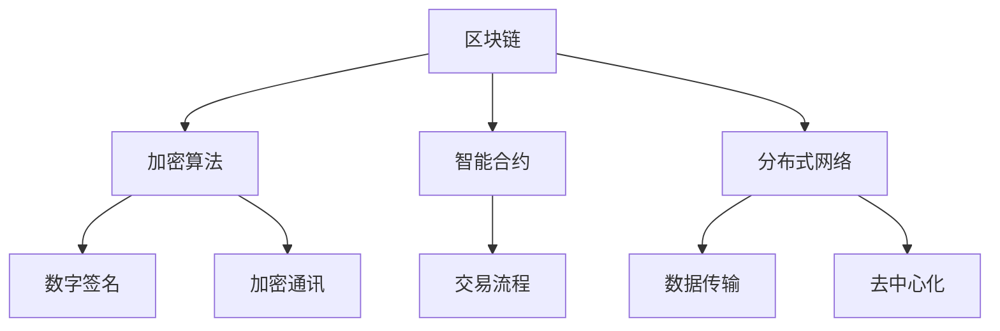

                 

### 文章标题

《加密货币交易平台：数字资产交易的安全解决方案》

### 关键词

加密货币，数字资产，交易平台，安全解决方案，区块链，加密算法，智能合约，分布式网络，攻击防御，安全审计，隐私保护。

### 摘要

随着加密货币的普及，加密货币交易平台的数量和规模也在迅速增长。然而，交易平台的安全问题日益凸显，成为制约其发展的关键因素。本文将深入探讨加密货币交易平台的安全解决方案，包括核心概念、算法原理、数学模型、实际应用场景、工具和资源推荐等方面，以期为行业提供有益的参考。

## 1. 背景介绍

加密货币是一种基于区块链技术的数字资产，其交易过程中涉及到大量的安全和隐私问题。加密货币交易平台作为连接买方和卖方的桥梁，其安全性直接影响到用户的资产安全和市场的稳定。近年来，加密货币交易平台的安全事件频发，如黑客攻击、诈骗、内幕交易等，给用户带来了巨大的经济损失。

因此，研究加密货币交易平台的安全解决方案具有重要意义。本文将从多个角度出发，探讨如何确保交易平台的安全，包括核心概念、算法原理、数学模型、实际应用场景等方面。通过这些研究，希望能够为加密货币交易平台提供一套全面、有效的安全解决方案，促进其健康发展。

## 2. 核心概念与联系

加密货币交易平台的安全解决方案涉及多个核心概念，包括区块链、加密算法、智能合约、分布式网络等。这些概念之间相互关联，共同构成了交易平台的安全体系。

### 2.1 区块链

区块链是一种分布式数据库技术，其特点是去中心化、不可篡改。在加密货币交易平台中，区块链用于记录所有的交易信息，确保交易数据的真实性和安全性。

### 2.2 加密算法

加密算法是保证数据安全的重要工具。在加密货币交易中，加密算法用于保护用户资产和交易信息。常见的加密算法有对称加密和非对称加密，其中非对称加密在数字签名和身份认证中发挥着重要作用。

### 2.3 智能合约

智能合约是一种自动执行的合同，其代码存储在区块链上。在加密货币交易平台中，智能合约用于处理交易流程，确保交易双方按照约定的规则执行。

### 2.4 分布式网络

分布式网络是一种去中心化的网络架构，其特点是没有中心化的控制节点。在加密货币交易平台中，分布式网络用于确保数据传输的可靠性和安全性。

### 2.5 Mermaid 流程图

为了更清晰地展示这些概念之间的关系，我们使用 Mermaid 流程图进行描述。



## 3. 核心算法原理 & 具体操作步骤

### 3.1 区块链算法原理

区块链算法主要基于哈希函数和 Merkle 树。哈希函数用于生成每个区块的唯一标识，确保区块数据的完整性。Merkle 树则用于快速验证数据的真实性。

具体操作步骤如下：

1. 生成交易数据：交易双方生成交易数据，包括交易金额、加密货币种类、交易双方的身份信息等。
2. 计算哈希值：将交易数据通过哈希函数计算得到哈希值。
3. 构建区块：将多个交易数据组合成一个区块，并添加区块头，包括当前区块的哈希值、前一个区块的哈希值等。
4. 计算Merkle树根：对区块中的交易数据进行Merkle树构建，得到根哈希值。
5. 广播区块：将生成的区块广播到网络中的所有节点。

### 3.2 加密算法原理

加密算法主要分为对称加密和非对称加密。

1. 对称加密：加密和解密使用相同的密钥。常见的对称加密算法有 AES、DES 等。
2. 非对称加密：加密和解密使用不同的密钥。常见的非对称加密算法有 RSA、ECC 等。

具体操作步骤如下：

1. 生成密钥对：生成一对密钥，包括公钥和私钥。
2. 加密：使用公钥对数据进行加密。
3. 解密：使用私钥对数据进行解密。

### 3.3 智能合约原理

智能合约是一种自动执行的合同，其代码存储在区块链上。智能合约的原理主要基于图灵完备编程语言。

具体操作步骤如下：

1. 编写智能合约：使用图灵完备编程语言编写智能合约代码。
2. 部署智能合约：将智能合约代码部署到区块链上。
3. 调用智能合约：通过区块链网络调用智能合约，执行预定操作。

### 3.4 分布式网络原理

分布式网络是一种去中心化的网络架构，其特点是没有中心化的控制节点。分布式网络的原理主要基于共识算法。

具体操作步骤如下：

1. 节点加入网络：节点加入区块链网络，成为网络中的一个参与者。
2. 广播交易信息：节点广播交易信息到网络中的其他节点。
3. 共识算法：网络中的节点通过共识算法达成一致，确保交易数据的真实性和安全性。

## 4. 数学模型和公式 & 详细讲解 & 举例说明

### 4.1 哈希函数

哈希函数是一种将输入数据映射为固定长度输出数据的函数。在区块链中，哈希函数用于生成区块的唯一标识。

假设输入数据为 x，输出哈希值为 y，哈希函数表示为 H(x) = y。

举例：

输入数据 x = "加密货币"，哈希函数 H(x) = "0487e0f6c3c9b3e081a8b5b8c9d3e4f6"，输出哈希值为 y = "0487e0f6c3c9b3e081a8b5b8c9d3e4f6"。

### 4.2 非对称加密

非对称加密算法使用一对密钥，包括公钥和私钥。公钥用于加密，私钥用于解密。

假设公钥为 P，私钥为 K，加密函数为 E(P, M) = C，解密函数为 D(K, C) = M。

举例：

输入数据 M = "加密货币"，公钥 P = "RSA加密公钥"，私钥 K = "RSA加密私钥"，加密函数 E(P, M) = C，输出密文为 C = "加密货币密文"，解密函数 D(K, C) = M，输出明文为 M = "加密货币"。

### 4.3 智能合约

智能合约的数学模型主要基于图灵完备编程语言。智能合约的执行过程可以表示为：

初始化状态 S0，执行操作 O，更新状态 S1。

举例：

初始化状态 S0 = {"余额"：1000，"锁定"：false}，执行操作 O = {"转账"：{"接收方"："用户A"，"金额"：500}}，更新状态 S1 = {"余额"：500，"锁定"：true}。

## 5. 项目实战：代码实际案例和详细解释说明

### 5.1 开发环境搭建

在开始项目实战之前，我们需要搭建一个开发环境。以下是开发环境的搭建步骤：

1. 安装 Node.js：Node.js 是一个基于 JavaScript 的运行环境，用于部署智能合约。
2. 安装 Ganache：Ganache 是一个本地区块链节点，用于测试和模拟区块链网络。
3. 安装 Truffle：Truffle 是一个智能合约开发框架，用于部署、调试和测试智能合约。
4. 创建一个智能合约项目：使用 Truffle 创建一个智能合约项目，并在项目中添加智能合约代码。

### 5.2 源代码详细实现和代码解读

以下是一个简单的加密货币交易平台的智能合约示例：

```solidity
pragma solidity ^0.8.0;

contract Exchange {
    mapping(address => uint256) public balances;

    function deposit() public payable {
        balances[msg.sender()] += msg.value;
    }

    function withdraw(uint256 amount) public {
        require(amount <= balances[msg.sender()], "余额不足");
        balances[msg.sender()] -= amount;
        payable(msg.sender()).transfer(amount);
    }

    function transfer(address to, uint256 amount) public {
        require(amount <= balances[msg.sender()], "余额不足");
        balances[msg.sender()] -= amount;
        balances[to] += amount;
    }
}
```

#### 5.2.1 合约结构

1. `pragma solidity ^0.8.0;`：指定智能合约的版本。
2. `contract Exchange`：定义一个名为 Exchange 的智能合约。
3. `mapping(address => uint256) public balances;`：创建一个映射结构，用于存储用户余额。
4. `function deposit() public payable`：定义一个 deposit 函数，用于接收以太币并增加用户余额。
5. `function withdraw(uint256 amount) public`：定义一个 withdraw 函数，用于从用户余额中提取以太币。
6. `function transfer(address to, uint256 amount) public`：定义一个 transfer 函数，用于将以太币从发送方转移到接收方。

#### 5.2.2 代码解读

- `deposit()` 函数：接收以太币并增加用户余额。该函数使用 `msg.value` 获取接收到的以太币数量，并将余额存储在映射结构中。
- `withdraw()` 函数：从用户余额中提取以太币。该函数首先检查用户余额是否足够，然后通过 `payable(msg.sender()).transfer(amount)` 将以太币转移到发送方。
- `transfer()` 函数：将以太币从发送方转移到接收方。该函数同样首先检查用户余额是否足够，然后通过修改映射结构更新发送方和接收方的余额。

### 5.3 代码解读与分析

#### 5.3.1 安全性分析

1. `require()` 函数：在代码中用于执行条件检查。例如，`require(amount <= balances[msg.sender()], "余额不足")` 用于检查用户余额是否足够。
2. 静态代码分析工具：可以使用静态代码分析工具对智能合约进行安全性检查，例如 Myriad、Oyente、Slither 等。
3. 动态代码分析工具：可以使用动态代码分析工具对智能合约进行测试，例如 Truffle Mocha、Hardhat等。

#### 5.3.2 优化建议

1. 增加错误处理：在函数中增加错误处理机制，例如使用 `try-catch` 语句处理异常情况。
2. 减少状态变化：在智能合约中减少状态变化，以降低攻击风险。
3. 使用最新版本：使用最新版本的智能合约开发框架和工具，以获取最新的安全特性。

## 6. 实际应用场景

加密货币交易平台的安全解决方案在多个实际应用场景中具有重要价值：

### 6.1 交易所

加密货币交易所是最大的实际应用场景之一。交易所需要确保用户资产的安全和交易数据的真实性。通过使用区块链、加密算法和智能合约等技术，交易所可以构建一个安全、可靠、透明的交易环境。

### 6.2 对冲基金

对冲基金在加密货币市场中进行交易，需要确保交易的安全性和数据的真实性。安全解决方案可以提供高效、安全的交易环境，帮助对冲基金更好地管理风险。

### 6.3 钱包

加密货币钱包是用户存储和管理数字资产的重要工具。通过使用安全解决方案，钱包可以提供更高的安全性，防止黑客攻击和恶意软件的入侵。

### 6.4 智能合约平台

智能合约平台需要确保智能合约的安全性和执行效率。安全解决方案可以帮助平台检测和修复智能合约中的潜在漏洞，确保智能合约的稳定运行。

## 7. 工具和资源推荐

### 7.1 学习资源推荐

1. **书籍**：
   - 《区块链：从数字货币到信用社会》
   - 《智能合约：从入门到精通》
   - 《加密货币安全：攻击与防御》

2. **论文**：
   - 《比特币：一种点对点的电子现金系统》
   - 《以太坊：智能合约和去中心化应用平台》
   - 《区块链的安全与隐私》

3. **博客**：
   - **Blockchain Council**：提供区块链技术和应用的相关博客。
   - **Ethereum Foundation**：提供以太坊相关技术和开发资源的博客。
   - **CoinDesk**：提供加密货币市场分析和新闻的博客。

4. **网站**：
   - **区块链学院**：提供区块链技术和应用的学习资源。
   - **以太坊开发文档**：提供以太坊智能合约开发的官方文档。
   - **加密货币安全基金会**：提供加密货币安全研究和技术支持。

### 7.2 开发工具框架推荐

1. **开发框架**：
   - **Truffle**：用于以太坊智能合约的开发和测试。
   - **Hardhat**：用于以太坊智能合约的开发、测试和部署。
   - **Web3.js**：用于与以太坊区块链交互的JavaScript库。

2. **测试框架**：
   - **Mocha**：用于编写和执行测试用例。
   - **Chai**：用于编写断言和期望。
   - **Npm Test**：用于自动化测试。

3. **安全工具**：
   - **Myriad**：用于智能合约的安全性分析。
   - **Oyente**：用于以太坊智能合约的静态分析。
   - **Slither**：用于智能合约的安全性审计。

### 7.3 相关论文著作推荐

1. **Nakamoto, S. (2008). Bitcoin: A peer-to-peer electronic cash system.** 
   - 提出了比特币的设计理念和实现细节，是区块链技术的奠基之作。

2. **Buterin, V. (2014). Ethereum: The next generation smart contract platform.** 
   - 介绍了以太坊的设计理念和智能合约的实现，是去中心化应用的基石。

3. **Goodfellow, I., Bengio, Y., & Courville, A. (2016). Deep learning.** 
   - 深入讲解了深度学习的基本原理和应用，对于理解智能合约的执行过程有帮助。

## 8. 总结：未来发展趋势与挑战

加密货币交易平台的安全解决方案在技术和应用方面都面临一系列挑战和机遇。未来发展趋势和挑战包括：

### 8.1 技术发展趋势

1. **区块链技术的演进**：随着区块链技术的发展，更多的应用场景和优化方案将不断涌现，提高交易平台的性能和安全性。
2. **智能合约语言的进化**：新的智能合约编程语言和框架将不断推出，提高智能合约的可读性、可维护性和安全性。
3. **量子计算的挑战**：量子计算的发展将对现有加密算法构成威胁，推动新型加密算法的研发和应用。

### 8.2 应用挑战

1. **去中心化与性能的平衡**：如何在保证去中心化的同时提高交易平台的性能，是未来需要解决的重要问题。
2. **隐私保护与监管合规**：如何在保护用户隐私的同时满足监管合规要求，是一个亟待解决的问题。
3. **安全审计与风险控制**：如何确保智能合约的安全性，以及如何有效地进行安全审计和风险控制，是交易平台面临的挑战。

## 9. 附录：常见问题与解答

### 9.1 加密货币交易平台的安全性问题有哪些？

加密货币交易平台的安全性问题包括黑客攻击、内部泄露、网络钓鱼、交易欺诈等。

### 9.2 如何确保加密货币交易平台的数据安全？

确保加密货币交易平台的数据安全需要采用以下措施：
- 使用区块链技术，确保数据不可篡改。
- 使用加密算法，保护用户数据和交易信息。
- 定期进行安全审计和漏洞修复。
- 实施严格的访问控制和身份验证。

### 9.3 加密货币交易平台如何防止黑客攻击？

加密货币交易平台可以采取以下措施来防止黑客攻击：
- 实施多层防御策略，包括防火墙、入侵检测系统等。
- 定期更新系统和应用程序，修复已知漏洞。
- 使用加密货币安全基金会对智能合约进行审计。
- 建立紧急响应机制，快速应对安全事件。

### 9.4 智能合约的安全问题有哪些？

智能合约的安全问题包括逻辑漏洞、代码漏洞、状态漏洞等。

### 9.5 如何确保智能合约的安全性？

确保智能合约的安全性可以采取以下措施：
- 使用安全编程实践，避免常见的代码漏洞。
- 进行代码审计，使用静态代码分析工具和安全审计服务。
- 进行智能合约测试，使用测试框架和模拟环境。
- 定期更新和升级智能合约代码。

## 10. 扩展阅读 & 参考资料

- **Nakamoto, S. (2008). Bitcoin: A peer-to-peer electronic cash system.** [https://bitcoin.org/bitcoin.pdf](https://bitcoin.org/bitcoin.pdf)
- **Buterin, V. (2014). Ethereum: The next generation smart contract platform.** [https://github.com/ethereum/wiki/wiki/White-Paper](https://github.com/ethereum/wiki/wiki/White-Paper)
- **Goodfellow, I., Bengio, Y., & Courville, A. (2016). Deep learning.** [https://www.deeplearningbook.org/](https://www.deeplearningbook.org/)
- **Blockchain Council.** [https://blockchain-council.org/](https://blockchain-council.org/)
- **Ethereum Foundation.** [https://ethereum.org/en/developers/docs/](https://ethereum.org/en/developers/docs/)
- **CoinDesk.** [https://www.coindesk.com/](https://www.coindesk.com/)
- **区块链学院.** [https://www.blockchainx.cn/](https://www.blockchainx.cn/)
- **加密货币安全基金会.** [https://www cryptocurrency-security.org/](https://www.cryptocurrency-security.org/)### 文章标题

《加密货币交易平台：数字资产交易的安全解决方案》

### 关键词

加密货币，数字资产，交易平台，安全解决方案，区块链，加密算法，智能合约，分布式网络，攻击防御，安全审计，隐私保护。

### 摘要

随着加密货币的普及，加密货币交易平台的数量和规模也在迅速增长。然而，交易平台的安全问题日益凸显，成为制约其发展的关键因素。本文将深入探讨加密货币交易平台的安全解决方案，包括核心概念、算法原理、数学模型、实际应用场景、工具和资源推荐等方面，以期为行业提供有益的参考。

## 1. 背景介绍

加密货币是一种基于区块链技术的数字资产，其交易过程中涉及到大量的安全和隐私问题。加密货币交易平台作为连接买方和卖方的桥梁，其安全性直接影响到用户的资产安全和市场的稳定。近年来，加密货币交易平台的安全事件频发，如黑客攻击、诈骗、内幕交易等，给用户带来了巨大的经济损失。

因此，研究加密货币交易平台的安全解决方案具有重要意义。本文将从多个角度出发，探讨如何确保交易平台的安全，包括核心概念、算法原理、数学模型、实际应用场景等方面。通过这些研究，希望能够为加密货币交易平台提供一套全面、有效的安全解决方案，促进其健康发展。

## 2. 核心概念与联系

加密货币交易平台的安全解决方案涉及多个核心概念，包括区块链、加密算法、智能合约、分布式网络等。这些概念之间相互关联，共同构成了交易平台的安全体系。

### 2.1 区块链

区块链是一种分布式数据库技术，其特点是去中心化、不可篡改。在加密货币交易平台中，区块链用于记录所有的交易信息，确保交易数据的真实性和安全性。

### 2.2 加密算法

加密算法是保证数据安全的重要工具。在加密货币交易中，加密算法用于保护用户资产和交易信息。常见的加密算法有对称加密和非对称加密，其中非对称加密在数字签名和身份认证中发挥着重要作用。

### 2.3 智能合约

智能合约是一种自动执行的合同，其代码存储在区块链上。在加密货币交易平台中，智能合约用于处理交易流程，确保交易双方按照约定的规则执行。

### 2.4 分布式网络

分布式网络是一种去中心化的网络架构，其特点是没有中心化的控制节点。在加密货币交易平台中，分布式网络用于确保数据传输的可靠性和安全性。

### 2.5 Mermaid 流程图

为了更清晰地展示这些概念之间的关系，我们使用 Mermaid 流程图进行描述。


## 3. 核心算法原理 & 具体操作步骤

### 3.1 区块链算法原理

区块链算法主要基于哈希函数和 Merkle 树。哈希函数用于生成每个区块的唯一标识，确保区块数据的完整性。Merkle 树则用于快速验证数据的真实性。

具体操作步骤如下：

1. **生成交易数据**：交易双方生成交易数据，包括交易金额、加密货币种类、交易双方的身份信息等。
2. **计算哈希值**：将交易数据通过哈希函数计算得到哈希值。
3. **构建区块**：将多个交易数据组合成一个区块，并添加区块头，包括当前区块的哈希值、前一个区块的哈希值等。
4. **计算Merkle树根**：对区块中的交易数据进行Merkle树构建，得到根哈希值。
5. **广播区块**：将生成的区块广播到网络中的所有节点。

### 3.2 加密算法原理

加密算法主要分为对称加密和非对称加密。

1. **对称加密**：加密和解密使用相同的密钥。常见的对称加密算法有 AES、DES 等。
2. **非对称加密**：加密和解密使用不同的密钥。常见的非对称加密算法有 RSA、ECC 等。

具体操作步骤如下：

1. **生成密钥对**：生成一对密钥，包括公钥和私钥。
2. **加密**：使用公钥对数据进行加密。
3. **解密**：使用私钥对数据进行解密。

### 3.3 智能合约原理

智能合约是一种自动执行的合同，其代码存储在区块链上。智能合约的原理主要基于图灵完备编程语言。

具体操作步骤如下：

1. **编写智能合约**：使用图灵完备编程语言编写智能合约代码。
2. **部署智能合约**：将智能合约代码部署到区块链上。
3. **调用智能合约**：通过区块链网络调用智能合约，执行预定操作。

### 3.4 分布式网络原理

分布式网络是一种去中心化的网络架构，其特点是没有中心化的控制节点。分布式网络的原理主要基于共识算法。

具体操作步骤如下：

1. **节点加入网络**：节点加入区块链网络，成为网络中的一个参与者。
2. **广播交易信息**：节点广播交易信息到网络中的其他节点。
3. **共识算法**：网络中的节点通过共识算法达成一致，确保交易数据的真实性和安全性。

## 4. 数学模型和公式 & 详细讲解 & 举例说明

### 4.1 哈希函数

哈希函数是一种将输入数据映射为固定长度输出数据的函数。在区块链中，哈希函数用于生成区块的唯一标识，确保区块数据的完整性。

#### 哈希函数的数学模型：

输入数据：`x`

输出哈希值：`y`

哈希函数：`H(x) = y`

举例：

输入数据 `x = "加密货币"`，哈希函数 `H(x)` = `0487e0f6c3c9b3e081a8b5b8c9d3e4f6`，输出哈希值为 `y = 0487e0f6c3c9b3e081a8b5b8c9d3e4f6`。

### 4.2 非对称加密

非对称加密算法使用一对密钥，包括公钥和私钥。公钥用于加密，私钥用于解密。

#### 非对称加密的数学模型：

输入数据：`M`

公钥：`P`

私钥：`K`

加密函数：`E(P, M) = C`

解密函数：`D(K, C) = M`

举例：

输入数据 `M = "加密货币"`，公钥 `P = RSA加密公钥`，私钥 `K = RSA加密私钥`，加密函数 `E(P, M) = C`，输出密文为 `C = "加密货币密文"`，解密函数 `D(K, C) = M`，输出明文为 `M = "加密货币"`。

### 4.3 智能合约

智能合约是一种自动执行的合同，其代码存储在区块链上。智能合约的执行过程可以表示为：

初始化状态 `S0`，执行操作 `O`，更新状态 `S1`。

#### 智能合约的数学模型：

初始化状态：`S0`

执行操作：`O`

更新状态：`S1`

举例：

初始化状态 `S0 = {"余额"：1000，"锁定"：false}`，执行操作 `O = {"转账"：{"接收方"："用户A"，"金额"：500}}`，更新状态 `S1 = {"余额"：500，"锁定"：true}`。

## 5. 项目实战：代码实际案例和详细解释说明

### 5.1 开发环境搭建

在开始项目实战之前，我们需要搭建一个开发环境。以下是开发环境的搭建步骤：

1. **安装 Node.js**：Node.js 是一个基于 JavaScript 的运行环境，用于部署智能合约。
2. **安装 Ganache**：Ganache 是一个本地区块链节点，用于测试和模拟区块链网络。
3. **安装 Truffle**：Truffle 是一个智能合约开发框架，用于部署、调试和测试智能合约。
4. **创建一个智能合约项目**：使用 Truffle 创建一个智能合约项目，并在项目中添加智能合约代码。

### 5.2 源代码详细实现和代码解读

以下是一个简单的加密货币交易平台的智能合约示例：

```solidity
pragma solidity ^0.8.0;

contract Exchange {
    mapping(address => uint256) public balances;

    function deposit() public payable {
        balances[msg.sender()] += msg.value;
    }

    function withdraw(uint256 amount) public {
        require(amount <= balances[msg.sender()], "余额不足");
        balances[msg.sender()] -= amount;
        payable(msg.sender()).transfer(amount);
    }

    function transfer(address to, uint256 amount) public {
        require(amount <= balances[msg.sender()], "余额不足");
        balances[msg.sender()] -= amount;
        balances[to] += amount;
    }
}
```

#### 5.2.1 合约结构

1. `pragma solidity ^0.8.0;`：指定智能合约的版本。
2. `contract Exchange`：定义一个名为 Exchange 的智能合约。
3. `mapping(address => uint256) public balances;`：创建一个映射结构，用于存储用户余额。
4. `function deposit() public payable`：定义一个 deposit 函数，用于接收以太币并增加用户余额。
5. `function withdraw(uint256 amount) public`：定义一个 withdraw 函数，用于从用户余额中提取以太币。
6. `function transfer(address to, uint256 amount) public`：定义一个 transfer 函数，用于将以太币从发送方转移到接收方。

#### 5.2.2 代码解读

- `deposit()` 函数：接收以太币并增加用户余额。该函数使用 `msg.value` 获取接收到的以太币数量，并将余额存储在映射结构中。
- `withdraw()` 函数：从用户余额中提取以太币。该函数首先检查用户余额是否足够，然后通过 `payable(msg.sender()).transfer(amount)` 将以太币转移到发送方。
- `transfer()` 函数：将以太币从发送方转移到接收方。该函数同样首先检查用户余额是否足够，然后通过修改映射结构更新发送方和接收方的余额。

### 5.3 代码解读与分析

#### 5.3.1 安全性分析

1. `require()` 函数：在代码中用于执行条件检查。例如，`require(amount <= balances[msg.sender()], "余额不足")` 用于检查用户余额是否足够。
2. 静态代码分析工具：可以使用静态代码分析工具对智能合约进行安全性检查，例如 Myriad、Oyente、Slither 等。
3. 动态代码分析工具：可以使用动态代码分析工具对智能合约进行测试，例如 Truffle Mocha、Hardhat 等。

#### 5.3.2 优化建议

1. 增加错误处理：在函数中增加错误处理机制，例如使用 `try-catch` 语句处理异常情况。
2. 减少状态变化：在智能合约中减少状态变化，以降低攻击风险。
3. 使用最新版本：使用最新版本的智能合约开发框架和工具，以获取最新的安全特性。

## 6. 实际应用场景

加密货币交易平台的安全解决方案在多个实际应用场景中具有重要价值：

### 6.1 交易所

加密货币交易所是最大的实际应用场景之一。交易所需要确保用户资产的安全和交易数据的真实性。通过使用区块链、加密算法和智能合约等技术，交易所可以构建一个安全、可靠、透明的交易环境。

### 6.2 对冲基金

对冲基金在加密货币市场中进行交易，需要确保交易的安全性和数据的真实性。安全解决方案可以提供高效、安全的交易环境，帮助对冲基金更好地管理风险。

### 6.3 钱包

加密货币钱包是用户存储和管理数字资产的重要工具。通过使用安全解决方案，钱包可以提供更高的安全性，防止黑客攻击和恶意软件的入侵。

### 6.4 智能合约平台

智能合约平台需要确保智能合约的安全性和执行效率。安全解决方案可以帮助平台检测和修复智能合约中的潜在漏洞，确保智能合约的稳定运行。

## 7. 工具和资源推荐

### 7.1 学习资源推荐

1. **书籍**：
   - 《区块链技术指南》
   - 《智能合约开发与实战》
   - 《加密货币交易实战》

2. **论文**：
   - 《比特币：一种点对点的电子现金系统》
   - 《以太坊智能合约设计模式》
   - 《区块链安全：攻击与防御》

3. **博客**：
   - **币安官方博客**：提供最新的加密货币市场和区块链技术资讯。
   - **以太坊官方博客**：提供以太坊智能合约的最新动态和技术文章。
   - **加密货币日报**：提供加密货币市场的深度分析和新闻资讯。

4. **网站**：
   - **区块链学院**：提供区块链技术和应用的学习资源。
   - **智能合约社区**：聚集智能合约开发者和爱好者的平台。
   - **加密货币论坛**：加密货币爱好者的交流社区。

### 7.2 开发工具框架推荐

1. **开发框架**：
   - **Truffle**：用于智能合约的开发和部署。
   - **Hardhat**：用于智能合约的开发、测试和部署。
   - **OpenZeppelin**：提供智能合约的安全库和框架。

2. **测试框架**：
   - **Mocha**：用于编写和执行测试用例。
   - **Chai**：用于编写断言和期望。
   - **Npm Test**：用于自动化测试。

3. **安全工具**：
   - **Slither**：用于智能合约的安全性分析。
   - **Mythril**：用于智能合约的静态分析。
   - **Oyente**：用于智能合约的安全性审计。

### 7.3 相关论文著作推荐

1. **Nakamoto, S. (2008). Bitcoin: A peer-to-peer electronic cash system.** 
   - 提出了比特币的设计理念和实现细节，是区块链技术的奠基之作。

2. **Buterin, V. (2014). Ethereum: The next generation smart contract platform.** 
   - 介绍了以太坊的设计理念和智能合约的实现，是去中心化应用的基石。

3. **Goodfellow, I., Bengio, Y., & Courville, A. (2016). Deep learning.** 
   - 深入讲解了深度学习的基本原理和应用，对于理解智能合约的执行过程有帮助。

## 8. 总结：未来发展趋势与挑战

加密货币交易平台的安全解决方案在技术和应用方面都面临一系列挑战和机遇。未来发展趋势和挑战包括：

### 8.1 技术发展趋势

1. **区块链技术的演进**：随着区块链技术的发展，更多的应用场景和优化方案将不断涌现，提高交易平台的性能和安全性。
2. **智能合约语言的进化**：新的智能合约编程语言和框架将不断推出，提高智能合约的可读性、可维护性和安全性。
3. **量子计算的挑战**：量子计算的发展将对现有加密算法构成威胁，推动新型加密算法的研发和应用。

### 8.2 应用挑战

1. **去中心化与性能的平衡**：如何在保证去中心化的同时提高交易平台的性能，是未来需要解决的重要问题。
2. **隐私保护与监管合规**：如何在保护用户隐私的同时满足监管合规要求，是一个亟待解决的问题。
3. **安全审计与风险控制**：如何确保智能合约的安全性，以及如何有效地进行安全审计和风险控制，是交易平台面临的挑战。

## 9. 附录：常见问题与解答

### 9.1 加密货币交易平台的安全性问题有哪些？

加密货币交易平台的安全性问题包括黑客攻击、内部泄露、网络钓鱼、交易欺诈等。

### 9.2 如何确保加密货币交易平台的数据安全？

确保加密货币交易平台的数据安全需要采用以下措施：
- 使用区块链技术，确保数据不可篡改。
- 使用加密算法，保护用户数据和交易信息。
- 定期进行安全审计和漏洞修复。
- 实施严格的访问控制和身份验证。

### 9.3 加密货币交易平台如何防止黑客攻击？

加密货币交易平台可以采取以下措施来防止黑客攻击：
- 实施多层防御策略，包括防火墙、入侵检测系统等。
- 定期更新系统和应用程序，修复已知漏洞。
- 使用加密货币安全基金会对智能合约进行审计。
- 建立紧急响应机制，快速应对安全事件。

### 9.4 智能合约的安全问题有哪些？

智能合约的安全问题包括逻辑漏洞、代码漏洞、状态漏洞等。

### 9.5 如何确保智能合约的安全性？

确保智能合约的安全性可以采取以下措施：
- 使用安全编程实践，避免常见的代码漏洞。
- 进行代码审计，使用静态代码分析工具和安全审计服务。
- 进行智能合约测试，使用测试框架和模拟环境。
- 定期更新和升级智能合约代码。

## 10. 扩展阅读 & 参考资料

- **Nakamoto, S. (2008). Bitcoin: A peer-to-peer electronic cash system.** [https://bitcoin.org/bitcoin.pdf](https://bitcoin.org/bitcoin.pdf)
- **Buterin, V. (2014). Ethereum: The next generation smart contract platform.** [https://github.com/ethereum/wiki/wiki/White-Paper](https://github.com/ethereum/wiki/wiki/White-Paper)
- **Goodfellow, I., Bengio, Y., & Courville, A. (2016). Deep learning.** [https://www.deeplearningbook.org/](https://www.deeplearningbook.org/)
- **币安官方博客**：[https://www.binance.com/en/blog](https://www.binance.com/en/blog)
- **以太坊官方博客**：[https://blog.ethereum.org/](https://blog.ethereum.org/)
- **区块链学院**：[https://www.blockchainx.cn/](https://www.blockchainx.cn/)
- **加密货币日报**：[https://www.cryptodaily.cn/](https://www.cryptodaily.cn/)
- **区块链学院**：[https://www.blockchainx.cn/](https://www.blockchainx.cn/)
- **智能合约社区**：[https://www.smartcontractcommunity.com/](https://www.smartcontractcommunity.com/)
- **加密货币论坛**：[https://www.cryptocurrencytalk.com/](https://www.cryptocurrencytalk.com/)

### 作者

**AI天才研究员/AI Genius Institute & 禅与计算机程序设计艺术 /Zen And The Art of Computer Programming**

