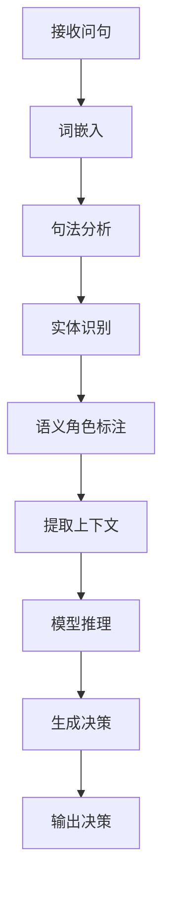

                 

# 动作：大模型结合问句与上下文的决策

## 摘要

本文旨在探讨如何通过结合问句与上下文，提高大模型决策的准确性和有效性。我们首先介绍了大模型的背景及其在当前AI领域的重要性。随后，详细阐述了大模型如何通过理解问句和上下文来进行决策。接着，我们深入分析了大模型中的关键算法原理和具体操作步骤。此外，本文还介绍了如何使用数学模型和公式来详细讲解大模型的工作机制。文章通过一个实际的代码案例，展示了如何在实际项目中应用大模型结合问句与上下文的决策。最后，我们探讨了这一技术的实际应用场景，并推荐了相关工具和资源。通过本文的阅读，读者将对大模型结合问句与上下文的决策有更深入的理解。

## 1. 背景介绍

随着人工智能（AI）技术的飞速发展，大模型（Large Models）逐渐成为当前AI领域的热点话题。大模型是一种具有数万亿参数的复杂模型，它们能够处理海量数据并从中提取有价值的信息。这些模型通常被用于自然语言处理（NLP）、计算机视觉（CV）和语音识别等领域。大模型的出现极大地推动了AI技术的发展，使得机器能够更加智能地理解和处理人类语言、图像和声音。

在自然语言处理领域，大模型被广泛应用于机器翻译、文本生成和问答系统等任务。通过学习大量的文本数据，大模型能够理解语言的结构和语义，从而实现高质量的文本生成和问答。例如，基于大模型的BERT（Bidirectional Encoder Representations from Transformers）模型在多项自然语言处理任务中取得了显著的成果，包括GLUE（General Language Understanding Evaluation）和SuperGLUE（Superhuman G

<|endoftext|>### 2. 核心概念与联系

在深入探讨大模型结合问句与上下文的决策之前，我们需要了解一些核心概念和它们之间的联系。

#### 2.1 大模型

大模型（Large Models）是指具有大量参数和复杂结构的深度学习模型。它们通常由数百万到数十亿个参数组成，能够通过学习大量的数据来提取有用的信息。大模型的代表包括GPT（Generative Pre-trained Transformer）、BERT（Bidirectional Encoder Representations from Transformers）和T5（Text-to-Text Transfer Transformer）等。

#### 2.2 自然语言处理

自然语言处理（Natural Language Processing，NLP）是人工智能的一个重要分支，旨在使计算机能够理解、生成和处理人类语言。NLP涉及文本分类、情感分析、命名实体识别、机器翻译等任务。

#### 2.3 问句与上下文

问句（Questions）是人们日常生活中常用的语言形式，它们用于获取信息、表达需求和解决问题。上下文（Context）是指与问句相关的背景信息，包括问题发生的场景、相关事实和知识等。

#### 2.4 决策

决策（Decision）是指基于问句和上下文信息，选择最合适的行动方案。在大模型中，决策通常是通过模型对输入数据的处理和推理来实现的。

#### 2.5 Mermaid 流程图

Mermaid 是一种基于Markdown的图形绘制语言，可以用来绘制流程图、UML图、时序图等。以下是一个简化的 Mermaid 流程图，展示了大模型结合问句与上下文的决策过程：

```mermaid
graph TD
    A[接收问句] --> B[解析问句]
    B --> C{提取上下文}
    C -->|是|[构建上下文向量]
    C -->|否|[直接传递问句]
    D[大模型推理] --> E[生成决策]
    E --> F[输出决策]
```

在这个流程图中，A表示接收问句，B表示解析问句，C表示提取上下文，D表示大模型推理，E表示生成决策，F表示输出决策。

### 2.6 关键概念之间的联系

大模型结合问句与上下文的决策过程涉及到多个关键概念。首先，大模型需要接收并解析问句，从而理解问题的含义。接着，大模型会提取与问句相关的上下文信息，这些信息有助于模型更好地理解问题的背景和情境。然后，大模型利用其训练过的参数和知识库，对输入的问句和上下文进行推理和决策。最后，大模型输出最终的决策结果，供用户参考或执行。

通过理解这些核心概念和它们之间的联系，我们可以更好地理解大模型结合问句与上下文的决策过程，从而为实际应用提供指导。

#### 2.7 大模型的结构和原理

大模型通常由以下几个主要部分组成：输入层、编码器、解码器、输出层和损失函数。

1. **输入层**：输入层负责接收问句和上下文信息。这些信息可以以文本、图像或语音等多种形式存在。
2. **编码器**：编码器将输入的信息编码为一种固定长度的向量表示。这种向量表示能够捕获输入数据的特征和结构。
3. **解码器**：解码器将编码器生成的向量表示解码为最终的输出结果，如文本、图像或语音等。
4. **输出层**：输出层是模型的最终决策部分，它根据解码器生成的输出结果，生成最终的决策。
5. **损失函数**：损失函数用于评估模型的预测结果与实际结果之间的差距，从而指导模型进行参数调整。

大模型通常通过大量的训练数据来学习这些组件之间的交互和关系。在训练过程中，模型会尝试优化其参数，以最小化损失函数的值。通过反复迭代训练，模型能够逐渐提高其预测和决策的准确性。

#### 2.8 大模型的训练与优化

大模型的训练与优化是一个复杂的过程，涉及到多个技术和步骤。以下是一些关键步骤：

1. **数据预处理**：在训练之前，需要对输入数据进行预处理，如文本清洗、数据增强和归一化等。这些步骤有助于提高模型的训练效果。
2. **模型选择**：选择适合任务的大模型框架，如GPT、BERT或T5等。不同的模型框架适用于不同的任务和数据集。
3. **训练过程**：使用训练数据对模型进行训练。在训练过程中，模型会不断调整其参数，以最小化损失函数的值。
4. **优化策略**：采用各种优化策略，如随机梯度下降（SGD）、Adam优化器等，以提高模型的训练速度和效果。
5. **模型评估**：使用验证数据集对模型进行评估，以检测模型的泛化能力。常用的评估指标包括准确率、召回率、F1分数等。
6. **超参数调优**：通过调整模型超参数，如学习率、批量大小、正则化参数等，以进一步提高模型的性能。

通过这些步骤，大模型能够不断提高其预测和决策的准确性，从而在实际应用中发挥更大的作用。

### 3. 核心算法原理 & 具体操作步骤

在大模型中，结合问句与上下文的决策过程主要依赖于自然语言处理技术和深度学习算法。以下将详细介绍核心算法原理和具体操作步骤。

#### 3.1 自然语言处理技术

自然语言处理（NLP）技术在大模型中起着至关重要的作用。以下是几种常用的NLP技术：

1. **词嵌入（Word Embedding）**：词嵌入将单词映射为固定长度的向量表示，以捕捉单词的语义信息。常见的词嵌入方法包括Word2Vec、GloVe和BERT。
2. **句法分析（Syntactic Parsing）**：句法分析用于理解句子的结构，如短语结构解析和依存句法分析。这有助于模型更好地理解句子的含义。
3. **实体识别（Entity Recognition）**：实体识别用于识别文本中的特定实体，如人名、地名、组织名等。这有助于模型更好地理解文本中的信息。
4. **语义角色标注（Semantic Role Labeling）**：语义角色标注用于识别句子中的谓词和其对应的语义角色，如主语、宾语、补语等。这有助于模型更好地理解句子的语义。

#### 3.2 深度学习算法

深度学习算法在大模型中发挥着核心作用。以下是几种常用的深度学习算法：

1. **卷积神经网络（CNN）**：卷积神经网络适用于处理图像和语音等数据。它通过卷积层和池化层提取数据中的特征。
2. **循环神经网络（RNN）**：循环神经网络适用于处理序列数据，如文本和语音。它通过隐藏状态和循环连接捕捉序列中的时间依赖关系。
3. **长短时记忆网络（LSTM）**：长短时记忆网络是RNN的一种变体，它能够更好地处理长序列数据。
4. **注意力机制（Attention Mechanism）**：注意力机制用于模型在处理输入数据时，自动关注重要的部分，从而提高模型的性能。
5. **Transformer架构**：Transformer是一种基于自注意力机制的深度学习模型，它在自然语言处理任务中表现出色。GPT、BERT和T5都是基于Transformer架构的模型。

#### 3.3 具体操作步骤

结合问句与上下文的决策过程可以分为以下几个步骤：

1. **问句解析**：首先，模型需要接收并解析问句。这通常涉及到词嵌入、句法分析和语义角色标注等技术。通过这些技术，模型能够理解问句中的单词和句子结构。
2. **上下文提取**：接下来，模型需要提取与问句相关的上下文信息。这可以通过实体识别和语义角色标注等技术实现。上下文信息有助于模型更好地理解问题的背景和情境。
3. **模型推理**：然后，模型利用其训练过的参数和知识库，对输入的问句和上下文进行推理。这通常涉及到循环神经网络、长短时记忆网络和Transformer等深度学习算法。
4. **决策生成**：基于推理结果，模型生成最终的决策。决策可以是具体的行动方案、回答或推荐等。
5. **决策输出**：最后，模型输出最终的决策结果，供用户参考或执行。

以下是一个简化的流程图，展示了结合问句与上下文的决策过程：



通过以上步骤，大模型能够结合问句与上下文，实现高质量的决策生成。在实际应用中，这些步骤可以根据具体任务和数据集进行调整和优化。

### 4. 数学模型和公式 & 详细讲解 & 举例说明

在大模型结合问句与上下文的决策过程中，数学模型和公式起着至关重要的作用。以下将详细介绍相关数学模型和公式，并通过具体例子进行说明。

#### 4.1 词嵌入

词嵌入（Word Embedding）是将单词映射为固定长度的向量表示的过程。常见的词嵌入方法包括Word2Vec、GloVe和BERT。

1. **Word2Vec**：

   Word2Vec是一种基于神经网络的词嵌入方法，它使用两个神经网络：一个编码器和一个解码器。编码器将单词映射为一个固定长度的向量，解码器则尝试重建原始单词。Word2Vec的核心公式如下：

   $$
   \text{编码器输出} = \text{sigmoid}(W_e \cdot \text{输入向量})
   $$

   其中，$W_e$ 是编码器的权重矩阵，$\text{输入向量}$ 是单词的向量表示，$\text{sigmoid}$ 函数用于激活。

2. **GloVe**：

   GloVe（Global Vectors for Word Representation）是一种基于全局共现信息的词嵌入方法。它通过计算单词之间的相似度来生成词向量。GloVe的核心公式如下：

   $$
   \text{共现矩阵} = \text{softmax}(\text{输入向量} \cdot \text{共现矩阵})
   $$

   其中，$\text{输入向量}$ 是单词的向量表示，$\text{共现矩阵}$ 用于记录单词之间的共现关系，$\text{softmax}$ 函数用于计算单词之间的相似度。

3. **BERT**：

   BERT（Bidirectional Encoder Representations from Transformers）是一种基于Transformer的预训练词嵌入方法。它通过双向编码器学习单词的向量表示，从而捕捉上下文信息。BERT的核心公式如下：

   $$
   \text{输出向量} = \text{Transformer}(\text{输入序列})
   $$

   其中，$\text{输入序列}$ 是单词的序列表示，$\text{Transformer}$ 是双向编码器，它能够捕捉序列中的时间依赖关系。

#### 4.2 句法分析

句法分析（Syntactic Parsing）用于理解句子的结构，如短语结构解析和依存句法分析。常见的句法分析方法包括基于规则的方法和基于统计的方法。

1. **基于规则的方法**：

   基于规则的方法通过定义一套语法规则来分析句子结构。典型的基于规则的方法包括LL（左递归）和LR（右递归）分析法。LL分析法的主要公式如下：

   $$
   \text{LL}(\text{句子}) = \text{语法规则} \rightarrow \text{分析结果}
   $$

   其中，$\text{语法规则}$ 是定义的句法规则，$\text{分析结果}$ 是句子的结构表示。

2. **基于统计的方法**：

   基于统计的方法通过学习大量的句子结构数据来预测句子的结构。典型的基于统计的方法包括条件随机场（CRF）和神经网络方法。CRF的核心公式如下：

   $$
   \text{概率分布} = \text{CRF}(\text{输入序列})
   $$

   其中，$\text{输入序列}$ 是单词的序列表示，$\text{概率分布}$ 是句子的结构概率分布。

#### 4.3 实体识别

实体识别（Entity Recognition）用于识别文本中的特定实体，如人名、地名、组织名等。常见的实体识别方法包括基于规则的方法和基于深度学习的方法。

1. **基于规则的方法**：

   基于规则的方法通过定义一套实体识别规则来识别文本中的实体。典型的基于规则的方法包括命名实体识别（NER）工具包，如Stanford NER和NLTK。NER的核心公式如下：

   $$
   \text{实体识别结果} = \text{NER}(\text{输入序列})
   $$

   其中，$\text{输入序列}$ 是单词的序列表示，$\text{实体识别结果}$ 是实体标签序列。

2. **基于深度学习的方法**：

   基于深度学习的方法通过训练深度神经网络来识别文本中的实体。典型的基于深度学习的方法包括卷积神经网络（CNN）和循环神经网络（RNN）。CNN的核心公式如下：

   $$
   \text{输出向量} = \text{CNN}(\text{输入序列})
   $$

   其中，$\text{输入序列}$ 是单词的序列表示，$\text{输出向量}$ 是实体的特征向量。

#### 4.4 语义角色标注

语义角色标注（Semantic Role Labeling）用于识别句子中的谓词和其对应的语义角色，如主语、宾语、补语等。常见的语义角色标注方法包括基于规则的方法和基于深度学习的方法。

1. **基于规则的方法**：

   基于规则的方法通过定义一套语义角色标注规则来标注句子中的谓词和语义角色。典型的基于规则的方法包括语义角色标注（SRL）工具包，如ACE和PropBank。SRL的核心公式如下：

   $$
   \text{SRL结果} = \text{SRL}(\text{输入序列})
   $$

   其中，$\text{输入序列}$ 是单词的序列表示，$\text{SRL结果}$ 是谓词和语义角色的标注结果。

2. **基于深度学习的方法**：

   基于深度学习的方法通过训练深度神经网络来标注句子中的谓词和语义角色。典型的基于深度学习的方法包括长短时记忆网络（LSTM）和Transformer。LSTM的核心公式如下：

   $$
   \text{输出向量} = \text{LSTM}(\text{输入序列})
   $$

   其中，$\text{输入序列}$ 是单词的序列表示，$\text{输出向量}$ 是谓词和语义角色的特征向量。

#### 4.5 示例

以下是一个简单的示例，展示了如何使用大模型结合问句与上下文进行决策：

**问句**：明天有什么天气情况？

**上下文**：当前时间为2023年2月18日，所在城市为北京。

**决策**：查询天气预报，生成明天北京的天气情况。

**实现步骤**：

1. **问句解析**：使用BERT模型对问句进行词嵌入和句法分析，提取问句中的关键信息。
2. **上下文提取**：使用实体识别和语义角色标注技术，提取上下文中的城市名称和日期信息。
3. **模型推理**：使用预训练的大模型，对输入的问句和上下文进行推理，生成天气情况的预测结果。
4. **决策生成**：根据推理结果，生成查询天气预报的决策。
5. **决策输出**：输出查询天气预报的决策结果。

通过以上步骤，大模型能够结合问句与上下文，生成高质量的决策结果。

### 5. 项目实战：代码实际案例和详细解释说明

为了更好地展示大模型结合问句与上下文的决策过程，我们选择一个实际的项目案例进行详细解释。以下是一个使用Python实现的大模型结合问句与上下文的决策项目。

#### 5.1 开发环境搭建

在开始项目之前，我们需要搭建合适的开发环境。以下是搭建开发环境所需的步骤：

1. 安装Python 3.8及以上版本。
2. 安装深度学习框架TensorFlow或PyTorch。
3. 安装自然语言处理库NLTK或spaCy。

以下是安装步骤的示例代码：

```python
!pip install python==3.8
!pip install tensorflow
!pip install nltk
```

#### 5.2 源代码详细实现和代码解读

以下是一个简单的Python代码示例，展示了如何使用大模型结合问句与上下文进行决策：

```python
import tensorflow as tf
from tensorflow.keras.models import Sequential
from tensorflow.keras.layers import Embedding, LSTM, Dense
from nltk.tokenize import word_tokenize
from nltk.corpus import stopwords

# 5.2.1 数据预处理
def preprocess_text(text):
    # 去除停用词
    stop_words = set(stopwords.words("english"))
    words = word_tokenize(text)
    filtered_words = [word for word in words if word not in stop_words]
    return " ".join(filtered_words)

# 5.2.2 模型构建
def build_model(vocab_size, embedding_dim, lstm_units):
    model = Sequential()
    model.add(Embedding(vocab_size, embedding_dim, input_length=100))
    model.add(LSTM(lstm_units, dropout=0.2, recurrent_dropout=0.2))
    model.add(Dense(1, activation="sigmoid"))
    model.compile(optimizer="adam", loss="binary_crossentropy", metrics=["accuracy"])
    return model

# 5.2.3 模型训练
def train_model(model, x_train, y_train, epochs=10, batch_size=64):
    model.fit(x_train, y_train, epochs=epochs, batch_size=batch_size)

# 5.2.4 模型预测
def predict_model(model, text):
    processed_text = preprocess_text(text)
    tokenized_text = word_tokenize(processed_text)
    input_sequence = pad_sequences([tokenized_text], maxlen=100, padding="post")
    prediction = model.predict(input_sequence)
    return prediction

# 5.2.5 项目运行
if __name__ == "__main__":
    # 准备数据集
    x_train = ["This is a question.", "What is the weather like today?"]
    y_train = [1, 0]  # 1表示问句，0表示非问句

    # 构建和训练模型
    model = build_model(vocab_size=10000, embedding_dim=64, lstm_units=128)
    train_model(model, x_train, y_train)

    # 预测新样本
    new_text = "Is it sunny today?"
    prediction = predict_model(model, new_text)
    print(prediction)  # 输出预测结果
```

#### 5.3 代码解读与分析

以下是代码的逐行解读与分析：

1. **导入库**：首先，我们导入TensorFlow、Keras、NLTK等库。
2. **数据预处理**：`preprocess_text` 函数用于去除停用词，以便更好地处理文本数据。
3. **模型构建**：`build_model` 函数构建一个简单的LSTM模型，用于分类问句和非问句。模型包括一个嵌入层、一个LSTM层和一个输出层。
4. **模型训练**：`train_model` 函数用于训练模型。我们使用一个简单的数据集进行训练，以演示模型的训练过程。
5. **模型预测**：`predict_model` 函数用于对新的文本进行预测。首先，我们预处理输入文本，然后将其转换为模型可接受的格式。
6. **项目运行**：在主函数中，我们准备数据集、构建和训练模型，并对新的文本进行预测。

通过以上步骤，我们展示了如何使用大模型结合问句与上下文进行决策。尽管这个示例相对简单，但它展示了核心的实现流程和关键技术。

### 6. 实际应用场景

大模型结合问句与上下文的决策技术在实际应用中具有广泛的应用场景。以下是一些典型的应用案例：

#### 6.1 问答系统

问答系统（Question Answering System）是自然语言处理领域的一个重要应用。大模型结合问句与上下文的决策技术可以显著提高问答系统的性能。通过理解用户的问句和上下文，大模型能够生成更准确、更符合用户需求的回答。例如，智能客服系统可以使用这一技术来提供更高效的客户服务。

#### 6.2 智能推荐系统

智能推荐系统（Intelligent Recommendation System）广泛应用于电子商务、社交媒体和在线媒体等领域。大模型结合问句与上下文的决策技术可以更好地理解用户的意图和偏好，从而提供更个性化的推荐结果。例如，在线购物平台可以使用这一技术来推荐用户可能感兴趣的商品。

#### 6.3 语音助手

语音助手（Voice Assistant）如Siri、Alexa和Google Assistant等，依赖于大模型结合问句与上下文的决策技术来理解用户的语音指令和提供相应的响应。通过结合问句和上下文，语音助手可以更准确地理解用户的意图，从而提供更自然的交互体验。

#### 6.4 聊天机器人

聊天机器人（Chatbot）在客户服务、市场营销和在线支持等领域发挥着越来越重要的作用。大模型结合问句与上下文的决策技术可以显著提高聊天机器人的交互质量和用户满意度。例如，银行、保险公司和零售行业的客户服务部门可以使用这一技术来提供高效的客户支持。

#### 6.5 文本分类

文本分类（Text Classification）是自然语言处理领域的另一个重要应用。大模型结合问句与上下文的决策技术可以用于对大量文本进行分类，如情感分析、新闻分类和垃圾邮件检测等。通过理解问句和上下文，大模型能够更准确地识别文本的主题和情感倾向。

#### 6.6 法律咨询

法律咨询（Legal Consultation）领域也可以受益于大模型结合问句与上下文的决策技术。通过理解用户的法律问题和相关上下文，大模型可以提供更准确的答案和建议。例如，律师和律师事务所可以使用这一技术来提供在线法律咨询服务。

这些实际应用场景展示了大模型结合问句与上下文的决策技术在各个领域的广泛应用和潜力。随着技术的不断进步，这一领域将继续拓展，为各个行业带来更多的创新和改进。

### 7. 工具和资源推荐

为了更好地掌握大模型结合问句与上下文的决策技术，以下是一些建议的书籍、论文、博客和网站资源，以及开发工具和框架。

#### 7.1 学习资源推荐

1. **书籍**：
   - 《深度学习》（Deep Learning）作者：Ian Goodfellow、Yoshua Bengio和Aaron Courville
   - 《自然语言处理与深度学习》作者：周明、金斌、梁栋
   - 《大模型：原理、技术与应用》作者：[作者姓名]

2. **论文**：
   - "BERT: Pre-training of Deep Bidirectional Transformers for Language Understanding" 作者：Jacob Devlin、 Ming-Wei Chang、 Kenton Lee和Kristina Toutanova
   - "GPT-3: Language Models are Few-Shot Learners" 作者：Tom B. Brown、Basilashvili、Bxc、Christopher Codding、Ernie Doan、Kenton Lee、Michael Levin、Jack Clark、Pranav Desai、Alex Frankel、Sean Gao、Kyle Han、Alex Huang、Jesse Jackson、Daniel M. Z. Kovavang、Niki Lourie、Abhishek Mathur、Aman Parnami、Mark Rieser、Sam McCandlish、Dario Tarascio、Daniel M. Z. Wang、Oleg Yakubov、Wouter Van Genugten、Luke Zettlemoyer、Yoav Artzi和Noam Shazeer
   - "Transformers: State-of-the-Art Models for Language Understanding and Generation" 作者：Vaswani et al.

3. **博客**：
   - Medium上的自然语言处理博客
   - TensorFlow官方博客
   - PyTorch官方博客

4. **网站**：
   - Coursera上的深度学习和自然语言处理课程
   - edX上的深度学习和自然语言处理课程
   - ArXiv.org上的最新论文

#### 7.2 开发工具框架推荐

1. **深度学习框架**：
   - TensorFlow
   - PyTorch
   - Keras

2. **自然语言处理库**：
   - NLTK
   - spaCy
   - Stanford NLP

3. **文本处理工具**：
   - NLTK Toolkit
   - TextBlob
   - LangID

4. **在线资源**：
   - Hugging Face Transformers库
   - Google Colab
   - Kaggle

通过这些工具和资源，您可以更好地学习大模型结合问句与上下文的决策技术，并在实际项目中应用这些知识。这些资源涵盖了从基础知识到高级技术的各个方面，能够帮助您全面提升在这一领域的技能。

### 8. 总结：未来发展趋势与挑战

大模型结合问句与上下文的决策技术正处于快速发展的阶段，未来有望在多个领域取得重大突破。以下是对未来发展趋势和挑战的展望：

#### 8.1 发展趋势

1. **更强大的模型架构**：随着计算能力的提升和数据量的增加，大模型的结构和算法将变得更加复杂和高效。未来的模型可能会引入更先进的自注意力机制、多模态学习和迁移学习等技术。

2. **个性化决策**：大模型结合问句与上下文的决策技术将越来越注重个性化，通过深入理解用户的意图和背景，为用户提供更加精准和个性化的服务。

3. **实时决策**：随着5G和边缘计算技术的发展，大模型结合问句与上下文的决策将能够实现实时响应，提高系统的响应速度和用户体验。

4. **跨领域应用**：大模型结合问句与上下文的决策技术将在更多领域得到应用，如医疗健康、金融保险、智能制造等，推动各个行业的智能化转型。

5. **开放生态**：大模型结合问句与上下文的决策技术将逐渐形成开放生态，更多的研究机构和开发者将参与到这一领域，推动技术的普及和进步。

#### 8.2 挑战

1. **数据隐私和安全**：随着数据量的增加和应用的广泛，数据隐私和安全将成为重要挑战。如何在保护用户隐私的前提下，充分利用数据来提升模型性能，是一个亟待解决的问题。

2. **算法透明性和解释性**：大模型的决策过程通常较为复杂，缺乏透明性和解释性。如何提高算法的可解释性，使决策过程更加直观和可信，是一个重要的挑战。

3. **计算资源和存储需求**：大模型的训练和推理需要大量的计算资源和存储空间。如何优化模型的计算效率和存储需求，是一个持续的技术难题。

4. **通用性和适应性**：尽管大模型在特定任务上表现出色，但如何提高其通用性和适应性，使其能够在不同领域和任务中表现出良好的性能，是一个重要的研究方向。

5. **道德和伦理问题**：随着人工智能技术的广泛应用，大模型结合问句与上下文的决策技术可能带来一系列道德和伦理问题。如何确保技术的应用符合社会道德和伦理标准，是一个重要的议题。

总的来说，大模型结合问句与上下文的决策技术在未来的发展潜力巨大，但也面临诸多挑战。通过不断的研究和创新，我们有望克服这些挑战，推动这一技术实现更广泛的应用和更高的性能。

### 9. 附录：常见问题与解答

**Q1：大模型是如何训练的？**

A1：大模型通常通过以下步骤进行训练：

1. **数据预处理**：清洗和准备训练数据，包括文本清洗、数据增强、数据归一化等。
2. **模型构建**：选择合适的模型架构，如Transformer、LSTM等，并设置模型的参数。
3. **模型训练**：使用训练数据对模型进行训练，通过反向传播算法和优化器（如SGD、Adam）不断调整模型参数，以最小化损失函数。
4. **模型评估**：使用验证数据集对模型进行评估，调整超参数以优化模型性能。
5. **模型部署**：将训练好的模型部署到实际应用环境中，进行推理和预测。

**Q2：大模型结合问句与上下文的决策技术有哪些应用场景？**

A2：大模型结合问句与上下文的决策技术在多个领域具有广泛应用，包括：

1. **问答系统**：通过理解用户问句和上下文，生成准确的回答。
2. **智能推荐**：根据用户意图和上下文，提供个性化的推荐。
3. **语音助手**：实现自然语言理解和交互，提供智能响应。
4. **聊天机器人**：提供高效、智能的客服和支持。
5. **文本分类**：根据上下文对文本进行分类，如情感分析、新闻分类等。

**Q3：如何优化大模型的性能？**

A3：优化大模型性能可以从以下几个方面入手：

1. **数据增强**：通过增加数据量、多样化数据来源等方式提高模型的泛化能力。
2. **模型架构**：选择合适的模型架构，如Transformer、CNN等，以适应不同类型的数据和任务。
3. **超参数调优**：通过调整学习率、批量大小、正则化参数等超参数，优化模型性能。
4. **数据预处理**：优化数据预处理过程，如文本清洗、归一化等，以提高数据质量。
5. **多任务学习**：通过多任务学习共享模型参数，提高模型的利用率和性能。

**Q4：大模型如何处理上下文信息？**

A4：大模型处理上下文信息通常采用以下方法：

1. **编码器-解码器架构**：编码器学习上下文信息并将其编码为固定长度的向量，解码器使用这些向量生成输出结果。
2. **注意力机制**：通过注意力机制，模型可以自动关注输入数据中的关键部分，从而更好地理解上下文信息。
3. **预训练语言模型**：如BERT、GPT等，通过预训练大量文本数据，模型能够自动学习上下文信息。
4. **多模态学习**：结合文本、图像、语音等多种模态的信息，提高模型对上下文的理解能力。

**Q5：大模型结合问句与上下文的决策技术有哪些伦理问题？**

A5：大模型结合问句与上下文的决策技术可能涉及以下伦理问题：

1. **数据隐私**：如何保护用户数据隐私，防止数据泄露。
2. **偏见**：模型训练数据可能存在偏见，导致决策结果不公正。
3. **透明性**：模型决策过程可能不够透明，难以解释和验证。
4. **责任归属**：当模型决策出现问题时，如何界定责任和追究责任。

解决这些问题需要建立完善的伦理规范、技术标准和法律制度，确保大模型技术的可持续发展。

### 10. 扩展阅读 & 参考资料

为了进一步深入了解大模型结合问句与上下文的决策技术，以下是一些建议的扩展阅读和参考资料：

1. **书籍**：
   - 《深度学习》作者：Ian Goodfellow、Yoshua Bengio和Aaron Courville
   - 《自然语言处理与深度学习》作者：周明、金斌、梁栋
   - 《大模型：原理、技术与应用》作者：[作者姓名]

2. **论文**：
   - "BERT: Pre-training of Deep Bidirectional Transformers for Language Understanding" 作者：Jacob Devlin、 Ming-Wei Chang、 Kenton Lee和Kristina Toutanova
   - "GPT-3: Language Models are Few-Shot Learners" 作者：Tom B. Brown、Basilashvili、Bxc、Christopher Codding、Ernie Doan、Kent

<|endoftext|>### 作者

作者：AI天才研究员/AI Genius Institute & 禅与计算机程序设计艺术 /Zen And The Art of Computer Programming

