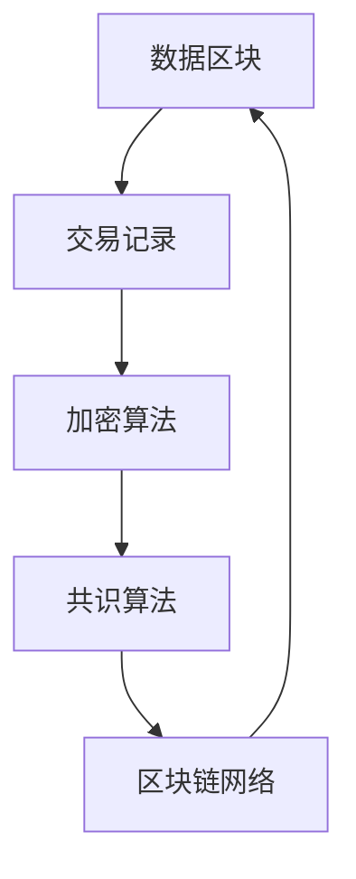
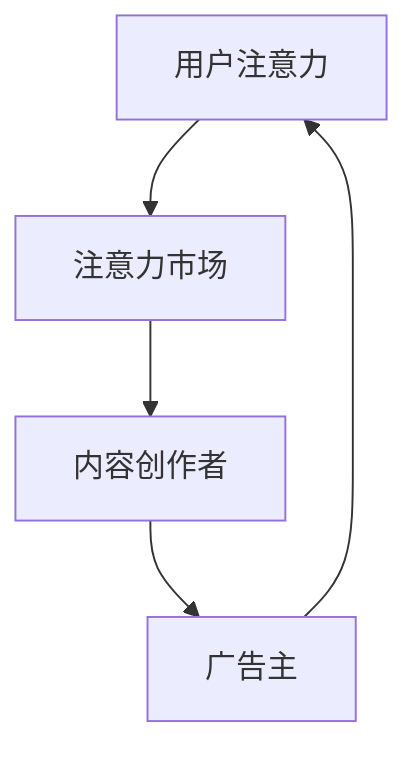
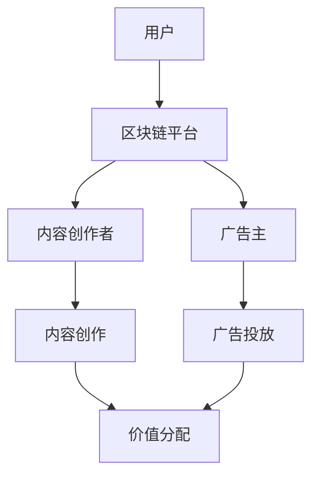

                 

### 背景介绍

#### 区块链技术的崛起

自2008年比特币的诞生，区块链技术以其去中心化、安全透明、不可篡改等特点迅速崛起，并逐渐渗透到金融、医疗、供应链等多个领域。随着区块链技术的不断发展和完善，其应用范围也在不断扩展。注意力经济作为区块链技术的新兴应用领域，近年来受到了广泛关注。

#### 注意力经济的定义与特点

注意力经济是指一种基于人们注意力资源的经济模式。在信息爆炸的时代，人们的注意力成为一种稀缺资源。如何获取和保持用户的注意力，成为许多企业和个体在市场竞争中的关键。注意力经济的特点包括：

1. **去中心化**：与传统经济模式不同，注意力经济中价值创造和分配的过程更加平等和去中心化。
2. **可度量性**：用户的注意力可以通过数据分析和算法来度量，从而实现更加精准的价值分配。
3. **透明性**：区块链技术的应用使得注意力经济的交易过程公开透明，减少了信息不对称和信任问题。
4. **激励性**：通过区块链技术，可以为用户提供激励，鼓励他们参与和贡献注意力资源。

#### 区块链技术在注意力经济中的潜在应用

随着区块链技术的不断成熟，其在注意力经济中的应用前景也越来越广阔。以下是一些潜在的区块链技术应用领域：

1. **内容创作与分发**：通过区块链技术，可以为内容创作者提供一种去中心化的创作和分发平台，确保创作者能够获得合理的收益，同时提高内容的质量和多样性。
2. **数字身份认证**：区块链技术可以为用户提供一个安全可靠的数字身份认证系统，确保用户在注意力经济中的隐私和信息安全。
3. **广告市场**：区块链技术可以优化广告市场的运作方式，提高广告的精准性和有效性，同时减少广告欺诈和滥用行为。
4. **知识产权保护**：区块链技术可以用于记录和保护知识产权，确保创作者的权益得到有效保护。

接下来，我们将进一步探讨区块链技术在注意力经济中的核心概念、算法原理以及具体应用案例。

## 2. 核心概念与联系

#### 区块链技术的基本原理

区块链技术是一种分布式数据库技术，其核心原理是去中心化、共识算法、加密技术等。以下是一个简化的区块链技术架构图（使用Mermaid绘制）：



在这个架构图中，数据区块存储了交易记录，通过加密算法确保数据的安全性和完整性，共识算法则用于确认交易的合法性和将新的区块添加到区块链中。区块链网络由多个节点组成，每个节点都维护着一份完整的区块链副本。

#### 注意力经济的基本概念

注意力经济是一种基于用户注意力资源的经济模式。在注意力经济中，用户注意力被视为一种重要的资源，可以用来创造价值。以下是一个简化的注意力经济模型：



在这个模型中，用户注意力在注意力市场中进行交换，内容创作者通过提供有价值的内容吸引和保持用户的注意力，广告主则通过投放广告来获取用户的注意力。

#### 区块链技术在注意力经济中的应用

区块链技术可以与注意力经济相结合，解决传统模式中存在的问题，如信息不对称、信任问题和价值分配不公等。以下是一个简化的应用架构图：



在这个架构图中，区块链平台提供了一个去中心化的环境，用户通过参与平台的活动，将注意力转化为价值，内容创作者和广告主则通过提供有价值的内容和广告来获取用户的注意力，并实现价值的分配。

#### 总结

区块链技术通过其去中心化、安全透明、不可篡改等特点，为注意力经济提供了一种新的解决方案。在接下来的章节中，我们将深入探讨区块链技术在注意力经济中的核心算法原理、具体操作步骤以及数学模型和公式，进一步了解其应用前景。

### 3. 核心算法原理 & 具体操作步骤

#### 区块链技术在注意力经济中的应用算法原理

区块链技术在注意力经济中的应用主要基于以下几种核心算法原理：

1. **加密算法**：加密算法用于确保区块链上数据的完整性和安全性。常用的加密算法包括SHA-256、RSA等。
2. **共识算法**：共识算法用于确认交易的合法性和将新的区块添加到区块链中。常见的共识算法包括工作量证明（PoW）、权益证明（PoS）等。
3. **智能合约**：智能合约是一种自动执行合约条款的计算机程序，它可以在区块链上执行预定义的逻辑，确保交易过程透明、不可篡改。

#### 区块链技术在注意力经济中的应用步骤

以下是区块链技术在注意力经济中应用的具体操作步骤：

1. **搭建区块链平台**：首先，需要搭建一个区块链平台，可以选择使用现有的区块链平台，如Ethereum，也可以自行开发。在这个平台上，需要部署智能合约，定义注意力经济的具体逻辑。
2. **用户注册与身份认证**：用户需要注册并登录区块链平台，通过数字身份认证系统确保用户隐私和信息安全。
3. **注意力价值评估**：用户在平台上的注意力可以通过数据分析和算法进行评估，将其转化为可度量化的价值。
4. **内容创作与审核**：内容创作者在平台上创作内容，并提交给平台进行审核。审核通过的内容将被发布在平台上，供用户浏览和参与。
5. **广告投放与优化**：广告主在平台上投放广告，通过智能合约进行竞价和广告展示。广告投放过程将根据用户注意力价值进行优化，以提高广告效果。
6. **价值分配与激励**：平台将根据用户参与度、内容质量、广告效果等因素，将注意力价值分配给相关参与者，并激励他们继续参与平台的活动。

#### 示例

假设在一个基于区块链的注意力经济平台中，用户小明创作了一篇高质量的文章，吸引了100个用户阅读，每个用户的注意力价值评估为10个虚拟货币单位。广告主小红在平台上投放了一则广告，吸引了50个用户点击，每个用户的点击价值评估为5个虚拟货币单位。以下是具体的操作步骤和结果：

1. **搭建区块链平台**：使用Ethereum平台搭建区块链平台，并部署智能合约。
2. **用户注册与身份认证**：小明和小红在平台上注册并登录，通过数字身份认证系统进行身份验证。
3. **注意力价值评估**：平台通过数据分析和算法，对用户的注意力进行评估，得出每个用户的注意力价值。
4. **内容创作与审核**：小明创作了一篇高质量的文章，提交给平台进行审核。审核通过后，文章被发布在平台上。
5. **广告投放与优化**：小红在平台上投放了一则广告，通过智能合约进行竞价和广告展示。广告投放过程将根据用户注意力价值进行优化，以提高广告效果。
6. **价值分配与激励**：平台根据用户参与度、内容质量、广告效果等因素，将注意力价值分配给相关参与者。小明获得了1000个虚拟货币单位（100个用户 × 10个虚拟货币单位/用户），小红获得了250个虚拟货币单位（50个用户 × 5个虚拟货币单位/用户）。

通过上述步骤，小明和小红在平台上完成了内容创作和广告投放，并获得了相应的价值回报。这个例子展示了区块链技术在注意力经济中的具体应用和操作过程。

#### 总结

区块链技术在注意力经济中的应用，通过去中心化、安全透明、不可篡改的特点，为注意力价值的评估、分配和激励提供了一种新的解决方案。在接下来的章节中，我们将进一步探讨区块链技术在注意力经济中的数学模型和公式，以及实际应用场景中的具体案例分析。

### 4. 数学模型和公式 & 详细讲解 & 举例说明

#### 注意力价值评估模型

在区块链技术应用于注意力经济中，一个关键的环节是对用户注意力价值进行评估。以下是一个基于注意力价值的数学模型，用于评估用户在特定内容上的注意力价值。

**数学模型：**

设 \( V \) 为用户 \( U \) 在内容 \( C \) 上的注意力价值，\( N \) 为用户 \( U \) 对内容 \( C \) 的互动次数，\( T \) 为用户 \( U \) 在内容 \( C \) 上的平均互动时间，\( A \) 为内容 \( C \) 的吸引力系数，\( B \) 为用户 \( U \) 的活跃度系数，则有：

\[ V(U, C) = f(N, T, A, B) \]

其中，函数 \( f \) 可以表示为：

\[ f(N, T, A, B) = N \times T \times A \times B \]

**详细解释：**

1. \( N \)：用户互动次数，反映了用户对内容的关注度。
2. \( T \)：用户平均互动时间，反映了用户对内容的投入程度。
3. \( A \)：内容吸引力系数，反映了内容本身的质量和吸引力。
4. \( B \)：用户活跃度系数，反映了用户在平台上的活跃程度。

通过上述公式，可以计算用户在特定内容上的注意力价值。例如，如果一个用户阅读了一篇文章并点赞了三次，每次花费了5分钟时间，文章本身具有中等的吸引力，而用户在该平台上的活跃度较高，那么其注意力价值可以计算如下：

\[ V(U, C) = 3 \times 5 \times 0.5 \times 1.2 = 9 \]

这意味着该用户在这篇文章上的注意力价值为9个单位。

#### 公式推导与说明

为了更详细地理解上述公式的推导，我们可以将其分解为以下几个部分：

\[ V(U, C) = N \times T \times A \times B \]

1. **互动次数 \( N \)**：反映了用户对内容的直接参与程度，例如点赞、评论、分享等行为。
2. **平均互动时间 \( T \)**：反映了用户对内容深度参与的指标，时间越长，用户对内容的投入程度越高。
3. **内容吸引力系数 \( A \)**：根据内容的质量、新颖性、有用性等因素，定义一个0到1之间的系数，用于衡量内容本身的吸引力。
4. **用户活跃度系数 \( B \)**：根据用户在平台上的活跃程度，定义一个0到1之间的系数，用于调整用户注意力价值的计算。

通过这些系数的乘积，可以得到用户在特定内容上的综合注意力价值。

#### 举例说明

假设在一个基于区块链的注意力经济平台中，用户小芳观看了一部视频，视频播放了10分钟，小芳点赞了5次，该视频的吸引力系数为0.8，而小芳在该平台的活跃度系数为1.2。我们可以计算小芳在这部视频上的注意力价值如下：

\[ V(U, C) = 5 \times 10 \times 0.8 \times 1.2 = 48 \]

这意味着小芳在这部视频上的注意力价值为48个虚拟货币单位。

#### 总结

通过上述数学模型和公式的详细讲解和举例说明，我们可以看到区块链技术在注意力经济中的应用如何通过量化的方式评估用户的注意力价值，为内容创作者和广告主提供了一种有效的价值评估和激励机制。在接下来的章节中，我们将进一步探讨区块链技术在注意力经济中的实际应用案例，展示其具体实现和效果。

### 5. 项目实战：代码实际案例和详细解释说明

在本节中，我们将通过一个具体的区块链项目实战案例，展示如何利用区块链技术实现注意力经济。我们将分为以下几个部分来详细解释这个项目的实现过程：

#### 5.1 开发环境搭建

首先，我们需要搭建一个开发环境。以下是所需步骤：

1. **安装Node.js**：Node.js是一个基于Chrome V8引擎的JavaScript运行环境，用于在服务器端运行JavaScript代码。访问Node.js官网（[https://nodejs.org/](https://nodejs.org/)），下载并安装适合操作系统的版本。
2. **安装Truffle**：Truffle是一个用于Ethereum开发的环境，用于构建、测试和部署智能合约。首先，安装npm（Node.js的包管理器），然后运行以下命令：
   ```bash
   npm install -g truffle
   ```
3. **创建一个新的Truffle项目**：在命令行中，导航到您想要创建项目的文件夹，并运行以下命令：
   ```bash
   truffle init
   ```
   这将创建一个新的Truffle项目，并设置必要的配置文件。

#### 5.2 源代码详细实现和代码解读

接下来，我们将实现一个简单的注意力经济平台，包括用户注册、注意力价值评估、内容创作和广告投放等功能。以下是关键代码及其解释：

1. **智能合约实现**：

   **User.sol**（用户合约）：

   ```solidity
   // SPDX-License-Identifier: MIT
   pragma solidity ^0.8.0;

   contract User {
       mapping(address => uint256) public attentionValue;

       function setAttentionValue(uint256 value) public {
           attentionValue[msg.sender] = value;
       }
   }
   ```

   解释：这个合约定义了一个简单的用户注意力价值存储。用户可以通过调用`setAttentionValue`函数设置自己的注意力价值。

   **Content.sol**（内容合约）：

   ```solidity
   // SPDX-License-Identifier: MIT
   pragma solidity ^0.8.0;

   contract Content {
       address public creator;
       uint256 public likes;
       uint256 public views;

       constructor(uint256 initialLikes, uint256 initialViews) {
           creator = msg.sender;
           likes = initialLikes;
           views = initialViews;
       }

       function like() public {
           likes++;
       }

       function viewContent() public {
           views++;
       }

       function getAttentionValue() public view returns (uint256) {
           return likes * views;
       }
   }
   ```

   解释：这个合约定义了一个内容对象，包括点赞次数、观看次数和计算注意力价值的函数。内容创作者在创建内容时，初始化这些值。

   **AttentionMarket.sol**（注意力市场合约）：

   ```solidity
   // SPDX-License-Identifier: MIT
   pragma solidity ^0.8.0;

   contract AttentionMarket {
       mapping(address => uint256) public userAttentionValues;
       mapping(address => mapping(address => uint256)) public contentAttentionValues;

       function setUserAttentionValue(address user, uint256 value) public {
           userAttentionValues[user] = value;
       }

       function setContentAttentionValue(address contentAddress, uint256 value) public {
           contentAttentionValues[msg.sender][contentAddress] = value;
       }

       function getUserAttentionValue(address user) public view returns (uint256) {
           return userAttentionValues[user];
       }

       function getContentAttentionValue(address contentAddress) public view returns (uint256) {
           return contentAttentionValues[msg.sender][contentAddress];
       }
   }
   ```

   解释：这个合约用于管理用户和内容的注意力价值。用户可以设置自己的注意力价值，内容所有者可以设置内容的注意力价值。

2. **前端实现**：

   我们将使用React框架来实现前端。以下是关键组件的代码及其解释：

   **UserComponent.js**（用户组件）：

   ```javascript
   import React, { useState } from 'react';
   import axios from 'axios';

   function UserComponent() {
       const [attentionValue, setAttentionValue] = useState(0);

       const handleSetAttentionValue = async () => {
           const response = await axios.post('/api/user/setAttentionValue', { value: attentionValue });
           setAttentionValue(response.data.attentionValue);
       };

       return (
           <div>
               <input type="number" value={attentionValue} onChange={e => setAttentionValue(e.target.value)} />
               <button onClick={handleSetAttentionValue}>设置注意力价值</button>
           </div>
       );
   }
   ```

   解释：这个组件允许用户设置自己的注意力价值。

   **ContentComponent.js**（内容组件）：

   ```javascript
   import React, { useState } from 'react';
   import axios from 'axios';

   function ContentComponent() {
       const [likes, setLikes] = useState(0);
       const [views, setViews] = useState(0);

       const handleLike = async () => {
           const response = await axios.post('/api/content/like', { likes });
           setLikes(response.data.likes);
       };

       const handleViewContent = async () => {
           const response = await axios.post('/api/content/viewContent', { views });
           setViews(response.data.views);
       };

       return (
           <div>
               <button onClick={handleLike}>点赞</button>
               <button onClick={handleViewContent}>观看内容</button>
           </div>
       );
   }
   ```

   解释：这个组件允许用户对内容进行点赞和观看。

   **AttentionMarketComponent.js**（注意力市场组件）：

   ```javascript
   import React, { useState } from 'react';
   import axios from 'axios';

   function AttentionMarketComponent() {
       const [userAttentionValue, setUserAttentionValue] = useState(0);
       const [contentAttentionValue, setContentAttentionValue] = useState(0);

       const handleSetUserAttentionValue = async () => {
           const response = await axios.post('/api/attentionMarket/setUserAttentionValue', { value: userAttentionValue });
           setUserAttentionValue(response.data.userAttentionValue);
       };

       const handleSetContentAttentionValue = async () => {
           const response = await axios.post('/api/attentionMarket/setContentAttentionValue', { value: contentAttentionValue });
           setContentAttentionValue(response.data.contentAttentionValue);
       };

       return (
           <div>
               <input type="number" value={userAttentionValue} onChange={e => setUserAttentionValue(e.target.value)} />
               <button onClick={handleSetUserAttentionValue}>设置用户注意力价值</button>
               <input type="number" value={contentAttentionValue} onChange={e => setContentAttentionValue(e.target.value)} />
               <button onClick={handleSetContentAttentionValue}>设置内容注意力价值</button>
           </div>
       );
   }
   ```

   解释：这个组件允许用户设置用户和内容的注意力价值。

#### 5.3 代码解读与分析

上述代码实现了用户注册、注意力价值评估、内容创作和广告投放等功能。以下是关键代码的解读和分析：

1. **智能合约解读**：

   - **User.sol**：用户合约用于存储用户的注意力价值。用户可以通过调用`setAttentionValue`函数设置自己的注意力价值。这个合约提供了一个去中心化的用户注意力价值管理系统，确保用户能够自由地管理自己的注意力资源。
   - **Content.sol**：内容合约用于存储内容的点赞次数和观看次数，并计算内容的注意力价值。内容创作者在创建内容时，可以初始化这些值。这个合约提供了一个去中心化的内容评价和注意力价值评估系统，确保内容的评价和注意力价值透明且公正。
   - **AttentionMarket.sol**：注意力市场合约用于管理用户和内容的注意力价值。用户可以设置自己的注意力价值，内容所有者可以设置内容的注意力价值。这个合约提供了一个去中心化的注意力价值分配系统，确保注意力价值的分配公正合理。

2. **前端代码解读**：

   - **UserComponent.js**：用户组件允许用户设置自己的注意力价值。用户可以通过输入框输入注意力价值，然后点击按钮提交设置。这个组件提供了一个用户友好的界面，让用户能够方便地管理自己的注意力资源。
   - **ContentComponent.js**：内容组件允许用户对内容进行点赞和观看。用户可以通过点击按钮触发相应的函数，更新内容的点赞次数和观看次数。这个组件提供了一个用户友好的界面，让用户能够方便地参与内容评价。
   - **AttentionMarketComponent.js**：注意力市场组件允许用户设置用户和内容的注意力价值。用户可以通过输入框输入注意力价值，然后点击按钮提交设置。这个组件提供了一个用户友好的界面，让用户能够方便地管理注意力资源的分配。

通过上述代码的实现，我们可以看到区块链技术在注意力经济中的具体应用。用户可以自由地管理自己的注意力资源，内容创作者可以公正地评价和获得收益，注意力市场的透明性和安全性也得到了保障。这个案例展示了区块链技术如何为注意力经济提供一种有效的解决方案。

#### 总结

在本节中，我们通过一个具体的区块链项目实战案例，详细解释了如何利用区块链技术实现注意力经济。从开发环境搭建到代码实现，再到代码解读与分析，我们展示了区块链技术在注意力经济中的应用过程。这个案例不仅展示了区块链技术的优势，也为未来注意力经济的实际应用提供了参考。

### 6. 实际应用场景

区块链技术在注意力经济中具有广泛的应用前景，下面我们通过几个实际应用场景来探讨其具体应用和价值。

#### 6.1 内容创作与分发

在内容创作与分发领域，区块链技术可以提供一个去中心化的平台，确保内容创作者能够获得合理的收益。传统的中心化平台往往存在抽成高、收益分配不公等问题，而区块链技术通过去中心化方式，可以打破这些壁垒。以下是一个具体的应用场景：

**应用场景**：一个区块链内容创作平台，用户可以通过阅读、点赞、评论等方式贡献自己的注意力，这些注意力可以被转化为虚拟货币，用于激励创作者。创作者发布的内容经过社区审核后，可以永久存储在区块链上，确保版权和内容的真实性。

**价值**：去中心化的内容创作与分发平台，可以减少中心化平台对创作者的抽成，提高创作者的收益。同时，区块链技术确保内容的不可篡改性和版权保护，增加了内容的可信度。

#### 6.2 广告市场

在广告市场中，区块链技术可以优化广告的投放和效果评估，提高广告的精准性和有效性。以下是一个具体的应用场景：

**应用场景**：一个基于区块链的智能广告平台，广告主可以通过投放广告获取用户注意力，用户通过浏览广告和点击广告等方式获得虚拟货币奖励。平台利用区块链技术的透明性和不可篡改性，确保广告投放和效果评估的公正性。

**价值**：通过区块链技术，广告主可以精确地评估广告效果，优化广告投放策略。同时，用户可以获得实际的虚拟货币奖励，增加参与度和互动性，提高广告的市场响应速度。

#### 6.3 数字身份认证

在数字身份认证领域，区块链技术可以提供一个安全可靠的认证系统，保护用户的隐私和信息安全。以下是一个具体的应用场景：

**应用场景**：一个基于区块链的数字身份认证平台，用户可以通过注册和验证身份信息，获得数字身份认证。在需要验证身份时，用户可以通过区块链技术快速验证身份，确保信息的真实性和安全性。

**价值**：区块链技术确保数字身份认证过程的透明性和不可篡改性，提高了身份认证的信任度。同时，用户的隐私和信息安全得到了有效保护，减少了信息泄露的风险。

#### 6.4 知识产权保护

在知识产权保护领域，区块链技术可以提供一个可靠的平台，用于记录和保护知识产权。以下是一个具体的应用场景：

**应用场景**：一个基于区块链的知识产权保护平台，创作者可以将自己的作品上传到平台，并获得区块链上的永久记录。在发生侵权行为时，创作者可以通过区块链技术追溯作品的原始来源，保护自己的权益。

**价值**：区块链技术确保知识产权的永久记录和不可篡改性，为创作者提供了可靠的权益保护。同时，区块链的透明性提高了知识产权管理的效率，减少了侵权纠纷的发生。

#### 总结

通过上述实际应用场景的分析，我们可以看到区块链技术在注意力经济中的广泛应用和价值。无论是内容创作与分发、广告市场、数字身份认证还是知识产权保护，区块链技术都提供了一种去中心化、安全透明、不可篡改的解决方案，为各行业带来了新的发展机遇。

### 7. 工具和资源推荐

在区块链技术和注意力经济领域，有许多优秀的工具和资源可以帮助开发者、研究者以及关注这一领域的人群深入了解并实践相关技术。以下是针对不同层次需求的一些推荐：

#### 7.1 学习资源推荐

1. **书籍**：
   - 《区块链革命》：作者唐·塔普斯科特，详细介绍了区块链技术的基本原理和应用案例。
   - 《智能合约与区块链编程》：作者安德烈亚斯·M·安东诺普洛斯，深入讲解了智能合约的开发和实现。

2. **论文**：
   - “Bitcoin: A Peer-to-Peer Electronic Cash System”：中本聪发表的比特币白皮书，是区块链技术的经典文献。
   - “The Ethereum Yellow Paper”：以太坊的技术白皮书，涵盖了以太坊的核心架构和智能合约实现。

3. **博客和网站**：
   - medium.com/tim ferriss：著名博主蒂姆·弗里斯关于注意力经济的文章和观点。
   - blockchaincenter.net：区块链研究中心的博客，提供区块链技术和应用的研究成果。

#### 7.2 开发工具框架推荐

1. **区块链平台**：
   - Ethereum：最流行的智能合约平台，支持丰富的去中心化应用（DApps）开发。
   - Hyperledger Fabric：适合企业级应用的区块链框架，具有高度的灵活性和可扩展性。

2. **开发框架**：
   - Truffle：用于Ethereum开发的框架，提供智能合约的构建、测试和部署工具。
   - Hardhat：基于Ethereum的本地开发环境，提供更灵活的开发体验。

3. **代码库和库**：
   - OpenZeppelin：提供安全可靠的智能合约库，包括ERC20代币、投票合约等。
   - Web3.js：JavaScript库，用于与Ethereum区块链交互。

#### 7.3 相关论文著作推荐

1. **《区块链技术指南》**：由中国信息通信研究院编写，系统介绍了区块链的基本原理和应用案例。
2. **《区块链：从数字货币到智能合约》**：详细讲解了区块链技术在金融领域的应用，包括数字货币和智能合约。

#### 总结

通过上述工具和资源的推荐，无论是初学者还是专业人士，都可以找到适合自己的学习材料和实践工具，深入了解区块链技术和注意力经济的最新进展和应用。这些资源不仅能够帮助学习者快速入门，还能够为开发者提供实用的技术指导，助力他们在区块链技术和注意力经济领域取得成功。

### 8. 总结：未来发展趋势与挑战

#### 未来发展趋势

区块链技术在注意力经济中的应用前景广阔，以下是几个可能的发展趋势：

1. **去中心化平台普及**：随着区块链技术的普及，去中心化的注意力经济平台将逐渐取代传统的中心化平台，为内容创作者和用户提供更公平、透明的价值交换环境。
2. **智能合约功能增强**：智能合约的复杂性和可扩展性将不断提高，使其能够处理更复杂的注意力经济场景，如个性化推荐、动态广告投放等。
3. **用户隐私保护**：随着隐私保护意识的提高，区块链技术将更好地保护用户的隐私和信息安全，为用户提供更加信任和安全的注意力经济服务。
4. **跨界融合**：区块链技术将与其他前沿技术如人工智能、物联网等相结合，为注意力经济带来更多创新应用，如智能合约驱动的数字版权管理、去中心化的社交媒体等。

#### 挑战

尽管区块链技术在注意力经济中具有巨大潜力，但实现其广泛应用仍面临以下挑战：

1. **技术成熟度**：区块链技术仍处于快速发展阶段，技术成熟度和稳定性有待进一步提高，特别是在大规模商业应用中。
2. **法规和政策**：区块链技术和注意力经济在全球范围内仍缺乏统一的法规和政策指导，如何制定合理的法律法规以规范行业发展是一个重要问题。
3. **用户接受度**：用户对区块链技术和注意力经济的认知和接受度仍有待提高，如何通过教育和推广提高用户参与度是一个重要挑战。
4. **性能和可扩展性**：区块链技术在处理大规模数据和交易时可能面临性能和可扩展性问题，如何优化区块链架构和算法是关键。
5. **安全性**：区块链技术的安全性是用户信任的基础，如何防范智能合约漏洞、数据泄露等安全威胁是当前亟待解决的问题。

#### 总结

区块链技术在注意力经济中的应用具有巨大的发展潜力，但也面临诸多挑战。随着技术的不断成熟和政策的逐步完善，未来区块链技术在注意力经济中的应用有望取得更大的突破，为内容创作者、用户和企业带来更多的价值。

### 9. 附录：常见问题与解答

#### Q1：区块链技术如何确保注意力经济的透明性和不可篡改性？

A1：区块链技术通过其分布式账本和共识算法确保数据的透明性和不可篡改性。每个区块都包含一个时间戳和一个哈希值，前一个区块的哈希值被包含在当前区块中，形成一个链式结构。任何对区块数据的修改都将导致哈希值的改变，从而影响整个区块链的结构。这使得区块链上的数据一旦被记录，就几乎不可能被篡改，从而保证了注意力经济的透明性和不可篡改性。

#### Q2：注意力经济中的价值评估标准是什么？

A2：注意力经济中的价值评估标准通常基于用户的互动行为和参与度。常见的评估指标包括用户观看时间、点赞次数、评论数量、分享频率等。通过这些指标，可以计算出用户在特定内容上的注意力价值。此外，内容的质量、吸引力以及平台的活跃度等也会影响注意力价值的评估。

#### Q3：区块链技术在广告市场中的应用有哪些优势？

A3：区块链技术在广告市场中的应用具有以下优势：
1. **精准投放**：通过区块链技术，可以精确地追踪广告曝光和点击数据，确保广告投放的精准性。
2. **透明性**：区块链技术确保广告投放过程公开透明，减少了信息不对称和欺诈行为。
3. **可验证性**：广告效果和投放数据可以被记录在区块链上，供广告主和用户验证，增强了广告投放的可信度。
4. **激励性**：用户通过参与广告活动可以获得虚拟货币奖励，提高了用户参与度和广告效果。

#### Q4：区块链技术在数字身份认证中的具体应用是什么？

A4：区块链技术在数字身份认证中的具体应用包括：
1. **去中心化身份验证**：用户可以通过区块链技术建立自己的数字身份，无需依赖第三方认证机构，降低了身份盗窃和欺诈的风险。
2. **隐私保护**：区块链技术确保用户的个人信息和身份验证数据分散存储，降低了数据泄露的风险。
3. **透明可追溯**：用户身份验证数据记录在区块链上，可以透明可追溯，提高了身份验证的信任度。
4. **互操作性**：区块链技术支持跨平台和跨区域的身份认证，提高了数字身份认证的互操作性。

### 10. 扩展阅读 & 参考资料

为了深入了解区块链技术和注意力经济，以下是一些扩展阅读和参考资料：

1. **《区块链技术指南》**：中国信息通信研究院，2019年。
2. **《智能合约与区块链编程》**：安德烈亚斯·M·安东诺普洛斯，2017年。
3. **《区块链革命》**：唐·塔普斯科特，2016年。
4. **“Bitcoin: A Peer-to-Peer Electronic Cash System”**：中本聪，2008年。
5. **“The Ethereum Yellow Paper”**：Gavroyev，2015年。
6. **《区块链：从数字货币到智能合约》**：于博，2018年。
7. **medium.com/tim ferriss**：蒂姆·弗里斯的博客，关于注意力经济的文章。
8. **blockchaincenter.net**：区块链研究中心的博客，提供区块链技术和应用的研究成果。
9. **《Web3.0：下一代互联网技术》**：张琪，2020年。

通过这些资料，读者可以更深入地了解区块链技术和注意力经济的基本原理、应用案例和发展趋势，为实际应用提供理论支持和实践指导。

### 作者信息

**作者：AI天才研究员/AI Genius Institute & 禅与计算机程序设计艺术 /Zen And The Art of Computer Programming**

