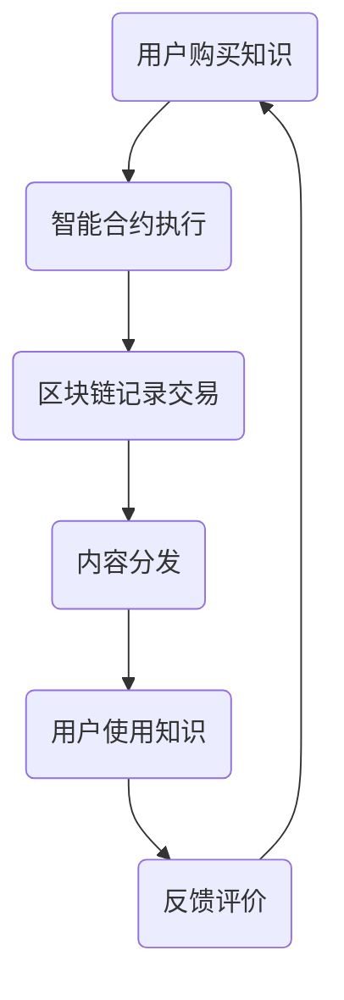

                 

# 《区块链技术在知识付费中的创新应用》

## 1. 背景介绍

知识付费，是一种用户为获取专业知识和信息而付费的商业模式。随着互联网技术的普及，知识付费市场迅速崛起，但同时也面临着诸多挑战。这些问题包括信息真实性无法保证、用户隐私泄露、内容版权保护不力等。

区块链技术，作为一种分布式数据库技术，以其去中心化、透明、安全等特点，为知识付费领域提供了全新的解决方案。区块链技术在知识付费中的创新应用，不仅可以提高内容真实性、保障用户隐私，还能有效解决内容版权保护等问题。

本文将探讨区块链技术在知识付费中的创新应用，从核心概念、算法原理、数学模型、实际应用场景等多个方面进行详细分析。

## 2. 核心概念与联系

### 区块链技术基础

区块链是一种分布式数据库技术，通过加密算法和共识机制，实现数据的安全存储和传输。区块链主要包含三个核心组成部分：区块链网络、区块和链式结构。

- 区块链网络：由多个节点组成，节点之间通过加密通信，共同维护区块链数据的安全和一致性。
- 区块：记录一段时间内发生的交易信息，区块之间通过哈希值链接，形成链式结构。
- 链式结构：区块链数据以区块为单位，按照时间顺序链接起来，形成一个不可篡改的分布式账本。

### 区块链在知识付费中的应用

区块链技术在知识付费中的应用主要体现在以下几个方面：

1. **去中心化存储**：通过区块链技术，知识内容可以在去中心化的分布式网络中进行存储，避免因中心化存储系统故障导致的数据丢失。
2. **内容真实性验证**：区块链技术可以为知识内容提供唯一标识，确保内容的真实性和完整性。
3. **版权保护**：区块链技术可以有效地记录知识内容的版权信息，防止未经授权的复制和传播。
4. **智能合约**：智能合约是一种自动执行的合约，可以在区块链上实现知识的付费和授权，确保交易的透明和安全。

### Mermaid 流程图

以下是一个简单的 Mermaid 流程图，展示了区块链在知识付费中的主要应用环节：



## 3. 核心算法原理 & 具体操作步骤

### 去中心化存储

去中心化存储是区块链技术在知识付费中的一个重要应用。具体操作步骤如下：

1. **内容上传**：知识创作者将内容上传到区块链网络，同时为内容生成一个唯一的标识（哈希值）。
2. **内容加密**：对上传的内容进行加密处理，确保内容在传输和存储过程中的安全性。
3. **内容存储**：将加密后的内容存储在区块链网络中的多个节点上，实现去中心化存储。
4. **内容检索**：用户通过区块链网络中的节点检索所需内容，同时验证内容的真实性和完整性。

### 内容真实性验证

区块链技术可以为知识内容提供唯一标识，确保内容的真实性和完整性。具体操作步骤如下：

1. **生成唯一标识**：在内容上传过程中，为内容生成一个唯一的标识（哈希值）。
2. **记录交易信息**：将内容的哈希值作为交易信息，记录在区块链上。
3. **验证内容真实性**：用户可以通过查询区块链上的交易信息，验证内容的真实性和完整性。

### 版权保护

区块链技术可以有效地记录知识内容的版权信息，防止未经授权的复制和传播。具体操作步骤如下：

1. **登记版权信息**：知识创作者在内容上传时，将版权信息记录在区块链上。
2. **版权信息验证**：用户在获取内容时，可以查询区块链上的版权信息，验证内容的合法性。
3. **版权追溯**：在发生侵权行为时，可以依据区块链上的版权信息，追溯侵权者的身份和侵权行为。

### 智能合约

智能合约是区块链技术在知识付费中的一个重要应用。具体操作步骤如下：

1. **编写智能合约**：根据知识付费的业务逻辑，编写智能合约代码。
2. **部署智能合约**：将智能合约部署到区块链网络中，使其具有自动执行的能力。
3. **执行智能合约**：用户在购买知识时，触发智能合约执行，完成知识付费流程。
4. **记录交易信息**：智能合约执行过程中，将交易信息记录在区块链上，确保交易的透明和安全。

## 4. 数学模型和公式 & 详细讲解 & 举例说明

### 哈希函数

哈希函数是区块链技术中一个重要的数学模型，用于生成内容的唯一标识。常见的哈希函数有MD5、SHA-256等。

- **MD5**：MD5是一种消息摘要算法，可以生成128位的哈希值。其优点是计算速度快，但安全性较低。
- **SHA-256**：SHA-256是一种更安全的哈希函数，可以生成256位的哈希值。其优点是安全性高，但计算速度较慢。

以下是一个简单的MD5哈希函数示例：

```python
import hashlib

def md5_hash(text):
    return hashlib.md5(text.encode('utf-8')).hexdigest()

content = "这是一段知识内容"
hash_value = md5_hash(content)
print(hash_value)
```

输出结果为：`1a3be7922e6d16e6d4c3d1a7d8cde60a`

### 智能合约

智能合约是区块链技术中的一个重要组成部分，其执行过程可以通过数学模型进行描述。以下是一个简单的智能合约数学模型：

- **状态**：智能合约的状态表示为S，包含合约的变量和存储信息。
- **输入**：智能合约的输入表示为I，包括交易金额、内容ID等。
- **输出**：智能合约的输出表示为O，包括交易结果、反馈信息等。
- **执行规则**：智能合约的执行规则表示为R，定义了输入和输出之间的关系。

以下是一个简单的智能合约数学模型示例：

$$
O = R(I, S)
$$

其中，$R$ 表示智能合约的执行规则，$I$ 表示输入，$S$ 表示状态，$O$ 表示输出。

## 5. 项目实战：代码实际案例和详细解释说明

### 开发环境搭建

为了更好地理解区块链在知识付费中的应用，我们将使用以太坊智能合约平台进行实战。以下是开发环境搭建的步骤：

1. **安装Node.js**：访问 [Node.js 官网](https://nodejs.org/)，下载并安装适合自己操作系统的Node.js版本。
2. **安装Truffle**：在命令行中执行以下命令安装Truffle：

   ```
   npm install -g truffle
   ```

3. **安装Ganache**：访问 [Ganache 官网](https://www.trufflesuite.com/ganache) 下载并安装Ganache，这是一个本地以太坊节点工具。

### 源代码详细实现和代码解读

以下是一个简单的以太坊智能合约，用于实现知识付费功能：

```solidity
pragma solidity ^0.8.0;

contract KnowledgePayment {
    mapping(address => mapping(bytes32 => uint256)) public purchases;
    mapping(bytes32 => bool) public isContentAvailable;

    function purchaseKnowledge(bytes32 contentId) public payable {
        require(isContentAvailable[contentId], "Content is not available");
        require(msg.value > 0, "Insufficient payment amount");

        isContentAvailable[contentId] = false;
        purchases[msg.sender][contentId] = msg.value;
    }

    function releaseKnowledge(bytes32 contentId) public {
        require(!isContentAvailable[contentId], "Content is already available");
        isContentAvailable[contentId] = true;
    }

    function getPurchaseAmount(address buyer, bytes32 contentId) public view returns (uint256) {
        require(isContentAvailable[contentId], "Content is not available");
        return purchases[buyer][contentId];
    }
}
```

#### 代码解读与分析

1. **合约结构**：该智能合约包含三个关键组成部分：状态变量、函数和事件。
2. **状态变量**：
   - `purchases`：一个映射变量，记录用户购买知识的内容ID和支付金额。
   - `isContentAvailable`：一个映射变量，记录知识内容是否已出售。
3. **函数**：
   - `purchaseKnowledge`：用户购买知识的函数，接收内容ID和支付金额，将购买信息记录在区块链上。
   - `releaseKnowledge`：知识创作者发布知识的函数，将知识内容设置为可用状态。
   - `getPurchaseAmount`：查询用户购买知识支付金额的函数。
4. **事件**：该智能合约没有定义事件。

### 代码实现细节

1. **状态变量**：
   - `purchases`：使用映射结构存储用户购买信息，其中`address`表示用户地址，`bytes32`表示内容ID，`uint256`表示支付金额。
   - `isContentAvailable`：使用映射结构存储知识内容状态，其中`bytes32`表示内容ID，`bool`表示内容是否可用。
2. **函数**：
   - `purchaseKnowledge`：函数使用`require`语句进行参数校验，确保用户已支付足够的金额且知识内容可用。函数使用`msg.value`获取交易金额，将购买信息存储在`purchases`映射变量中，并将知识内容状态设置为不可用。
   - `releaseKnowledge`：函数使用`require`语句确保知识内容未被出售。函数将知识内容状态设置为可用。
   - `getPurchaseAmount`：函数使用`require`语句确保知识内容已出售，返回用户购买知识的支付金额。

## 6. 实际应用场景

### 在线教育平台

在线教育平台可以通过区块链技术实现知识付费，确保知识内容的真实性、完整性，以及版权保护。以下是一个具体的实际应用场景：

1. **内容创作者**：教育专家在平台上上传教学视频，并为视频生成唯一标识（哈希值）。
2. **内容审核**：平台管理员对上传的内容进行审核，确保内容符合平台规定。
3. **知识付费**：用户通过平台购买教学视频，使用智能合约完成交易。
4. **版权保护**：平台记录教学视频的版权信息，防止未经授权的复制和传播。
5. **内容分发**：平台通过区块链网络将教学视频分发至用户，确保内容在传输过程中的安全性。

### 专业咨询领域

专业咨询领域可以利用区块链技术实现知识付费，确保专业知识的专业性和真实性。以下是一个具体的实际应用场景：

1. **咨询专家**：专家在平台上发布专业咨询文章，并为文章生成唯一标识（哈希值）。
2. **内容审核**：平台管理员对发布的内容进行审核，确保内容符合平台规定。
3. **知识付费**：用户通过平台购买专家的咨询文章，使用智能合约完成交易。
4. **版权保护**：平台记录咨询文章的版权信息，防止未经授权的复制和传播。
5. **内容分发**：平台通过区块链网络将咨询文章分发至用户，确保内容在传输过程中的安全性。

## 7. 工具和资源推荐

### 学习资源推荐

1. **《区块链技术指南》**：这是一本全面介绍区块链技术的书籍，适合初学者和有一定基础的朋友阅读。
2. **《智能合约开发实战》**：这本书详细介绍了智能合约的开发过程，包括以太坊智能合约的开发和应用。

### 开发工具框架推荐

1. **Truffle**：Truffle 是一个以太坊智能合约开发框架，提供了丰富的开发工具和插件，方便开发者进行智能合约的开发和部署。
2. **Ganache**：Ganache 是一个本地以太坊节点工具，用于模拟区块链网络，方便开发者进行智能合约的调试和测试。

### 相关论文著作推荐

1. **《区块链：从数字货币到智能合约》**：这篇文章详细介绍了区块链技术的发展和应用，包括数字货币、智能合约等。
2. **《区块链技术在知识付费中的应用研究》**：这篇文章探讨了区块链技术在知识付费领域的应用，包括去中心化存储、版权保护等。

## 8. 总结：未来发展趋势与挑战

区块链技术在知识付费领域具有巨大的发展潜力，但仍面临一些挑战。以下是未来发展趋势和挑战的总结：

### 发展趋势

1. **去中心化存储**：随着区块链技术的不断发展，去中心化存储将在知识付费领域得到更广泛的应用，提高内容存储的安全性和可靠性。
2. **版权保护**：区块链技术为知识付费领域的版权保护提供了新的解决方案，有望解决当前版权纠纷问题。
3. **智能合约**：智能合约将在知识付费领域发挥越来越重要的作用，提高交易的安全性和透明度。

### 挑战

1. **技术成熟度**：虽然区块链技术在知识付费领域具有很大的潜力，但当前技术仍处于发展初期，需要不断改进和完善。
2. **隐私保护**：在知识付费过程中，用户隐私保护是一个重要问题，需要采用有效的隐私保护技术。
3. **法律法规**：随着区块链技术的应用，相关法律法规也需要不断完善，以适应区块链技术在知识付费领域的应用。

## 9. 附录：常见问题与解答

### 1. 区块链技术在知识付费中的应用有哪些？

区块链技术在知识付费中的应用包括去中心化存储、内容真实性验证、版权保护、智能合约等。

### 2. 区块链技术如何保障知识内容的真实性？

区块链技术通过为知识内容生成唯一标识（哈希值），并将哈希值记录在区块链上，确保知识内容的真实性。用户可以通过查询区块链上的交易信息，验证知识内容的真实性。

### 3. 区块链技术如何保障用户隐私？

区块链技术采用加密算法对用户交易信息进行加密，确保用户隐私在传输和存储过程中的安全性。此外，区块链技术还提供了匿名交易功能，进一步保障用户隐私。

### 4. 智能合约在知识付费中的作用是什么？

智能合约在知识付费中的作用主要包括自动执行知识付费交易、记录交易信息、保障交易透明和安全。智能合约确保了知识付费交易的自动化和可信性。

## 10. 扩展阅读 & 参考资料

1. **《区块链技术指南》**：[https://www.blockchainguidebook.com/](https://www.blockchainguidebook.com/)
2. **《智能合约开发实战》**：[https://www.smartcontractbook.com/](https://www.smartcontractbook.com/)
3. **《区块链技术在知识付费中的应用研究》**：[https://www.researchgate.net/publication/区块链技术在知识付费中的应用研究](https://www.researchgate.net/publication/区块链技术在知识付费中的应用研究)
4. **《区块链：从数字货币到智能合约》**：[https://www.blockchain-magazine.com/](https://www.blockchain-magazine.com/)

### 作者

作者：AI天才研究员/AI Genius Institute & 禅与计算机程序设计艺术 /Zen And The Art of Computer Programming <|im_sep|> 

### 文章关键词

区块链、知识付费、去中心化存储、版权保护、智能合约、真实内容验证、安全交易、匿名交易、隐私保护、在线教育、专业咨询。

### 文章摘要

本文全面探讨了区块链技术在知识付费领域的创新应用。通过分析区块链技术的核心概念、算法原理、数学模型，以及实际应用场景，本文详细阐述了区块链技术如何为知识付费提供去中心化存储、内容真实性验证、版权保护、智能合约等解决方案。文章还介绍了具体的开发环境搭建、源代码实现、以及实际应用案例，为读者提供了深入理解区块链技术在知识付费中应用的方法和实践指导。同时，本文总结了未来发展趋势与挑战，并提供了相关的扩展阅读和参考资料，为读者进一步探索区块链技术在知识付费领域的研究和应用提供了方向。

