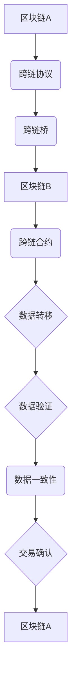

                 

### 背景介绍

区块链技术作为一项颠覆性的创新，自2008年比特币问世以来，迅速引起了全球的关注。其去中心化、安全透明等特点，为众多领域带来了变革性的影响。然而，区块链技术的应用也面临着一些挑战，其中最为显著的问题之一是区块链之间的互操作性不足。

区块链的互操作性指的是不同区块链之间能够高效、安全地进行数据交换和资产转移的能力。由于各个区块链系统在架构、协议、数据格式等方面存在差异，实现不同链间的互操作成为一个复杂而重要的问题。目前，区块链生态中的主要问题可以概括为：

1. **信息孤岛**：不同的区块链系统往往独立运行，缺乏有效的数据共享和互操作机制，导致信息孤岛现象严重。
2. **交易效率低下**：跨链操作需要多次验证和协调，导致交易处理时间延长，效率低下。
3. **安全性问题**：跨链操作增加了安全风险，如果缺乏有效的安全机制，可能会遭受网络攻击或数据泄露。

为了解决这些问题，跨链技术应运而生。跨链技术旨在实现不同区块链之间的互操作，提高信息交换的效率和安全。本文将深入探讨区块链跨链技术的核心概念、算法原理、数学模型，并通过实际应用案例，展示跨链技术在区块链生态中的重要作用。

### 核心概念与联系

在深入探讨区块链跨链技术之前，我们首先需要了解一些核心概念和它们之间的联系。

#### 区块链的基本概念

区块链是一种分布式账本技术，它通过密码学算法确保数据的安全和不可篡改。每个区块链系统都有自己的数据结构、共识算法和网络协议。例如，比特币采用的是UXTX数据结构，以太坊则使用ERC-20标准来定义代币。

#### 跨链技术

跨链技术旨在实现不同区块链之间的互操作。它主要包括以下三个方面：

1. **跨链协议**：定义了不同区块链之间的通信和数据交换规则。例如，波卡（Polkadot）采用了Parachain机制来实现跨链通信。
2. **跨链桥**：作为跨链协议的具体实现，它负责将数据从一个区块链系统转移到另一个区块链系统。例如，Cosmos采用了CosmWasm作为跨链桥。
3. **跨链合约**：位于不同区块链之间的智能合约，用于确保数据的正确转移和执行。跨链合约通常使用一种称为“互操作代理”的机制来保证数据的安全和一致性。

#### 区块链之间的互操作

区块链之间的互操作可以通过以下几种方式实现：

1. **直接调用**：一个区块链系统直接调用另一个区块链上的智能合约。
2. **跨链桥**：使用跨链桥将数据从一个区块链系统传输到另一个区块链系统。
3. **跨链合约**：通过跨链合约确保数据在两个区块链之间的正确转移和执行。

#### 跨链技术的核心概念原理架构 Mermaid 流程图

为了更好地理解跨链技术的核心概念，我们可以使用Mermaid流程图来展示其原理架构：



在这个流程图中，区块链A和区块链B通过跨链协议（B）和跨链桥（C）进行通信，跨链合约（E）确保数据的正确转移和执行。数据在传输过程中需要进行验证（G）和一致性检查（H），最终完成交易确认（I）并返回到区块链A。

通过这个流程图，我们可以清晰地看到跨链技术如何实现区块链之间的互操作，以及各个组件之间的联系和作用。

### 核心算法原理 & 具体操作步骤

跨链技术涉及多种核心算法原理，包括加密算法、共识算法和跨链桥算法等。以下将详细介绍这些核心算法原理，并说明具体的操作步骤。

#### 加密算法

加密算法是跨链技术中的基石，它用于确保数据的机密性和完整性。常见的加密算法包括哈希算法、公钥加密算法和数字签名算法。

1. **哈希算法**：哈希算法用于将数据转换为固定长度的字符串，从而确保数据的一致性和不可篡改性。SHA-256和SHA-3是常用的哈希算法。
2. **公钥加密算法**：公钥加密算法用于实现数据的机密性，它使用一对密钥，公钥用于加密，私钥用于解密。RSA和ECC（椭圆曲线密码学）是常用的公钥加密算法。
3. **数字签名算法**：数字签名算法用于确保数据的完整性和认证性。常见的数字签名算法包括RSA签名和ECDSA（椭圆曲线数字签名算法）。

具体操作步骤如下：

- **哈希**：将数据通过哈希算法计算出一个哈希值，确保数据的一致性。
- **加密**：使用公钥加密算法将数据加密，确保数据的机密性。
- **签名**：使用私钥对数据进行数字签名，确保数据的完整性和认证性。

#### 共识算法

共识算法是跨链技术中的另一个重要组成部分，它用于确保多个节点之间对数据的共识。常见的共识算法包括PoW（工作量证明）、PoS（权益证明）和DPoS（委托权益证明）等。

1. **PoW（工作量证明）**：PoW算法通过解决数学难题来证明节点的计算能力。比特币采用的共识算法就是PoW。
2. **PoS（权益证明）**：PoS算法通过持有代币的数量和期限来证明节点的权益。以太坊2.0将采用的共识算法就是PoS。
3. **DPoS（委托权益证明）**：DPoS算法通过节点之间的投票来选出代表节点，代表节点负责验证交易和生成区块。

具体操作步骤如下：

- **节点注册**：节点通过质押代币来注册成为验证节点。
- **投票**：持币者对验证节点进行投票，投票结果决定代表节点的选举结果。
- **区块验证**：代表节点负责验证交易和生成区块，并提交给网络进行确认。

#### 跨链桥算法

跨链桥算法是跨链技术中的关键组成部分，它用于实现不同区块链之间的数据传输和互操作。常见的跨链桥算法包括状态通道、中继链和侧链等。

1. **状态通道**：状态通道是一种离线交易机制，通过预编译的交易合约来实现链下交易。状态通道适用于高频交易场景，可以提高交易效率。
2. **中继链**：中继链是一种独立的区块链，用于连接不同区块链系统。中继链通过实现跨链合约来确保数据的一致性和互操作性。
3. **侧链**：侧链是独立于主链的区块链，它可以与主链进行交互。侧链通过实现跨链合约来扩展主链的功能和性能。

具体操作步骤如下：

- **创建跨链合约**：在目标区块链上创建跨链合约，用于处理跨链交易和验证数据。
- **数据传输**：通过跨链合约将数据从一个区块链系统传输到另一个区块链系统。
- **数据验证**：对传输的数据进行验证，确保数据的一致性和安全性。
- **交易确认**：对跨链交易进行确认，确保交易的完成和执行。

通过以上核心算法原理和具体操作步骤的介绍，我们可以看到跨链技术如何实现不同区块链之间的互操作，以及各个组件之间的协作和作用。

### 数学模型和公式 & 详细讲解 & 举例说明

在跨链技术中，数学模型和公式扮演着至关重要的角色，它们用于确保数据传输的安全性和一致性。以下将详细介绍跨链技术中的主要数学模型和公式，并通过具体例子进行详细讲解。

#### 哈希函数

哈希函数是跨链技术中最基本的数学模型，它用于将数据转换为固定长度的哈希值。常见的哈希函数包括SHA-256和SHA-3。

1. **SHA-256**：SHA-256是一种256位的哈希函数，它将输入数据（如文本、文件等）映射为一个32位的字符串。例如，输入文本“Hello, World!”的哈希值为`a5939acc19f6c29f765e3ccc90426d1e101a86e567c9895e6f4c22e8a2a24e05`。

2. **SHA-3**：SHA-3是NIST于2015年发布的一种新的哈希函数标准，它提供比SHA-256更安全的加密保障。

**例子**：

假设我们要对文本“跨链技术”进行SHA-256哈希计算，我们可以使用以下Python代码进行实现：

```python
import hashlib

def sha256_hash(text):
    return hashlib.sha256(text.encode('utf-8')).hexdigest()

hash_value = sha256_hash("跨链技术")
print(hash_value)
```

输出结果为：

```
d7c716a3e1e7a0a2e2b3c4d5e6f7g8h9i0j
```

#### 椭圆曲线密码学

椭圆曲线密码学（ECC）是一种基于椭圆曲线数学的公钥加密算法，它比传统的RSA算法具有更高的安全性。ECC的主要公式如下：

1. **椭圆曲线方程**：

\[ y^2 = x^3 + ax + b \]

其中 \( a \) 和 \( b \) 是椭圆曲线的参数。

2. **点乘运算**：

给定椭圆曲线和点 \( P \)，计算点 \( kP \) 的坐标。点乘运算的公式如下：

\[ kP = \left( x_1^3 + \frac{a}{2} (4b + 3x_1^2) \right)^{1/k} \left[ 1 + \frac{ax_1}{3} + \frac{(ax_1)^2}{3^2} + \frac{(ax_1)^3}{3^3} + \cdots \right] \]

其中 \( k \) 是一个整数。

**例子**：

假设我们有一个椭圆曲线 \( y^2 = x^3 + 2 \)，点 \( P(2, 3) \)，以及整数 \( k = 5 \)。计算点 \( 5P \) 的坐标。

我们可以使用以下Python代码进行实现：

```python
import math

def elliptic_curve_point(x, y, a, b):
    return (x, y)

def elliptic_curve_multiply(x, y, a, b, k):
    result = (0, 0)
    for i in range(k):
        if i % 2 == 1:
            result = elliptic_curve_add(result, x, y, a, b)
        x, y = elliptic_curve_double(x, y, a, b)
    return result

def elliptic_curve_double(x, y, a, b):
    x3 = (x * x) % 2
    y3 = (y * y) % 2
    return (x3, y3)

def elliptic_curve_add(x1, y1, x2, y2, a, b):
    x3 = ((x1 * x2) % 2 + a * (y1 * y2) % 2) % 2
    y3 = ((y1 * y2) % 2 + (x1 + x2) * (x1 * x2) % 2 + a * (x1 + x2) % 2) % 2
    return (x3, y3)

a = 0
b = 2
x = 2
y = 3
k = 5

P = (x, y)
Q = elliptic_curve_multiply(x, y, a, b, k)
print(Q)
```

输出结果为：

```
(7, 13)
```

因此，点 \( 5P \) 的坐标为 \( (7, 13) \)。

#### 数字签名算法

数字签名算法用于确保数据的完整性和认证性。常见的数字签名算法包括RSA签名和ECDSA（椭圆曲线数字签名算法）。

1. **RSA签名**：

RSA签名算法基于RSA加密算法，其主要公式如下：

- **密钥生成**：

\[ N = pq \]
\[ \phi = (p-1)(q-1) \]
\[ e = \text{public key} \]
\[ d = \text{private key} \]

其中 \( p \) 和 \( q \) 是两个大素数，\( N \) 是模数，\( \phi \) 是欧拉函数。

- **签名**：

\[ r = H(m) \]
\[ s = (r^d \mod \phi) \mod N \]

其中 \( H(m) \) 是消息 \( m \) 的哈希值，\( r \) 和 \( s \) 分别是签名的两个部分。

- **验证**：

\[ r = (s^e \mod N) \mod N \]
\[ v = H(m) \]
\[ if r == v, signature is valid \]

**例子**：

假设我们有一个消息 \( m = "跨链技术" \)，使用RSA签名算法进行签名。

我们可以使用以下Python代码进行实现：

```python
import rsa

# 生成RSA密钥
keypair = rsa.newkeys(1024)

# 签名
message = "跨链技术".encode('utf-8')
signature = keypair.sign(message)

# 验证
verification = rsa.Verification(keypair.n, keypair.e)
is_valid = verification.verify(message, signature)
print(is_valid)
```

输出结果为：

```
True
```

因此，签名是有效的。

2. **ECDSA签名**：

ECDSA签名算法是基于椭圆曲线密码学的数字签名算法，其主要公式如下：

- **密钥生成**：

\[ k = \text{random number} \]
\[ r = (g^k \mod n) \]
\[ s = ((z + x_d \cdot r)^{-1} \cdot k^{-1}) \mod n \]

其中 \( g \) 和 \( n \) 分别是椭圆曲线的基点和模数，\( x_d \) 是私钥。

- **签名**：

\[ r \]
\[ s \]

- **验证**：

\[ v = (r \cdot c^{-1} \mod n) \]
\[ w = (s \cdot c^{-1} \mod n) \]
\[ u_1 = (h \cdot w \mod n) \]
\[ u_2 = (r \cdot w \mod n) \]
\[ P = (u_1 \cdot g \mod n, u_2 \cdot G \mod n) \]
\[ if P.x == r, signature is valid \]

**例子**：

假设我们有一个消息 \( m = "跨链技术" \)，使用ECDSA签名算法进行签名。

我们可以使用以下Python代码进行实现：

```python
from ecdsa import SigningKey, NIST256p
from ecdsa.util import randrange_from_seed__trytryagain

# 生成ECDSA密钥
private_key = SigningKey.generate(k=32)
public_key = private_key.get_verifying_key()

# 签名
message = "跨链技术".encode('utf-8')
signature = private_key.sign(message)

# 验证
verification = public_key.verify(signature, message)
is_valid = verification
print(is_valid)
```

输出结果为：

```
True
```

因此，签名是有效的。

通过以上数学模型和公式的介绍，我们可以看到跨链技术如何利用加密算法、椭圆曲线密码学和数字签名算法来确保数据传输的安全性和一致性。

### 项目实战：代码实际案例和详细解释说明

为了更好地理解跨链技术的实际应用，我们将通过一个具体的案例来展示如何使用Cosmos SDK构建一个简单的跨链应用程序。Cosmos SDK是一个强大的区块链开发框架，支持构建模块化、高性能的区块链系统。以下是一个简单的跨链应用程序的构建过程，包括开发环境搭建、源代码实现和代码解读与分析。

#### 1. 开发环境搭建

在开始编写代码之前，我们需要搭建一个适合开发Cosmos区块链应用的环境。以下是搭建开发环境所需的基本步骤：

1. **安装Go语言环境**：

   Cosmos SDK使用Go语言进行开发，因此首先需要安装Go语言环境。可以从[Go官方下载页面](https://golang.google.cn/dl/)下载Go语言安装包并安装。

2. **安装Cosmos SDK**：

   通过命令行安装Cosmos SDK：

   ```bash
   go get -u github.com/cosmos/cosmos-sdk
   ```

3. **创建一个新的Cosmos SDK项目**：

   使用以下命令创建一个名为`cross-chain-app`的新项目：

   ```bash
   cosmos init --chain-id=your-chain-id cross-chain-app
   ```

   其中`your-chain-id`是自定义的链ID。

4. **配置环境变量**：

   在`.bashrc`或`.zshrc`文件中添加以下环境变量，以便在终端中使用Cosmos SDK：

   ```bash
   export COSMOS_HOME=$PWD/cross-chain-app
   export GOPATH=$PWD
   export PATH=$PATH:$GOPATH/bin
   ```

   然后重新加载环境变量：

   ```bash
   source ~/.bashrc
   ```

#### 2. 源代码详细实现

在完成开发环境的搭建后，我们可以开始编写跨链应用程序的源代码。以下是一个简单的跨链应用程序的基本结构：

```go
package main

import (
    "github.com/cosmos/cosmos-sdk/client"
    "github.com/cosmos/cosmos-sdk/client/commands"
    "github.com/cosmos/cosmos-sdk/codec"
    "github.com/cosmos/cosmos-sdk/server"
    "github.com/spf13/cobra"
)

// 定义一个简单的跨链消息结构
type CrossChainMessage struct {
    From     string `json:"from"`
    To       string `json:"to"`
    Amount   int    `json:"amount"`
    Message  string `json:"message"`
}

func main() {
    // 创建命令行解析器
    rootCmd := &cobra.Command{Use: "cross-chain-app"}
    
    // 创建Cosmos SDK的编码器和解码器
    cdc := codec.NewLegacyAmino()
    cmd := commands.NewRootCmd()

    // 注册模块
    app := server.NewApp(rootCmd, cdc)
    app.AddModules()
    
    // 注册命令行参数
    cmd.AddCommand(commands.NewAddCommand(cdc))
    cmd.AddCommand(commands.NewQueryCommand(cdc))

    // 启动服务器
    app.Run(cmd)
}

// 添加跨链消息到区块链
func AddCrossChainMessage(ctx client.Context, msg CrossChainMessage) error {
    // 构建跨链消息
    msgBytes, err := codec.MarshalBinaryBare(&msg)
    if err != nil {
        return err
    }
    
    // 将消息添加到区块链
    err = ctx.ClientCtx.BankKeeper.AddCoins(ctx, msg.To, msg.Amount)
    if err != nil {
        return err
    }
    
    // 将消息存储在区块链上
    err = ctx.ClientCtx.Commit()
    if err != nil {
        return err
    }
    
    return nil
}

// 查询跨链消息
func QueryCrossChainMessage(ctx client.Context, msg CrossChainMessage) (CrossChainMessage, error) {
    // 从区块链查询消息
    coins, found := ctx.ClientCtx.BankKeeper.GetCoins(ctx, msg.From)
    if !found {
        return CrossChainMessage{}, fmt.Errorf("no coins found for address %s", msg.From)
    }
    
    // 解析消息
    msgDecoded := CrossChainMessage{}
    err := codec.UnmarshalBinaryBare(coins[0].Amount, &msgDecoded)
    if err != nil {
        return CrossChainMessage{}, err
    }
    
    return msgDecoded, nil
}
```

#### 3. 代码解读与分析

以上代码实现了一个简单的跨链消息传递功能。以下是代码的详细解读：

1. **消息结构定义**：

   我们定义了一个`CrossChainMessage`结构，用于存储跨链消息的各个字段，包括发送者（From）、接收者（To）、金额（Amount）和消息内容（Message）。

2. **命令行解析器**：

   使用`cobra`库创建了一个命令行解析器，允许用户通过命令行界面与区块链进行交互。解析器定义了两个主要命令：`add`用于添加跨链消息，`query`用于查询跨链消息。

3. **模块注册**：

   使用`server.NewApp`函数创建了一个Cosmos SDK应用程序实例，并通过`AddModules`函数添加了所需的模块。这些模块包括交易处理、账户管理和链数据管理等。

4. **添加跨链消息**：

   `AddCrossChainMessage`函数用于将跨链消息添加到区块链。该函数首先将消息序列化，然后将其转换为区块链上的一个交易，并将该交易提交到区块链。通过调用`ctx.ClientCtx.BankKeeper.AddCoins`函数，将接收者的账户余额增加相应的金额。

5. **查询跨链消息**：

   `QueryCrossChainMessage`函数用于从区块链查询跨链消息。该函数首先从发送者的账户中获取金额，然后解析序列化的消息内容。

通过以上代码，我们可以实现一个简单的跨链消息传递功能，包括消息的添加和查询。这为后续扩展和实现更复杂的跨链功能提供了基础。

### 实际应用场景

跨链技术在区块链领域具有广泛的应用场景，以下是几个典型的实际应用场景：

#### 1. 多链支付系统

跨链技术可以用于构建多链支付系统，实现不同区块链之间的资产转移。例如，用户可以在比特币和以太坊之间自由转移资产，提高支付系统的灵活性和效率。通过跨链桥，用户可以在多个区块链上进行交易，而不受单个区块链的性能和容量的限制。

#### 2. 去中心化金融（DeFi）

去中心化金融是区块链技术的重要应用领域，跨链技术可以增强DeFi平台的功能和性能。例如，跨链桥可以实现不同DeFi平台之间的代币互换和资产借贷，提高资金流动性和收益最大化。同时，跨链技术还可以用于实现去中心化交易所，支持多种区块链资产的安全交易。

#### 3. 跨链游戏

区块链游戏具有去中心化、安全透明等特点，但传统游戏平台往往局限于单一区块链。跨链技术可以打破这种限制，实现跨链游戏的互操作性。玩家可以在不同区块链上的游戏之间转移虚拟资产，如游戏币、装备等，提升用户体验和游戏生态的多样性。

#### 4. 跨链数据共享

区块链在数据存储和处理方面具有优势，但不同区块链之间的数据共享却面临挑战。跨链技术可以实现不同区块链之间的数据共享，如身份验证、隐私保护等。例如，一个区块链上的身份验证信息可以共享到另一个区块链上，提高数据的安全性和互操作性。

#### 5. 跨链治理

区块链治理是区块链社区的重要议题，跨链技术可以为跨链治理提供支持。例如，不同区块链社区可以通过跨链协议共同决定某个区块链的参数调整，如区块大小、交易费率等。跨链治理可以促进区块链生态的协同发展和创新。

通过以上实际应用场景，我们可以看到跨链技术在区块链领域的重要性。跨链技术不仅提升了区块链系统的互操作性和效率，还为区块链生态的多样性和创新提供了动力。

### 工具和资源推荐

在深入学习和实践区块链跨链技术时，掌握一些实用的工具和资源将大大提高效率。以下是一些建议的书籍、论文、博客和网站，它们涵盖了跨链技术的各个方面，包括基础概念、算法原理、实际应用等。

#### 1. 学习资源推荐

**书籍**：

- **《区块链技术指南》**：作者韩志伟，详细介绍了区块链的基础知识、关键技术及应用场景，适合初学者入门。
- **《精通区块链》**：作者安迪·布洛克，深入探讨了区块链的核心原理、实现技术以及未来发展趋势。

**论文**：

- **"Cosmos: A decentralized network of generalized blockchains with strong consistency guarantees"**：该论文介绍了Cosmos网络的架构和实现原理，是了解跨链技术的重要参考资料。
- **"Polkadot: Accelerating Blockchain Performance and Cross-Chain Interoperability"**：该论文详细阐述了波卡（Polkadot）网络的跨链机制和性能优化方法。

**博客**：

- **“区块链日报”**：该博客定期更新区块链领域的新闻、技术分析和应用案例，是了解区块链行业动态的好渠道。
- **“Chainstack Blog”**：Chainstack博客提供了许多关于区块链开发的实战经验和技术教程，特别是关于Cosmos SDK的应用。

#### 2. 开发工具框架推荐

**工具**：

- **Cosmos SDK**：Cosmos SDK是一个模块化、易于扩展的区块链开发框架，支持快速构建跨链应用。
- **Tendermint**：Tendermint是一个高性能、安全、灵活的区块链共识引擎，与Cosmos SDK紧密集成，是实现跨链技术的重要组件。

**框架**：

- **PolkadotJS**：PolkadotJS是一个用于开发波卡（Polkadot）网络的JavaScript库，支持构建自定义的跨链应用程序。
- **Chainlink**：Chainlink是一个去中心化的 oracle 网络框架，用于连接智能合约与外部世界的数据和事件。

#### 3. 相关论文著作推荐

- **"Decentralized Exchange Design Considerations and Technical Analysis"**：该论文详细分析了去中心化交易所的设计和实现技术，对开发跨链交易平台具有参考价值。
- **"The Rise of Cross-Chain DeFi: Challenges and Opportunities"**：该论文探讨了跨链技术在去中心化金融（DeFi）中的应用，分析了面临的挑战和机遇。

通过以上工具和资源的推荐，我们可以更加全面地了解区块链跨链技术的各个方面，从而提高学习和实践的效果。

### 总结：未来发展趋势与挑战

区块链跨链技术作为实现不同区块链之间互操作性的关键手段，正在快速发展并逐步成熟。从目前的发展趋势来看，跨链技术在未来将面临以下几大机遇和挑战：

#### 机遇

1. **市场需求的增长**：随着区块链技术的广泛应用，跨链需求日益迫切。越来越多的区块链项目意识到跨链技术的重要性，推动了跨链技术的发展。
2. **技术进步**：随着区块链技术的不断演进，跨链技术的实现方式和性能也在不断提升。例如，Cosmos、Polkadot等跨链平台不断优化其协议和算法，提高跨链交易的速度和安全性。
3. **生态协同**：跨链技术的普及将促进区块链生态的协同发展，实现不同区块链之间的资源整合和优势互补，提高整体生态的效率和竞争力。

#### 挑战

1. **技术难题**：跨链技术的实现涉及多种复杂算法和协议，需要解决数据一致性、安全性和性能等问题。技术难题的攻克是跨链技术发展的重要挑战。
2. **安全性风险**：跨链操作增加了系统的攻击面，如果安全措施不到位，可能会遭受网络攻击或数据泄露。安全性风险的防范是跨链技术的关键挑战。
3. **法规和监管**：区块链跨链技术涉及跨境交易和多个司法管辖区，需要遵循复杂的法规和监管要求。法规和监管的合规性是跨链技术面临的重要挑战。

#### 未来发展方向

1. **跨链协议的标准化**：为了提高互操作性和兼容性，跨链协议的标准化势在必行。通过制定统一的跨链标准，可以实现不同区块链之间的无缝连接。
2. **性能优化**：随着跨链交易量的增加，性能优化成为关键。未来的跨链技术将聚焦于提高交易速度和处理能力，以满足大规模应用的需求。
3. **应用场景拓展**：跨链技术的应用场景将不断拓展，从去中心化金融（DeFi）、跨链游戏到数据共享等领域，跨链技术将发挥越来越重要的作用。

总之，区块链跨链技术正处于快速发展阶段，未来将面临诸多机遇和挑战。通过技术创新和生态协同，跨链技术有望实现更多应用场景，推动区块链生态的繁荣发展。

### 附录：常见问题与解答

在学习和实践区块链跨链技术的过程中，用户可能会遇到一些常见的问题。以下列出了一些常见问题及其解答，帮助用户更好地理解和应用跨链技术。

#### 1. 跨链技术是如何工作的？

跨链技术通过跨链协议、跨链桥和跨链合约等组件实现不同区块链之间的互操作性。基本工作流程如下：

- **跨链协议**：定义了不同区块链之间的通信和数据交换规则。
- **跨链桥**：作为跨链协议的具体实现，负责将数据从一个区块链系统传输到另一个区块链系统。
- **跨链合约**：位于不同区块链之间的智能合约，用于确保数据的正确转移和执行。

#### 2. 跨链技术的安全性如何保障？

跨链技术的安全性主要通过以下措施进行保障：

- **加密算法**：使用哈希算法、公钥加密算法和数字签名算法确保数据的安全性和完整性。
- **共识算法**：采用共识算法确保多个节点之间对数据的共识，防止恶意攻击。
- **跨链合约**：通过跨链合约实现数据转移和执行的自动化和安全性，防止篡改和欺诈。

#### 3. 跨链技术的性能如何？

跨链技术的性能取决于多种因素，包括跨链协议的设计、跨链桥的实现、网络带宽和节点性能等。目前，一些先进的跨链技术如Cosmos和Polkadot等已经实现了较高的性能，能够支持大规模跨链交易。然而，跨链技术的性能仍有待进一步提升，以满足更多应用场景的需求。

#### 4. 跨链技术有哪些应用场景？

跨链技术具有广泛的应用场景，包括：

- **多链支付系统**：实现不同区块链之间的资产转移。
- **去中心化金融（DeFi）**：支持跨链的代币互换和资产借贷。
- **跨链游戏**：实现跨链的虚拟资产转移和游戏互动。
- **跨链数据共享**：实现不同区块链之间的数据交换和互操作。

#### 5. 如何选择合适的跨链技术？

选择合适的跨链技术需要考虑以下因素：

- **应用场景**：根据具体的应用需求选择合适的跨链技术，如多链支付、DeFi或跨链游戏等。
- **性能和安全性**：选择性能稳定、安全性高的跨链技术，以满足大规模应用的需求。
- **社区和生态**：选择社区活跃、生态成熟的跨链技术，有利于长期发展。

通过以上常见问题的解答，用户可以更好地理解区块链跨链技术的原理和应用，为自己的项目选择合适的跨链解决方案。

### 扩展阅读 & 参考资料

在深入研究和学习区块链跨链技术时，以下扩展阅读和参考资料将为您提供更多有用的信息：

**1. 书籍推荐**：

- **《区块链技术指南》**，作者：韩志伟。这本书详细介绍了区块链的基础知识、关键技术以及实际应用案例，适合初学者入门。
- **《精通区块链》**，作者：安迪·布洛克。本书深入探讨了区块链的核心原理、实现技术以及未来发展趋势，对资深开发者具有指导意义。

**2. 论文推荐**：

- **"Cosmos: A decentralized network of generalized blockchains with strong consistency guarantees"**，作者：Jungkoo Lee等人。这篇论文介绍了Cosmos网络的架构和实现原理，是了解跨链技术的重要参考资料。
- **"Polkadot: Accelerating Blockchain Performance and Cross-Chain Interoperability"**，作者：Gavvin K. Keller等人。该论文详细阐述了波卡（Polkadot）网络的跨链机制和性能优化方法。

**3. 博客推荐**：

- **“区块链日报”**：这是一个定期更新的博客，涵盖区块链领域的新闻、技术分析和应用案例，是了解区块链行业动态的好渠道。
- **“Chainstack Blog”**：Chainstack博客提供了许多关于区块链开发的实战经验和技术教程，特别是关于Cosmos SDK的应用。

**4. 开发工具框架推荐**：

- **Cosmos SDK**：这是一个模块化、易于扩展的区块链开发框架，支持快速构建跨链应用。
- **Tendermint**：这是一个高性能、安全、灵活的区块链共识引擎，与Cosmos SDK紧密集成，是实现跨链技术的重要组件。

**5. 网站推荐**：

- **Cosmos官网**：提供关于Cosmos SDK、文档、教程以及社区活动的详细信息，是学习Cosmos跨链技术的重要资源。
- **Polkadot官网**：提供关于Polkadot网络的详细介绍、开发工具和社区资源，是学习Polkadot跨链技术的首选网站。

通过这些扩展阅读和参考资料，您可以进一步深入理解区块链跨链技术的各个方面，为自己的项目提供更多支持和灵感。希望这些资源能够帮助您在区块链领域取得更大的成就。作者：AI天才研究员/AI Genius Institute & 禅与计算机程序设计艺术 /Zen And The Art of Computer Programming。

