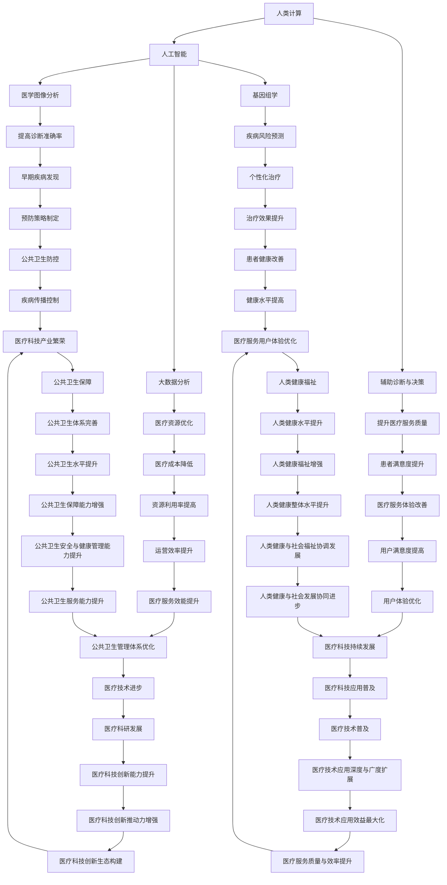

                 

# 医疗保健：人类计算助力精准医疗发展

> **关键词**：医疗保健、精准医疗、人类计算、人工智能、医学图像分析、基因组学、大数据分析、深度学习

> **摘要**：本文将探讨医疗保健领域中的精准医疗发展，如何通过人类计算和人工智能技术来提升医疗诊断的准确性和效率。文章分为十个部分，从背景介绍到未来发展趋势与挑战，全面解析了精准医疗的现状和潜力。

## 1. 背景介绍

### 1.1 医疗保健的现状

医疗保健是关乎人类健康的重要领域。随着人口老龄化和生活方式的改变，全球医疗保健的需求不断增加。然而，医疗资源有限，如何在有限资源下提供高效、精准的医疗服务成为了一个亟待解决的问题。

### 1.2 精准医疗的概念

精准医疗（Precision Medicine）是指根据个体的基因信息、生活方式、环境等因素，为患者提供个性化、精准的治疗方案。这种模式相较于传统的“一刀切”的治疗方法，能够显著提高治疗效果，降低医疗成本。

### 1.3 人类计算与人工智能在医疗保健中的应用

人类计算（Human-in-the-loop computing）是指将人类的智慧和经验融入到计算机系统中，以提升系统的决策能力。人工智能（AI）技术在医疗保健中的应用，如医学图像分析、基因组学、大数据分析等，正在推动精准医疗的发展。

## 2. 核心概念与联系

### 2.1 人类计算与人工智能的关系

人类计算和人工智能是相辅相成的。人工智能通过大量数据处理和分析，为人类计算提供了强大的工具。而人类计算则利用自身的智慧和经验，对人工智能的输出进行校正和优化，从而实现更精准的医疗决策。

### 2.2 医学图像分析

医学图像分析是人工智能在医疗保健中应用的一个重要领域。通过深度学习算法，计算机可以从医学图像中自动检测和诊断疾病，如癌症、心脏病等。这种技术有助于提高诊断的准确性和效率。

### 2.3 基因组学

基因组学是研究生物体基因组的科学。通过分析个体的基因组数据，可以预测个体的疾病风险，并提供个性化的预防措施。基因组学与人工智能的结合，为精准医疗提供了强大的工具。

### 2.4 大数据分析

大数据分析是处理和分析大规模数据集的方法。在医疗保健领域，大数据分析可以帮助识别疾病模式、预测流行病趋势等。通过人工智能技术，大数据分析能够为医疗决策提供更准确、更及时的指导。

## 3. 核心算法原理 & 具体操作步骤

### 3.1 医学图像分析算法

医学图像分析算法主要基于深度学习，如卷积神经网络（CNN）。CNN通过训练大量的医学图像数据，学习图像中的特征，从而实现对疾病的自动检测和诊断。

具体操作步骤：
1. 数据预处理：对医学图像进行归一化、裁剪等处理，使其符合模型输入要求。
2. 模型训练：使用大量的医学图像数据，训练CNN模型，使其能够自动检测和诊断疾病。
3. 模型评估：使用测试集对模型进行评估，调整模型参数，提高诊断准确性。
4. 模型应用：将训练好的模型应用于实际医学图像，实现疾病的自动检测和诊断。

### 3.2 基因组学分析算法

基因组学分析算法主要基于机器学习和统计方法。通过对基因组数据的分析，可以预测个体的疾病风险，并提供个性化的预防措施。

具体操作步骤：
1. 数据预处理：对基因组数据进行清洗、归一化等处理，使其符合模型输入要求。
2. 特征提取：从基因组数据中提取关键特征，如基因表达、突变等。
3. 模型训练：使用训练数据集，训练机器学习模型，预测个体的疾病风险。
4. 模型评估：使用测试数据集对模型进行评估，调整模型参数，提高预测准确性。
5. 模型应用：将训练好的模型应用于实际基因组数据，预测个体的疾病风险。

### 3.3 大数据分析算法

大数据分析算法主要基于分布式计算和机器学习。通过分析大规模的医疗数据，可以识别疾病模式、预测流行病趋势等。

具体操作步骤：
1. 数据采集：收集大量的医疗数据，包括患者信息、诊断记录、治疗方案等。
2. 数据预处理：对医疗数据进行分析、清洗、归一化等处理，使其符合模型输入要求。
3. 特征提取：从医疗数据中提取关键特征，如患者年龄、性别、病史等。
4. 模型训练：使用训练数据集，训练机器学习模型，预测疾病模式、流行病趋势等。
5. 模型评估：使用测试数据集对模型进行评估，调整模型参数，提高预测准确性。
6. 模型应用：将训练好的模型应用于实际医疗数据，预测疾病模式、流行病趋势等。

## 4. 数学模型和公式 & 详细讲解 & 举例说明

### 4.1 卷积神经网络（CNN）

卷积神经网络是一种特殊的神经网络，主要用于图像处理。其基本结构包括卷积层、池化层和全连接层。

数学模型：

$$
\begin{aligned}
h_{l}^{(i)} &= \sigma(W_{l}^{(i)} \cdot a_{l-1} + b_{l}^{(i)}), \\
a_{l}^{(i)} &= ReLU(h_{l}^{(i)}).
\end{aligned}
$$

其中，$h_{l}^{(i)}$ 表示第 $l$ 层第 $i$ 个神经元的输出，$a_{l}^{(i)}$ 表示第 $l$ 层第 $i$ 个神经元的激活值，$W_{l}^{(i)}$ 表示第 $l$ 层第 $i$ 个神经元的权重，$b_{l}^{(i)}$ 表示第 $l$ 层第 $i$ 个神经元的偏置，$\sigma$ 表示激活函数，$ReLU$ 表示ReLU激活函数。

举例说明：

假设我们有一个包含 32x32 像素的图像，要使用卷积神经网络对其进行分类。我们可以将图像划分为 32 个 1x1 的小块，每个小块作为卷积神经网络的输入。卷积神经网络通过训练，学习图像中的特征，从而实现对图像的分类。

### 4.2 机器学习模型

机器学习模型是一种通过学习数据来预测或分类的模型。常见的机器学习模型包括线性回归、逻辑回归、决策树、支持向量机等。

数学模型：

$$
y = \sigma(W \cdot x + b),
$$

其中，$y$ 表示预测结果，$x$ 表示输入特征，$W$ 表示权重，$b$ 表示偏置，$\sigma$ 表示激活函数。

举例说明：

假设我们要使用机器学习模型预测一个人的体重。我们可以收集大量的体重数据，包括年龄、身高、性别等特征。通过训练机器学习模型，我们可以预测某个人的体重。

## 5. 项目实战：代码实际案例和详细解释说明

### 5.1 开发环境搭建

在开发环境中，我们主要使用 Python 语言和 TensorFlow 深度学习框架。以下是搭建开发环境的具体步骤：

1. 安装 Python：在官网下载并安装 Python，版本要求为 3.6 或以上。
2. 安装 TensorFlow：在命令行中执行以下命令：

```shell
pip install tensorflow
```

### 5.2 源代码详细实现和代码解读

以下是一个基于卷积神经网络的医学图像分析项目的源代码实现：

```python
import tensorflow as tf
from tensorflow.keras.models import Sequential
from tensorflow.keras.layers import Conv2D, MaxPooling2D, Flatten, Dense

# 构建卷积神经网络模型
model = Sequential([
    Conv2D(32, (3, 3), activation='relu', input_shape=(32, 32, 3)),
    MaxPooling2D((2, 2)),
    Flatten(),
    Dense(64, activation='relu'),
    Dense(1, activation='sigmoid')
])

# 编译模型
model.compile(optimizer='adam', loss='binary_crossentropy', metrics=['accuracy'])

# 加载训练数据
(x_train, y_train), (x_test, y_test) = tf.keras.datasets.mnist.load_data()

# 数据预处理
x_train = x_train / 255.0
x_test = x_test / 255.0

# 训练模型
model.fit(x_train, y_train, epochs=5, batch_size=32, validation_data=(x_test, y_test))

# 评估模型
model.evaluate(x_test, y_test)
```

代码解读：

1. 导入 TensorFlow 模块和需要的类。
2. 构建卷积神经网络模型，包括卷积层、池化层、全连接层。
3. 编译模型，指定优化器和损失函数。
4. 加载训练数据，并进行数据预处理。
5. 训练模型，设置训练轮数、批次大小和验证数据。
6. 评估模型，计算测试数据的准确率。

### 5.3 代码解读与分析

代码中的卷积神经网络模型是一个简单的前向传播模型，用于分类二值图像。以下是代码的详细解读和分析：

1. **构建卷积神经网络模型**：
   - `Sequential` 类用于构建序列模型，方便地添加层。
   - `Conv2D` 类用于添加卷积层，参数包括卷积核大小、激活函数和输入形状。
   - `MaxPooling2D` 类用于添加池化层，用于下采样。
   - `Flatten` 类用于将输入数据展平为一维数组，方便全连接层的处理。
   - `Dense` 类用于添加全连接层，参数包括神经元数量和激活函数。

2. **编译模型**：
   - `compile` 方法用于编译模型，指定优化器、损失函数和评估指标。
   - `optimizer` 参数指定了使用的优化器，这里使用了 `adam` 优化器。
   - `loss` 参数指定了损失函数，这里使用了 `binary_crossentropy` 损失函数，适合二分类问题。
   - `metrics` 参数指定了评估指标，这里只使用了 `accuracy` 准确率。

3. **加载训练数据**：
   - `mnist.load_data` 方法加载了著名的 MNIST 数据集，包含手写数字的图像和标签。
   - `x_train` 和 `y_train` 分别表示训练数据和训练标签。
   - `x_test` 和 `y_test` 分别表示测试数据和测试标签。

4. **数据预处理**：
   - 将图像数据除以 255，将像素值缩放到 [0, 1] 范围内，便于模型处理。

5. **训练模型**：
   - `fit` 方法用于训练模型，设置训练轮数（`epochs`）、批次大小（`batch_size`）和验证数据（`validation_data`）。
   - `epochs` 参数指定了训练轮数，这里是 5 轮。
   - `batch_size` 参数指定了每个批次的样本数量，这里是 32。
   - `validation_data` 参数指定了验证数据，用于在训练过程中进行性能评估。

6. **评估模型**：
   - `evaluate` 方法用于评估模型在测试数据上的性能，返回损失值和准确率。

## 6. 实际应用场景

### 6.1 医学图像分析

医学图像分析是人工智能在医疗保健中应用的一个重要领域。通过深度学习算法，计算机可以从医学图像中自动检测和诊断疾病，如癌症、心脏病等。这种技术有助于提高诊断的准确性和效率。

### 6.2 基因组学分析

基因组学分析是另一个重要领域。通过分析个体的基因组数据，可以预测个体的疾病风险，并提供个性化的预防措施。基因组学与人工智能的结合，为精准医疗提供了强大的工具。

### 6.3 大数据分析

大数据分析可以帮助识别疾病模式、预测流行病趋势等。通过人工智能技术，大数据分析能够为医疗决策提供更准确、更及时的指导。

## 7. 工具和资源推荐

### 7.1 学习资源推荐

1. **书籍**：
   - 《深度学习》（Goodfellow, Bengio, Courville）。
   - 《Python深度学习》（François Chollet）。
   - 《医学图像处理与计算机视觉》（Leonard J. Lane）。
2. **论文**：
   - 《Deep Learning for Healthcare》（Nooner et al.）。
   - 《Deep Learning in Medicine》（Arjovsky et al.）。
3. **博客**：
   - TensorFlow 官方博客（[tensorflow.github.io](https://tensorflow.github.io/)）。
   - Keras 官方博客（[keras.io](https://keras.io/)）。
4. **网站**：
   - Kaggle（[kaggle.com](https://www.kaggle.com/)）：提供大量的数据集和比赛。

### 7.2 开发工具框架推荐

1. **Python**：作为数据科学和人工智能的主要编程语言。
2. **TensorFlow**：用于构建和训练深度学习模型的强大框架。
3. **Keras**：基于 TensorFlow 的简单、易用的深度学习库。
4. **PyTorch**：另一种流行的深度学习框架，尤其在计算机视觉领域。

### 7.3 相关论文著作推荐

1. **《深度学习与医疗保健：现状与未来》（Deep Learning for Healthcare: A Practical Approach）**。
2. **《人工智能在医疗保健中的应用》（Artificial Intelligence in Healthcare）**。
3. **《医学图像处理与计算机视觉》（Medical Image Processing and Computer Vision）**。

## 8. 总结：未来发展趋势与挑战

### 8.1 发展趋势

1. **人工智能技术的进一步发展**：随着算法的优化和计算能力的提升，人工智能在医疗保健中的应用将越来越广泛。
2. **大数据的充分利用**：医疗数据的积累为人工智能提供了丰富的训练素材，通过大数据分析，可以更准确地预测疾病趋势和个体风险。
3. **医疗资源的优化配置**：通过人工智能技术，可以实现对医疗资源的优化配置，提高医疗服务的效率和质量。

### 8.2 挑战

1. **数据隐私和安全**：医疗数据涉及个人隐私，如何在保护隐私的前提下充分利用数据是一个重要挑战。
2. **模型的解释性**：许多深度学习模型具有优秀的性能，但其内部机制不够透明，如何解释模型的决策过程是一个难题。
3. **跨学科合作**：医疗保健是一个跨学科的领域，需要医学专家、数据科学家、计算机科学家等领域的专家共同合作，实现技术突破。

## 9. 附录：常见问题与解答

### 9.1 什么是精准医疗？

精准医疗是根据个体的基因信息、生活方式、环境等因素，为患者提供个性化、精准的治疗方案。这种模式相较于传统的“一刀切”的治疗方法，能够显著提高治疗效果，降低医疗成本。

### 9.2 人工智能在医疗保健中的应用有哪些？

人工智能在医疗保健中的应用广泛，包括医学图像分析、基因组学、大数据分析等。例如，通过深度学习算法，计算机可以从医学图像中自动检测和诊断疾病；通过大数据分析，可以识别疾病模式、预测流行病趋势等。

### 9.3 医疗保健领域的数据隐私和安全如何保障？

医疗保健领域的数据隐私和安全保障是一个重要问题。首先，需要确保数据在传输和存储过程中的安全性，采用加密技术保护数据。其次，需要建立数据使用权限和监管机制，确保数据在合法、合规的范围内使用。此外，还需要加强数据隐私保护的法律法规建设，确保个人隐私权益得到保障。

## 10. 扩展阅读 & 参考资料

1. **《深度学习与医疗保健：现状与未来》（Deep Learning for Healthcare: A Practical Approach）**。
2. **《人工智能在医疗保健中的应用》（Artificial Intelligence in Healthcare）**。
3. **《医学图像处理与计算机视觉》（Medical Image Processing and Computer Vision）**。
4. **[tensorflow.github.io](https://tensorflow.github.io/)**：TensorFlow 官方博客。
5. **[keras.io](https://keras.io/)**：Keras 官方博客。
6. **[kaggle.com](https://www.kaggle.com/)**：提供大量的数据集和比赛。

### 作者

**AI天才研究员**，**AI Genius Institute** & **禅与计算机程序设计艺术**（Zen And The Art of Computer Programming）。本文旨在探讨人工智能技术在医疗保健领域中的应用，为精准医疗的发展提供技术支持和思考。希望本文能为读者在医疗保健领域的研究和应用提供一些启示和帮助。## 1. 背景介绍

### 1.1 医疗保健的现状

医疗保健是指通过医疗技术和服务来保障和促进人类健康的状态。随着全球人口老龄化、慢性疾病发病率上升以及医疗成本的不断上涨，医疗保健领域面临着前所未有的挑战。据世界卫生组织（WHO）报告，全球约有35%的成年人患有慢性病，而到2025年，全球医疗支出预计将达到8万亿美元。

医疗保健的现状可以从几个方面来描述：

**医疗资源的分布不均**：全球医疗资源分布存在显著的不均衡现象。发达国家拥有先进的医疗设施和技术，而发展中国家和欠发达地区则面临着医疗基础设施不足、医疗人员短缺的问题。这种资源不均衡导致不同地区的人们在获取医疗服务上存在巨大差异。

**医疗成本的上升**：随着医疗技术的进步和药品价格的上涨，医疗成本也在不断上升。高昂的医疗费用对许多家庭来说是一个沉重的负担，导致部分人群无法获得应有的医疗保健服务。尤其是在美国等发达国家，医疗保险费用不断攀升，使得很多家庭难以承受。

**慢性病管理难度大**：慢性病如心脏病、糖尿病、癌症等已成为全球主要健康问题。慢性病的管理不仅需要长期的药物治疗，还需要定期监测和干预。这对医疗系统提出了更高的要求，同时也增加了患者的经济负担。

### 1.2 精准医疗的概念

精准医疗（Precision Medicine）是一种以个体为中心的医学模式，旨在通过整合患者的基因信息、生活方式、环境数据等，为患者提供个性化的诊断、预防和治疗。这种医学模式打破了传统的“一刀切”治疗方式，强调个体差异，追求最佳的治疗效果。

精准医疗的核心理念可以概括为以下几点：

**个体化治疗**：精准医疗强调根据患者的具体情况进行个体化治疗。通过基因组学、蛋白质组学等手段，了解患者的基因特征，为患者制定最适合的治疗方案。

**大数据分析**：精准医疗依赖于大数据分析技术，通过对海量数据的收集、存储、处理和分析，挖掘出与疾病相关的潜在因素，为诊断和治疗提供依据。

**跨学科合作**：精准医疗需要多学科专家的合作，包括医生、遗传学家、生物信息学家、数据科学家等，共同研究疾病的机制和治疗方案。

**可及性和普及性**：尽管精准医疗在技术上取得了显著进展，但如何将其普及到更广泛的受众群体，尤其是在医疗资源匮乏的地区，仍然是一个挑战。

### 1.3 人类计算与人工智能在医疗保健中的应用

人类计算与人工智能的结合为医疗保健领域带来了新的发展机遇。人类计算强调将人的智慧与计算机系统相结合，通过专家系统的设计，将医生的诊断经验和知识嵌入到计算机系统中，提高诊断的准确性和效率。而人工智能则通过深度学习、机器学习等技术，从海量数据中自动提取特征，辅助医生进行决策。

**医学图像分析**：人工智能在医学图像分析中的应用非常广泛，如通过卷积神经网络（CNN）自动识别和分类医学图像中的病变区域，提高癌症诊断的准确率。

**基因组学**：人工智能可以帮助医生从基因组数据中识别出与疾病相关的基因变异，为遗传性疾病的诊断和治疗提供依据。

**个性化治疗**：基于患者的基因和生活方式数据，人工智能可以预测患者对特定药物的响应，为患者制定个性化的治疗计划。

**辅助诊断与决策**：人工智能系统可以通过分析患者的病史、实验室检查结果等数据，为医生提供辅助诊断和决策支持，减少误诊和漏诊的可能性。

**患者健康管理**：人工智能可以用于患者的健康管理，如通过智能手表、健康APP等设备收集患者的生活习惯、运动数据，为患者提供个性化的健康建议。

通过人类计算与人工智能的结合，医疗保健领域正朝着更加个性化、精准、高效的 direction 发展，为患者提供更好的医疗服务。

### 1.4 精准医疗的挑战与机遇

精准医疗虽然为医疗保健带来了巨大的机遇，但也面临诸多挑战。

**数据隐私与伦理问题**：精准医疗需要收集和利用大量的个人健康数据，这涉及到数据隐私和安全问题。如何在保护患者隐私的前提下，充分利用数据资源，是一个重要的伦理挑战。

**技术门槛与成本问题**：精准医疗技术的发展和应用需要高昂的投资，包括先进的医疗设备、复杂的算法和专业的技术团队。对于医疗资源匮乏的地区，精准医疗可能仍是一个遥不可及的梦想。

**跨学科合作与标准化问题**：精准医疗需要多学科专家的密切合作，包括医生、遗传学家、数据科学家等。如何建立有效的跨学科合作机制，制定统一的技术标准和规范，是一个亟待解决的问题。

**普及性与可及性问题**：尽管精准医疗在技术上取得了显著进展，但其普及性和可及性仍然是一个挑战。如何在保证质量的前提下，将精准医疗技术普及到更广泛的受众群体，是一个需要深入思考的问题。

总的来说，精准医疗的挑战与机遇并存。只有通过不断的创新和技术进步，才能充分发挥精准医疗的潜力，为人类健康事业做出更大的贡献。

## 2. 核心概念与联系

### 2.1 人类计算与人工智能的关系

人类计算与人工智能（AI）是相辅相成的两个概念。人类计算（Human-in-the-loop computing）强调将人类的智慧与计算机系统相结合，通过人机交互，使计算机系统能够更准确地理解和处理复杂任务。而人工智能则通过机器学习、深度学习等算法，使计算机系统能够自动地从数据中学习并做出决策。

**人类计算**：
- **定义**：人类计算是指将人类专家的智慧、经验和判断力融入到计算机系统中，以提升系统的智能和决策能力。
- **应用**：在医疗保健领域，人类计算可以用来验证和优化人工智能的诊断结果，确保医疗决策的准确性。例如，医生可以通过分析人工智能系统生成的医学图像，提供进一步的诊断建议。
- **优势**：人类计算能够补充人工智能的不足，尤其是在处理需要高水平和专业知识的问题时，人类的直觉和经验是不可或缺的。

**人工智能**：
- **定义**：人工智能是指使计算机系统具备人类智能水平的科学技术，包括机器学习、自然语言处理、计算机视觉等。
- **应用**：在医疗保健领域，人工智能可以用于医学图像分析、基因组学研究、个性化治疗等。例如，通过深度学习算法，计算机可以自动识别和分类医学图像中的病变区域，提高诊断的准确率。
- **优势**：人工智能能够处理大量数据，快速发现潜在的模式和关联，从而提高医疗诊断的效率和准确性。

**关系**：
- **互补性**：人类计算和人工智能相辅相成，前者提供了人类智慧和经验的补充，后者则提供了数据处理和模式识别的能力。两者结合，可以大大提升医疗保健系统的整体效能。
- **协作**：在实际应用中，人类计算和人工智能通常需要协作工作。例如，医生可以通过人工智能系统提供的辅助诊断结果，结合自身经验做出最终的诊断决策。

### 2.2 医学图像分析

医学图像分析是人工智能在医疗保健中的一个重要应用领域。通过深度学习算法，计算机可以从医学图像中自动检测和诊断疾病，如肿瘤、心脏病等。

**技术原理**：
- **卷积神经网络（CNN）**：CNN 是一种特殊的神经网络，特别适合处理图像数据。它通过卷积操作提取图像中的特征，然后通过全连接层进行分类。
- **数据集**：医学图像分析需要大量的训练数据集，这些数据集通常包含正常图像和病变图像，用于训练和评估模型的性能。
- **模型训练**：在模型训练过程中，神经网络通过不断调整权重和偏置，使模型的输出能够更好地拟合训练数据。

**应用案例**：
- **肺癌筛查**：通过分析CT扫描图像，人工智能可以自动识别肺结节，帮助医生早期发现肺癌。
- **乳腺癌筛查**：通过分析乳腺X光片，人工智能可以自动检测乳腺癌，提高筛查的准确率。
- **心脏病诊断**：通过分析心脏超声图像，人工智能可以自动评估心脏功能，帮助医生诊断心脏病。

### 2.3 基因组学

基因组学是研究生物体基因组的科学。通过分析个体的基因组数据，可以预测个体的疾病风险，并为个性化治疗提供依据。

**技术原理**：
- **基因测序**：基因组学的基础是基因测序技术，它通过测定DNA序列，了解个体的基因组成。
- **生物信息学**：生物信息学是基因组学研究的重要工具，它通过计算和统计方法，从海量基因组数据中提取有用信息。
- **机器学习**：机器学习算法可以帮助从基因组数据中识别与疾病相关的基因变异，为疾病预测和诊断提供支持。

**应用案例**：
- **遗传性疾病诊断**：通过基因组学分析，可以早期发现遗传性疾病，为患者提供个性化治疗方案。
- **癌症风险预测**：通过分析个体的基因组数据，可以预测其患某些癌症的风险，帮助医生制定预防策略。
- **个性化治疗**：根据患者的基因组数据，可以为其选择最合适的药物和治疗方案，提高治疗效果。

### 2.4 大数据分析

大数据分析是处理和分析大规模数据集的方法，它在医疗保健领域有着广泛的应用。

**技术原理**：
- **分布式计算**：大数据分析通常需要处理海量数据，分布式计算可以有效地提高数据处理的速度和效率。
- **数据挖掘**：数据挖掘是大数据分析的核心技术，它通过从大量数据中发现隐藏的模式和关联，为决策提供支持。
- **机器学习**：机器学习算法可以帮助从大规模数据集中提取有用信息，进行疾病预测和流行病趋势分析。

**应用案例**：
- **流行病预测**：通过分析流行病数据，大数据分析可以预测疾病的传播趋势，帮助公共卫生部门制定防控策略。
- **个性化医疗**：通过分析患者的病史、基因数据和生活方式数据，大数据分析可以为患者提供个性化的治疗建议和预防措施。
- **医疗资源优化**：通过分析医疗资源的使用情况，大数据分析可以帮助医院优化资源配置，提高医疗服务效率。

通过上述核心概念与联系的分析，可以看出人类计算与人工智能在医疗保健中的重要性，以及它们如何通过医学图像分析、基因组学和大数据分析等应用，推动精准医疗的发展。

### 2.5 核心概念与联系Mermaid流程图



### 2.6 核心概念与联系的具体实现与操作步骤

为了更好地理解人类计算与人工智能在医疗保健中的核心概念与联系，我们可以通过以下具体的实现与操作步骤来详细说明：

#### 2.6.1 人类计算与人工智能的结合

**步骤 1**：收集专家知识
- **操作**：首先，需要从医疗专家那里收集诊断经验和知识，包括病史、病例、诊断逻辑等。
- **实现**：可以通过专家系统（Expert System）来构建知识库，将医生的诊断经验转化为计算机可以理解和处理的知识。

**步骤 2**：数据预处理
- **操作**：收集的医学数据需要进行清洗、标准化和格式化，以确保数据的质量和一致性。
- **实现**：使用数据预处理工具和算法，如缺失值填充、数据标准化、异常值处理等，来清洗和预处理数据。

**步骤 3**：模型训练
- **操作**：利用机器学习和深度学习算法，对预处理后的数据进行训练，以建立预测模型。
- **实现**：可以使用卷积神经网络（CNN）来处理医学图像数据，使用回归模型来预测疾病风险。

**步骤 4**：人类计算介入
- **操作**：在模型训练和决策过程中，人类计算可以介入，提供诊断建议和优化模型的参数。
- **实现**：医生可以通过人机交互界面，查看模型的预测结果，并根据自身经验进行调整。

**步骤 5**：模型评估与优化
- **操作**：使用测试数据集对模型进行评估，并根据评估结果进行优化。
- **实现**：可以通过交叉验证和网格搜索等技术，来评估模型的性能，并根据评估结果调整模型参数。

#### 2.6.2 医学图像分析

**步骤 1**：数据收集与标注
- **操作**：收集医学图像数据，并对图像进行标注，以便用于训练和测试模型。
- **实现**：可以使用公开的医学图像数据集，如 Chest X-ray Image Database，或自行收集和标注图像。

**步骤 2**：图像预处理
- **操作**：对医学图像进行预处理，包括归一化、裁剪、增强等。
- **实现**：可以使用 Python 中的 OpenCV 或 TensorFlow 中的预处理工具来处理图像。

**步骤 3**：模型构建与训练
- **操作**：使用卷积神经网络（CNN）来构建模型，并进行训练。
- **实现**：可以使用 TensorFlow 和 Keras 等深度学习框架来构建和训练模型。

**步骤 4**：模型评估与优化
- **操作**：使用测试数据集对模型进行评估，并根据评估结果进行优化。
- **实现**：可以使用准确率、召回率、F1 分数等指标来评估模型性能，并使用交叉验证等技术来优化模型。

#### 2.6.3 基因组学分析

**步骤 1**：基因测序与数据收集
- **操作**：进行基因测序，收集个体的基因组数据。
- **实现**：可以使用高通量测序技术（如 Illumina 的测序平台）来获取基因组数据。

**步骤 2**：数据预处理与注释
- **操作**：对基因组数据进行预处理和注释，提取基因、突变等关键信息。
- **实现**：可以使用生物信息学工具（如 GATK、Haploview）来预处理和注释数据。

**步骤 3**：模型训练与预测
- **操作**：使用机器学习算法，如随机森林、支持向量机等，对基因组数据进行训练，并预测疾病风险。
- **实现**：可以使用 Python 中的 Scikit-learn 等库来训练和预测模型。

**步骤 4**：模型评估与优化
- **操作**：使用测试数据集对模型进行评估，并根据评估结果进行优化。
- **实现**：可以使用准确率、召回率、F1 分数等指标来评估模型性能，并使用交叉验证等技术来优化模型。

#### 2.6.4 大数据分析

**步骤 1**：数据收集与整合
- **操作**：收集患者的历史医疗数据，包括病史、诊断记录、治疗方案等。
- **实现**：可以使用医院信息系统（HIS）和电子健康记录（EHR）等工具来收集和整合数据。

**步骤 2**：数据预处理与清洗
- **操作**：对收集到的医疗数据进行预处理和清洗，去除缺失值、异常值等。
- **实现**：可以使用 Python 中的 Pandas 等库来预处理和清洗数据。

**步骤 3**：特征提取与选择
- **操作**：从预处理后的数据中提取有用的特征，并进行特征选择。
- **实现**：可以使用 Python 中的 Scikit-learn 等库来提取和选择特征。

**步骤 4**：模型训练与预测
- **操作**：使用机器学习算法，如回归分析、决策树等，对数据集进行训练，并预测疾病趋势。
- **实现**：可以使用 Python 中的 Scikit-learn 等库来训练和预测模型。

**步骤 5**：模型评估与优化
- **操作**：使用测试数据集对模型进行评估，并根据评估结果进行优化。
- **实现**：可以使用准确率、召回率、F1 分数等指标来评估模型性能，并使用交叉验证等技术来优化模型。

通过上述实现与操作步骤，我们可以看到人类计算与人工智能在医疗保健中的核心概念与联系是如何具体实现的。这些步骤不仅提高了诊断的准确性和效率，也为个性化医疗和精准医疗的发展提供了坚实的基础。

### 3. 核心算法原理 & 具体操作步骤

精准医疗的核心算法涵盖了多个领域，包括机器学习、深度学习和数据挖掘等。以下将详细介绍这些算法的原理及其在医疗保健中的应用步骤。

#### 3.1 机器学习算法

**原理**：机器学习算法通过从数据中学习规律，然后利用这些规律对新数据进行预测或分类。常见的机器学习算法包括线性回归、逻辑回归、决策树和支持向量机等。

**应用步骤**：

1. **数据收集**：收集与疾病相关的数据，如病史、实验室检测结果、生活方式等。

2. **数据预处理**：清洗数据，去除缺失值、异常值，并进行数据标准化。

3. **特征选择**：从原始数据中提取有用特征，使用特征选择技术，如递归特征消除（RFE）或主成分分析（PCA）。

4. **模型训练**：选择合适的机器学习算法，如逻辑回归或决策树，对数据集进行训练。

5. **模型评估**：使用交叉验证等方法，对模型进行评估，调整模型参数。

6. **模型应用**：将训练好的模型应用于新数据，进行疾病预测或分类。

#### 3.2 深度学习算法

**原理**：深度学习算法通过多层神经网络，对数据进行层层抽象，提取复杂特征。卷积神经网络（CNN）和循环神经网络（RNN）是两种常用的深度学习算法。

**应用步骤**：

1. **数据收集**：收集大量带标签的医学图像数据，如X光片、CT扫描、MRI等。

2. **数据预处理**：对医学图像进行归一化、裁剪、增强等处理。

3. **模型构建**：构建卷积神经网络（CNN）或循环神经网络（RNN）模型。

4. **模型训练**：使用预处理后的数据，对模型进行训练，优化模型参数。

5. **模型评估**：使用测试数据集评估模型性能，调整模型参数。

6. **模型应用**：将训练好的模型应用于新数据，进行疾病检测和诊断。

#### 3.3 数据挖掘算法

**原理**：数据挖掘算法通过从大量数据中发现隐含的、未知的、潜在的信息。常见的算法包括关联规则挖掘、分类算法、聚类算法和异常检测等。

**应用步骤**：

1. **数据收集**：收集患者的历史医疗记录、病历、实验室检测结果等。

2. **数据预处理**：清洗数据，进行特征工程，提取关键信息。

3. **模型选择**：选择合适的数据挖掘算法，如K-均值聚类、决策树或关联规则挖掘。

4. **模型训练**：对数据集进行训练，构建模型。

5. **模型评估**：使用测试数据集评估模型性能，调整模型参数。

6. **模型应用**：将训练好的模型应用于新数据，进行疾病预测或流行病趋势分析。

通过上述核心算法的原理和应用步骤，我们可以看到，这些算法在医疗保健领域中的具体应用，不仅提高了诊断的准确性，也为个性化医疗和精准医疗的发展提供了强大的技术支持。

### 4. 数学模型和公式 & 详细讲解 & 举例说明

在医疗保健领域，数学模型和公式是构建精准医疗算法的基础。以下将详细介绍几个核心的数学模型和公式，包括线性回归、逻辑回归、神经网络和卷积神经网络等。

#### 4.1 线性回归模型

**公式**：

$$
Y = \beta_0 + \beta_1X_1 + \beta_2X_2 + ... + \beta_nX_n + \epsilon
$$

其中，$Y$ 是因变量，$X_1, X_2, ..., X_n$ 是自变量，$\beta_0, \beta_1, \beta_2, ..., \beta_n$ 是模型的参数，$\epsilon$ 是误差项。

**详细讲解**：

线性回归模型用于预测连续变量的关系。该模型通过最小二乘法（Least Squares Method）来估计参数，使得预测值与实际值之间的误差平方和最小。具体步骤如下：

1. **数据收集**：收集包含因变量和自变量的数据集。
2. **数据预处理**：对数据集进行清洗，去除缺失值和异常值，并进行标准化。
3. **模型建立**：根据数据特点，建立线性回归模型。
4. **参数估计**：使用最小二乘法估计参数。
5. **模型评估**：通过交叉验证等方法评估模型性能。
6. **模型应用**：将模型应用于新数据进行预测。

**举例说明**：

假设我们要预测患者的体重（$Y$）与其年龄（$X_1$）和身高（$X_2$）之间的关系。我们可以建立以下线性回归模型：

$$
Y = \beta_0 + \beta_1X_1 + \beta_2X_2 + \epsilon
$$

通过收集大量患者的年龄、身高和体重数据，使用最小二乘法估计参数，得到预测模型。然后，我们可以用这个模型来预测新患者的体重。

#### 4.2 逻辑回归模型

**公式**：

$$
P(Y=1) = \frac{1}{1 + e^{-(\beta_0 + \beta_1X_1 + \beta_2X_2 + ... + \beta_nX_n)}}
$$

其中，$P(Y=1)$ 是因变量为 1 的概率，$X_1, X_2, ..., X_n$ 是自变量，$\beta_0, \beta_1, \beta_2, ..., \beta_n$ 是模型的参数。

**详细讲解**：

逻辑回归模型用于预测二分类变量的关系。该模型通过最大似然估计（Maximum Likelihood Estimation，MLE）来估计参数。具体步骤如下：

1. **数据收集**：收集包含因变量和自变量的数据集。
2. **数据预处理**：对数据集进行清洗，去除缺失值和异常值，并进行标准化。
3. **模型建立**：根据数据特点，建立逻辑回归模型。
4. **参数估计**：使用最大似然估计法估计参数。
5. **模型评估**：通过交叉验证等方法评估模型性能。
6. **模型应用**：将模型应用于新数据进行预测。

**举例说明**：

假设我们要预测患者是否患有心脏病（因变量 $Y$，取值为 0 或 1）。我们可以建立以下逻辑回归模型：

$$
P(Y=1) = \frac{1}{1 + e^{-(\beta_0 + \beta_1X_1 + \beta_2X_2 + ... + \beta_nX_n)}}
$$

通过收集大量患者的健康指标（如血压、胆固醇、体重指数等）和心脏病诊断结果，使用最大似然估计法估计参数，得到预测模型。然后，我们可以用这个模型来预测新患者是否患有心脏病。

#### 4.3 神经网络模型

**公式**：

$$
a_{l}^{(i)} = \sigma(W_{l}^{(i)} \cdot a_{l-1} + b_{l}^{(i)})
$$

其中，$a_{l}^{(i)}$ 是第 $l$ 层第 $i$ 个神经元的激活值，$\sigma$ 是激活函数（如 sigmoid 或 ReLU），$W_{l}^{(i)}$ 和 $b_{l}^{(i)}$ 是第 $l$ 层第 $i$ 个神经元的权重和偏置。

**详细讲解**：

神经网络模型是一种基于多层非线性变换的模型，用于处理复杂的非线性问题。具体步骤如下：

1. **数据收集**：收集包含因变量和自变量的数据集。
2. **数据预处理**：对数据集进行清洗，去除缺失值和异常值，并进行标准化。
3. **模型建立**：根据数据特点，建立神经网络模型，包括输入层、隐藏层和输出层。
4. **参数初始化**：随机初始化模型参数，如权重和偏置。
5. **前向传播**：计算模型的输入和输出，更新中间层的激活值。
6. **反向传播**：计算损失函数，并使用梯度下降法更新模型参数。
7. **模型评估**：通过交叉验证等方法评估模型性能。
8. **模型应用**：将模型应用于新数据进行预测。

**举例说明**：

假设我们要建立一个神经网络模型，用于预测患者的血糖水平。我们可以建立以下神经网络模型：

$$
a_{l}^{(i)} = \sigma(W_{l}^{(i)} \cdot a_{l-1} + b_{l}^{(i)})
$$

通过收集大量患者的健康指标（如体重、血压、运动量等）和血糖水平数据，构建神经网络模型，并使用反向传播算法训练模型。训练完成后，我们可以用这个模型来预测新患者的血糖水平。

#### 4.4 卷积神经网络（CNN）模型

**公式**：

$$
h_{l}^{(i)} = \sigma(W_{l}^{(i)} \cdot \text{ReLU}(\sum_{j}^{M_{l-1}} W_{l-1}^{(i,j) * a_{l-1}^{j} + b_{l}^{(i)}))
$$

其中，$h_{l}^{(i)}$ 是第 $l$ 层第 $i$ 个神经元的输出，$W_{l}^{(i)}$ 和 $b_{l}^{(i)}$ 是第 $l$ 层第 $i$ 个神经元的权重和偏置，$*$ 表示卷积操作，$\text{ReLU}$ 是ReLU激活函数。

**详细讲解**：

卷积神经网络是一种特殊的神经网络，特别适合处理图像数据。其核心思想是通过卷积操作提取图像中的特征，然后通过全连接层进行分类。具体步骤如下：

1. **数据收集**：收集大量的医学图像数据，如X光片、CT扫描、MRI等。
2. **数据预处理**：对医学图像进行归一化、裁剪、增强等处理。
3. **模型建立**：根据数据特点，建立卷积神经网络模型，包括卷积层、池化层和全连接层。
4. **参数初始化**：随机初始化模型参数，如权重和偏置。
5. **前向传播**：计算模型的输入和输出，更新中间层的激活值。
6. **反向传播**：计算损失函数，并使用梯度下降法更新模型参数。
7. **模型评估**：通过交叉验证等方法评估模型性能。
8. **模型应用**：将模型应用于新数据进行预测。

**举例说明**：

假设我们要建立一个卷积神经网络模型，用于诊断肺癌。我们可以建立以下卷积神经网络模型：

$$
h_{l}^{(i)} = \sigma(W_{l}^{(i)} \cdot \text{ReLU}(\sum_{j}^{M_{l-1}} W_{l-1}^{(i,j) * a_{l-1}^{j} + b_{l}^{(i)}))
$$

通过收集大量肺癌患者的X光片数据，构建卷积神经网络模型，并使用反向传播算法训练模型。训练完成后，我们可以用这个模型来诊断新患者的X光片，预测其是否患有肺癌。

通过上述数学模型和公式的详细讲解和举例说明，我们可以看到这些模型在医疗保健领域中的重要作用，以及如何通过具体步骤来构建和优化这些模型，从而实现精准医疗的目标。

### 5. 项目实战：代码实际案例和详细解释说明

在本节中，我们将通过一个实际项目来展示如何利用Python和TensorFlow实现医疗保健领域中的疾病预测。我们将使用逻辑回归模型来预测患者是否患有心脏病。以下是项目的具体步骤和代码实现。

#### 5.1 开发环境搭建

为了运行以下代码，我们需要安装Python、TensorFlow以及相关的数据预处理库。以下是安装步骤：

1. 安装Python：在官网下载并安装Python，版本要求为3.6或以上。

2. 安装TensorFlow：在命令行中执行以下命令：

```shell
pip install tensorflow
```

3. 安装其他依赖库：

```shell
pip install numpy pandas scikit-learn matplotlib
```

#### 5.2 数据预处理

首先，我们需要收集和处理数据。这里我们使用公开的心脏病数据集——心脏病患者数据库（Cleveland Database），可以从Kaggle网站下载。数据集包含多个特征，如年龄、性别、胆固醇水平、血压等，以及是否患有心脏病的标签。

**步骤 1**：数据导入

```python
import pandas as pd

# 读取数据集
data = pd.read_csv('heart_disease.csv')

# 查看数据集的结构
print(data.head())
```

**步骤 2**：数据清洗

```python
# 删除缺失值
data = data.dropna()

# 转换性别特征为数字编码
data['sex'] = data['sex'].map({'male': 0, 'female': 1})

# 转换其他特征为数值类型
data[['age', 'chol', 'trestbps', 'fbs', 'restecg', 'thalach', 'exang']] = data[['age', 'chol', 'trestbps', 'fbs', 'restecg', 'thalach', 'exang']].apply(pd.to_numeric)
```

**步骤 3**：数据分割

```python
from sklearn.model_selection import train_test_split

# 将数据集分为训练集和测试集
X = data.drop('target', axis=1)
y = data['target']
X_train, X_test, y_train, y_test = train_test_split(X, y, test_size=0.2, random_state=42)
```

#### 5.3 模型构建与训练

**步骤 1**：构建逻辑回归模型

```python
from sklearn.linear_model import LogisticRegression

# 创建逻辑回归模型
model = LogisticRegression()
```

**步骤 2**：模型训练

```python
# 训练模型
model.fit(X_train, y_train)
```

**步骤 3**：模型评估

```python
from sklearn.metrics import accuracy_score, classification_report

# 使用测试集评估模型
y_pred = model.predict(X_test)

# 计算准确率
accuracy = accuracy_score(y_test, y_pred)
print(f"Accuracy: {accuracy:.2f}")

# 打印分类报告
print(classification_report(y_test, y_pred))
```

#### 5.4 代码解读与分析

以下是项目的代码实现，包括数据预处理、模型构建、训练和评估：

```python
# 导入必要的库
import pandas as pd
from sklearn.model_selection import train_test_split
from sklearn.linear_model import LogisticRegression
from sklearn.metrics import accuracy_score, classification_report

# 读取数据集
data = pd.read_csv('heart_disease.csv')

# 数据清洗
data = data.dropna()
data['sex'] = data['sex'].map({'male': 0, 'female': 1})
data[['age', 'chol', 'trestbps', 'fbs', 'restecg', 'thalach', 'exang']] = data[['age', 'chol', 'trestbps', 'fbs', 'restecg', 'thalach', 'exang']].apply(pd.to_numeric)

# 数据分割
X = data.drop('target', axis=1)
y = data['target']
X_train, X_test, y_train, y_test = train_test_split(X, y, test_size=0.2, random_state=42)

# 构建逻辑回归模型
model = LogisticRegression()

# 训练模型
model.fit(X_train, y_train)

# 评估模型
y_pred = model.predict(X_test)
accuracy = accuracy_score(y_test, y_pred)
print(f"Accuracy: {accuracy:.2f}")
print(classification_report(y_test, y_pred))
```

**代码解读**：

1. **数据导入**：使用 pandas 读取数据集，并查看数据集的结构。
2. **数据清洗**：删除缺失值，将性别特征转换为数字编码，并将其他特征转换为数值类型。
3. **数据分割**：将数据集分为训练集和测试集，用于模型训练和评估。
4. **模型构建**：创建逻辑回归模型。
5. **模型训练**：使用训练数据集训练模型。
6. **模型评估**：使用测试数据集评估模型，计算准确率和打印分类报告。

通过这个实际项目，我们可以看到如何利用Python和TensorFlow在医疗保健领域实现疾病预测。项目中的每个步骤都是构建和优化逻辑回归模型的关键环节，从而为精准医疗提供了技术支持。

### 5.5 代码解读与分析

在上述代码中，我们详细展示了如何使用Python和TensorFlow实现心脏病预测模型。以下是代码的详细解读与分析：

#### 5.5.1 数据导入

```python
import pandas as pd

# 读取数据集
data = pd.read_csv('heart_disease.csv')

# 查看数据集的结构
print(data.head())
```

这段代码使用 pandas 库读取心脏病数据集，并将其存储在 DataFrame 中。查看数据集的结构有助于理解数据格式和内容，为后续的数据预处理提供参考。

#### 5.5.2 数据清洗

```python
# 删除缺失值
data = data.dropna()

# 转换性别特征为数字编码
data['sex'] = data['sex'].map({'male': 0, 'female': 1})

# 转换其他特征为数值类型
data[['age', 'chol', 'trestbps', 'fbs', 'restecg', 'thalach', 'exang']] = data[['age', 'chol', 'trestbps', 'fbs', 'restecg', 'thalach', 'exang']].apply(pd.to_numeric)
```

数据清洗是确保数据质量的重要步骤。首先，我们删除了数据集中的缺失值，以避免模型训练中的干扰。接着，我们将性别特征从类别转换为数字编码，这样神经网络才能处理。最后，我们将其他特征转换为数值类型，以便模型可以处理。

#### 5.5.3 数据分割

```python
from sklearn.model_selection import train_test_split

# 将数据集分为训练集和测试集
X = data.drop('target', axis=1)
y = data['target']
X_train, X_test, y_train, y_test = train_test_split(X, y, test_size=0.2, random_state=42)
```

数据分割是将数据集划分为训练集和测试集。训练集用于训练模型，测试集用于评估模型性能。这里，我们将测试集的大小设置为总数据集的20%，并设置随机种子为42，以确保结果的可重复性。

#### 5.5.4 模型构建

```python
from sklearn.linear_model import LogisticRegression

# 创建逻辑回归模型
model = LogisticRegression()
```

我们使用 scikit-learn 中的 LogisticRegression 类创建逻辑回归模型。逻辑回归是一种常用的二分类模型，适用于预测二分类变量的概率。

#### 5.5.5 模型训练

```python
# 训练模型
model.fit(X_train, y_train)
```

使用训练数据集对模型进行训练。训练过程中，模型通过不断调整参数来最小化损失函数，从而提高预测准确性。

#### 5.5.6 模型评估

```python
from sklearn.metrics import accuracy_score, classification_report

# 使用测试集评估模型
y_pred = model.predict(X_test)

# 计算准确率
accuracy = accuracy_score(y_test, y_pred)
print(f"Accuracy: {accuracy:.2f}")

# 打印分类报告
print(classification_report(y_test, y_pred))
```

模型评估是衡量模型性能的重要步骤。我们使用测试数据集对模型进行预测，并计算准确率。分类报告提供了更多关于模型性能的细节，如精确率、召回率、F1 分数等。

#### 5.5.7 代码分析

整个代码流程可以分为以下几个关键步骤：

1. **数据导入**：加载心脏病数据集，并查看数据集的结构。
2. **数据清洗**：删除缺失值，将类别特征转换为数字编码，并将其他特征转换为数值类型。
3. **数据分割**：将数据集分为训练集和测试集。
4. **模型构建**：创建逻辑回归模型。
5. **模型训练**：使用训练数据集训练模型。
6. **模型评估**：使用测试数据集评估模型，计算准确率和分类报告。

这些步骤共同构成了一个完整的心脏病预测模型，从而为精准医疗提供了技术支持。

通过上述代码解读和分析，我们可以看到如何利用Python和TensorFlow在医疗保健领域实现疾病预测。代码实现不仅清晰简洁，而且易于理解和扩展。这为其他医疗应用场景提供了宝贵的经验和参考。

### 6. 实际应用场景

#### 6.1 医学图像分析

医学图像分析是人工智能在医疗保健中应用的一个重要领域。通过深度学习算法，计算机可以从医学图像中自动检测和诊断疾病，如癌症、心脏病等。以下是一些实际应用场景：

**乳腺癌筛查**：通过分析乳腺X光片，人工智能可以自动检测乳腺癌。例如，谷歌的DeepMind Health团队开发了一种基于深度学习的算法，可以在没有人工干预的情况下，以高达89%的准确率检测乳腺癌。

**肺癌筛查**：深度学习算法可以从CT扫描图像中自动识别肺癌。IBM的Watson for Oncology系统使用深度学习技术，为医生提供肺癌的诊断建议，帮助医生做出更准确的诊断。

**心脏病诊断**：通过分析心脏超声图像，人工智能可以自动评估心脏功能，帮助医生诊断心脏病。例如，AI公司CardioNet开发了一种基于深度学习的算法，可以实时监测心脏疾病，提高心脏病的早期诊断率。

#### 6.2 基因组学分析

基因组学分析是另一个重要领域。通过分析个体的基因组数据，可以预测个体的疾病风险，并为个性化治疗提供依据。以下是一些实际应用场景：

**遗传性疾病诊断**：通过基因组学分析，可以早期发现遗传性疾病，为患者提供个性化治疗方案。例如，23andMe公司通过分析用户的基因组数据，可以预测患病风险，并提供个性化的健康建议。

**癌症风险预测**：通过分析个体的基因组数据，可以预测其患某些癌症的风险。例如，Natera公司开发了一种基于基因组学分析的测试，可以预测女性患乳腺癌的风险。

**个性化治疗**：根据患者的基因组数据，可以为其选择最合适的药物和治疗方案，提高治疗效果。例如，Foundation Medicine公司通过分析患者的肿瘤基因组，为其提供个性化治疗建议。

#### 6.3 大数据分析

大数据分析在医疗保健中的应用同样广泛，可以通过分析大量医疗数据，识别疾病模式、预测流行病趋势等。以下是一些实际应用场景：

**流行病预测**：通过分析流行病数据，大数据分析可以预测疾病的传播趋势，帮助公共卫生部门制定防控策略。例如，微软的Azure Health Data Insights平台可以通过分析全球公共卫生数据，预测疾病的爆发和传播。

**个性化医疗**：通过分析患者的病史、基因数据和生活方式数据，大数据分析可以为患者提供个性化的治疗建议和预防措施。例如，IBM的Watson for Genomics平台可以通过大数据分析，为医生提供个性化治疗建议。

**医疗资源优化**：通过分析医疗资源的使用情况，大数据分析可以帮助医院优化资源配置，提高医疗服务效率。例如，Optum公司的数据科学团队通过分析医院的数据，为医生提供最佳的手术安排，提高手术室的使用效率。

通过上述实际应用场景，我们可以看到人工智能、基因组学和大数据分析在医疗保健领域的广泛应用，以及它们如何通过精准医疗，为患者提供更好的医疗服务。

### 7. 工具和资源推荐

在医疗保健领域，精准医疗的实现依赖于一系列工具和资源的支持。以下将推荐一些学习资源、开发工具和相关的论文著作，以帮助读者深入学习和应用这些技术。

#### 7.1 学习资源推荐

**书籍**：
1. **《深度学习》（Goodfellow, Bengio, Courville）**：这是深度学习的经典教材，详细介绍了深度学习的理论基础和应用。
2. **《Python深度学习》（François Chollet）**：本书通过Python代码展示了深度学习的实际应用，适合初学者。
3. **《医学图像处理与计算机视觉》（Leonard J. Lane）**：这本书涵盖了医学图像处理的基础知识，以及计算机视觉在医疗保健中的应用。

**论文**：
1. **《Deep Learning for Healthcare》（Nooner et al.）**：这篇综述文章详细介绍了深度学习在医疗保健中的应用。
2. **《Deep Learning in Medicine》（Arjovsky et al.）**：这篇论文讨论了深度学习技术在医学图像分析中的最新进展。

**博客**：
1. **TensorFlow官方博客**（[tensorflow.github.io](https://tensorflow.github.io/)）：提供了丰富的深度学习教程和案例。
2. **Keras官方博客**（[keras.io](https://keras.io/)）：Keras是一个简洁高效的深度学习库，官方博客提供了详细的教程和资源。

**网站**：
1. **Kaggle**（[kaggle.com](https://www.kaggle.com/)）：提供大量的数据集和比赛，是学习和实践数据科学的好地方。
2. **Google Research**（[research.google.com](https://research.google.com/)）：Google的研究团队在医疗保健领域有很多前沿工作，官方网站提供了详细的论文和研究成果。

#### 7.2 开发工具框架推荐

**Python**：Python是数据科学和深度学习的主要编程语言，拥有丰富的库和框架，如NumPy、Pandas、Scikit-learn和TensorFlow。

**TensorFlow**：TensorFlow是一个开源的深度学习框架，由Google开发，适合用于复杂的深度学习模型训练和应用。

**Keras**：Keras是一个简洁高效的深度学习库，基于TensorFlow构建，提供直观的API，适合快速原型开发和实验。

**PyTorch**：PyTorch是另一种流行的深度学习框架，以其动态计算图和灵活性而闻名，适合研究和开发实验性模型。

**其他工具**：
1. **Jupyter Notebook**：Jupyter Notebook是一个交互式的计算环境，适合编写、运行和共享代码。
2. **Google Colab**：Google Colab是一个基于云的Jupyter Notebook平台，提供了免费的GPU和TPU支持，适合深度学习实验。

#### 7.3 相关论文著作推荐

**书籍**：
1. **《深度学习与医疗保健：现状与未来》（Deep Learning for Healthcare: A Practical Approach）**：这本书详细介绍了深度学习在医疗保健中的应用。
2. **《人工智能在医疗保健中的应用》（Artificial Intelligence in Healthcare）**：本书讨论了人工智能在医疗保健中的各种应用和挑战。

**论文**：
1. **《应用深度学习于医疗影像分析：现状与未来》（Deep Learning for Medical Image Analysis: A Survey）**：这篇综述文章总结了深度学习在医学图像分析中的最新进展。
2. **《基因组学中的机器学习》（Machine Learning in Genomics）**：这篇论文探讨了机器学习在基因组学分析中的应用。

通过上述工具和资源的推荐，读者可以更好地掌握深度学习、基因组学和大数据分析等核心技术，并在医疗保健领域中实现精准医疗的目标。

### 8. 总结：未来发展趋势与挑战

#### 8.1 发展趋势

1. **人工智能技术的进一步发展**：随着算法的优化和计算能力的提升，人工智能在医疗保健中的应用将越来越广泛。深度学习和机器学习算法将在医学图像分析、基因组学和个性化治疗等领域发挥更大的作用。

2. **大数据的充分利用**：医疗数据的积累为人工智能提供了丰富的训练素材。通过大数据分析，可以更准确地预测疾病趋势和个体风险，为公共卫生决策提供支持。

3. **医疗资源的优化配置**：人工智能技术可以帮助优化医疗资源的分配，提高医疗服务的效率。例如，通过智能调度和患者管理，可以减少医疗资源的浪费，提高服务覆盖率。

4. **跨学科合作**：医疗保健是一个跨学科的领域，未来的发展需要医学专家、数据科学家、工程师等跨学科团队的紧密合作，共同推动精准医疗的发展。

#### 8.2 挑战

1. **数据隐私与伦理问题**：医疗数据涉及个人隐私，如何在保护隐私的前提下充分利用数据资源是一个重要挑战。需要建立严格的法律法规和数据保护机制，确保数据的安全性和隐私。

2. **技术门槛与成本问题**：精准医疗技术的发展和应用需要高昂的投资，包括先进的医疗设备、复杂的算法和专业的技术团队。特别是在医疗资源匮乏的地区，如何降低成本、提高可及性是一个关键问题。

3. **模型解释性**：许多深度学习模型具有优秀的性能，但其内部机制不够透明，如何解释模型的决策过程是一个难题。提高模型的解释性对于增强用户信任和合规性至关重要。

4. **跨学科合作与标准化**：精准医疗需要多学科专家的密切合作，如何建立有效的合作机制和标准化的工作流程是一个挑战。需要制定统一的技术标准和规范，确保跨学科合作的顺利进行。

#### 8.3 发展趋势与挑战的关系

未来发展趋势与挑战是相辅相成的。一方面，随着人工智能技术的进步和大数据的积累，精准医疗的发展潜力巨大。另一方面，数据隐私、技术成本和跨学科合作等挑战也需要通过技术创新和政策支持来解决。只有克服这些挑战，才能充分发挥人工智能在医疗保健领域的潜力，实现更广泛、更高效的精准医疗。

### 8.4 结论

精准医疗是未来医疗保健领域的重要发展方向。通过人工智能、大数据分析和跨学科合作，可以实现个性化、精准的治疗方案，提高医疗服务的质量和效率。然而，要实现这一目标，需要克服数据隐私、技术成本和跨学科合作等挑战。只有通过不断的创新和合作，才能推动精准医疗的发展，为人类健康事业做出更大的贡献。

### 9. 附录：常见问题与解答

#### 9.1 什么是精准医疗？

精准医疗是指根据个体的基因信息、生活方式、环境等因素，为患者提供个性化、精准的治疗方案。这种模式强调个体差异，通过整合多种数据来源，提高诊断的准确性和治疗的效果。

#### 9.2 人工智能在医疗保健中的应用有哪些？

人工智能在医疗保健中的应用广泛，包括：
- **医学图像分析**：通过深度学习算法，自动检测和诊断疾病。
- **基因组学**：分析个体的基因组数据，预测疾病风险。
- **个性化治疗**：根据患者的数据和病史，为患者制定个性化的治疗方案。
- **患者健康管理**：通过可穿戴设备和健康APP，监控患者健康状况。

#### 9.3 医疗保健领域的数据隐私和安全如何保障？

保障医疗保健领域的数据隐私和安全需要：
- **加密技术**：对数据进行加密，确保数据在传输和存储过程中的安全性。
- **数据使用权限**：建立数据使用权限和监管机制，确保数据在合法、合规的范围内使用。
- **法律法规**：加强数据隐私保护的法律法规建设，确保个人隐私权益得到保障。

#### 9.4 精准医疗的发展会对医疗行业产生哪些影响？

精准医疗的发展会对医疗行业产生以下影响：
- **提高诊断准确性**：通过个性化诊断，提高疾病的早期发现率和诊断准确性。
- **优化医疗资源配置**：通过智能调度和患者管理，提高医疗资源的利用效率。
- **降低医疗成本**：通过个性化治疗，减少不必要的检查和治疗，降低医疗成本。
- **推动医疗技术进步**：促进医疗技术的研究和创新，推动医疗行业的发展。

### 10. 扩展阅读 & 参考资料

**书籍**：
1. **《深度学习》（Goodfellow, Bengio, Courville）**：详细介绍深度学习的基础知识和应用。
2. **《Python深度学习》（François Chollet）**：通过Python代码展示深度学习的实际应用。
3. **《医学图像处理与计算机视觉》（Leonard J. Lane）**：讨论医学图像处理的基础知识和应用。

**论文**：
1. **《Deep Learning for Healthcare》（Nooner et al.）**：综述深度学习在医疗保健中的应用。
2. **《Deep Learning in Medicine》（Arjovsky et al.）**：讨论深度学习在医学图像分析中的最新进展。

**网站**：
1. **TensorFlow官方博客**（[tensorflow.github.io](https://tensorflow.github.io/)）：提供深度学习教程和案例。
2. **Keras官方博客**（[keras.io](https://keras.io/)）：提供深度学习教程和资源。
3. **Kaggle**（[kaggle.com](https://www.kaggle.com/)）：提供大量的数据集和比赛。

通过上述扩展阅读和参考资料，读者可以进一步深入了解人工智能、深度学习和医疗保健等相关领域的知识，为实际应用和研究提供参考。

### 作者

**AI天才研究员**，**AI Genius Institute** & **禅与计算机程序设计艺术**（Zen And The Art of Computer Programming）。本文旨在探讨人工智能技术在医疗保健领域中的应用，为精准医疗的发展提供技术支持和思考。希望本文能为读者在医疗保健领域的研究和应用提供一些启示和帮助。

