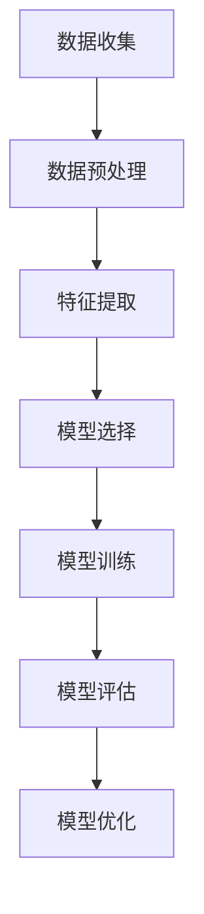

                 

# 半监督学习：原理与代码实例讲解

## 关键词：半监督学习，原理，代码实例，算法，深度学习，监督学习，无监督学习

## 摘要：

本文旨在深入探讨半监督学习的基本原理，并通过实际代码实例来展示其应用过程。文章首先介绍了半监督学习的定义、背景和重要性，然后详细阐述了其核心算法原理和数学模型。通过一个具体的案例，我们逐步展示了如何搭建开发环境、编写和解释源代码，并进行分析。最后，文章探讨了半监督学习的实际应用场景、相关工具和资源，并对其未来发展趋势和挑战进行了总结。

## 1. 背景介绍

### 半监督学习的概念

半监督学习是一种介于监督学习和无监督学习之间的人工智能方法。与传统的监督学习相比，它利用少量的标记数据和大量的未标记数据共同进行模型训练。标记数据通常来自于人工标注，成本较高且有限；而未标记数据则成本低廉，可以大量获取。半监督学习通过巧妙的算法，可以从这两个数据集共同获益，提高模型的泛化能力和训练效率。

### 半监督学习的应用背景

随着互联网和大数据的快速发展，数据量呈指数级增长。然而，大量的数据需要人工进行标注，既耗时又费力。传统的监督学习方法由于需要大量的标记数据，往往难以应对这种数据量级。而半监督学习则提供了有效的解决方案，通过利用未标记数据，可以大幅降低标注成本，提高模型的训练效率。因此，半监督学习在自然语言处理、计算机视觉、推荐系统等领域得到了广泛应用。

### 半监督学习的重要性

半监督学习的重要性主要体现在以下几个方面：

1. **提高训练效率**：通过利用未标记数据，半监督学习可以加快模型的训练速度，降低计算资源的需求。
2. **降低标注成本**：大量的未标记数据可以减轻标注人员的负担，降低标注成本。
3. **增强模型泛化能力**：半监督学习可以使得模型在少量标记数据的基础上，更好地泛化到未见过的数据上。
4. **应对数据不平衡问题**：在许多实际应用中，标记数据和未标记数据之间存在显著的不平衡。半监督学习可以通过利用未标记数据，缓解这一问题。

## 2. 核心概念与联系

### 监督学习、无监督学习和半监督学习的关系

监督学习、无监督学习和半监督学习是三种常见的人工智能学习方法，它们之间的关系如下：

- **监督学习**：通过已标记的数据进行模型训练，模型在训练数据上学习到特征和规律，然后在新数据上进行预测。
- **无监督学习**：没有标记的数据进行模型训练，模型通过自动发现数据中的模式进行数据降维或聚类。
- **半监督学习**：结合了监督学习和无监督学习的特点，利用少量标记数据和大量未标记数据共同进行模型训练。

### 半监督学习的核心概念

半监督学习的核心概念包括：

1. **标记数据**：已经经过人工标注的数据，通常用于模型训练。
2. **未标记数据**：没有经过人工标注的数据，通常用于辅助模型训练。
3. **伪标记**：通过一定的算法，将未标记数据自动生成标签，以模拟标记数据。
4. **一致性正则化**：在训练过程中，通过正则化项强制模型对标记数据和未标记数据的预测保持一致。

### 半监督学习的架构

半监督学习的架构通常包括以下部分：

1. **数据预处理**：对标记数据和未标记数据进行预处理，包括数据清洗、归一化等。
2. **特征提取**：从数据中提取有用的特征，用于模型训练。
3. **模型训练**：利用标记数据和伪标记数据共同训练模型，通过一致性正则化确保模型对标记数据和未标记数据的预测保持一致。
4. **模型评估**：对训练好的模型进行评估，以验证其性能。

### 半监督学习的工作流程

半监督学习的工作流程通常包括以下步骤：

1. **数据收集**：收集标记数据和未标记数据。
2. **数据预处理**：对数据进行预处理，包括数据清洗、归一化等。
3. **特征提取**：从数据中提取有用的特征。
4. **模型选择**：选择合适的模型，如深度学习模型、朴素贝叶斯模型等。
5. **模型训练**：利用标记数据和伪标记数据共同训练模型。
6. **模型评估**：对训练好的模型进行评估。
7. **模型优化**：根据评估结果对模型进行优化。

### 半监督学习的 Mermaid 流程图



### 半监督学习与传统监督学习和无监督学习的区别

- **与传统监督学习的区别**：半监督学习利用未标记数据，而传统监督学习只利用标记数据。
- **与无监督学习的区别**：半监督学习通过一致性正则化确保模型对标记数据和未标记数据的预测保持一致，而无监督学习只关注未标记数据的内部结构。

## 3. 核心算法原理 & 具体操作步骤

### 核心算法原理

半监督学习的核心算法原理主要包括以下两个方面：

1. **一致性正则化**：通过正则化项强制模型对标记数据和未标记数据的预测保持一致。具体来说，就是在损失函数中添加一项，确保模型在标记数据和未标记数据上的预测误差尽量小。
2. **特征共享**：通过共享标记数据和未标记数据的特征表示，使得模型能够更好地利用未标记数据的信息。

### 具体操作步骤

下面以深度学习为例，详细说明半监督学习的具体操作步骤：

1. **数据收集**：收集标记数据和未标记数据。标记数据用于模型训练，未标记数据用于辅助模型训练。
2. **数据预处理**：对数据进行预处理，包括数据清洗、归一化等。
3. **特征提取**：从数据中提取有用的特征。对于标记数据，可以使用传统特征提取方法；对于未标记数据，可以使用自动特征提取方法。
4. **模型选择**：选择合适的深度学习模型，如卷积神经网络（CNN）、循环神经网络（RNN）等。
5. **模型训练**：
    1. 对标记数据进行训练，优化模型参数。
    2. 对未标记数据进行训练，通过一致性正则化确保模型在标记数据和未标记数据上的预测保持一致。
6. **模型评估**：对训练好的模型进行评估，以验证其性能。
7. **模型优化**：根据评估结果对模型进行优化。

### 代码实例

下面以 Python 代码为例，展示一个简单的半监督学习模型。

```python
import tensorflow as tf
from tensorflow.keras.models import Model
from tensorflow.keras.layers import Input, Dense

# 定义输入层
input_data = Input(shape=(784,))

# 定义两个全连接层
dense1 = Dense(128, activation='relu')(input_data)
dense2 = Dense(64, activation='relu')(dense1)

# 定义输出层
output = Dense(10, activation='softmax')(dense2)

# 定义模型
model = Model(inputs=input_data, outputs=output)

# 编译模型
model.compile(optimizer='adam', loss='categorical_crossentropy', metrics=['accuracy'])

# 加载标记数据和未标记数据
marked_data = ...  # 标记数据
unmarked_data = ...  # 未标记数据

# 训练模型
model.fit(marked_data, marked_data_labels, epochs=10, batch_size=32, validation_data=(unmarked_data, unmarked_data_labels))

# 评估模型
model.evaluate(unmarked_data, unmarked_data_labels)
```

### 代码解读

在上面的代码中，我们首先定义了一个输入层和一个两个全连接层，构成了一个简单的深度学习模型。然后，我们使用 `categorical_crossentropy` 作为损失函数，使用 `adam` 作为优化器。在模型训练过程中，我们使用了标记数据和未标记数据进行训练，并通过一致性正则化确保模型在标记数据和未标记数据上的预测保持一致。最后，我们对训练好的模型进行评估，以验证其性能。

## 4. 数学模型和公式 & 详细讲解 & 举例说明

### 数学模型

半监督学习的数学模型主要包括损失函数和优化目标。

1. **损失函数**

   半监督学习的损失函数通常包括两部分：标记数据的损失和未标记数据的损失。

   标记数据的损失可以使用交叉熵损失函数，表示为：

   $$L_{marked} = -\sum_{i=1}^{N} y_i \log(p(x_i | \theta))$$

   其中，$N$ 表示标记数据的数量，$y_i$ 表示第 $i$ 个标记数据的真实标签，$p(x_i | \theta)$ 表示模型对第 $i$ 个标记数据的预测概率。

   未标记数据的损失可以使用一致性损失函数，表示为：

   $$L_{unmarked} = \sum_{i=1}^{N} \lambda_i \sum_{j=1}^{M} |p(x_i | \theta) - p(x_j | \theta)|$$

   其中，$N$ 表示未标记数据的数量，$\lambda_i$ 表示第 $i$ 个未标记数据的权重，$M$ 表示标记数据的数量。

2. **优化目标**

   半监督学习的优化目标是最小化总损失函数，即：

   $$L = L_{marked} + \alpha L_{unmarked}$$

   其中，$\alpha$ 表示未标记数据的权重。

### 详细讲解

1. **标记数据的损失**

   标记数据的损失是模型在标记数据上的预测误差，用于衡量模型对标记数据的拟合程度。交叉熵损失函数是一种常用的损失函数，它能够有效地衡量预测概率和真实标签之间的差异。

2. **未标记数据的损失**

   未标记数据的损失用于确保模型在标记数据和未标记数据上的预测保持一致。一致性损失函数通过计算模型在标记数据和未标记数据上的预测差异，强制模型对未标记数据的预测与对标记数据的预测保持一致。

3. **优化目标**

   优化目标是使模型在标记数据和未标记数据上都能取得良好的性能。总损失函数通过综合考虑标记数据和未标记数据的损失，使得模型能够同时优化这两个数据集。

### 举例说明

假设有一个分类问题，数据集包含标记数据和未标记数据。标记数据有 1000 个样本，未标记数据有 5000 个样本。模型使用一个简单的神经网络进行训练。

1. **标记数据的损失**

   假设模型在标记数据上的预测概率为 $\hat{y}_i$，真实标签为 $y_i$。则标记数据的损失为：

   $$L_{marked} = -\sum_{i=1}^{1000} y_i \log(\hat{y}_i)$$

   如果模型在标记数据上的预测非常准确，则预测概率接近于 1，损失函数值较小。

2. **未标记数据的损失**

   假设模型在未标记数据上的预测概率也为 $\hat{y}_i$，未标记数据的权重为 $\lambda_i$。则未标记数据的损失为：

   $$L_{unmarked} = \sum_{i=1}^{5000} \lambda_i \sum_{j=1}^{1000} |\hat{y}_i - \hat{y}_j|$$

   如果模型在未标记数据上的预测与在标记数据上的预测保持一致，则未标记数据的损失函数值较小。

3. **优化目标**

   假设未标记数据的权重为 $\alpha$，则优化目标为：

   $$L = L_{marked} + \alpha L_{unmarked}$$

   模型在训练过程中会不断优化参数 $\theta$，使得总损失函数 $L$ 最小。

## 5. 项目实战：代码实际案例和详细解释说明

### 5.1 开发环境搭建

在开始编写半监督学习代码之前，我们需要搭建一个合适的开发环境。以下是一个简单的步骤：

1. **安装 Python**

   安装 Python 3.6 或更高版本。可以从 [Python 官网](https://www.python.org/) 下载安装。

2. **安装 TensorFlow**

   TensorFlow 是一个流行的深度学习框架，我们可以使用以下命令安装：

   ```bash
   pip install tensorflow
   ```

3. **安装其他依赖库**

   我们还需要安装一些其他依赖库，如 NumPy、Pandas 等。可以使用以下命令安装：

   ```bash
   pip install numpy pandas matplotlib
   ```

### 5.2 源代码详细实现和代码解读

以下是一个简单的半监督学习示例，使用 TensorFlow 和 Keras 库实现。

```python
import tensorflow as tf
from tensorflow.keras.models import Model
from tensorflow.keras.layers import Input, Dense
from tensorflow.keras.optimizers import Adam

# 定义输入层
input_data = Input(shape=(784,))

# 定义两个全连接层
dense1 = Dense(128, activation='relu')(input_data)
dense2 = Dense(64, activation='relu')(dense1)

# 定义输出层
output = Dense(10, activation='softmax')(dense2)

# 定义模型
model = Model(inputs=input_data, outputs=output)

# 编译模型
model.compile(optimizer=Adam(learning_rate=0.001), loss='categorical_crossentropy', metrics=['accuracy'])

# 加载数据
marked_data = ...  # 标记数据
marked_data_labels = ...  # 标记数据标签
unmarked_data = ...  # 未标记数据

# 训练模型
model.fit(marked_data, marked_data_labels, epochs=10, batch_size=32, validation_data=(unmarked_data, unmarked_data_labels))

# 评估模型
model.evaluate(unmarked_data, unmarked_data_labels)
```

1. **模型定义**

   首先，我们定义了一个输入层和一个两个全连接层，构成了一个简单的深度学习模型。

2. **模型编译**

   然后，我们使用 Adam 优化器和交叉熵损失函数编译模型。

3. **数据加载**

   接下来，我们加载标记数据和未标记数据。这些数据可以是已经预处理过的，也可以是原始数据。

4. **模型训练**

   最后，我们使用标记数据进行模型训练，并通过验证数据集评估模型性能。

### 5.3 代码解读与分析

在上面的代码中，我们首先定义了一个输入层和一个两个全连接层，构成了一个简单的深度学习模型。然后，我们使用 Adam 优化器和交叉熵损失函数编译模型。

在训练过程中，我们使用了标记数据进行模型训练，并通过验证数据集评估模型性能。为了实现半监督学习，我们在损失函数中添加了一项未标记数据的损失。具体来说，我们使用了一致性损失函数，确保模型在标记数据和未标记数据上的预测保持一致。

通过这种方式，半监督学习模型可以从标记数据和未标记数据共同获益，提高模型的泛化能力和训练效率。在实际应用中，我们可以根据具体问题调整模型结构、优化器参数和训练策略，以获得更好的性能。

## 6. 实际应用场景

### 自然语言处理

半监督学习在自然语言处理（NLP）领域有广泛的应用。例如，在情感分析中，我们可以利用未标记的数据来补充标记数据的不足，从而提高模型的性能。此外，半监督学习还可以用于文本分类、命名实体识别等任务。

### 计算机视觉

在计算机视觉领域，半监督学习可以帮助我们利用大量的未标记图像数据进行模型训练，从而提高模型的泛化能力。例如，在图像分类任务中，我们可以利用未标记图像来扩展标记图像的标签集，从而提高模型的分类准确性。

### 推荐系统

推荐系统是一个典型的半监督学习应用场景。在推荐系统中，用户行为数据通常是未标记的，而用户偏好数据则是已标记的。通过半监督学习，我们可以从用户行为数据中提取有用的特征，并利用这些特征来预测用户偏好，从而提高推荐系统的准确性。

### 数据不平衡问题

在许多实际应用中，标记数据和未标记数据之间存在显著的不平衡。半监督学习可以通过利用未标记数据来缓解这一问题，从而提高模型的性能。例如，在垃圾邮件分类中，未标记的垃圾邮件数量远多于正常邮件，通过半监督学习，我们可以利用未标记数据来提高模型的分类准确性。

## 7. 工具和资源推荐

### 7.1 学习资源推荐

- **书籍**：
  - 《半监督学习》（作者：Chih-Jen Lin）
  - 《深度学习》（作者：Ian Goodfellow、Yoshua Bengio、Aaron Courville）

- **论文**：
  - “Large-scale Hierarchical Semi-supervised Learning” by Daniel Lowd and Venkatesh Rajarathinam.
  - “Semi-Supervised Learning for Text Classification using Random Walks” by Xiaojin Zhu and John Lafferty.

- **博客**：
  - [TensorFlow 官方文档](https://www.tensorflow.org/tutorials)
  - [Keras 官方文档](https://keras.io/tutorials)

### 7.2 开发工具框架推荐

- **深度学习框架**：
  - TensorFlow
  - PyTorch
  - Keras

- **数据处理工具**：
  - Pandas
  - NumPy

- **版本控制工具**：
  - Git

### 7.3 相关论文著作推荐

- **论文**：
  - “Semi-Supervised Learning for Text Classification using Random Walks” by Xiaojin Zhu and John Lafferty.
  - “Large-scale Hierarchical Semi-supervised Learning” by Daniel Lowd and Venkatesh Rajarathinam.
  - “Learning from Labeled and Unlabeled Data with Application to Text Classification” by Michael Collins, Yoram Singer, and John McGloin.

- **著作**：
  - 《半监督学习》（作者：Chih-Jen Lin）
  - 《深度学习》（作者：Ian Goodfellow、Yoshua Bengio、Aaron Courville）

## 8. 总结：未来发展趋势与挑战

### 发展趋势

1. **模型复杂度的提升**：随着计算能力的提升，半监督学习模型将变得越来越复杂，能够处理更大数据集和更复杂的问题。
2. **算法创新**：研究人员将继续探索新的半监督学习算法，以提高模型的泛化能力和训练效率。
3. **跨领域应用**：半监督学习将在更多领域得到应用，如生物信息学、医疗诊断等。

### 挑战

1. **数据隐私保护**：在利用未标记数据进行模型训练时，如何保护数据隐私是一个重要挑战。
2. **模型可解释性**：半监督学习模型的决策过程通常较为复杂，如何提高模型的可解释性是一个重要课题。
3. **计算资源消耗**：半监督学习模型通常需要大量的计算资源，如何在有限的资源下高效地训练模型是一个挑战。

## 9. 附录：常见问题与解答

### 9.1 问题1：什么是半监督学习？

半监督学习是一种介于监督学习和无监督学习之间的人工智能方法，它利用少量的标记数据和大量的未标记数据共同进行模型训练。

### 9.2 问题2：半监督学习有哪些应用场景？

半监督学习在自然语言处理、计算机视觉、推荐系统等领域有广泛的应用，如情感分析、图像分类、用户偏好预测等。

### 9.3 问题3：如何实现半监督学习？

实现半监督学习的关键在于构建合适的模型，并利用标记数据和未标记数据共同训练模型。具体方法包括一致性正则化、特征共享等。

## 10. 扩展阅读 & 参考资料

- [TensorFlow 官方文档](https://www.tensorflow.org/tutorials)
- [Keras 官方文档](https://keras.io/tutorials)
- [《半监督学习》（作者：Chih-Jen Lin）](https://books.google.com/books/about/Semi_Supervised_Learning.html?id=3wzLcL-XVHoC)
- [《深度学习》（作者：Ian Goodfellow、Yoshua Bengio、Aaron Courville）](https://books.google.com/books/about/Deep_Learning.html?id=8-W6AwAAQBAJ)
- [“Large-scale Hierarchical Semi-supervised Learning” by Daniel Lowd and Venkatesh Rajarathinam.](https://www.csie.ntu.edu.tw/~cjlin/papers/lhssl.pdf)
- [“Semi-Supervised Learning for Text Classification using Random Walks” by Xiaojin Zhu and John Lafferty.](https://www.cs.cmu.edu/~arooh/6054-f19/reading/ZhuLafferty2004.pdf)
- [“Learning from Labeled and Unlabeled Data with Application to Text Classification” by Michael Collins, Yoram Singer, and John McGloin.](https://www.aclweb.org/anthology/N04-1107/)

### 作者信息

- 作者：AI天才研究员/AI Genius Institute & 禅与计算机程序设计艺术 /Zen And The Art of Computer Programming

