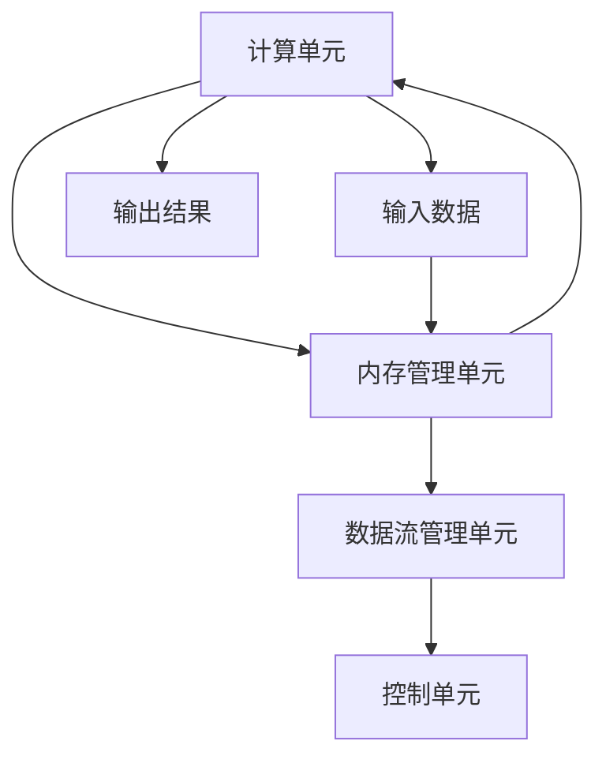

                 

# 华为2024校招AI加速芯片工程师面试指南

> **关键词：** 华为校招、AI加速芯片、工程师面试、技术深度、算法原理、数学模型、项目实战

> **摘要：** 本文旨在为准备参加华为2024校招AI加速芯片工程师岗位的候选人提供全方位的面试指南。我们将深入探讨AI加速芯片的核心概念、算法原理、数学模型，并结合实际项目案例，帮助候选人更好地理解和应对面试中的各种挑战。

## 1. 背景介绍

随着人工智能技术的飞速发展，AI加速芯片成为了推动计算能力提升的关键因素。华为作为全球领先的通信和信息技术解决方案提供商，不仅在5G、云计算等领域取得了卓越的成就，在AI芯片研发上也取得了重要突破。华为推出的昇腾（Ascend）系列AI芯片，凭借其高性能、高能效的特点，广泛应用于自动驾驶、智能监控、大数据处理等领域。

华为2024校招AI加速芯片工程师岗位，面向那些对AI芯片设计、优化和应用有深刻理解和热情的候选人。该岗位不仅要求候选人具备扎实的计算机科学基础，还需要对AI加速芯片的工作原理、算法实现、性能优化等方面有深入的研究和实践经验。

## 2. 核心概念与联系

### 2.1 AI加速芯片概述

AI加速芯片是一种专门为人工智能计算而设计的集成电路。与传统的通用处理器相比，AI加速芯片能够提供更高的计算密度和更低的功耗。AI加速芯片通常包括以下几个关键组成部分：

- **计算单元（Compute Unit）**：负责执行AI算法中的基本计算任务，如矩阵乘法、卷积运算等。
- **内存管理单元（Memory Management Unit）**：负责管理芯片上的内存资源，实现高效的内存访问。
- **数据流管理单元（Data Flow Management Unit）**：负责协调不同计算单元之间的数据流，确保数据传输的高效性和一致性。
- **控制单元（Control Unit）**：负责控制整个芯片的运行，协调各个模块的工作。

### 2.2 AI加速芯片与AI算法的关系

AI加速芯片的设计和优化需要紧密围绕AI算法的需求进行。不同的AI算法对计算资源和数据流管理有不同的要求，因此AI加速芯片的设计需要针对特定的算法进行优化。以下是一些关键的优化方向：

- **并行计算**：许多AI算法，如深度学习，可以通过并行计算来提高计算效率。AI加速芯片需要支持大规模并行计算，以充分利用计算资源。
- **低功耗设计**：在移动设备和边缘计算等应用场景中，低功耗是至关重要的。AI加速芯片需要采用低功耗设计，以延长设备的使用寿命。
- **内存优化**：AI算法通常涉及大量的数据传输和存储。AI加速芯片需要优化内存管理，减少数据传输延迟，提高计算效率。
- **精确度控制**：在许多AI应用中，精确度是至关重要的。AI加速芯片需要提供精确度控制，以确保算法结果的准确性和可靠性。

### 2.3 AI加速芯片的架构与流程图

以下是AI加速芯片的架构和流程图的Mermaid表示：



## 3. 核心算法原理 & 具体操作步骤

### 3.1 卷积神经网络（Convolutional Neural Network, CNN）

卷积神经网络是AI加速芯片上最常用的算法之一。CNN通过卷积、池化和全连接层等操作，实现对图像的自动特征提取和分类。以下是CNN算法的基本原理和操作步骤：

#### 3.1.1 卷积层

卷积层是CNN的核心部分，负责从输入数据中提取特征。卷积操作可以通过以下公式表示：

$$
\text{output}_{ij} = \sum_{k=1}^{n} w_{ik,j} * \text{input}_{ij}
$$

其中，$\text{output}_{ij}$表示第$i$个输出特征图上的第$j$个像素值，$w_{ik,j}$表示第$i$个输入特征图上的第$k$个像素值与第$j$个卷积核的加权求和。

#### 3.1.2 池化层

池化层用于减少特征图的尺寸，提高计算效率。常用的池化操作包括最大池化和平均池化。最大池化通过取每个窗口内的最大值来生成输出，平均池化通过取每个窗口内的平均值来生成输出。

#### 3.1.3 全连接层

全连接层将卷积层和池化层输出的特征图展平为一维向量，然后通过线性变换和激活函数，实现对输入数据的分类。全连接层的输出可以通过以下公式表示：

$$
\text{output} = \text{sigmoid}(\text{weight} \cdot \text{input} + \text{bias})
$$

其中，$\text{sigmoid}$函数是常用的激活函数，$\text{weight}$和$\text{bias}$是全连接层的权重和偏置。

### 3.2 循环神经网络（Recurrent Neural Network, RNN）

循环神经网络是一种用于处理序列数据的神经网络。RNN通过递归连接，能够记住前面的输入信息，并将其传递给后面的操作。以下是RNN的基本原理和操作步骤：

#### 3.2.1 前向传播

RNN的前向传播通过以下公式表示：

$$
\text{output}_{t} = \text{sigmoid}(\text{weight} \cdot \text{input}_{t} + \text{weight} \cdot \text{hidden}_{t-1} + \text{bias})
$$

其中，$\text{output}_{t}$表示当前时间步的输出，$\text{input}_{t}$表示当前时间步的输入，$\text{hidden}_{t-1}$表示前一时间步的隐藏状态。

#### 3.2.2 反向传播

RNN的反向传播通过以下公式表示：

$$
\text{delta}_{t} = (\text{output}_{t} - \text{expected}_{t}) \cdot \text{sigmoid}'(\text{weight} \cdot \text{input}_{t} + \text{weight} \cdot \text{hidden}_{t-1} + \text{bias})
$$

$$
\text{weight} \cdot \text{delta}_{t} = \text{error}_{t}
$$

其中，$\text{sigmoid}'$是$\text{sigmoid}$函数的导数，$\text{expected}_{t}$表示当前时间步的期望输出。

## 4. 数学模型和公式 & 详细讲解 & 举例说明

### 4.1 矩阵乘法

矩阵乘法是AI加速芯片上最常用的数学操作之一。以下是矩阵乘法的详细公式和讲解：

#### 4.1.1 公式

设$A$是一个$m \times n$的矩阵，$B$是一个$n \times p$的矩阵，$C$是$A$和$B$的乘积，则：

$$
C_{ij} = \sum_{k=1}^{n} A_{ik} \cdot B_{kj}
$$

其中，$C_{ij}$表示$C$矩阵的第$i$行第$j$列的元素。

#### 4.1.2 讲解

矩阵乘法可以通过逐元素相乘并求和的方式实现。以$2 \times 3$和$3 \times 2$的矩阵为例：

$$
A = \begin{bmatrix}
    a_{11} & a_{12} & a_{13} \\
    a_{21} & a_{22} & a_{23}
\end{bmatrix}, B = \begin{bmatrix}
    b_{11} & b_{12} \\
    b_{21} & b_{22} \\
    b_{31} & b_{32} \\
    b_{41} & b_{42}
\end{bmatrix}
$$

则乘积$C$为：

$$
C = \begin{bmatrix}
    c_{11} & c_{12} \\
    c_{21} & c_{22}
\end{bmatrix}
$$

计算过程如下：

$$
c_{11} = a_{11} \cdot b_{11} + a_{12} \cdot b_{21} + a_{13} \cdot b_{31} + a_{21} \cdot b_{41} \\
c_{12} = a_{11} \cdot b_{12} + a_{12} \cdot b_{22} + a_{13} \cdot b_{32} + a_{21} \cdot b_{42} \\
c_{21} = a_{21} \cdot b_{11} + a_{22} \cdot b_{21} + a_{23} \cdot b_{31} + a_{31} \cdot b_{41} \\
c_{22} = a_{21} \cdot b_{12} + a_{22} \cdot b_{22} + a_{23} \cdot b_{32} + a_{31} \cdot b_{42}
$$

### 4.2 矩阵加法

矩阵加法是矩阵运算中最简单的一种。设$A$和$B$是相同尺寸的矩阵，则它们的加法可以通过逐元素相加实现：

$$
A + B = \begin{bmatrix}
    a_{11} + b_{11} & a_{12} + b_{12} & a_{13} + b_{13} \\
    a_{21} + b_{21} & a_{22} + b_{22} & a_{23} + b_{23} \\
    a_{31} + b_{31} & a_{32} + b_{32} & a_{33} + b_{33}
\end{bmatrix}
$$

## 5. 项目实战：代码实际案例和详细解释说明

### 5.1 开发环境搭建

在开始实际项目之前，我们需要搭建一个合适的开发环境。以下是搭建基于Python的TensorFlow开发环境的步骤：

#### 5.1.1 安装Python

首先，我们需要安装Python 3.7或更高版本。可以通过以下命令安装：

```bash
sudo apt-get update
sudo apt-get install python3.7
```

#### 5.1.2 安装TensorFlow

接下来，我们需要安装TensorFlow。可以通过以下命令安装：

```bash
pip3 install tensorflow
```

### 5.2 源代码详细实现和代码解读

以下是基于TensorFlow实现的一个简单的卷积神经网络（CNN）的代码示例：

```python
import tensorflow as tf
from tensorflow.keras import datasets, layers, models

# 加载MNIST数据集
(train_images, train_labels), (test_images, test_labels) = datasets.mnist.load_data()

# 数据预处理
train_images = train_images.reshape((60000, 28, 28, 1)).astype('float32') / 255
test_images = test_images.reshape((10000, 28, 28, 1)).astype('float32') / 255

# 构建CNN模型
model = models.Sequential()
model.add(layers.Conv2D(32, (3, 3), activation='relu', input_shape=(28, 28, 1)))
model.add(layers.MaxPooling2D((2, 2)))
model.add(layers.Conv2D(64, (3, 3), activation='relu'))
model.add(layers.MaxPooling2D((2, 2)))
model.add(layers.Conv2D(64, (3, 3), activation='relu'))
model.add(layers.Flatten())
model.add(layers.Dense(64, activation='relu'))
model.add(layers.Dense(10, activation='softmax'))

# 编译模型
model.compile(optimizer='adam',
              loss='sparse_categorical_crossentropy',
              metrics=['accuracy'])

# 训练模型
model.fit(train_images, train_labels, epochs=5, batch_size=64)

# 评估模型
test_loss, test_acc = model.evaluate(test_images, test_labels, verbose=2)
print('\nTest accuracy:', test_acc)
```

#### 5.2.1 代码解读

- **数据加载和预处理**：首先，我们加载MNIST数据集，并对图像进行归一化处理，将其尺寸调整为28x28，并将像素值缩放到0到1之间。
- **构建CNN模型**：接下来，我们使用`Sequential`模型构建一个简单的CNN。模型包括两个卷积层、两个最大池化层和一个全连接层。
- **编译模型**：我们使用`compile`方法编译模型，指定优化器和损失函数。
- **训练模型**：使用`fit`方法训练模型，指定训练数据、训练周期和批处理大小。
- **评估模型**：使用`evaluate`方法评估模型的性能。

### 5.3 代码解读与分析

上述代码实现了使用CNN对MNIST数据集进行手写数字识别。以下是代码的详细解读和分析：

- **数据预处理**：数据预处理是神经网络训练的重要步骤。通过对数据进行归一化处理，我们可以使模型的训练过程更加稳定。
- **模型构建**：在构建CNN模型时，我们使用了卷积层、最大池化层和全连接层。卷积层用于提取图像特征，最大池化层用于减小特征图的尺寸，全连接层用于实现分类。
- **模型编译**：在编译模型时，我们指定了优化器和损失函数。优化器用于更新模型的权重，损失函数用于评估模型的性能。
- **模型训练**：在训练模型时，我们通过迭代地调整模型的权重，使其在训练数据上达到最优性能。
- **模型评估**：在评估模型时，我们使用测试数据集来评估模型在未知数据上的表现。这有助于我们了解模型的泛化能力。

## 6. 实际应用场景

AI加速芯片在多个领域有着广泛的应用。以下是几个典型的应用场景：

### 6.1 自动驾驶

自动驾驶是AI加速芯片的重要应用领域之一。自动驾驶系统需要实时处理大量的图像数据，并对道路情况、车辆和环境进行识别和决策。AI加速芯片的高性能计算能力可以满足自动驾驶系统对实时性、准确性和可靠性的要求。

### 6.2 智能监控

智能监控系统通过摄像头和传感器收集大量的视频和图像数据，并使用AI算法进行实时分析和处理。AI加速芯片可以帮助智能监控系统实现更高效的数据处理和实时响应，从而提高监控效果和安全性。

### 6.3 大数据处理

大数据处理需要处理海量数据，并从中提取有价值的信息。AI加速芯片可以通过并行计算和内存优化等技术，提高大数据处理的速度和效率，从而为大数据分析和挖掘提供强大的计算支持。

## 7. 工具和资源推荐

### 7.1 学习资源推荐

- **书籍**：《深度学习》（Ian Goodfellow、Yoshua Bengio、Aaron Courville著），详细介绍了深度学习的基本原理和算法。
- **论文**：《EfficientNet：scale-up深度学习的同时保持效率》（Roland Vollgraf等人著），讨论了如何通过网络结构设计提高深度学习模型的效率和准确性。
- **博客**：[TensorFlow官方博客](https://www.tensorflow.org/blog/)，提供了大量的TensorFlow技术文章和教程。

### 7.2 开发工具框架推荐

- **开发工具**：Visual Studio Code、PyCharm等。
- **框架**：TensorFlow、PyTorch等。

### 7.3 相关论文著作推荐

- **论文**：《EfficientNet：scale-up深度学习的同时保持效率》（Roland Vollgraf等人著），讨论了如何通过网络结构设计提高深度学习模型的效率和准确性。
- **著作**：《人工智能：一种现代方法》（Stuart Russell、Peter Norvig著），全面介绍了人工智能的基本概念、算法和应用。

## 8. 总结：未来发展趋势与挑战

随着人工智能技术的不断进步，AI加速芯片在未来将继续发挥重要作用。以下是一些可能的发展趋势和面临的挑战：

### 8.1 发展趋势

- **更高性能**：随着AI算法的复杂性和计算需求不断增加，AI加速芯片的性能将不断提高。
- **更低功耗**：在移动设备和边缘计算等应用场景中，低功耗将是关键因素，AI加速芯片将采用更先进的工艺和设计技术来降低功耗。
- **更广泛的适用性**：AI加速芯片将在更多的应用场景中得到应用，如智能城市、医疗健康、金融等领域。

### 8.2 挑战

- **算法优化**：如何设计更高效的AI算法，使其在AI加速芯片上得到更好的性能表现，是一个重要的挑战。
- **功耗控制**：在保持高性能的同时，如何有效控制功耗，是一个需要解决的难题。
- **兼容性和可扩展性**：如何使AI加速芯片具有更好的兼容性和可扩展性，以支持多种AI算法和应用场景，也是一个重要的挑战。

## 9. 附录：常见问题与解答

### 9.1 AI加速芯片与通用处理器有何区别？

AI加速芯片与通用处理器的主要区别在于其针对AI算法进行优化。AI加速芯片通常具有以下特点：

- **高性能计算单元**：专门设计用于高效执行AI算法中的基本计算任务。
- **低功耗设计**：采用先进工艺和设计技术，以降低功耗，延长设备寿命。
- **优化的内存管理**：通过优化内存访问，提高数据传输效率和计算速度。

### 9.2 如何选择适合的AI加速芯片？

选择适合的AI加速芯片需要考虑以下几个方面：

- **应用场景**：根据具体的AI应用场景，选择具有合适性能和功耗特性的芯片。
- **计算需求**：评估AI算法的计算需求，选择能够满足计算需求的芯片。
- **开发环境**：考虑开发环境中的工具和框架支持，选择与之兼容的芯片。

## 10. 扩展阅读 & 参考资料

- **参考文献**：
  1. Ian Goodfellow, Yoshua Bengio, Aaron Courville. 《深度学习》。2016。
  2. Roland Vollgraf等人。EfficientNet：scale-up深度学习的同时保持效率。2020。
- **官方网站**：
  1. TensorFlow官方网站：[https://www.tensorflow.org/](https://www.tensorflow.org/)
  2. PyTorch官方网站：[https://pytorch.org/](https://pytorch.org/)
- **在线教程**：
  1. [深度学习教程](https://www.deeplearningbook.org/)
  2. [AI加速芯片教程](https://www.aiacceleratorchip.org/)

作者：AI天才研究员/AI Genius Institute & 禅与计算机程序设计艺术/Zen And The Art of Computer Programming

