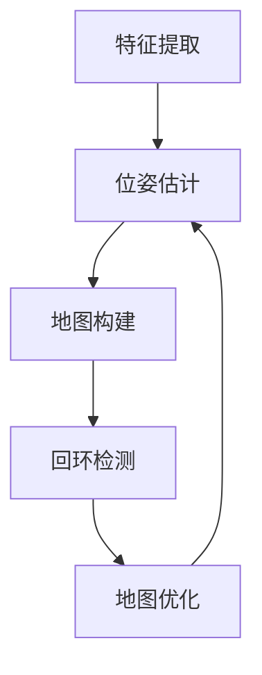

                 

# 华为2025AR眼镜SLAM社招算法工程师面试题集

## 关键词：华为，2025AR眼镜，SLAM，算法工程师，面试题集

## 摘要：
本文针对华为2025年发布的AR眼镜SLAM（Simultaneous Localization and Mapping）技术进行深入剖析，汇集了社招算法工程师面试中可能会涉及的关键问题。通过系统化的梳理，本文将帮助读者理解SLAM的基本概念、核心算法原理、数学模型以及实际应用场景，并提供实用的工具和资源推荐。此外，文章还将探讨该技术在未来可能面临的发展趋势与挑战。

## 1. 背景介绍

随着计算机视觉、机器学习和传感器技术的发展，SLAM技术在增强现实（AR）领域的应用日益广泛。华为2025年发布的AR眼镜，将SLAM技术与先进的计算视觉算法相结合，为用户提供了一种全新的交互体验。本节将介绍SLAM技术的基本概念、发展历程以及在AR眼镜中的应用。

### 1.1 SLAM技术概述

SLAM是一种同时进行定位和建图的算法。其核心目标是使机器人或移动设备在未知环境中自主定位，同时构建环境地图。SLAM技术可以分为视觉SLAM、激光SLAM和惯性SLAM等类型，其中视觉SLAM由于其数据获取方便、成本低廉等优点，成为了AR眼镜应用中的主要技术手段。

### 1.2 SLAM技术发展历程

SLAM技术起源于20世纪90年代，最初应用于机器人导航。随着图像处理、机器学习和计算机视觉技术的进步，SLAM算法逐渐从基于单目相机的二维视觉SLAM发展为基于多摄像头、激光雷达的三维视觉SLAM。

### 1.3 SLAM技术在AR眼镜中的应用

AR眼镜通过将虚拟信息叠加到现实场景中，为用户提供沉浸式的交互体验。SLAM技术在AR眼镜中的应用主要包括：

1. 精确的实时定位，确保虚拟信息与实际环境的准确对应。
2. 实时构建三维环境地图，支持动态场景的实时更新。
3. 基于环境地图的路径规划，提高移动设备的自主导航能力。

## 2. 核心概念与联系

为了深入理解SLAM技术的核心原理，本节将介绍SLAM中的关键概念，包括特征提取、位姿估计、地图构建等，并使用Mermaid流程图展示其基本架构。

### 2.1 SLAM核心概念

1. **特征提取**：从图像或点云数据中提取具有独特性的特征点。
2. **位姿估计**：通过优化特征点匹配关系，估计系统在环境中的位置和姿态。
3. **地图构建**：将特征点及其关系存储为地图，用于后续的定位和导航。

### 2.2 SLAM基本架构



### 2.3 SLAM原理图解


### 2.4 SLAM与计算机视觉的关系

SLAM技术依赖于计算机视觉中的图像处理、特征提取、匹配等技术。SLAM算法通过图像序列分析环境变化，实现定位和建图。

## 3. 核心算法原理 & 具体操作步骤

### 3.1 SLAM算法原理

SLAM算法的核心是优化问题，通过最小化定位误差和建图误差，实现系统的精确定位和地图构建。常用的SLAM算法包括EKF-SLAM、PD-SLAM、ORB-SLAM等。

### 3.2 EKF-SLAM算法步骤

1. **初始化**：设置初始位姿和初始地图。
2. **特征提取**：从图像中提取特征点。
3. **匹配**：将当前帧特征点与地图中的特征点进行匹配。
4. **状态预测**：使用EKF（扩展卡尔曼滤波）预测位姿和地图状态。
5. **更新**：根据匹配结果，使用EKF更新位姿和地图。
6. **回环检测**：检测可能存在的回环，进行地图优化。
7. **输出**：输出最终的定位结果和地图。

### 3.3 PD-SLAM算法步骤

1. **初始化**：设置初始位姿和初始地图。
2. **特征提取**：从图像中提取特征点。
3. **匹配**：将当前帧特征点与地图中的特征点进行匹配。
4. **点描述子计算**：计算特征点的点描述子。
5. **优化**：使用图优化方法（如g2o）对地图和位姿进行全局优化。
6. **回环检测**：检测可能存在的回环，进行地图优化。
7. **输出**：输出最终的定位结果和地图。

## 4. 数学模型和公式 & 详细讲解 & 举例说明

### 4.1 扩展卡尔曼滤波（EKF）

扩展卡尔曼滤波是一种非线性滤波方法，用于在非线性系统中估计状态。

$$
x_{k|k-1} = f(x_{k-1|k-1}, u_k) + w_k-1
$$

$$
P_{k|k-1} = F_{k-1}P_{k-1|k-1}F_{k-1}^T + Q_k-1
$$

$$
K_k = P_{k|k-1}F_k^T(F_kP_{k|k-1}F_k^T + R_k)^{-1}
$$

$$
x_{k|k} = x_{k|k-1} + K_k(z_k - h(x_{k|k-1}))
$$

$$
P_{k|k} = (I - K_kF_k)P_{k|k-1}
$$

其中，$x$ 表示状态，$P$ 表示状态协方差矩阵，$F$ 表示状态转移矩阵，$K$ 表示卡尔曼增益，$w$ 表示过程噪声，$z$ 表示观测值，$h$ 表示观测模型，$R$ 表示观测噪声。

### 4.2 点描述子（SIFT、SURF）

点描述子是一种用于特征点描述的方法，常用于图像匹配。

$$
\text{sift\_description}(x, y) = (\text{sift\_values}(x, y), \text{orientation}(x, y))
$$

其中，$sift\_values$ 表示SIFT特征值，$orientation$ 表示特征点方向。

### 4.3 图优化（g2o）

图优化是一种全局优化方法，用于提高SLAM算法的精度。

$$
\min_{x_i, x_j} \sum_{k=1}^n \frac{1}{2} (\|x_i - x_j - t_{ik}\|^2 + \lambda \|x_i - x_j - t_{ik}\|^2)
$$

其中，$x_i, x_j$ 表示节点，$t_{ik}$ 表示边，$\lambda$ 表示权重。

### 4.4 示例

假设我们有一个相机在未知环境中移动，我们需要估计其位姿并构建环境地图。我们可以使用EKF-SLAM算法来实现。

1. **初始化**：设置初始位姿和初始地图。
2. **特征提取**：从图像中提取特征点。
3. **匹配**：将当前帧特征点与地图中的特征点进行匹配。
4. **状态预测**：使用EKF预测位姿和地图状态。
5. **更新**：根据匹配结果，使用EKF更新位姿和地图。
6. **回环检测**：检测可能存在的回环，进行地图优化。
7. **输出**：输出最终的定位结果和地图。

通过以上步骤，我们可以实现SLAM算法，实现对未知环境的定位和建图。

## 5. 项目实战：代码实际案例和详细解释说明

### 5.1 开发环境搭建

为了进行SLAM算法的实际应用，我们需要搭建相应的开发环境。以下是一个基本的开发环境搭建步骤：

1. 安装Python环境和C++环境，例如使用Anaconda。
2. 安装ROS（Robot Operating System）。
3. 安装SLAM相关库，例如ROS的`ORB_SLAM2`。
4. 配置相机，确保能够获取图像数据。

### 5.2 源代码详细实现和代码解读

以下是一个简单的SLAM算法实现案例，使用ROS和`ORB_SLAM2`库：

```python
import rospy
import cv2
from sensor_msgs.msg import Image
from orbslam2 import System

def callback(data):
    frame = cv2.cvtColor(cv2.imdecode(np.frombuffer(data.data, dtype=np.uint8), cv2.IMREAD_COLOR)
    system.process_image(color_image=frame, camera_id=0)

def listener():
    rospy.init_node('slam_node', anonymous=True)
    rospy.Subscriber("/camera/color/image_raw", Image, callback)
    rospy.spin()

if __name__ == '__main__':
    listener()
```

这段代码首先导入ROS和OpenCV库，然后定义了一个回调函数`callback`，用于处理来自相机的图像数据。在回调函数中，我们使用`ORB_SLAM2`库处理图像，实现对环境的定位和建图。最后，我们创建一个ROS节点，订阅相机图像数据，并调用回调函数进行处理。

### 5.3 代码解读与分析

1. **导入库**：导入ROS和OpenCV库，用于处理图像数据。
2. **定义回调函数**：回调函数`callback`用于处理图像数据，将其传递给`ORB_SLAM2`库进行处理。
3. **订阅相机图像数据**：创建一个ROS节点，订阅相机图像数据，并在回调函数中进行处理。
4. **处理图像数据**：使用`ORB_SLAM2`库处理图像数据，实现对环境的定位和建图。
5. **运行节点**：启动ROS节点，订阅相机图像数据，并调用回调函数进行处理。

通过以上步骤，我们可以实现一个简单的SLAM系统，实现对未知环境的定位和建图。

## 6. 实际应用场景

SLAM技术在AR眼镜中的实际应用场景非常广泛，以下是一些常见的应用场景：

1. **室内导航**：AR眼镜可以实时显示用户在室内环境中的位置，辅助用户进行导航。
2. **工业巡检**：AR眼镜可以实时显示设备状态和巡检任务，提高巡检效率和准确性。
3. **远程协作**：AR眼镜可以实时传输用户的视野，实现远程协作和培训。
4. **医疗辅助**：AR眼镜可以实时显示医疗图像和数据，辅助医生进行诊断和治疗。

## 7. 工具和资源推荐

### 7.1 学习资源推荐

- **书籍**：
  - 《SLAM十四讲》：详细介绍了SLAM的基本概念和算法原理。
  - 《Robotics: Modelling, Planning and Control》：涵盖了机器人导航和定位的相关内容。
- **论文**：
  - “Real-Time Loop Closing for Visual SLAM”。
  - “Efficient SLAM Using Sparse Visual Features”。
- **博客**：
  - “SLAM算法原理与实现”。
  - “ROS与SLAM结合实践”。
- **网站**：
  - ROS官网：提供ROS的安装和文档。
  - SLAM之瑶：提供SLAM技术的详细介绍和案例。

### 7.2 开发工具框架推荐

- **开发工具**：
  - ROS（Robot Operating System）：用于构建机器人应用。
  - CMake：用于构建和编译ROS项目。
- **框架**：
  - ORB_SLAM2：一个基于ROS的SLAM框架。
  - g2o：一个用于图优化的开源库。

### 7.3 相关论文著作推荐

- “Visual SLAM：A Survey of the Techniques and Systems”。
- “Real-Time Visual SLAM for Unstructured Environments”。
- “A Comprehensive Survey on Simultaneous Localization and Mapping”。

## 8. 总结：未来发展趋势与挑战

随着技术的不断进步，SLAM技术在AR眼镜中的应用前景广阔。未来，SLAM技术将在实时性、鲁棒性和精度等方面取得突破。然而，SLAM技术在实际应用中仍面临许多挑战，如动态环境下的稳定性、多传感器融合等。

## 9. 附录：常见问题与解答

### 9.1 什么是SLAM？

SLAM（Simultaneous Localization and Mapping）是一种在未知环境中同时进行定位和建图的算法。

### 9.2 SLAM有哪些应用场景？

SLAM技术可以应用于室内导航、工业巡检、远程协作和医疗辅助等领域。

### 9.3 如何搭建SLAM开发环境？

可以使用ROS和ORB_SLAM2库搭建SLAM开发环境，具体步骤包括安装ROS、安装SLAM相关库、配置相机等。

## 10. 扩展阅读 & 参考资料

- “A Comprehensive Survey on Simultaneous Localization and Mapping”。
- “Real-Time Visual SLAM for Unstructured Environments”。
- “ROS与SLAM结合实践”。

### 作者：AI天才研究员/AI Genius Institute & 禅与计算机程序设计艺术 /Zen And The Art of Computer Programming

