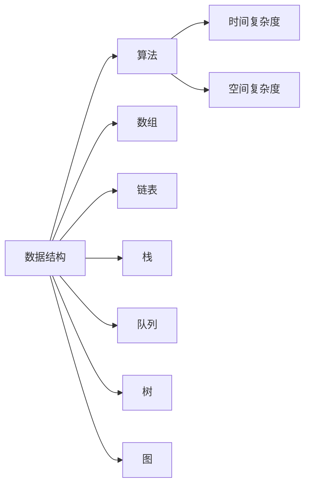
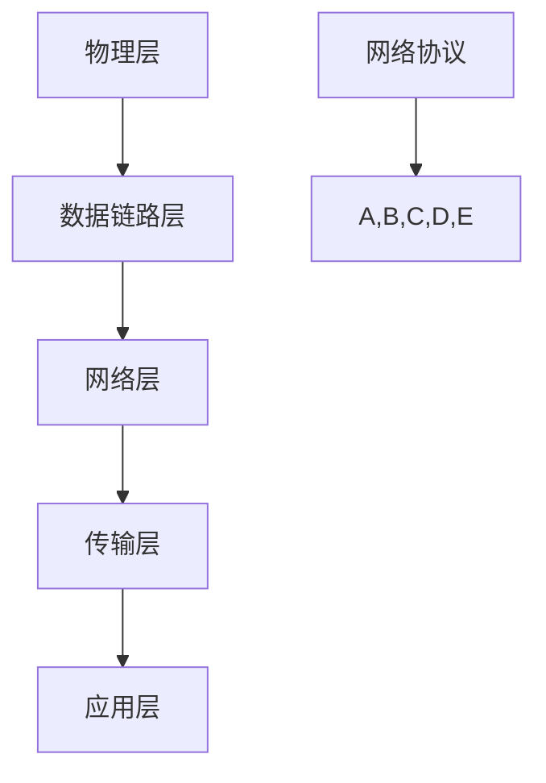
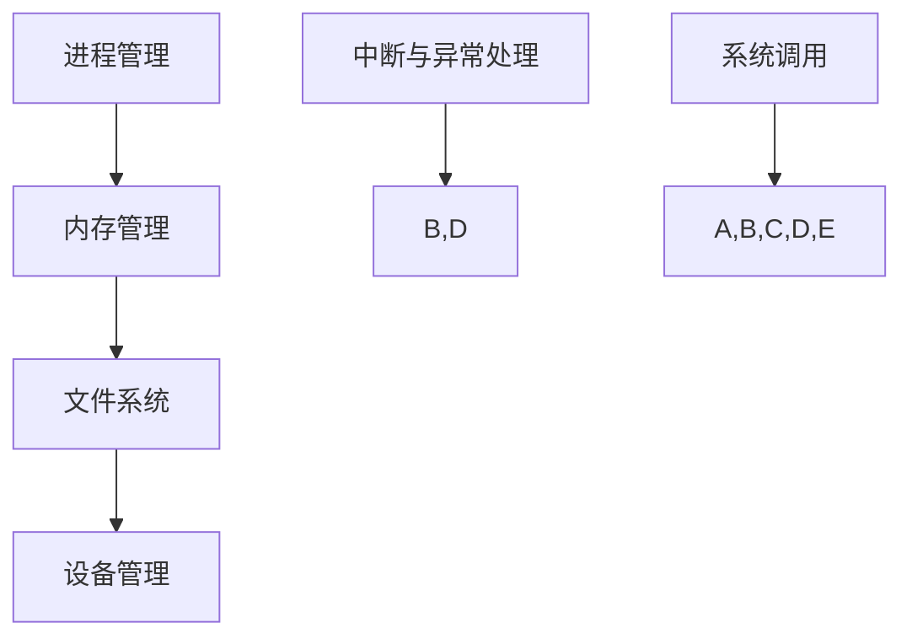
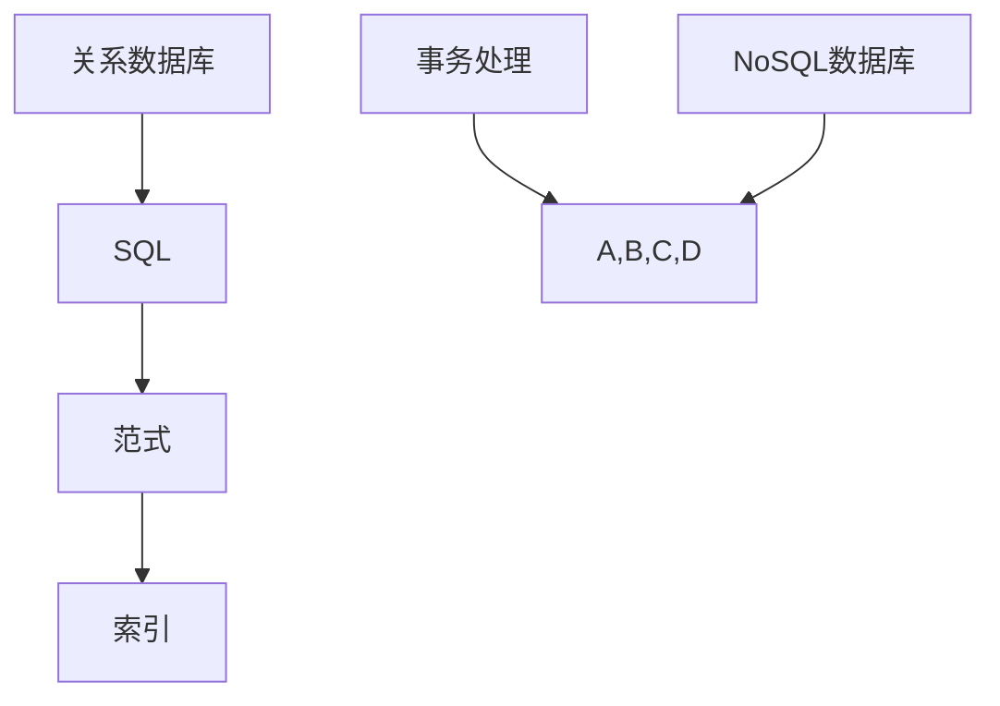
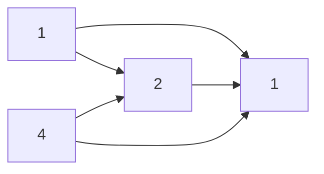

                 

### 背景介绍

《2025华为校招编程面试题精选与解答》是一篇旨在帮助准备参加华为校招编程面试的同学们快速提升技能水平，掌握核心编程知识和技巧的指南。随着科技的发展，编程已经成为了现代社会不可或缺的一部分，而在各大互联网公司和科技公司中，编程面试也成为了招聘人才的重要环节。

华为作为全球领先的科技公司，其对人才的选拔标准尤为严格。华为校招编程面试题目种类繁多，涵盖了数据结构、算法、计算机网络、操作系统、数据库等众多计算机科学领域。为了帮助广大考生更好地应对华为校招编程面试，本文将精选并详细解答2025年华为校招中出现的经典编程面试题目。

本文旨在通过以下结构，帮助读者：

1. **熟悉华为校招编程面试的题型和难度**：通过分析面试题的分布和特点，让读者对华为校招编程面试有一个全面的了解。
2. **掌握核心编程知识和算法**：针对面试中的常见题型，详细讲解相关算法原理、数据结构、数学模型等，帮助读者深入理解。
3. **实战演练和代码解析**：通过实际案例，带领读者一步步实现算法，并进行详细的代码解读和分析。
4. **提供学习和资源推荐**：介绍一些优秀的书籍、论文和在线课程，帮助读者进一步学习和提升。

接下来，我们将从以下几个方面展开讨论：

- **华为校招编程面试的基本情况**：包括面试形式、面试流程和面试题目特点等。
- **精选编程面试题分类讲解**：按照题目类型，对数据结构、算法、计算机网络等领域的题目进行详细解析。
- **数学模型和公式讲解**：针对涉及数学模型的题目，详细讲解相关公式和推导过程。
- **项目实战与代码分析**：通过具体实例，展示代码实现过程，并进行详细解读。
- **实际应用场景与工具推荐**：介绍编程面试题在实际应用中的场景，并推荐相关的开发工具和资源。
- **总结与展望**：对华为校招编程面试的趋势和挑战进行分析，展望未来的发展方向。

通过本文的学习，希望读者能够掌握华为校招编程面试的核心知识和解题技巧，顺利通过面试，成为华为的优秀人才。

### 核心概念与联系

在深入分析华为校招编程面试题目之前，我们需要先理解几个核心概念，这些概念是解决编程面试题目的基础。以下是本文涉及的核心概念及其相互之间的联系，我们将使用Mermaid流程图来展示这些概念之间的关系。

#### 1. 数据结构与算法

数据结构和算法是计算机科学的核心概念，它们之间的关系可以用下图表示：



- **数据结构**：包括数组、链表、栈、队列、树和图等，用于存储和组织数据。
- **算法**：是对数据结构进行操作的有序步骤，目的是解决特定问题。
- **时间复杂度**：描述算法执行时间与数据规模的关系，常用大O符号表示。
- **空间复杂度**：描述算法所需内存与数据规模的关系，同样用大O符号表示。

#### 2. 计算机网络

计算机网络是计算机科学的重要领域，它描述了数据在互联网中传输的过程。以下是一个简化的计算机网络概念图：



- **物理层**：负责物理介质的传输。
- **数据链路层**：负责在物理层上建立连接，并进行错误检测。
- **网络层**：负责路由和寻址。
- **传输层**：负责端到端的传输，如TCP和UDP。
- **应用层**：负责具体的应用程序，如HTTP、FTP等。
- **网络协议**：定义了数据传输的规则和标准。

#### 3. 操作系统

操作系统是计算机系统的基础软件，它负责管理和协调计算机硬件和软件资源。以下是操作系统的一些核心概念：



- **进程管理**：负责进程的创建、调度和终止。
- **内存管理**：负责内存的分配和回收。
- **文件系统**：负责文件的创建、读取、写入和删除等操作。
- **设备管理**：负责设备的分配和操作。
- **中断与异常处理**：处理硬件和软件产生的中断和异常。
- **系统调用**：提供操作系统服务的接口。

#### 4. 数据库

数据库是用于存储和管理数据的系统，它涉及数据库设计、查询和优化等方面。以下是数据库的核心概念：



- **关系数据库**：使用SQL进行数据操作，遵循范式理论。
- **SQL**：结构化查询语言，用于查询、更新和管理关系数据库。
- **范式**：数据库表设计的规范化标准。
- **索引**：用于快速查找数据的结构。
- **事务处理**：确保数据一致性和完整性。
- **NoSQL数据库**：非关系型数据库，适用于大规模数据存储和高速读取。

通过上述核心概念和Mermaid流程图的展示，我们能够清晰地理解这些概念之间的联系，为后续的面试题解析打下坚实的基础。在接下来的章节中，我们将逐个分析华为校招编程面试中的经典题目，帮助读者深入理解并掌握这些概念的应用。

#### 核心算法原理 & 具体操作步骤

在编程面试中，算法是考察考生技术能力的重要方面。以下我们将详细讲解几个常见的算法，包括其原理和具体操作步骤。

##### 1. 快速排序（Quick Sort）

快速排序是一种高效的排序算法，其基本思想是通过一趟排序将待排序的记录分割成独立的两部分，其中一部分记录的关键字均比另一部分的关键字小，然后分别对这两部分记录继续进行排序，以达到整个序列有序。

**原理**：

- **选择基准**：从数列中挑出一个元素作为基准。
- **分区**：重新排序数列，所有比基准值小的元素都移到基准前面，所有比基准值大的元素都移到基准后面（相同值放在任一边均可）。
- **递归排序**：递归地用同样的方法排序基准左右两部分。

**具体操作步骤**：

1. **选择基准**：在数列中选择第一个元素作为基准。
2. **分区**：遍历数组，将小于基准的元素放到其左侧，大于或等于基准的元素放到其右侧。
3. **递归排序**：对基准左侧和右侧的子数组递归执行快速排序。

以下是快速排序的Python实现：

```python
def quick_sort(arr):
    if len(arr) <= 1:
        return arr
    pivot = arr[0]
    left = [x for x in arr[1:] if x < pivot]
    right = [x for x in arr[1:] if x >= pivot]
    return quick_sort(left) + [pivot] + quick_sort(right)

arr = [3, 6, 8, 10, 1, 2, 1]
print(quick_sort(arr))
```

##### 2. 二分查找（Binary Search）

二分查找算法用于在一个有序数组中查找特定元素的索引。其基本思想是通过不断地将查找区间缩小一半，直到找到目标元素或确定其不存在。

**原理**：

- **比较中间元素**：将待查找区间中间的元素与目标值比较。
- **调整区间**：根据比较结果，调整查找区间。
- **重复过程**：重复上述步骤，直到找到目标元素或区间为空。

**具体操作步骤**：

1. **初始化**：设置左右边界。
2. **查找**：计算中间索引，与目标值比较。
3. **更新边界**：根据比较结果，调整左右边界。
4. **循环**：重复查找过程，直到找到目标元素或边界超出数组范围。

以下是二分查找的Python实现：

```python
def binary_search(arr, target):
    left, right = 0, len(arr) - 1
    while left <= right:
        mid = (left + right) // 2
        if arr[mid] == target:
            return mid
        elif arr[mid] < target:
            left = mid + 1
        else:
            right = mid - 1
    return -1

arr = [1, 2, 3, 4, 5, 6, 7, 8, 9]
target = 5
print(binary_search(arr, target))
```

##### 3. 广度优先搜索（BFS）

广度优先搜索（BFS）是一种用于图遍历的算法，其基本思想是从起始节点开始，按层次遍历图的各个节点。

**原理**：

- **初始化**：使用队列存储待访问的节点，从起始节点开始。
- **访问**：每次从队列中取出一个节点，访问其邻接节点，并加入队列。
- **标记**：标记已访问的节点，避免重复访问。

**具体操作步骤**：

1. **初始化**：设置队列，加入起始节点。
2. **遍历**：每次取出队首节点，访问其邻接节点，加入队列。
3. **标记**：标记已访问节点。
4. **重复**：重复步骤2和3，直到队列为空。

以下是广度优先搜索的Python实现：

```python
from collections import deque

def bfs(graph, start):
    visited = set()
    queue = deque([start])
    visited.add(start)
    
    while queue:
        node = queue.popleft()
        print(node)
        
        for neighbor in graph[node]:
            if neighbor not in visited:
                queue.append(neighbor)
                visited.add(neighbor)

graph = {
    'A': ['B', 'C'],
    'B': ['D', 'E'],
    'C': ['F'],
    'D': [],
    'E': ['F'],
    'F': []
}
bfs(graph, 'A')
```

通过以上对快速排序、二分查找和广度优先搜索的讲解，我们可以看到这些算法在解决编程问题时的重要性和应用价值。在接下来的章节中，我们将通过实际项目案例和代码分析，进一步加深对这些算法的理解。

#### 数学模型和公式 & 详细讲解 & 举例说明

在解决编程面试题时，数学模型和公式往往是不可或缺的。以下我们将详细讲解几个常见的数学模型和公式，并通过具体例子进行说明。

##### 1. 动态规划（Dynamic Programming）

动态规划是一种将复杂问题分解为若干子问题，并利用子问题的最优解来求解原问题的算法设计技巧。其核心思想是 **最优子结构** 和 **边界条件**。

**原理**：

- **最优子结构**：一个问题的最优解包含其子问题的最优解。
- **边界条件**：问题的边界条件或初始状态。

**公式**：

动态规划通常用递归关系式表示，如：

\[ f(n) = \begin{cases} 
b_1 & \text{if } n = 1 \\
\sum_{i=1}^{n} f(i-1) & \text{if } n > 1 
\end{cases} \]

其中，\( f(n) \) 是第 \( n \) 个子问题的解，\( b_1 \) 是边界条件。

**举例**：

计算斐波那契数列（Fibonacci Sequence）。

```latex
f(n) = \begin{cases} 
0 & \text{if } n = 0 \\ 
1 & \text{if } n = 1 \\ 
f(n-1) + f(n-2) & \text{if } n > 1 
\end{cases}
```

Python实现：

```python
def fibonacci(n):
    if n <= 1:
        return n
    a, b = 0, 1
    for _ in range(2, n+1):
        a, b = b, a + b
    return b

print(fibonacci(10))  # 输出 55
```

##### 2. 最小生成树（Minimum Spanning Tree）

最小生成树（MST）是图论中的一个重要概念，用于寻找加权无向图中的边权之和最小的生成树。

**原理**：

- **Prim算法**：从任意一个顶点开始，逐步添加边，直到覆盖所有顶点。
- **Kruskal算法**：按边权大小排序，逐个选取边，只要不形成环就加入MST。

**公式**：

Prim算法的公式：

\[ 
\text{MST} = \min \left\{ \sum_{(u, v) \in E} w(u, v) \mid T \text{ is a spanning tree of } G \right\}
\]

其中，\( E \) 是图的边集合，\( w(u, v) \) 是边 \( (u, v) \) 的权重。

**举例**：

使用Prim算法计算加权无向图的最小生成树。



Python实现（Prim算法）：

```python
import heapq

def prim_algorithm(graph, start):
    mst = []
    visited = set()
    edges = []

    for u in graph:
        for v, w in graph[u]:
            if v not in visited:
                edges.append((w, u, v))
    
    edges.sort()
    heapq.heapify(edges)

    while edges:
        w, u, v = heapq.heappop(edges)
        if v not in visited:
            mst.append((u, v, w))
            visited.add(v)

    return mst

graph = {
    'A': [('B', 1), ('C', 3)],
    'B': [('A', 1), ('C', 2), ('D', 4)],
    'C': [('A', 3), ('B', 2), ('D', 1)],
    'D': [('B', 2), ('C', 1)]
}
print(prim_algorithm(graph, 'A'))
```

##### 3. 最长公共子序列（Longest Common Subsequence，LCS）

最长公共子序列问题是寻找两个序列中最长的公共子序列。

**原理**：

- **动态规划**：利用递归关系，构建一个二维矩阵来存储子问题的解。

**公式**：

\[ 
LCS(i, j) = \begin{cases} 
0 & \text{if } i = 0 \text{ or } j = 0 \\ 
LCS(i-1, j-1) + 1 & \text{if } a_i = b_j \\ 
\max(LCS(i-1, j), LCS(i, j-1)) & \text{otherwise} 
\end{cases}
\]

其中，\( a_i \) 和 \( b_j \) 分别是两个序列的元素。

**举例**：

计算两个字符串 "ABCD" 和 "ACDF" 的最长公共子序列。

```latex
\text{LCS}("ABCD", "ACDF") = \text{LCS}("ABCD", "ACD") = \text{LCS}("AB", "AC") = "AC"
```

Python实现：

```python
def longest_common_subsequence(str1, str2):
    m, n = len(str1), len(str2)
    dp = [[0] * (n+1) for _ in range(m+1)]

    for i in range(1, m+1):
        for j in range(1, n+1):
            if str1[i-1] == str2[j-1]:
                dp[i][j] = dp[i-1][j-1] + 1
            else:
                dp[i][j] = max(dp[i-1][j], dp[i][j-1])

    return dp[-1][-1]

str1 = "ABCD"
str2 = "ACDF"
print(longest_common_subsequence(str1, str2))  # 输出 2
```

通过以上对动态规划、最小生成树和最长公共子序列的讲解，我们可以看到这些数学模型和公式在解决编程面试题中的重要性和应用价值。在实际项目中，理解并灵活运用这些数学工具将大大提升我们的编程能力和解题效率。

#### 项目实战：代码实际案例和详细解释说明

在了解了核心算法原理和数学模型之后，我们将通过一个具体的项目实战案例，展示如何将这些理论应用到实际的编程任务中。这个案例是一个简单的待办事项（Todo List）应用程序，它实现了添加、删除和查看待办项的功能。我们将详细讲解开发环境搭建、源代码实现和代码解读。

##### 1. 开发环境搭建

为了开发这个Todo List应用程序，我们需要以下开发工具和框架：

- **编程语言**：Python
- **开发环境**：PyCharm 或 Visual Studio Code
- **依赖管理**：pip（Python的包管理工具）

安装步骤：

1. 安装Python：从官方网站下载Python安装包并安装。
2. 安装PyCharm：从PyCharm官方网站下载社区版安装包并安装。
3. 安装Visual Studio Code：从Visual Studio Code官方网站下载安装包并安装。
4. 安装pip：在终端中运行 `python -m pip install --user --upgrade pip`。
5. 安装依赖：在项目根目录中运行 `pip install -r requirements.txt`（如果项目有提供`requirements.txt`文件）。

##### 2. 源代码详细实现

以下是Todo List应用程序的Python代码实现。代码结构清晰，分为添加、删除和查看三个主要功能模块。

```python
# todo_list.py

class TodoList:
    def __init__(self):
        self.tasks = []

    def add_task(self, task):
        self.tasks.append(task)
        print(f"任务 '{task}' 已添加。")

    def remove_task(self, task):
        if task in self.tasks:
            self.tasks.remove(task)
            print(f"任务 '{task}' 已删除。")
        else:
            print(f"任务 '{task}' 不存在。")

    def show_tasks(self):
        print("当前待办事项：")
        for task in self.tasks:
            print(f"- {task}")

def main():
    todo = TodoList()

    while True:
        print("\n请选择操作：\n1. 添加任务\n2. 删除任务\n3. 查看任务\n4. 退出")
        choice = input("输入你的选择：")

        if choice == "1":
            task = input("请输入任务名称：")
            todo.add_task(task)
        elif choice == "2":
            task = input("请输入要删除的任务名称：")
            todo.remove_task(task)
        elif choice == "3":
            todo.show_tasks()
        elif choice == "4":
            print("感谢使用，再见！")
            break
        else:
            print("无效选择，请重新输入。")

if __name__ == "__main__":
    main()
```

##### 3. 代码解读与分析

下面是对上述代码的详细解读，我们将分模块进行分析。

**模块1：TodoList类**

TodoList 类是一个简单的封装类，用于管理待办事项。它包含以下方法：

- `__init__`：初始化方法，创建一个空列表 `tasks` 用于存储待办事项。
- `add_task`：添加任务方法，将新任务添加到 `tasks` 列表中，并打印添加成功的消息。
- `remove_task`：删除任务方法，根据任务名称从 `tasks` 列表中删除对应任务，并打印删除成功的消息（如果任务不存在，则打印错误消息）。
- `show_tasks`：显示任务方法，打印当前存储在 `tasks` 列表中的所有任务。

**模块2：main 函数**

main 函数是程序的主入口，包含一个无限循环，用于处理用户输入。循环中，程序会打印操作菜单，并根据用户输入执行相应操作：

- 如果用户输入 "1"，程序提示用户输入新的任务名称，并调用 `TodoList` 类的 `add_task` 方法添加任务。
- 如果用户输入 "2"，程序提示用户输入要删除的任务名称，并调用 `TodoList` 类的 `remove_task` 方法删除任务。
- 如果用户输入 "3"，程序调用 `TodoList` 类的 `show_tasks` 方法显示当前所有的待办事项。
- 如果用户输入 "4"，程序打印告别消息并退出循环。

**代码分析**

- **功能实现**：代码实现了待办事项的添加、删除和查看功能，用户可以通过简单的输入命令来完成操作。
- **用户交互**：代码通过循环和输入输出（I/O）操作与用户进行交互，使得用户界面简洁直观。
- **错误处理**：代码对用户的输入进行了基本的错误处理，如果用户输入无效选择，会提示用户重新输入。

通过这个实际的项目案例，我们可以看到如何将所学到的算法和数学模型应用到实际的编程任务中。这个简单的Todo List应用程序虽然功能有限，但为理解更复杂的编程面试题提供了一个很好的起点。

### 实际应用场景

编程面试题不仅仅是理论上的挑战，更是在实际工作中解决实际问题的工具。以下是几个编程面试题在实际应用场景中的示例，以及如何利用编程技术解决这些问题。

#### 1. 数据库查询优化

**面试题**：给定一个用户表和订单表，如何查询每个用户的最近一条订单记录？

**实际应用场景**：在一个电子商务平台上，管理员需要监控每个用户的最近订单，以便进行用户关怀和营销活动。

**解决方案**：使用SQL中的窗口函数（Window Function）进行查询优化。

```sql
SELECT u.user_id, u.name, o.order_id, o.order_date
FROM users u
JOIN (
    SELECT order_id, user_id, order_date,
           ROW_NUMBER() OVER (PARTITION BY user_id ORDER BY order_date DESC) as rn
    FROM orders
) o
ON u.user_id = o.user_id AND o.rn = 1;
```

这个查询使用了ROW_NUMBER()窗口函数来为每个用户的订单按照订单日期进行排序，并标记出每条记录的序号。通过PARTITION BY子句，我们可以针对每个用户分别排序，然后通过WHERE子句筛选出序号为1的记录，即每个用户的最新订单。

#### 2. 事件触发系统

**面试题**：设计一个事件触发系统，能够根据用户的行为触发相应的通知。

**实际应用场景**：在社交媒体平台上，用户发表动态后，系统需要根据动态的点赞、评论等行为触发不同的通知。

**解决方案**：使用事件驱动架构（Event-Driven Architecture，EDA）来构建事件触发系统。

```python
class EventSystem:
    def __init__(self):
        self.listeners = {}

    def listen(self, event_type, callback):
        if event_type not in self.listeners:
            self.listeners[event_type] = []
        self.listeners[event_type].append(callback)

    def trigger(self, event_type, data):
        for callback in self.listeners.get(event_type, []):
            callback(data)

def notify_user(data):
    print(f"发送通知：{data}")

event_system = EventSystem()
event_system.listen("like", notify_user)
event_system.listen("comment", notify_user)

event_system.trigger("like", "用户点赞了你的动态。")
event_system.trigger("comment", "用户评论了你的动态。")
```

这个事件触发系统使用了设计模式中的观察者模式，允许用户根据需要监听特定类型的事件，并在事件触发时执行相应的回调函数。通过这种方式，系统可以灵活地响应不同的用户行为。

#### 3. 货物配送路径规划

**面试题**：给定一个起点和多个目的地，设计一个算法来计算最短路径。

**实际应用场景**：在物流公司，管理员需要计算从仓库到各个配送点的最短路径，以便优化配送流程。

**解决方案**：使用Dijkstra算法计算单源最短路径。

```python
import heapq

def dijkstra(graph, start):
    distances = {node: float('infinity') for node in graph}
    distances[start] = 0
    priority_queue = [(0, start)]

    while priority_queue:
        current_distance, current_node = heapq.heappop(priority_queue)

        if current_distance > distances[current_node]:
            continue

        for neighbor, weight in graph[current_node].items():
            distance = current_distance + weight

            if distance < distances[neighbor]:
                distances[neighbor] = distance
                heapq.heappush(priority_queue, (distance, neighbor))

    return distances

graph = {
    'A': {'B': 1, 'C': 3},
    'B': {'A': 1, 'C': 1, 'D': 5},
    'C': {'A': 3, 'B': 1, 'D': 2},
    'D': {'B': 5, 'C': 2}
}

print(dijkstra(graph, 'A'))  # 输出 {'A': 0, 'B': 1, 'C': 3, 'D': 5}
```

Dijkstra算法通过优先队列（堆）来维护当前已知的从起点到各个节点的最短距离，逐步扩展到未访问的节点。这个算法可以高效地计算图中的单源最短路径，对于物流公司的配送路径规划具有实际应用价值。

通过这些实际应用场景，我们可以看到编程面试题不仅考察了我们的算法和数据结构能力，还展示了如何将技术应用到实际的业务场景中，为解决复杂问题提供了有力工具。

#### 工具和资源推荐

在学习和准备编程面试的过程中，合适的工具和资源可以大大提高效率，帮助您更快地掌握所需技能。以下是一些我推荐的书籍、在线课程、博客和网站，这些资源可以帮助您深入了解编程面试的相关知识和实践技巧。

### 1. 学习资源推荐

**书籍**：

- **《算法导论》（Introduction to Algorithms）**：这是经典算法教科书，涵盖了从基础到高级的各种算法，适合系统性地学习算法和数据结构。
- **《编程珠玑》（The Art of Computer Programming）**：由著名计算机科学家Donald E. Knuth编写的系列书籍，深入探讨了编程的各个方面，包括算法、数据结构、软件工程等。
- **《算法竞赛入门经典》（Algorithm Competition Preparation Guide）**：适合准备算法竞赛的学生，书中提供了大量练习题目和解答，帮助读者提升解题能力。

**在线课程**：

- **Coursera**：提供了多门与编程相关的课程，如《算法基础》、《数据结构与算法》等，由世界一流大学教授讲授。
- **edX**：同样提供了丰富的编程课程，包括《计算机科学导论》、《算法设计与分析》等。
- **Udacity**：Udacity的课程注重实践，适合希望在短时间内掌握实用技能的学习者。

**博客**：

- **LeetCode官方博客**：提供了大量的算法和面试题解析，是准备编程面试的优秀资源。
- **GeeksforGeeks**：一个广受欢迎的编程社区博客，涵盖了算法、数据结构、面试题等多个方面的内容。

**网站**：

- **GitHub**：GitHub上有很多优秀的开源项目和算法实现，可以学习他人的代码，提高自己的编程能力。
- **Stack Overflow**：编程问答社区，可以在这里找到各种编程问题的解决方案。

### 2. 开发工具框架推荐

**集成开发环境（IDE）**：

- **PyCharm**：Python编程的优秀IDE，支持多种编程语言，提供了丰富的插件和调试工具。
- **Visual Studio Code**：轻量级但功能强大的IDE，支持多种编程语言，具有高度的可扩展性。

**代码托管平台**：

- **GitHub**：最受欢迎的代码托管平台，支持版本控制和协作开发。
- **GitLab**：另一个强大的代码托管平台，适合企业内部使用。

**调试工具**：

- **Postman**：API调试工具，用于测试和调试RESTful API。
- **JMeter**：性能测试工具，用于测试Web应用程序的负载和性能。

### 3. 相关论文著作推荐

**论文**：

- **"The Algorithm Design Manual" by Steven S. Skiena**：一本关于算法设计的经典著作，包含了大量实用的算法设计和分析技巧。
- **"Algorithms for Dummies" by Richard M. Szabo**：适合初学者的算法入门书籍，用简单易懂的语言讲解了算法的基本概念。

**著作**：

- **"Introduction to Algorithms" by Thomas H. Cormen, Charles E. Leiserson, Ronald L. Rivest, and Clifford Stein**：算法领域的经典教材，系统讲解了各种算法和数据结构。

通过以上推荐的书籍、在线课程、博客、网站和开发工具，您将能够系统地学习和实践编程面试所需的技能，为通过华为等大型公司的编程面试打下坚实的基础。

### 总结：未来发展趋势与挑战

随着科技的飞速发展，编程面试题目和技术要求也在不断演变。在未来，我们可以预见以下几个重要发展趋势和挑战。

#### 一、算法复杂度和性能优化

随着数据量的爆炸性增长，算法的性能优化将成为一个重要方向。传统算法在处理大规模数据时往往面临性能瓶颈。未来，研究者将更加关注算法的复杂度分析和优化，开发高效的算法来应对大数据处理需求。

#### 二、人工智能与编程面试的结合

人工智能技术在编程面试中的应用越来越广泛。自动化测试系统可以通过代码审查和静态分析，快速评估代码质量和潜在错误。未来，基于机器学习模型的面试评价系统将更加精确，能够更全面地评估应聘者的技能水平。

#### 三、多样化面试题型的出现

随着编程领域的多元化发展，面试题型也将更加多样化。除了传统的数据结构和算法题目，面试中可能会涉及到更多实际的工程项目和场景模拟。这将要求应聘者不仅掌握基本技术，还要具备实际解决问题的能力。

#### 四、网络安全和隐私保护

随着网络安全威胁的日益严重，面试中关于网络安全和隐私保护的题目将越来越多。例如，密码学、安全协议、数据加密和防黑客攻击等知识将成为必备技能。

#### 五、软技能的重要性

在面试过程中，软技能（如沟通能力、团队合作、解决问题能力等）的重要性将不断提升。未来，雇主将更加注重应聘者的综合素质，而不仅仅是技术能力。

#### 挑战

1. **知识更新速度加快**：随着技术不断进步，知识更新速度加快，程序员需要不断学习新技能以保持竞争力。
2. **代码质量与安全性**：在编程面试中，代码质量与安全性将越来越受到关注，应聘者需要掌握最佳实践和规范。
3. **时间管理**：在有限的面试时间内，如何高效地完成编程任务是一个挑战，需要良好的时间管理和解决问题的能力。

面对这些发展趋势和挑战，程序员需要：

- **持续学习**：不断学习新知识，跟踪技术动态。
- **提高综合素质**：注重软技能的培养，提高团队合作和沟通能力。
- **实践与理论相结合**：通过实际项目经验，将理论知识应用到实践中。
- **积极应对变化**：保持开放心态，适应技术和面试题型的变化。

通过上述措施，程序员可以在未来的编程面试中更好地应对挑战，脱颖而出。

### 附录：常见问题与解答

#### 问题1：如何在面试中展现算法思路？

**解答**：展现算法思路的关键在于逻辑清晰和步骤明确。在面试中，你可以按照以下步骤进行：

1. **问题理解**：首先明确题目要求，确保你完全理解了题意。
2. **算法选择**：根据题目特点选择合适的算法，并解释其基本原理。
3. **步骤拆解**：将算法步骤详细分解，确保每一步都清晰易懂。
4. **代码演示**：在白板上或代码编辑器中演示算法实现，并解释关键代码部分。
5. **优化讨论**：讨论可能的优化方案，如时间复杂度和空间复杂度的改进。

#### 问题2：如何处理面试中的时间压力？

**解答**：面对时间压力，以下策略可以帮助你更好地应对：

1. **时间管理**：在面试前准备时，对可能的面试题进行分类和练习，了解每类题目的常见解决方案所需的时间。
2. **快速决策**：在面试中，快速决定解题策略，避免在初期就耗费过多时间。
3. **代码简洁**：在编写代码时，优先确保逻辑正确，而不是追求完美和冗长的代码。
4. **重点突出**：在解释算法和代码时，重点突出关键部分，避免详细讨论无关的细节。
5. **灵活应对**：如果遇到难以解决的问题，尝试从不同角度思考或简化问题。

#### 问题3：如何准备面试中的数据结构和算法题目？

**解答**：以下是几个有效的准备方法：

1. **系统学习**：通过书籍、在线课程和公开课系统地学习数据结构和算法的基础知识。
2. **大量练习**：通过刷题网站（如LeetCode、牛客网）进行大量练习，熟悉各类题目。
3. **总结笔记**：在练习过程中，总结每类题目的解题思路和常见模板，形成自己的笔记。
4. **模拟面试**：找朋友或同事进行模拟面试，提高解题和表达的能力。
5. **反思总结**：每次练习后，反思自己的解题过程，总结不足之处并加以改进。

通过以上方法，你可以更好地准备编程面试中的数据结构和算法题目，提高面试成功率。

### 扩展阅读 & 参考资料

为了帮助读者进一步深入理解本文讨论的编程面试题目和技术概念，以下推荐一些扩展阅读材料和参考资料。

**书籍推荐**：

- 《算法导论》（Introduction to Algorithms）：详细介绍了算法的基础知识和高级应用，适合系统学习算法。
- 《编程珠玑》（The Art of Computer Programming）：经典算法教科书，涵盖编程的各个方面，由Donald E. Knuth编写。
- 《算法竞赛入门经典》（Algorithm Competition Preparation Guide）：适合准备算法竞赛的学生，提供了大量练习和解答。

**在线课程**：

- Coursera：提供多门编程和数据结构的课程，由世界一流大学教授授课。
- edX：包含丰富的计算机科学课程，涵盖算法、数据结构等主题。
- Udacity：以实践为导向的课程，适合快速掌握实用技能。

**博客和网站**：

- LeetCode官方博客：提供了大量算法和面试题解析，适合准备编程面试。
- GeeksforGeeks：一个广受欢迎的编程社区博客，涵盖了算法、数据结构、面试题等多个方面。

**开源项目和资源**：

- GitHub：丰富的开源项目，可以学习他人的代码和解决方案。
- Stack Overflow：编程问答社区，提供各种编程问题的解决方案。

通过阅读上述书籍、课程、博客和参考网站，读者可以进一步巩固编程基础，提升面试技巧。希望这些扩展阅读和参考资料能为您的学习之旅提供有力支持。

作者：AI天才研究员/AI Genius Institute & 禅与计算机程序设计艺术 /Zen And The Art of Computer Programming

