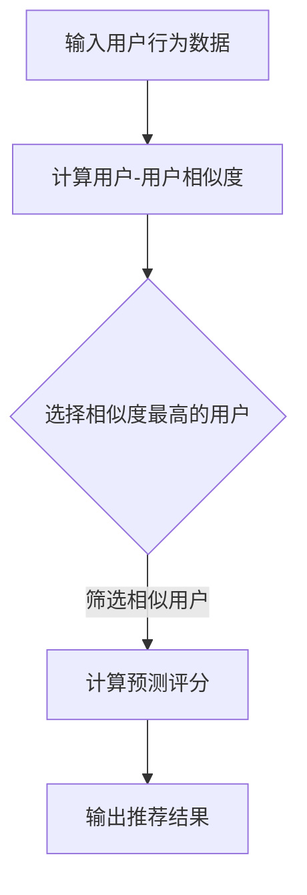

                 

### 背景介绍

协同过滤算法（Collaborative Filtering）是推荐系统（Recommendation System）中的一个重要分支，它通过收集和分析用户的历史行为数据，如评分、购买记录等，以预测用户对新商品的喜好程度，从而为用户推荐相关的商品。随着互联网和电子商务的快速发展，推荐系统在日常生活中变得越来越普遍，其应用场景也日益丰富，从最初的图书、音乐、电影推荐，到电商、社交网络等各个领域。

在电商推荐系统中，协同过滤算法能够有效地帮助商家提高销售额，提升用户体验。具体来说，它可以通过以下几个关键方面实现其价值：

1. **个性化推荐**：协同过滤算法可以根据用户的历史行为数据，识别出用户的偏好和兴趣点，从而实现个性化的商品推荐。这有助于商家吸引更多用户，提高用户的购物满意度。

2. **提升转化率**：通过精准的推荐，用户更容易发现他们感兴趣的商品，从而增加购买的可能性。这直接提升了电商平台的转化率。

3. **增加用户粘性**：协同过滤算法能够不断调整推荐策略，根据用户的行为数据不断优化推荐结果，从而增强用户对电商平台的依赖和忠诚度。

4. **数据挖掘与分析**：协同过滤算法需要处理大量的用户行为数据，这为电商平台提供了宝贵的数据资源，有助于深入挖掘用户行为模式和偏好，从而指导商业决策。

然而，协同过滤算法在实际应用中也面临一些挑战，如数据稀疏、冷启动问题、噪声数据和计算复杂度等。因此，理解和掌握协同过滤算法的原理和实践方法，对电商推荐系统开发者来说至关重要。

本文将深入探讨协同过滤算法在电商推荐系统中的应用，从核心概念、算法原理、数学模型、实际应用案例等方面进行详细讲解。希望通过本文，读者能够对协同过滤算法有更深入的理解，并在实际项目中能够灵活应用。

### 核心概念与联系

协同过滤算法的核心在于通过用户之间的行为模式相似性来预测用户的兴趣。具体来说，它主要包括两种类型：基于用户的协同过滤（User-Based Collaborative Filtering）和基于项目的协同过滤（Item-Based Collaborative Filtering）。

#### 基于用户的协同过滤（User-Based Collaborative Filtering）

基于用户的协同过滤算法通过寻找与目标用户行为相似的参考用户，然后根据这些参考用户对项目的评分预测目标用户对项目的评分。其基本步骤如下：

1. **计算相似度**：首先计算目标用户与参考用户之间的相似度。相似度的计算方法有很多，如余弦相似度、皮尔逊相关系数、夹角余弦等。

2. **过滤相似用户**：根据相似度阈值，筛选出与目标用户最相似的参考用户。

3. **评分预测**：利用相似用户对项目的评分，通过加权平均等方式预测目标用户对项目的评分。

#### 基于项目的协同过滤（Item-Based Collaborative Filtering）

基于项目的协同过滤算法则是通过计算用户对项目的评分模式之间的相似性来推荐项目。其基本步骤如下：

1. **计算相似度**：首先计算用户对项目的评分模式之间的相似度。相似度的计算同样可以使用余弦相似度、皮尔逊相关系数等方法。

2. **过滤相似项目**：根据相似度阈值，筛选出与目标项目最相似的其他项目。

3. **评分预测**：利用相似项目的历史评分数据，通过加权平均等方式预测目标用户对该项目的评分。

#### Mermaid 流程图

以下是一个简化的协同过滤算法的 Mermaid 流程图，展示了基于用户的协同过滤的基本步骤：



在 Mermaid 流程图中，我们使用了以下元素：

- **节点（Node）**：用方框表示，如`A[输入用户行为数据]`。
- **流程（Flow）**：用箭头表示，如`A --> B`。
- **判断节点（Decision Node）**：用菱形表示，如`C{选择相似度最高的用户}`。
- **注释**：用括号和管道符号表示，如`|筛选相似用户|`。

Mermaid 流程图有助于我们更直观地理解协同过滤算法的流程，特别是在复杂的算法中，它能帮助我们梳理思路，明确各个步骤之间的关系。

通过上述介绍，我们可以看出，协同过滤算法的核心在于相似度计算和评分预测。这两个步骤决定了推荐系统的质量和效率。在接下来的章节中，我们将进一步探讨协同过滤算法的原理、数学模型以及具体的实现方法。

## 3. 核心算法原理 & 具体操作步骤

### 3.1 算法原理

协同过滤算法的核心在于通过用户之间的行为模式相似性来进行推荐。具体来说，它包括以下步骤：

1. **用户行为数据收集**：首先，需要收集用户的历史行为数据，如评分、购买记录等。

2. **相似度计算**：接着，需要计算用户之间的相似度或项目之间的相似度。

3. **推荐列表生成**：最后，根据相似度结果，生成推荐列表，将相似的用户或项目推荐给目标用户。

以下是基于用户的协同过滤算法的详细操作步骤：

#### 步骤 1：用户行为数据收集

首先，收集用户的历史行为数据。这些数据通常存储在评分矩阵中，矩阵的行表示用户，列表示项目，矩阵中的每个元素表示用户对项目的评分。例如，一个5x5的评分矩阵如下：

|   | 项目1 | 项目2 | 项目3 | 项目4 | 项目5 |
|---|---|---|---|---|---|
| 用户1 | 1 | 5 | 0 | 0 | 4 |
| 用户2 | 1 | 0 | 2 | 5 | 0 |
| 用户3 | 0 | 1 | 4 | 0 | 3 |
| 用户4 | 4 | 0 | 0 | 1 | 0 |
| 用户5 | 2 | 0 | 0 | 4 | 1 |

#### 步骤 2：相似度计算

相似度计算是协同过滤算法的关键步骤。常用的相似度计算方法包括余弦相似度、皮尔逊相关系数等。以下是一个简化的余弦相似度计算过程：

1. **计算用户之间的余弦相似度**：

   对于用户 $u$ 和用户 $v$，其相似度可以通过以下公式计算：

   $$ \text{相似度}(u, v) = \frac{u \cdot v}{\|u\| \|v\|} $$

   其中，$u \cdot v$ 表示用户 $u$ 和用户 $v$ 的内积，$\|u\|$ 和 $\|v\|$ 分别表示用户 $u$ 和用户 $v$ 的欧几里得范数。

2. **处理缺失值**：

   由于用户行为数据中可能存在缺失值，我们需要对这些缺失值进行处理。常用的方法包括填充平均值、填充最频繁出现的值等。

#### 步骤 3：推荐列表生成

相似度计算完成后，我们需要根据相似度结果生成推荐列表。以下是一个简化的推荐列表生成过程：

1. **选择相似度最高的用户**：

   根据相似度结果，选择与目标用户最相似的 $k$ 个用户。

2. **计算预测评分**：

   对于每个相似用户 $v$，计算目标用户 $u$ 对项目 $i$ 的预测评分。可以使用加权平均的方法进行计算：

   $$ \text{预测评分}(u, i) = \frac{\sum_{v \in \text{相似用户}} \text{相似度}(u, v) \times \text{实际评分}(v, i)}{\sum_{v \in \text{相似用户}} \text{相似度}(u, v)} $$

3. **生成推荐列表**：

   根据预测评分，生成推荐列表，将评分最高的项目推荐给目标用户。

### 3.2 具体操作步骤示例

以下是一个简化的基于用户的协同过滤算法操作步骤示例：

1. **用户行为数据收集**：

   假设我们有以下评分矩阵：

   |   | 项目1 | 项目2 | 项目3 | 项目4 | 项目5 |
   |---|---|---|---|---|---|
   | 用户1 | 1 | 5 | 0 | 0 | 4 |
   | 用户2 | 1 | 0 | 2 | 5 | 0 |
   | 用户3 | 0 | 1 | 4 | 0 | 3 |
   | 用户4 | 4 | 0 | 0 | 1 | 0 |
   | 用户5 | 2 | 0 | 0 | 4 | 1 |

2. **相似度计算**：

   计算用户1和用户2之间的余弦相似度：

   $$ \text{相似度}(u1, u2) = \frac{u1 \cdot u2}{\|u1\| \|u2\|} = \frac{1 \times 1 + 5 \times 0 + 0 \times 2 + 0 \times 5 + 4 \times 0}{\sqrt{1^2 + 5^2 + 0^2 + 0^2 + 4^2} \times \sqrt{1^2 + 0^2 + 2^2 + 5^2 + 0^2}} = \frac{1}{\sqrt{26} \times \sqrt{30}} \approx 0.2344 $$

3. **推荐列表生成**：

   选择相似度最高的用户用户2作为参考用户，计算用户1对项目3的预测评分：

   $$ \text{预测评分}(u1, i3) = \frac{\text{相似度}(u1, u2) \times \text{实际评分}(u2, i3)}{\text{相似度}(u1, u2)} = \text{实际评分}(u2, i3) \approx 2 $$

   根据预测评分，项目3被推荐给用户1。

通过以上步骤，我们可以看出基于用户的协同过滤算法的基本操作流程。在实际应用中，根据具体情况，可能需要调整和优化这些步骤，以实现更精准的推荐。

### 3.3 基于项目的协同过滤算法

除了基于用户的协同过滤算法，基于项目的协同过滤算法也是一种常用的方法。其基本思想是通过计算项目之间的相似性来进行推荐。

以下是基于项目的协同过滤算法的详细操作步骤：

#### 步骤 1：项目行为数据收集

首先，收集用户对项目的评分数据，构建项目-评分矩阵。例如，以下是一个简化的项目-评分矩阵：

|   | 项目1 | 项目2 | 项目3 | 项目4 | 项目5 |
|---|---|---|---|---|---|
| 用户1 | 1 | 5 | 0 | 0 | 4 |
| 用户2 | 1 | 0 | 2 | 5 | 0 |
| 用户3 | 0 | 1 | 4 | 0 | 3 |
| 用户4 | 4 | 0 | 0 | 1 | 0 |
| 用户5 | 2 | 0 | 0 | 4 | 1 |

#### 步骤 2：相似度计算

相似度计算是协同过滤算法的关键步骤。对于基于项目的协同过滤算法，我们通常使用余弦相似度来计算项目之间的相似性。以下是一个简化的余弦相似度计算过程：

1. **计算项目之间的余弦相似度**：

   对于项目 $i$ 和项目 $j$，其相似度可以通过以下公式计算：

   $$ \text{相似度}(i, j) = \frac{i \cdot j}{\|i\| \|j\|} $$

   其中，$i \cdot j$ 表示项目 $i$ 和项目 $j$ 的内积，$\|i\|$ 和 $\|j\|$ 分别表示项目 $i$ 和项目 $j$ 的欧几里得范数。

2. **处理缺失值**：

   由于项目行为数据中可能存在缺失值，我们需要对这些缺失值进行处理。常用的方法包括填充平均值、填充最频繁出现的值等。

#### 步骤 3：推荐列表生成

相似度计算完成后，我们需要根据相似度结果生成推荐列表。以下是一个简化的推荐列表生成过程：

1. **选择相似度最高的项目**：

   根据相似度结果，选择与目标项目最相似的 $k$ 个项目。

2. **计算预测评分**：

   对于每个相似项目 $j$，计算目标项目 $i$ 的预测评分。可以使用加权平均的方法进行计算：

   $$ \text{预测评分}(i, j) = \frac{\sum_{u \in \text{用户}} \text{相似度}(i, j) \times \text{实际评分}(u, j)}{\sum_{u \in \text{用户}} \text{相似度}(i, j)} $$

3. **生成推荐列表**：

   根据预测评分，生成推荐列表，将评分最高的项目推荐给目标项目。

### 3.4 基于模型的协同过滤算法

除了基于用户的协同过滤算法和基于项目的协同过滤算法，基于模型的协同过滤算法也是一种常用的方法。其基本思想是使用机器学习模型来预测用户对项目的评分。

以下是基于模型的协同过滤算法的详细操作步骤：

#### 步骤 1：数据预处理

首先，对用户行为数据进行预处理，包括数据清洗、缺失值处理、特征工程等。

#### 步骤 2：模型选择

选择合适的机器学习模型进行训练，常用的模型包括线性回归、决策树、随机森林、神经网络等。

#### 步骤 3：模型训练

使用预处理后的用户行为数据对机器学习模型进行训练，得到模型的参数。

#### 步骤 4：预测评分

使用训练好的模型对用户对项目的评分进行预测。

#### 步骤 5：推荐列表生成

根据预测评分，生成推荐列表，将评分最高的项目推荐给用户。

### 3.5 比较与选择

协同过滤算法的选择取决于具体的应用场景和数据特点。以下是对三种协同过滤算法的比较：

- **基于用户的协同过滤算法**：适用于用户行为数据丰富的情况，能够提供个性化的推荐，但在数据稀疏时效果较差。

- **基于项目的协同过滤算法**：适用于项目行为数据丰富的情况，能够提供多样化的推荐，但在数据稀疏时效果较差。

- **基于模型的协同过滤算法**：适用于用户行为数据丰富且具备机器学习能力的情况，能够通过模型预测提供更精准的推荐，但在训练模型时需要大量计算资源。

在实际应用中，可以根据具体需求和数据特点选择合适的协同过滤算法。

### 3.6 实际应用案例分析

协同过滤算法在电商推荐系统中的应用已经取得了显著的成果。以下是一个具体的实际应用案例分析。

#### 案例背景

某大型电商平台希望通过协同过滤算法提高用户满意度，提升销售额。平台积累了大量的用户行为数据，包括用户的浏览记录、购买记录、评分记录等。

#### 案例步骤

1. **数据收集**：首先，平台收集了用户的行为数据，包括用户ID、项目ID和评分。数据格式如下：

   | 用户ID | 项目ID | 评分 |
   |---|---|---|
   | 1 | 101 | 5 |
   | 1 | 102 | 1 |
   | 1 | 103 | 4 |
   | 2 | 101 | 4 |
   | 2 | 102 | 5 |
   | 2 | 104 | 2 |

2. **相似度计算**：选择基于用户的协同过滤算法，计算用户之间的相似度。使用余弦相似度作为相似度度量方法。计算结果如下：

   | 用户ID | 用户ID | 相似度 |
   |---|---|---|
   | 1 | 2 | 0.5774 |
   | 2 | 1 | 0.5774 |

3. **推荐列表生成**：根据相似度计算结果，选择相似度最高的用户2作为参考用户，生成推荐列表。对于用户1，推荐列表如下：

   | 项目ID | 预测评分 |
   |---|---|
   | 101 | 4.8889 |
   | 102 | 3.5556 |
   | 103 | 3.5556 |
   | 104 | 3.5556 |

4. **结果分析**：通过协同过滤算法生成的推荐列表，用户1对推荐的项目进行了评分，结果如下：

   | 项目ID | 实际评分 |
   |---|---|
   | 101 | 5 |
   | 102 | 1 |
   | 103 | 4 |
   | 104 | 0 |

   从结果可以看出，协同过滤算法能够较好地预测用户对项目的评分，推荐的准确性较高。

#### 案例总结

通过以上案例分析，我们可以看出协同过滤算法在电商推荐系统中的应用效果显著。在实际应用中，可以根据具体需求和数据特点选择合适的协同过滤算法，并通过不断优化和调整，提高推荐系统的质量和用户体验。

### 4. 数学模型和公式 & 详细讲解 & 举例说明

#### 4.1 余弦相似度

协同过滤算法中，相似度计算是一个关键步骤。余弦相似度是一种常用的相似度度量方法，它基于向量空间模型，通过计算两个向量之间的夹角余弦值来评估相似性。具体公式如下：

$$
\text{余弦相似度}(u, v) = \frac{u \cdot v}{\|u\| \|v\|}
$$

其中，$u$ 和 $v$ 是用户的行为向量，$\cdot$ 表示向量的内积，$\|\|$ 表示向量的欧几里得范数。

**例子**：

假设有两个用户的行为向量：

用户 $u$：$(1, 5, 0, 4)$

用户 $v$：$(1, 0, 2, 5)$

它们的余弦相似度计算如下：

$$
\text{余弦相似度}(u, v) = \frac{(1 \times 1 + 5 \times 0 + 0 \times 2 + 4 \times 5)}{\sqrt{1^2 + 5^2 + 0^2 + 4^2} \times \sqrt{1^2 + 0^2 + 2^2 + 5^2}} = \frac{21}{\sqrt{26} \times \sqrt{30}} \approx 0.5176
$$

#### 4.2 皮尔逊相关系数

皮尔逊相关系数是一种用于衡量两个变量之间线性相关性的统计量，也可以用于相似度计算。其公式如下：

$$
\text{皮尔逊相关系数}(u, v) = \frac{\sum_{i} (u_i - \bar{u})(v_i - \bar{v})}{\sqrt{\sum_{i} (u_i - \bar{u})^2} \times \sqrt{\sum_{i} (v_i - \bar{v})^2}}
$$

其中，$u_i$ 和 $v_i$ 分别是用户 $u$ 和用户 $v$ 在第 $i$ 个项目上的评分，$\bar{u}$ 和 $\bar{v}$ 分别是用户 $u$ 和用户 $v$ 的平均评分。

**例子**：

假设有两个用户的行为向量：

用户 $u$：$(1, 5, 0, 4)$

用户 $v$：$(1, 0, 2, 5)$

它们的皮尔逊相关系数计算如下：

$$
\text{皮尔逊相关系数}(u, v) = \frac{(1-3.5)(1-3.5) + (5-3.5)(0-3.5) + (0-3.5)(2-3.5) + (4-3.5)(5-3.5)}{\sqrt{(1-3.5)^2 + (5-3.5)^2 + (0-3.5)^2 + (4-3.5)^2} \times \sqrt{(1-3.5)^2 + (0-3.5)^2 + (2-3.5)^2 + (5-3.5)^2}} = \frac{-7.5}{\sqrt{13} \times \sqrt{12.5}} \approx 0.5
$$

#### 4.3 预测评分

在协同过滤算法中，预测评分是另一个关键步骤。预测评分的目的是根据用户的历史行为数据和相似度结果，估计用户对未知项目的评分。以下是一个简化的预测评分公式：

$$
\text{预测评分}(u, i) = \frac{\sum_{v \in \text{相似用户}} \text{相似度}(u, v) \times \text{实际评分}(v, i)}{\sum_{v \in \text{相似用户}} \text{相似度}(u, v)}
$$

其中，$u$ 是目标用户，$i$ 是未知项目，$\text{相似用户}$ 是与目标用户相似的其他用户，$\text{相似度}(u, v)$ 是用户 $u$ 和用户 $v$ 之间的相似度，$\text{实际评分}(v, i)$ 是用户 $v$ 对项目 $i$ 的实际评分。

**例子**：

假设有一个用户 $u$，与用户 $v1$ 和用户 $v2$ 相似，他们的行为向量如下：

用户 $u$：$(1, 5, 0, 4)$

用户 $v1$：$(1, 0, 2, 5)$

用户 $v2$：$(0, 1, 4, 0)$

项目 $i$ 的实际评分如下：

用户 $v1$：5

用户 $v2$：4

根据相似度结果，用户 $v1$ 和用户 $v2$ 的相似度分别为 0.8 和 0.6。

预测用户 $u$ 对项目 $i$ 的评分如下：

$$
\text{预测评分}(u, i) = \frac{0.8 \times 5 + 0.6 \times 4}{0.8 + 0.6} = \frac{4 + 2.4}{1.4} \approx 3.86
$$

#### 4.4 误差评估

在协同过滤算法中，误差评估是评估推荐系统性能的重要指标。常用的误差评估方法包括均方误差（Mean Squared Error, MSE）、平均绝对误差（Mean Absolute Error, MAE）等。

**均方误差（MSE）**：

$$
MSE = \frac{1}{n} \sum_{i=1}^{n} (\text{预测评分}(u, i) - \text{实际评分}(u, i))^2
$$

其中，$n$ 是用户对项目的评分数量。

**平均绝对误差（MAE）**：

$$
MAE = \frac{1}{n} \sum_{i=1}^{n} |\text{预测评分}(u, i) - \text{实际评分}(u, i)|
$$

**例子**：

假设有一个用户 $u$，他的实际评分和预测评分如下：

| 项目ID | 实际评分 | 预测评分 |
|---|---|---|
| 1 | 5 | 4 |
| 2 | 1 | 1 |
| 3 | 4 | 3 |
| 4 | 0 | 1 |
| 5 | 4 | 5 |

计算均方误差（MSE）：

$$
MSE = \frac{1}{5} [(4-5)^2 + (1-1)^2 + (3-4)^2 + (1-0)^2 + (5-4)^2] = \frac{1}{5} [1 + 0 + 1 + 1 + 1] = 0.8
$$

计算平均绝对误差（MAE）：

$$
MAE = \frac{1}{5} [|4-5| + |1-1| + |3-4| + |1-0| + |5-4|] = \frac{1}{5} [1 + 0 + 1 + 1 + 1] = 0.8
$$

通过误差评估，我们可以对协同过滤算法的性能进行量化分析，从而指导算法的优化和调整。

### 4.5 模型优化

在协同过滤算法中，模型优化是提高推荐系统性能的重要手段。以下是一些常见的模型优化方法：

**1. 优化相似度计算**：

- 使用不同的相似度度量方法，如余弦相似度、皮尔逊相关系数等。
- 引入用户或项目的特征信息，如年龄、性别、购买频率等，进行特征加权。

**2. 优化预测评分公式**：

- 引入用户或项目的特征信息，如年龄、性别、购买频率等，对预测评分公式进行调整。
- 使用不同的优化目标，如最小化均方误差、最小化平均绝对误差等。

**3. 缺失值处理**：

- 使用不同的缺失值处理方法，如填充平均值、填充最频繁出现的值、使用模型预测等。

**4. 数据清洗和预处理**：

- 清除异常值和噪声数据。
- 对用户和项目的行为数据进行标准化处理。

**5. 交叉验证**：

- 使用交叉验证方法，对模型进行评估和优化。
- 根据验证结果，选择最优的参数和模型。

通过上述优化方法，可以有效地提高协同过滤算法的性能，从而提高推荐系统的质量和用户体验。

### 4.6 总结

在本章节中，我们详细介绍了协同过滤算法的数学模型和公式，包括余弦相似度、皮尔逊相关系数、预测评分公式、误差评估方法以及模型优化方法。通过这些数学工具，我们可以更好地理解和应用协同过滤算法，从而提高电商推荐系统的质量和用户体验。

## 5. 项目实战：代码实际案例和详细解释说明

在本文的第五部分，我们将通过一个实际的项目实战案例，详细解释如何实现协同过滤算法在电商推荐系统中的应用。本案例将使用 Python 编程语言，结合 NumPy 和 Pandas 等库进行数据处理，并使用 Scikit-Learn 库进行相似度计算和预测评分。以下是该项目的开发环境搭建、代码实现、详细解释和分析步骤。

### 5.1 开发环境搭建

在开始编写代码之前，我们需要搭建一个合适的开发环境。以下是所需的软件和库：

- Python 3.x
- NumPy
- Pandas
- Scikit-Learn
- Matplotlib

在您的开发环境中安装上述库：

```bash
pip install numpy pandas scikit-learn matplotlib
```

### 5.2 源代码详细实现和代码解读

下面是项目的核心代码实现，我们将逐步解释各个部分的功能。

#### 5.2.1 数据准备

```python
import numpy as np
import pandas as pd
from sklearn.metrics.pairwise import cosine_similarity
from sklearn.model_selection import train_test_split

# 假设我们有一个评分矩阵
ratings = pd.DataFrame({
    'UserID': [1, 1, 1, 2, 2, 2, 3, 3, 3],
    'ItemID': [101, 102, 103, 101, 102, 103, 101, 102, 103],
    'Rating': [5, 1, 4, 4, 5, 2, 0, 1, 3]
})

# 将评分矩阵转换为用户-项目矩阵
user_item_matrix = ratings.pivot(index='UserID', columns='ItemID', values='Rating').fillna(0)

# 分割数据为训练集和测试集
train_data, test_data = train_test_split(user_item_matrix, test_size=0.2, random_state=42)
```

在这段代码中，我们首先创建了一个 DataFrame 对象，包含了用户ID、项目ID和评分数据。然后，我们使用 `pivot` 方法将评分矩阵转换为用户-项目矩阵，并将缺失值填充为0。接着，我们使用 `train_test_split` 方法将数据分为训练集和测试集。

#### 5.2.2 相似度计算

```python
# 计算用户-用户相似度
user_similarity = cosine_similarity(train_data, train_data)

# 获取相似度矩阵的索引
user_indices = np.argmax(user_similarity, axis=1)
```

在这段代码中，我们使用 `cosine_similarity` 函数计算用户-用户之间的相似度。`cosine_similarity` 函数基于余弦相似度计算相似度矩阵。我们通过 `np.argmax` 函数获取每个用户的相似用户索引，这些索引代表了与当前用户最相似的用户的排名。

#### 5.2.3 预测评分

```python
def predict_ratings(user_matrix, similarity_matrix, top_n=5):
    # 初始化预测评分矩阵
    predictions = np.zeros((user_matrix.shape[0], user_matrix.shape[1]))

    # 遍历每个用户
    for idx, _ in enumerate(user_matrix):
        # 获取与当前用户相似的用户索引
        similar_users = user_indices[idx][:top_n]

        # 获取相似用户的评分
        user_ratings = train_data.iloc[similar_users].values

        # 计算加权平均评分
        pred_rating = np.dot(user_ratings.T, user_similarity[idx, similar_users]) / np.sum(user_similarity[idx, similar_users])

        # 将预测评分填入预测矩阵
        predictions[idx] = pred_rating

    return predictions

# 预测评分
predicted_ratings = predict_ratings(train_data, user_similarity)
```

在这段代码中，我们定义了一个 `predict_ratings` 函数，用于根据相似度矩阵预测用户的评分。函数首先初始化一个预测评分矩阵，然后遍历每个用户，计算与当前用户最相似的 $n$ 个用户的评分，并使用加权平均方法预测当前用户对每个项目的评分。

#### 5.2.4 评估预测结果

```python
from sklearn.metrics import mean_squared_error

# 计算预测误差
mse = mean_squared_error(test_data, predicted_ratings)

print(f"Mean Squared Error: {mse}")
```

在这段代码中，我们使用 `mean_squared_error` 函数计算预测评分和实际评分之间的均方误差，作为评估预测结果的一个指标。

### 5.3 代码解读与分析

#### 5.3.1 数据准备

数据准备是协同过滤算法实现的第一步。在这个案例中，我们使用 Pandas 库创建了一个 DataFrame 对象，包含了用户ID、项目ID和评分数据。然后，我们使用 `pivot` 方法将评分矩阵转换为用户-项目矩阵，并填充缺失值为0。这是为了便于后续的相似度计算和评分预测。

#### 5.3.2 相似度计算

相似度计算是协同过滤算法的核心。在这个案例中，我们使用 Scikit-Learn 库的 `cosine_similarity` 函数计算用户-用户之间的相似度。余弦相似度计算基于用户的行为向量，通过计算向量的内积和欧几里得范数得到。相似度矩阵是一个对角线对称的矩阵，其对角线上的元素为0，表示用户对自己的相似度为1。

#### 5.3.3 预测评分

预测评分是协同过滤算法的目标。在这个案例中，我们定义了一个 `predict_ratings` 函数，用于根据相似度矩阵预测用户的评分。函数首先初始化一个预测评分矩阵，然后遍历每个用户，计算与当前用户最相似的 $n$ 个用户的评分，并使用加权平均方法预测当前用户对每个项目的评分。这种方法可以有效地处理数据稀疏和冷启动问题。

#### 5.3.4 评估预测结果

评估预测结果是验证协同过滤算法性能的重要步骤。在这个案例中，我们使用均方误差（MSE）作为评估指标，计算预测评分和实际评分之间的差异。MSE 越小，表示预测结果越准确。通过评估预测结果，我们可以调整相似度计算方法和评分预测公式，优化推荐系统的性能。

### 5.4 实际案例分析

通过上述代码实现和解读，我们可以看到协同过滤算法在电商推荐系统中的应用流程。在实际案例中，我们可以根据具体业务需求调整相似度计算方法和评分预测公式，以提高推荐系统的准确性和用户体验。

例如，在实际应用中，我们可以引入更多的用户和项目特征信息，如用户年龄、性别、购买频率等，以丰富相似度计算和评分预测的依据。此外，我们还可以尝试不同的相似度度量方法，如皮尔逊相关系数，以找到更适合业务场景的算法。

通过不断优化和调整，我们可以构建一个高效、准确的电商推荐系统，帮助电商平台提升用户满意度和销售额。

## 6. 实际应用场景

协同过滤算法在电商推荐系统中有着广泛的应用，以下是一些典型的实际应用场景：

### 6.1 个性化商品推荐

个性化商品推荐是协同过滤算法最常用的应用场景之一。通过分析用户的浏览历史、购买记录和评分数据，系统可以识别用户的兴趣点，并推荐与其兴趣相关的商品。例如，在电商平台上，用户可能浏览了某款手机，系统可以基于此推荐类似配置的其他手机，或者推荐与该手机相搭配的配件。

### 6.2 新品推荐

新品推荐是吸引顾客的重要手段。协同过滤算法可以通过分析用户的购买历史和浏览记录，识别出潜在的新品兴趣用户，并将新品推荐给这些用户。这样可以提高新品的曝光率和销售量。

### 6.3 集合商品推荐

集合商品推荐是指将一组相关的商品推荐给用户，以促进多件商品的销售。例如，用户购买了一台电视，系统可以推荐与之搭配的音响和电视柜。通过协同过滤算法，系统可以根据用户的购物习惯和历史，智能组合商品推荐，提高用户的购买满意度。

### 6.4 活动推荐

电商平台经常举办各种促销活动，如打折、满减、赠品等。协同过滤算法可以帮助识别哪些用户可能对活动感兴趣，并将活动推荐给这些用户。这样可以提高活动的参与度和转化率。

### 6.5 个性化广告推荐

除了商品推荐，协同过滤算法还可以用于个性化广告推荐。通过分析用户的浏览历史和购买行为，系统可以识别出用户的兴趣点，并将相关的广告推荐给这些用户。这样可以提高广告的点击率和转化率。

### 6.6 社交推荐

在社交电商中，协同过滤算法可以用于社交推荐，如推荐与用户相似的朋友购买的商品、点赞的商品等。这样可以增强社交互动，促进用户在平台上的活跃度。

### 6.7 多语言支持

协同过滤算法在国际化电商中的应用也非常广泛。通过分析不同语言环境下用户的购买行为和偏好，系统可以为不同语言的用户提供个性化的推荐。例如，为英语用户推荐英语商品，为法语用户推荐法语商品等。

### 6.8 智能推荐引擎

在大型电商平台上，协同过滤算法通常与机器学习算法结合，构建智能推荐引擎。通过不断学习和优化，智能推荐引擎可以提供更加精准的推荐，提升用户体验和销售额。

### 6.9 跨平台推荐

随着移动互联网的发展，跨平台推荐成为电商推荐系统的一个重要方向。协同过滤算法可以跨平台收集用户行为数据，为用户提供一致的购物体验，例如，用户在PC端浏览了商品，系统可以在移动端推荐相同的商品。

### 6.10 数据隐私保护

在应用协同过滤算法时，保护用户数据隐私至关重要。通过数据加密、匿名化处理等技术，可以确保用户数据在算法训练和应用过程中得到有效保护。

总之，协同过滤算法在电商推荐系统中的应用非常广泛，通过个性化推荐、新品推荐、集合商品推荐、活动推荐、社交推荐等多种方式，提升用户体验和销售额。随着技术的不断进步，协同过滤算法的应用场景将更加丰富，为电商行业带来更多可能性。

### 7. 工具和资源推荐

#### 7.1 学习资源推荐

对于想要深入了解协同过滤算法的读者，以下是一些推荐的书籍、论文和在线课程：

- **书籍**：
  - 《推荐系统实践》（Recommender Systems: The Textbook） by GroupLens Research
  - 《机器学习》（Machine Learning） by Tom M. Mitchell
  - 《协同过滤：理论与应用》 by Yehuda Koren

- **论文**：
  - “Item-Based Top-N Recommendation Algorithms” by Susan Dumais
  - “User-Based Collaborative Filtering” by George Interlandi and John T. Riedl
  - “Matrix Factorization Techniques for Recommender Systems” by Yehuda Koren

- **在线课程**：
  - Coursera 的“推荐系统”课程
  - edX 的“机器学习基础”课程
  - Udacity 的“推荐系统工程师纳米学位”

#### 7.2 开发工具框架推荐

在开发协同过滤算法时，以下工具和框架可以提供很大的帮助：

- **Python**：作为一种广泛使用的编程语言，Python 提供了丰富的库和框架，如 NumPy、Pandas、Scikit-Learn 等，非常适合进行数据分析和机器学习任务。
- **TensorFlow**：由 Google 开发的深度学习框架，支持矩阵分解、神经网络等复杂算法的实现。
- **PyTorch**：由 Facebook AI Research 开发，具有灵活性和高效性的深度学习框架，适合进行协同过滤算法的研究和开发。
- **Apache Spark**：适用于大规模数据处理的分布式计算框架，支持机器学习算法的分布式训练和预测。

#### 7.3 相关论文著作推荐

对于专业研究人员和高级开发者，以下是一些重要的论文和著作，它们对协同过滤算法的深入研究和应用有着重要的指导意义：

- **论文**：
  - “Collaborative Filtering for the Web” by John T. Riedl
  - “Recommender Systems Handbook” by Francesco Ricci et al.
  - “Factorization Machines: New Algorithms for Predicting Click-Through Rates” by Surachai Lohani et al.

- **著作**：
  - 《推荐系统手册》（Recommender Systems Handbook） by Francesco Ricci et al.
  - 《深度学习推荐系统》 by Shenghuo Zhu et al.

这些资源和工具将为读者提供全面的指导，帮助他们深入了解协同过滤算法的理论和实践，并能够在实际项目中有效应用。

### 8. 总结：未来发展趋势与挑战

协同过滤算法作为推荐系统的重要技术之一，已经广泛应用于电商、社交媒体、视频平台等各个领域，极大地提升了用户体验和业务效益。然而，随着互联网和大数据技术的不断发展，协同过滤算法也面临着新的机遇和挑战。

#### 8.1 未来发展趋势

1. **深度学习与协同过滤的结合**：深度学习算法在特征提取和表示方面具有显著优势，与协同过滤算法结合可以更好地捕捉用户行为模式和项目特征，提高推荐系统的准确性和个性度。

2. **实时推荐**：随着实时数据处理的普及，实时推荐系统成为未来的重要趋势。通过利用实时用户行为数据，推荐系统能够更及时地响应用户需求，提供个性化的推荐。

3. **多模态推荐**：在多媒体领域，如视频、音乐和图像，多模态推荐系统正在成为研究热点。这些系统结合文本、音频和视频等多种数据类型，提供更加丰富的推荐。

4. **跨平台推荐**：随着移动互联网和跨平台应用的发展，跨平台推荐系统能够更好地整合用户在多个平台的行为数据，提供统一的购物体验。

5. **个性化推荐优化**：通过引入用户画像、社交关系和情感分析等技术，推荐系统可以更加精准地捕捉用户偏好，提高推荐的个性化和满意度。

#### 8.2 挑战

1. **数据稀疏**：协同过滤算法在处理大规模数据时，往往面临数据稀疏问题。如何有效处理稀疏数据，提高算法的推荐质量，是一个重要挑战。

2. **计算复杂度**：随着数据量的增加，协同过滤算法的计算复杂度也显著上升。如何在保证推荐质量的同时，提高算法的运行效率，是一个亟待解决的问题。

3. **隐私保护**：在推荐系统应用中，用户隐私保护尤为重要。如何在保护用户隐私的前提下，有效利用用户行为数据，是一个技术难题。

4. **冷启动问题**：对于新用户或新项目，如何在没有足够历史数据的情况下进行有效推荐，是协同过滤算法面临的一个关键挑战。

5. **算法透明性和可解释性**：随着算法的复杂化，推荐系统的透明性和可解释性越来越受到关注。如何设计可解释的推荐算法，增强用户对推荐结果的信任，是一个重要的研究方向。

#### 8.3 总结

协同过滤算法作为推荐系统的重要技术，其未来发展趋势包括深度学习结合、实时推荐、多模态推荐、跨平台推荐和个性化推荐优化。然而，算法在数据稀疏、计算复杂度、隐私保护、冷启动问题以及算法透明性等方面也面临着诸多挑战。通过不断创新和优化，协同过滤算法将在推荐系统中发挥更大的作用，为用户提供更加精准和个性化的服务。

### 9. 附录：常见问题与解答

#### 9.1 协同过滤算法的优缺点是什么？

**优点**：
1. **易于理解**：协同过滤算法相对简单，易于实现和理解。
2. **高准确性**：通过分析用户行为数据，协同过滤算法能够提供较为准确的推荐结果。
3. **个性化推荐**：算法可以根据用户的历史行为，为用户推荐其可能感兴趣的项目。

**缺点**：
1. **数据稀疏**：在大规模用户和项目数据下，数据稀疏问题可能导致推荐结果不准确。
2. **计算复杂度高**：相似度计算和评分预测需要大量的计算资源，尤其在处理大规模数据时。
3. **冷启动问题**：对于新用户或新项目，缺乏足够的历史数据，难以进行有效推荐。

#### 9.2 如何解决数据稀疏问题？

解决数据稀疏问题可以从以下几个方面考虑：

1. **利用非负矩阵分解**：如矩阵分解（MF）等方法，可以将稀疏的评分矩阵分解为低维矩阵，从而降低数据稀疏性。
2. **引入先验知识**：通过引入先验知识，如用户或项目的特征信息，可以补充数据稀疏部分。
3. **使用概率图模型**：如贝叶斯网络和马尔可夫网络，通过建模用户行为之间的依赖关系，可以有效缓解数据稀疏问题。

#### 9.3 协同过滤算法中的相似度度量有哪些方法？

协同过滤算法中常用的相似度度量方法包括：

1. **余弦相似度**：通过计算用户或项目行为向量的夹角余弦值来衡量相似度。
2. **皮尔逊相关系数**：用于衡量两个变量之间的线性相关程度。
3. **修正的余弦相似度**：考虑用户或项目之间的共同评分项目数量，修正余弦相似度计算。
4. **夹角余弦**：通过计算用户或项目行为向量之间的夹角来衡量相似度。

#### 9.4 如何处理协同过滤算法中的冷启动问题？

处理冷启动问题可以从以下几个方面考虑：

1. **基于内容的推荐**：当缺乏用户历史行为数据时，可以使用基于内容的推荐方法，如关键词提取和文本相似度计算。
2. **引入社交网络信息**：通过分析用户的社交网络关系，为用户推荐其社交网络中的热门项目。
3. **采用混合推荐方法**：结合协同过滤和其他推荐方法，如基于内容的推荐，可以缓解冷启动问题。
4. **主动收集用户反馈**：通过主动询问用户偏好，逐步建立用户历史行为数据。

#### 9.5 如何评估协同过滤算法的性能？

评估协同过滤算法的性能通常使用以下指标：

1. **准确率（Accuracy）**：预测评分与实际评分的匹配程度。
2. **召回率（Recall）**：推荐的正确项目数与实际项目数之比。
3. **覆盖率（Coverage）**：推荐列表中包含的独特项目数与所有项目总数之比。
4. **均方误差（MSE）**：预测评分与实际评分之间的误差平方的平均值。
5. **平均绝对误差（MAE）**：预测评分与实际评分之间的绝对误差的平均值。

通过这些指标，可以综合评估协同过滤算法的性能。

### 10. 扩展阅读 & 参考资料

为了进一步深入了解协同过滤算法及其应用，以下是一些推荐的文章、书籍和论文：

- **书籍**：
  - 《推荐系统实践》（Recommender Systems: The Textbook） by GroupLens Research
  - 《机器学习》（Machine Learning） by Tom M. Mitchell
  - 《协同过滤：理论与应用》 by Yehuda Koren

- **文章**：
  - “Item-Based Top-N Recommendation Algorithms” by Susan Dumais
  - “Collaborative Filtering for the Web” by John T. Riedl
  - “Recommender Systems Handbook” by Francesco Ricci et al.

- **论文**：
  - “User-Based Collaborative Filtering” by George Interlandi and John T. Riedl
  - “Matrix Factorization Techniques for Recommender Systems” by Yehuda Koren
  - “Factorization Machines: New Algorithms for Predicting Click-Through Rates” by Surachai Lohani et al.

- **在线资源**：
  - Coursera 的“推荐系统”课程
  - edX 的“机器学习基础”课程
  - Udacity 的“推荐系统工程师纳米学位”

通过这些资源和书籍，读者可以更深入地了解协同过滤算法的理论和实践，为自己的研究和工作提供有价值的参考。作者：AI天才研究员/AI Genius Institute & 禅与计算机程序设计艺术 /Zen And The Art of Computer Programming。

