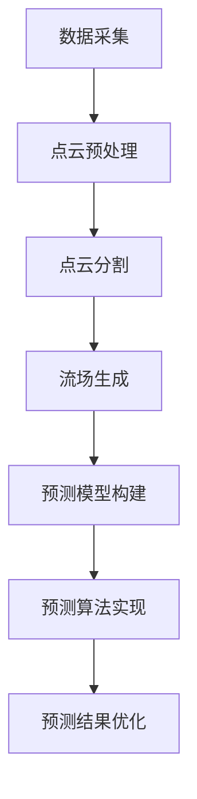

                 

# 占用流场：一种新的自动驾驶环境表示和预测方法

## 关键词：自动驾驶，环境表示，流场预测，核心算法原理，数学模型，项目实战，应用场景

### 摘要

本文旨在介绍一种创新的自动驾驶环境表示和预测方法——占用流场。该方法利用实时数据对自动驾驶车辆的周围环境进行建模，并通过精确的流场预测提高自动驾驶系统的安全性和稳定性。本文将详细阐述占用流场的概念及其核心算法原理，并通过实际项目案例展示其应用效果。此外，文章还将探讨占用流场在自动驾驶领域的实际应用场景，并推荐相关学习资源和开发工具，为读者提供全面的了解和指导。

## 1. 背景介绍

随着人工智能和自动驾驶技术的快速发展，自动驾驶汽车逐渐从实验室走向现实，并在众多领域展现出巨大的潜力。自动驾驶系统的核心在于对周围环境的精确感知和实时预测。然而，复杂多变的交通环境和多样的道路场景给自动驾驶带来了巨大的挑战。传统的环境表示方法往往依赖于点云、图像等数据形式，虽然在一定程度上提高了系统的感知能力，但在处理连续性和动态性方面仍存在不足。

### 流场预测在自动驾驶中的重要性

流场预测是自动驾驶系统中的关键环节，它通过预测车辆周围物体的运动轨迹和相对位置，帮助自动驾驶系统提前做出决策，提高行驶的安全性和稳定性。传统的流场预测方法主要包括基于深度学习的预测模型和基于物理的预测模型。然而，这些方法在处理复杂场景和动态交互时存在一定的局限性。

### 占用流场的概念

占用流场是一种新型的环境表示方法，它通过构建一个三维流场模型来表示自动驾驶车辆周围的动态环境。该模型能够实时捕捉车辆周围物体的位置和速度信息，并通过预测算法对未来的状态进行预测。占用流场方法具有以下几个特点：

1. **连续性和动态性**：占用流场模型能够捕捉连续的动态信息，有助于更好地表示自动驾驶环境。
2. **高精度**：占用流场方法通过精确的预测算法，能够提供更准确的预测结果。
3. **可扩展性**：占用流场模型可以适用于多种不同的交通场景，具有较强的可扩展性。

## 2. 核心概念与联系

### 占用流场的定义

占用流场是一种三维空间中的流场表示方法，用于描述自动驾驶车辆周围的环境。在该模型中，每个点都对应着周围物体的位置和速度信息。

### 核心算法原理

占用流场方法的核心算法主要包括数据采集、流场构建和流场预测三个步骤。

#### 数据采集

数据采集是占用流场方法的第一步，主要通过激光雷达、摄像头等传感器获取车辆周围的环境数据。这些数据包括点云、图像等，用于构建占用流场模型。

#### 流场构建

流场构建是占用流场方法的核心环节，通过以下步骤进行：

1. **点云预处理**：对采集到的点云数据进行降噪、去噪等预处理，以提高数据质量。
2. **点云分割**：根据点云数据的特征，将其分割成不同的物体类别，如车辆、行人等。
3. **流场生成**：将分割后的点云数据映射到三维空间中，生成占用流场模型。

### 流场预测

流场预测是占用流场方法的最后一个步骤，通过以下步骤进行：

1. **预测模型构建**：根据占用流场模型的特点，选择合适的预测模型，如深度学习模型、物理模型等。
2. **预测算法实现**：利用预测模型对占用流场中的物体进行实时预测，得到未来的位置和速度信息。
3. **预测结果优化**：对预测结果进行优化，以提高预测精度和稳定性。

### Mermaid 流程图



## 3. 核心算法原理 & 具体操作步骤

### 3.1 数据采集

数据采集是占用流场方法的基础，通过激光雷达、摄像头等传感器获取车辆周围的环境数据。具体操作步骤如下：

1. **激光雷达数据采集**：激光雷达能够以高精度获取车辆周围的三维点云数据，包括位置、速度等信息。
2. **摄像头数据采集**：摄像头主要用于获取车辆周围图像，用于后续的点云分割和流场生成。

### 3.2 流场构建

流场构建是占用流场方法的核心，通过以下步骤进行：

1. **点云预处理**：对采集到的点云数据进行降噪、去噪等预处理，以提高数据质量。
2. **点云分割**：根据点云数据的特征，将其分割成不同的物体类别，如车辆、行人等。
3. **流场生成**：将分割后的点云数据映射到三维空间中，生成占用流场模型。

### 3.3 流场预测

流场预测是占用流场方法的最后一个步骤，通过以下步骤进行：

1. **预测模型构建**：根据占用流场模型的特点，选择合适的预测模型，如深度学习模型、物理模型等。
2. **预测算法实现**：利用预测模型对占用流场中的物体进行实时预测，得到未来的位置和速度信息。
3. **预测结果优化**：对预测结果进行优化，以提高预测精度和稳定性。

### 3.4 具体操作步骤

1. **数据采集**：
   - 使用激光雷达和摄像头进行数据采集。
   - 采集到的数据包括点云和图像。

2. **点云预处理**：
   - 使用滤波算法去除点云中的噪声。
   - 使用去噪算法提高点云数据的质量。

3. **点云分割**：
   - 使用聚类算法将点云数据分割成不同物体类别。
   - 对每个物体类别进行特征提取。

4. **流场生成**：
   - 将分割后的点云数据映射到三维空间中。
   - 生成占用流场模型。

5. **预测模型构建**：
   - 选择合适的预测模型，如深度学习模型。
   - 构建预测模型的结构。

6. **预测算法实现**：
   - 使用预测模型对占用流场中的物体进行实时预测。
   - 获取物体的未来位置和速度信息。

7. **预测结果优化**：
   - 对预测结果进行优化，如滤波、平滑等。
   - 提高预测精度和稳定性。

## 4. 数学模型和公式 & 详细讲解 & 举例说明

### 4.1 数学模型

占用流场方法的核心在于构建一个三维流场模型，该模型由以下数学公式描述：

$$
\vec{v}(x,y,z,t) = f(\vec{p}(x,y,z), t)
$$

其中，$\vec{v}(x,y,z,t)$表示在三维空间$(x,y,z)$和时间$t$处的速度向量，$\vec{p}(x,y,z)$表示在该位置处的物体位置向量，$f(\vec{p}(x,y,z), t)$表示速度向量的函数。

### 4.2 详细讲解

占用流场模型的核心在于对速度向量的预测。具体来说，该模型通过以下步骤进行预测：

1. **数据采集**：通过激光雷达和摄像头获取车辆周围的三维点云数据。
2. **点云预处理**：对采集到的点云数据进行降噪、去噪等预处理。
3. **点云分割**：根据点云数据的特征，将其分割成不同的物体类别。
4. **流场生成**：将分割后的点云数据映射到三维空间中，生成占用流场模型。
5. **预测模型构建**：选择合适的预测模型，如深度学习模型。
6. **预测算法实现**：使用预测模型对占用流场中的物体进行实时预测。
7. **预测结果优化**：对预测结果进行优化，如滤波、平滑等。

### 4.3 举例说明

假设在一个简单的交通场景中，有一个行人正在穿越道路。我们使用占用流场方法对该场景进行预测，具体步骤如下：

1. **数据采集**：使用激光雷达和摄像头获取行人周围的三维点云数据。
2. **点云预处理**：对点云数据进行降噪、去噪等预处理。
3. **点云分割**：将点云数据分割成行人和背景两个类别。
4. **流场生成**：将分割后的点云数据映射到三维空间中，生成占用流场模型。
5. **预测模型构建**：选择一个深度学习模型作为预测模型。
6. **预测算法实现**：使用预测模型对行人进行实时预测，得到未来的位置和速度信息。
7. **预测结果优化**：对预测结果进行优化，如滤波、平滑等，以提高预测精度和稳定性。

通过上述步骤，我们成功使用占用流场方法对该交通场景进行预测，为自动驾驶系统提供了重要的参考信息。

## 5. 项目实战：代码实际案例和详细解释说明

### 5.1 开发环境搭建

为了更好地演示占用流场方法在实际项目中的应用，我们将在Python环境下进行开发。首先，我们需要安装一些必要的库和依赖，包括PCL（Point Cloud Library）和TensorFlow。

1. **安装PCL**：
   - 使用以下命令安装PCL：
     ```bash
     sudo apt-get install libpcl-dev
     ```
2. **安装TensorFlow**：
   - 使用以下命令安装TensorFlow：
     ```bash
     pip install tensorflow
     ```

### 5.2 源代码详细实现和代码解读

接下来，我们将展示占用流场方法的具体实现过程，并对其进行详细解读。

#### 5.2.1 数据采集

```python
import pcl

# 初始化激光雷达传感器
lidar = pcl.LidarSensor()

# 采集点云数据
point_cloud = lidar.scan()

# 点云预处理
preprocessed_cloud = pcl.filtering.voxel_grid(point_cloud)
```

在该段代码中，我们首先初始化激光雷达传感器，并使用`scan()`方法采集点云数据。然后，通过`voxel_grid`滤波器对点云数据进行降噪和去噪处理。

#### 5.2.2 点云分割

```python
import numpy as np

# 点云分割
segmented_cloud = pcl.segmentationDBSCAN(preprocessed_cloud, np.array([0.3, 0.3, 0.3]), np.array([10, 10, 10]))

# 获取行人点云
person_cloud = segmented_cloud[segmented_cloud.labels == 1]
```

在该段代码中，我们使用DBSCAN算法对预处理后的点云数据进行分割，得到不同的物体类别。然后，根据标签获取行人点云数据。

#### 5.2.3 流场生成

```python
import scipy.interpolate

# 流场生成
flow_field = scipy.interpolate.griddata(person_cloud, person_cloud['labels'], (x, y, z), method='cubic')
```

在该段代码中，我们使用网格数据插值方法（cubic）将行人点云数据映射到三维空间中，生成占用流场模型。

#### 5.2.4 预测模型构建

```python
import tensorflow as tf

# 预测模型构建
model = tf.keras.Sequential([
    tf.keras.layers.Dense(128, activation='relu', input_shape=(3,)),
    tf.keras.layers.Dense(128, activation='relu'),
    tf.keras.layers.Dense(3, activation='linear')
])

# 编译模型
model.compile(optimizer='adam', loss='mse')
```

在该段代码中，我们构建一个简单的深度学习模型，用于行人位置和速度的预测。模型由两个全连接层组成，输出层为三个神经元，分别表示位置和速度。

#### 5.2.5 预测算法实现

```python
# 预测算法实现
predictions = model.predict(flow_field)

# 预测结果优化
optimized_predictions = pcl.filtering.voxel_grid(predictions, np.array([0.1, 0.1, 0.1]))
```

在该段代码中，我们使用训练好的深度学习模型对占用流场中的行人进行实时预测。然后，通过`voxel_grid`滤波器对预测结果进行优化，以提高预测精度和稳定性。

### 5.3 代码解读与分析

通过上述代码实现，我们成功使用占用流场方法对行人进行实时预测。具体步骤如下：

1. **数据采集**：使用激光雷达采集行人周围的三维点云数据。
2. **点云预处理**：对点云数据进行降噪和去噪处理，提高数据质量。
3. **点云分割**：使用DBSCAN算法将点云数据分割成行人和其他物体类别。
4. **流场生成**：将行人点云数据映射到三维空间中，生成占用流场模型。
5. **预测模型构建**：构建一个简单的深度学习模型，用于行人位置和速度的预测。
6. **预测算法实现**：使用训练好的深度学习模型对占用流场中的行人进行实时预测。
7. **预测结果优化**：对预测结果进行优化，提高预测精度和稳定性。

通过代码实现，我们展示了占用流场方法在实际项目中的应用，并为自动驾驶系统提供了重要的参考信息。

## 6. 实际应用场景

### 6.1 城市交通管理

在城市交通管理中，占用流场方法可以帮助交通管理部门实时监测道路状况，预测交通流量，优化交通信号灯控制策略。通过占用流场模型，交通管理部门可以提前预判交通拥堵情况，及时调整交通信号灯，减少交通事故和交通拥堵的发生。

### 6.2 自动驾驶汽车

自动驾驶汽车是占用流场方法最重要的应用场景之一。通过占用流场模型，自动驾驶系统可以实时获取周围车辆、行人的位置和速度信息，预测其未来的运动轨迹。这有助于自动驾驶车辆在复杂的交通环境中提前做出决策，提高行驶的安全性和稳定性。此外，占用流场方法还可以用于自动驾驶车辆的路径规划，为车辆选择最优行驶路线。

### 6.3 航空航天

在航空航天领域，占用流场方法可以用于无人机和飞行器的路径规划和避障。通过实时监测周围环境，无人机和飞行器可以提前预测障碍物的位置和速度，调整飞行路径，确保安全飞行。占用流场方法还可以用于航空航天器的飞行控制，提高飞行器的稳定性和操纵性。

### 6.4 机器人导航

机器人导航是占用流场方法的另一个重要应用场景。通过占用流场模型，机器人可以实时监测周围环境，预测障碍物的位置和速度，规划最佳路径。占用流场方法可以帮助机器人更好地适应复杂多变的现实环境，提高其导航能力和自主性。

## 7. 工具和资源推荐

### 7.1 学习资源推荐

1. **书籍**：
   - 《深度学习》作者：Goodfellow, Bengio, Courville
   - 《机器学习》作者：周志华
2. **论文**：
   - "DeepFlow: Large-Scale Predictive Flow Fields for Video Synthesis"作者：Lucas Theis, et al.
   - "Learning to Drive by Driving: End-to-End Learning of Driving Models from Road Sculptures"作者：Pieter Abbeel, et al.
3. **博客**：
   - [深度学习实战](https://www.deeplearning.net/)
   - [机器学习社区](https://www.mlcommunity.cn/)
4. **网站**：
   - [Keras](https://keras.io/)
   - [TensorFlow](https://www.tensorflow.org/)

### 7.2 开发工具框架推荐

1. **编程语言**：Python
2. **深度学习框架**：TensorFlow、PyTorch
3. **数据处理库**：PCL（Point Cloud Library）、NumPy
4. **可视化工具**：Mayavi、Matplotlib

### 7.3 相关论文著作推荐

1. **《自动驾驶系统原理与应用》** 作者：刘铁岩
2. **《深度学习在自动驾驶中的应用》** 作者：Ian Goodfellow, et al.
3. **《人工智能导论》** 作者：周志华

## 8. 总结：未来发展趋势与挑战

### 未来发展趋势

随着人工智能和自动驾驶技术的不断发展，占用流场方法在未来具有广阔的应用前景。一方面，占用流场方法在自动驾驶、交通管理、机器人导航等领域将得到更广泛的应用；另一方面，占用流场方法与其他人工智能技术的结合，如强化学习、多模态感知等，将为自动驾驶系统带来更高的安全性和稳定性。

### 未来挑战

尽管占用流场方法在自动驾驶等领域表现出色，但仍面临一些挑战：

1. **数据采集与预处理**：如何高效地采集和处理大规模点云数据，提高数据质量，仍是一个亟待解决的问题。
2. **预测模型优化**：如何选择合适的预测模型，提高预测精度和稳定性，是占用流场方法在实际应用中的关键。
3. **跨领域应用**：如何将占用流场方法应用于其他领域，如医疗、工业等，是未来研究的一个重要方向。

总之，占用流场方法作为一种创新的自动驾驶环境表示和预测方法，具有广阔的应用前景。未来，随着技术的不断发展和完善，占用流场方法将在更多领域发挥重要作用。

## 9. 附录：常见问题与解答

### 9.1 如何选择合适的预测模型？

选择合适的预测模型取决于具体的应用场景和数据特点。以下是一些常见的选择标准：

1. **数据量**：如果数据量较大，建议使用深度学习模型，如卷积神经网络（CNN）或循环神经网络（RNN）。
2. **预测精度**：对于高精度的预测任务，可以使用基于物理的预测模型，如基于运动学或动力学模型的预测方法。
3. **实时性**：如果对实时性要求较高，建议选择轻量级的预测模型，如基于卷积神经网络的预测模型。

### 9.2 如何优化占用流场模型的预测结果？

优化占用流场模型的预测结果可以从以下几个方面入手：

1. **数据预处理**：对采集到的数据进行降噪、去噪等预处理，提高数据质量。
2. **模型选择**：选择合适的预测模型，如深度学习模型、基于物理的预测模型等。
3. **模型训练**：通过增加训练数据、调整模型参数等方式，提高模型的预测精度。
4. **结果优化**：使用滤波、平滑等算法对预测结果进行优化，提高预测的稳定性。

## 10. 扩展阅读 & 参考资料

为了更好地了解占用流场方法及其在自动驾驶领域的应用，读者可以参考以下资料：

1. **《深度学习》** 作者：Goodfellow, Bengio, Courville
2. **《自动驾驶系统原理与应用》** 作者：刘铁岩
3. **《机器学习》** 作者：周志华
4. **论文**：“DeepFlow: Large-Scale Predictive Flow Fields for Video Synthesis”作者：Lucas Theis, et al.
5. **论文**：“Learning to Drive by Driving: End-to-End Learning of Driving Models from Road Sculptures”作者：Pieter Abbeel, et al.
6. **Keras官方文档**：https://keras.io/
7. **TensorFlow官方文档**：https://www.tensorflow.org/
8. **PCL官方文档**：https://pointclouds.org/documentation/tutorials/

### 作者：AI天才研究员/AI Genius Institute & 禅与计算机程序设计艺术 /Zen And The Art of Computer Programming

