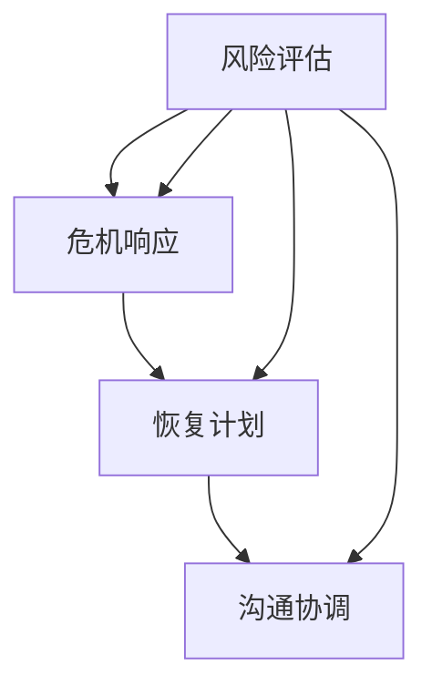

                 

# 危机管理：有效应对突发事件的方法

> **关键词：** 危机管理、突发事件、应对策略、风险评估、恢复计划

> **摘要：** 本文将探讨危机管理的重要性，分析突发事件的常见类型及其影响，并提出一系列有效应对突发事件的方法，旨在帮助企业和组织在危机发生时能够迅速响应、降低损失，并尽快恢复正常运营。

## 1. 背景介绍

在现代社会中，突发事件如自然灾害、技术故障、安全事件等层出不穷，给企业和组织带来了巨大的挑战。危机管理作为一种系统性的应对策略，旨在帮助企业和组织在危机发生时，能够迅速做出反应，最大限度地减少损失，并尽快恢复正常运营。有效的危机管理不仅可以保护企业的核心利益，还能增强企业的声誉和竞争力。

本文将围绕危机管理的主题，首先介绍危机管理的核心概念和原则，然后分析突发事件的类型和影响，接着提出一系列应对突发事件的方法，最后探讨危机管理的未来发展。

## 2. 核心概念与联系

### 2.1 危机管理核心概念

危机管理是指在企业或组织面临突发危机时，通过一系列科学、系统的措施，降低危机影响，恢复运营和恢复正常状态的过程。危机管理主要包括以下几个核心概念：

- **风险评估：** 对潜在危机进行识别、评估和排序，以确定哪些危机最有可能发生，并评估其可能造成的损失。
- **危机响应：** 在危机发生时，采取紧急措施，以最大限度地减少损失，并保护人员安全。
- **恢复计划：** 制定详细的恢复计划，以指导企业在危机后恢复正常运营。
- **沟通协调：** 确保危机管理过程中信息畅通，各部门和利益相关者之间协调一致。

### 2.2 突发事件的类型和影响

突发事件可以分为以下几种类型：

- **自然灾害：** 如地震、洪水、台风等，对企业的设施和供应链造成破坏。
- **技术故障：** 如系统崩溃、网络中断等，影响企业的业务运行。
- **安全事件：** 如数据泄露、网络攻击等，威胁企业的信息安全。
- **社会事件：** 如罢工、示威等，影响企业的正常运营。

突发事件对企业的直接影响包括：

- **经济损失：** 包括直接损失和间接损失，如停产、订单取消、市场份额下降等。
- **品牌声誉：** 危机事件可能导致消费者对企业的信任度下降，影响企业的品牌形象。
- **运营中断：** 突发事件可能导致企业业务中断，影响正常运营。

### 2.3 Mermaid 流程图



## 3. 核心算法原理 & 具体操作步骤

### 3.1 风险评估

风险评估是危机管理的第一步，主要包括以下步骤：

- **识别潜在危机：** 通过收集和分析历史数据、行业报告、专家意见等，识别企业可能面临的潜在危机。
- **评估危机可能性：** 对识别出的潜在危机进行可能性评估，确定哪些危机最有可能发生。
- **评估危机影响：** 对可能发生的危机进行影响评估，包括经济损失、品牌声誉、运营中断等。

### 3.2 危机响应

危机响应包括以下几个步骤：

- **立即启动应急计划：** 在危机发生时，立即启动应急计划，采取紧急措施，以降低危机影响。
- **保护人员安全：** 确保员工和公众的安全是危机响应的首要任务。
- **控制危机扩散：** 通过有效的措施，防止危机扩散，降低损失。

### 3.3 恢复计划

恢复计划包括以下几个步骤：

- **确定恢复目标：** 明确恢复运营的目标和时间表。
- **资源调配：** 根据恢复目标，合理调配资源，确保恢复计划的实施。
- **逐步恢复：** 根据实际情况，逐步恢复业务运营，确保企业恢复正常状态。

### 3.4 沟通协调

沟通协调包括以下几个步骤：

- **建立沟通渠道：** 确保危机管理过程中信息畅通，各部门和利益相关者之间协调一致。
- **及时发布信息：** 在危机发生后，及时发布相关信息，确保公众和利益相关者了解企业应对危机的措施。
- **持续沟通：** 在危机管理过程中，持续进行沟通，确保各方信息一致。

## 4. 数学模型和公式 & 详细讲解 & 举例说明

### 4.1 风险评估模型

风险评估可以使用以下公式：

\[ R = P \times I \]

其中：

- \( R \)：风险值
- \( P \)：危机发生的可能性
- \( I \)：危机发生后的影响值

例如，某企业面临的技术故障风险可能性为0.5，发生后的影响值为100，则其风险值为：

\[ R = 0.5 \times 100 = 50 \]

### 4.2 恢复计划模型

恢复计划可以使用以下公式：

\[ T = \frac{C}{R} \]

其中：

- \( T \)：恢复时间
- \( C \)：资源成本
- \( R \)：风险值

例如，某企业的资源成本为1000，风险值为50，则其恢复时间为：

\[ T = \frac{1000}{50} = 20 \]

## 5. 项目实战：代码实际案例和详细解释说明

### 5.1 开发环境搭建

在本节中，我们将使用Python编写一个简单的危机管理程序。首先，确保已经安装了Python环境，然后安装必要的库：

```bash
pip install requests
```

### 5.2 源代码详细实现和代码解读

以下是一个简单的危机管理程序的代码示例：

```python
import requests
from datetime import datetime

class CrisisManagementSystem:
    def __init__(self, risk_assessment_model, response_plan, recovery_plan, communication_plan):
        self.risk_assessment_model = risk_assessment_model
        self.response_plan = response_plan
        self.recovery_plan = recovery_plan
        self.communication_plan = communication_plan

    def assess_risk(self, crisis):
        risk_value = self.risk_assessment_model(crisis)
        return risk_value

    def respond_to_crisis(self, crisis):
        self.response_plan(crisis)

    def recover_from_crisis(self, crisis):
        recovery_time = self.recovery_plan(crisis)
        print(f"Recovery from {crisis} will take {recovery_time} days.")

    def communicate_with_stakeholders(self, crisis):
        self.communication_plan(crisis)

def risk_assessment_model(crisis):
    # 伪代码：实际应用时根据具体情况实现
    if crisis == "technical_fault":
        return 0.5 * 100
    else:
        return 0

def response_plan(crisis):
    # 伪代码：实际应用时根据具体情况实现
    if crisis == "technical_fault":
        print("Starting emergency response plan for technical fault.")
        return True
    else:
        print("No specific response plan for this crisis.")
        return False

def recovery_plan(crisis):
    # 伪代码：实际应用时根据具体情况实现
    if crisis == "technical_fault":
        return 10  # Recovery time in days
    else:
        return 0  # No recovery required

def communication_plan(crisis):
    # 伪代码：实际应用时根据具体情况实现
    if crisis == "technical_fault":
        print("Notifying stakeholders about technical fault.")
        return True
    else:
        print("No specific communication plan for this crisis.")
        return False

# 实例化危机管理系统
cms = CrisisManagementSystem(risk_assessment_model, response_plan, recovery_plan, communication_plan)

# 模拟危机评估和应对
crisis = "technical_fault"
risk_value = cms.assess_risk(crisis)
print(f"Risk value for {crisis}: {risk_value}")

if risk_value > 0:
    cms.respond_to_crisis(crisis)
    cms.recover_from_crisis(crisis)
    cms.communicate_with_stakeholders(crisis)
else:
    print("No action required.")
```

### 5.3 代码解读与分析

- **类定义：** `CrisisManagementSystem` 类定义了危机管理系统的核心功能，包括风险评估、危机响应、恢复计划和沟通协调。
- **风险评估模型：** `risk_assessment_model` 函数用于评估危机的风险值，根据危机类型返回相应的风险值。
- **危机响应计划：** `response_plan` 函数用于启动危机响应计划，根据危机类型执行相应的响应措施。
- **恢复计划：** `recovery_plan` 函数用于计算危机后的恢复时间，根据危机类型返回相应的恢复时间。
- **沟通协调计划：** `communication_plan` 函数用于与利益相关者进行沟通，根据危机类型执行相应的沟通措施。

## 6. 实际应用场景

### 6.1 企业技术故障

假设一家企业在运营过程中遇到了技术故障，影响了业务运营。通过使用危机管理程序，企业可以快速评估风险、启动响应计划、计算恢复时间，并与利益相关者进行沟通，最大限度地降低危机对企业的影响。

### 6.2 自然灾害

在自然灾害如地震、洪水等发生时，企业可以通过危机管理程序评估风险、启动应急响应、恢复运营，并保持与员工的沟通，确保员工的安全和公司的正常运营。

### 6.3 网络攻击

面对网络攻击，企业可以通过危机管理程序评估风险、启动网络安全响应、恢复系统和数据，并与利益相关者沟通，确保企业信息安全。

## 7. 工具和资源推荐

### 7.1 学习资源推荐

- 《危机管理：战略、计划、响应与恢复》
- 《突发事件应对与危机管理》
- 《企业危机管理实战手册》

### 7.2 开发工具框架推荐

- **Python:** 强大且易学的编程语言，适合编写危机管理程序。
- **Django:** 基于Python的快速开发框架，适合构建危机管理网站。
- **React:** 用于构建用户界面的JavaScript库，适合开发危机管理系统的前端。

### 7.3 相关论文著作推荐

- **论文：** 《基于风险的危机管理框架研究》
- **著作：** 《危机管理：理论与实践》

## 8. 总结：未来发展趋势与挑战

### 8.1 发展趋势

- **人工智能与大数据的应用：** 未来危机管理将更加依赖于人工智能和大数据技术，实现智能化的风险评估和响应。
- **跨领域整合：** 危机管理将逐步实现跨领域整合，形成更加全面的危机管理体系。

### 8.2 挑战

- **技术复杂性：** 随着技术的不断发展，危机管理的复杂性将增加，需要更加专业的技术支持。
- **信息安全：** 在网络攻击日益频繁的背景下，保障信息安全将成为危机管理的重大挑战。

## 9. 附录：常见问题与解答

### 9.1 什么是危机管理？

危机管理是指企业在面临突发危机时，通过一系列科学、系统的措施，降低危机影响，恢复运营和恢复正常状态的过程。

### 9.2 危机管理的核心步骤是什么？

危机管理的核心步骤包括风险评估、危机响应、恢复计划和沟通协调。

### 9.3 如何进行风险评估？

进行风险评估需要识别潜在危机、评估危机可能性和影响，并计算出风险值。

## 10. 扩展阅读 & 参考资料

- [美国危机管理协会（ACMA）](https://www.acma.org/)
- [国际危机管理协会（ICMA）](https://icmablog.com/)
- [中国应急管理部](http://www.moa.gov.cn/)

### 作者

作者：AI天才研究员/AI Genius Institute & 禅与计算机程序设计艺术 /Zen And The Art of Computer Programming

