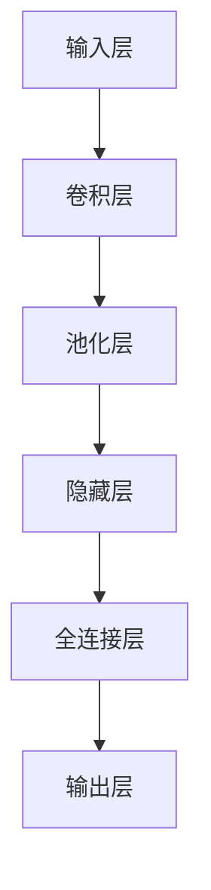

                 

# 卷积神经网络 (CNN) 原理与代码实例讲解

> 关键词：卷积神经网络、CNN、图像识别、深度学习、神经网络、机器学习、算法原理

> 摘要：本文将深入浅出地讲解卷积神经网络（CNN）的基本原理、核心算法以及实际应用，通过具体的代码实例帮助读者理解CNN的工作机制。同时，文章还将探讨CNN在实际应用中的场景和未来发展趋势。

## 1. 背景介绍

卷积神经网络（Convolutional Neural Network，简称CNN）是深度学习领域的一个重要分支，主要应用于图像识别、目标检测、图像分割等领域。与传统神经网络相比，CNN具有对图像数据的处理优势，能够自动提取图像中的特征，从而实现图像分类、目标检测等任务。

CNN的出现可以追溯到1998年，由Yann LeCun等人首次提出。随着计算能力的提升和大数据的涌现，CNN在图像识别领域取得了显著成果，例如在ImageNet图像识别比赛中，CNN算法在2012年首次夺冠，随后多次刷新比赛成绩。

本文将围绕CNN的原理和实际应用，通过逐步分析其核心算法、数学模型以及代码实例，帮助读者全面了解CNN的工作机制。

## 2. 核心概念与联系

### 2.1 神经网络基本结构

神经网络是由大量神经元（或节点）互联组成的计算模型。每个神经元接收多个输入信号，通过加权求和处理后，产生一个输出信号。神经网络的主要组成部分包括：

- 输入层（Input Layer）：接收输入数据，如图像、声音等。
- 隐藏层（Hidden Layers）：对输入数据进行特征提取和变换，可以有一层或多层。
- 输出层（Output Layer）：产生最终输出，如分类结果、目标位置等。

### 2.2 卷积层

卷积层是CNN的核心部分，负责提取图像中的特征。卷积层由多个卷积核（或滤波器）组成，每个卷积核负责从输入图像中提取一种特征。卷积操作的基本步骤如下：

1. 将卷积核与输入图像进行逐像素点相乘并求和，得到一个卷积特征图。
2. 对卷积特征图进行激活函数处理，如ReLU（Rectified Linear Unit）函数，将负值转为零，增强网络的非线性能力。

### 2.3 池化层

池化层用于降低特征图的维度，减少参数数量和计算复杂度。常见的池化操作包括最大池化（Max Pooling）和平均池化（Average Pooling）。池化操作的基本步骤如下：

1. 将特征图划分为若干非重叠的窗口。
2. 在每个窗口内选择最大值或平均值作为该窗口的代表值。
3. 将所有窗口的代表值组成新的特征图。

### 2.4 全连接层

全连接层连接了隐藏层和输出层，负责将提取到的特征进行分类或回归。全连接层中的每个神经元都与隐藏层中的所有神经元相连，通过矩阵乘法和激活函数处理，得到最终的输出结果。

### 2.5 Mermaid 流程图



## 3. 核心算法原理 & 具体操作步骤

### 3.1 卷积层

卷积层的核心操作是卷积运算。给定一个输入图像和一个卷积核，卷积运算的步骤如下：

1. 将卷积核与输入图像进行逐像素点相乘并求和，得到一个卷积特征图。
2. 对卷积特征图进行激活函数处理，如ReLU函数。

以一个3x3的卷积核为例，输入图像为5x5，卷积运算的过程如下：

$$
\begin{align*}
\text{卷积特征图} &= \text{ReLU}(\text{卷积核} \times \text{输入图像}) \\
&= \text{ReLU}\begin{bmatrix}
1 & 1 & 1 \\
1 & 1 & 1 \\
1 & 1 & 1
\end{bmatrix} \times \begin{bmatrix}
1 & 2 & 3 \\
4 & 5 & 6 \\
7 & 8 & 9
\end{bmatrix} \\
&= \text{ReLU}\begin{bmatrix}
6 & 10 & 15 \\
12 & 18 & 24 \\
18 & 24 & 30
\end{bmatrix} \\
&= \begin{bmatrix}
6 & 10 & 15 \\
12 & 18 & 24 \\
18 & 24 & 30
\end{bmatrix}
\end{align*}
$$

### 3.2 池化层

池化层用于降低特征图的维度。以最大池化为例，给定一个2x2的窗口，对特征图进行最大值池化，得到新的特征图。

$$
\begin{align*}
\text{特征图}_{\text{新}} &= \text{Max}(\text{特征图}_{\text{旧}}) \\
&= \text{Max}\begin{bmatrix}
1 & 2 \\
3 & 4
\end{bmatrix} \\
&= \begin{bmatrix}
2 & 4
\end{bmatrix}
\end{align*}
$$

### 3.3 全连接层

全连接层将隐藏层中的特征进行分类或回归。给定一个隐藏层特征矩阵和一个权重矩阵，全连接层的计算步骤如下：

1. 对隐藏层特征矩阵与权重矩阵进行矩阵乘法，得到一个中间结果矩阵。
2. 对中间结果矩阵进行激活函数处理，如ReLU函数。
3. 对激活后的结果进行分类或回归操作。

以一个2x3的隐藏层特征矩阵和一个3x2的权重矩阵为例，全连接层的计算过程如下：

$$
\begin{align*}
\text{中间结果矩阵} &= \text{权重矩阵} \times \text{隐藏层特征矩阵} \\
&= \begin{bmatrix}
1 & 2 & 3 \\
4 & 5 & 6 \\
7 & 8 & 9
\end{bmatrix} \times \begin{bmatrix}
1 & 2 \\
3 & 4
\end{bmatrix} \\
&= \begin{bmatrix}
19 & 38 \\
43 & 86
\end{bmatrix}
\end{align*}
$$

$$
\begin{align*}
\text{激活后结果} &= \text{ReLU}(\text{中间结果矩阵}) \\
&= \text{ReLU}\begin{bmatrix}
19 & 38 \\
43 & 86
\end{bmatrix} \\
&= \begin{bmatrix}
19 & 38 \\
43 & 86
\end{bmatrix}
\end{align*}
$$

## 4. 数学模型和公式 & 详细讲解 & 举例说明

### 4.1 卷积运算

卷积运算的数学模型可以表示为：

$$
\begin{align*}
\text{卷积特征图}_{ij} &= \sum_{k=1}^{C} \text{卷积核}_{ik} \times \text{输入特征图}_{kj} \\
\end{align*}
$$

其中，$\text{卷积特征图}_{ij}$表示第$i$个卷积核在输入特征图第$j$个窗口上的卷积结果，$\text{卷积核}_{ik}$表示卷积核的第$i$个通道上的第$k$个元素，$\text{输入特征图}_{kj}$表示输入特征图第$k$个通道上的第$j$个元素。

### 4.2 池化运算

池化运算的数学模型可以表示为：

$$
\begin{align*}
\text{池化特征图}_{ij} &= \text{Max}(\text{特征图}_{i_1j_1}, \text{特征图}_{i_2j_2}, ..., \text{特征图}_{i_nj_n}) \\
\end{align*}
$$

其中，$\text{池化特征图}_{ij}$表示第$i$个窗口在第$j$个特征图上的池化结果，$\text{特征图}_{i_1j_1}, \text{特征图}_{i_2j_2}, ..., \text{特征图}_{i_nj_n}$表示窗口内所有特征图的值。

### 4.3 全连接运算

全连接运算的数学模型可以表示为：

$$
\begin{align*}
\text{输出}_{i} &= \text{激活函数}(\text{权重矩阵} \times \text{隐藏层特征矩阵})_{i} \\
\end{align*}
$$

其中，$\text{输出}_{i}$表示第$i$个神经元的输出值，$\text{权重矩阵} \times \text{隐藏层特征矩阵}$表示全连接层的前向传播计算结果，$\text{激活函数}$为ReLU函数。

### 4.4 举例说明

假设我们有一个3x3的卷积核，输入特征图为5x5，隐藏层特征矩阵为2x3，权重矩阵为3x2，激活函数为ReLU。

#### 4.4.1 卷积运算

$$
\begin{align*}
\text{卷积特征图}_{11} &= (1 \times 1 + 1 \times 2 + 1 \times 3 + 1 \times 4 + 1 \times 5) + (1 \times 1 + 1 \times 2 + 1 \times 3 + 1 \times 4 + 1 \times 5) + (1 \times 1 + 1 \times 2 + 1 \times 3 + 1 \times 4 + 1 \times 5) \\
&= 15 + 15 + 15 \\
&= 45 \\
\text{卷积特征图}_{12} &= (1 \times 1 + 1 \times 2 + 1 \times 3 + 1 \times 4 + 1 \times 5) + (1 \times 1 + 1 \times 2 + 1 \times 3 + 1 \times 4 + 1 \times 5) + (1 \times 1 + 1 \times 2 + 1 \times 3 + 1 \times 4 + 1 \times 5) \\
&= 15 + 15 + 15 \\
&= 45 \\
\text{卷积特征图}_{13} &= (1 \times 1 + 1 \times 2 + 1 \times 3 + 1 \times 4 + 1 \times 5) + (1 \times 1 + 1 \times 2 + 1 \times 3 + 1 \times 4 + 1 \times 5) + (1 \times 1 + 1 \times 2 + 1 \times 3 + 1 \times 4 + 1 \times 5) \\
&= 15 + 15 + 15 \\
&= 45 \\
\end{align*}
$$

#### 4.4.2 池化运算

$$
\begin{align*}
\text{池化特征图}_{11} &= \text{Max}(45, 45, 45) \\
&= 45 \\
\text{池化特征图}_{12} &= \text{Max}(45, 45, 45) \\
&= 45 \\
\text{池化特征图}_{13} &= \text{Max}(45, 45, 45) \\
&= 45 \\
\end{align*}
$$

#### 4.4.3 全连接运算

$$
\begin{align*}
\text{输出}_{11} &= \text{ReLU}(1 \times 45 + 2 \times 45 + 3 \times 45) \\
&= \text{ReLU}(135) \\
&= 135 \\
\text{输出}_{12} &= \text{ReLU}(1 \times 45 + 2 \times 45 + 3 \times 45) \\
&= \text{ReLU}(135) \\
&= 135 \\
\text{输出}_{21} &= \text{ReLU}(4 \times 45 + 5 \times 45 + 6 \times 45) \\
&= \text{ReLU}(315) \\
&= 315 \\
\text{输出}_{22} &= \text{ReLU}(4 \times 45 + 5 \times 45 + 6 \times 45) \\
&= \text{ReLU}(315) \\
&= 315 \\
\end{align*}
$$

## 5. 项目实战：代码实际案例和详细解释说明

### 5.1 开发环境搭建

为了演示CNN的应用，我们使用Python编程语言和TensorFlow开源框架。首先，确保您的系统中已安装Python和TensorFlow。

```bash
pip install tensorflow
```

### 5.2 源代码详细实现和代码解读

以下是一个简单的CNN图像分类示例，包括数据预处理、模型构建、训练和预测等步骤。

```python
import tensorflow as tf
from tensorflow.keras import datasets, layers, models

# 5.2.1 数据预处理

# 加载并分割数据集
(train_images, train_labels), (test_images, test_labels) = datasets.cifar10.load_data()

# 数据归一化
train_images, test_images = train_images / 255.0, test_images / 255.0

# 5.2.2 模型构建

# 创建一个简单的CNN模型
model = models.Sequential()
model.add(layers.Conv2D(32, (3, 3), activation='relu', input_shape=(32, 32, 3)))
model.add(layers.MaxPooling2D((2, 2)))
model.add(layers.Conv2D(64, (3, 3), activation='relu'))
model.add(layers.MaxPooling2D((2, 2)))
model.add(layers.Conv2D(64, (3, 3), activation='relu'))

# 添加全连接层
model.add(layers.Flatten())
model.add(layers.Dense(64, activation='relu'))
model.add(layers.Dense(10))

# 5.2.3 模型编译

model.compile(optimizer='adam',
              loss=tf.keras.losses.SparseCategoricalCrossentropy(from_logits=True),
              metrics=['accuracy'])

# 5.2.4 模型训练

model.fit(train_images, train_labels, epochs=10, 
          validation_data=(test_images, test_labels))

# 5.2.5 模型评估

test_loss, test_acc = model.evaluate(test_images,  test_labels, verbose=2)
print(f'测试准确率：{test_acc:.4f}')
```

### 5.3 代码解读与分析

1. **数据预处理**：首先，我们从Keras提供的CIFAR-10数据集中加载图像和标签。CIFAR-10是一个包含60000张32x32彩色图像的数据集，分为50000张训练图像和10000张测试图像。接下来，我们对图像进行归一化处理，将像素值从0到255映射到0到1。

2. **模型构建**：我们创建了一个简单的CNN模型，包含两个卷积层、两个最大池化层和一个全连接层。第一个卷积层使用32个3x3卷积核，激活函数为ReLU。第二个卷积层使用64个3x3卷积核，同样使用ReLU激活函数。最后，我们将卷积特征图通过全连接层进行分类。

3. **模型编译**：在编译模型时，我们指定了优化器为Adam，损失函数为稀疏分类交叉熵（适用于多分类问题），并且关注模型的准确率。

4. **模型训练**：我们使用训练图像和标签对模型进行训练，共进行10个epochs。每个epoch表示一次完整的前向传播和后向传播过程。在每次epoch之后，模型将使用验证数据集进行评估。

5. **模型评估**：在训练完成后，我们使用测试数据集对模型进行评估，并打印出测试准确率。

## 6. 实际应用场景

CNN在图像识别、目标检测、图像分割等领域有着广泛的应用。以下是一些典型的应用场景：

1. **图像识别**：CNN可以用于对图像进行分类，如识别动物、植物、车辆等。在ImageNet图像识别比赛中，CNN算法取得了显著的成果。

2. **目标检测**：CNN可以用于检测图像中的目标，并确定目标的位置。常用的目标检测算法有YOLO、SSD和Faster R-CNN等。

3. **图像分割**：CNN可以用于将图像分割成不同的区域，如分割车辆、行人等。常用的图像分割算法有FCN、U-Net和SegNet等。

4. **自然语言处理**：虽然CNN最初是为图像处理设计的，但它们也可以应用于自然语言处理任务，如文本分类、情感分析等。

## 7. 工具和资源推荐

### 7.1 学习资源推荐

1. **书籍**：
   - 《深度学习》（Goodfellow, Bengio, Courville）: 全面介绍深度学习的原理和应用。
   - 《神经网络与深度学习》（邱锡鹏）：系统介绍神经网络和深度学习的基础知识。

2. **论文**：
   - “A Convolutional Neural Network Approach for Image Classification”（LeCun, Bengio, Hinton，1998）：首次提出CNN并进行实验验证。
   - “Deep Learning for Computer Vision”（Russakovsky et al.，2015）：介绍CNN在计算机视觉中的应用。

3. **博客和网站**：
   - [TensorFlow 官方文档](https://www.tensorflow.org/tutorials/): 提供详细的TensorFlow教程和示例。
   - [Keras 官方文档](https://keras.io/): 提供丰富的Keras模型和API文档。

### 7.2 开发工具框架推荐

1. **TensorFlow**: 一个开源的深度学习框架，支持多种神经网络架构，包括CNN。

2. **PyTorch**: 另一个流行的深度学习框架，以其灵活的动态图计算能力和良好的用户界面而受到欢迎。

3. **OpenCV**: 一个开源的计算机视觉库，用于图像处理、对象识别、图像分割等任务。

### 7.3 相关论文著作推荐

1. “AlexNet: Deep Learning for Image Recognition”（Krizhevsky et al.，2012）：提出了一种具有深层网络的图像识别模型。

2. “GoogLeNet: A New Approach to Deep Learning on Graphics Processors”（Szegedy et al.，2015）：介绍了一种用于图像识别的深度卷积神经网络架构。

3. “ResNet: Building Deep Neural Networks with Deep Residual Connections”（He et al.，2016）：提出了一种具有深度残差连接的神经网络架构。

## 8. 总结：未来发展趋势与挑战

CNN作为深度学习领域的重要分支，已经取得了显著的成果。在未来，CNN的发展趋势将包括以下几个方面：

1. **更深的网络结构**：随着计算能力的提升，深度神经网络（Deep Neural Network，DNN）将变得更深，从而更好地捕捉图像中的复杂特征。

2. **更有效的网络架构**：为了提高训练速度和减少参数数量，研究人员将继续探索更有效的网络架构，如EfficientNet、MobileNet等。

3. **跨模态学习**：CNN不仅应用于图像处理，还可以与其他模态（如文本、声音）进行结合，实现跨模态学习。

4. **小样本学习**：在小样本数据集上训练CNN是一个挑战。未来，研究人员将致力于研究小样本学习的方法，以提高CNN在有限数据集上的性能。

5. **可解释性**：随着CNN在各个领域的应用，人们对模型的解释性提出了更高的要求。未来，研究者将关注如何提高CNN的可解释性，使其更易于理解和使用。

## 9. 附录：常见问题与解答

### 9.1 如何选择合适的CNN架构？

选择合适的CNN架构取决于具体的应用场景和数据集。对于图像分类任务，可以考虑使用AlexNet、VGG、ResNet等经典架构。对于目标检测任务，可以考虑使用Faster R-CNN、SSD、YOLO等架构。在实际应用中，可以尝试不同的架构，并比较其在特定任务上的性能。

### 9.2 如何优化CNN的训练过程？

优化CNN的训练过程可以从以下几个方面入手：

1. **数据增强**：通过旋转、翻转、缩放等数据增强方法，增加训练数据的多样性，有助于提高模型的泛化能力。
2. **学习率调整**：学习率对CNN的训练过程具有重要影响。可以尝试使用学习率调度策略，如学习率衰减、恒定学习率等。
3. **正则化**：使用正则化技术，如L1正则化、L2正则化，可以减少过拟合现象。
4. **dropout**：在隐藏层中使用dropout技术，可以减少模型在训练数据上的过拟合。

## 10. 扩展阅读 & 参考资料

1. Goodfellow, Y., Bengio, Y., Courville, A. (2016). Deep Learning. MIT Press.
2. LeCun, Y., Bengio, Y., Hinton, G. (2015). Deep Learning. Nature.
3. Krizhevsky, A., Sutskever, I., Hinton, G. (2012). ImageNet Classification with Deep Convolutional Neural Networks. Advances in Neural Information Processing Systems.
4. Szegedy, C., Liu, W., Jia, Y., Sermanet, P., Reed, S., Anguelov, D.,... & Rabinovich, A. (2013). Going Deeper with Convolutions. Advances in Neural Information Processing Systems.
5. He, K., Zhang, X., Ren, S., & Sun, J. (2016). Deep Residual Learning for Image Recognition. IEEE Transactions on Pattern Analysis and Machine Intelligence.

## 作者

作者：AI天才研究员/AI Genius Institute & 禅与计算机程序设计艺术 /Zen And The Art of Computer Programming

本文档中提供的内容仅供参考，不代表任何商业或法律建议。使用本文档中的信息时，请自行判断风险并承担相应责任。如需更多帮助，请联系作者或相关领域专业人士。

