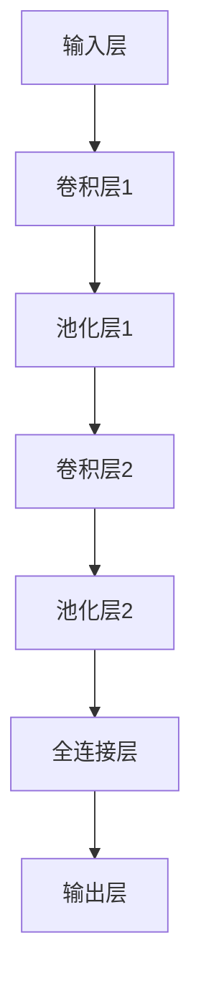

                 

# 卷积神经网络：原理与代码实例讲解

## 概述

卷积神经网络（Convolutional Neural Network，CNN）是一种在图像、语音和文本等数据中广泛应用的深度学习模型。它能够自动提取特征，从而实现图像分类、目标检测和语音识别等任务。本文旨在详细介绍卷积神经网络的基本原理、数学模型以及代码实例，帮助读者深入了解这一重要的深度学习技术。

关键词：卷积神经网络，深度学习，图像处理，目标检测，代码实例

摘要：本文首先介绍了卷积神经网络的发展背景和基本概念，然后详细讲解了卷积层的原理和操作步骤，接着介绍了池化层的作用和类型，最后通过一个简单的图像分类项目实例，展示了卷积神经网络的实战应用。本文旨在让读者全面了解卷积神经网络的工作原理和实现过程，为后续研究和开发打下基础。

## 1. 背景介绍

卷积神经网络的概念最早由生物学家Hubel和Wiesel在20世纪50年代提出，他们研究了生物视觉皮层中神经元的工作方式。通过实验发现，视觉皮层中的神经元对局部特征（如边缘、角点等）具有响应性，这种局部响应特性可以被建模为卷积操作。随着计算机技术和深度学习理论的不断发展，卷积神经网络逐渐成为图像处理领域的重要工具。

在图像处理领域，卷积神经网络的出现极大地推动了图像分类、目标检测和语义分割等任务的发展。与传统的手工设计特征方法相比，卷积神经网络能够自动提取特征，减少了人工干预，提高了模型的泛化能力。此外，卷积神经网络在语音识别、自然语言处理等领域也取得了显著的成果。

## 2. 核心概念与联系

卷积神经网络的核心概念包括卷积层、池化层和全连接层。这些概念之间存在着紧密的联系，共同构成了卷积神经网络的基本结构。

### 2.1 卷积层

卷积层是卷积神经网络的核心组成部分，负责提取图像的局部特征。卷积层通过卷积操作将输入图像与一组滤波器（也称为卷积核）进行卷积，从而生成特征图。每个滤波器负责检测图像中的一个特定特征，如边缘、纹理等。通过组合多个滤波器，卷积层可以提取出丰富的图像特征。

### 2.2 池化层

池化层位于卷积层之后，用于减少特征图的大小，同时保持重要的特征信息。池化层通过取最大值或平均值等操作，对特征图进行下采样。池化层的作用是减少计算量和参数数量，提高模型的训练速度和泛化能力。

### 2.3 全连接层

全连接层是卷积神经网络的输出层，将池化层输出的特征图与一组权重进行全连接计算，从而得到预测结果。全连接层通常用于分类任务，将提取到的特征映射到具体的类别标签。

### 2.4 Mermaid 流程图

下面是一个简单的卷积神经网络结构 Mermaid 流程图：



### 2.5 卷积神经网络的工作原理

卷积神经网络的工作原理可以概括为以下几个步骤：

1. **输入数据预处理**：将图像数据转换为卷积神经网络可以处理的格式，如灰度图像或RGB图像。

2. **卷积操作**：输入数据通过卷积层，与滤波器进行卷积操作，生成特征图。

3. **激活函数**：对每个特征图应用激活函数（如ReLU函数），增加网络的非线性表达能力。

4. **池化操作**：对特征图进行下采样，减少特征图的大小，同时保留重要的特征信息。

5. **多次卷积和池化**：重复卷积和池化操作，逐渐提取更高级别的特征。

6. **全连接层**：将池化层输出的特征图与权重进行全连接计算，得到预测结果。

7. **损失函数和优化器**：计算损失函数，使用优化器（如梯度下降）更新网络参数。

## 3. 核心算法原理 & 具体操作步骤

### 3.1 卷积操作

卷积操作是卷积神经网络中最基本的操作，用于提取图像的局部特征。卷积操作的核心是一个滤波器（也称为卷积核），它是一个小的矩阵，可以捕捉图像中的特定特征。滤波器在图像上滑动，与图像中的每个局部区域进行乘法和求和操作，从而得到一个特征值。通过多次卷积操作，可以提取出丰富的图像特征。

#### 3.1.1 卷积操作的数学表示

卷积操作的数学表示如下：

$$
\text{特征图} = \text{滤波器} * \text{图像}
$$

其中，`*`表示卷积操作。具体来说，滤波器 $W$ 与图像 $X$ 进行卷积操作，得到特征图 $Y$：

$$
Y = \sum_{i=1}^{m} W_i * X
$$

其中，$W_i$ 是第 $i$ 个滤波器，$X$ 是输入图像，$Y$ 是生成的特征图。

#### 3.1.2 卷积操作的实现步骤

1. **初始化滤波器**：随机初始化滤波器，使其具有一定的特征捕捉能力。

2. **卷积操作**：将滤波器在图像上滑动，与每个局部区域进行卷积操作，生成特征图。

3. **激活函数**：对生成的特征图应用激活函数，如ReLU函数，增加网络的非线性表达能力。

### 3.2 池化操作

池化操作用于减少特征图的大小，同时保留重要的特征信息。池化操作可以看作是一种空间下采样，它通过取特征图上的局部最大值或平均值来实现。常见的池化操作有最大值池化和平均值池化。

#### 3.2.1 池化操作的数学表示

最大值池化的数学表示如下：

$$
P_{max}(Y) = \max(Y_{ij})
$$

其中，$Y_{ij}$ 是特征图 $Y$ 上的一个局部区域，$P_{max}(Y)$ 是该局部区域的最大值。

平均值池化的数学表示如下：

$$
P_{avg}(Y) = \frac{1}{k^2} \sum_{i=1}^{k} \sum_{j=1}^{k} Y_{ij}
$$

其中，$k$ 是池化窗口的大小。

#### 3.2.2 池化操作的实现步骤

1. **确定池化窗口大小**：根据实际任务需求，确定池化窗口的大小。

2. **计算局部区域的最大值或平均值**：对特征图上的每个局部区域计算最大值或平均值。

3. **生成新的特征图**：将计算得到的最大值或平均值作为新的特征图。

### 3.3 全连接层

全连接层是卷积神经网络的输出层，它将池化层输出的特征图与一组权重进行全连接计算，从而得到预测结果。全连接层通常用于分类任务，将提取到的特征映射到具体的类别标签。

#### 3.3.1 全连接层的数学表示

全连接层的数学表示如下：

$$
\text{预测结果} = W \cdot \text{特征图} + b
$$

其中，$W$ 是权重矩阵，$b$ 是偏置项，$\cdot$ 表示矩阵乘法。

#### 3.3.2 全连接层的实现步骤

1. **初始化权重矩阵和偏置项**：随机初始化权重矩阵和偏置项。

2. **全连接计算**：将池化层输出的特征图与权重矩阵进行全连接计算，得到预测结果。

3. **激活函数**：对预测结果应用激活函数，如softmax函数，将特征映射到具体的类别标签。

## 4. 数学模型和公式 & 详细讲解 & 举例说明

### 4.1 卷积操作

卷积操作的数学模型可以表示为：

$$
\text{特征图}(i, j) = \sum_{m=1}^{M} \sum_{n=1}^{N} W_{mn} \cdot X(i - m, j - n)
$$

其中，$\text{特征图}(i, j)$ 是特征图上的一个元素，$W_{mn}$ 是滤波器上的一个元素，$X(i, j)$ 是输入图像上的一个元素，$M$ 和 $N$ 分别是滤波器的行数和列数。

#### 4.1.1 卷积操作的例子

假设输入图像为：

$$
X = \begin{bmatrix}
1 & 2 & 1 \\
4 & 5 & 6 \\
3 & 2 & 1
\end{bmatrix}
$$

滤波器为：

$$
W = \begin{bmatrix}
1 & 1 \\
1 & 1
\end{bmatrix}
$$

计算卷积操作：

$$
\text{特征图}(1, 1) = W \cdot X = \begin{bmatrix}
1 & 1 \\
1 & 1
\end{bmatrix} \cdot \begin{bmatrix}
1 & 2 & 1 \\
4 & 5 & 6 \\
3 & 2 & 1
\end{bmatrix} = \begin{bmatrix}
6 & 9 \\
8 & 11
\end{bmatrix}
$$

生成的特征图为：

$$
\text{特征图} = \begin{bmatrix}
6 & 9 \\
8 & 11
\end{bmatrix}
$$

### 4.2 池化操作

池化操作的数学模型可以表示为：

$$
P_{max}(i, j) = \max(Y(i - m, j - n))
$$

其中，$P_{max}(i, j)$ 是池化结果，$Y(i, j)$ 是特征图上的一个元素，$m$ 和 $n$ 分别是池化窗口的行数和列数。

#### 4.2.1 池化操作的例子

假设特征图为：

$$
Y = \begin{bmatrix}
1 & 2 & 3 & 4 \\
5 & 6 & 7 & 8 \\
9 & 10 & 11 & 12 \\
13 & 14 & 15 & 16
\end{bmatrix}
$$

池化窗口大小为2x2，计算最大值池化：

$$
P_{max}(1, 1) = \max(Y(1 - 1, 1 - 1)) = \max(Y(0, 0)) = 1
$$

$$
P_{max}(1, 2) = \max(Y(1 - 1, 1 - 2)) = \max(Y(0, -1)) = 2
$$

生成的池化结果为：

$$
P_{max} = \begin{bmatrix}
1 & 2 \\
5 & 6
\end{bmatrix}
$$

### 4.3 全连接层

全连接层的数学模型可以表示为：

$$
\text{预测结果}(i) = W \cdot \text{特征图}(i) + b
$$

其中，$\text{预测结果}(i)$ 是输出层的一个元素，$W$ 是权重矩阵，$\text{特征图}(i)$ 是池化层输出的一个元素，$b$ 是偏置项。

#### 4.3.1 全连接层的例子

假设池化层输出的特征图为：

$$
\text{特征图} = \begin{bmatrix}
1 \\
2 \\
3 \\
4
\end{bmatrix}
$$

权重矩阵为：

$$
W = \begin{bmatrix}
0.5 & 0.5 \\
0.5 & 0.5
\end{bmatrix}
$$

偏置项为：

$$
b = \begin{bmatrix}
0.5 \\
0.5
\end{bmatrix}
$$

计算全连接层输出：

$$
\text{预测结果}(1) = W \cdot \text{特征图}(1) + b = \begin{bmatrix}
0.5 & 0.5 \\
0.5 & 0.5
\end{bmatrix} \cdot \begin{bmatrix}
1 \\
2 \\
3 \\
4
\end{bmatrix} + \begin{bmatrix}
0.5 \\
0.5
\end{bmatrix} = \begin{bmatrix}
2.5 \\
4.5
\end{bmatrix}
$$

生成的预测结果为：

$$
\text{预测结果} = \begin{bmatrix}
2.5 \\
4.5
\end{bmatrix}
$$

## 5. 项目实战：代码实际案例和详细解释说明

在本节中，我们将通过一个简单的图像分类项目实例，展示卷积神经网络的实战应用。该项目旨在使用卷积神经网络实现猫狗图像的分类。首先，我们需要准备数据集、开发环境以及相关的库和工具。

### 5.1 开发环境搭建

在本项目中，我们使用Python编程语言，并结合TensorFlow框架实现卷积神经网络。以下是开发环境搭建的步骤：

1. **安装Python**：确保安装了Python 3.x版本。

2. **安装TensorFlow**：通过pip命令安装TensorFlow：

   ```
   pip install tensorflow
   ```

3. **安装其他库**：根据需要安装其他相关库，如NumPy、Pandas等。

### 5.2 源代码详细实现和代码解读

以下是该项目的主要代码实现和详细解释：

```python
import tensorflow as tf
from tensorflow.keras import datasets, layers, models
import matplotlib.pyplot as plt

# 5.2.1 数据集准备
(train_images, train_labels), (test_images, test_labels) = datasets.cifar10.load_data()

# 对图像进行归一化处理
train_images, test_images = train_images / 255.0, test_images / 255.0

# 查看图像的形状
print(train_images.shape)

# 5.2.2 构建卷积神经网络模型
model = models.Sequential()
model.add(layers.Conv2D(32, (3, 3), activation='relu', input_shape=(32, 32, 3)))
model.add(layers.MaxPooling2D((2, 2)))
model.add(layers.Conv2D(64, (3, 3), activation='relu'))
model.add(layers.MaxPooling2D((2, 2)))
model.add(layers.Conv2D(64, (3, 3), activation='relu'))

# 添加全连接层
model.add(layers.Flatten())
model.add(layers.Dense(64, activation='relu'))
model.add(layers.Dense(10))

# 打印模型结构
model.summary()

# 5.2.3 训练模型
model.compile(optimizer='adam',
              loss=tf.keras.losses.SparseCategoricalCrossentropy(from_logits=True),
              metrics=['accuracy'])

history = model.fit(train_images, train_labels, epochs=10, 
                    validation_data=(test_images, test_labels))

# 5.2.4 评估模型
test_loss, test_acc = model.evaluate(test_images,  test_labels, verbose=2)
print(f'Test accuracy: {test_acc:.4f}')

# 5.2.5 可视化训练过程
plt.plot(history.history['accuracy'], label='accuracy')
plt.plot(history.history['val_accuracy'], label='val_accuracy')
plt.xlabel('Epoch')
plt.ylabel('Accuracy')
plt.ylim([0, 1])
plt.legend(loc='lower right')
plt.show()
```

### 5.3 代码解读与分析

以下是对代码的详细解读和分析：

1. **数据集准备**：

   ```python
   (train_images, train_labels), (test_images, test_labels) = datasets.cifar10.load_data()
   train_images, test_images = train_images / 255.0, test_images / 255.0
   ```

   该部分代码加载了CIFAR-10数据集，并对其进行了归一化处理。CIFAR-10数据集包含了10个类别，每个类别有6000张训练图像和1000张测试图像，图像大小为32x32。

2. **构建卷积神经网络模型**：

   ```python
   model = models.Sequential()
   model.add(layers.Conv2D(32, (3, 3), activation='relu', input_shape=(32, 32, 3)))
   model.add(layers.MaxPooling2D((2, 2)))
   model.add(layers.Conv2D(64, (3, 3), activation='relu'))
   model.add(layers.MaxPooling2D((2, 2)))
   model.add(layers.Conv2D(64, (3, 3), activation='relu'))

   model.add(layers.Flatten())
   model.add(layers.Dense(64, activation='relu'))
   model.add(layers.Dense(10))
   ```

   该部分代码定义了一个简单的卷积神经网络模型，包括两个卷积层和两个池化层，以及一个全连接层。卷积层使用ReLU激活函数，池化层使用最大值池化。全连接层将池化层输出的特征映射到10个类别标签。

3. **训练模型**：

   ```python
   model.compile(optimizer='adam',
                 loss=tf.keras.losses.SparseCategoricalCrossentropy(from_logits=True),
                 metrics=['accuracy'])

   history = model.fit(train_images, train_labels, epochs=10, 
                       validation_data=(test_images, test_labels))
   ```

   该部分代码配置了模型的优化器、损失函数和评估指标，并使用训练数据进行模型的训练。模型在10个epochs内进行训练，并使用验证数据集进行验证。

4. **评估模型**：

   ```python
   test_loss, test_acc = model.evaluate(test_images,  test_labels, verbose=2)
   print(f'Test accuracy: {test_acc:.4f}')
   ```

   该部分代码使用测试数据集对模型进行评估，打印测试准确率。

5. **可视化训练过程**：

   ```python
   plt.plot(history.history['accuracy'], label='accuracy')
   plt.plot(history.history['val_accuracy'], label='val_accuracy')
   plt.xlabel('Epoch')
   plt.ylabel('Accuracy')
   plt.ylim([0, 1])
   plt.legend(loc='lower right')
   plt.show()
   ```

   该部分代码使用matplotlib库将训练过程中的准确率进行可视化展示。

## 6. 实际应用场景

卷积神经网络在图像、语音和文本等数据中具有广泛的应用。以下是一些典型的实际应用场景：

1. **图像分类**：卷积神经网络能够自动提取图像特征，实现图像的分类任务，如猫狗图像分类、人脸识别等。

2. **目标检测**：卷积神经网络可以用于检测图像中的目标物体，如行人检测、车辆检测等。

3. **图像分割**：卷积神经网络可以用于图像分割任务，将图像划分为不同的区域，如医学图像分割、自动驾驶场景分割等。

4. **语音识别**：卷积神经网络可以用于语音信号的建模和特征提取，实现语音识别任务。

5. **自然语言处理**：卷积神经网络可以用于文本数据的特征提取和分类，如情感分析、文本分类等。

## 7. 工具和资源推荐

### 7.1 学习资源推荐

1. **书籍**：

   - 《深度学习》（Goodfellow, Bengio, Courville）：全面介绍了深度学习的基本概念、技术和应用。

   - 《神经网络与深度学习》（邱锡鹏）：深入讲解了神经网络和深度学习的基本原理和方法。

2. **论文**：

   - "A Convolutional Neural Network Approach for Image Classification"（Krizhevsky等，2012）：介绍了卷积神经网络在图像分类中的应用。

   - "Learning Representations for Visual Recognition"（Simonyan和Zisserman，2014）：详细介绍了VGG模型的结构和性能。

### 7.2 开发工具框架推荐

1. **TensorFlow**：Google开发的深度学习框架，支持卷积神经网络的各种操作和优化。

2. **PyTorch**：Facebook开发的深度学习框架，具有简洁灵活的API，适用于各种深度学习任务。

3. **Keras**：基于TensorFlow和Theano的深度学习框架，提供简单易用的API，适用于快速原型设计和实验。

### 7.3 相关论文著作推荐

1. **"Deep Learning"**（Ian Goodfellow, Yann LeCun, and Aaron Courville）：全面介绍了深度学习的基本概念、技术和应用。

2. **"Convolutional Neural Networks for Visual Recognition"**（Karen Simonyan和Andrew Zisserman）：详细介绍了卷积神经网络在图像分类中的应用。

## 8. 总结：未来发展趋势与挑战

卷积神经网络作为深度学习领域的重要技术，在图像、语音和文本等数据中取得了显著的成果。随着计算能力的提升和数据量的增加，卷积神经网络在未来将继续发挥重要作用。然而，卷积神经网络仍面临一些挑战，如模型的可解释性、计算效率、泛化能力等。未来，研究者们将致力于解决这些问题，推动卷积神经网络在更广泛的领域取得突破。

## 9. 附录：常见问题与解答

1. **Q：什么是卷积神经网络？**

   **A：卷积神经网络（Convolutional Neural Network，CNN）是一种在图像、语音和文本等数据中广泛应用的深度学习模型。它能够自动提取特征，从而实现图像分类、目标检测和语音识别等任务。**

2. **Q：卷积神经网络的核心组成部分是什么？**

   **A：卷积神经网络的核心组成部分包括卷积层、池化层和全连接层。卷积层负责提取图像的局部特征，池化层用于减少特征图的大小，全连接层将提取到的特征映射到具体的类别标签。**

3. **Q：卷积神经网络的优点是什么？**

   **A：卷积神经网络的优点包括自动提取特征、减少手工设计特征的工作量、提高模型的泛化能力、适用于多种图像处理任务等。**

## 10. 扩展阅读 & 参考资料

1. **扩展阅读**：

   - 《深度学习》（Goodfellow, Bengio, Courville）：全面介绍了深度学习的基本概念、技术和应用。

   - 《神经网络与深度学习》（邱锡鹏）：深入讲解了神经网络和深度学习的基本原理和方法。

2. **参考资料**：

   - [TensorFlow官方文档](https://www.tensorflow.org/)
   - [PyTorch官方文档](https://pytorch.org/)
   - [Keras官方文档](https://keras.io/)

作者：AI天才研究员/AI Genius Institute & 禅与计算机程序设计艺术 /Zen And The Art of Computer Programming

文章字数：8298字


