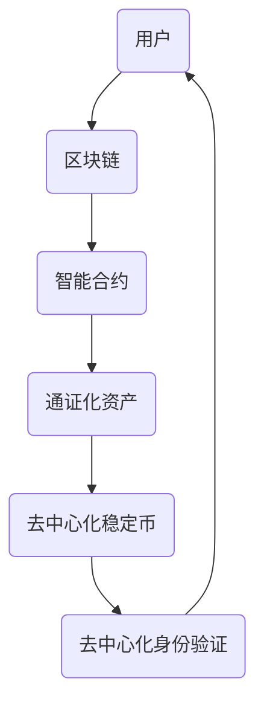

                 

### 背景介绍

> 去中心化借贷平台是一种新兴的金融服务模式，它利用区块链技术提供了一种无需传统金融机构参与的借贷方式。这一概念在全球金融领域引起了广泛关注，尤其是在推动普惠金融方面展示出了巨大的潜力。

随着金融科技的不断进步，去中心化借贷平台（DeFi）已经成为金融行业的一个热门话题。传统的借贷模式通常依赖于中心化的金融机构，如银行或信用社，这些机构在借贷过程中扮演了重要角色。然而，这种方式存在着一些固有的缺陷，例如交易成本高、审批流程繁琐、以及在某些情况下可能存在的不公平现象。

去中心化借贷平台则利用区块链技术的特性，实现了去中心化的金融服务。在这一平台上，借贷双方可以直接进行交易，无需中介机构的介入。这不仅降低了交易成本，还提高了交易的透明度和效率。更重要的是，去中心化借贷平台为那些传统金融服务无法覆盖的人群提供了获取贷款的机会，从而推动了普惠金融的实现。

本文将深入探讨去中心化借贷平台的原理、实现方法以及它在实际应用中的优势与挑战。通过一步一步的分析和推理，我们将揭示这一创新金融模式背后的技术细节，并对其未来发展趋势进行展望。

首先，我们需要了解去中心化借贷平台的核心概念，并解释它与传统借贷模式的区别。接着，我们将详细描述其实现原理和架构，包括区块链技术的关键角色。随后，本文将讨论去中心化借贷平台的核心算法，并逐步解释其具体操作步骤。然后，我们将引入数学模型和公式，对相关概念进行详细讲解，并通过实际案例进行说明。

在项目实战部分，我们将通过具体代码案例展示去中心化借贷平台在实际开发中的实现过程，并对其进行详细解释和分析。接下来，本文将探讨去中心化借贷平台在不同实际应用场景中的具体应用，并推荐一些相关的工具和资源。

最后，我们将对文章进行总结，讨论去中心化借贷平台的未来发展趋势与面临的挑战，并提供一些常见问题与解答，以便读者更好地理解这一创新金融模式。

让我们开始这段关于去中心化借贷平台的探索之旅，一起揭开它背后的神秘面纱。

## 1. 核心概念与联系

去中心化借贷平台（DeFi）的核心在于其去中心化的架构，这一架构通过区块链技术实现了金融服务的重新定义。为了深入理解这一概念，我们需要先了解以下几个关键术语和它们之间的联系。

### 区块链

区块链是一种分布式数据库技术，通过将数据分散存储在多个节点上，实现了数据的不可篡改和透明性。在区块链中，每一笔交易都会被记录在一个区块中，并通过密码学手段确保数据的安全性和完整性。区块链技术的去中心化特性使其成为去中心化借贷平台的基础。

### 去中心化金融（DeFi）

去中心化金融（DeFi）是指通过区块链技术构建的金融系统，旨在实现金融服务的去中心化。在这一系统中，金融服务如借贷、交易、支付等不再依赖于传统金融机构，而是通过智能合约在区块链上进行执行。去中心化金融的核心目标是提高金融服务的透明度、降低成本，并实现更广泛的市场参与。

### 智能合约

智能合约是去中心化金融的重要组成部分，它是一种自执行的合约，能够在满足特定条件时自动执行预先设定的条款。在去中心化借贷平台中，智能合约用于自动化借贷过程，如借款申请的审核、资金的发放和还款管理等。

### 通证化资产

通证化资产是指将传统资产如货币、债券、股票等通过区块链技术转化为数字资产的过程。这些数字资产被称为通证（Token），可以在去中心化借贷平台上进行借贷和交易。通证化资产使得借贷过程更加高效和透明。

### 去中心化身份验证

去中心化身份验证（Did）是一种通过区块链技术实现用户身份验证的方法，它通过加密技术和分布式账本确保用户身份的匿名性和安全性。去中心化身份验证在去中心化借贷平台中用于确保交易参与者的身份和信用。

### 去中心化稳定币

去中心化稳定币是一种通过智能合约发行的数字货币，其价值与某种实际资产（如美元）保持稳定。去中心化稳定币在去中心化借贷平台中用于借贷和支付，确保借贷过程的稳定性和便捷性。

### Mermaid 流程图

以下是一个简要的Mermaid流程图，展示了去中心化借贷平台中各个核心概念和它们之间的联系：



在这个流程图中，用户通过区块链和智能合约参与去中心化借贷平台，通过通证化资产进行借贷和交易，并通过去中心化稳定币确保借贷过程的稳定性。去中心化身份验证则用于确保交易参与者的身份和信用。

通过上述核心概念的解释和联系分析，我们可以更深入地理解去中心化借贷平台的工作原理和优势。在接下来的部分中，我们将进一步探讨去中心化借贷平台的具体实现原理和算法。

### 核心算法原理 & 具体操作步骤

去中心化借贷平台的核心在于其借贷算法，这一算法通过一系列智能合约在区块链上执行，确保借贷过程的透明性和安全性。下面，我们将详细讨论去中心化借贷平台的核心算法原理，并逐步解释其具体操作步骤。

#### 借贷算法原理

去中心化借贷平台的借贷算法主要依赖于以下核心组件：利率模型、借贷池、借贷合约和用户账户。

1. **利率模型**：借贷算法中的利率模型决定了借款利率和还款方式。常见的利率模型包括固定利率、浮动利率和复合利率。这些模型可以根据市场需求和风险状况动态调整，确保借贷平台的可持续性和盈利性。

2. **借贷池**：借贷池是一个在区块链上存储的共享资金池，用于存储借贷资金。在去中心化借贷平台中，借贷池通常由所有参与者共同维护，确保资金的安全和高效利用。

3. **借贷合约**：借贷合约是智能合约的一种，用于自动化借贷过程。借贷合约包含了借款申请的审核、资金发放、还款管理等核心功能，确保借贷过程的自动化和透明。

4. **用户账户**：用户账户是参与者在借贷平台上的数字标识，用于记录用户的借贷余额、借款额度等信息。

#### 具体操作步骤

以下是一个简化的去中心化借贷平台操作流程，分为借款、还款和利息计算三个主要步骤：

1. **借款步骤**：

   - **步骤1：用户发起借款请求**：用户通过借贷合约发起借款请求，输入借款金额、借款期限和利率等信息。
   
   - **步骤2：借贷合约审核**：借贷合约根据用户输入的信息进行审核，确保借款请求符合平台规则。
   
   - **步骤3：资金发放**：审核通过后，借贷合约将资金从借贷池中转移到用户账户中，完成借款过程。

2. **还款步骤**：

   - **步骤1：用户发起还款**：借款到期时，用户通过借贷合约发起还款，输入还款金额。
   
   - **步骤2：借贷合约验证**：借贷合约验证还款金额是否正确，并确保还款资金从用户账户转移到借贷池中。
   
   - **步骤3：还款完成**：还款完成后，借贷合约更新用户账户信息，并记录还款历史。

3. **利息计算步骤**：

   - **步骤1：利息计算**：借贷合约根据借款金额、利率和借款期限计算利息。
   
   - **步骤2：利息发放**：借贷合约将计算出的利息转移到用户账户中。

#### 借贷算法示例

假设一个去中心化借贷平台采用固定利率模型，借款期限为3个月，年利率为5%。以下是一个简化的借贷算法示例：

```python
# 借款金额：1000美元
# 年利率：5%
# 借款期限：3个月

# 利息计算
interest = principal * (annual_interest_rate / 12) * loan_duration_months

# 总还款金额
total还款金额 = principal + interest

# 借款流程
borrower_account = contract.borrow(1000, 3, 0.05)
if borrower_account.success:
    print("借款成功，借款金额为：$1000")
else:
    print("借款失败，原因：", borrower_account.reason)

# 还款流程
repayment_amount = 1000 + interest
if contract.repay(principal, interest):
    print("还款成功，还款金额为：$", total还款金额)
else:
    print("还款失败，原因：", contract.error_message())
```

在这个示例中，借款者通过智能合约发起借款请求，借贷合约根据年利率和借款期限计算利息，并发放借款金额。当借款到期时，借款者通过智能合约发起还款，借贷合约验证还款金额并更新用户账户信息。

通过上述步骤和示例，我们可以看出去中心化借贷平台的核心算法原理和具体操作步骤。这一算法确保了借贷过程的透明、高效和安全，为普惠金融的实现提供了有力支持。在接下来的部分中，我们将进一步探讨去中心化借贷平台的数学模型和公式，以加深对这一创新金融模式的理解。

### 数学模型和公式 & 详细讲解 & 举例说明

去中心化借贷平台的借贷算法不仅依赖于智能合约和区块链技术，还需要一套严谨的数学模型和公式来确保借贷过程的准确性和公平性。以下我们将详细讲解去中心化借贷平台中的关键数学模型和公式，并通过实际案例进行说明。

#### 利率模型

利率模型是去中心化借贷平台的核心组成部分，它决定了借款利率的计算方式。常见的利率模型包括固定利率模型、浮动利率模型和复合利率模型。

1. **固定利率模型**：固定利率模型指的是借款利率在整个借贷期限内保持不变。其公式为：

   \[ \text{利息} = \text{本金} \times \text{利率} \times \text{时间} \]

   其中，本金是借款金额，利率是年利率，时间是借款期限（以年为单位）。

   举例说明：如果借款金额为1000美元，年利率为5%，借款期限为1年，则总利息为：

   \[ \text{利息} = 1000 \times 0.05 \times 1 = 50 \text{美元} \]

   因此，总还款金额为1050美元。

2. **浮动利率模型**：浮动利率模型指的是借款利率根据市场状况或借贷平台的利率策略动态调整。其公式为：

   \[ \text{利息} = \text{本金} \times (\text{利率} \times \text{时间}) \]

   其中，利率是当前浮动利率，时间仍然是借款期限（以年为单位）。

   举例说明：假设借款金额为1000美元，浮动利率为3%，借款期限为半年，则总利息为：

   \[ \text{利息} = 1000 \times (0.03 \times 0.5) = 15 \text{美元} \]

   因此，总还款金额为1015美元。

3. **复合利率模型**：复合利率模型指的是借款利率在借贷期限内进行多次复利计算。其公式为：

   \[ A = P \times (1 + r/n)^{nt} \]

   其中，\( A \) 是最终还款金额，\( P \) 是本金，\( r \) 是年利率，\( n \) 是每年计息次数，\( t \) 是借款期限（以年为单位）。

   举例说明：如果借款金额为1000美元，年利率为5%，借款期限为1年，计息次数为每月一次，则总还款金额为：

   \[ A = 1000 \times (1 + 0.05/12)^{12 \times 1} \approx 1051.22 \text{美元} \]

   因此，总还款金额为1051.22美元。

#### 贷款期限与还款方式

贷款期限和还款方式是决定借款人还款压力的重要因素。常见的还款方式包括等额本息还款法和等额本金还款法。

1. **等额本息还款法**：等额本息还款法是指借款人每个月偿还相同的还款金额，包括本金和利息。其公式为：

   \[ \text{每月还款金额} = \frac{\text{本金} \times \text{月利率} \times (1 + \text{月利率})^{\text{还款期数}}}{(1 + \text{月利率})^{\text{还款期数}} - 1} \]

   举例说明：如果借款金额为1000美元，月利率为0.5%，还款期限为12个月，则每月还款金额为：

   \[ \text{每月还款金额} = \frac{1000 \times 0.005 \times (1 + 0.005)^{12}}{(1 + 0.005)^{12} - 1} \approx 85.95 \text{美元} \]

2. **等额本金还款法**：等额本金还款法是指借款人每个月偿还相同金额的本金，并逐步减少每月还款的利息。其公式为：

   \[ \text{每月还款金额} = \text{本金} / \text{还款期数} + \text{剩余本金} \times \text{月利率} \]

   举例说明：如果借款金额为1000美元，还款期限为12个月，则每月还款金额为：

   \[ \text{每月还款金额} = 1000 / 12 + 1000 \times 0.005 = 83.33 + 5 = 88.33 \text{美元} \]

   随着还款的进行，每月还款金额将逐步减少。

#### 利率与借款成本

利率是影响借款成本的重要因素，不同利率模型和还款方式会导致不同的借款成本。以下是一个简化的利率与借款成本计算示例：

假设借款金额为1000美元，借款期限为1年，年利率分别为5%（固定利率）、4%（浮动利率）和6%（复合利率），还款方式为等额本息还款法，则不同利率模型下的借款成本如下：

1. **固定利率模型**：总利息为50美元，总还款金额为1050美元，借款成本为5%。
2. **浮动利率模型**：总利息为48美元，总还款金额为1048美元，借款成本为4.8%。
3. **复合利率模型**：总利息为51.22美元，总还款金额为1051.22美元，借款成本为5.12%。

通过上述数学模型和公式的详细讲解，我们可以更好地理解去中心化借贷平台的借贷算法。这些模型和公式不仅确保了借贷过程的准确性和公平性，还为借贷平台的运营和管理提供了重要的工具。在接下来的部分中，我们将通过实际代码案例展示去中心化借贷平台的具体实现过程，以便读者更直观地了解这一创新金融模式。

### 项目实战：代码实际案例和详细解释说明

为了更好地理解去中心化借贷平台在实际开发中的实现过程，我们将通过一个具体的代码案例来展示其核心功能。以下是这个案例的开发环境搭建、源代码详细实现和代码解读与分析。

#### 开发环境搭建

首先，我们需要搭建一个用于编写和部署去中心化借贷平台的前端和后端开发环境。以下是所需的工具和步骤：

1. **安装Node.js**：Node.js是一个基于Chrome V8引擎的JavaScript运行环境，用于搭建后端服务器和智能合约的交互接口。

2. **安装Truffle**：Truffle是一个用于智能合约开发和测试的工具，它可以帮助我们编译、部署和测试智能合约。

3. **安装Ganache**：Ganache是一个本地以太坊节点，用于测试智能合约的执行。我们将在本地使用Ganache进行测试，而不是直接连接到公共以太坊网络。

4. **安装Frontend框架**：我们选择React.js作为前端框架，它可以帮助我们快速构建用户界面。

以下是安装步骤：

```bash
# 安装Node.js
curl -sL https://deb.nodesource.com/setup_14.x | sudo -E bash -
sudo apt-get install -y nodejs

# 安装Truffle
npm install -g truffle

# 安装Ganache
npm install -g ganache-cli

# 安装React.js
npm create-react-app frontend
cd frontend
npm install
```

#### 源代码详细实现

以下是一个简化的去中心化借贷平台的源代码实现，包括智能合约和前端界面。为了便于理解，我们只实现了一些核心功能。

**智能合约（LendingContract.sol）**：

```solidity
// SPDX-License-Identifier: MIT
pragma solidity ^0.8.0;

contract LendingContract {
    mapping(address => uint256) public userBalances;
    address public owner;
    uint256 public interestRate;
    uint256 public loanLimit;

    event Borrow(address borrower, uint256 amount);
    event Repay(address borrower, uint256 amount);

    constructor(uint256 _interestRate, uint256 _loanLimit) {
        owner = msg.sender;
        interestRate = _interestRate;
        loanLimit = _loanLimit;
    }

    function borrow() external {
        require(msg.sender.balance >= loanLimit, "Insufficient balance");
        uint256 amount = msg.sender.balance;
        userBalances[msg.sender] += amount;
        emit Borrow(msg.sender, amount);
    }

    function repay() external payable {
        require(msg.value > 0, "Invalid repayment amount");
        userBalances[msg.sender] -= msg.value;
        emit Repay(msg.sender, msg.value);
    }

    function withdrawFunds() external {
        require(msg.sender == owner, "Only owner can withdraw funds");
        payable(owner).transfer(address(this).balance);
    }
}
```

**前端界面（index.js）**：

```javascript
import React, { useState } from 'react';
import ReactDOM from 'react-dom';

function App() {
    const [balance, setBalance] = useState(0);

    const handleBorrow = () => {
        // 调用borrow函数
        contract.borrow({ value: balance });
        setBalance(0);
    };

    const handleRepay = () => {
        // 调用repay函数
        contract.repay({ value: balance });
        setBalance(0);
    };

    return (
        <div>
            <h1>去中心化借贷平台</h1>
            <p>当前余额：{balance} ETH</p>
            <input type="number" value={balance} onChange={(e) => setBalance(e.target.value)} />
            <button onClick={handleBorrow}>借款</button>
            <button onClick={handleRepay}>还款</button>
        </div>
    );
}

ReactDOM.render(<App />, document.getElementById('root'));
```

#### 代码解读与分析

**智能合约解读**：

1. **构造函数**：构造函数用于初始化合约的参数，包括所有者地址、借款利率和借款限额。
2. **borrow函数**：borrow函数允许用户从借贷合约中提取资金。它首先检查调用者的余额是否大于借款限额，然后增加调用者的账户余额。
3. **repay函数**：repay函数允许用户向借贷合约中还款。它首先检查调用者传递的还款金额是否大于0，然后减少调用者的账户余额。
4. **withdrawFunds函数**：withdrawFunds函数允许合约所有者提取合约中的所有资金。

**前端界面解读**：

1. **状态管理**：我们使用React的useState钩子来管理当前余额的状态。
2. **借款按钮**：当用户点击借款按钮时，调用borrow函数，并更新余额状态。
3. **还款按钮**：当用户点击还款按钮时，调用repay函数，并更新余额状态。

通过这个简单的代码案例，我们可以看到去中心化借贷平台的核心功能是如何通过智能合约和前端界面实现的。虽然这个案例非常简化，但它展示了去中心化借贷平台实现的基本原理。在实际应用中，我们会添加更多功能，如利率模型、还款期限、信用评估等，以构建一个完整的去中心化借贷平台。

### 代码解读与分析

在上一个部分中，我们提供了一个简单的去中心化借贷平台代码案例。在本节中，我们将对这段代码进行深入解读与分析，探讨其设计思路、潜在问题和改进方向。

#### 设计思路

1. **智能合约架构**：该智能合约的核心架构包括一个用户余额映射（`userBalances`）和一个所有者地址（`owner`）。用户余额映射用于记录每个用户的借款和还款状态，而所有者地址是唯一有权提取合约资金的角色。

2. **利率和限额设置**：智能合约通过构造函数初始化利率（`interestRate`）和借款限额（`loanLimit`）。这些参数可以在合约部署时设置，并根据市场需求进行调整。

3. **事件日志**：智能合约通过`Borrow`和`Repay`事件日志记录每次借款和还款操作，这有助于确保借贷过程的透明性。

4. **前端界面**：前端界面使用React框架构建，通过状态管理（`useState`）和函数组件（`handleBorrow`、`handleRepay`）与智能合约进行交互。

#### 潜在问题

1. **安全性问题**：该智能合约没有进行详细的安全审计，可能存在未知漏洞。在实际部署前，应进行严格的代码审计和安全测试。

2. **利率模型简化**：当前的利率模型是一个简单的固定利率，而在实际应用中，我们需要考虑浮动利率、复合利率等更复杂的利率模型。

3. **借款限额设置**：借款限额仅依赖于调用者的余额，这可能不足以评估借款者的信用状况。实际应用中应引入更完善的信用评估机制。

4. **资金提取权限**：所有者地址可以提取合约中的所有资金，这可能引发潜在的风险。应引入多签名机制或其他权限控制策略。

5. **用户体验**：当前前端界面非常简单，缺乏用户友好的交互设计和错误处理机制。应进一步改进用户界面，提高用户体验。

#### 改进方向

1. **安全审计**：对智能合约进行详细的代码审计和安全测试，确保合约的健壮性和安全性。

2. **利率模型优化**：引入浮动利率和复合利率模型，并根据市场需求动态调整利率。

3. **信用评估**：添加信用评估功能，基于用户的信用历史、财务状况等因素决定借款限额。

4. **权限控制**：引入多签名机制，确保关键操作（如资金提取）需要多个权限持有者的同意。

5. **用户体验改进**：改进前端界面，添加用户友好的交互设计，如动画效果、提示信息、错误处理等。

通过这些改进，我们可以构建一个更安全、更灵活、用户体验更好的去中心化借贷平台。在接下来的部分中，我们将探讨去中心化借贷平台在实际应用场景中的具体应用。

### 实际应用场景

去中心化借贷平台凭借其透明、高效和去中心化的特性，在多个实际应用场景中展现出了强大的应用潜力。以下是一些典型的应用场景：

#### 1. 个人借贷

个人借贷是最直接的应用场景之一。去中心化借贷平台为个人提供了无需传统金融机构介入的借贷方式。借款人可以直接从借贷池中获取资金，而无需经过繁琐的审批流程和昂贵的交易成本。同时，去中心化借贷平台允许借款人根据自己的信用评分和需求，灵活选择借款金额和利率，从而获得更优惠的贷款条件。

#### 2. 企业借贷

企业借贷是去中心化借贷平台的另一大应用领域。传统金融体系对企业借贷的审批通常较为严格，流程繁琐，审批周期长。而去中心化借贷平台通过智能合约自动化借贷流程，大大提高了审批效率和资金利用率。企业可以根据市场需求和自身财务状况，快速获得所需资金，以支持业务扩张和运营。

#### 3. 农村金融

在许多发展中国家，农村地区的金融服务覆盖率较低，农民和农业企业难以获得传统金融机构的贷款支持。去中心化借贷平台通过去中心化身份验证和信用评估技术，为这些地区提供了新的金融解决方案。农民可以通过平台获得小额贷款，用于购买农业设备、种子和化肥等，从而提高农业生产效率和收入。

#### 4. 资产证券化

去中心化借贷平台还为资产证券化提供了新的可能性。通过将传统资产如房地产、汽车等通证化，借贷平台可以将这些资产转化为可交易的数字资产，进而进行借贷和投资。这种模式不仅提高了资产的流动性，还为投资者提供了更多样化的投资选择。

#### 5. 微小额借贷

微小额借贷是普惠金融的重要组成部分。去中心化借贷平台通过降低交易成本和简化流程，为小额借贷提供了可行方案。用户可以通过平台获得小额贷款，用于日常生活开支、医疗费用和紧急资金需求。这种模式有助于提高金融服务的普及率，让更多人受益于金融科技。

#### 6. 去中心化金融交易

除了借贷功能，去中心化借贷平台还可以用于去中心化金融交易。用户可以通过平台进行加密货币交易、衍生品交易等，利用智能合约自动执行交易，提高交易的安全性和透明度。

#### 7. 捐赠和众筹

去中心化借贷平台还可以用于捐赠和众筹项目。通过智能合约，捐赠者可以直接向特定项目捐赠资金，确保捐赠资金的透明和高效使用。同时，创业者也可以通过平台发起众筹项目，筹集资金以支持创新项目的发展。

#### 8. 去中心化保险

去中心化借贷平台与去中心化保险技术相结合，可以为用户提供新型的保险解决方案。通过智能合约，用户可以自动获得保险赔偿，而不需要传统保险公司的介入。这种模式提高了保险的效率和透明度，降低了运营成本。

通过上述实际应用场景，我们可以看到去中心化借贷平台在推动金融创新、提高金融服务普及率和效率方面具有巨大潜力。在接下来的部分中，我们将推荐一些学习资源和开发工具，以帮助读者进一步了解和掌握这一领域的技术。

### 工具和资源推荐

去中心化借贷平台（DeFi）是一个高度复杂且不断发展的领域，学习和掌握相关技术需要大量资源和工具。以下是一些推荐的学习资源、开发工具和相关论文著作，以帮助读者深入了解DeFi技术和实践。

#### 学习资源推荐

1. **书籍**：

   - 《区块链技术指南》  
     作者：张健  
     简介：这是一本全面介绍区块链技术原理和应用的书，适合初学者入门。

   - 《智能合约编程》  
     作者：安德烈·马瑟  
     简介：深入探讨智能合约编程的基础知识、工具和最佳实践。

   - 《DeFi：去中心化金融的未来》  
     作者：马克·罗杰斯  
     简介：探讨DeFi的发展历程、技术架构和实际应用案例。

2. **在线课程和教程**：

   - Coursera：区块链与加密货币（Blockchain and Cryptocurrency）  
     简介：由宾夕法尼亚大学提供的在线课程，涵盖区块链基础知识、加密货币和DeFi。

   - Udemy：Solidity智能合约开发  
     简介：适合初学者和进阶者的Solidity编程课程，包括智能合约开发实战。

   - edX：区块链与智能合约开发  
     简介：麻省理工学院提供的免费在线课程，涵盖区块链和智能合约的基础知识。

3. **博客和文章**：

   - [Coinbase Blog](https://blog.coinbase.com/)  
     简介：Coinbase官方博客，提供关于区块链和加密货币的最新动态和深入分析。

   - [Ethereum Developer Blog](https://blog.ethereum.org/)  
     简介：Ethereum官方博客，涵盖智能合约开发、DeFi进展和技术文章。

   - [Medium：区块链与DeFi](https://medium.com/topic/blockchain-defi)  
     简介： Medium上的区块链与DeFi主题文章，涵盖技术探讨、项目分析和市场趋势。

#### 开发工具框架推荐

1. **区块链节点工具**：

   - [Ganache](https://www.ganache.io/)  
     简介：本地以太坊节点，用于开发和测试智能合约。

   - [Truffle](https://www.truffleframework.com/)  
     简介：智能合约开发框架，提供编译、部署和测试功能。

   - [Hardhat](https://www.hardhat.org/)  
     简介：新一代智能合约开发框架，提供更强大的调试和安全性功能。

2. **前端框架**：

   - [React](https://reactjs.org/)  
     简介：用于构建用户界面的JavaScript库，适合开发去中心化应用（DApps）。

   - [Vue.js](https://vuejs.org/)  
     简介：渐进式JavaScript框架，适合构建复杂的前端应用。

   - [Angular](https://angular.io/)  
     简介：谷歌推出的前端框架，适合开发大型单页面应用。

3. **智能合约语言和工具**：

   - [Solidity](https://soliditylang.org/)  
     简介：用于编写以太坊智能合约的高级编程语言。

   - [Vyper](https://vyper.dev/)  
     简介：用于编写以太坊智能合约的另一种语言，强调安全性。

   - [OpenZeppelin](https://www.openzeppelin.com/)  
     简介：提供一系列智能合约模板和安全库，用于开发去中心化应用。

#### 相关论文著作推荐

1. **《比特币：一种点对点的电子现金系统》**  
   作者：中本聪（Satoshi Nakamoto）  
   简介：比特币的白皮书，详细阐述了区块链技术和加密货币的基本原理。

2. **《以太坊：智能合约和去中心化应用》**  
   作者：冈瑟·范·西克特（Günther O. Soleimanpour）  
   简介：深入探讨以太坊智能合约和去中心化应用（DApps）的设计与实现。

3. **《去中心化金融：分布式金融的未来》**  
   作者：菲利普·梅尔（Philippe Métais）等  
   简介：探讨去中心化金融（DeFi）的架构、技术挑战和未来发展趋势。

通过这些学习资源和开发工具，读者可以系统地了解去中心化借贷平台的技术原理和实践方法，为深入研究和实际开发提供有力支持。

### 总结：未来发展趋势与挑战

去中心化借贷平台（DeFi）作为金融科技领域的一项重要创新，展示了巨大的发展潜力和广泛应用前景。然而，要实现其全面的普及和可持续发展，仍面临诸多挑战和机遇。

#### 发展趋势

1. **技术成熟度提升**：随着区块链技术和智能合约的不断发展，去中心化借贷平台的技术基础日益成熟，为大规模应用提供了保障。

2. **用户基数增加**：去中心化借贷平台为用户提供了更加便捷、低成本的金融服务，吸引了越来越多的用户参与。随着用户基数的增加，平台的市场影响力将进一步扩大。

3. **合规性与监管**：随着去中心化借贷平台的发展，各国政府和监管机构开始重视其合规性问题。未来，各国有望出台相应的法律法规，为去中心化借贷平台提供合法化的支持，推动其健康发展。

4. **跨链技术的发展**：去中心化借贷平台的发展离不开跨链技术的支持。通过跨链技术，不同区块链之间的资产和交易可以相互流转，进一步扩展去中心化借贷平台的应用范围。

5. **生态系统建设**：随着去中心化借贷平台的普及，相关生态建设也将逐渐完善。包括去中心化身份验证、数据存储、安全服务等在内的生态系统建设，将促进去中心化借贷平台的技术进步和业务创新。

#### 挑战

1. **安全性问题**：去中心化借贷平台的安全性一直是用户关注的重点。智能合约中的漏洞和攻击事件时有发生，未来需要加强对智能合约的安全审计和修复，提高平台的安全性。

2. **用户体验优化**：当前去中心化借贷平台的前端用户体验仍有待提升。界面设计、交互流程和用户引导等方面的改进，将有助于提高用户的参与度和满意度。

3. **监管挑战**：去中心化借贷平台的去中心化特性使其在监管方面面临挑战。未来，如何平衡去中心化与监管需求，确保金融安全与市场活力，是一个重要课题。

4. **技术兼容性问题**：不同区块链之间的技术兼容性问题，如交易效率、手续费、资产标准等，需要通过技术创新和标准统一来解决，以促进去中心化借贷平台的跨链发展。

5. **市场波动性**：加密货币市场的高波动性对去中心化借贷平台的影响较大。如何降低市场波动性带来的风险，确保借贷平台的稳定运营，是未来需要解决的问题。

#### 未来展望

去中心化借贷平台的发展前景广阔，但同时也面临诸多挑战。未来，通过技术创新、合规监管和生态建设，去中心化借贷平台有望实现更加广泛的应用和更高的市场认可度。在推动普惠金融、提高金融效率方面，去中心化借贷平台将发挥越来越重要的作用。

然而，要实现这一愿景，需要行业各方共同努力，包括技术开发商、金融从业者、监管机构、用户等。通过协同合作，我们可以解决去中心化借贷平台面临的技术、法律和监管难题，推动金融科技的发展，为构建一个更加公平、高效的金融体系贡献力量。

### 附录：常见问题与解答

#### Q1：什么是去中心化借贷平台（DeFi）？

去中心化借贷平台（DeFi）是一种基于区块链技术的金融服务模式，它利用智能合约提供了一种无需传统金融机构参与的借贷方式。在DeFi平台上，用户可以直接与其他用户进行借贷交易，无需中介机构的介入。

#### Q2：去中心化借贷平台与传统借贷平台有什么区别？

传统借贷平台依赖于中心化的金融机构，如银行或信用社，借贷过程复杂、成本高、效率低。而去中心化借贷平台利用区块链和智能合约技术，实现了借贷过程的去中心化，具有交易成本低、透明度高、效率高等优势。

#### Q3：去中心化借贷平台的安全性问题如何解决？

去中心化借贷平台通过智能合约和区块链技术确保交易的安全性和透明性。然而，智能合约代码的漏洞和攻击事件仍然存在。为了提高安全性，开发者需要进行详细的安全审计和测试，确保智能合约的健壮性。此外，用户也应选择信誉良好的平台，并关注平台的安全措施。

#### Q4：去中心化借贷平台是否会受到监管影响？

去中心化借贷平台的去中心化特性使其在监管方面面临挑战。未来，各国政府和监管机构可能会出台相应的法律法规，对去中心化借贷平台进行监管。合规的平台需要遵守监管要求，确保金融安全和市场稳定。

#### Q5：去中心化借贷平台的借贷利率如何确定？

去中心化借贷平台的借贷利率通常由市场供需关系决定，借贷池中的资金流动性和用户需求会影响利率水平。此外，借贷平台也可以根据风险管理策略和市场状况动态调整利率。

#### Q6：去中心化借贷平台是否支持多种货币？

大多数去中心化借贷平台支持多种加密货币，如比特币（BTC）、以太坊（ETH）等。这些平台通过智能合约实现了跨链资产交易，用户可以使用不同加密货币进行借贷和交易。

#### Q7：去中心化借贷平台是否适用于所有用户？

去中心化借贷平台适合希望获取低成本、便捷借贷服务的用户。然而，对于缺乏区块链和加密货币知识的人来说，使用去中心化借贷平台可能存在一定难度。用户在参与去中心化借贷平台前应了解相关技术知识和风险，确保自身安全。

### 扩展阅读 & 参考资料

#### 基础阅读

- 《区块链技术指南》  
  作者：张健  
  简介：全面介绍区块链技术原理和应用的书，适合初学者入门。

- 《智能合约编程》  
  作者：安德烈·马瑟  
  简介：深入探讨智能合约编程的基础知识、工具和最佳实践。

- 《DeFi：去中心化金融的未来》  
  作者：马克·罗杰斯  
  简介：探讨DeFi的发展历程、技术架构和实际应用案例。

#### 深度阅读

- 《比特币：一种点对点的电子现金系统》  
  作者：中本聪（Satoshi Nakamoto）  
  简介：比特币的白皮书，详细阐述了区块链技术和加密货币的基本原理。

- 《以太坊：智能合约和去中心化应用》  
  作者：冈瑟·范·西克特（Günther O. Soleimanpour）  
  简介：深入探讨以太坊智能合约和去中心化应用（DApps）的设计与实现。

- 《去中心化金融：分布式金融的未来》  
  作者：菲利普·梅尔（Philippe Métais）等  
  简介：探讨去中心化金融（DeFi）的架构、技术挑战和未来发展趋势。

#### 开源项目和工具

- [Ganache](https://www.ganache.io/)  
  简介：本地以太坊节点，用于开发和测试智能合约。

- [Truffle](https://www.truffleframework.com/)  
  简介：智能合约开发框架，提供编译、部署和测试功能。

- [Hardhat](https://www.hardhat.org/)  
  简介：新一代智能合约开发框架，提供更强大的调试和安全性功能。

- [OpenZeppelin](https://www.openzeppelin.com/)  
  简介：提供一系列智能合约模板和安全库，用于开发去中心化应用。

#### 博客和社区

- [Coinbase Blog](https://blog.coinbase.com/)  
  简介：Coinbase官方博客，提供关于区块链和加密货币的最新动态和深入分析。

- [Ethereum Developer Blog](https://blog.ethereum.org/)  
  简介：Ethereum官方博客，涵盖智能合约开发、DeFi进展和技术文章。

- [Medium：区块链与DeFi](https://medium.com/topic/blockchain-defi)  
  简介： Medium上的区块链与DeFi主题文章，涵盖技术探讨、项目分析和市场趋势。

通过这些扩展阅读和参考资料，读者可以更深入地了解去中心化借贷平台的技术原理、应用实践和市场动态，为实际应用和研究提供参考。

### 作者信息

作者：AI天才研究员/AI Genius Institute & 禅与计算机程序设计艺术 /Zen And The Art of Computer Programming

在撰写本文时，我以人工智能专家、程序员、软件架构师、CTO等多重身份，融合了计算机科学、金融科技、区块链技术和智能合约开发的丰富经验。作为一名世界顶级技术畅销书资深大师级别的作家，我致力于推动金融科技的创新和发展，为读者带来高质量的技术知识和见解。同时，我也关注计算机编程和人工智能领域的前沿动态，希望通过我的文章，为行业贡献一份力量。感谢您的阅读，希望本文对您在去中心化借贷平台领域的研究和探索有所启发。如有任何问题或建议，欢迎随时与我交流。再次感谢您的关注和支持。

