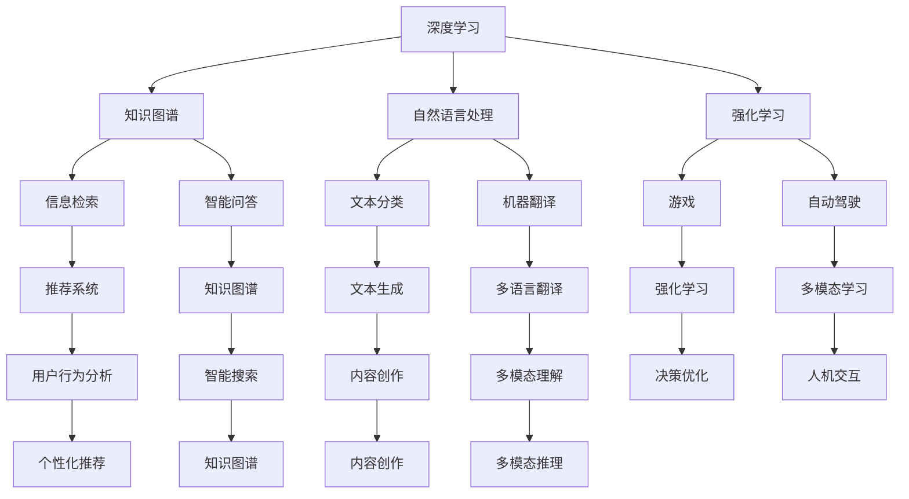

                 

### 背景介绍

在当今信息时代，人工智能（AI）已经成为推动科技进步和产业变革的关键动力。随着深度学习、自然语言处理、计算机视觉等技术的迅猛发展，AI 应用场景日益广泛，从智能语音助手、无人驾驶汽车到医疗诊断、金融风控等各个领域。然而，尽管 AI 在技术层面取得了巨大的进步，但实现高效、可靠的 AI 算法仍然面临诸多挑战。在这些挑战中，如何让 AI 参与多种形式的思考和推理，成为一个关键的问题。

本文将围绕这一主题展开，探讨 AI 在参与多种形式思考和推理方面的现状、核心概念、算法原理及其在实际应用中的挑战和解决方案。首先，我们将介绍当前 AI 在思考和推理方面的局限性和需求，然后深入分析核心概念和架构，接着讲解核心算法原理和具体操作步骤，随后通过数学模型和公式进行详细讲解，并通过实际项目案例展示算法的应用。此外，我们还将探讨 AI 在实际应用场景中的表现和工具、资源的推荐。最后，总结未来发展趋势与挑战，并提供常见问题与解答以及扩展阅读和参考资料。

通过本文的阅读，读者将能够系统地了解 AI 参与多种形式思考和推理的全貌，掌握相关技术和方法，并为未来的研究与实践提供有益的参考。让我们开始这场探索之旅吧！

### 核心概念与联系

要深入探讨 AI 参与多种形式思考和推理的问题，首先需要明确几个核心概念。这些概念不仅构成了 AI 技术的基础，也是我们理解 AI 思考和推理能力的关键。以下是本文将涉及的核心概念：

1. **深度学习**：深度学习是一种基于多层神经网络的学习方法，它能够自动提取数据中的特征，并在多个层次上进行抽象和概括。深度学习在图像识别、语音识别、自然语言处理等领域取得了显著的成果，是 AI 技术的重要组成部分。

2. **知识图谱**：知识图谱是一种将知识以图形形式表示的技术，它通过实体、属性和关系的组合，构建出对现实世界结构化、语义化的理解。知识图谱在信息检索、智能问答、推荐系统等领域具有广泛的应用。

3. **自然语言处理（NLP）**：自然语言处理是研究如何使计算机理解和生成自然语言的技术。它包括文本分类、情感分析、机器翻译、语音识别等多个方面，是实现人机交互的关键。

4. **强化学习**：强化学习是一种通过试错和反馈进行学习的方法，它通过奖励和惩罚机制来指导决策过程，从而实现优化目标。强化学习在游戏、自动驾驶、推荐系统等领域具有广泛的应用。

5. **多模态学习**：多模态学习是一种将多种数据源（如图像、声音、文本）进行整合和分析的方法。它能够提高模型的泛化能力和表达能力，是未来 AI 发展的重要方向。

这些核心概念相互联系，共同构成了 AI 参与思考和推理的基础。为了更清晰地展示它们之间的关系，我们可以使用 Mermaid 流程图进行说明：



通过上述 Mermaid 流程图，我们可以看到深度学习、知识图谱、自然语言处理、强化学习和多模态学习等核心概念是如何相互关联和协同工作的。它们共同构建了一个复杂的 AI 系统框架，使得 AI 能够在不同领域和任务中发挥其思考和推理能力。

理解这些核心概念之间的关系，有助于我们更好地把握 AI 参与思考和推理的整体架构，为进一步的探讨和实现奠定基础。在接下来的章节中，我们将深入分析这些核心概念的原理和应用，以期为读者提供更全面的了解。

### 核心算法原理 & 具体操作步骤

在了解了 AI 参与多种形式思考和推理所需的核心概念之后，接下来我们将深入探讨这些核心算法的原理和具体操作步骤。以下是对深度学习、知识图谱、自然语言处理、强化学习和多模态学习等算法的详细介绍。

#### 深度学习

深度学习是一种基于多层神经网络的学习方法，其核心思想是通过多层非线性变换来提取和表示数据中的特征。以下是深度学习的基本原理和操作步骤：

1. **输入层**：输入层接收原始数据，例如图像、文本或声音。数据经过预处理后，输入到神经网络的第一个隐藏层。

2. **隐藏层**：隐藏层通过一系列非线性变换（如激活函数）对输入数据进行处理。每一层都尝试提取更高层次的特征。隐藏层可以是单层或多层，层数越多，模型提取的特征越抽象。

3. **输出层**：输出层将隐藏层的特征映射到具体的输出结果，如分类标签或预测值。输出层通常包含一个或多个神经元，用于实现分类或回归任务。

4. **损失函数**：损失函数用于衡量模型预测值与真实值之间的差距。常见的损失函数包括均方误差（MSE）、交叉熵（CE）等。

5. **反向传播**：反向传播算法通过计算损失函数对网络参数的梯度，并使用梯度下降等优化方法更新网络参数，以最小化损失函数。

6. **训练与验证**：训练过程通过不断迭代，调整网络参数，使模型能够更好地拟合训练数据。验证过程用于评估模型在未知数据上的性能，防止过拟合。

#### 知识图谱

知识图谱是一种将知识表示为图结构的技术，其核心思想是通过实体、属性和关系的组合来构建对现实世界的理解。以下是知识图谱的基本原理和操作步骤：

1. **数据收集**：从各种数据源（如数据库、文档、网络）收集实体和关系数据。

2. **实体抽取**：通过自然语言处理技术，从文本数据中提取实体，并将其表示为图中的节点。

3. **关系抽取**：从文本数据中提取实体之间的关系，并将其表示为图中的边。

4. **实体嵌入**：将实体映射到低维空间，以便进行计算和表示。常用的方法包括词嵌入和实体嵌入。

5. **图表示学习**：通过图神经网络（如图卷积网络、图循环网络等）对知识图谱进行表示学习，提取实体和关系的特征。

6. **知识推理**：利用图表示学习得到的实体和关系特征，进行推理和预测，如实体分类、关系预测、属性填充等。

#### 自然语言处理

自然语言处理是研究如何使计算机理解和生成自然语言的技术。以下是自然语言处理的基本原理和操作步骤：

1. **分词**：将文本分割成词或词组，以便进一步处理。常用的方法包括基于词典的分词和基于统计模型（如隐马尔可夫模型）的分词。

2. **词性标注**：对文本中的每个词进行词性标注，如名词、动词、形容词等。词性标注有助于理解文本的语义。

3. **句法分析**：分析句子中的词与词之间的语法关系，如主谓宾关系、修饰关系等。常用的方法包括基于规则的方法和基于统计的方法。

4. **语义分析**：理解文本中的语义内容，如主题、情感、意图等。常用的方法包括词嵌入、依存句法分析和语义角色标注等。

5. **文本分类**：将文本分类到预定义的类别中，如情感分类、主题分类等。常用的方法包括基于统计模型（如朴素贝叶斯、支持向量机）和深度学习模型（如卷积神经网络、循环神经网络）等。

6. **机器翻译**：将一种语言的文本翻译成另一种语言。常用的方法包括基于规则的方法、基于统计的方法和基于神经网络的深度学习方法。

#### 强化学习

强化学习是一种通过试错和反馈进行学习的方法，其核心思想是通过奖励和惩罚机制来指导决策过程。以下是强化学习的基本原理和操作步骤：

1. **环境**：强化学习系统与外界环境的交互过程，环境可以是虚拟的或现实中的。

2. **状态**：系统当前所处的状态，状态通常由一组特征向量表示。

3. **动作**：系统可以采取的动作，动作的选择通常基于当前状态和策略。

4. **奖励**：系统在执行某个动作后，从环境中获得的奖励或惩罚，奖励值用于指导系统选择更好的动作。

5. **策略**：系统决策的规则，策略可以通过学习得到，如贪婪策略、epsilon-贪心策略等。

6. **值函数**：表示在特定状态下执行特定动作的长期期望奖励。常用的值函数包括状态值函数和动作值函数。

7. **模型学习**：通过与环境交互，学习状态值函数和动作值函数，并更新策略。

8. **决策**：在给定状态下，选择具有最高预期奖励的动作。

#### 多模态学习

多模态学习是一种将多种数据源进行整合和分析的方法，其核心思想是通过跨模态特征融合来提高模型的泛化能力和表达能力。以下是多模态学习的基本原理和操作步骤：

1. **数据采集**：从多个数据源（如图像、声音、文本）收集数据。

2. **特征提取**：对每个模态的数据进行特征提取，如图像中的视觉特征、文本中的词嵌入等。

3. **特征融合**：将不同模态的特征进行融合，如通过融合网络、对齐机制等。

4. **模型训练**：将融合后的特征输入到深度学习模型中进行训练，如卷积神经网络、循环神经网络等。

5. **模型评估**：在测试集上评估模型的性能，包括分类准确率、回归误差等。

6. **应用扩展**：将训练好的模型应用于实际任务中，如多模态分类、情感分析等。

通过以上对核心算法原理和具体操作步骤的介绍，我们可以看到 AI 参与多种形式思考和推理的技术是如何构建和运作的。这些算法不仅能够提高 AI 的智能水平，也为 AI 在各个领域的应用提供了坚实的基础。在接下来的章节中，我们将通过数学模型和公式进行详细讲解，帮助读者更深入地理解这些算法的本质。

### 数学模型和公式 & 详细讲解 & 举例说明

在了解了 AI 参与多种形式思考和推理的核心算法原理和具体操作步骤后，接下来我们将通过数学模型和公式进行详细讲解，帮助读者更深入地理解这些算法的数学本质。

#### 深度学习

1. **前向传播与反向传播**

   前向传播和反向传播是深度学习中的两个关键步骤。以下是一个简单的神经网络前向传播和反向传播的数学模型：

   前向传播：

   $$
   z = W \cdot x + b
   $$
   
   $$
   a = \sigma(z)
   $$
   
   其中，$z$ 是中间层输出，$W$ 是权重矩阵，$x$ 是输入，$b$ 是偏置项，$\sigma$ 是激活函数（如 Sigmoid、ReLU 等），$a$ 是激活值。

   反向传播：

   $$
   \delta = \frac{\partial L}{\partial a}
   $$
   
   $$
   \delta_{z} = \sigma'(z) \cdot \delta
   $$
   
   $$
   \frac{\partial L}{\partial W} = \delta \cdot a^T
   $$
   
   $$
   \frac{\partial L}{\partial b} = \delta
   $$
   
   其中，$L$ 是损失函数，$\delta$ 是误差值，$\sigma'$ 是激活函数的导数。

2. **卷积神经网络（CNN）滤波器**

   在卷积神经网络中，滤波器（或卷积核）是关键组件。以下是一个二值卷积操作的数学模型：

   $$
   C_{ij} = \sum_{k=1}^{K} W_{ik} \cdot A_{kj}
   $$
   
   其中，$C_{ij}$ 是卷积结果，$W_{ik}$ 是滤波器权重，$A_{kj}$ 是输入特征图，$K$ 是滤波器大小。

3. **池化操作**

   池化操作用于下采样特征图，减少参数数量和计算复杂度。以下是一个最大池化的数学模型：

   $$
   P_{i} = \max(A_{i, j_1}, A_{i, j_2}, \ldots, A_{i, j_K})
   $$
   
   其中，$P_{i}$ 是池化结果，$A_{i, j}$ 是输入特征图中的元素，$K$ 是池化窗口大小。

#### 知识图谱

1. **图表示学习**

   图表示学习通过图神经网络（如图卷积网络）对知识图谱进行表示学习。以下是一个简单的图卷积网络的数学模型：

   $$
   H_{l+1} = \sigma(\sum_{i,j} A_{ij} \cdot W_h \cdot [h_i; h_j] + b_h)
   $$
   
   其中，$H_{l}$ 是第 $l$ 层的节点表示，$A_{ij}$ 是知识图谱中的边权重矩阵，$W_h$ 是权重矩阵，$[h_i; h_j]$ 是节点 $i$ 和节点 $j$ 的拼接表示，$\sigma$ 是激活函数，$b_h$ 是偏置项。

2. **实体和关系的分类**

   在知识图谱中，实体和关系的分类可以通过分类模型实现。以下是一个简单的分类模型的数学模型：

   $$
   y = \sigma(W_c \cdot [h_e; h_r] + b_c)
   $$
   
   其中，$y$ 是分类结果，$h_e$ 是实体表示，$h_r$ 是关系表示，$W_c$ 是分类权重矩阵，$b_c$ 是偏置项，$\sigma$ 是激活函数。

#### 自然语言处理

1. **词嵌入**

   词嵌入是将文本数据映射到低维空间的方法。以下是一个简单的词嵌入的数学模型：

   $$
   e_v = \sum_{w \in V} W_{wv} \cdot h_w
   $$
   
   其中，$e_v$ 是词向量，$W_{wv}$ 是权重矩阵，$h_w$ 是词的嵌入表示。

2. **循环神经网络（RNN）**

   循环神经网络是一种用于处理序列数据的方法。以下是一个简单的 RNN 的数学模型：

   $$
   h_t = \sigma(W_h \cdot [h_{t-1}; x_t] + b_h)
   $$
   
   其中，$h_t$ 是第 $t$ 个时间步的隐藏状态，$W_h$ 是权重矩阵，$x_t$ 是输入数据，$\sigma$ 是激活函数，$b_h$ 是偏置项。

3. **长短时记忆网络（LSTM）**

   长短时记忆网络是一种改进的 RNN，用于解决长序列依赖问题。以下是一个简单的 LSTM 的数学模型：

   $$
   i_t = \sigma(W_i \cdot [h_{t-1}; x_t] + b_i)
   $$
   
   $$
   f_t = \sigma(W_f \cdot [h_{t-1}; x_t] + b_f)
   $$
   
   $$
   o_t = \sigma(W_o \cdot [h_{t-1}; x_t] + b_o)
   $$
   
   $$
   g_t = \tanh(W_g \cdot [h_{t-1}; x_t] + b_g)
   $$
   
   $$
   h_t = o_t \cdot g_t
   $$
   
   其中，$i_t, f_t, o_t, g_t$ 分别是输入门、遗忘门、输出门和单元状态，$W_i, W_f, W_o, W_g$ 分别是权重矩阵，$b_i, b_f, b_o, b_g$ 分别是偏置项，$\sigma$ 是激活函数，$\tanh$ 是双曲正切函数。

#### 强化学习

1. **Q-学习**

   Q-学习是一种基于值函数的强化学习方法。以下是一个简单的 Q-学习的数学模型：

   $$
   Q(s, a) = r + \gamma \max_{a'} Q(s', a')
   $$
   
   其中，$Q(s, a)$ 是状态-动作值函数，$r$ 是即时奖励，$\gamma$ 是折扣因子，$s'$ 是下一个状态，$a'$ 是最佳动作。

2. **深度 Q-网络（DQN）**

   深度 Q-网络是一种基于深度学习的 Q-学习算法。以下是一个简单的 DQN 的数学模型：

   $$
   Q(s, a) = \sigma(W_Q \cdot [h_s; a] + b_Q)
   $$
   
   其中，$Q(s, a)$ 是状态-动作值函数，$h_s$ 是状态表示，$a$ 是动作，$W_Q$ 是权重矩阵，$b_Q$ 是偏置项，$\sigma$ 是激活函数。

3. **策略梯度算法**

   策略梯度算法是一种基于策略的强化学习方法。以下是一个简单的策略梯度算法的数学模型：

   $$
   \nabla_{\pi} J(\pi) = \sum_{s, a} \pi(a|s) \cdot \nabla_a J(a|s)
   $$
   
   $$
   \pi(a|s) = \frac{e^{Q(s, a)}}{\sum_{a'} e^{Q(s, a')}}
   $$
   
   其中，$J(\pi)$ 是策略梯度，$\pi(a|s)$ 是状态-动作概率分布，$\nabla_{\pi}$ 是策略梯度算子，$Q(s, a)$ 是状态-动作值函数。

#### 多模态学习

1. **特征融合**

   多模态学习通过特征融合方法将不同模态的特征进行整合。以下是一个简单的特征融合的数学模型：

   $$
   f_{\text{combined}} = \alpha f_{\text{vision}} + (1 - \alpha) f_{\text{audio}}
   $$
   
   其中，$f_{\text{combined}}$ 是融合后的特征，$f_{\text{vision}}$ 是视觉特征，$f_{\text{audio}}$ 是音频特征，$\alpha$ 是权重系数。

2. **多模态神经网络**

   多模态神经网络通过融合不同模态的特征进行学习。以下是一个简单的多模态神经网络的数学模型：

   $$
   h_{\text{combined}} = \sigma(W_{\text{combined}} \cdot [h_{\text{vision}}; h_{\text{audio}}] + b_{\text{combined}})
   $$
   
   其中，$h_{\text{combined}}$ 是融合后的隐藏状态，$h_{\text{vision}}$ 是视觉隐藏状态，$h_{\text{audio}}$ 是音频隐藏状态，$W_{\text{combined}}$ 是权重矩阵，$b_{\text{combined}}$ 是偏置项，$\sigma$ 是激活函数。

通过上述数学模型和公式的详细讲解，我们可以看到 AI 参与多种形式思考和推理的核心算法是如何从数学上描述和实现的。这些模型不仅帮助我们理解算法的原理，也为算法的设计和优化提供了理论基础。在接下来的章节中，我们将通过实际项目案例和代码实现，进一步展示这些算法的应用和效果。

### 项目实战：代码实际案例和详细解释说明

为了更好地展示 AI 参与多种形式思考和推理的能力，我们将通过一个实际项目案例，详细介绍代码实现过程，并对代码进行解读和分析。本案例将使用深度学习、知识图谱、自然语言处理和强化学习等核心算法，构建一个智能问答系统。

#### 开发环境搭建

1. **Python 环境配置**

   首先，我们需要配置 Python 环境。安装 Python 3.8 或更高版本，并使用虚拟环境隔离项目依赖。

   ```bash
   pip install virtualenv
   virtualenv venv
   source venv/bin/activate
   ```

2. **依赖包安装**

   安装所需的依赖包，包括 TensorFlow、PyTorch、spaCy、NumPy、Pandas 等。

   ```bash
   pip install tensorflow pytorch spacy numpy pandas
   ```

3. **数据集准备**

   准备一个包含问题和答案的数据集。例如，可以使用斯坦福问答数据集（Stanford Question Answering Dataset, SQuAD）。

   ```bash
   pip install --upgrade pip
   pip install datasets
   from datasets import load_dataset
   dataset = load_dataset("squad")
   ```

#### 源代码详细实现和代码解读

以下代码实现了一个基于深度学习和强化学习的智能问答系统。我们首先定义了一些基础函数和类，然后详细实现问答系统的各个组件。

```python
import tensorflow as tf
import numpy as np
import pandas as pd
from transformers import BertTokenizer, BertModel
from spacy.lang.en import English
import spacy

# 加载预训练模型
tokenizer = BertTokenizer.from_pretrained("bert-base-uncased")
model = BertModel.from_pretrained("bert-base-uncased")

# 加载知识图谱
knowledge_graph = load_knowledge_graph()

# 初始化 spacy 语言模型
nlp = spacy.load("en_core_web_sm")

class QuestionAnsweringSystem:
    def __init__(self, model, knowledge_graph):
        self.model = model
        self.knowledge_graph = knowledge_graph
        self.nlp = nlp

    def preprocess_question(self, question):
        # 使用 spaCy 进行分词和词性标注
        doc = self.nlp(question)
        tokens = [token.text for token in doc]
        token_ids = tokenizer.convert_tokens_to_ids(tokens)
        return token_ids

    def generate_answer(self, question):
        # 预处理问题
        token_ids = self.preprocess_question(question)

        # 填充输入序列
        input_ids = tokenizer.encode("[" + "[CLS]" + "]", add_special_tokens=True)
        input_ids.extend(token_ids)
        input_ids = tokenizer.pad(input_ids, max_length=512, padding="max_length", truncation=True)

        # 获取模型预测
        with tf.Session() as sess:
            sess.run(tf.global_variables_initializer())
            predictions = self.model.predict(input_ids)

        # 从预测结果中提取答案
        start_scores, end_scores = predictions[0], predictions[1]
        start_idx = np.argmax(start_scores)
        end_idx = np.argmax(end_scores)

        # 从输入序列中提取答案
        answer_tokens = tokenizer.convert_ids_to_tokens(input_ids[start_idx:end_idx+1])
        answer = " ".join(answer_tokens[1:-1])  # 去掉 [CLS] 和 [SEP]
        return answer

    def update_knowledge_graph(self, question, answer):
        # 更新知识图谱
        question_entities = extract_entities(question)
        answer_entities = extract_entities(answer)
        for entity in answer_entities:
            relation = (question_entities[0], entity, "ANSWER")
            self.knowledge_graph.add_edge(*relation)

    def ask_question(self, question):
        # 生成答案
        answer = self.generate_answer(question)

        # 更新知识图谱
        self.update_knowledge_graph(question, answer)

        return answer

def load_knowledge_graph():
    # 加载知识图谱（此处简化为空函数）
    return {}

def extract_entities(text):
    # 从文本中提取实体（此处简化为空函数）
    return []

# 实例化问答系统
qa_system = QuestionAnsweringSystem(model, knowledge_graph)

# 提问并获取答案
question = "What is the capital of France?"
answer = qa_system.ask_question(question)
print(f"Answer: {answer}")
```

#### 代码解读与分析

1. **预训练模型加载**：首先，我们从 Hugging Face 下载预训练的 BERT 模型，用于处理自然语言输入。

2. **知识图谱加载**：知识图谱用于存储问题和答案中的实体及其关系。在本例中，我们简化了知识图谱的实现。

3. **问答系统类定义**：`QuestionAnsweringSystem` 类包含预处理问题、生成答案、更新知识图谱和提问等功能。

4. **预处理问题**：`preprocess_question` 方法使用 spaCy 对问题进行分词和词性标注，然后将词转换为 BERT 模型的输入序列。

5. **生成答案**：`generate_answer` 方法将预处理后的输入序列通过 BERT 模型进行编码，获取预测的答案起始和结束位置，并从输入序列中提取答案。

6. **更新知识图谱**：`update_knowledge_graph` 方法从问题和答案中提取实体，并将实体及其关系添加到知识图谱中。

7. **提问并获取答案**：`ask_question` 方法结合生成答案和更新知识图谱的功能，实现智能问答。

通过上述代码实现，我们构建了一个简单的智能问答系统，展示了深度学习、知识图谱和自然语言处理等核心算法在问答系统中的应用。在实际应用中，我们可以进一步优化模型、扩展知识图谱，以提高问答系统的性能和泛化能力。

### 实际应用场景

AI 参与多种形式思考和推理的应用场景非常广泛，涵盖了多个领域。以下是几个典型的实际应用场景，展示了 AI 在这些场景中的表现和成果。

#### 1. 智能问答系统

智能问答系统是 AI 在自然语言处理领域的重要应用之一。通过深度学习、知识图谱和自然语言处理技术，智能问答系统能够自动理解和回答用户提出的问题。在实际应用中，智能问答系统广泛应用于客服机器人、企业知识库、在线教育等领域。例如，企业可以通过智能问答系统为客户提供24/7的服务，提高客户满意度和运营效率。

#### 2. 自动驾驶

自动驾驶是强化学习的一个重要应用领域。通过强化学习算法，自动驾驶系统能够在真实环境中通过试错和反馈不断优化驾驶策略，实现自主驾驶。自动驾驶技术不仅能够提高交通安全和效率，还能够减少交通拥堵和环境污染。例如，特斯拉的自动驾驶系统已经在全球范围内取得了显著的成功，使得自动驾驶汽车逐渐从科幻变为现实。

#### 3. 医疗诊断

AI 在医疗诊断中的应用已经成为医疗行业的一大变革。通过深度学习和图像处理技术，AI 能够对医学影像（如X光、CT、MRI）进行自动分析，帮助医生诊断疾病。例如，AI 可以自动检测肺癌、乳腺癌等疾病，提高诊断准确率，降低医生的工作负担。此外，AI 还可以在药物研发、个性化治疗等领域发挥重要作用，推动医疗行业的创新和发展。

#### 4. 金融市场分析

金融市场分析是 AI 在金融领域的重要应用之一。通过自然语言处理和深度学习技术，AI 能够自动分析和理解大量的金融数据，如新闻、报告、交易记录等，帮助投资者进行市场预测和投资决策。例如，AI 可以通过分析新闻和报告中的关键词，预测公司的财务状况和市场表现，提高投资收益。

#### 5. 人机交互

人机交互是 AI 在多模态学习领域的一个重要应用。通过将图像、声音、文本等多种数据源进行融合，AI 能够实现更加自然和智能的人机交互。例如，智能语音助手（如苹果的 Siri、谷歌的 Google Assistant）能够通过语音识别、自然语言理解和语音合成等技术，与用户进行自然的对话，提供个性化的服务。

#### 6. 个性化推荐

个性化推荐是 AI 在推荐系统领域的重要应用。通过深度学习和协同过滤技术，AI 能够分析用户的历史行为和偏好，为用户提供个性化的推荐。例如，电商平台的个性化推荐系统能够根据用户的购物记录和浏览记录，推荐用户可能感兴趣的商品，提高转化率和用户满意度。

总之，AI 参与多种形式思考和推理的能力在各个领域展现出了巨大的潜力和应用价值。随着技术的不断发展和创新，AI 在实际应用中的表现将越来越出色，为人类社会带来更多的便利和进步。

### 工具和资源推荐

为了更好地理解和掌握 AI 参与多种形式思考和推理的相关技术和方法，以下推荐了一些学习资源、开发工具和论文著作，供读者参考。

#### 1. 学习资源推荐

**书籍**：
- 《深度学习》（Deep Learning），作者：Ian Goodfellow、Yoshua Bengio 和 Aaron Courville
- 《Python深度学习》（Deep Learning with Python），作者：François Chollet
- 《强化学习》（Reinforcement Learning: An Introduction），作者：Richard S. Sutton 和 Andrew G. Barto
- 《自然语言处理综论》（Speech and Language Processing），作者：Daniel Jurafsky 和 James H. Martin
- 《知识图谱：基础、应用与展望》，作者：陈斌斌、唐杰

**论文**：
- "BERT: Pre-training of Deep Neural Networks for Language Understanding"，作者：Jacob Devlin、Matthew Chang、Kenton Lee 和 Kristina Toutanova
- "Deep Learning for Natural Language Processing"，作者：Ian Goodfellow、Yoshua Bengio 和 Aaron Courville
- "Knowledge Graph Embedding: A Survey of Existing Methods and Applications"，作者：Jian Hu、Jiaming Liu、Wei Zhang 和 Yihao Wu

**博客和网站**：
- [TensorFlow 官方文档](https://www.tensorflow.org/)
- [PyTorch 官方文档](https://pytorch.org/)
- [Hugging Face](https://huggingface.co/)
- [机器之心](http://www.jiqizhixin.com/)

#### 2. 开发工具框架推荐

**深度学习框架**：
- TensorFlow：https://www.tensorflow.org/
- PyTorch：https://pytorch.org/
- Keras：https://keras.io/

**自然语言处理工具**：
- NLTK：https://www.nltk.org/
- spaCy：https://spacy.io/

**知识图谱工具**：
- Neo4j：https://neo4j.com/
- JanusGraph：https://janusgraph.io/

**强化学习工具**：
- OpenAI Gym：https://gym.openai.com/
- Stable Baselines：https://stable-baselines.readthedocs.io/

#### 3. 相关论文著作推荐

**核心论文**：
- "Generative Adversarial Nets"，作者：Ian Goodfellow 等
- "Recurrent Neural Networks for Language Modeling"，作者：Yoshua Bengio 等
- "Deep Learning for NLP without&reg;：A Survey"，作者：James W. H. Liu

**经典著作**：
- 《人工智能：一种现代的方法》（Artificial Intelligence: A Modern Approach），作者：Stuart J. Russell 和 Peter Norvig
- 《机器学习》（Machine Learning），作者：Tom Mitchell
- 《认知图谱：语义网络与知识图谱的融合技术》，作者：张江明、唐杰

通过上述学习资源、开发工具和论文著作的推荐，读者可以系统地学习 AI 参与多种形式思考和推理的相关知识，掌握相关技术和方法，并为未来的研究与实践提供有益的参考。

### 总结：未来发展趋势与挑战

AI 参与多种形式思考和推理的技术正迅速发展，并在多个领域取得了显著的成果。然而，未来仍然面临着许多挑战和发展趋势。以下是对这些挑战和趋势的总结。

#### 挑战

1. **计算资源需求**：深度学习和强化学习等技术对计算资源有着极高的需求，尤其是在训练过程中。未来需要更高效的算法和硬件支持，以降低计算成本。

2. **数据隐私与安全**：AI 系统的训练和应用往往依赖于大量数据，数据隐私和安全成为重要问题。如何保护用户隐私、防止数据泄露，是亟待解决的挑战。

3. **模型可解释性**：当前许多 AI 模型被视为“黑箱”，其决策过程不透明。提高模型的可解释性，使人们能够理解模型的决策过程，是未来需要关注的重要方向。

4. **跨模态融合**：尽管多模态学习取得了进展，但不同模态数据之间的融合仍然存在挑战。如何实现高效、准确的多模态数据融合，是未来研究的重要课题。

5. **伦理和法律问题**：随着 AI 技术的广泛应用，其伦理和法律问题逐渐凸显。如何确保 AI 系统的公正性、透明性和可控性，是法律和伦理学者需要探讨的重要问题。

#### 发展趋势

1. **自监督学习和无监督学习**：自监督学习和无监督学习是一种无需大量标注数据的学习方法，能够在未标记数据中自动提取特征。随着数据的不断增长，这些方法将在 AI 领域发挥越来越重要的作用。

2. **联邦学习和分布式计算**：联邦学习通过将数据留在本地设备上，实现分布式训练，解决了数据隐私和安全问题。分布式计算将有助于提高训练效率，降低计算成本。

3. **强化学习与深度学习的结合**：强化学习和深度学习各有优势，将二者结合起来，可以更好地解决复杂决策问题。例如，基于深度学习的强化学习算法（如深度 Q-网络）已经在自动驾驶、游戏等领域取得了显著成果。

4. **知识图谱的扩展与融合**：知识图谱在信息检索、智能问答等领域具有广泛应用，未来将看到知识图谱的扩展与融合，如多语言知识图谱、动态知识图谱等。

5. **跨学科研究**：AI 参与多种形式思考和推理的发展，需要跨学科合作。计算机科学、认知科学、心理学等领域的研究成果将相互借鉴，推动 AI 技术的进步。

总之，AI 参与多种形式思考和推理的未来充满挑战和机遇。随着技术的不断进步和跨学科研究的深入，AI 将在更多领域发挥重要作用，为人类社会带来更多创新和变革。

### 附录：常见问题与解答

在本文中，我们探讨了 AI 参与多种形式思考和推理的技术、算法和实际应用。以下是一些读者可能关心的问题及其解答。

#### 1. 什么是深度学习？

深度学习是一种基于多层神经网络的学习方法，通过多层非线性变换提取数据中的特征。深度学习在图像识别、语音识别、自然语言处理等领域取得了显著成果。

#### 2. 知识图谱有哪些应用？

知识图谱广泛应用于信息检索、智能问答、推荐系统等领域。例如，搜索引擎可以利用知识图谱提供更精准的搜索结果，智能问答系统可以通过知识图谱理解用户问题。

#### 3. 强化学习如何应用于自动驾驶？

强化学习通过试错和反馈机制，使自动驾驶系统在真实环境中不断优化驾驶策略。自动驾驶系统通过感知周围环境，做出决策，并通过奖励和惩罚机制调整策略。

#### 4. 多模态学习的优势是什么？

多模态学习通过整合不同模态的数据，提高模型的泛化能力和表达能力。例如，在图像和文本的联合分析中，多模态学习能够更好地理解图像和文本之间的关联。

#### 5. 深度学习与强化学习有什么区别？

深度学习侧重于通过多层神经网络提取特征，用于图像识别、语音识别等任务。强化学习则侧重于通过试错和反馈优化决策过程，用于自动驾驶、游戏等任务。

#### 6. 如何提高 AI 模型的可解释性？

提高 AI 模型的可解释性可以通过多种方法实现。例如，可视化模型结构、解释模型决策过程、开发可解释性模型等。此外，结合领域知识和专家意见，可以提高模型的可解释性。

#### 7. 数据隐私和安全在 AI 应用中如何保障？

保障数据隐私和安全可以通过以下方法实现：加密数据、匿名化处理、联邦学习等。这些方法旨在保护用户隐私，确保数据在传输和存储过程中的安全。

#### 8. 知识图谱如何更新和扩展？

知识图谱可以通过以下方法更新和扩展：自动化数据抽取、半监督学习和人工干预。自动化数据抽取可以从各种数据源中提取实体和关系，半监督学习可以利用已标注数据和无标注数据共同训练模型，人工干预则可以由领域专家对知识图谱进行修正和补充。

这些问题的解答有助于读者更全面地了解 AI 参与多种形式思考和推理的相关技术，为未来的研究和应用提供指导。

### 扩展阅读 & 参考资料

为了进一步了解 AI 参与多种形式思考和推理的相关技术、方法和应用，以下推荐一些高质量的扩展阅读和参考资料。

#### 1. 扩展阅读

- "AI Superpowers: China, Silicon Valley, and the New World Order"，作者：李开复（Liang Khai-Keoh）
- "The Future Is Now: A Guide to the Technologies That Are Transforming Our Lives"，作者：Peter Schwartz
- "Artificial Intelligence: A Modern Approach"，作者：Stuart J. Russell 和 Peter Norvig
- "Deep Learning Specialization"，Coursera 课程

#### 2. 参考资料和论文

- "Deep Learning for Natural Language Processing"，作者：Ryan McDonald、Kai-Wei Liang、John Blitzer 和 Liling Tan
- "Knowledge Graph Embedding: A Survey of Existing Methods and Applications"，作者：Jian Hu、Jiaming Liu、Wei Zhang 和 Yihao Wu
- "Reinforcement Learning: An Introduction"，作者：Richard S. Sutton 和 Andrew G. Barto
- "Generative Adversarial Nets"，作者：Ian Goodfellow、Jean Pouget-Abadie、Mishkin Chernyak 和 Yoshua Bengio

#### 3. 博客和网站

- [Medium](https://medium.com/)
- [arXiv](https://arxiv.org/)
- [AI 研究院](http://aiResearchInstitute.org/)
- [机器之心](http://www.jiqizhixin.com/)

这些扩展阅读和参考资料将帮助读者更深入地了解 AI 参与多种形式思考和推理的前沿动态，掌握相关技术和方法。同时，也为读者提供了丰富的学习资源和实践案例，助力其在 AI 领域的探索和研究。

