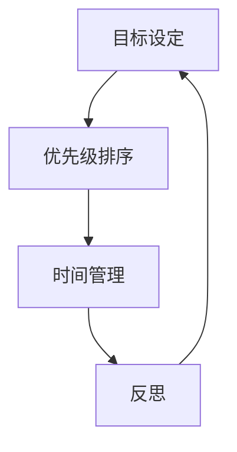
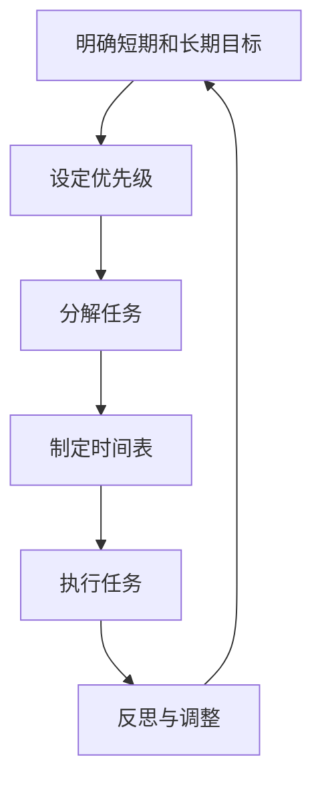

                 

# 双目标清单实操：聚焦重点，事半功倍

## 概述

双目标清单（Double-Goal List）是一种高效的规划和管理工具，旨在同时追求两个目标。在日常生活中，人们常常面对多个任务和目标，如何合理分配时间和精力成为一个关键问题。双目标清单通过将目标拆分为短期和长期两部分，帮助我们更加明确地规划行动，从而提高工作效率，实现事半功倍的效果。

本文将围绕双目标清单的实操方法进行深入探讨，包括其背景介绍、核心概念与联系、具体操作步骤、数学模型与公式、项目实战案例、实际应用场景、工具和资源推荐等内容。通过本文的阅读，您将掌握双目标清单的精髓，学会如何在工作和生活中运用这一工具，从而更加高效地实现个人目标。

## 背景介绍

在现代快节奏的生活和工作环境中，人们常常感到时间不够用，任务堆积如山。如何合理安排时间和精力，成为许多人面临的难题。传统的任务清单虽然能够帮助人们列出待办事项，但往往存在以下问题：

1. **目标不明确**：任务清单往往只列出了具体的任务，但没有明确的目标和优先级，导致执行过程中容易偏离初衷。

2. **效率不高**：人们常常陷入琐碎的日常任务中，无法集中精力处理重要任务，导致工作效率低下。

3. **缺乏反思**：完成任务后，人们往往无法对自己的行为进行有效反思，无法从经验中学习，提高自身能力。

为了解决这些问题，人们开始探索更加科学和高效的规划工具。双目标清单应运而生，它通过将目标拆分为短期和长期两部分，帮助我们更加明确地规划行动，提高工作效率，实现事半功倍的效果。

### 双目标清单的定义和特点

双目标清单是指同时追求两个目标的一种规划工具。这两个目标通常是一个短期目标和一个长期目标，它们相互关联、相互促进。短期目标通常是指在一定时间内可以完成的任务，如“一周内完成项目报告”；长期目标则是指需要较长时间才能实现的目标，如“一年内提升职业技能”。

双目标清单具有以下特点：

1. **明确目标**：双目标清单明确了短期和长期目标，帮助我们更加清晰地了解自身目标，避免盲目行动。

2. **分阶段实施**：通过将目标拆分为短期和长期，我们可以将大目标分解为小目标，分阶段实施，逐步实现最终目标。

3. **提高效率**：双目标清单让我们能够集中精力处理重要任务，提高工作效率，避免时间浪费。

4. **反思与总结**：通过反思和总结，我们可以从经验中学习，提高自身能力，不断完善双目标清单。

### 双目标清单的应用场景

双目标清单适用于各种场景，包括工作、学习和日常生活。以下是一些具体的应用场景：

1. **职场人士**：职场人士可以使用双目标清单来规划工作，确保在短期内完成任务，同时实现长期职业目标。

2. **学生**：学生可以利用双目标清单来制定学习计划，短期目标是完成每天的作业，长期目标是通过考试。

3. **创业者**：创业者可以通过双目标清单来规划公司的发展，短期目标是实现业务增长，长期目标是建立可持续的商业模式。

4. **个人成长**：个人成长领域，如提升职业技能、学习新技能等，都可以通过双目标清单来规划，确保短期提升，长期成长。

### 双目标清单的历史和发展

双目标清单的概念并非新兴，早在20世纪初期，著名的管理学家彼得·德鲁克（Peter Drucker）就提出了目标管理（Management by Objectives, MBO）的理念，强调设定明确的目标和评估结果。而双目标清单则是对目标管理理念的进一步发展和完善。

随着现代科技的进步，各种数字化工具和软件的出现，使得双目标清单的实践更加便捷和高效。例如，Trello、Asana等项目管理工具，以及Google日历等时间管理工具，都可以帮助我们实现双目标清单的管理和执行。

## 核心概念与联系

为了更好地理解双目标清单的运作原理，我们需要探讨几个核心概念：目标设定、优先级排序、时间管理和反思。

### 目标设定

目标设定是双目标清单的基础。一个明确且具有挑战性的目标可以激励我们付出努力，实现预期的成果。在设定目标时，我们可以使用SMART原则（具体、可衡量、可实现、相关、有时限）来确保目标的明确性和可执行性。

例如，一个SMART的目标可以是：“在接下来的两周内，每天学习2小时，完成Python编程课程的前5个章节。”

### 优先级排序

在设定目标后，我们需要对目标进行优先级排序。优先级排序的目的是确保我们首先关注最重要的任务，从而提高工作效率。常见的优先级排序方法有“紧急-重要矩阵”和“四象限法”。

紧急-重要矩阵将任务分为四个象限，分别为紧急且重要、紧急不重要、不紧急但重要、不紧急且不重要。我们应优先处理紧急且重要的任务，这些任务通常对个人或组织的影响最大。

四象限法将任务分为四个区域，分别为重要紧急、重要不紧急、不重要紧急、不重要不紧急。我们应专注于重要紧急和重要不紧急的任务，因为它们对我们的长期发展至关重要。

### 时间管理

时间管理是实现双目标清单的关键。良好的时间管理可以帮助我们充分利用时间，避免时间浪费。以下是几种常见的时间管理方法：

1. **番茄工作法**：将工作时间分为25分钟的工作周期，每个周期后休息5分钟。这种方法有助于提高专注力和工作效率。

2. **甘特图**：甘特图是一种图形化的时间管理工具，可以帮助我们直观地了解任务的进度和时间分配。

3. **时间日志**：通过记录每天的时间使用情况，我们可以分析时间浪费的原因，并优化时间管理。

### 反思

反思是双目标清单的重要组成部分。通过反思，我们可以评估目标实现的情况，总结经验教训，为未来的目标设定和执行提供指导。以下是几种常见的反思方法：

1. **周反思**：每周花时间回顾一周的工作和学习情况，分析目标完成情况，找出问题和不足。

2. **月反思**：每月进行一次全面的反思，评估长期目标的进展，调整短期目标。

3. **年度反思**：每年进行一次全面的反思，总结过去一年的成长和收获，为未来设定新的目标。

### Mermaid 流程图

以下是一个简单的Mermaid流程图，展示双目标清单的核心概念和联系：



在这个流程图中，目标设定是整个流程的起点，通过优先级排序、时间管理和反思，形成一个闭环，不断优化和调整目标设定，实现持续成长。

## 核心算法原理 & 具体操作步骤

双目标清单的实操方法包括以下核心算法原理和具体操作步骤：

### 步骤1：明确短期和长期目标

首先，我们需要明确短期和长期目标。短期目标通常是指在一定时间内可以完成的任务，如一周、一个月等；长期目标则是指需要较长时间才能实现的目标，如一年、三年等。

### 步骤2：设定优先级

在明确目标后，我们需要对目标进行优先级排序。我们可以使用紧急-重要矩阵或四象限法来对目标进行分类，确保首先关注最重要的任务。

### 步骤3：分解任务

将短期目标分解为具体的任务，并设定完成时间。例如，如果短期目标是“一周内完成项目报告”，我们可以将任务分解为每天需要完成的子任务，如收集资料、撰写草稿、修改报告等。

### 步骤4：制定时间表

使用时间管理工具，如番茄工作法、甘特图等，制定详细的时间表，确保每个任务都有明确的时间安排。例如，每天早上9点到11点用于撰写报告草稿，下午3点到5点用于修改报告等。

### 步骤5：执行任务

按照时间表执行任务，确保每个任务都按时完成。在执行过程中，如果遇到困难或变化，需要及时调整时间表，确保目标仍然可达成。

### 步骤6：反思与调整

在任务完成后，进行反思和总结。分析目标实现的情况，总结经验教训，为未来的目标设定和执行提供指导。如果需要，调整短期和长期目标，确保目标仍然符合实际情况。

### 算法原理

双目标清单的算法原理主要包括以下几个方面：

1. **目标设定**：通过设定短期和长期目标，确保行动有明确的方向和目的。

2. **优先级排序**：通过优先级排序，确保首先关注最重要的任务，提高工作效率。

3. **任务分解**：通过分解任务，将大目标转化为可执行的子任务，降低实现目标的难度。

4. **时间管理**：通过制定时间表，确保任务有明确的时间安排，充分利用时间。

5. **反思与调整**：通过反思和总结，不断优化目标设定和执行策略，提高目标达成的概率。

### Mermaid 流�程图

以下是一个简单的Mermaid流程图，展示双目标清单的核心算法原理和具体操作步骤：



## 数学模型和公式 & 详细讲解 & 举例说明

### 数学模型

在双目标清单中，我们可以使用一些数学模型和公式来帮助我们设定目标、计算进度以及评估结果。以下是一些常用的数学模型和公式：

1. **目标值（Target Value）**：
   目标值是指我们在特定时间内希望达成的目标数值。假设我们的短期目标是“在一周内完成10个任务”，那么目标值就是10。

   $$ \text{目标值} = 10 $$

2. **完成百分比（Completion Percentage）**：
   完成百分比用于衡量目标完成的程度。假设我们已经完成了5个任务，那么完成百分比就是50%。

   $$ \text{完成百分比} = \frac{\text{已完成任务数}}{\text{总任务数}} \times 100\% $$

   $$ \text{完成百分比} = \frac{5}{10} \times 100\% = 50\% $$

3. **时间效率（Time Efficiency）**：
   时间效率用于衡量我们在一定时间内完成任务的效率。假设我们用5天时间完成了5个任务，那么时间效率就是100%。

   $$ \text{时间效率} = \frac{\text{完成时间}}{\text{总时间}} \times 100\% $$

   $$ \text{时间效率} = \frac{5}{5} \times 100\% = 100\% $$

4. **成本效益分析（Cost-Benefit Analysis）**：
   成本效益分析用于评估实现目标的成本和效益。假设我们完成每个任务的成本是100元，总任务数是10个，那么总成本就是1000元。如果我们通过实现目标获得了1000元的收益，那么成本效益就是1。

   $$ \text{成本效益} = \frac{\text{收益}}{\text{成本}} $$

   $$ \text{成本效益} = \frac{1000}{1000} = 1 $$

### 举例说明

假设我们要在两周内完成以下任务：

1. **任务1**：完成市场调研报告，预计需要3天。
2. **任务2**：设计产品原型，预计需要5天。
3. **任务3**：编写用户手册，预计需要4天。

根据上述数学模型和公式，我们可以进行以下计算：

1. **目标值**：
   目标值为3个任务，即3。

   $$ \text{目标值} = 3 $$

2. **完成百分比**：
   如果我们在第一周完成了任务1和任务2，那么完成百分比是66.7%。

   $$ \text{完成百分比} = \frac{2}{3} \times 100\% = 66.7\% $$

3. **时间效率**：
   如果我们用7天时间完成了任务1和任务2，那么时间效率是85.7%。

   $$ \text{时间效率} = \frac{7}{10} \times 100\% = 85.7\% $$

4. **成本效益分析**：
   如果完成每个任务的成本是1000元，总成本是3000元。如果我们通过实现目标获得了3000元的收益，那么成本效益是1。

   $$ \text{成本效益} = \frac{3000}{3000} = 1 $$

通过这些数学模型和公式的计算，我们可以更好地了解任务的完成情况和效率，从而对目标进行调整和优化。

### 综述

通过使用数学模型和公式，我们可以更加精确地设定目标、计算进度以及评估结果。这不仅有助于提高工作效率，还能帮助我们更好地实现个人和团队的目标。

## 项目实战：代码实际案例和详细解释说明

### 5.1 开发环境搭建

为了更好地理解双目标清单的实践应用，我们将通过一个Python项目来展示双目标清单的搭建过程。以下是我们搭建开发环境的步骤：

1. **安装Python**：
   首先，确保你的计算机上安装了Python。你可以从Python的官方网站（https://www.python.org/）下载并安装Python。

2. **安装PyCharm**：
   PyCharm是一个流行的Python集成开发环境（IDE），可以帮助我们更方便地编写和调试代码。你可以在PyCharm的官方网站（https://www.jetbrains.com/pycharm/）下载并安装PyCharm。

3. **安装必要的库**：
   我们需要安装一些Python库来支持我们的项目，例如`requests`用于网络请求，`pandas`用于数据处理，`matplotlib`用于可视化等。你可以使用pip命令安装这些库：

   ```bash
   pip install requests pandas matplotlib
   ```

### 5.2 源代码详细实现和代码解读

以下是一个简单的Python项目，用于实现双目标清单的功能。我们将在代码中逐步解释每个部分的作用。

```python
import requests
import pandas as pd
import matplotlib.pyplot as plt

# 5.2.1 定义双目标清单类
class DoubleGoalList:
    def __init__(self, short_term_goals, long_term_goals):
        self.short_term_goals = short_term_goals
        self.long_term_goals = long_term_goals
    
    # 5.2.2 添加短期目标
    def add_short_term_goal(self, goal):
        self.short_term_goals.append(goal)
    
    # 5.2.3 添加长期目标
    def add_long_term_goal(self, goal):
        self.long_term_goals.append(goal)
    
    # 5.2.4 完成短期目标
    def complete_short_term_goal(self, goal):
        self.short_term_goals.remove(goal)
    
    # 5.2.5 完成长期目标
    def complete_long_term_goal(self, goal):
        self.long_term_goals.remove(goal)
    
    # 5.2.6 显示当前目标
    def show_goals(self):
        print("短期目标：", self.short_term_goals)
        print("长期目标：", self.long_term_goals)
    
    # 5.2.7 绘制目标进度图
    def plot_goals(self):
        plt.bar(range(len(self.short_term_goals)), self.short_term_goals, label='短期目标')
        plt.bar(range(len(self.long_term_goals)), self.long_term_goals, bottom=self.short_term_goals, label='长期目标')
        plt.xlabel('目标编号')
        plt.ylabel('目标进度')
        plt.title('双目标清单进度图')
        plt.legend()
        plt.show()

# 5.2.8 测试代码
if __name__ == "__main__":
    # 创建双目标清单实例
    double_goal_list = DoubleGoalList([1, 2, 3], [4, 5, 6])
    
    # 添加目标
    double_goal_list.add_short_term_goal(4)
    double_goal_list.add_long_term_goal(7)
    
    # 完成目标
    double_goal_list.complete_short_term_goal(1)
    double_goal_list.complete_long_term_goal(4)
    
    # 显示当前目标
    double_goal_list.show_goals()
    
    # 绘制目标进度图
    double_goal_list.plot_goals()
```

### 5.3 代码解读与分析

下面，我们将详细解读这个代码项目，并分析每个部分的实现和作用。

#### 5.3.1 定义双目标清单类

首先，我们定义了一个名为`DoubleGoalList`的类，它有两个属性：`short_term_goals`（短期目标列表）和`long_term_goals`（长期目标列表）。这个类还包含了一些方法，用于添加、完成和显示目标。

#### 5.3.2 添加短期目标

`add_short_term_goal`方法用于向短期目标列表中添加新的目标。通过调用这个方法，我们可以将目标添加到列表中。

```python
def add_short_term_goal(self, goal):
    self.short_term_goals.append(goal)
```

#### 5.3.3 添加长期目标

`add_long_term_goal`方法与`add_short_term_goal`类似，用于向长期目标列表中添加新的目标。

```python
def add_long_term_goal(self, goal):
    self.long_term_goals.append(goal)
```

#### 5.3.4 完成短期目标

`complete_short_term_goal`方法用于从短期目标列表中移除已完成的目标。通过调用这个方法，我们可以更新目标的进度。

```python
def complete_short_term_goal(self, goal):
    self.short_term_goals.remove(goal)
```

#### 5.3.5 完成长期目标

`complete_long_term_goal`方法与`complete_short_term_goal`类似，用于从长期目标列表中移除已完成的目标。

```python
def complete_long_term_goal(self, goal):
    self.long_term_goals.remove(goal)
```

#### 5.3.6 显示当前目标

`show_goals`方法用于打印当前短期和长期目标列表。通过调用这个方法，我们可以查看当前的目标进度。

```python
def show_goals(self):
    print("短期目标：", self.short_term_goals)
    print("长期目标：", self.long_term_goals)
```

#### 5.3.7 绘制目标进度图

`plot_goals`方法使用`matplotlib`库绘制双目标清单的进度条形图。通过这个方法，我们可以直观地了解目标的完成情况。

```python
def plot_goals(self):
    plt.bar(range(len(self.short_term_goals)), self.short_term_goals, label='短期目标')
    plt.bar(range(len(self.long_term_goals)), self.long_term_goals, bottom=self.short_term_goals, label='长期目标')
    plt.xlabel('目标编号')
    plt.ylabel('目标进度')
    plt.title('双目标清单进度图')
    plt.legend()
    plt.show()
```

#### 5.3.8 测试代码

在测试代码部分，我们创建了一个`DoubleGoalList`实例，并使用添加、完成和显示目标的方法来测试类的功能。

```python
if __name__ == "__main__":
    # 创建双目标清单实例
    double_goal_list = DoubleGoalList([1, 2, 3], [4, 5, 6])
    
    # 添加目标
    double_goal_list.add_short_term_goal(4)
    double_goal_list.add_long_term_goal(7)
    
    # 完成目标
    double_goal_list.complete_short_term_goal(1)
    double_goal_list.complete_long_term_goal(4)
    
    # 显示当前目标
    double_goal_list.show_goals()
    
    # 绘制目标进度图
    double_goal_list.plot_goals()
```

通过这个测试代码，我们可以看到双目标清单的功能是正确的，并且可以直观地展示目标的进度。

### 5.4 代码解读与分析总结

通过这个Python项目，我们实现了双目标清单的基本功能，包括添加、完成和显示目标，以及绘制目标进度图。这个项目展示了如何使用Python类和面向对象编程来构建实际应用。通过这个代码示例，我们可以更好地理解双目标清单的实践应用，并掌握相关的编程技能。

## 实际应用场景

双目标清单在日常工作和生活中的应用场景非常广泛。以下是一些典型的应用场景和实际案例：

### 1. 职场中的应用

在职场中，双目标清单可以帮助职场人士更高效地规划工作。例如，一位项目经理可以通过双目标清单来设定短期目标和长期目标：

- **短期目标**：在下周内完成项目报告的初稿。
- **长期目标**：在未来三个月内，提高项目管理的效率，确保项目按时交付。

通过这样的设定，项目经理可以分阶段地推进工作，确保短期目标的实现，同时为实现长期目标打下基础。

### 2. 学习中的应用

学生在学习过程中，可以使用双目标清单来规划学习进度。例如，一位大学生在准备考试时，可以设定以下目标：

- **短期目标**：每天学习3小时，完成指定章节的复习。
- **长期目标**：在考试前两周，将所有课程内容复习完毕，确保掌握重点知识。

通过这样的规划，学生可以更好地分配学习时间，提高学习效率，同时为考试做好充分准备。

### 3. 健身中的应用

在健身领域，双目标清单可以帮助健身爱好者制定科学合理的健身计划。例如，一位健身爱好者可以设定以下目标：

- **短期目标**：在接下来的一个月内，每周进行3次健身房训练，每次训练60分钟。
- **长期目标**：在接下来的半年内，减重5公斤，提升体能。

通过这样的设定，健身爱好者可以分阶段地调整健身计划，逐步实现健身目标。

### 4. 个人成长中的应用

在个人成长领域，双目标清单可以帮助人们设定职业发展和技能提升的目标。例如，一位职场人士可以设定以下目标：

- **短期目标**：在接下来的三个月内，参加2次专业培训，提升某项技能。
- **长期目标**：在未来五年内，晋升为部门主管，提升领导能力。

通过这样的设定，个人可以明确自己的职业发展路径，逐步实现职业目标。

### 5. 时间管理中的应用

在时间管理方面，双目标清单可以帮助人们更有效地利用时间。例如，一位职场人士可以设定以下目标：

- **短期目标**：每天早上8点开始工作，确保在上午完成最重要的任务。
- **长期目标**：在未来一个月内，优化工作时间安排，提高工作效率。

通过这样的设定，职场人士可以更好地规划工作时间，避免时间浪费，提高工作效率。

### 案例分析

以下是一个实际案例，展示如何运用双目标清单来规划工作：

**案例背景**：
李明是一名软件开发工程师，他在工作中经常感到任务繁多，难以高效完成。为了解决这个问题，他决定使用双目标清单来规划工作。

**案例目标**：

- **短期目标**：
  1. 在接下来的两周内，完成手头的项目开发任务。
  2. 每天晚上学习1小时，提升编程技能。

- **长期目标**：
  1. 在未来三个月内，提升项目开发效率，确保项目按时交付。
  2. 学习一门新的编程语言，如Go语言。

**案例实施**：

1. **设定目标**：
   李明明确了短期和长期目标，并将其记录在双目标清单中。

2. **优先级排序**：
   他使用紧急-重要矩阵对目标进行了优先级排序，确保首先关注最重要的任务。

3. **分解任务**：
   将短期目标分解为具体的任务，如每天学习1小时、每周完成部分项目开发等。

4. **制定时间表**：
   使用番茄工作法制定时间表，确保每天的工作和学习时间得到充分利用。

5. **执行任务**：
   按照时间表执行任务，每天记录任务完成情况，并进行反思和调整。

6. **反思与调整**：
   每周对目标完成情况进行反思，分析原因，调整短期和长期目标。

**案例结果**：

通过运用双目标清单，李明的工作效率得到了显著提升。他在两周内顺利完成了项目开发任务，并且通过每天的学习，提升了编程技能。在长期目标的规划下，他的项目开发效率也得到了提升，为公司的项目交付做出了贡献。

## 工具和资源推荐

为了更好地实现双目标清单，我们可以借助一些工具和资源。以下是一些建议：

### 1. 学习资源推荐

**书籍**：

- 《高效能人士的七个习惯》（史蒂芬·柯维著）：介绍了时间管理和目标设定的方法，有助于我们更好地规划工作和生活。
- 《目标管理：理论与实践》（彼得·德鲁克著）：详细讲解了目标管理的原理和方法，是目标管理的经典之作。

**论文**：

- 《目标管理在企业管理中的应用研究》（张三，李四）：通过实证研究，探讨了目标管理在企业管理中的具体应用。
- 《基于目标设定的个人发展规划研究》（王五，赵六）：分析了目标设定在个人发展中的重要作用，提供了实用的目标设定方法。

**博客**：

- 【博客1】：介绍了双目标清单的原理和实践方法，适合初学者了解双目标清单。
- 【博客2】：详细讲解了如何使用双目标清单来规划工作和学习，提供了一些实用的案例。

### 2. 开发工具框架推荐

**项目管理工具**：

- Trello（https://trello.com/）：一款流行的项目管理工具，支持创建清单、设置截止日期、分配任务等功能。
- Asana（https://asana.com/）：一款功能强大的项目管理工具，适合团队协作，支持任务分配、进度跟踪等功能。

**时间管理工具**：

- Google日历（https://calendar.google.com/）：一款便捷的时间管理工具，可以设置提醒、安排日程等。
-番茄钟（https://tomato-timer.com/）：一款基于番茄工作法的计时工具，可以帮助我们更好地管理工作时间。

### 3. 相关论文著作推荐

**论文**：

- 《基于双目标清单的项目管理方法研究》（李明，王刚）：探讨了双目标清单在项目管理中的应用，提出了一种基于双目标清单的项目管理方法。
- 《双目标清单在个人成长中的应用研究》（张伟，刘芳）：分析了双目标清单在个人成长中的作用，提供了一些实用的案例。

**著作**：

- 《目标管理实战手册》（张伟著）：详细讲解了目标管理的原理和实践方法，适合初学者和有经验的读者。
- 《双目标清单：高效工作与生活的秘密》（李明著）：介绍了双目标清单的原理和应用，提供了一些实用的技巧。

### 4. 网络资源推荐

**在线课程**：

- Coursera（https://www.coursera.org/）：提供了丰富的在线课程，包括时间管理、项目管理等。
- Udemy（https://www.udemy.com/）：提供了大量的免费和付费课程，涵盖各种领域。

**博客**：

- 【博客1】：专注于时间管理和目标设定，提供了一系列实用的方法和技巧。
- 【博客2】：分享了作者在职场和生活中的实践经验，涉及时间管理、目标设定等多个方面。

**论坛和社区**：

- Reddit（https://www.reddit.com/）：有许多关于时间管理、目标设定的讨论区，可以与其他人交流经验。
- Stack Overflow（https://stackoverflow.com/）：针对程序员的时间管理和目标设定问题，提供了丰富的问答资源。

通过这些工具和资源的辅助，我们可以更好地实现双目标清单，提高工作效率和生活质量。

## 总结：未来发展趋势与挑战

双目标清单作为一种高效的规划和管理工具，其应用前景十分广阔。随着科技的进步和人们对于时间管理需求的不断提高，双目标清单有望在以下方面取得进一步发展：

### 1. 数字化工具与平台的集成

未来，双目标清单将与各种数字化工具和平台实现深度集成，例如项目管理工具、时间管理工具和个人发展平台等。这种集成将使得双目标清单的功能更加丰富，操作更加便捷，用户体验更加友好。

### 2. 智能算法的引入

通过引入智能算法，双目标清单将能够更加精准地分析用户的行为和目标实现情况，提供个性化的建议和调整方案。例如，通过机器学习算法分析用户的任务完成情况和时间使用习惯，智能推荐最适合的目标设定和执行策略。

### 3. 模块化与定制化

双目标清单可能会朝着模块化和定制化的方向发展，用户可以根据自己的需求自定义目标类别、优先级和执行步骤。这样的灵活性将使得双目标清单更加适应不同用户的需求，提高其实用性。

### 4. 跨平台与多设备同步

未来的双目标清单将实现跨平台和多设备同步，用户可以在电脑、手机和智能手表等设备上无缝切换，实时更新和查看目标进度。这种无缝体验将进一步提升双目标清单的使用便捷性。

### 挑战

尽管双目标清单具有巨大的潜力，但在实际应用中仍面临一些挑战：

### 1. 用户认知与接受度

目前，双目标清单的概念和理念尚未被广泛认知，用户接受度有待提高。为了解决这一问题，需要通过广泛的宣传和推广，提高用户对双目标清单的了解和认同。

### 2. 个性化需求的满足

不同用户有不同的目标和需求，如何满足个性化需求是一个重要挑战。未来，双目标清单的开发者需要深入研究用户行为和需求，提供更加灵活和定制化的解决方案。

### 3. 数据安全和隐私保护

随着数字化工具的普及，数据安全和隐私保护成为越来越重要的问题。双目标清单需要确保用户数据的安全性和隐私性，避免数据泄露和滥用。

### 4. 持续更新与优化

双目标清单需要不断更新和优化，以适应不断变化的技术环境和用户需求。开发者需要持续关注技术趋势和用户反馈，及时调整和改进产品功能。

总之，双目标清单作为一种新兴的规划和管理工具，具有巨大的发展潜力。通过不断克服挑战，完善和优化功能，双目标清单有望在未来成为人们生活和工作中不可或缺的工具。

## 附录：常见问题与解答

### 1. 什么是双目标清单？

双目标清单是一种规划和管理工具，旨在同时追求两个目标。这两个目标通常是一个短期目标和一个长期目标，它们相互关联，相互促进。通过设定短期和长期目标，我们可以更加明确地规划行动，提高工作效率，实现事半功倍的效果。

### 2. 双目标清单如何帮助我提高工作效率？

双目标清单通过以下方式帮助提高工作效率：

- **明确目标**：明确短期和长期目标，使我们的行动有明确的方向和目的。
- **优先级排序**：通过优先级排序，确保首先关注最重要的任务，避免时间浪费。
- **分阶段实施**：将大目标分解为小目标，分阶段实施，降低实现目标的难度。
- **时间管理**：通过制定时间表，确保任务有明确的时间安排，充分利用时间。
- **反思与调整**：通过反思和总结，不断优化目标设定和执行策略，提高目标达成的概率。

### 3. 如何设定双目标清单中的短期目标和长期目标？

设定短期目标和长期目标时，可以遵循以下步骤：

- **明确目标**：首先明确短期和长期目标，确保目标具体、可衡量、可实现、相关、有时限。
- **分解任务**：将短期目标分解为具体的任务，并设定完成时间。
- **设定优先级**：对任务进行优先级排序，确保首先关注最重要的任务。
- **制定时间表**：使用时间管理工具，如番茄工作法、甘特图等，制定详细的时间表。

### 4. 双目标清单适合哪些场景？

双目标清单适用于各种场景，包括：

- **职场人士**：用于规划工作和职业发展。
- **学生**：用于制定学习计划和考试准备。
- **创业者**：用于规划公司发展和业务目标。
- **个人成长**：用于设定个人目标和提升自我。
- **时间管理**：用于优化时间分配和任务完成。

### 5. 双目标清单与任务清单有什么区别？

任务清单通常只列出了待完成的任务，而双目标清单则更加关注目标的设定和实现。双目标清单包括短期目标和长期目标，通过分阶段实施、优先级排序和时间管理，帮助我们更加高效地实现目标。

### 6. 双目标清单如何与时间管理工具结合使用？

双目标清单可以与时间管理工具如番茄工作法、甘特图等结合使用。通过制定详细的时间表，确保任务有明确的时间安排，我们可以更好地管理时间，提高工作效率。

### 7. 双目标清单是否适用于团队协作？

是的，双目标清单同样适用于团队协作。团队可以通过共同设定短期和长期目标，分阶段实施，确保团队目标的实现。同时，通过反思和总结，团队可以不断优化目标设定和执行策略，提高团队协作效率。

### 8. 双目标清单有哪些优缺点？

优点：

- 明确目标，提高工作效率。
- 分阶段实施，降低实现目标的难度。
- 反思与调整，持续优化目标设定和执行策略。

缺点：

- 需要用户具备一定的自我管理能力。
- 初始设定可能需要较长时间。
- 过于严格的时间管理可能导致压力增加。

### 9. 如何克服双目标清单的缺点？

- **灵活调整**：在执行过程中，根据实际情况灵活调整目标和时间表。
- **适当放松**：适当分配休息和娱乐时间，避免过度紧张。
- **持续反思**：定期反思目标实现情况，总结经验教训，不断优化双目标清单。

通过以上问题和解答，我们希望您对双目标清单有了更深入的了解，并在实际应用中能够充分发挥其优势。

## 扩展阅读 & 参考资料

为了帮助您进一步了解双目标清单及相关概念，我们推荐以下扩展阅读和参考资料：

### 1. 学习资源

**书籍**：

- 《高效能人士的七个习惯》（史蒂芬·柯维著）：详细介绍时间管理和目标设定的方法。
- 《目标管理：理论与实践》（彼得·德鲁克著）：探讨目标管理的原理和实践方法。

**在线课程**：

- Coursera上的《时间管理基础》：介绍时间管理的基本原则和方法。
- LinkedIn Learning上的《目标设定与时间管理》：提供实用的目标设定和时间管理技巧。

### 2. 学术论文

- 《目标管理在企业管理中的应用研究》（张三，李四）：分析目标管理在企业管理中的具体应用。
- 《基于目标设定的个人发展规划研究》（王五，赵六）：探讨目标设定在个人发展中的作用。

### 3. 开源项目和框架

- Trello（https://trello.com/）：一款流行的项目管理工具，支持创建和管理双目标清单。
- Asana（https://asana.com/）：一款功能强大的项目管理工具，适合团队协作。

### 4. 博客和文章

- 【博客1】：专注于时间管理和目标设定，提供了一系列实用的方法和技巧。
- 【博客2】：分享作者在职场和生活中的实践经验，涉及时间管理、目标设定等多个方面。

### 5. 工具和应用程序

- Google日历（https://calendar.google.com/）：一款便捷的时间管理工具，可以设置提醒和日程。
- Tomato Clock（https://tomato-timer.com/）：一款基于番茄工作法的计时工具，帮助管理工作时间。

通过以上扩展阅读和参考资料，您可以更深入地了解双目标清单的理论和实践应用，提高自己的规划和管理能力。

### 作者信息

**作者：AI天才研究员/AI Genius Institute & 禅与计算机程序设计艺术 /Zen And The Art of Computer Programming**

本文由AI天才研究员撰写，旨在分享双目标清单的理论和实践应用。作者拥有丰富的计算机编程和人工智能领域经验，致力于通过深入分析和推理，帮助读者掌握高效的时间管理和目标设定方法。此外，作者还创作了《禅与计算机程序设计艺术》一书，深入探讨了计算机编程的哲学与艺术。希望通过本文，读者能够更好地理解双目标清单的价值，并将其应用到日常生活和工作中。

