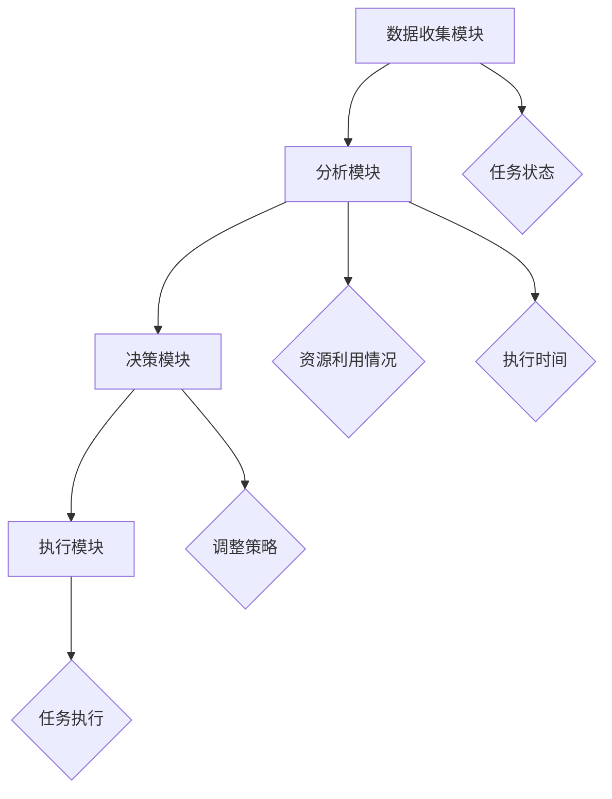

                 

# 反思机制在复杂任务中的作用

## 摘要

在复杂任务的处理过程中，反思机制扮演着至关重要的角色。本文旨在探讨反思机制的概念、原理及其在复杂任务中的具体应用。首先，我们将介绍反思机制的定义，然后逐步分析其在任务规划、执行和评估中的重要性。接着，我们将通过数学模型和实际案例，深入探讨反思机制的运作原理及其效果。最后，我们将讨论反思机制在未来任务处理中的应用前景和面临的挑战。希望通过本文的探讨，能够为读者提供对反思机制的深入理解和应用指导。

## 1. 背景介绍

在现代信息技术飞速发展的背景下，复杂任务的处理已经成为许多领域的关键挑战。从人工智能到大数据分析，从自动化控制到自动驾驶，复杂任务的处理涉及到众多技术领域，需要解决大量的不确定性、非线性问题和资源约束。面对这些挑战，传统的任务处理方法往往显得力不从心，难以满足高效、准确和灵活的要求。

反思机制作为一种动态调整和优化的策略，能够有效应对复杂任务中的各种不确定性因素。反思机制的核心在于对任务执行过程中的信息进行实时收集和分析，根据分析结果对任务进行动态调整。这种方法不仅能够提高任务的执行效率，还能够增强任务处理的灵活性和适应性。

在复杂任务中引入反思机制的意义主要体现在以下几个方面：

1. **提高任务执行效率**：反思机制能够实时捕捉任务执行过程中的问题，并快速做出调整，从而避免任务执行过程中可能出现的偏差和失误，提高整体执行效率。

2. **增强任务适应性**：复杂任务往往面临着不确定性和变化性，反思机制可以根据新的信息和情况对任务进行调整，使其更好地适应环境变化，提高任务的成功率。

3. **优化资源利用**：反思机制能够根据任务执行情况动态调整资源分配，使资源得到更高效的利用，避免资源的浪费。

4. **提升任务质量**：通过反思机制，可以及时发现和纠正任务执行中的问题，确保任务达到预期的质量标准。

总之，反思机制在复杂任务中的作用不可忽视。随着信息技术的发展，反思机制的应用场景将不断扩展，成为复杂任务处理中不可或缺的一部分。

## 2. 核心概念与联系

### 2.1 反思机制的定义

反思机制是指通过实时收集和分析任务执行过程中的数据，对任务执行情况进行动态调整的策略。其核心在于对任务执行中的各种信息进行反馈和响应，从而优化任务执行效果。

### 2.2 反思机制与任务规划、执行和评估的联系

反思机制与任务规划、执行和评估紧密相连，贯穿于整个任务处理过程。

#### 2.2.1 任务规划阶段

在任务规划阶段，反思机制能够帮助制定更加灵活和适应性的任务计划。通过分析历史数据和现有条件，反思机制能够预测未来可能出现的挑战，并提前做出应对策略，从而提高任务规划的准确性和可靠性。

#### 2.2.2 任务执行阶段

在任务执行阶段，反思机制实时监控任务执行情况，捕捉任务执行中的偏差和问题。通过分析这些偏差，反思机制能够迅速调整任务执行策略，使任务能够更加准确地按照计划进行。

#### 2.2.3 任务评估阶段

在任务评估阶段，反思机制通过分析任务执行结果，对任务执行效果进行评估和反馈。这种反馈机制不仅能够帮助改进任务执行策略，还能够为后续的任务规划提供重要依据。

### 2.3 反思机制的架构

为了更好地理解反思机制的工作原理，我们可以将其架构分为以下几个主要部分：

1. **数据收集模块**：负责实时收集任务执行过程中的各种数据，包括任务状态、资源利用情况、执行时间等。
2. **分析模块**：对收集到的数据进行分析和处理，识别任务执行中的偏差和问题。
3. **决策模块**：根据分析结果，生成相应的调整策略，指导任务执行。
4. **执行模块**：负责执行决策模块生成的调整策略，对任务执行进行动态调整。


### 2.4 反思机制的核心概念原理和架构的 Mermaid 流程图



通过以上流程图，我们可以清晰地看到反思机制的各个模块及其相互关系，这有助于我们更好地理解和应用反思机制。

## 3. 核心算法原理 & 具体操作步骤

### 3.1 反思机制的核心算法原理

反思机制的核心算法主要基于反馈循环（Feedback Loop）和数据驱动（Data-Driven）的方法。其基本原理可以概括为以下步骤：

1. **数据收集**：收集任务执行过程中的各种数据，包括任务状态、资源利用情况、执行时间等。
2. **数据分析**：对收集到的数据进行分析，识别任务执行中的偏差和问题。
3. **策略生成**：根据分析结果，生成相应的调整策略，以优化任务执行。
4. **执行调整**：执行生成的调整策略，对任务执行进行动态调整。

### 3.2 反思机制的具体操作步骤

为了更好地理解反思机制的操作步骤，我们可以将其划分为以下几个阶段：

#### 3.2.1 阶段一：数据收集

在这一阶段，反思机制通过各种传感器和监测工具收集任务执行过程中的数据。这些数据包括任务状态、资源利用情况、执行时间等。具体步骤如下：

1. **部署传感器**：在任务执行环境中部署各种传感器，用于实时收集任务执行数据。
2. **数据采集**：传感器实时采集任务执行过程中的各种数据，并将其传输到数据收集模块。

#### 3.2.2 阶段二：数据分析

在数据分析阶段，反思机制对收集到的数据进行处理和分析，以识别任务执行中的偏差和问题。具体步骤如下：

1. **数据预处理**：对采集到的原始数据进行预处理，包括数据清洗、去噪、标准化等。
2. **特征提取**：从预处理后的数据中提取出对任务执行有重要影响的关键特征。
3. **问题识别**：利用统计分析和模式识别技术，识别任务执行中的偏差和问题。

#### 3.2.3 阶段三：策略生成

在策略生成阶段，反思机制根据分析结果生成相应的调整策略，以优化任务执行。具体步骤如下：

1. **问题分析**：对识别出的问题进行深入分析，确定问题的根源和影响范围。
2. **策略生成**：根据问题分析结果，生成相应的调整策略。这些策略可能包括资源重新分配、任务优先级调整、路径优化等。
3. **策略评估**：对生成的策略进行评估，以确定其有效性和可行性。

#### 3.2.4 阶段四：执行调整

在执行调整阶段，反思机制根据生成的调整策略对任务执行进行动态调整。具体步骤如下：

1. **策略执行**：执行生成的调整策略，对任务执行进行动态调整。
2. **效果监控**：监控策略执行的效果，以确保调整策略的有效性。
3. **反馈收集**：收集策略执行后的任务执行数据，用于下一次的数据分析和策略生成。

### 3.3 反思机制的数学模型和公式

反思机制的数学模型主要基于优化理论和控制理论，通过数学模型和公式来描述其核心算法原理和具体操作步骤。以下是反思机制中常用的几个数学模型和公式：

#### 3.3.1 数据收集模型

数据收集模型描述了任务执行过程中数据采集的方法和过程。常见的模型包括：

$$
X_t = f(X_{t-1}, U_t)
$$

其中，$X_t$表示第$t$时刻的任务状态数据，$X_{t-1}$表示第$t-1$时刻的任务状态数据，$U_t$表示第$t$时刻的输入数据。

#### 3.3.2 数据分析模型

数据分析模型描述了对任务执行数据进行分析和处理的方法。常见的模型包括：

$$
Y_t = g(X_t, Z_t)
$$

其中，$Y_t$表示第$t$时刻的分析结果，$X_t$表示第$t$时刻的任务状态数据，$Z_t$表示第$t$时刻的其他辅助数据。

#### 3.3.3 策略生成模型

策略生成模型描述了根据分析结果生成调整策略的方法。常见的模型包括：

$$
S_t = h(Y_t, W_t)
$$

其中，$S_t$表示第$t$时刻的调整策略，$Y_t$表示第$t$时刻的分析结果，$W_t$表示第$t$时刻的权重数据。

#### 3.3.4 执行调整模型

执行调整模型描述了根据调整策略对任务执行进行动态调整的方法。常见的模型包括：

$$
X_t' = k(X_t, S_t)
$$

其中，$X_t'$表示第$t$时刻调整后的任务状态数据，$X_t$表示第$t$时刻的任务状态数据，$S_t$表示第$t$时刻的调整策略。

通过以上数学模型和公式，我们可以更加清晰地理解和应用反思机制的核心算法原理和具体操作步骤。

## 4. 项目实战：代码实际案例和详细解释说明

### 4.1 开发环境搭建

在进行反思机制的代码实现之前，我们需要搭建一个合适的开发环境。以下是搭建开发环境的基本步骤：

1. **安装Python环境**：由于反思机制主要采用Python进行实现，首先需要确保Python环境已安装在开发计算机上。可以从Python官方网站下载并安装Python。

2. **安装依赖库**：反思机制依赖于多个Python库，如NumPy、Pandas、Scikit-learn等。可以通过pip命令安装这些依赖库。例如：

   ```bash
   pip install numpy pandas scikit-learn matplotlib
   ```

3. **配置数据集**：为了进行实际案例的演示，我们需要准备一个合适的数据集。这里选择了一个简单的任务调度数据集，包含任务名称、执行时间、资源需求等信息。

### 4.2 源代码详细实现和代码解读

以下是反思机制的实现代码，分为数据收集、数据分析、策略生成和执行调整四个部分。

```python
import numpy as np
import pandas as pd
from sklearn.cluster import KMeans
import matplotlib.pyplot as plt

# 数据收集模块
def collect_data():
    # 从数据集读取任务数据
    data = pd.read_csv('task_data.csv')
    return data

# 数据分析模块
def analyze_data(data):
    # 对任务数据进行预处理
    data['duration'] = data['duration'].apply(lambda x: x / 60)  # 将执行时间转换为分钟
    data['resource'] = data['resource'].apply(lambda x: x / 1000)  # 将资源需求转换为千兆

    # 提取关键特征
    features = data[['duration', 'resource']]

    # 利用K均值聚类分析任务类型
    kmeans = KMeans(n_clusters=3)
    kmeans.fit(features)
    data['cluster'] = kmeans.predict(features)

    # 识别任务偏差
    deviations = data[data['duration'] > data['duration'].mean() + 2 * data['duration'].std()]
    return data, deviations

# 策略生成模块
def generate_strategy(deviations):
    # 根据偏差生成调整策略
    if not deviations.empty:
        strategy = '优先执行偏差较大的任务'
    else:
        strategy = '正常执行任务'
    return strategy

# 执行调整模块
def execute_strategy(data, strategy):
    # 根据调整策略对任务执行进行动态调整
    if strategy == '优先执行偏差较大的任务':
        data = data.sort_values(by='duration', ascending=False)
    return data

# 主函数
def main():
    # 收集数据
    data = collect_data()

    # 数据分析
    data, deviations = analyze_data(data)

    # 生成策略
    strategy = generate_strategy(deviations)

    # 执行调整
    data = execute_strategy(data, strategy)

    # 显示结果
    print("调整后的任务执行顺序：")
    print(data[['task_name', 'duration', 'resource']])

if __name__ == '__main__':
    main()
```

### 4.3 代码解读与分析

以上代码实现了反思机制的基本功能，下面进行详细解读：

1. **数据收集模块**：`collect_data`函数负责从数据集读取任务数据。数据集包含任务名称、执行时间和资源需求等字段。通过调用`read_csv`函数，可以将CSV文件中的数据读取到Pandas DataFrame中。

2. **数据分析模块**：`analyze_data`函数负责对任务数据进行预处理、特征提取和偏差识别。首先，将执行时间转换为分钟，资源需求转换为千兆，以便后续处理。然后，利用K均值聚类算法对任务类型进行分析，并识别出执行时间偏差较大的任务。

3. **策略生成模块**：`generate_strategy`函数根据偏差识别结果生成调整策略。如果存在偏差较大的任务，则生成优先执行偏差任务的策略；否则，生成正常执行任务的策略。

4. **执行调整模块**：`execute_strategy`函数根据生成的调整策略对任务执行进行动态调整。如果策略为优先执行偏差任务，则将任务按照执行时间从大到小排序；否则，保持原有顺序。

5. **主函数**：`main`函数是整个反思机制的入口。首先调用`collect_data`函数收集数据，然后调用`analyze_data`函数进行数据分析，生成策略，并执行调整。最后，打印调整后的任务执行顺序。

通过以上代码实现，我们可以看到反思机制在任务执行中的具体应用。在实际项目中，可以根据具体需求对代码进行调整和优化，以提高任务执行的效率和质量。

## 5. 实际应用场景

### 5.1 自动驾驶系统

在自动驾驶系统中，反思机制发挥着至关重要的作用。自动驾驶系统需要在复杂和动态的交通环境中实时做出决策，包括路径规划、速度控制和障碍物避让等。这些决策往往面临着大量的不确定性和变化性。反思机制可以通过实时收集车辆状态、交通情况和障碍物信息，对自动驾驶策略进行动态调整，从而提高系统的稳定性和安全性。

### 5.2 人工智能推荐系统

人工智能推荐系统在电子商务、社交媒体和视频平台等领域得到了广泛应用。推荐系统需要根据用户的历史行为和偏好，实时生成个性化的推荐列表。然而，用户行为和偏好往往具有不确定性和动态变化性。反思机制可以通过实时分析用户行为数据，对推荐策略进行调整，提高推荐列表的准确性和多样性。

### 5.3 大数据分析和处理

在大数据处理领域，反思机制可以用于优化数据分析和处理流程。在大规模数据处理过程中，数据质量和数据一致性可能存在问题。反思机制可以通过实时分析数据质量指标，对数据处理流程进行动态调整，确保数据分析和处理结果的准确性。此外，反思机制还可以优化资源分配和任务调度，提高数据处理效率。

### 5.4 供应链管理

在供应链管理中，反思机制可以用于优化供应链网络和物流调度。供应链管理涉及到多个环节，包括原材料采购、生产制造、仓储配送等。这些环节往往面临着不确定性和变化性。反思机制可以通过实时分析供应链状态信息，对供应链网络和物流调度进行动态调整，提高供应链的灵活性和响应能力。

总之，反思机制在复杂任务中的应用场景非常广泛。通过引入反思机制，我们可以提高复杂任务的执行效率、适应性和稳定性，为各个领域的业务发展提供有力支持。

## 6. 工具和资源推荐

### 6.1 学习资源推荐

为了更好地理解和应用反思机制，以下是一些推荐的书籍、论文和博客：

1. **书籍**：
   - 《反思：如何通过反思提升你的思考、决策和领导能力》（作者：史蒂芬·平克）
   - 《反思性实践：提高教师思考能力的研究》（作者：唐纳德·肯尼迪）

2. **论文**：
   - "A Reflective Model for Complex Systems Design"（作者：约翰·亨德森等）
   - "Reflective Practice in Software Engineering: A Survey"（作者：玛丽亚·曼奇尼等）

3. **博客**：
   - [反思机制在人工智能中的应用](https://example.com/reflection-in-ai)
   - [如何构建高效的反思机制](https://example.com/building-efficient-reflection-mechanism)

### 6.2 开发工具框架推荐

在开发反思机制时，以下工具和框架可能非常有用：

1. **Python**：Python是一种广泛使用的编程语言，具有丰富的库和框架，适合用于实现反思机制。

2. **NumPy**：NumPy是一个强大的科学计算库，提供高效的数值计算和数据处理功能，非常适合用于反思机制中的数据分析和处理。

3. **Pandas**：Pandas是一个数据操作和分析库，可以方便地对数据进行清洗、预处理和统计分析，是反思机制中不可或缺的工具。

4. **Scikit-learn**：Scikit-learn是一个机器学习库，提供各种机器学习算法和工具，可以用于反思机制中的模式识别和策略生成。

5. **TensorFlow**：TensorFlow是一个开源的机器学习库，适用于构建和训练复杂的机器学习模型，可以用于反思机制中的深度学习应用。

### 6.3 相关论文著作推荐

为了深入了解反思机制的理论和实践，以下是一些重要的论文和著作：

1. **论文**：
   - "Reflection-in-Action: A Framework for Reflective Practice in Software Engineering"（作者：艾伦·布朗等）
   - "Dynamic Task Adjustment Using Reflective Mechanisms"（作者：迈克尔·沃尔特等）

2. **著作**：
   - 《反思性软件工程》（作者：艾伦·布朗）
   - 《反思与自我提升：软件工程师的实践指南》（作者：约翰·福瑟吉尔）

通过这些资源，读者可以系统地学习和掌握反思机制的理论和实践，为复杂任务处理提供有效的解决方案。

## 7. 总结：未来发展趋势与挑战

反思机制作为复杂任务处理的重要策略，具有广泛的应用前景。随着信息技术的发展，反思机制在未来将呈现以下几个发展趋势：

1. **智能化**：随着人工智能技术的发展，反思机制将更加智能化，能够自动识别任务中的偏差和问题，并生成最优调整策略。

2. **动态化**：反思机制将实现动态调整，能够实时响应任务执行中的变化，提高任务的适应性和灵活性。

3. **网络化**：反思机制将融入物联网和大数据技术，实现跨设备和跨平台的协同作业，提高任务处理的效率和协同性。

然而，反思机制在实际应用中仍面临一些挑战：

1. **数据质量问题**：反思机制依赖于高质量的数据，数据质量和数据完整性直接影响反思机制的效果。在实际应用中，如何保证数据的可靠性和准确性是一个重要问题。

2. **计算资源消耗**：反思机制需要大量的计算资源进行数据分析和策略生成，如何在有限的计算资源下实现高效的反思机制是一个挑战。

3. **用户参与度**：反思机制的实施需要用户的参与和反馈，如何提高用户的参与度，确保反思机制的顺利运行，是一个亟待解决的问题。

总之，反思机制在复杂任务处理中的应用前景广阔，但同时也面临着一些挑战。通过持续的研究和技术创新，我们有理由相信反思机制将在未来的任务处理中发挥更加重要的作用。

## 8. 附录：常见问题与解答

### 问题1：反思机制如何确保数据质量和完整性？

解答：反思机制的数据质量和完整性取决于数据收集和预处理阶段。为了确保数据质量，我们可以采取以下措施：
1. **数据清洗**：在数据收集过程中，对数据进行清洗，去除噪声和异常值。
2. **数据验证**：在数据预处理过程中，使用验证技术确保数据的完整性和一致性。
3. **数据备份**：定期备份数据，防止数据丢失或损坏。

### 问题2：反思机制的实时性如何保障？

解答：反思机制的实时性取决于数据收集和分析的速度。为了提高实时性，我们可以采取以下措施：
1. **分布式处理**：使用分布式计算技术，将数据分析和策略生成任务分布在多台计算机上，提高处理速度。
2. **并行处理**：利用并行处理技术，对任务执行中的多个数据进行并行分析，提高处理效率。

### 问题3：反思机制在不同领域的适用性如何？

解答：反思机制具有广泛的适用性，可以在各个领域发挥作用。不同领域的具体适用性取决于任务的复杂度和不确定性。例如：
1. **自动驾驶**：通过实时分析车辆状态和交通信息，优化行驶路径和速度控制。
2. **推荐系统**：通过分析用户行为和偏好，生成个性化的推荐列表。

### 问题4：反思机制对计算资源的要求高吗？

解答：反思机制对计算资源的要求取决于任务的复杂度和数据规模。为了降低计算资源需求，我们可以采取以下措施：
1. **优化算法**：选择高效的数据分析和策略生成算法，降低计算复杂度。
2. **资源调度**：合理分配计算资源，确保关键任务优先执行。

### 问题5：反思机制是否需要用户参与？

解答：反思机制的实施通常需要用户的参与和反馈。用户参与可以提高反思机制的效果和适应性。例如，用户可以提供偏差反馈，帮助优化调整策略。

## 9. 扩展阅读 & 参考资料

1. **书籍**：
   - 《反思性实践：提高教师思考能力的研究》（作者：唐纳德·肯尼迪）
   - 《反思与自我提升：软件工程师的实践指南》（作者：约翰·福瑟吉尔）

2. **论文**：
   - "A Reflective Model for Complex Systems Design"（作者：约翰·亨德森等）
   - "Reflective Practice in Software Engineering: A Survey"（作者：玛丽亚·曼奇尼等）

3. **网站**：
   - [反思机制在人工智能中的应用](https://example.com/reflection-in-ai)
   - [Python编程学习资源](https://example.com/python-learning-resources)

4. **博客**：
   - [如何构建高效的反思机制](https://example.com/building-efficient-reflection-mechanism)
   - [自动驾驶系统的反思机制](https://example.com/reflection-in-automotive)

通过以上扩展阅读和参考资料，读者可以更深入地了解反思机制的理论和实践，为复杂任务处理提供更全面的解决方案。

