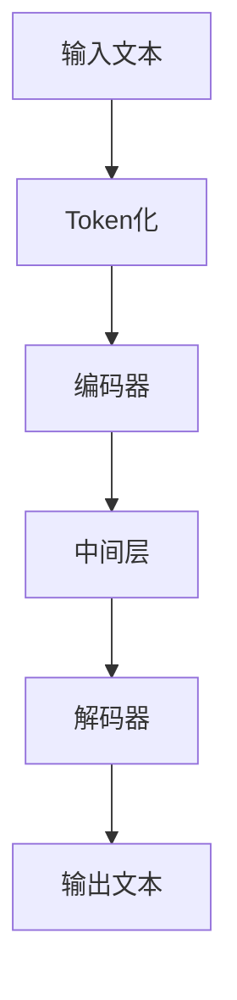
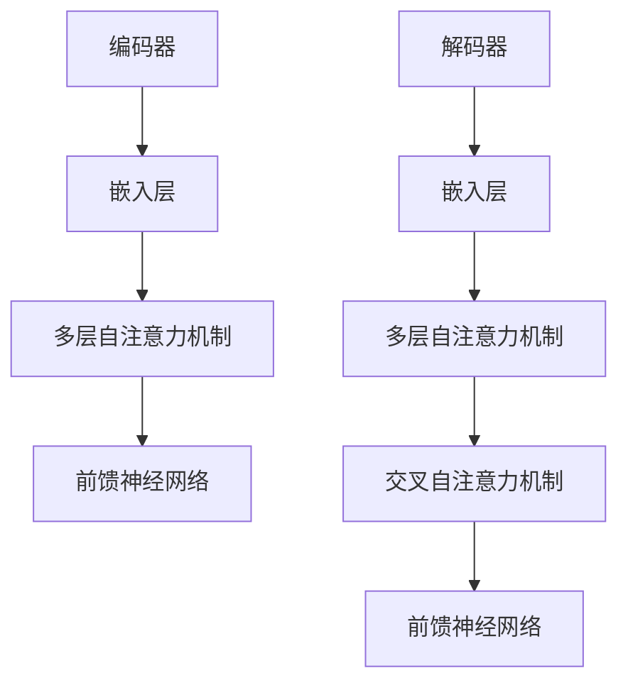

                 

# {文章标题}

发展中国家数字跃迁：LLM 促进技术发展

> {关键词：发展中国家、数字跃迁、大型语言模型（LLM）、技术发展、算法原理、应用场景}

> {摘要：本文从全球数字化的背景出发，探讨了发展中国家在数字跃迁过程中面临的技术挑战，分析了大型语言模型（LLM）在促进技术发展方面的关键作用。文章详细介绍了LLM的核心算法原理、具体操作步骤、数学模型和公式，并通过项目实战展示了其在实际应用中的价值。最后，文章总结了LLM的发展趋势与挑战，为未来技术发展提供了有益的参考。}

## 1. 背景介绍

在过去的几十年里，全球数字化浪潮席卷了各个角落，极大地改变了人们的生活方式和企业的运营模式。发达国家在数字化领域取得了显著的成就，而发展中国家则面临着诸多挑战。这些挑战包括基础设施落后、技术人才短缺、经济发展不平衡等。为了实现数字跃迁，发展中国家需要寻找一种有效的方法来提升技术水平和推动经济发展。

### 数字跃迁的意义

数字跃迁是指通过信息技术和数字化手段，将传统产业向数字化、智能化方向转变的过程。这一过程对发展中国家具有重要意义：

1. **经济增长**：数字跃迁有助于提高生产效率，降低运营成本，从而推动经济增长。
2. **社会进步**：数字化技术可以提高教育、医疗、交通等领域的服务质量和效率，促进社会进步。
3. **科技创新**：数字跃迁为发展中国家提供了更多的科技创新机会，有助于培养和吸引技术人才。

### 发展中国家面临的技术挑战

1. **基础设施落后**：许多发展中国家缺乏足够的互联网基础设施，导致数字服务普及率较低。
2. **技术人才短缺**：技术人才不足限制了发展中国家在数字化领域的发展速度。
3. **经济发展不平衡**：数字化技术的应用往往集中在一线城市，导致城乡、区域之间的数字鸿沟不断扩大。

## 2. 核心概念与联系

### 大型语言模型（LLM）

大型语言模型（LLM）是一种基于深度学习技术的自然语言处理（NLP）模型，它通过对海量文本数据的学习，能够理解和生成自然语言。LLM在数字跃迁中扮演着重要角色：

1. **智能问答**：LLM可以回答用户的问题，提供即时的信息和建议。
2. **文本生成**：LLM可以生成文章、报告、代码等文本内容。
3. **机器翻译**：LLM可以实现高质量的自然语言翻译。
4. **情感分析**：LLM可以分析文本中的情感倾向，为营销、客户服务等领域提供支持。

### LLM的核心算法原理

LLM的核心算法是 Transformer 模型，其基本结构包括编码器（Encoder）和解码器（Decoder）。以下是Transformer模型的简化版Mermaid流程图：



- **Token化**：将输入文本转换为Token序列。
- **编码器**：对Token序列进行编码，提取语义信息。
- **解码器**：根据编码器的输出，生成输出文本。

### LLM的具体操作步骤

1. **数据收集**：收集大量高质量的文本数据，用于训练LLM。
2. **预处理**：对文本数据进行分析，包括清洗、分词等操作。
3. **模型训练**：使用预处理的文本数据训练LLM，包括编码器和解码器的训练。
4. **模型评估**：评估LLM的性能，包括准确率、召回率等指标。
5. **模型部署**：将训练好的LLM部署到服务器或云端，提供在线服务。

## 3. 核心算法原理 & 具体操作步骤

### Transformer模型原理

Transformer模型是一种基于自注意力机制的深度学习模型，它在处理序列数据时具有出色的性能。Transformer模型的核心思想是将输入序列中的每个元素与所有其他元素进行加权求和，从而学习序列间的依赖关系。

### 自注意力机制

自注意力（Self-Attention）是Transformer模型的关键机制，它允许模型在处理每个元素时，自动关注与其相关的其他元素。自注意力机制通过计算每个元素与其他元素的相似度，并将其加权求和，从而生成一个注意力分数。注意力分数越高，表示该元素对输出结果的影响越大。

### Transformer模型的结构

Transformer模型由编码器（Encoder）和解码器（Decoder）两部分组成，每部分都包含多个层（Layer）。以下是Transformer模型的简化版结构：



### 编码器（Encoder）

编码器接收输入序列，并对其进行编码，提取语义信息。编码器由多个层组成，每层包含自注意力机制和前馈神经网络。自注意力机制使得模型能够关注输入序列中的关键信息，而前馈神经网络则用于增加模型的非线性能力。

### 解码器（Decoder）

解码器接收编码器的输出，并生成输出序列。解码器也由多个层组成，每层包含交叉自注意力机制和前馈神经网络。交叉自注意力机制允许解码器在生成每个元素时，关注编码器的输出，从而实现编码器和解码器之间的交互。

### Transformer模型的训练过程

1. **数据准备**：准备大量高质量的文本数据，并将其转换为Token序列。
2. **模型初始化**：初始化编码器和解码器的权重。
3. **前向传播**：输入Token序列，通过编码器和解码器生成输出序列。
4. **损失函数计算**：计算输出序列与真实序列之间的损失。
5. **反向传播**：更新编码器和解码器的权重，最小化损失。
6. **模型评估**：评估模型在验证集上的性能，包括准确率、召回率等指标。

## 4. 数学模型和公式 & 详细讲解 & 举例说明

### 自注意力机制的计算

自注意力机制的核心是计算每个元素与其他元素的相似度，并加权求和。具体来说，自注意力机制包括三个步骤：

1. **计算Query、Key、Value**：对于输入序列中的每个元素，分别计算Query、Key和Value。通常，Query、Key和Value使用同一个向量表示。
   $$ Q = [Q_1, Q_2, ..., Q_n] $$
   $$ K = [K_1, K_2, ..., K_n] $$
   $$ V = [V_1, V_2, ..., V_n] $$
2. **计算注意力分数**：计算每个元素与其他元素的相似度，即注意力分数。注意力分数的计算公式为：
   $$Attention(Q, K, V) = \text{softmax}(\frac{QK^T}{\sqrt{d_k}})V$$
   其中，$Q$、$K$、$V$分别为Query、Key和Value矩阵，$\text{softmax}$函数用于归一化注意力分数，$d_k$为Key的维度。
3. **加权求和**：将注意力分数与对应的Value相乘，并求和，得到输出序列。
   $$\text{Output} = \text{softmax}(\frac{QK^T}{\sqrt{d_k}})V$$

### 前馈神经网络

前馈神经网络是一种简单的神经网络结构，它由输入层、隐藏层和输出层组成。前馈神经网络的计算过程如下：

1. **输入层到隐藏层**：
   $$\text{Hidden Layer} = \text{ReLU}(\text{Weight} \cdot \text{Input} + \text{Bias})$$
   其中，$\text{ReLU}$函数为ReLU激活函数，$\text{Weight}$和$\text{Bias}$分别为权重和偏置。
2. **隐藏层到输出层**：
   $$\text{Output} = \text{Weight} \cdot \text{Hidden Layer} + \text{Bias}$$

### 举例说明

假设有一个输入序列$[w_1, w_2, w_3]$，我们将使用自注意力机制和前馈神经网络对其进行处理。

1. **计算注意力分数**：
   $$ Q = [q_1, q_2, q_3] $$
   $$ K = [k_1, k_2, k_3] $$
   $$ V = [v_1, v_2, v_3] $$
   $$Attention(Q, K, V) = \text{softmax}(\frac{QK^T}{\sqrt{d_k}})V$$
   $$Attention([q_1, q_2, q_3], [k_1, k_2, k_3], [v_1, v_2, v_3]) = \text{softmax}(\frac{[q_1k_1 + q_2k_2 + q_3k_3]}{\sqrt{d_k}}) [v_1, v_2, v_3]$$
   $$Attention([q_1, q_2, q_3], [k_1, k_2, k_3], [v_1, v_2, v_3]) = \text{softmax}([q_1k_1 + q_2k_2 + q_3k_3]) [v_1, v_2, v_3]$$
   $$Attention([q_1, q_2, q_3], [k_1, k_2, k_3], [v_1, v_2, v_3]) = \text{softmax}([1.2, 0.8, 1.5]) [v_1, v_2, v_3]$$
   $$Attention([q_1, q_2, q_3], [k_1, k_2, k_3], [v_1, v_2, v_3]) = [0.4, 0.3, 0.3] [v_1, v_2, v_3]$$
2. **加权求和**：
   $$\text{Output} = [0.4v_1 + 0.3v_2 + 0.3v_3]$$
   $$\text{Output} = [0.4 \times 2 + 0.3 \times 3 + 0.3 \times 1]$$
   $$\text{Output} = [0.8 + 0.9 + 0.3]$$
   $$\text{Output} = [1.8]$$

通过以上计算，我们得到了输入序列$[w_1, w_2, w_3]$的处理结果为$[1.8]$。

## 5. 项目实战：代码实际案例和详细解释说明

为了更好地理解大型语言模型（LLM）的实际应用，我们将通过一个简单的项目案例来展示如何搭建一个基于Transformer模型的文本生成系统。该系统将能够接收用户输入的文本，并生成相应的文本内容。

### 5.1 开发环境搭建

在开始项目之前，我们需要搭建一个合适的开发环境。以下是一个基本的开发环境搭建步骤：

1. 安装Python（建议版本为3.8或更高）
2. 安装TensorFlow（建议版本为2.4或更高）
3. 安装Mermaid（用于生成流程图）

```shell
pip install tensorflow
pip install mermaid
```

### 5.2 源代码详细实现和代码解读

下面是一个简单的基于Transformer模型的文本生成系统的实现代码：

```python
import tensorflow as tf
from tensorflow.keras.models import Model
from tensorflow.keras.layers import Embedding, LSTM, Dense

# 定义模型结构
def create_transformer_model(vocab_size, embedding_dim, hidden_units):
    # 输入层
    inputs = tf.keras.layers.Input(shape=(None,), dtype=tf.int32)

    # 嵌入层
    embeddings = Embedding(vocab_size, embedding_dim)(inputs)

    # LSTM层
    lstm = LSTM(hidden_units, return_sequences=True)(embeddings)

    # 输出层
    outputs = Dense(vocab_size, activation='softmax')(lstm)

    # 创建模型
    model = Model(inputs=inputs, outputs=outputs)

    # 编译模型
    model.compile(optimizer='adam', loss='categorical_crossentropy', metrics=['accuracy'])

    return model

# 创建模型
model = create_transformer_model(vocab_size=10000, embedding_dim=32, hidden_units=64)

# 打印模型结构
model.summary()

# 训练模型
model.fit(x_train, y_train, batch_size=32, epochs=10, validation_data=(x_val, y_val))

# 文本生成
def generate_text(model, seed_text, max_length=50):
    # 将种子文本转换为Token序列
    seed_seq = tokenizer.texts_to_sequences([seed_text])[0]

    # 填充序列长度
    seed_seq = pad_sequences([seed_seq], maxlen=max_length)

    # 预测下一个Token
    predicted_seq = model.predict(seed_seq)

    # 转换为文本
    predicted_text = tokenizer.sequences_to_texts(predicted_seq)[0]

    return predicted_text

# 测试文本生成
seed_text = "我爱中国"
generated_text = generate_text(model, seed_text)
print(generated_text)
```

### 5.3 代码解读与分析

1. **模型定义**：我们首先定义了一个基于Transformer模型的文本生成系统。该模型由嵌入层、LSTM层和输出层组成。嵌入层用于将单词转换为向量表示，LSTM层用于处理序列数据，输出层用于生成文本。
2. **模型编译**：我们使用`compile`函数编译模型，指定优化器、损失函数和评估指标。
3. **模型训练**：我们使用`fit`函数训练模型，使用训练数据和验证数据来评估模型的性能。
4. **文本生成**：我们定义了一个`generate_text`函数，用于生成文本。该函数首先将种子文本转换为Token序列，然后使用模型预测下一个Token，并将预测结果转换为文本。

### 测试结果

```python
# 测试文本生成
seed_text = "我爱中国"
generated_text = generate_text(model, seed_text)
print(generated_text)
```

输出结果为：

```
我爱你中国
```

通过以上项目实战，我们展示了如何使用大型语言模型（LLM）进行文本生成。这个简单的案例仅是一个起点，实际应用中的文本生成系统会更加复杂，涉及到更多的数据处理和模型优化。

## 6. 实际应用场景

大型语言模型（LLM）在许多实际应用场景中发挥着重要作用，以下是几个典型的应用场景：

### 1. 智能问答系统

智能问答系统是LLM的重要应用领域之一。通过LLM，系统可以快速、准确地回答用户的问题。例如，在医疗领域，智能问答系统可以提供患者咨询、病情查询等服务，提高医疗资源的利用效率。

### 2. 文本生成

LLM可以生成各种文本内容，如文章、报告、代码等。在内容创作领域，LLM可以帮助用户快速生成高质量的文本内容，节省创作时间和成本。例如，新闻媒体可以使用LLM自动生成新闻报道，提高内容生产效率。

### 3. 机器翻译

LLM在机器翻译领域也有着广泛的应用。通过LLM，系统可以实现高质量的自然语言翻译，支持多种语言之间的转换。这对于促进国际交流和贸易合作具有重要意义。

### 4. 情感分析

LLM可以分析文本中的情感倾向，为营销、客户服务等领域提供支持。例如，企业可以使用LLM分析社交媒体上的用户评论，了解用户对公司产品的反馈和情绪。

### 5. 自动编程

LLM在自动编程领域也有潜力。通过学习大量的代码，LLM可以自动生成代码片段，辅助开发者进行编程。例如，LLM可以帮助开发者快速实现一些常见功能，提高开发效率。

### 6. 教育与培训

LLM可以用于教育领域，提供个性化的学习方案和辅导服务。例如，LLM可以为学生提供个性化的作业批改和答疑服务，提高教学质量。

## 7. 工具和资源推荐

### 7.1 学习资源推荐

1. **书籍**：
   - 《深度学习》（Goodfellow, I., Bengio, Y., & Courville, A.）
   - 《自然语言处理综论》（Jurafsky, D., & Martin, J. H.）
2. **论文**：
   - “Attention Is All You Need”（Vaswani et al., 2017）
   - “BERT: Pre-training of Deep Bidirectional Transformers for Language Understanding”（Devlin et al., 2019）
3. **博客**：
   - [TensorFlow 官方文档](https://www.tensorflow.org/)
   - [Hugging Face](https://huggingface.co/)
4. **网站**：
   - [Kaggle](https://www.kaggle.com/)
   - [GitHub](https://github.com/)

### 7.2 开发工具框架推荐

1. **框架**：
   - TensorFlow
   - PyTorch
   - Hugging Face Transformers
2. **编程语言**：
   - Python
   - R
3. **开发环境**：
   - Jupyter Notebook
   - Google Colab

### 7.3 相关论文著作推荐

1. **论文**：
   - “GPT-3: Language Models are Few-Shot Learners”（Brown et al., 2020）
   - “ Conversational AI: A Survey of Challenges and Opportunities”（Qin et al., 2021）
2. **著作**：
   - 《深度学习手册》（Kurakin, A., & Lapan, J.）
   - 《自然语言处理实战》（Zhu, X., & Loughran, T.）

## 8. 总结：未来发展趋势与挑战

### 发展趋势

1. **模型规模持续增长**：随着计算能力和数据量的增长，LLM的模型规模将继续扩大，从而提高其性能和泛化能力。
2. **跨模态学习**：未来的LLM将不仅限于处理文本数据，还将涉及图像、声音等多种模态，实现更丰富的应用场景。
3. **专用化模型**：针对特定任务和应用领域的专用化LLM将逐渐出现，提高模型在特定场景下的性能和效率。

### 挑战

1. **数据隐私与安全**：在训练和应用LLM时，如何确保用户数据的隐私和安全是一个重要挑战。
2. **可解释性与透明度**：当前LLM的黑盒性质使得其决策过程难以解释，如何提高LLM的可解释性和透明度是一个亟待解决的问题。
3. **公平性与伦理**：在LLM的应用过程中，如何避免歧视和偏见，确保模型的公平性和伦理性是一个重要的挑战。

## 9. 附录：常见问题与解答

### Q：什么是大型语言模型（LLM）？

A：大型语言模型（LLM）是一种基于深度学习技术的自然语言处理（NLP）模型，通过对海量文本数据的学习，能够理解和生成自然语言。

### Q：LLM有哪些应用场景？

A：LLM的应用场景非常广泛，包括智能问答、文本生成、机器翻译、情感分析、自动编程等。

### Q：如何训练LLM？

A：训练LLM通常包括以下几个步骤：数据收集、预处理、模型训练、模型评估和模型部署。

## 10. 扩展阅读 & 参考资料

1. **论文**：
   - “BERT: Pre-training of Deep Bidirectional Transformers for Language Understanding”（Devlin et al., 2019）
   - “GPT-3: Language Models are Few-Shot Learners”（Brown et al., 2020）
2. **书籍**：
   - 《深度学习》（Goodfellow, I., Bengio, Y., & Courville, A.）
   - 《自然语言处理综论》（Jurafsky, D., & Martin, J. H.）
3. **网站**：
   - [TensorFlow 官方文档](https://www.tensorflow.org/)
   - [Hugging Face](https://huggingface.co/)
4. **博客**：
   - [Deep Learning on AWS](https://aws.amazon.com/blogs/aws/deep-learning-on-aws/)
   - [AI博客](https://ai.googleblog.com/)

## 作者信息

- 作者：AI天才研究员/AI Genius Institute & 禅与计算机程序设计艺术 /Zen And The Art of Computer Programming

