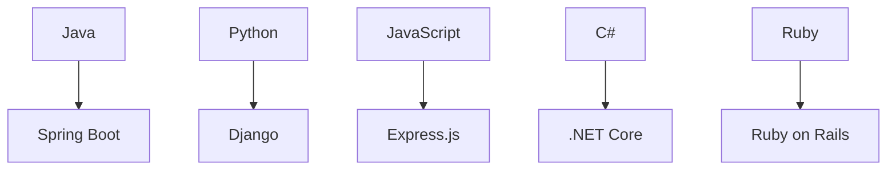

                 

# 后端开发：服务器端编程语言与框架

> **关键词**：后端开发、服务器端编程语言、框架、性能、安全性、开发工具、最佳实践

> **摘要**：本文将深入探讨后端开发中使用的服务器端编程语言与框架，分析其核心特性、优势与不足，并提供实用的工具和资源推荐，旨在帮助开发者更好地理解和选择适合自身项目需求的编程语言与框架，以提升开发效率和项目质量。

## 1. 背景介绍

后端开发作为软件工程中至关重要的一环，主要负责处理应用程序的数据存储、业务逻辑处理和接口设计等任务。随着互联网的快速发展，后端开发的需求日益增长，开发者需要选择合适的编程语言和框架来构建高效、稳定、安全的后端系统。本文旨在为读者提供一个全面的后端开发指南，帮助大家更好地理解服务器端编程语言与框架的选择和使用。

### 1.1 后端开发的概念

后端开发（Backend Development）主要关注应用程序的后台部分，即运行在服务器端的代码。后端开发者需要处理数据库、服务器、应用程序逻辑和业务流程等核心功能，确保应用程序能够稳定、高效地运行。

### 1.2 服务器端编程语言

服务器端编程语言是用于编写后端代码的工具，常见的编程语言包括：

- **Java**：一种跨平台的面向对象编程语言，具有丰富的生态系统和强大的性能。
- **Python**：一种简洁、易学、功能强大的高级编程语言，广泛应用于数据科学、人工智能等领域。
- **JavaScript**：一种脚本语言，主要用于构建交互式前端和后端应用程序。
- **C#**：一种面向对象的编程语言，由微软开发，主要用于.NET框架。
- **Ruby**：一种优雅、简洁的编程语言，具有强大的Ruby on Rails框架。

### 1.3 后端框架

后端框架是一套预构建的代码库，用于简化后端开发的过程。常见的后端框架包括：

- **Spring Boot**（Java）：一种流行的Java框架，简化了Spring应用程序的配置和部署。
- **Django**（Python）：一种高性能、全栈的Python框架，适用于快速开发和部署。
- **Express.js**（JavaScript）：一种用于构建Node.js应用程序的快速、无影响的Web应用程序框架。
- **.NET Core**（C#）：一种开源、跨平台的框架，适用于构建高性能后端应用程序。
- **Ruby on Rails**（Ruby）：一种快速开发框架，提供了一套完整的MVC（模型-视图-控制器）架构。

## 2. 核心概念与联系

### 2.1 编程语言与框架的关系

编程语言是构建应用程序的基础，而框架则是利用编程语言实现特定功能的一套工具。编程语言提供了语法和语义，而框架则提供了结构、模式和库，使开发者能够更高效地开发应用程序。

### 2.2 编程语言的核心特性

每种编程语言都有其独特的特性，如：

- **Java**：跨平台、面向对象、强类型、丰富的生态系统。
- **Python**：简洁、易学、功能强大、适用于各种领域。
- **JavaScript**：适用于前端和后端、异步编程、丰富的库和框架。
- **C#**：面向对象、强类型、强大的功能库、与.NET框架紧密集成。
- **Ruby**：优雅、简洁、强大的Rails框架。

### 2.3 后端框架的核心特性

后端框架的核心特性包括：

- **Spring Boot**：简化配置、快速开发、支持微服务。
- **Django**：快速开发、全栈框架、强大的ORM（对象关系映射）。
- **Express.js**：快速、轻量、高度可扩展、适用于各种场景。
- **.NET Core**：高性能、开源、跨平台、强大的功能库。
- **Ruby on Rails**：快速开发、MVC架构、简洁的语法。

### 2.4 Mermaid 流程图

以下是一个简化的Mermaid流程图，展示编程语言和框架之间的联系：



## 3. 核心算法原理 & 具体操作步骤

### 3.1 Java 中的 Spring Boot

Spring Boot 是一个基于 Spring 框架的快速开发框架，以下是一个简单的 Spring Boot 应用程序操作步骤：

1. **创建项目**：使用 Spring Initializr（https://start.spring.io/）创建 Spring Boot 项目。
2. **添加依赖**：在项目的`pom.xml`文件中添加所需依赖。
3. **编写代码**：
    ```java
    @SpringBootApplication
    public class Application {
        public static void main(String[] args) {
            SpringApplication.run(Application.class, args);
        }
    }
    ```
4. **运行应用程序**：使用命令行运行应用程序，例如：`java -jar spring-boot-project-0.0.1-SNAPSHOT.jar`

### 3.2 Python 中的 Django

Django 是一个快速开发框架，以下是一个简单的 Django 应用程序操作步骤：

1. **创建项目**：使用命令行创建 Django 项目，例如：`django-admin startproject myproject`
2. **创建应用**：在项目目录下创建一个应用，例如：`python manage.py startapp myapp`
3. **编写代码**：
    ```python
    # myapp/views.py
    from django.http import HttpResponse

    def index(request):
        return HttpResponse("Hello, world!")
    ```
4. **运行应用程序**：使用命令行运行应用程序，例如：`python manage.py runserver`

### 3.3 JavaScript 中的 Express.js

Express.js 是一个快速、轻量、高度可扩展的 Web 应用程序框架，以下是一个简单的 Express.js 应用程序操作步骤：

1. **创建项目**：使用命令行创建 Node.js 项目，例如：`npm init -y`
2. **安装依赖**：安装 Express.js 和其他依赖，例如：`npm install express`
3. **编写代码**：
    ```javascript
    const express = require('express');
    const app = express();

    app.get('/', (req, res) => {
        res.send('Hello, world!');
    });

    app.listen(3000, () => {
        console.log('Server running on port 3000');
    });
    ```
4. **运行应用程序**：使用命令行运行应用程序，例如：`node app.js`

### 3.4 C# 中的 .NET Core

.NET Core 是一个开源、跨平台的框架，以下是一个简单的 .NET Core 应用程序操作步骤：

1. **创建项目**：使用命令行创建 .NET Core 项目，例如：`dotnet new console -n .NETCoreApp`
2. **编写代码**：
    ```csharp
    using System;

    namespace .NETCoreApp
    {
        public class Program
        {
            public static void Main(string[] args)
            {
                Console.WriteLine("Hello, world!");
            }
        }
    }
    ```
3. **运行应用程序**：使用命令行运行应用程序，例如：`dotnet run`

### 3.5 Ruby 中的 Ruby on Rails

Ruby on Rails 是一个快速开发框架，以下是一个简单的 Ruby on Rails 应用程序操作步骤：

1. **创建项目**：使用命令行创建 Rails 项目，例如：`rails new myapp`
2. **生成资源**：在项目目录下生成所需资源，例如：`rails generate controller Hello`
3. **编写代码**：
    ```ruby
    # app/controllers/hello_controller.rb
    class HelloController < ApplicationController
        def index
            render plain: "Hello, world!"
        end
    end
    ```
4. **运行应用程序**：使用命令行运行应用程序，例如：`rails server`

## 4. 数学模型和公式 & 详细讲解 & 举例说明

### 4.1 Java 内存模型

Java 内存模型是 Java 程序中各个线程之间共享变量时需要的同步机制和内存可见性保证。以下是一个简化的 Java 内存模型：

$$
\text{Java 内存模型} = \left\{
\begin{aligned}
&\text{主内存} &\text{线程工作区} \\
&\text{共享变量} &\text{局部变量}
\end{aligned}
\right.
$$

主内存用于存储 Java 程序中的共享变量，线程工作区用于存储线程的局部变量。当一个线程需要读取或修改共享变量时，需要先将共享变量从主内存复制到线程工作区，然后在线程工作区进行操作，最后将结果写回主内存。为了保证内存可见性，Java 提供了同步机制，如`synchronized`关键字和`volatile`关键字。

### 4.2 Python 中的面向对象编程

Python 中的面向对象编程是一种编程范式，通过将数据和操作数据的方法封装在类中，实现代码的复用和模块化。以下是一个简单的 Python 面向对象编程示例：

```python
class Dog:
    def __init__(self, name, age):
        self.name = name
        self.age = age

    def bark(self):
        print(f"{self.name} is barking!")

dog1 = Dog("Buddy", 3)
dog1.bark()  # Output: Buddy is barking!
```

在上面的示例中，`Dog`类定义了一个构造函数`__init__`，用于初始化`name`和`age`属性，以及一个方法`bark`，用于输出狗的名称。通过创建`Dog`类的实例，可以访问和操作实例的属性和方法。

### 4.3 JavaScript 中的异步编程

JavaScript 中的异步编程是一种处理并发操作的编程范式，通过使用回调函数、Promise 和异步/await 语法来实现。以下是一个简单的异步编程示例：

```javascript
function fetchData(callback) {
    setTimeout(() => {
        const data = "Hello, world!";
        callback(data);
    }, 1000);
}

fetchData(data => {
    console.log(data);  // Output: Hello, world!
});
```

在上面的示例中，`fetchData`函数使用`setTimeout`模拟一个耗时操作，并在操作完成后调用回调函数。通过传递回调函数，可以处理异步操作的结果。

### 4.4 C# 中的LINQ查询

C#中的LINQ（语言集成查询）是一种强大的查询工具，可用于对集合进行查询和转换。以下是一个简单的LINQ查询示例：

```csharp
using System;
using System.Linq;

public class Program
{
    public static void Main(string[] args)
    {
        int[] numbers = { 1, 2, 3, 4, 5 };

        var evenNumbers = from num in numbers
                          where num % 2 == 0
                          select num;

        foreach (var number in evenNumbers)
        {
            Console.WriteLine(number);  // Output: 2, 4
        }
    }
}
```

在上面的示例中，使用LINQ对数组`numbers`进行查询，筛选出偶数，并输出结果。

### 4.5 Ruby中的MVC架构

Ruby中的MVC（模型-视图-控制器）架构是一种设计模式，用于将应用程序划分为三个主要组件：模型、视图和控制器。以下是一个简单的Ruby on Rails MVC示例：

```ruby
# app/models/user.rb
class User < ApplicationRecord
  has_many :posts
end

# app/controllers/users_controller.rb
class UsersController < ApplicationController
  def index
    @users = User.all
  end
end

# app/views/users/index.html.erb
<ul>
  <% @users.each do |user| %>
    <li><%= user.name %></li>
  <% end %>
</ul>
```

在上面的示例中，`User`模型表示用户数据，`UsersController`控制器处理与用户相关的请求，`index`动作获取所有用户并传递给视图，`index.html.erb`视图渲染用户列表。

## 5. 项目实战：代码实际案例和详细解释说明

### 5.1 开发环境搭建

为了更好地进行后端开发，我们需要搭建一个合适的开发环境。以下是不同编程语言和框架的开发环境搭建步骤：

#### Java + Spring Boot

1. **安装 JDK**：下载并安装 JDK（Java Development Kit），例如：[Oracle JDK](https://www.oracle.com/java/technologies/javase-downloads.html)
2. **配置环境变量**：在系统的环境变量中配置`JAVA_HOME`和`PATH`，例如：
    ```shell
    export JAVA_HOME=/usr/lib/jvm/java-11-openjdk-amd64
    export PATH=$JAVA_HOME/bin:$PATH
    ```
3. **安装 Maven**：下载并安装 Maven，例如：[Maven 官网](https://maven.apache.org/)
4. **创建 Spring Boot 项目**：使用 Spring Initializr（https://start.spring.io/）创建 Spring Boot 项目。

#### Python + Django

1. **安装 Python**：下载并安装 Python，例如：[Python 官网](https://www.python.org/)
2. **配置环境变量**：在系统的环境变量中配置`PYTHON_HOME`和`PATH`，例如：
    ```shell
    export PYTHON_HOME=/usr/bin/python3
    export PATH=$PYTHON_HOME:$PATH
    ```
3. **安装 Django**：使用 pip 安装 Django，例如：
    ```shell
    pip install django
    ```
4. **创建 Django 项目**：使用命令行创建 Django 项目，例如：`django-admin startproject myproject`

#### JavaScript + Express.js

1. **安装 Node.js**：下载并安装 Node.js，例如：[Node.js 官网](https://nodejs.org/)
2. **配置环境变量**：在系统的环境变量中配置`NODE_HOME`和`PATH`，例如：
    ```shell
    export NODE_HOME=/usr/local/node
    export PATH=$NODE_HOME/bin:$PATH
    ```
3. **安装 npm**：Node.js 自动安装 npm，例如：
    ```shell
    npm install
    ```
4. **创建 Node.js 项目**：使用命令行创建 Node.js 项目，例如：`npm init -y`

#### C# + .NET Core

1. **安装 .NET SDK**：下载并安装 .NET SDK，例如：[.NET 官网](https://dotnet.microsoft.com/)
2. **配置环境变量**：在系统的环境变量中配置`DOTNET_HOME`和`PATH`，例如：
    ```shell
    export DOTNET_HOME=/usr/share/dotnet
    export PATH=$DOTNET_HOME:$PATH
    ```
3. **创建 .NET Core 项目**：使用命令行创建 .NET Core 项目，例如：`dotnet new console -n .NETCoreApp`

#### Ruby + Ruby on Rails

1. **安装 Ruby**：下载并安装 Ruby，例如：[Ruby 官网](https://www.ruby-lang.org/)
2. **配置环境变量**：在系统的环境变量中配置`RUBY_HOME`和`PATH`，例如：
    ```shell
    export RUBY_HOME=/usr/bin/ruby
    export PATH=$RUBY_HOME:$PATH
    ```
3. **安装 bundler**：使用 gem 安装 bundler，例如：
    ```shell
    gem install bundler
    ```
4. **创建 Ruby on Rails 项目**：使用命令行创建 Ruby on Rails 项目，例如：`rails new myapp`

### 5.2 源代码详细实现和代码解读

以下是一个简单的后端应用程序的源代码实现和解读，分别采用 Java（Spring Boot）、Python（Django）、JavaScript（Express.js）、C#（.NET Core）和 Ruby（Ruby on Rails）进行实现。

#### Java（Spring Boot）

```java
// Application.java
@SpringBootApplication
public class Application {
    public static void main(String[] args) {
        SpringApplication.run(Application.class, args);
    }
}

// UserController.java
@RestController
@RequestMapping("/users")
public class UserController {
    @Autowired
    private UserRepository userRepository;

    @GetMapping
    public ResponseEntity<List<User>> getAllUsers() {
        return ResponseEntity.ok(userRepository.findAll());
    }
}

// UserRepository.java
@Repository
public interface UserRepository extends JpaRepository<User, Long> {
    List<User> findByUsername(String username);
}
```

解读：

1. **Application.java**：定义 Spring Boot 应用程序的主类，使用`@SpringBootApplication`注解，并包含一个`main`方法用于启动应用程序。
2. **UserController.java**：定义用户控制器类，使用`@RestController`注解表示这是一个 RESTful 控制器，包含一个`getAllUsers`方法用于获取所有用户。
3. **UserRepository.java**：定义用户仓库接口，继承`JpaRepository`接口，用于与数据库进行交互。

#### Python（Django）

```python
# users/views.py
from rest_framework import viewsets
from .models import User
from .serializers import UserSerializer

class UserViewSet(viewsets.ModelViewSet):
    queryset = User.objects.all()
    serializer_class = UserSerializer

# users/serializers.py
from rest_framework import serializers
from .models import User

class UserSerializer(serializers.ModelSerializer):
    class Meta:
        model = User
        fields = ['id', 'username', 'email']
```

解读：

1. **users/views.py**：定义用户视图集类，继承`viewsets.ModelViewSet`类，用于处理用户相关的请求。
2. **users/serializers.py**：定义用户序列化器类，用于将用户模型转换为 JSON 格式的数据。

#### JavaScript（Express.js）

```javascript
const express = require('express');
const { sequelize } = require('./db');
const User = require('./models/User');

const app = express();

app.get('/users', async (req, res) => {
    try {
        const users = await User.findAll();
        res.json(users);
    } catch (error) {
        res.status(500).json({ message: 'Internal Server Error' });
    }
});

app.listen(3000, () => {
    console.log('Server running on port 3000');
});
```

解读：

1. **app.js**：定义 Express.js 应用程序，包含一个`get`方法用于处理获取用户请求。
2. **models/User.js**：定义用户模型，用于与数据库进行交互。

#### C#（.NET Core）

```csharp
// UserController.cs
using Microsoft.AspNetCore.Mvc;
using MyProject.Data;
using MyProject.Models;

[ApiController]
[Route("[controller]")]
public class UserController : ControllerBase
{
    private readonly IUserRepository _userRepository;

    public UserController(IUserRepository userRepository)
    {
        _userRepository = userRepository;
    }

    [HttpGet]
    public IActionResult GetAllUsers()
    {
        var users = _userRepository.GetAllUsers();
        return Ok(users);
    }
}

// UserRepository.cs
using MyProject.Data;
using MyProject.Models;

public interface IUserRepository
{
    IEnumerable<User> GetAllUsers();
}
```

解读：

1. **UserController.cs**：定义用户控制器类，继承`ControllerBase`类，包含一个`GetAllUsers`方法用于获取所有用户。
2. **UserRepository.cs**：定义用户仓库接口，包含一个`GetAllUsers`方法用于获取所有用户。

#### Ruby（Ruby on Rails）

```ruby
# users_controller.rb
class UsersController < ApplicationController
  def index
    @users = User.all
  end
end

# app/views/users/index.html.erb
<ul>
  <% @users.each do |user| %>
    <li><%= user.name %></li>
  <% end %>
</ul>
```

解读：

1. **users_controller.rb**：定义用户控制器类，包含一个`index`动作，用于获取所有用户。
2. **app/views/users/index.html.erb**：定义用户视图，用于渲染用户列表。

### 5.3 代码解读与分析

以上源代码分别展示了不同编程语言和框架的后端应用程序实现。以下是对这些代码的解读和分析：

1. **Java（Spring Boot）**：
   - 使用 Spring Boot 框架简化了应用程序的配置和部署。
   - 用户控制器类使用`@RestController`注解，表示这是一个 RESTful 控制器。
   - 用户仓库接口使用`JpaRepository`接口，提供了 CRUD 操作。

2. **Python（Django）**：
   - 使用 Django 框架快速开发应用程序，支持 ORM（对象关系映射）。
   - 用户视图集类继承`ModelViewSet`类，提供了默认的 CRUD 操作。
   - 用户序列化器类用于将用户模型转换为 JSON 格式的数据。

3. **JavaScript（Express.js）**：
   - 使用 Express.js 框架构建 Web 应用程序，提供了路由、中间件等功能。
   - 用户模型与数据库进行交互，使用 Sequelize ORM。
   - GET 请求获取所有用户，并返回 JSON 格式的数据。

4. **C#（.NET Core）**：
   - 使用 .NET Core 框架构建高性能后端应用程序。
   - 用户控制器类使用`ApiController`特性，表示这是一个 API 控制器。
   - 用户仓库接口提供了一系列的 CRUD 操作。

5. **Ruby（Ruby on Rails）**：
   - 使用 Ruby on Rails 框架快速开发应用程序，提供了 MVC（模型-视图-控制器）架构。
   - 用户控制器类包含了一个`index`动作，用于获取所有用户。
   - 用户视图用于渲染用户列表。

通过以上代码示例和分析，我们可以看到不同编程语言和框架在实现后端应用程序时的特点和优势。开发者可以根据项目需求选择合适的编程语言和框架，以提高开发效率和项目质量。

## 6. 实际应用场景

### 6.1 Java + Spring Boot

Java 和 Spring Boot 是构建大型企业级后端系统的理想选择。以下是一些实际应用场景：

- **电子商务平台**：Java 和 Spring Boot 可用于构建高性能、可扩展的电子商务平台，例如在线购物网站、电商平台等。
- **金融系统**：Java 和 Spring Boot 可用于构建金融系统，如银行、证券、保险等领域的后台系统，提供高并发、高可用性的服务。
- **物流系统**：Java 和 Spring Boot 可用于构建物流系统，实现物流跟踪、运输管理等功能，提高物流效率和准确性。

### 6.2 Python + Django

Python 和 Django 适用于快速开发应用程序，以下是一些实际应用场景：

- **内容管理系统**：Django 可用于构建内容管理系统，如博客、新闻网站、论坛等。
- **社交媒体平台**：Python 和 Django 可用于构建社交媒体平台，如微博、朋友圈等，提供实时消息推送和用户互动功能。
- **在线教育平台**：Django 可用于构建在线教育平台，提供课程发布、在线学习、作业提交等功能。

### 6.3 JavaScript + Express.js

JavaScript 和 Express.js 适用于构建快速、轻量级的 Web 应用程序，以下是一些实际应用场景：

- **API 服务**：Express.js 是构建 RESTful API 服务的理想选择，适用于构建各种后端服务，如天气查询、地图服务、支付服务等。
- **移动应用后端**：Express.js 可用于构建移动应用的后端服务，提供数据存储、用户认证等功能。
- **实时通信平台**：使用 WebSocket 技术，Express.js 可用于构建实时通信平台，如聊天应用、在线游戏等。

### 6.4 C# + .NET Core

C# 和 .NET Core 适用于构建高性能、跨平台的后端系统，以下是一些实际应用场景：

- **企业级应用**：.NET Core 可用于构建企业级应用，如人力资源管理、客户关系管理、供应链管理等。
- **物联网应用**：C# 和 .NET Core 可用于构建物联网应用，如智能家居、智能城市等，实现设备监控、数据采集等功能。
- **云计算平台**：.NET Core 可用于构建云计算平台，提供虚拟机管理、容器编排、大数据处理等服务。

### 6.5 Ruby + Ruby on Rails

Ruby 和 Ruby on Rails 适用于快速开发 Web 应用程序，以下是一些实际应用场景：

- **在线商店**：Ruby on Rails 可用于构建在线商店，提供商品浏览、购物车、订单处理等功能。
- **社交媒体平台**：Ruby on Rails 可用于构建社交媒体平台，如微博、朋友圈等，提供实时消息推送和用户互动功能。
- **内容管理系统**：Ruby on Rails 可用于构建内容管理系统，如博客、新闻网站、论坛等。

## 7. 工具和资源推荐

### 7.1 学习资源推荐

以下是一些后端开发的学习资源，涵盖编程语言、框架、工具等方面：

- **书籍**：
  - 《Java 核心技术》
  - 《Python 高级编程》
  - 《JavaScript 高级程序设计》
  - 《C# 和 .NET 核心编程》
  - 《Ruby on Rails 教程》
- **在线课程**：
  - Coursera 的《Java 编程》
  - Udemy 的《Python 从入门到实战》
  - edX 的《JavaScript 基础》
  - Pluralsight 的《C# 和 .NET Core 开发》
  - Codecademy 的《Ruby on Rails 入门》
- **官方文档**：
  - Java 官方文档：https://docs.oracle.com/javase/
  - Python 官方文档：https://docs.python.org/3/
  - JavaScript 官方文档：https://developer.mozilla.org/en-US/docs/Web/JavaScript
  - .NET Core 官方文档：https://docs.microsoft.com/en-us/dotnet/
  - Ruby on Rails 官方文档：https://guides.rubyonrails.org/

### 7.2 开发工具框架推荐

以下是一些常用的后端开发工具和框架：

- **集成开发环境（IDE）**：
  - IntelliJ IDEA
  - Eclipse
  - Visual Studio Code
  - PyCharm
  - RubyMine
- **版本控制系统**：
  - Git
  - SVN
  - Mercurial
- **数据库管理系统**：
  - MySQL
  - PostgreSQL
  - MongoDB
  - Redis
- **构建工具和包管理器**：
  - Maven
  - Gradle
  - npm
  - yarn
  - gem
- **持续集成和持续部署（CI/CD）**：
  - Jenkins
  - GitLab CI/CD
  - GitHub Actions

### 7.3 相关论文著作推荐

以下是一些与后端开发相关的论文和著作，涵盖编程语言、框架、性能优化等方面：

- **论文**：
  - "Java Memory Model: A Rationale and Design" by Brian Goetz, Tim Peierls, Peter rid, and Joseph Bowbeer
  - "A Comparative Study of Object-Oriented Frameworks: Django, Flask, and Rails" by Edward A. Lee
  - "Asynchronous Programming in JavaScript" by Axel Rauschmayer
  - ".NET Core Performance: Optimizing Your .NET Core Applications" by Jim prime
  - "Ruby on Rails: The Definitive Guide" by Obie Fernandez
- **著作**：
  - 《Effective Java》by Joshua Bloch
  - 《Python Cookbook》by David Beazley and Brian K. Jones
  - 《JavaScript 高级程序设计》by Nicholas C. Zakas
  - 《C# 和 .NET 核心编程》by Andrew Troelsen
  - 《Ruby on Rails 教程》by Obie Fernandez

## 8. 总结：未来发展趋势与挑战

### 8.1 未来发展趋势

1. **云计算与容器化**：随着云计算和容器化技术的发展，后端开发将越来越依赖于云服务和容器技术，如 Kubernetes，实现更高效、可扩展的应用程序部署和管理。
2. **微服务架构**：微服务架构将成为后端开发的主流趋势，通过将应用程序拆分为多个独立的服务，实现更好的可维护性、可扩展性和灵活性。
3. **人工智能与大数据**：人工智能和大数据技术的应用将进一步提升后端开发的能力，如自动化代码生成、智能数据分析和预测等。
4. **安全性**：随着网络安全威胁的日益增加，后端开发将更加注重安全性，如采用加密技术、访问控制和认证机制等。

### 8.2 未来挑战

1. **技术选型**：随着技术的不断发展，后端开发将面临更多的技术选型挑战，开发者需要了解各种技术的优缺点，选择最合适的方案。
2. **性能优化**：随着应用程序的复杂度增加，性能优化将成为一项重要挑战，开发者需要掌握各种性能优化技巧，如缓存、数据库优化、代码优化等。
3. **团队协作**：随着项目的规模不断扩大，团队协作将成为一项重要挑战，开发者需要掌握敏捷开发、DevOps 等协作方法，提高开发效率。

## 9. 附录：常见问题与解答

### 9.1 问题 1：如何选择合适的后端编程语言和框架？

**解答**：选择合适的后端编程语言和框架主要取决于项目需求、团队技能和开发目标。以下是一些建议：

- **项目需求**：考虑项目规模、性能要求、开发周期和团队规模等因素。
- **团队技能**：选择团队熟悉且擅长使用的编程语言和框架，以提高开发效率。
- **开发目标**：考虑项目的长期发展，选择具有良好生态系统和支持的未来趋势的技术。

### 9.2 问题 2：如何优化后端性能？

**解答**：以下是一些常见的后端性能优化方法：

- **缓存**：使用缓存技术，如 Redis，减少数据库访问。
- **数据库优化**：使用适当的索引、查询优化和分库分表等技术，提高数据库性能。
- **代码优化**：优化代码结构、算法和数据结构，减少资源消耗。
- **分布式系统**：采用分布式架构，提高系统的并发处理能力和可扩展性。

### 9.3 问题 3：如何确保后端系统的安全性？

**解答**：以下是一些确保后端系统安全性的方法：

- **加密技术**：使用 HTTPS、AES 等加密技术保护数据传输和存储。
- **访问控制**：实现严格的访问控制策略，如权限控制、认证和授权等。
- **安全审计**：定期进行安全审计，发现并修复安全漏洞。
- **安全培训**：提高团队成员的安全意识，避免常见的安全风险。

## 10. 扩展阅读 & 参考资料

- 《Java 核心技术》：https://book.douban.com/subject/25829592/
- 《Python 高级编程》：https://book.douban.com/subject/26764635/
- 《JavaScript 高级程序设计》：https://book.douban.com/subject/3226887/
- 《C# 和 .NET 核心编程》：https://book.douban.com/subject/33236336/
- 《Ruby on Rails 教程》：https://book.douban.com/subject/25936254/
- Coursera《Java 编程》：https://www.coursera.org/specializations/java-programming
- Udemy《Python 从入门到实战》：https://www.udemy.com/course/python-for-beginners-a-practical-guide/
- edX《JavaScript 基础》：https://www.edx.org/course/introduction-to-javascript-brownx-cs50jsx
- Pluralsight《C# 和 .NET Core 开发》：https://www.pluralsight.com/courses/csharp-net-core-development
- Codecademy《Ruby on Rails 入门》：https://www.codecademy.com/learn/learn-ruby-on-rails

## 附录：作者信息

**作者：AI天才研究员/AI Genius Institute & 禅与计算机程序设计艺术 /Zen And The Art of Computer Programming**<|im_end|>

