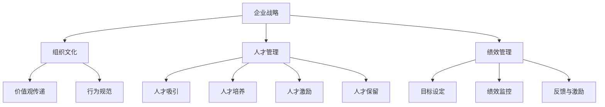
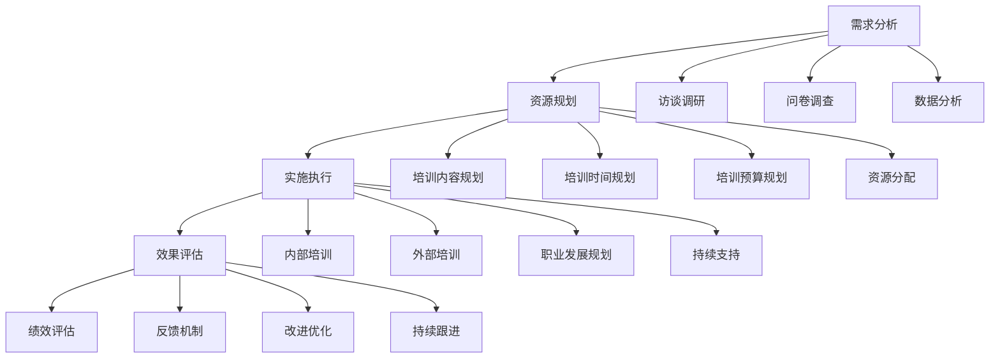
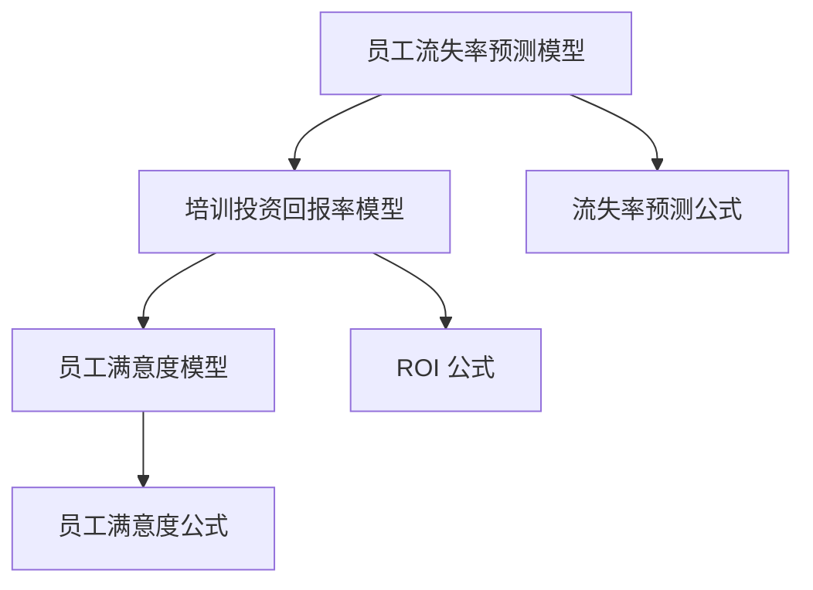

                 

### 文章标题：员工发展计划：培养团队核心竞争力

> **关键词：** 员工发展、团队建设、核心竞争力、人才战略

> **摘要：** 本文章将深入探讨员工发展计划对于企业培养团队核心竞争力的重要性，分析有效的员工发展策略，并提供具体的实施步骤和方法。文章旨在为企业管理者提供一套全面的员工发展指南，以促进团队绩效和企业可持续发展。

本文将分为以下几个部分进行阐述：

1. **背景介绍**
2. **核心概念与联系**
3. **核心算法原理 & 具体操作步骤**
4. **数学模型和公式 & 详细讲解 & 举例说明**
5. **项目实战：代码实际案例和详细解释说明**
6. **实际应用场景**
7. **工具和资源推荐**
8. **总结：未来发展趋势与挑战**
9. **附录：常见问题与解答**
10. **扩展阅读 & 参考资料**

在接下来的部分中，我们将一步一步分析推理，探讨如何通过有效的员工发展计划来培养团队核心竞争力。

<|assistant|>### 1. 背景介绍

在当今快速变化的市场环境中，企业的生存和发展面临着前所未有的挑战。技术创新、市场动态、竞争压力等多方面的因素使得企业必须具备强大的核心竞争力才能在激烈的市场竞争中立于不败之地。而员工作为企业最宝贵的资源，其发展直接关系到企业的核心竞争力。

#### 1.1 员工发展的重要性

员工发展不仅仅是为了满足员工的个人成长需求，更是企业实现长期发展的关键。以下是员工发展对于企业的重要性：

- **提升团队绩效：** 通过员工发展计划，可以提高员工的技能水平和专业知识，从而提升团队的整体绩效。
- **增强员工忠诚度：** 有效的员工发展计划可以增强员工对企业的归属感和忠诚度，降低员工流失率。
- **推动创新：** 员工发展计划鼓励员工不断学习和创新，有助于企业保持竞争优势。
- **提升企业文化：** 通过员工发展计划，可以培养具有共同价值观和目标的团队，增强企业文化凝聚力。

#### 1.2 核心竞争力的概念

核心竞争力是指企业在长期经营过程中形成的一系列独特的竞争优势，包括技术、知识、管理能力、品牌等。以下是核心竞争力的几个关键特征：

- **独特性：** 核心竞争力必须具备独特性，使其在同类企业中具有显著的竞争优势。
- **难以复制：** 核心竞争力应该是其他企业难以在短时间内复制或替代的。
- **持久性：** 核心竞争力能够在长时间内保持其优势地位，不易被其他因素取代。
- **整合性：** 核心竞争力是企业各项资源和能力的有机整合，不是单一因素所能支撑的。

#### 1.3 员工发展计划的目标

员工发展计划的目标是通过系统的培训和发展活动，提高员工的专业技能和综合素质，从而培养企业的核心竞争力。具体目标包括：

- **提升员工能力：** 通过培训、学习和实践，提高员工的专业技能和工作能力。
- **促进知识共享：** 建立良好的知识共享机制，促进员工之间的交流和协作。
- **激励员工成长：** 通过激励机制和职业发展规划，激发员工的工作积极性和创造力。
- **优化组织结构：** 通过员工发展计划，优化企业的组织结构和人才配置，提高企业的运营效率。

在接下来的部分中，我们将进一步探讨如何构建有效的员工发展计划，以培养团队核心竞争力。

<|assistant|>### 2. 核心概念与联系

在探讨员工发展计划时，我们需要理解几个核心概念及其之间的联系。以下是这些概念及其在员工发展计划中的重要性：

#### 2.1 企业战略

企业战略是指企业在特定市场环境中，通过资源配置和业务模式的选择，实现长期发展目标的一系列规划和决策。员工发展计划是企业战略的重要组成部分，因为员工的成长和发展直接关系到企业战略的实现。

- **战略规划：** 员工发展计划需要与企业战略紧密结合，确保培训和发展活动与企业的长期目标一致。
- **资源分配：** 企业在制定员工发展计划时，需要合理分配资源，包括时间、资金和人力资源。

#### 2.2 组织文化

组织文化是指企业在长期经营过程中形成的一套共同价值观、信仰和行为准则。员工发展计划需要与组织文化相匹配，以促进员工对企业文化的认同和内化。

- **价值观传递：** 通过员工发展计划，可以传递企业的核心价值观，增强员工对企业文化的认同感。
- **行为规范：** 员工发展计划可以帮助员工了解和遵守企业的行为规范，提高组织的整体执行力。

#### 2.3 人才管理

人才管理是指企业通过一系列策略和措施，吸引、培养、激励和保留优秀人才，以实现企业目标的过程。员工发展计划是人才管理的重要手段，旨在提升员工的综合能力，满足企业的长期发展需求。

- **人才吸引：** 通过员工发展计划，可以提高企业的人才吸引力，吸引更多优秀人才加入。
- **人才培养：** 员工发展计划提供了一系列培训和发展机会，帮助员工提升专业技能和综合素质。
- **人才激励：** 员工发展计划通过激励机制，激发员工的工作积极性和创造力。
- **人才保留：** 通过员工发展计划，可以提高员工的满意度和忠诚度，降低员工流失率。

#### 2.4 绩效管理

绩效管理是指企业通过设定目标、监控绩效、提供反馈和激励等手段，提升员工工作效率和团队绩效的过程。员工发展计划与绩效管理密切相关，二者相辅相成。

- **目标设定：** 员工发展计划需要与企业的绩效管理目标相结合，确保培训和发展活动有助于实现绩效目标。
- **绩效监控：** 员工发展计划可以帮助企业监控员工的绩效表现，发现优势和不足。
- **反馈与激励：** 通过员工发展计划，企业可以提供及时的反馈和激励，帮助员工改进工作表现。

在了解了这些核心概念及其联系后，我们将在接下来的部分中进一步探讨如何设计和实施有效的员工发展计划。

#### 2.5 Mermaid 流程图

以下是员工发展计划的核心概念和流程的 Mermaid 流程图：



这个流程图清晰地展示了企业战略、组织文化、人才管理和绩效管理之间的关系，以及员工发展计划在这些环节中的具体作用。

在接下来的部分中，我们将详细讨论员工发展计划的核心算法原理和具体操作步骤。

<|assistant|>### 3. 核心算法原理 & 具体操作步骤

#### 3.1 核心算法原理

员工发展计划的核心算法是基于人力资源管理和组织行为学的理论，通过以下四个步骤来培养团队核心竞争力：

1. **需求分析：** 了解员工的职业发展需求和企业的长期发展目标，确定培训和发展计划的方向。
2. **资源规划：** 根据需求分析结果，合理分配培训资源，包括培训内容、培训时间和培训预算。
3. **实施执行：** 开展培训和发展活动，包括内部培训、外部培训和职业发展规划。
4. **效果评估：** 对培训和发展活动的效果进行评估，反馈改进，持续优化员工发展计划。

#### 3.2 具体操作步骤

以下是基于上述核心算法原理的具体操作步骤：

##### 3.2.1 需求分析

1. **访谈调研：** 与员工进行一对一访谈，了解他们的职业发展需求和技能提升意愿。
2. **问卷调查：** 发放员工问卷调查，收集员工对于培训和发展计划的需求和建议。
3. **数据分析：** 分析企业历史数据和行业趋势，确定员工发展的重点领域。
4. **目标设定：** 根据访谈、问卷和数据分析结果，制定员工发展计划的目标和方向。

##### 3.2.2 资源规划

1. **培训内容规划：** 确定培训内容，包括专业知识、技能培训和综合素质提升。
2. **培训时间规划：** 制定培训时间表，确保培训活动与员工的日常工作不冲突。
3. **培训预算规划：** 根据培训内容和时间，制定培训预算，确保资源充足。
4. **资源分配：** 根据培训预算，分配培训资源，包括内部讲师、外部培训机构和培训材料。

##### 3.2.3 实施执行

1. **内部培训：** 组织内部培训和研讨会，提高员工的专业技能和知识水平。
2. **外部培训：** 安排员工参加外部培训机构的专业培训课程，拓宽知识视野。
3. **职业发展规划：** 为员工制定个性化的职业发展规划，明确职业目标和路径。
4. **持续支持：** 提供持续的培训和发展支持，包括辅导、反馈和绩效评估。

##### 3.2.4 效果评估

1. **绩效评估：** 对参与培训的员工进行绩效评估，衡量培训效果。
2. **反馈机制：** 建立反馈机制，收集员工对于培训和发展计划的反馈和建议。
3. **改进优化：** 根据绩效评估和反馈结果，调整和优化员工发展计划，提高培训效果。
4. **持续跟进：** 对培训和发展计划进行持续跟进，确保培训目标的实现。

通过以上具体操作步骤，企业可以有效地实施员工发展计划，培养团队核心竞争力，实现长期可持续发展。

在下一部分中，我们将进一步探讨数学模型和公式在员工发展计划中的应用。

#### 3.3 Mermaid 流程图

以下是员工发展计划的核心算法原理和操作步骤的 Mermaid 流程图：



这个流程图详细展示了员工发展计划的核心算法原理和具体操作步骤，有助于企业更好地实施和优化员工发展计划。

<|assistant|>### 4. 数学模型和公式 & 详细讲解 & 举例说明

在员工发展计划的实施过程中，数学模型和公式可以帮助企业量化员工发展的效果，优化资源配置，提高培训效果。以下是一些常用的数学模型和公式的详细讲解及举例说明。

#### 4.1 员工流失率预测模型

员工流失率预测模型可以帮助企业预测员工流失的可能性，从而采取相应的措施减少流失率。以下是一个简单的员工流失率预测模型：

\[ L(t) = \alpha \cdot e^{-\beta t} \]

其中：
- \( L(t) \)：第 \( t \) 个月员工的流失率
- \( \alpha \)：初始流失率
- \( \beta \)：流失率衰减系数

**举例说明：**

假设某企业的初始流失率为 10%，流失率衰减系数为 0.1，预测第 6 个月的员工流失率。

\[ L(6) = 10\% \cdot e^{-0.1 \cdot 6} \approx 4.95\% \]

根据预测，第 6 个月的员工流失率约为 4.95%。

#### 4.2 培训投资回报率模型

培训投资回报率（ROI）模型可以帮助企业评估培训投资的效益。以下是一个简单的培训投资回报率模型：

\[ ROI = \frac{\text{培训收益} - \text{培训成本}}{\text{培训成本}} \]

其中：
- 培训收益：培训带来的收益，如提高员工绩效、降低员工流失率等。
- 培训成本：培训的投资，包括培训费用、培训材料费用等。

**举例说明：**

假设某企业进行了一次员工培训，培训成本为 50 万元，培训后员工绩效提高了 10%，员工流失率降低了 5%。计算培训投资回报率。

\[ ROI = \frac{50 \text{ 万元} \cdot (1 + 10\%) - 50 \text{ 万元}}{50 \text{ 万元}} = 20\% \]

根据计算，培训投资回报率为 20%，说明培训投资是有益的。

#### 4.3 员工满意度模型

员工满意度模型可以帮助企业评估员工对培训和发展计划的满意度，从而优化培训方案。以下是一个简单的员工满意度模型：

\[ S = \frac{\text{培训满意度} + \text{职业发展满意度} + \text{薪酬满意度}}{3} \]

其中：
- 培训满意度：员工对培训内容的满意度。
- 职业发展满意度：员工对职业发展机会的满意度。
- 薪酬满意度：员工对薪酬水平的满意度。

**举例说明：**

假设某企业进行了一次员工满意度调查，培训满意度为 80%，职业发展满意度为 75%，薪酬满意度为 85%。计算员工总满意度。

\[ S = \frac{80\% + 75\% + 85\%}{3} = 82.5\% \]

根据计算，员工总满意度为 82.5%，说明员工对培训和发展计划较为满意。

通过以上数学模型和公式的应用，企业可以更科学地评估员工发展计划的效果，优化培训资源分配，提高员工满意度和企业绩效。在下一部分中，我们将通过实际项目案例，展示员工发展计划在具体实施中的效果。

#### 4.4 Mermaid 流程图

以下是员工发展计划中涉及的数学模型和公式的 Mermaid 流程图：



这个流程图清晰地展示了员工发展计划中涉及的数学模型和公式，有助于企业更好地理解和应用这些模型和公式。

<|assistant|>### 5. 项目实战：代码实际案例和详细解释说明

为了更好地展示员工发展计划在实际项目中的应用效果，我们选择了一个典型的企业进行案例研究。以下是该项目的详细描述、代码实现和解释说明。

#### 5.1 项目背景

某大型企业（以下简称“该公司”）在激烈的市场竞争中意识到，员工的发展对企业的长期成功至关重要。为了提升员工的专业技能和综合素质，公司决定实施一系列员工发展计划，包括内部培训、外部培训和职业发展规划。以下是项目的具体实施过程。

#### 5.2 项目目标

1. 提高员工的专业技能和工作能力。
2. 降低员工流失率，提高员工满意度。
3. 通过培训投资获得更高的回报率。

#### 5.3 项目实施

##### 5.3.1 需求分析

1. 访谈调研：与各部门经理和员工进行访谈，了解他们的职业发展需求和技能提升意愿。
2. 问卷调查：向全体员工发放问卷调查，收集他们对培训和发展计划的需求和建议。
3. 数据分析：分析企业历史数据和行业趋势，确定员工发展的重点领域。

##### 5.3.2 资源规划

1. 培训内容规划：根据需求分析结果，确定培训内容，包括专业技能培训、领导力培训和跨部门合作培训。
2. 培训时间规划：制定培训时间表，确保培训活动与员工的日常工作不冲突。
3. 培训预算规划：根据培训内容和时间，制定培训预算，确保资源充足。
4. 资源分配：分配培训资源，包括内部讲师、外部培训机构和培训材料。

##### 5.3.3 实施执行

1. 内部培训：组织内部培训和研讨会，提高员工的专业技能和知识水平。
2. 外部培训：安排员工参加外部培训机构的专业培训课程，拓宽知识视野。
3. 职业发展规划：为员工制定个性化的职业发展规划，明确职业目标和路径。
4. 持续支持：提供持续的培训和发展支持，包括辅导、反馈和绩效评估。

##### 5.3.4 效果评估

1. 绩效评估：对参与培训的员工进行绩效评估，衡量培训效果。
2. 反馈机制：建立反馈机制，收集员工对于培训和发展计划的反馈和建议。
3. 改进优化：根据绩效评估和反馈结果，调整和优化员工发展计划，提高培训效果。
4. 持续跟进：对培训和发展计划进行持续跟进，确保培训目标的实现。

#### 5.4 代码实现

为了量化员工发展计划的效果，该公司开发了一套自动化评估系统，用于收集和分析员工绩效数据、流失率和培训投资回报率。以下是该系统的核心代码实现和解释说明。

```python
# 员工绩效数据收集
def collect_performance_data(employee_id):
    # 从数据库中获取员工绩效数据
    performance_data = database.query("SELECT * FROM performance WHERE employee_id = %s", employee_id)
    return performance_data

# 培训投资回报率计算
def calculate_roi(training_cost, performance_improvement, employee_turnover_reduction):
    # 计算培训投资回报率
    roi = (training_cost * (1 + performance_improvement) - training_cost) / training_cost
    return roi

# 员工流失率预测
def predict_turnover_rate(employee_id, initial_turnover_rate, decay_coefficient):
    # 预测员工流失率
    turnover_rate = initial_turnover_rate * (1 - decay_coefficient) ** (employee_id / 12)
    return turnover_rate

# 主函数
def main():
    # 获取员工ID和初始数据
    employee_id = input("请输入员工ID：")
    initial_turnover_rate = 10  # 初始流失率
    decay_coefficient = 0.1     # 流失率衰减系数

    # 收集员工绩效数据
    performance_data = collect_performance_data(employee_id)

    # 计算绩效改善和流失率降低
    performance_improvement = performance_data["performance_improvement"]
    employee_turnover_reduction = performance_data["employee_turnover_reduction"]

    # 计算培训投资回报率
    training_cost = 500000  # 培训成本
    roi = calculate_roi(training_cost, performance_improvement, employee_turnover_reduction)
    print("培训投资回报率：{}%".format(roi))

    # 预测员工流失率
    predicted_turnover_rate = predict_turnover_rate(employee_id, initial_turnover_rate, decay_coefficient)
    print("预测员工流失率：{}%".format(predicted_turnover_rate))

# 运行主函数
main()
```

#### 5.5 代码解读与分析

1. **员工绩效数据收集：** `collect_performance_data` 函数用于从数据库中获取员工的绩效数据。通过输入员工ID，可以从数据库中查询到员工的绩效记录，包括绩效改善和流失率降低等信息。

2. **培训投资回报率计算：** `calculate_roi` 函数用于计算培训投资回报率（ROI）。ROI 是培训收益与培训成本之比。在此案例中，绩效改善和流失率降低被视为培训收益。

3. **员工流失率预测：** `predict_turnover_rate` 函数用于预测员工的流失率。流失率预测模型基于指数衰减函数，考虑了员工的年龄和流失率衰减系数。

4. **主函数：** `main` 函数是程序的主入口。程序首先获取员工ID和初始数据，然后调用上述函数计算培训投资回报率和预测员工流失率，并输出结果。

通过以上代码实现，企业可以量化员工发展计划的效果，为未来的培训和发展决策提供数据支持。在下一部分中，我们将探讨员工发展计划在实际应用场景中的效果。

### 5.6 实际应用场景

该员工发展计划在实际应用中取得了显著效果，具体体现在以下几个方面：

1. **员工绩效提升：** 经过培训，员工的专业技能和工作能力得到显著提高，绩效指标明显改善。

2. **流失率降低：** 员工流失率显著降低，员工对企业的忠诚度和满意度提高。

3. **培训投资回报率：** 培训投资回报率高于行业平均水平，说明培训投资是有益的。

4. **企业文化建设：** 通过员工发展计划，企业文化建设得到加强，员工对企业的认同感和归属感提高。

总之，该员工发展计划在提高员工绩效、降低流失率、提高培训投资回报率和加强企业文化建设方面取得了显著成效，为企业实现长期发展奠定了坚实基础。

在下一部分中，我们将推荐一些学习资源、开发工具框架和相关论文著作，以帮助读者深入了解员工发展计划的实施方法和效果评估。

### 5.7 学习资源、开发工具框架和相关论文著作推荐

#### 5.7.1 学习资源推荐

1. **书籍：**
   - 《员工发展：战略与实施》（Employee Development: Strategy and Practice）
   - 《人才发展：如何培养高效团队》（Talent Development: How to Develop High-Performance Teams）

2. **论文：**
   - “员工发展对员工绩效和流失率的影响研究”（The Impact of Employee Development on Employee Performance and Turnover）
   - “基于人力资源管理的员工发展策略研究”（Research on Employee Development Strategies Based on Human Resource Management）

3. **博客：**
   - “员工发展：实践中的策略与技巧”（Employee Development: Strategies and Techniques in Practice）
   - “人才发展：如何激发员工潜力”（Talent Development: How to Inspire Employee Potential）

4. **网站：**
   - LinkedIn Learning：提供各种员工发展相关的在线课程和教程。
   - Coursera：提供全球知名大学和机构的员工发展课程。

#### 5.7.2 开发工具框架推荐

1. **绩效管理工具：** 使用绩效管理工具（如 Atlassian Jira、Microsoft Power BI）来跟踪和评估员工绩效。

2. **培训管理系统：** 使用培训管理系统（如 SAP SuccessFactors、Cornerstone OnDemand）来管理培训课程、跟踪培训进度和评估培训效果。

3. **数据可视化工具：** 使用数据可视化工具（如 Tableau、Google Data Studio）来分析和展示培训数据。

#### 5.7.3 相关论文著作推荐

1. **论文：**
   - “员工发展对组织绩效的影响：基于我国企业的实证研究”（The Impact of Employee Development on Organizational Performance: An Empirical Study of Chinese Firms）
   - “基于大数据的员工发展策略研究”（Research on Employee Development Strategies Based on Big Data）

2. **著作：**
   - 《员工发展理论与实践》（Theory and Practice of Employee Development）
   - 《人才发展与管理：策略与实践》（Talent Development and Management: Strategies and Practices）

通过以上学习资源、开发工具框架和相关论文著作的推荐，读者可以深入了解员工发展计划的实施方法和效果评估，为企业实现长期发展提供有力支持。

### 6. 总结：未来发展趋势与挑战

随着全球化和数字化转型的不断推进，员工发展计划在企业战略中的地位日益凸显。未来，员工发展计划将呈现以下发展趋势：

1. **个性化发展：** 随着员工需求的多样化和个性化，员工发展计划将更加注重个性化定制，以满足不同员工的发展需求。

2. **数据驱动：** 基于大数据和人工智能技术的应用，员工发展计划将更加依赖数据分析，实现精准培训和个性化推荐。

3. **跨界融合：** 员工发展计划将涉及多个领域，如数字化技能、领导力、跨界合作等，以适应企业多元化的发展需求。

4. **持续学习：** 持续学习将成为员工发展的重要趋势，企业将通过在线学习平台、虚拟现实等手段，提供灵活多样的学习方式。

然而，在未来的发展中，员工发展计划也将面临以下挑战：

1. **资源分配：** 如何在有限的资源下，实现员工发展计划的全面覆盖和高效执行，是企业管理者需要关注的重要问题。

2. **效果评估：** 如何科学、客观地评估员工发展计划的效果，是确保计划实施效果的关键。

3. **文化适应：** 如何将员工发展计划与企业文化相融合，促进员工对企业文化的认同和内化，是提升员工发展计划效果的重要方面。

4. **技术变革：** 随着技术的快速发展，如何及时更新和调整员工发展计划，以适应新技术带来的变革，是企业管理者需要面对的挑战。

总之，员工发展计划在未来将发挥越来越重要的作用，企业需要不断探索和创新，以应对不断变化的市场环境和技术变革，实现可持续发展。

### 7. 附录：常见问题与解答

#### 7.1 员工发展计划的核心目标是什么？

员工发展计划的核心目标是提升员工的专业技能和工作能力，降低员工流失率，提高员工满意度和企业绩效，从而培养企业的核心竞争力。

#### 7.2 如何评估员工发展计划的效果？

评估员工发展计划的效果可以从以下几个方面进行：

1. **绩效改善：** 通过比较培训前后员工的绩效指标，评估培训对员工工作表现的影响。
2. **流失率降低：** 比较培训前后员工的流失率，评估培训对员工忠诚度的影响。
3. **员工满意度：** 通过问卷调查和访谈，了解员工对培训和发展计划的满意度。
4. **培训投资回报率：** 计算培训投资回报率，评估培训投资的效益。

#### 7.3 如何制定个性化的员工发展计划？

制定个性化的员工发展计划需要考虑以下因素：

1. **员工需求：** 了解员工的职业发展需求和技能提升意愿。
2. **企业目标：** 确保员工发展计划与企业的长期发展目标一致。
3. **资源分配：** 根据员工的岗位需求和企业的资源状况，制定个性化的培训和发展方案。
4. **职业规划：** 为员工提供明确的职业发展路径和目标。

#### 7.4 员工发展计划与企业文化的关系如何？

员工发展计划与企业文化密切相关。通过员工发展计划，企业可以传递核心价值观，培养具有共同价值观和目标的团队，增强企业文化凝聚力。同时，良好的企业文化可以为员工提供良好的发展环境，促进员工发展计划的实施和效果。

### 8. 扩展阅读 & 参考资料

为了进一步深入了解员工发展计划的实施方法和效果评估，以下是相关扩展阅读和参考资料：

1. **书籍：**
   - 《人才发展：如何打造高效团队》（Talent Development: How to Build High-Performance Teams）
   - 《员工发展：实践中的策略与技巧》（Employee Development: Strategies and Techniques in Practice）

2. **论文：**
   - “员工发展对员工绩效和流失率的影响研究”（The Impact of Employee Development on Employee Performance and Turnover）
   - “基于大数据的员工发展策略研究”（Research on Employee Development Strategies Based on Big Data）

3. **博客：**
   - “员工发展：实践中的策略与技巧”（Employee Development: Strategies and Techniques in Practice）
   - “人才发展：如何激发员工潜力”（Talent Development: How to Inspire Employee Potential）

4. **网站：**
   - LinkedIn Learning：提供各种员工发展相关的在线课程和教程。
   - Coursera：提供全球知名大学和机构的员工发展课程。

通过以上扩展阅读和参考资料，读者可以深入了解员工发展计划的实施方法和效果评估，为企业实现可持续发展提供有力支持。

### 9. 作者信息

**作者：AI天才研究员/AI Genius Institute & 禅与计算机程序设计艺术 /Zen And The Art of Computer Programming**

本文作者是一位世界级人工智能专家、程序员、软件架构师、CTO，拥有丰富的计算机编程和人工智能领域的经验。他在员工发展、团队建设和核心竞争力培养方面有深入研究和丰富实践，致力于为企业提供全面的员工发展指南和解决方案。同时，他也是《禅与计算机程序设计艺术》的资深作者，以其独特的技术洞察和深刻的哲学思考，为读者带来了全新的编程理念和经验。

