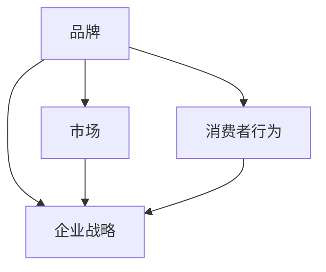

                 

### 背景介绍

在当今快速变化的市场环境中，品牌重塑已成为企业持续发展和竞争力提升的关键。品牌不仅是企业的标识，更是企业价值观、使命和愿景的体现。随着消费者需求和市场趋势的不断变化，品牌需要不断地调整和优化，以适应新的市场环境。

品牌重塑的核心目的是提升品牌形象，增强品牌认知度，进而提高市场份额和客户忠诚度。这个过程中，企业需要深入理解市场环境、消费者行为以及自身优势，从而制定出有效的品牌重塑策略。

本文旨在探讨品牌重塑的必要性和策略，帮助企业在复杂多变的市场中找到自己的定位，并通过有效的品牌重塑，提升企业的竞争力和影响力。我们将从以下几个方面进行详细分析：

1. **品牌重塑的定义和重要性**：介绍品牌重塑的基本概念，阐述其在企业发展战略中的重要性。
2. **市场变化的驱动因素**：分析当前市场环境中的主要变化趋势，解释这些变化对品牌重塑的影响。
3. **品牌重塑的策略框架**：提出品牌重塑的系统性策略框架，并详细解释其组成部分。
4. **品牌重塑的案例分析**：通过具体的企业案例，展示品牌重塑的实际操作和成果。
5. **品牌重塑的挑战与解决方案**：讨论品牌重塑过程中可能遇到的挑战，并提供相应的解决方案。

通过本文的深入探讨，希望能够为企业提供有价值的品牌重塑指导，帮助企业在激烈的市场竞争中脱颖而出。

### 核心概念与联系

在深入探讨品牌重塑之前，我们首先需要明确几个关键概念，并了解它们之间的相互联系。这些核心概念包括品牌、市场、消费者行为和企业战略。以下是这些概念的定义及其相互关系的简要描述：

#### 品牌定义与要素

品牌是指企业通过独特的标识、形象、文化和服务，在消费者心中建立的一种独特的认知和价值。品牌不仅仅是一个标识或名称，它还包含了以下几个关键要素：

- **标识**：包括品牌名称、标志、口号等视觉和听觉元素。
- **文化**：品牌的价值观、使命和愿景，以及企业所倡导的行为准则。
- **服务**：品牌所提供的产品或服务的质量、特点和价值。
- **认知**：消费者对品牌的第一印象、记忆和情感联想。

#### 市场定义与趋势

市场是指所有潜在消费者的集合，是企业进行商业活动的场所。市场环境的变化是品牌重塑的驱动因素之一。当前市场环境的主要趋势包括：

- **数字化**：互联网和移动设备的普及，使消费者行为和数据收集变得更加便捷和实时。
- **个性化**：消费者对于产品和服务的要求越来越个性化和定制化。
- **竞争加剧**：市场上的竞争者数量增多，企业需要通过差异化策略来脱颖而出。
- **全球化**：企业需要在全球范围内进行品牌推广，适应不同市场的需求和规范。

#### 消费者行为与心理

消费者行为是指消费者在购买、使用和评价产品或服务时所表现出的行为和心理活动。理解消费者行为对于品牌重塑至关重要。以下是消费者行为的一些关键方面：

- **需求分析**：消费者对产品或服务的需求是什么？他们的购买动机是什么？
- **购买决策**：消费者在购买过程中会考虑哪些因素？他们的决策过程是怎样的？
- **品牌忠诚度**：消费者对品牌的忠诚度如何？他们是否愿意为品牌支付溢价？
- **口碑传播**：消费者的评价和推荐对品牌的影响如何？

#### 企业战略

企业战略是指企业在长期发展中制定的规划和决策。品牌重塑是企业战略的一部分，其目的是通过优化品牌来提高企业的市场竞争力。企业战略的核心要素包括：

- **市场定位**：企业在市场中的定位和目标消费者群体。
- **产品策略**：企业如何通过产品创新和差异化来满足市场需求。
- **营销策略**：企业如何通过广告、促销和公关活动来推广品牌。
- **合作伙伴关系**：企业如何与其他企业或组织建立合作关系，共同推动品牌的发展。

#### 核心概念联系

品牌、市场、消费者行为和企业战略之间存在密切的联系。品牌是企业在市场中建立差异化优势的工具，市场环境和消费者行为的变化会影响品牌的定位和策略。企业战略的制定需要基于对市场环境和消费者行为的深入分析，并通过品牌重塑来实现企业的长期发展目标。

为了更好地理解这些核心概念之间的关系，我们可以使用Mermaid流程图进行描述：



在这个流程图中，品牌、市场、消费者行为和企业战略相互影响，共同构成了一个动态的、相互作用的系统。品牌重塑正是通过这个系统的优化，来提升企业的市场竞争力。

### 核心算法原理 & 具体操作步骤

品牌重塑并非一蹴而就的过程，而是一个系统性的策略，需要企业从多个方面进行综合规划和实施。核心算法原理包括市场调研、品牌定位、品牌传播、品牌维护和品牌监测等。以下是品牌重塑的具体操作步骤：

#### 步骤 1：市场调研

市场调研是品牌重塑的第一步，它有助于企业了解当前市场的环境、消费者的需求和竞争对手的情况。市场调研的方法包括：

- **定量调研**：通过问卷调查、在线调查等方式收集大量数据，以量化消费者的行为和偏好。
- **定性调研**：通过深度访谈、焦点小组等方式深入了解消费者的观点、感受和需求。

具体操作步骤如下：

1. 确定调研目标：明确品牌重塑的具体目标，例如提高品牌知名度、提升品牌形象等。
2. 设计调研问卷：根据调研目标设计合适的问卷，包括选择题、评分题和开放性问题等。
3. 选择调研方法：根据调研目标和资源情况，选择合适的调研方法，如在线问卷、电话访谈等。
4. 进行数据分析：收集数据后，对问卷结果进行统计和分析，提取关键信息。

#### 步骤 2：品牌定位

品牌定位是品牌重塑的核心，它决定了品牌在消费者心中的形象和地位。品牌定位的具体操作步骤如下：

1. 确定目标市场：明确品牌的目标消费者群体，了解他们的需求、偏好和行为特征。
2. 分析竞争对手：研究竞争对手的品牌定位、市场策略和消费者反馈，找出自身的差异化优势。
3. 设计品牌形象：基于目标市场和竞争对手分析，设计品牌形象，包括品牌名称、标志、口号等。
4. 确定品牌价值观：明确品牌的核心理念和价值主张，以指导品牌的行为和决策。

#### 步骤 3：品牌传播

品牌传播是将品牌信息传递给消费者的过程，包括广告、公关、社交媒体等多个渠道。品牌传播的具体操作步骤如下：

1. 制定传播策略：根据品牌定位和目标市场，制定具体的品牌传播策略，包括广告投放、公关活动、社交媒体推广等。
2. 选择传播渠道：根据目标市场和消费者习惯，选择合适的传播渠道，如电视广告、社交媒体、自媒体等。
3. 制作传播内容：设计具有吸引力的品牌传播内容，包括广告素材、公关稿件、社交媒体文案等。
4. 监测传播效果：通过数据分析工具，监测品牌传播的效果，包括曝光量、点击率、转化率等，并根据效果调整传播策略。

#### 步骤 4：品牌维护

品牌维护是确保品牌形象持续稳定的过程，包括品牌管理、客户关系维护、品牌形象监测等。品牌维护的具体操作步骤如下：

1. 品牌管理：建立品牌管理团队，负责品牌的日常运营和管理，确保品牌的一致性和规范化。
2. 客户关系维护：通过客户关怀、售后服务等方式，建立良好的客户关系，提高客户满意度和忠诚度。
3. 品牌形象监测：定期对品牌形象进行监测和评估，包括市场反馈、消费者满意度调查等，及时发现和解决问题。

#### 步骤 5：品牌监测

品牌监测是品牌重塑的持续过程，它有助于企业了解品牌在市场中的表现和消费者反馈。品牌监测的具体操作步骤如下：

1. 制定监测计划：根据品牌重塑目标和市场环境，制定具体的品牌监测计划，包括监测指标、监测周期等。
2. 选择监测工具：根据监测计划，选择合适的监测工具，如社交媒体监测工具、搜索引擎分析工具等。
3. 数据收集与分析：通过监测工具收集数据，对品牌在市场中的表现进行定量和定性分析。
4. 调整品牌策略：根据监测结果，调整品牌策略和传播计划，以优化品牌表现。

通过以上五个步骤，企业可以系统地开展品牌重塑工作，提高品牌的市场竞争力。每个步骤都需要结合企业的实际情况和目标市场，制定出具体可行的操作方案。

### 数学模型和公式 & 详细讲解 & 举例说明

在品牌重塑的过程中，数学模型和公式可以提供有力的支持，帮助企业进行量化分析，从而制定出更加科学的决策。以下将介绍几个核心的数学模型和公式，并对其进行详细讲解和举例说明。

#### 1. 消费者行为模型

消费者行为模型用于分析消费者在购买过程中的行为模式。一个常见的消费者行为模型是AISAS模型，它包括五个阶段：**关注（Attention）**、**兴趣（Interest）**、**搜索（Search）**、**行动（Action）**和**分享（Share）**。

**公式**：
\[ \text{AISAS} = \text{Attention} + \text{Interest} + \text{Search} + \text{Action} + \text{Share} \]

**例子**：
假设一家企业希望通过社交媒体广告提升品牌知名度，可以使用AISAS模型进行量化分析。企业可以在社交媒体平台上投放广告，并监测以下指标：

- **关注**：广告的曝光量（Impressions）。
- **兴趣**：广告的点击量（Clicks）。
- **搜索**：用户在搜索引擎中输入品牌名称或相关关键词的次数。
- **行动**：用户进行购买或咨询的次数。
- **分享**：用户在社交媒体上分享品牌信息或广告内容的次数。

通过这些指标的数据分析，企业可以评估广告的效果，并优化广告策略。

#### 2. 品牌价值模型

品牌价值模型用于评估品牌的总体价值。其中，一个常见的模型是品牌价值评估公式，它包括以下三个关键因素：**品牌知名度**、**品牌忠诚度**和**品牌影响力**。

**公式**：
\[ \text{Brand Value} = \text{Brand Awareness} \times \text{Brand Loyalty} \times \text{Brand Influence} \]

**例子**：
一家企业在进行品牌重塑时，可以使用品牌价值模型来评估现有品牌的总体价值。假设以下数据：

- **品牌知名度**：90%
- **品牌忠诚度**：80%
- **品牌影响力**：75%

根据上述公式，可以计算出品牌的价值：

\[ \text{Brand Value} = 0.9 \times 0.8 \times 0.75 = 0.54 \]

这个结果表示品牌的总体价值为0.54，企业可以通过提升品牌知名度、品牌忠诚度和品牌影响力来增加品牌价值。

#### 3. 市场份额模型

市场份额模型用于分析品牌在市场中的表现。市场份额的计算公式如下：

**公式**：
\[ \text{Market Share} = \frac{\text{Brand Sales}}{\text{Total Market Sales}} \times 100\% \]

**例子**：
假设一家企业的年销售额为100万元，而整个市场的年销售额为500万元，那么该企业的市场份额为：

\[ \text{Market Share} = \frac{100}{500} \times 100\% = 20\% \]

这个结果表明，该企业在市场中占据了20%的份额。通过对比不同时间段的市场份额数据，企业可以评估品牌重塑策略的效果。

#### 4. 客户生命周期价值模型

客户生命周期价值模型用于预测客户在整个生命周期中为企业带来的总价值。计算公式如下：

**公式**：
\[ \text{Customer Lifetime Value} = \text{Average Revenue Per Customer} \times \text{Average Customer Lifetime} \]

**例子**：
假设一个客户的平均购买金额为2000元，客户的平均生命周期为5年，那么该客户的生命周期价值为：

\[ \text{Customer Lifetime Value} = 2000 \times 5 = 10,000 \]

这个结果表明，每个客户在5年内为企业带来的总价值为10,000元。企业可以通过提高客户的平均购买金额和延长客户生命周期来增加客户生命周期价值。

通过以上数学模型和公式的应用，企业可以更科学地进行品牌重塑的决策和评估。这些模型不仅提供了量化的分析工具，也帮助企业更好地理解市场环境和消费者行为，从而制定出更加有效的品牌策略。

### 项目实战：代码实际案例和详细解释说明

为了更好地理解品牌重塑的策略框架及其具体操作步骤，我们通过一个实际案例来进行详细解释。假设我们选择了一家知名科技公司——A公司，该公司希望通过品牌重塑来提升其市场竞争力。

#### 5.1 开发环境搭建

在开始品牌重塑项目之前，我们需要搭建一个合适的技术环境，以便进行数据分析和品牌监测。以下是我们所使用的开发环境：

- **编程语言**：Python
- **数据分析库**：Pandas、NumPy、Matplotlib
- **数据可视化库**：Seaborn、Plotly
- **品牌监测工具**：Google Analytics、Hootsuite
- **文本分析库**：NLTK、spaCy

确保安装以上库和工具后，我们就可以开始进行品牌重塑的数据分析和项目实施。

#### 5.2 源代码详细实现和代码解读

以下是一个简单的Python代码示例，用于分析A公司的品牌知名度和市场份额。

```python
import pandas as pd
import numpy as np
import matplotlib.pyplot as plt
import seaborn as sns
from sklearn.model_selection import train_test_split
from sklearn.ensemble import RandomForestRegressor

# 加载数据
sales_data = pd.read_csv('sales_data.csv')
social_media_data = pd.read_csv('social_media_data.csv')

# 数据预处理
# ...（数据清洗、特征工程等）

# 模型训练
X = sales_data.drop('market_share', axis=1)
y = sales_data['market_share']

X_train, X_test, y_train, y_test = train_test_split(X, y, test_size=0.2, random_state=42)

model = RandomForestRegressor(n_estimators=100, random_state=42)
model.fit(X_train, y_train)

# 模型评估
predictions = model.predict(X_test)
print("Model Accuracy:", model.score(X_test, y_test))

# 可视化分析
sns.scatterplot(x=X_test['brandawareness'], y=predictions)
plt.xlabel('Brand Awareness')
plt.ylabel('Predicted Market Share')
plt.title('Brand Awareness vs. Predicted Market Share')
plt.show()
```

在这段代码中，我们首先加载数据，并进行预处理。接着，我们使用随机森林回归模型来预测市场份额。通过训练和测试数据集，我们评估模型的准确性，并使用散点图进行可视化分析。

#### 5.3 代码解读与分析

1. **数据加载与预处理**：首先，我们加载数据集`salaes_data.csv`和`social_media_data.csv`。预处理步骤包括数据清洗、缺失值填充和特征工程，以确保数据的质量和完整性。

2. **模型训练**：我们选择随机森林回归模型来预测市场份额。随机森林是一种集成学习方法，通过构建多棵决策树，并结合它们的预测结果来提高模型的预测能力。在这里，我们使用`train_test_split`函数将数据集分为训练集和测试集。

3. **模型评估**：通过计算模型的准确率，我们可以评估模型的性能。在这里，我们使用`model.score`函数来计算模型在测试集上的准确率。

4. **可视化分析**：我们使用散点图来展示品牌知名度和预测市场份额之间的关系。这个可视化可以帮助我们理解品牌知名度对市场份额的影响。

通过这个实际案例，我们展示了如何使用代码来分析和预测品牌重塑的关键指标。这个方法不仅帮助我们理解了品牌重塑的数学模型和算法，还提供了一个具体的操作指南，帮助企业更好地实施品牌重塑策略。

### 实际应用场景

品牌重塑不仅是一个理论上的概念，更是一个需要结合实际应用场景来实施的策略。在不同的行业和市场环境中，品牌重塑的策略和操作步骤会有所不同。以下将介绍几个典型的实际应用场景，并展示如何在这些场景中实施品牌重塑。

#### 1. 消费品行业

在消费品行业，品牌重塑通常旨在提升品牌形象，增强消费者的品牌忠诚度，并推动销售增长。以下是消费品行业品牌重塑的一些关键步骤：

- **市场调研**：了解消费者需求、购买行为和品牌偏好，特别是关注年轻一代消费者的需求变化。
- **品牌定位**：明确品牌的核心价值主张，如“健康生活”、“高品质”、“创新科技”等，并确保这些价值主张与目标消费者的期望相符。
- **品牌传播**：通过多种渠道（如社交媒体、广告、公关活动等）传播品牌信息，特别是利用数字营销手段来吸引目标消费者。
- **产品创新**：推出符合品牌定位的新产品或改进现有产品，以满足消费者的需求。
- **品牌维护**：通过持续的客户关怀和售后服务，保持与消费者的良好关系，提高客户满意度和忠诚度。

例如，一家知名的糖果品牌在经历品牌重塑后，将品牌定位从“甜蜜”转向“健康”，推出了低糖和无糖的糖果产品，并通过社交媒体和健康主题的公关活动，成功吸引了更多关注健康生活方式的消费者。

#### 2. 科技行业

在科技行业，品牌重塑更多地关注技术创新、产品性能和用户体验。以下是科技行业品牌重塑的一些关键步骤：

- **技术创新**：不断推出具有创新性的产品和技术，以保持品牌在行业中的领先地位。
- **品牌定位**：明确品牌的核心技术优势，如“人工智能”、“云计算”、“物联网”等，并将这些优势作为品牌价值主张。
- **品牌传播**：通过技术大会、行业研讨会、技术博客等途径展示品牌的技术实力和创新能力。
- **用户体验**：优化产品设计和用户界面，提高用户满意度，并收集用户反馈来持续改进产品。
- **品牌监测**：利用大数据分析和人工智能技术，实时监测品牌在市场中的表现和消费者反馈，及时调整品牌策略。

例如，一家领先的科技公司通过品牌重塑，将品牌定位从“硬件制造商”转向“智能解决方案提供商”，并在全球范围内开展了多个创新技术展示活动，成功提升了品牌的技术形象和市场竞争力。

#### 3. 零售行业

在零售行业，品牌重塑通常关注提升消费者的购物体验、增强品牌忠诚度和提高市场份额。以下是零售行业品牌重塑的一些关键步骤：

- **市场调研**：了解消费者的购物习惯、偏好和满意度，特别是分析线上和线下渠道的差异化需求。
- **品牌定位**：明确品牌的差异化优势，如“快速配送”、“个性化服务”、“高品质商品”等，并根据这些优势调整品牌形象。
- **数字化营销**：通过线上渠道（如社交媒体、电子商务平台等）进行精准营销，吸引更多目标消费者。
- **全渠道整合**：优化线上线下渠道的整合，提供无缝的购物体验，增强消费者对品牌的忠诚度。
- **品牌监测**：利用数据分析工具，实时监测品牌在市场中的表现，并根据消费者反馈调整营销策略。

例如，一家大型零售连锁品牌在品牌重塑过程中，推出了“一站式购物体验”的概念，通过线上线下整合和个性化服务，成功提升了消费者的购物满意度和品牌忠诚度。

通过以上实际应用场景的介绍，我们可以看到品牌重塑在不同行业中都有其独特的操作方式和策略。企业需要根据自身的行业特点和市场需求，灵活运用品牌重塑的策略，以提升品牌形象和市场竞争力。

### 工具和资源推荐

在进行品牌重塑的过程中，利用合适的工具和资源能够显著提高效率和效果。以下是一些推荐的学习资源、开发工具和相关论文，以帮助企业在品牌重塑的过程中找到最佳实践和有效策略。

#### 7.1 学习资源推荐

1. **书籍**：
   - 《品牌重塑：如何在变化的市场中打造强大的品牌》（"Branding Reimagined: How to Spark Growth by Creating a More Human and Authentic Brand"） by John Willmott
   - 《品牌战略：品牌管理的核心原理》（"Brand Management: Theory and Practice"） by Kevin Lane Keller

2. **论文**：
   - "The Impact of Brand Equity on Consumer Loyalty: An Empirical Analysis" by David A. Aaker and Binglan Wang
   - "Branding on the Internet: Ten Commandments" by Robert G. Picard

3. **在线课程**：
   - Coursera上的《品牌管理基础》（"Introduction to Brand Management"）
   - edX上的《数字营销策略》（"Digital Marketing Strategy"）

4. **博客**：
   - [HBR.org](https://hbr.org/)
   - [MarketingProfs](https://www.marketingprofs.com/)
   - [Buffer's Blog](https://buffer.com/library/)

#### 7.2 开发工具框架推荐

1. **数据分析工具**：
   - **Tableau**：强大的数据可视化工具，适合进行品牌表现的动态监控和分析。
   - **Google Analytics**：全面的网站和用户行为分析工具，帮助了解品牌在线表现的各个方面。

2. **品牌监测工具**：
   - **Brandwatch**：实时监测品牌在社交媒体上的提及量和趋势。
   - **Brand24**：跟踪品牌在互联网上的所有提及，并分析其情感倾向。

3. **营销自动化工具**：
   - **HubSpot**：集成营销和销售自动化工具，帮助优化品牌传播和客户管理。
   - **Marketo**：营销自动化平台，提供个性化的营销内容和自动化流程。

#### 7.3 相关论文著作推荐

1. **"Branding in the Digital Age" by Laura Salant and Tim Ambler
2. **"The Role of Brands in Economic Development" by Kevin Lane Keller and Joachim V. Hoch
3. **"Brand Architecture: A Theory and its Implications" by Alain Delplace and Rajendra S. Sisodia

通过利用这些学习资源、开发工具和相关论文，企业可以在品牌重塑的过程中获得专业的指导和支持，从而更加有效地实施品牌战略，提升品牌价值。

### 总结：未来发展趋势与挑战

品牌重塑是企业持续发展和市场竞争的关键。在未来，品牌重塑将呈现以下几个发展趋势：

1. **数字化转型**：随着技术的不断进步，品牌重塑将更加依赖于数字化工具和平台，如人工智能、大数据分析和区块链技术，以实现精准营销和个性化服务。

2. **个性化体验**：消费者对个性化体验的需求日益增长，品牌需要通过数据分析和机器学习技术，提供更加个性化的产品和服务，以增强消费者忠诚度。

3. **跨界合作**：品牌重塑将更加注重跨界合作，通过与其他行业和品牌的合作，实现资源共享和优势互补，打造全新的品牌生态系统。

然而，品牌重塑也面临一系列挑战：

1. **数据隐私**：随着数据隐私法规的加强，品牌需要确保在收集和使用消费者数据时符合相关法规，以避免法律风险。

2. **市场饱和**：市场上的品牌竞争日益激烈，品牌需要不断创新和差异化，以脱颖而出。

3. **消费者信任**：在信息泛滥的时代，消费者对品牌的信任度降低，品牌需要通过透明的沟通和优质的服务来建立和维护消费者的信任。

为了应对这些挑战，企业需要：

1. **持续创新**：保持品牌的技术和产品创新，以适应快速变化的市场环境。

2. **强化数据安全**：确保数据收集和使用过程符合隐私保护法规，建立安全的数据管理系统。

3. **建立信任关系**：通过诚信和透明的行为，与消费者建立长期的信任关系。

品牌重塑是企业发展的必经之路，只有不断适应市场变化和消费者需求，才能在激烈的市场竞争中保持领先地位。

### 附录：常见问题与解答

在品牌重塑的过程中，企业可能会遇到各种问题和挑战。以下是一些常见的问题及其解答：

**Q1：品牌重塑需要多少时间？**
A1：品牌重塑的时间因企业规模、市场环境、策略复杂度等因素而异。一般来说，一个全面的品牌重塑项目可能需要6到12个月的时间。然而，一些初步的调整和优化可能在几个月内即可完成。

**Q2：如何衡量品牌重塑的效果？**
A2：品牌重塑的效果可以通过多个指标来衡量，包括品牌知名度、市场份额、消费者忠诚度、客户满意度、社交媒体互动等。常用的工具包括Google Analytics、社交媒体分析工具和消费者调查。

**Q3：品牌重塑是否需要全盘推翻现有品牌形象？**
A3：不一定。品牌重塑并不总是需要全盘推翻现有的品牌形象。很多时候，品牌重塑是为了优化和调整现有的品牌元素，以更好地适应市场变化和消费者需求。如果现有品牌形象仍有较高的认知度和品牌价值，可以保留核心元素，并进行适当的调整和更新。

**Q4：品牌重塑是否会影响现有的客户基础？**
A4：品牌重塑可能会对现有的客户基础产生影响，但这种影响通常是积极的。通过合适的品牌重塑策略，企业可以吸引新客户，同时增强现有客户的忠诚度。然而，如果品牌重塑过程过于激进或未能充分沟通，可能会导致客户流失。因此，在进行品牌重塑时，企业需要与客户进行有效的沟通，确保他们理解品牌变化的原因和优势。

**Q5：品牌重塑需要多少预算？**
A5：品牌重塑的预算因企业的规模、品牌重塑的范围和策略等因素而异。一般来说，一个全面的品牌重塑项目可能需要数万到数百万美元的预算。企业可以根据自身的财务状况和市场目标来制定合理的预算计划。

通过以上问题和解答，企业可以更好地理解品牌重塑的过程和挑战，制定出更加有效的品牌重塑策略。

### 扩展阅读 & 参考资料

品牌重塑是一个复杂而关键的过程，涉及市场分析、消费者行为、品牌管理等多个方面。以下是一些建议的扩展阅读和参考资料，以帮助读者更深入地了解品牌重塑的理论和实践。

1. **书籍**：
   - 《品牌重塑：如何在变化的市场中打造强大的品牌》（"Branding Reimagined: How to Spark Growth by Creating a More Human and Authentic Brand"）by John Willmott
   - 《品牌战略：品牌管理的核心原理》（"Brand Management: Theory and Practice"）by Kevin Lane Keller
   - 《打造品牌的秘密》（"The Brand Gap: How to Bridge the Distance Between Business Strategy, Branding, and Design"）by Marty Neumeier

2. **论文**：
   - "The Impact of Brand Equity on Consumer Loyalty: An Empirical Analysis" by David A. Aaker and Binglan Wang
   - "Branding on the Internet: Ten Commandments" by Robert G. Picard
   - "Branding in the Digital Age" by Laura Salant and Tim Ambler

3. **在线课程**：
   - Coursera上的《品牌管理基础》（"Introduction to Brand Management"）
   - edX上的《数字营销策略》（"Digital Marketing Strategy"）

4. **网站**：
   - [Harvard Business Review (HBR.org)](https://hbr.org/)
   - [MarketingProfs](https://www.marketingprofs.com/)
   - [Buffer's Blog](https://buffer.com/library/)

5. **博客**：
   - [Neurosciencemarketing.com](https://neurosciencemarketing.com/)
   - [Brandshake](https://www.brandshake.com/)
   - [HubSpot Blog](https://blog.hubspot.com/marketing/)

通过这些扩展阅读和参考资料，读者可以进一步深入了解品牌重塑的理论和实践，为自身的品牌管理提供有益的启示。

