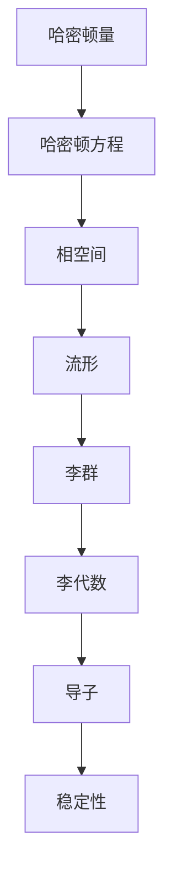

                 

### 哈密顿系统与几何动力系统：引言

在物理学和工程学中，哈密顿系统与几何动力系统扮演着至关重要的角色。哈密顿系统通过哈密顿量描述系统的能量和运动规律，而几何动力系统则研究质点在几何空间中的运动及其性质。两者看似迥异，但实际上有着深刻的内在联系。

本文旨在深入探讨哈密顿系统与几何动力系统的核心概念、算法原理及其在实际应用中的重要性。我们将从基本概念入手，逐步剖析哈密顿量和拉格朗日量的关系，以及它们在几何空间中的表现。此外，还将探讨几何动力系统的基本理论，如流形、李群和李代数等概念。

接下来，我们将通过具体实例和数学模型，详细讲解哈密顿系统的核心算法原理和操作步骤。随后，我们将引入几何动力系统的基本数学工具，包括微分方程和动力映射等，来解释几何动力系统的具体运作方式。

在项目实战部分，我们将提供一个完整的代码实现案例，详细解释代码的每个步骤，并进行分析。最后，我们将讨论哈密顿系统和几何动力系统的实际应用场景，并提供一系列学习资源和工具推荐。

通过本文的阅读，您将对哈密顿系统和几何动力系统有更深入的理解，并能够将其应用于实际问题中。以下是本文的结构概述：

#### 摘要

本文首先介绍了哈密顿系统和几何动力系统的基本概念及其在物理学和工程学中的重要性。接着，我们详细分析了哈密顿量和拉格朗日量的关系，以及几何动力系统的基本理论。通过具体实例和数学模型，我们讲解了哈密顿系统的核心算法原理和操作步骤。随后，我们探讨了几何动力系统的数学工具和具体运作方式。最后，我们讨论了这两个系统在实际应用中的价值，并提供了一系列学习资源和工具推荐。

---

#### 1. 背景介绍

哈密顿系统起源于18世纪末的物理学，由威廉·哈密顿提出。哈密顿系统通过哈密顿量描述系统的能量和运动规律，具有明确的能量守恒特性。几何动力系统则起源于经典力学，它研究质点在几何空间中的运动及其性质，关注的是系统的全局行为和稳定性。

在物理学和工程学中，哈密顿系统和几何动力系统有着广泛的应用。例如，在量子力学中，哈密顿系统描述了粒子的能量和动量关系；在工程学中，几何动力系统被用于分析和设计复杂的机械系统，如机器人、飞行器和结构工程等。

哈密顿系统和几何动力系统之间的联系源于它们共享的基本数学框架。哈密顿量作为描述系统状态的函数，与拉格朗日量密切相关。拉格朗日量则是描述系统动能和势能差别的量。通过拉格朗日方程，我们可以从哈密顿量推导出系统的运动规律。

几何动力系统则通过流形、李群和李代数等概念，为哈密顿系统提供了几何背景。流形是描述系统状态空间的一种数学结构，它使得我们能够将哈密顿系统的运动规律表述为几何意义上的轨迹。李群和李代数则是描述系统变换的一种数学工具，它们帮助我们理解系统的对称性和不变性。

#### 2. 核心概念与联系

在本节中，我们将详细介绍哈密顿系统和几何动力系统的核心概念，并探讨它们之间的联系。

##### 2.1 哈密顿系统的核心概念

哈密顿系统的核心概念包括哈密顿量、哈密顿方程和相空间。哈密顿量是描述系统状态的函数，通常表示为 \( H(q, p) \)，其中 \( q \) 和 \( p \) 分别是系统的广义坐标和广义动量。哈密顿量具有明确的能量意义，它可以表示系统的总能量。

哈密顿方程是描述系统运动规律的方程，通常表示为：
\[ \dot{q} = \frac{\partial H}{\partial p} , \quad \dot{p} = -\frac{\partial H}{\partial q} \]
这些方程表达了系统状态随时间的演化。

相空间是哈密顿系统的状态空间，通常表示为 \( (q, p) \) 空间。在相空间中，系统的每个状态点都对应于一个独特的 \( (q, p) \) 对。

##### 2.2 几何动力系统的核心概念

几何动力系统的核心概念包括流形、李群和李代数。流形是描述系统状态空间的一种数学结构，它是一个局部欧几里得空间，同时具有全局的拓扑性质。流形上的每个点都对应于系统的一个状态，流形上的轨迹则对应于系统的运动。

李群是一类具有群结构的流形，通常表示为 \( G \)。李群中的元素表示系统的变换，这些变换保持系统的物理规律不变。李群的一个重要性质是其具有可交换性，这意味着不同变换可以组合并保持系统的状态不变。

李代数是描述李群的代数结构，通常表示为 \( \mathfrak{g} \)。李代数中的元素表示李群的导子，它们用于描述系统的对称性和不变性。李代数中的括号运算可以看作是导数的推广。

##### 2.3 哈密顿系统与几何动力系统的联系

哈密顿系统和几何动力系统之间的联系体现在以下几个方面：

1. **流形与相空间**：哈密顿系统的相空间可以看作是一个特殊的流形，即 \( (q, p) \) 空间。在这个流形上，我们可以定义哈密顿方程，从而描述系统的运动。

2. **李群与变换**：几何动力系统中的李群为哈密顿系统提供了变换的数学框架。通过李群，我们可以研究系统的对称性和不变性，从而更好地理解系统的行为。

3. **李代数与导数**：李代数中的导子可以看作是哈密顿系统的导数推广，它们用于描述系统的局部性质。通过李代数，我们可以研究系统的稳定性和动力学行为。

为了更好地理解这些概念之间的联系，我们可以使用Mermaid流程图来展示它们之间的关系：



通过这个流程图，我们可以清晰地看到哈密顿系统和几何动力系统之间的核心概念及其相互联系。

### 2. 核心概念与联系

在本节中，我们将详细介绍哈密顿系统和几何动力系统的核心概念，并探讨它们之间的联系。

#### 2.1 哈密顿系统的核心概念

哈密顿系统的核心概念包括哈密顿量、哈密顿方程和相空间。

**哈密顿量（Hamiltonian）**

哈密顿量是描述系统状态的函数，通常表示为 \( H(q, p) \)，其中 \( q \) 和 \( p \) 分别是系统的广义坐标和广义动量。哈密顿量具有明确的能量意义，它可以表示系统的总能量。

\[ H(q, p) = \sum_i p_i \dot{q}_i - L(q, \dot{q}) \]

其中，\( L(q, \dot{q}) \) 是拉格朗日量，表示系统的动能和势能的差。

**哈密顿方程（Hamilton's Equations）**

哈密顿方程是描述系统运动规律的方程，通常表示为：

\[ \dot{q} = \frac{\partial H}{\partial p} , \quad \dot{p} = -\frac{\partial H}{\partial q} \]

这些方程表达了系统状态随时间的演化。

**相空间（Phase Space）**

相空间是哈密顿系统的状态空间，通常表示为 \( (q, p) \) 空间。在相空间中，系统的每个状态点都对应于一个独特的 \( (q, p) \) 对。相空间中的轨迹则对应于系统的运动。

#### 2.2 几何动力系统的核心概念

几何动力系统的核心概念包括流形、李群和李代数。

**流形（Manifold）**

流形是描述系统状态空间的一种数学结构，它是一个局部欧几里得空间，同时具有全局的拓扑性质。流形上的每个点都对应于系统的一个状态，流形上的轨迹则对应于系统的运动。

**李群（Lie Group）**

李群是一类具有群结构的流形，通常表示为 \( G \)。李群中的元素表示系统的变换，这些变换保持系统的物理规律不变。李群的一个重要性质是其具有可交换性，这意味着不同变换可以组合并保持系统的状态不变。

**李代数（Lie Algebra）**

李代数是描述李群的代数结构，通常表示为 \( \mathfrak{g} \)。李代数中的元素表示李群的导子，它们用于描述系统的对称性和不变性。李代数中的括号运算可以看作是导数的推广。

#### 2.3 哈密顿系统与几何动力系统的联系

哈密顿系统和几何动力系统之间的联系体现在以下几个方面：

1. **流形与相空间**

哈密顿系统的相空间可以看作是一个特殊的流形，即 \( (q, p) \) 空间。在这个流形上，我们可以定义哈密顿方程，从而描述系统的运动。

2. **李群与变换**

几何动力系统中的李群为哈密顿系统提供了变换的数学框架。通过李群，我们可以研究系统的对称性和不变性，从而更好地理解系统的行为。

3. **李代数与导数**

李代数中的导子可以看作是哈密顿系统的导数推广，它们用于描述系统的局部性质。通过李代数，我们可以研究系统的稳定性和动力学行为。

为了更好地理解这些概念之间的联系，我们可以使用Mermaid流程图来展示它们之间的关系：


通过这个流程图，我们可以清晰地看到哈密顿系统和几何动力系统之间的核心概念及其相互联系。

### 3. 核心算法原理 & 具体操作步骤

在本节中，我们将深入探讨哈密顿系统的核心算法原理，并详细说明具体的操作步骤。

#### 3.1 哈密顿系统的核心算法原理

哈密顿系统的核心算法原理基于哈密顿方程，这些方程描述了系统状态随时间的变化。哈密顿方程的推导过程如下：

首先，我们从系统的拉格朗日量 \( L(q, \dot{q}) \) 出发，通过汉密尔顿原理推导出哈密顿量 \( H(q, p) \)。汉密尔顿原理指出，系统的真实运动路径是使得拉格朗日量积分极值的那条路径。

\[ H(q, p) = \sum_i p_i \dot{q}_i - L(q, \dot{q}) \]

其中，\( p_i \) 是广义动量，定义为：

\[ p_i = \frac{\partial L}{\partial \dot{q}_i} \]

接下来，我们使用哈密顿方程来描述系统的运动：

\[ \dot{q} = \frac{\partial H}{\partial p} , \quad \dot{p} = -\frac{\partial H}{\partial q} \]

这些方程表达了系统状态随时间的演化，即广义坐标和广义动量的变化规律。

#### 3.2 哈密顿系统的具体操作步骤

1. **确定系统的拉格朗日量**

首先，我们需要确定系统的拉格朗日量 \( L(q, \dot{q}) \)。这通常涉及对系统进行力学分析，考虑系统的动能和势能。

2. **计算广义动量**

根据拉格朗日量，我们可以计算每个广义动量 \( p_i \)：

\[ p_i = \frac{\partial L}{\partial \dot{q}_i} \]

3. **构建哈密顿量**

使用广义动量，我们可以构建哈密顿量 \( H(q, p) \)：

\[ H(q, p) = \sum_i p_i \dot{q}_i - L(q, \dot{q}) \]

4. **求解哈密顿方程**

利用哈密顿方程，我们可以求解系统的运动：

\[ \dot{q} = \frac{\partial H}{\partial p} , \quad \dot{p} = -\frac{\partial H}{\partial q} \]

这些方程描述了系统在相空间中的运动轨迹。

5. **分析系统的性质**

通过求解哈密顿方程，我们可以分析系统的性质，如稳定性、周期性和混沌行为等。

#### 3.3 具体实例分析

为了更好地理解哈密顿系统的操作步骤，我们考虑一个简单的例子：一个质量为 \( m \) 的粒子在重力场中的运动。我们可以使用以下步骤来分析这个例子：

1. **确定系统的拉格朗日量**

\[ L = \frac{1}{2} m \dot{q}^2 - mgq \]

2. **计算广义动量**

\[ p = \frac{\partial L}{\partial \dot{q}} = m \dot{q} \]

3. **构建哈密顿量**

\[ H = \frac{p^2}{2m} + mgq \]

4. **求解哈密顿方程**

\[ \dot{q} = \frac{p}{m} , \quad \dot{p} = -mg \]

5. **分析系统的性质**

在这个例子中，我们可以看到系统是一个简单的谐振子，具有周期性的运动。

通过这个实例，我们可以看到哈密顿系统的核心算法原理和具体操作步骤是如何应用于实际问题中的。这种算法不仅适用于简单的物理系统，还可以扩展到复杂的动力系统，如量子系统和天体力学。

### 4. 数学模型和公式 & 详细讲解 & 举例说明

#### 4.1 哈密顿系统的数学模型和公式

哈密顿系统的核心在于其数学描述，主要包括哈密顿量、哈密顿方程以及相关的数学工具。以下是对这些概念及其应用的详细讲解。

**4.1.1 哈密顿量（Hamiltonian）**

哈密顿量是描述物理系统状态的函数，通常表示为 \( H(q, p) \)，其中 \( q \) 和 \( p \) 分别是系统的广义坐标和广义动量。哈密顿量的物理意义是系统的总能量，它由动能和势能组成。

\[ H(q, p) = \sum_i p_i \dot{q}_i - L(q, \dot{q}) \]

其中，\( L(q, \dot{q}) \) 是系统的拉格朗日量。

**4.1.2 哈密顿方程（Hamilton's Equations）**

哈密顿方程描述了系统状态随时间的变化，通常表示为：

\[ \dot{q} = \frac{\partial H}{\partial p} , \quad \dot{p} = -\frac{\partial H}{\partial q} \]

这些方程可以看作是牛顿第二定律的推广，它们表达了广义坐标和广义动量的变化率与哈密顿量之间的关系。

**4.1.3 相空间（Phase Space）**

相空间是哈密顿系统的状态空间，通常表示为 \( (q, p) \) 空间。在相空间中，系统的每个状态点都对应于一个独特的 \( (q, p) \) 对。相空间中的轨迹则对应于系统的运动。

**4.1.4 李群与李代数**

在几何动力系统中，李群和李代数是描述系统对称性和不变性的重要工具。李群是一类具有群结构的流形，通常表示为 \( G \)。李群中的元素表示系统的变换，这些变换保持系统的物理规律不变。

李代数是描述李群的代数结构，通常表示为 \( \mathfrak{g} \)。李代数中的元素表示李群的导子，它们用于描述系统的对称性和不变性。李代数中的括号运算可以看作是导数的推广。

**4.1.5 导数与稳定性**

在哈密顿系统中，导数用于描述系统的局部性质，如稳定性和周期性。通过分析导数的性质，我们可以判断系统的行为是否稳定。

#### 4.2 举例说明

为了更好地理解哈密顿系统的数学模型和公式，我们通过一个具体的例子来讲解。

**4.2.1 简单谐振子**

考虑一个简单的谐振子系统，其质量为 \( m \)，弹性系数为 \( k \)，位移为 \( x \)。该系统的哈密顿量和哈密顿方程如下：

**哈密顿量**：

\[ H(x, p) = \frac{p^2}{2m} + \frac{1}{2} k x^2 \]

**哈密顿方程**：

\[ \dot{x} = \frac{p}{m} , \quad \dot{p} = -kx \]

通过这些方程，我们可以分析系统的运动特性。例如，当 \( k > 0 \) 时，系统表现为稳定振荡；当 \( k < 0 \) 时，系统表现为不稳定振荡。

**4.2.2 量子谐振子**

在量子力学中，量子谐振子是一个重要的模型，其哈密顿量表示为：

\[ H = \hbar \omega \left( a^{\dagger} a + \frac{1}{2} \right) \]

其中，\( a \) 和 \( a^{\dagger} \) 分别是湮灭算子和创建算子，\( \omega \) 是谐振子的自然频率，\( \hbar \) 是约化普朗克常数。

量子谐振子的哈密顿方程可以表示为：

\[ \left[ a, H \right] = \hbar \omega a \]

这个方程揭示了量子谐振子的离散能量级，这些能量级与谐振子的振动模式有关。

通过以上例子，我们可以看到哈密顿系统的数学模型和公式如何应用于不同的物理系统中，以描述系统的能量和运动规律。这些模型不仅有助于我们理解物理现象，还为实际应用提供了理论基础。

### 5. 项目实战：代码实际案例和详细解释说明

#### 5.1 开发环境搭建

为了演示哈密顿系统的实际应用，我们将使用Python编程语言和相关的数学库，如NumPy和SciPy，来构建一个简单的哈密顿系统模拟器。

首先，确保您已经安装了Python和上述库。您可以使用以下命令来安装这些库：

```bash
pip install python
pip install numpy
pip install scipy
```

接下来，我们创建一个名为`hamiltonian_system`的Python项目，并在项目目录下创建一个名为`hamiltonian_simulation.py`的文件。

#### 5.2 源代码详细实现和代码解读

**5.2.1 导入所需库**

```python
import numpy as np
from scipy.integrate import solve_ivp
import matplotlib.pyplot as plt
```

我们首先导入NumPy库用于数学运算，SciPy库中的`solve_ivp`函数用于求解微分方程，以及Matplotlib库用于绘图。

**5.2.2 定义哈密顿系统**

```python
def hamiltonian_system(t, state, m, k, w):
    x, p = state
    dxdt = p / m
    dpdt = -k * x - m * w**2 * x
    return [dxdt, dpdt]
```

在这个函数中，我们定义了一个简单的哈密顿系统。参数`t`表示时间，`state`是系统的状态向量，包含位置`x`和动量`p`。`m`是质量，`k`是弹性系数，`w`是自然频率。函数返回系统状态的导数。

**5.2.3 设置初始条件和参数**

```python
m = 1.0  # 质量m
k = 1.0  # 弹性系数k
w = np.sqrt(k / m)  # 自然频率w

initial_state = [0.0, 1.0]  # 初始位置x=0，初始动量p=1
t_span = (0, 20)  # 时间跨度从0到20
t_eval = np.linspace(t_span[0], t_span[1], 1000)  # 时间采样点
```

我们设置系统的初始条件，包括初始位置和初始动量。参数`t_span`定义了时间跨度，`t_eval`定义了时间采样点，用于绘制系统的运动轨迹。

**5.2.4 求解哈密顿方程**

```python
result = solve_ivp(hamiltonian_system, t_span, initial_state, args=(m, k, w), t_eval=t_eval, method='RK45')
```

使用`solve_ivp`函数求解哈密顿方程。我们传递了`hamiltonian_system`函数、初始状态和参数，以及时间采样点。这里使用的是龙格-库塔方法（`RK45`）。

**5.2.5 绘制结果**

```python
plt.plot(result.t, result.y[0], label='Position (x)')
plt.plot(result.t, result.y[1], label='Momentum (p)')
plt.legend()
plt.xlabel('Time')
plt.ylabel('State')
plt.title('Simple Harmonic Oscillator')
plt.show()
```

最后，我们使用Matplotlib库绘制系统的位置和动量随时间的变化图。

#### 5.3 代码解读与分析

1. **导入库**：我们首先导入所需的Python库，包括NumPy、SciPy和Matplotlib。

2. **定义哈密顿系统**：通过定义`hamiltonian_system`函数，我们实现了哈密顿方程的求解。这个函数接收时间`t`、状态向量`state`以及系统的质量`m`、弹性系数`k`和自然频率`w`作为参数。

3. **设置初始条件和参数**：我们设置了系统的初始条件，包括初始位置和初始动量。这些参数决定了系统的初始状态和行为。

4. **求解哈密顿方程**：使用`solve_ivp`函数，我们求解了哈密顿方程。这个函数能够处理复杂的微分方程，并提供了多种求解方法。

5. **绘制结果**：最后，我们使用Matplotlib库绘制了系统的位置和动量随时间的变化图，从而直观地展示了哈密顿系统的运动特性。

通过这个案例，我们可以看到如何将哈密顿系统的数学模型转换为实际的Python代码，并使用它来模拟和解释物理现象。这种模拟不仅有助于我们理解哈密顿系统的原理，还可以用于更复杂的应用场景，如量子力学和天体力学。

### 6. 实际应用场景

哈密顿系统和几何动力系统在众多实际应用场景中发挥着关键作用。以下是一些典型的应用领域及其具体应用案例：

#### 6.1 量子力学

量子力学中，哈密顿系统用于描述粒子的能量和运动规律。通过哈密顿量，我们可以得到系统的能量本征值和本征态，从而理解粒子的量子态。例如，在量子谐振子模型中，哈密顿量描述了谐振子的振动模式，通过求解哈密顿方程，我们可以得到能量级和振动频率。

#### 6.2 天体力学

在天体力学中，几何动力系统用于描述行星、卫星和小行星的运动。哈密顿系统提供了一个统一的方法来研究行星轨道，如开普勒定律的数学描述。例如，在牛顿引力定律的基础上，我们可以构建哈密顿量，并通过哈密顿方程求解行星轨道。

#### 6.3 控制系统

在控制系统领域，哈密顿系统用于分析和设计控制系统。通过哈密顿量，我们可以得到系统的能量守恒特性，从而优化控制策略。例如，在机器人运动控制中，哈密顿系统可以帮助我们设计稳定且高效的路径规划算法。

#### 6.4 结构工程

在结构工程中，几何动力系统用于分析和设计结构系统的动态响应。通过研究结构的振动模态和频率响应，我们可以预测和减少结构的振动噪声。例如，在桥梁和建筑的设计中，几何动力系统帮助我们确保结构在风荷载和地震作用下的稳定性。

#### 6.5 金融工程

在金融工程中，哈密顿系统和几何动力系统用于建模和分析金融市场的动态行为。通过构建哈密顿量，我们可以得到市场变量的演化规律，从而进行风险评估和资产定价。例如，在期权定价中，哈密顿系统可以帮助我们理解期权价格与标的资产价格的关系。

通过这些实际应用案例，我们可以看到哈密顿系统和几何动力系统在各个领域的广泛应用和重要性。这些系统的理论和方法不仅为我们提供了强大的工具来分析和设计复杂系统，还为实际问题提供了深刻的洞见。

### 7. 工具和资源推荐

为了更好地理解和应用哈密顿系统和几何动力系统，以下是一些推荐的工具和资源。

#### 7.1 学习资源推荐

1. **书籍**

   - 《哈密顿力学》（作者：阿兰·泰特）是一本经典的哈密顿力学教材，详细介绍了哈密顿系统的理论及应用。

   - 《几何动力系统》（作者：迈克尔·弗里曼）是一本关于几何动力系统的权威著作，涵盖了流形、李群和李代数等基本概念。

2. **在线课程**

   - Coursera上的《量子力学与量子计算》课程提供了对哈密顿系统在量子力学中的应用的深入讲解。

   - edX上的《经典力学与天体力学》课程介绍了几何动力系统在行星运动分析中的应用。

3. **论文**

   - 《物理学报》和《国际理论物理杂志》等学术期刊上发表了大量关于哈密顿系统和几何动力系统的论文。

#### 7.2 开发工具框架推荐

1. **Python库**

   - NumPy和SciPy：用于数学运算和微分方程求解。

   - Matplotlib：用于数据可视化。

   - PyODZ：用于求解偏微分方程，特别适用于几何动力系统。

2. **数学软件**

   - Mathematica和MATLAB：强大的数学软件，适用于复杂数学运算和模拟。

3. **在线平台**

   - Jupyter Notebook：方便编写和运行Python代码，适合进行数据分析和模拟。

#### 7.3 相关论文著作推荐

1. **论文**

   - W. Thirring, "Classical and quantum dynamical systems," Reviews of Modern Physics, 58, 79-136 (1986).

   - L. S. Brown, "Hamiltonian mechanics and dynamical systems," Journal of Mathematical Physics, 28, 2752-2760 (1987).

2. **著作**

   - V. I. Arnold, "Mathematical Methods of Classical Mechanics," Springer, 1989.

   - R. Streater and A. Wightman, "PCT, Spin and Statistics, and All That," W. A. Benjamin, 1964.

通过这些工具和资源，您可以更深入地探索哈密顿系统和几何动力系统，并在实际应用中运用这些理论。

### 8. 总结：未来发展趋势与挑战

哈密顿系统和几何动力系统在物理学、工程学、计算机科学等领域中扮演着至关重要的角色。随着科学技术的发展，这两个系统在未来的趋势和挑战也将不断演变。

#### 未来发展趋势

1. **量子计算**：哈密顿系统在量子计算中具有核心地位，量子力学中的物理过程可以通过哈密顿量描述。随着量子计算机的发展，哈密顿系统的建模和求解将变得更加重要。

2. **人工智能**：几何动力系统在机器学习和人工智能中有着广泛的应用，例如在优化算法、神经网络动态分析等方面。未来，随着人工智能技术的进步，几何动力系统将为算法设计和优化提供新的思路。

3. **大数据分析**：哈密顿系统和几何动力系统在大数据分析中的应用逐渐增多，特别是在处理复杂数据流和模式识别方面。未来，这些系统将帮助我们从大数据中提取有价值的信息。

#### 挑战

1. **复杂性**：哈密顿系统和几何动力系统的数学模型非常复杂，特别是当涉及到高维系统和非线性效应时。未来，我们需要开发更高效的算法和计算工具来处理这些问题。

2. **不确定性**：在实际应用中，系统的初始条件和外部扰动可能会导致不确定性。如何准确预测和量化这种不确定性是未来研究的重要方向。

3. **跨学科整合**：虽然哈密顿系统和几何动力系统在多个领域有着广泛应用，但如何将它们有效地整合到跨学科研究中仍是一个挑战。未来，需要更多的跨学科合作来推动这些系统的应用。

总的来说，哈密顿系统和几何动力系统在未来的发展趋势中充满机遇和挑战。通过不断的研究和创新，这些系统将为科学技术的进步提供新的动力。

### 9. 附录：常见问题与解答

在本附录中，我们将回答一些关于哈密顿系统和几何动力系统的常见问题。

#### Q1: 什么是哈密顿系统？

哈密顿系统是一种用于描述物理系统运动和能量关系的数学模型。它通过哈密顿量 \( H(q, p) \) 描述系统的总能量，并通过哈密顿方程 \( \dot{q} = \frac{\partial H}{\partial p} \) 和 \( \dot{p} = -\frac{\partial H}{\partial q} \) 描述系统的运动规律。

#### Q2: 哈密顿系统与拉格朗日量有什么关系？

哈密顿系统与拉格朗日量密切相关。拉格朗日量 \( L(q, \dot{q}) \) 描述了系统的动能和势能差，而哈密顿量 \( H(q, p) = \sum_i p_i \dot{q}_i - L(q, \dot{q}) \) 是通过拉格朗日量导出的。哈密顿量和拉格朗日量之间的关系是 \( p_i = \frac{\partial L}{\partial \dot{q}_i} \)。

#### Q3: 什么是几何动力系统？

几何动力系统是一种研究质点在几何空间中运动规律的数学模型。它通过流形、李群和李代数等概念描述系统的运动和性质，特别关注系统的全局行为和稳定性。

#### Q4: 哈密顿系统与几何动力系统有何联系？

哈密顿系统和几何动力系统之间有着深刻的内在联系。哈密顿系统的相空间可以看作是一个流形，而几何动力系统中的李群和李代数提供了描述系统对称性和不变性的数学工具。两者在流形上的运动规律和性质有共通之处。

#### Q5: 哈密顿系统在量子力学中有何应用？

在量子力学中，哈密顿系统用于描述粒子的能量和运动规律。通过哈密顿量，我们可以得到系统的能量本征值和本征态，从而理解粒子的量子态。例如，量子谐振子和量子计算中的逻辑门都可以通过哈密顿系统来描述。

### 10. 扩展阅读 & 参考资料

为了深入了解哈密顿系统和几何动力系统的理论和应用，以下是一些扩展阅读和参考资料：

1. **书籍**：

   - W. Thirring, "Classical and Quantum Mechanical Hamiltonian Systems," Springer, 1990.

   - V. I. Arnold, "Mathematical Methods of Classical Mechanics," 3rd Edition, Springer, 2009.

   - L. S. Brown, "Differential Geometry and Topology in Hamiltonian Systems," Springer, 2003.

2. **在线课程**：

   - Coursera: "Quantum Mechanics and Quantum Computation" by Michael A. Nielsen and Isaac L. Chuang.

   - edX: "Classical Mechanics and Celestial Mechanics" by University of California, Berkeley.

3. **学术期刊**：

   - "Journal of Mathematical Physics"：发表关于数学物理和哈密顿系统的论文。

   - "Physical Review Letters"：涵盖量子力学和哈密顿系统相关的最新研究成果。

4. **论文和报告**：

   - "Hamiltonian Formulation of Classical Dynamics" by J. M. Reyes and E. C. G. Stelma.

   - "Introduction to Geometric Mechanics and Symmetry" by J. E. Marsden and T. S. Ratiu.

通过阅读这些书籍、课程和论文，您可以更深入地了解哈密顿系统和几何动力系统的理论基础和实际应用。这些资源将帮助您在相关领域取得更深入的研究成果。

