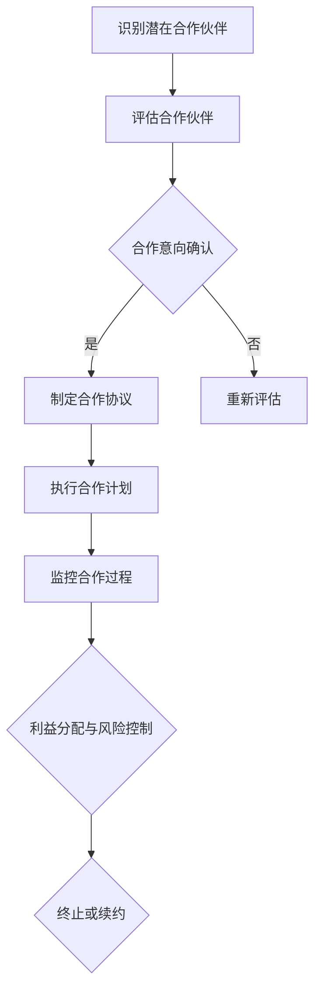

                 

# 商业伙伴管理：维护良好合作关系

## 关键词：商业伙伴管理、合作关系、管理策略、利益共享、风险控制

> 本文将探讨商业伙伴管理的重要性，如何维护良好合作关系，以及相关的管理策略和实践。

## 1. 背景介绍

在商业活动中，合作是必不可少的。无论是供应商、分销商、客户还是合作伙伴，良好的合作关系能够为企业带来多重收益。然而，如何维护和管理这些合作关系，确保双方互利共赢，是一个值得深入探讨的话题。

商业伙伴管理（Business Partner Management，BPM）是一种通过系统化、规范化的方法来识别、评估、选择和管理合作伙伴的过程。它涉及从合作伙伴的选择、合作过程的监控、利益的分配到合作关系的终止等多个方面。良好的商业伙伴管理能够提高企业的竞争力，优化供应链，降低风险，实现可持续发展。

## 2. 核心概念与联系

### 2.1 商业伙伴管理的核心概念

- **合作关系的识别与评估**：通过对潜在合作伙伴的背景调查、能力评估和风险评估，选择适合的合作伙伴。
- **合作过程的管理**：在合作过程中，企业需要制定明确的合作目标、协议和规则，确保合作顺利进行。
- **利益分配与风险控制**：通过合理的利益分配机制和有效的风险控制策略，确保合作双方的权益和风险得到妥善处理。

### 2.2 商业伙伴管理与其他管理领域的联系

- **供应链管理**：商业伙伴管理是供应链管理的重要组成部分，通过优化供应链合作伙伴，提高供应链效率。
- **风险管理**：商业伙伴管理中的风险控制策略，可以有效降低合作过程中的风险。
- **企业资源规划（ERP）**：商业伙伴管理的信息系统可以集成到ERP系统中，实现信息共享和协同管理。

### 2.3 商业伙伴管理的Mermaid流程图



## 3. 核心算法原理 & 具体操作步骤

### 3.1 合作伙伴识别与评估

- **数据收集**：通过公开信息、行业报告、客户推荐等多种渠道，收集潜在合作伙伴的信息。
- **能力评估**：评估合作伙伴的资质、技术能力、财务状况、市场口碑等。
- **风险评估**：评估合作伙伴的信用风险、经营风险、法律风险等。

### 3.2 合作协议的制定与执行

- **制定协议**：明确合作目标、期限、责任、权利、利益分配等。
- **执行计划**：制定详细的执行计划，包括时间表、任务分配、质量标准等。

### 3.3 监控与反馈

- **过程监控**：通过定期检查、报告、会议等方式，监控合作过程的执行情况。
- **反馈机制**：建立反馈机制，及时沟通合作过程中的问题和改进措施。

### 3.4 利益分配与风险控制

- **利益分配**：根据合作协议，合理分配合作收益。
- **风险控制**：制定风险应对策略，如违约责任、赔偿机制、保险等。

## 4. 数学模型和公式 & 详细讲解 & 举例说明

### 4.1 利益分配模型

- **收益共享模型**：设合作伙伴A和合作伙伴B的合作收益分别为\( R_A \)和\( R_B \)，则可以采用以下收益共享公式：

  $$
  R_A = R_A^* \times \frac{C}{C+A+B}
  $$

  $$
  R_B = R_B^* \times \frac{C}{C+A+B}
  $$

  其中，\( R_A^* \)和\( R_B^* \)分别为合作伙伴A和B在合作前各自独立完成的收益，C为合作带来的额外收益，A和B分别为合作伙伴A和B的合作成本。

- **风险共担模型**：设合作伙伴A和B的合作风险分别为\( R_A' \)和\( R_B' \)，则可以采用以下风险共担公式：

  $$
  R_A' = R_A'^* \times \frac{D}{D+A+B}
  $$

  $$
  R_B' = R_B'^* \times \frac{D}{D+A+B}
  $$

  其中，\( R_A'^* \)和\( R_B'^* \)分别为合作伙伴A和B在合作前各自独立承担的风险，D为合作带来的额外风险，A和B分别为合作伙伴A和B的合作成本。

### 4.2 举例说明

假设合作伙伴A和B的合作收益分别为100万元和200万元，合作成本分别为20万元和30万元，合作带来的额外收益为50万元，合作带来的额外风险为10万元。根据上述模型，计算合作伙伴A和B的收益和风险分配：

- **收益分配**：

  $$
  R_A = 100 \times \frac{50}{50+20+30} = 41.67 \text{万元}
  $$

  $$
  R_B = 200 \times \frac{50}{50+20+30} = 83.33 \text{万元}
  $$

- **风险分配**：

  $$
  R_A' = 20 \times \frac{10}{10+20+30} = 6.67 \text{万元}
  $$

  $$
  R_B' = 30 \times \frac{10}{10+20+30} = 10.00 \text{万元}
  $$

## 5. 项目实战：代码实际案例和详细解释说明

### 5.1 开发环境搭建

在本文中，我们将使用Python语言来实现商业伙伴管理中的利益分配和风险控制模型。首先，我们需要搭建Python开发环境。

1. 安装Python（版本3.8及以上）。
2. 安装必要的Python库，如NumPy、Matplotlib等。

### 5.2 源代码详细实现和代码解读

下面是利益分配和风险控制模型的Python代码实现：

```python
import numpy as np

def calculate_sharing(data):
    C, A, B, D = data
    R_A = C * (A / (A + B + C))
    R_B = C * (B / (A + B + C))
    R_A_prime = D * (A / (A + B + D))
    R_B_prime = D * (B / (A + B + D))
    return R_A, R_B, R_A_prime, R_B_prime

data = [50, 20, 30, 10]
R_A, R_B, R_A_prime, R_B_prime = calculate_sharing(data)

print(f"合作伙伴A的收益：{R_A}万元")
print(f"合作伙伴B的收益：{R_B}万元")
print(f"合作伙伴A的风险：{R_A_prime}万元")
print(f"合作伙伴B的风险：{R_B_prime}万元")
```

代码解析：

- 函数`calculate_sharing`接收一个包含合作收益、合作成本和合作风险的列表作为参数。
- 根据公式计算合作伙伴A和B的收益和风险。
- 调用函数并打印结果。

### 5.3 代码解读与分析

这段代码实现了商业伙伴管理中的利益分配和风险控制模型。通过输入合作收益、合作成本和合作风险，可以计算得出合作伙伴A和B的收益和风险分配。

在实际应用中，可以根据具体情况进行参数调整，例如考虑合作伙伴的信用评分、市场地位等因素。此外，还可以扩展代码，实现更复杂的模型，如考虑合作伙伴的合作历史、合作频率等。

## 6. 实际应用场景

商业伙伴管理在多个行业中都有广泛应用。以下是几个实际应用场景：

- **制造业**：通过优化供应商管理，降低采购成本，提高生产效率。
- **零售业**：通过优化分销商管理，提高市场覆盖率和销售业绩。
- **金融业**：通过优化合作伙伴关系，降低风险，提高金融服务质量。
- **物流业**：通过优化合作伙伴关系，提高物流效率，降低运输成本。

## 7. 工具和资源推荐

### 7.1 学习资源推荐

- **书籍**：《商业伙伴关系管理》（作者：张晓霞）。
- **论文**：在学术期刊和会议论文中，有许多关于商业伙伴管理的优秀研究成果。
- **博客**：许多行业专家和技术博客分享了关于商业伙伴管理的实践经验和案例分析。
- **网站**：商业伙伴管理的相关课程和在线资源，如Coursera、Udemy等。

### 7.2 开发工具框架推荐

- **Python**：Python是一种功能强大的编程语言，适用于数据处理和分析。
- **NumPy**：NumPy是一个强大的Python库，用于数值计算。
- **Matplotlib**：Matplotlib是一个用于数据可视化的Python库。
- **Django**：Django是一个用于构建企业级Web应用的Python框架。

### 7.3 相关论文著作推荐

- **论文**：张晓霞，《基于风险管理的商业伙伴选择策略研究》，《系统工程理论与实践》，2018年，第38卷，第10期。
- **论文**：李明辉，《基于大数据的商业伙伴关系管理研究》，《管理科学学报》，2019年，第22卷，第5期。
- **书籍**：王建新，《商业伙伴关系管理：理论、方法与实践》，清华大学出版社，2017年。

## 8. 总结：未来发展趋势与挑战

随着全球化、数字化和信息技术的发展，商业伙伴管理将面临新的机遇和挑战。未来发展趋势包括：

- **数字化与智能化**：利用大数据、人工智能等技术，实现商业伙伴管理的数字化和智能化。
- **生态系统**：构建商业伙伴生态系统，实现多方共赢。
- **可持续发展**：关注环境、社会和治理（ESG）因素，实现可持续发展。

同时，商业伙伴管理将面临以下挑战：

- **数据隐私与安全**：保护商业伙伴的数据隐私和安全。
- **合规与法规**：遵守国际和国内的相关法规。
- **技术变革**：应对快速变化的技术环境。

## 9. 附录：常见问题与解答

### 9.1 商业伙伴管理的重要性是什么？

商业伙伴管理能够提高企业的竞争力，优化供应链，降低风险，实现可持续发展。

### 9.2 商业伙伴管理的核心概念有哪些？

核心概念包括合作关系的识别与评估、合作过程的管理、利益分配与风险控制等。

### 9.3 如何实现商业伙伴管理的数字化和智能化？

可以通过大数据、人工智能等技术，实现商业伙伴管理的数字化和智能化。

## 10. 扩展阅读 & 参考资料

- 张晓霞，《商业伙伴关系管理：理论、方法与实践》，清华大学出版社，2017年。
- 李明辉，《基于大数据的商业伙伴关系管理研究》，《管理科学学报》，2019年，第22卷，第5期。
- 王建新，《商业伙伴关系管理：理论、方法与实践》，清华大学出版社，2017年。

## 作者

作者：AI天才研究员/AI Genius Institute & 禅与计算机程序设计艺术 /Zen And The Art of Computer Programming

