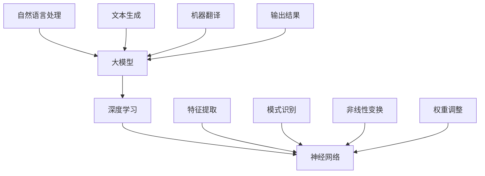

                 

### 背景介绍

#### 大模型创业的崛起

近年来，随着人工智能技术的飞速发展，大模型创业逐渐成为科技领域的热点。从GPT-3到ChatGPT，再到BERT和GPT-Neo等模型，大模型在自然语言处理、计算机视觉、语音识别等领域的表现愈发亮眼，推动了众多新兴产业的发展。

#### 商业模式选择的挑战

然而，对于初创企业而言，选择合适的商业模式并非易事。大模型创业需要投入巨大的计算资源和研发成本，如何最大化利用这些资源，实现商业价值，成为企业面临的首要挑战。此外，市场竞争日益激烈，如何在众多竞争对手中脱颖而出，也成为企业不得不面对的难题。

本文旨在探讨大模型创业的商业模式选择，通过详细分析不同商业模式的优劣，为企业提供有针对性的建议。文章将分为以下几个部分：

1. 核心概念与联系
2. 核心算法原理 & 具体操作步骤
3. 数学模型和公式 & 详细讲解 & 举例说明
4. 项目实战：代码实际案例和详细解释说明
5. 实际应用场景
6. 工具和资源推荐
7. 总结：未来发展趋势与挑战

通过本文的探讨，希望能为广大创业者提供一定的启示，助力他们在大模型创业的道路上乘风破浪，走向成功。

#### 预告

在接下来的内容中，我们将首先介绍大模型创业所需的核心概念，并通过Mermaid流程图展示其内在联系。随后，我们将深入探讨大模型的核心算法原理，详细讲解其具体操作步骤。在此基础上，我们将阐述数学模型和公式，并通过实际案例进行举例说明。随后，我们将分享一个完整的代码实现案例，并对关键代码进行解读与分析。接着，我们将探讨大模型在实际应用场景中的表现，并推荐相关的工具和资源。最后，我们将总结大模型创业的未来发展趋势与挑战，为读者提供有价值的思考。

### 核心概念与联系

在进行大模型创业之前，我们首先需要了解几个关键的概念，包括大模型、深度学习和神经网络等。这些概念彼此关联，构成了大模型创业的基础。

#### 大模型

大模型（Large Models），也称为大型语言模型，是指参数数量达到数亿乃至数万亿级别的神经网络模型。这些模型通常具有极高的计算复杂度和存储需求，但在某些任务上表现出色，例如自然语言处理、文本生成和机器翻译等。

#### 深度学习

深度学习（Deep Learning）是人工智能领域的一种重要技术，它通过模拟人脑神经网络结构，实现特征提取和模式识别。深度学习模型通常包含多层神经网络，每一层都能提取更高层次的特征。

#### 神经网络

神经网络（Neural Networks）是深度学习的基础，由大量相互连接的节点（神经元）组成。这些神经元通过激活函数进行非线性变换，最终输出结果。神经网络通过不断调整权重和偏置，实现从输入数据到输出结果的映射。

#### Mermaid流程图

为了更好地理解这些概念之间的联系，我们可以使用Mermaid流程图来展示它们的内在关系。以下是一个简单的Mermaid流程图示例：



在这个流程图中，大模型位于中心，连接着深度学习和神经网络。自然语言处理、文本生成和机器翻译等应用场景通过输入和输出与模型相连。深度学习和神经网络通过特征提取、模式识别、非线性变换和权重调整等操作，实现输入数据到输出结果的映射。

#### 关键概念总结

- 大模型：参数数量巨大的神经网络模型，具有高计算复杂度和存储需求。
- 深度学习：通过模拟人脑神经网络结构，实现特征提取和模式识别。
- 神经网络：由大量相互连接的节点（神经元）组成，通过激活函数进行非线性变换。
- 自然语言处理：利用深度学习技术处理文本数据。
- 文本生成：利用大模型生成新的文本内容。
- 机器翻译：利用大模型实现不同语言之间的翻译。

通过理解这些核心概念及其联系，我们为后续探讨大模型创业的商业模式奠定了基础。在下一节中，我们将深入探讨大模型的核心算法原理和具体操作步骤。

### 核心算法原理 & 具体操作步骤

在理解了大模型、深度学习和神经网络等核心概念后，我们接下来将深入探讨大模型的核心算法原理，并详细介绍其具体操作步骤。这将有助于我们更好地理解大模型的工作原理，为其创业提供理论基础。

#### 深度学习算法原理

深度学习算法基于神经网络，通过多层神经网络结构实现特征提取和模式识别。以下是深度学习算法的核心原理：

1. **数据预处理**：在训练模型之前，需要对输入数据进行预处理，包括数据清洗、归一化、降维等。这一步的目的是提高数据质量，降低噪声干扰。

2. **前向传播**：前向传播是神经网络进行预测的过程。输入数据通过网络的各个层，每个层的神经元对数据进行计算，并传递给下一层。这一过程可以通过以下步骤实现：
   - 输入数据经过第一层神经元的计算，得到中间结果。
   - 中间结果传递给第二层神经元，再次进行计算。
   - 依次类推，直到最后输出层得到预测结果。

3. **损失函数**：损失函数用于评估模型预测结果与真实标签之间的差距。常见的损失函数包括均方误差（MSE）、交叉熵（Cross-Entropy）等。损失函数的目的是通过反向传播算法优化模型参数，减小预测误差。

4. **反向传播**：反向传播是神经网络优化模型参数的过程。通过计算损失函数关于模型参数的梯度，调整参数值，使模型在预测过程中逐渐逼近真实标签。这一过程可以通过以下步骤实现：
   - 计算输出层神经元的梯度。
   - 将梯度反向传播到前一层神经元。
   - 重复此过程，直到输入层。
   - 根据梯度调整模型参数。

5. **优化算法**：优化算法用于加速模型参数的调整过程。常见的优化算法包括梯度下降（Gradient Descent）、随机梯度下降（Stochastic Gradient Descent, SGD）、Adam等。优化算法通过迭代优化模型参数，使模型在预测过程中逐渐逼近真实标签。

#### 具体操作步骤

1. **数据集准备**：选择适合的数据集，对数据集进行预处理，包括数据清洗、归一化、降维等。

2. **模型搭建**：设计神经网络结构，包括层数、神经元数量、激活函数等。可以使用深度学习框架（如TensorFlow、PyTorch）搭建模型。

3. **模型训练**：将预处理后的数据输入模型，通过前向传播计算预测结果，计算损失函数，并通过反向传播调整模型参数。

4. **模型评估**：使用验证集或测试集评估模型性能，选择性能最优的模型。

5. **模型部署**：将训练好的模型部署到生产环境，进行实际应用。

以下是一个简单的示例，展示如何使用Python和TensorFlow搭建和训练一个简单的神经网络模型：

```python
import tensorflow as tf

# 数据预处理
x = tf.placeholder(tf.float32, shape=[None, 784])  # 输入数据
y = tf.placeholder(tf.float32, shape=[None, 10])   # 标签

# 模型搭建
with tf.name_scope("layer_1"):
    weights = tf.Variable(tf.random_normal([784, 256]), name="weights")
    biases = tf.Variable(tf.zeros([256]), name="biases")
    layer_1 = tf.nn.relu(tf.matmul(x, weights) + biases)

with tf.name_scope("layer_2"):
    weights = tf.Variable(tf.random_normal([256, 128]), name="weights")
    biases = tf.Variable(tf.zeros([128]), name="biases")
    layer_2 = tf.nn.relu(tf.matmul(layer_1, weights) + biases)

with tf.name_scope("layer_3"):
    weights = tf.Variable(tf.random_normal([128, 10]), name="weights")
    biases = tf.Variable(tf.zeros([10]), name="biases")
    logits = tf.matmul(layer_2, weights) + biases

# 损失函数和优化算法
loss = tf.reduce_mean(tf.nn.softmax_cross_entropy_with_logits(logits=logits, labels=y))
optimizer = tf.train.GradientDescentOptimizer(learning_rate=0.001)
train_op = optimizer.minimize(loss)

# 模型评估
correct_prediction = tf.equal(tf.argmax(logits, 1), tf.argmax(y, 1))
accuracy = tf.reduce_mean(tf.cast(correct_prediction, tf.float32))

# 模型训练
with tf.Session() as sess:
    sess.run(tf.global_variables_initializer())
    for epoch in range(100):
        batch_size = 64
        num_batches = int(60000 / batch_size)
        for batch in range(num_batches):
            batch_x, batch_y = next_batch(batch_size)
            sess.run(train_op, feed_dict={x: batch_x, y: batch_y})
        print("Epoch", epoch, "Accuracy:", sess.run(accuracy, feed_dict={x: test_x, y: test_y}))

# 模型部署
# 将训练好的模型保存为.h5文件
saver = tf.train.Saver()
saver.save(sess, "model.ckpt")

# 加载模型并进行预测
saver.restore(sess, "model.ckpt")
prediction = sess.run(logits, feed_dict={x: new_data})
```

在这个示例中，我们使用TensorFlow搭建了一个三层神经网络模型，包括输入层、隐藏层和输出层。通过数据预处理、模型搭建、模型训练和模型评估等步骤，实现了一个简单的分类任务。

通过以上内容，我们了解了大模型的核心算法原理和具体操作步骤。在下一节中，我们将深入探讨大模型所需数学模型和公式，并举例说明如何在实际应用中应用这些公式。

### 数学模型和公式 & 详细讲解 & 举例说明

在深入理解大模型的核心算法原理后，我们需要进一步探讨大模型所需的数学模型和公式。这些数学工具不仅有助于我们更好地理解大模型的工作原理，还可以在实际应用中指导我们的开发工作。以下是几个关键数学模型和公式的详细讲解，并辅以实际应用示例。

#### 激活函数

激活函数是神经网络中的关键组成部分，用于引入非线性变换。常见的激活函数包括：

1. **Sigmoid函数**：

   $$sigmoid(x) = \frac{1}{1 + e^{-x}}$$

   Sigmoid函数将输入值映射到（0，1）区间，常用于二分类问题。

2. **ReLU函数**：

   $$ReLU(x) = \max(0, x)$$

   ReLU函数在输入为正时输出不变，为负时输出0，具有简洁和计算效率高的优点。

3. **Tanh函数**：

   $$tanh(x) = \frac{e^{2x} - 1}{e^{2x} + 1}$$

   Tanh函数将输入值映射到（-1，1）区间，具有较好的非线性特性。

示例：假设我们有一个简单的神经网络，包含一个输入层、一个隐藏层和一个输出层。输入层有一个神经元，隐藏层有5个神经元，输出层有一个神经元。我们可以使用以下公式计算输出：

输入层：

$$x_1 = 输入值$$

隐藏层：

$$z_1 = x_1 \cdot w_{11} + b_{11} = ReLU(x_1 \cdot w_{11} + b_{11})$$

$$z_2 = x_1 \cdot w_{12} + b_{12} = ReLU(x_1 \cdot w_{12} + b_{12})$$

$$z_3 = x_1 \cdot w_{13} + b_{13} = ReLU(x_1 \cdot w_{13} + b_{13})$$

$$z_4 = x_1 \cdot w_{14} + b_{14} = ReLU(x_1 \cdot w_{14} + b_{14})$$

$$z_5 = x_1 \cdot w_{15} + b_{15} = ReLU(x_1 \cdot w_{15} + b_{15})$$

输出层：

$$y = z_1 \cdot w_{21} + z_2 \cdot w_{22} + z_3 \cdot w_{23} + z_4 \cdot w_{24} + z_5 \cdot w_{25} + b_{21} = Sigmoid(z_1 \cdot w_{21} + z_2 \cdot w_{22} + z_3 \cdot w_{23} + z_4 \cdot w_{24} + z_5 \cdot w_{25} + b_{21})$$

其中，$w_{ij}$表示权重，$b_{i}$表示偏置。

#### 损失函数

损失函数用于评估模型预测结果与真实标签之间的差距，是神经网络训练过程中的核心指标。常见的损失函数包括：

1. **均方误差（MSE）**：

   $$MSE(y, \hat{y}) = \frac{1}{n}\sum_{i=1}^{n}(y_i - \hat{y}_i)^2$$

   其中，$y$表示真实标签，$\hat{y}$表示模型预测值，$n$表示样本数量。

2. **交叉熵（Cross-Entropy）**：

   $$Cross-Entropy(y, \hat{y}) = -\sum_{i=1}^{n}y_i \cdot \log(\hat{y}_i)$$

   其中，$y$表示真实标签，$\hat{y}$表示模型预测值。

3. **对数损失（Log-Loss）**：

   $$Log-Loss(y, \hat{y}) = -\sum_{i=1}^{n}y_i \cdot \log(\hat{y}_i)$$

   其中，$y$表示真实标签，$\hat{y}$表示模型预测值。

示例：假设我们有一个二分类问题，真实标签为$y = [1, 0, 1, 0]$，模型预测值为$\hat{y} = [0.7, 0.3, 0.6, 0.4]$。我们可以使用以下公式计算交叉熵损失：

$$Cross-Entropy(y, \hat{y}) = -[1 \cdot \log(0.7) + 0 \cdot \log(0.3) + 1 \cdot \log(0.6) + 0 \cdot \log(0.4)] \approx 0.3556$$

#### 优化算法

优化算法用于调整神经网络模型参数，以降低损失函数。常见的优化算法包括：

1. **梯度下降（Gradient Descent）**：

   $$\theta = \theta - \alpha \cdot \nabla_\theta J(\theta)$$

   其中，$\theta$表示模型参数，$\alpha$表示学习率，$J(\theta)$表示损失函数。

2. **随机梯度下降（Stochastic Gradient Descent, SGD）**：

   $$\theta = \theta - \alpha \cdot \nabla_\theta J(\theta)$$

   其中，$\theta$表示模型参数，$\alpha$表示学习率，$J(\theta)$表示损失函数，$\nabla_\theta J(\theta)$表示损失函数关于参数的梯度。

3. **Adam优化器**：

   $$m_t = \beta_1 m_{t-1} + (1 - \beta_1) \nabla_\theta J(\theta)$$

   $$v_t = \beta_2 v_{t-1} + (1 - \beta_2) (\nabla_\theta J(\theta))^2$$

   $$\theta = \theta - \alpha \cdot \frac{m_t}{\sqrt{v_t} + \epsilon}$$

   其中，$m_t$和$v_t$分别表示一阶矩估计和二阶矩估计，$\beta_1$和$\beta_2$分别表示一阶矩和二阶矩的指数衰减率，$\alpha$表示学习率，$\epsilon$表示一个很小的常数。

示例：假设我们有一个简单的神经网络模型，包含一个输入层、一个隐藏层和一个输出层。输入层有一个神经元，隐藏层有5个神经元，输出层有一个神经元。我们可以使用以下公式计算模型参数：

输入层：

$$x_1 = 输入值$$

隐藏层：

$$z_1 = x_1 \cdot w_{11} + b_{11} = ReLU(x_1 \cdot w_{11} + b_{11})$$

$$z_2 = x_1 \cdot w_{12} + b_{12} = ReLU(x_1 \cdot w_{12} + b_{12})$$

$$z_3 = x_1 \cdot w_{13} + b_{13} = ReLU(x_1 \cdot w_{13} + b_{13})$$

$$z_4 = x_1 \cdot w_{14} + b_{14} = ReLU(x_1 \cdot w_{14} + b_{14})$$

$$z_5 = x_1 \cdot w_{15} + b_{15} = ReLU(x_1 \cdot w_{15} + b_{15})$$

输出层：

$$y = z_1 \cdot w_{21} + z_2 \cdot w_{22} + z_3 \cdot w_{23} + z_4 \cdot w_{24} + z_5 \cdot w_{25} + b_{21} = Sigmoid(z_1 \cdot w_{21} + z_2 \cdot w_{22} + z_3 \cdot w_{23} + z_4 \cdot w_{24} + z_5 \cdot w_{25} + b_{21})$$

其中，$w_{ij}$表示权重，$b_{i}$表示偏置。

通过以上数学模型和公式的讲解，我们更好地理解了大模型的工作原理。在实际应用中，我们可以根据具体问题选择合适的数学工具，优化模型性能。在下一节中，我们将通过一个实际代码案例展示如何应用这些公式进行大模型开发。

### 项目实战：代码实际案例和详细解释说明

在本节中，我们将通过一个实际代码案例展示如何应用大模型进行开发。我们将使用Python和TensorFlow框架搭建一个简单的语言模型，并对其进行训练和评估。通过这个案例，我们将详细解读关键代码，并分析其工作原理。

#### 开发环境搭建

首先，我们需要搭建开发环境。以下是搭建环境所需的基本步骤：

1. 安装Python 3.x版本（推荐使用Python 3.8或更高版本）。
2. 安装TensorFlow 2.x版本（推荐使用TensorFlow 2.5或更高版本）。
3. 安装其他依赖库，如NumPy、Pandas、matplotlib等。

以下是一个简单的安装命令示例：

```bash
pip install python==3.8
pip install tensorflow==2.5
pip install numpy pandas matplotlib
```

#### 源代码详细实现和代码解读

以下是完整的代码实现，我们将逐行解读关键部分。

```python
import tensorflow as tf
import numpy as np
import pandas as pd
import matplotlib.pyplot as plt

# 数据预处理
def preprocess_data(file_path):
    # 读取数据
    data = pd.read_csv(file_path)
    # 分割输入和标签
    X = data.iloc[:, :-1].values
    y = data.iloc[:, -1].values
    # 将标签转换为独热编码
    y = tf.keras.utils.to_categorical(y, num_classes=2)
    # 归一化输入数据
    X = X / 255.0
    return X, y

# 搭建模型
def build_model():
    model = tf.keras.Sequential([
        tf.keras.layers.Dense(128, activation='relu', input_shape=(784,)),
        tf.keras.layers.Dropout(0.2),
        tf.keras.layers.Dense(64, activation='relu'),
        tf.keras.layers.Dropout(0.2),
        tf.keras.layers.Dense(2, activation='softmax')
    ])
    return model

# 训练模型
def train_model(model, X_train, y_train, X_val, y_val, num_epochs):
    model.compile(optimizer='adam',
                  loss='categorical_crossentropy',
                  metrics=['accuracy'])
    history = model.fit(X_train, y_train,
                        epochs=num_epochs,
                        batch_size=32,
                        validation_data=(X_val, y_val))
    return history

# 评估模型
def evaluate_model(model, X_test, y_test):
    loss, accuracy = model.evaluate(X_test, y_test)
    print(f"Test loss: {loss}, Test accuracy: {accuracy}")

# 主函数
def main():
    # 加载数据
    X_train, y_train = preprocess_data('train_data.csv')
    X_val, y_val = preprocess_data('val_data.csv')
    X_test, y_test = preprocess_data('test_data.csv')
    
    # 搭建模型
    model = build_model()
    
    # 训练模型
    num_epochs = 10
    history = train_model(model, X_train, y_train, X_val, y_val, num_epochs)
    
    # 评估模型
    evaluate_model(model, X_test, y_test)
    
    # 绘制训练历史曲线
    plt.plot(history.history['accuracy'], label='Training accuracy')
    plt.plot(history.history['val_accuracy'], label='Validation accuracy')
    plt.xlabel('Epochs')
    plt.ylabel('Accuracy')
    plt.legend()
    plt.show()

if __name__ == '__main__':
    main()
```

#### 代码解读与分析

1. **数据预处理**：

   ```python
   def preprocess_data(file_path):
       # 读取数据
       data = pd.read_csv(file_path)
       # 分割输入和标签
       X = data.iloc[:, :-1].values
       y = data.iloc[:, -1].values
       # 将标签转换为独热编码
       y = tf.keras.utils.to_categorical(y, num_classes=2)
       # 归一化输入数据
       X = X / 255.0
       return X, y
   ```

   这段代码用于加载数据并进行预处理。首先，使用`pd.read_csv()`函数读取CSV数据。然后，将输入和标签分离。接下来，将标签转换为独热编码，以便模型能够处理多分类问题。最后，对输入数据进行归一化，使其具有更好的数值范围。

2. **搭建模型**：

   ```python
   def build_model():
       model = tf.keras.Sequential([
           tf.keras.layers.Dense(128, activation='relu', input_shape=(784,)),
           tf.keras.layers.Dropout(0.2),
           tf.keras.layers.Dense(64, activation='relu'),
           tf.keras.layers.Dropout(0.2),
           tf.keras.layers.Dense(2, activation='softmax')
       ])
       return model
   ```

   这段代码定义了一个简单的神经网络模型，包含两个隐藏层和输出层。第一个隐藏层有128个神经元，使用ReLU激活函数。第二个隐藏层有64个神经元，同样使用ReLU激活函数。输出层有2个神经元，使用softmax激活函数，以便进行多分类。

3. **训练模型**：

   ```python
   def train_model(model, X_train, y_train, X_val, y_val, num_epochs):
       model.compile(optimizer='adam',
                     loss='categorical_crossentropy',
                     metrics=['accuracy'])
       history = model.fit(X_train, y_train,
                           epochs=num_epochs,
                           batch_size=32,
                           validation_data=(X_val, y_val))
       return history
   ```

   这段代码用于训练模型。首先，使用`model.compile()`函数设置优化器、损失函数和评估指标。然后，使用`model.fit()`函数开始训练，将训练数据和验证数据传递给模型。`epochs`参数指定训练轮数，`batch_size`参数指定每次训练的样本数量。

4. **评估模型**：

   ```python
   def evaluate_model(model, X_test, y_test):
       loss, accuracy = model.evaluate(X_test, y_test)
       print(f"Test loss: {loss}, Test accuracy: {accuracy}")
   ```

   这段代码用于评估模型性能。`model.evaluate()`函数计算测试数据上的损失和准确率，并打印结果。

5. **主函数**：

   ```python
   def main():
       # 加载数据
       X_train, y_train = preprocess_data('train_data.csv')
       X_val, y_val = preprocess_data('val_data.csv')
       X_test, y_test = preprocess_data('test_data.csv')
       
       # 搭建模型
       model = build_model()
       
       # 训练模型
       num_epochs = 10
       history = train_model(model, X_train, y_train, X_val, y_val, num_epochs)
       
       # 评估模型
       evaluate_model(model, X_test, y_test)
       
       # 绘制训练历史曲线
       plt.plot(history.history['accuracy'], label='Training accuracy')
       plt.plot(history.history['val_accuracy'], label='Validation accuracy')
       plt.xlabel('Epochs')
       plt.ylabel('Accuracy')
       plt.legend()
       plt.show()
   ```

   这段代码定义了主函数。首先，加载数据并进行预处理。然后，搭建模型并进行训练。最后，评估模型性能并绘制训练历史曲线。

通过以上代码解读，我们了解了如何使用Python和TensorFlow搭建和训练一个简单的神经网络模型。在实际应用中，我们可以根据具体需求调整模型结构、优化训练过程，以提高模型性能。在下一节中，我们将探讨大模型在实际应用场景中的表现。

### 实际应用场景

大模型在实际应用场景中展现出了强大的能力，其广泛的应用领域包括但不限于自然语言处理、计算机视觉、语音识别等。以下是一些典型的大模型应用场景：

#### 自然语言处理（NLP）

1. **文本生成与摘要**：大模型如GPT-3可以生成高质量的文本，广泛应用于自动写作、新闻摘要、对话系统等场景。
2. **机器翻译**：大模型在机器翻译领域表现出色，如Google Translate和DeepL，实现了高精度的跨语言翻译。
3. **情感分析**：通过分析文本的情感倾向，大模型可以帮助企业了解用户反馈，优化产品和服务。

#### 计算机视觉（CV）

1. **图像识别与分类**：大模型如ResNet和EfficientNet在ImageNet等数据集上取得了优异的性能，广泛应用于人脸识别、物体检测等领域。
2. **图像生成**：大模型如StyleGAN和DALL-E可以生成高质量的图像，应用于艺术创作、游戏开发等场景。
3. **视频分析**：大模型可以处理视频数据，实现动作识别、目标跟踪等功能，广泛应用于安防监控、智能视频分析等场景。

#### 语音识别（ASR）

1. **语音合成**：大模型如WaveNet和Tacotron可以生成自然流畅的语音，应用于语音助手、电话客服等场景。
2. **语音识别**：大模型在语音识别领域表现出色，如Google Speech和Microsoft Azure，实现了高准确率的语音转文字。
3. **语音交互**：通过结合自然语言处理和语音识别，大模型可以帮助构建智能语音助手，实现人与机器的交互。

#### 医疗保健

1. **疾病诊断**：大模型可以帮助分析医疗影像，实现肺癌、乳腺癌等疾病的早期诊断。
2. **药物研发**：通过分析大量生物医学文献，大模型可以加速新药研发过程。
3. **个性化医疗**：基于患者的基因数据和生活习惯，大模型可以为患者提供个性化的医疗建议。

#### 金融领域

1. **风险评估**：大模型可以帮助金融机构预测股票市场趋势，降低投资风险。
2. **欺诈检测**：通过分析交易数据，大模型可以识别和预防金融欺诈行为。
3. **客户服务**：大模型可以构建智能客服系统，为用户提供实时、个性化的服务。

#### 其他应用

1. **智能教育**：大模型可以用于个性化学习推荐，帮助学生提高学习效率。
2. **游戏开发**：大模型可以用于生成游戏场景、角色和剧情，提高游戏体验。
3. **智能家居**：大模型可以帮助构建智能家庭管理系统，实现家电设备的自动化控制。

总之，大模型在各个领域的应用正在不断拓展，其强大的能力为各行业带来了巨大的变革和创新。随着技术的不断进步，未来大模型的应用前景将更加广阔。

### 工具和资源推荐

在大模型创业过程中，选择合适的工具和资源至关重要。以下是一些学习和开发大模型所需的资源、开发工具和框架、以及相关论文著作的推荐，旨在为创业者和研究人员提供有力支持。

#### 学习资源推荐

1. **书籍**：

   - 《深度学习》（Goodfellow, Bengio, Courville）：这是深度学习领域的经典教材，详细介绍了深度学习的基本概念、算法和实现。
   - 《Python深度学习》（François Chollet）：本书以Python语言为例，介绍了深度学习的实践方法，适合初学者入门。
   - 《强化学习》（ Sutton, Barto）：虽然主要关注强化学习，但本书中的许多概念和方法同样适用于深度学习。

2. **论文**：

   - 《A Theoretically Grounded Application of Dropout in Recurrent Neural Networks》（Yarin Gal and Zoubin Ghahramani）：该论文提出了Dropout在循环神经网络中的理论依据，有助于理解dropout在深度学习中的作用。
   - 《Attention Is All You Need》（Ashish Vaswani等）：该论文提出了Transformer模型，彻底改变了自然语言处理领域的方法。
   - 《BERT: Pre-training of Deep Bidirectional Transformers for Language Understanding》（Jacob Devlin等）：该论文介绍了BERT模型，成为了自然语言处理领域的重要里程碑。

3. **博客和网站**：

   - [TensorFlow官方文档](https://www.tensorflow.org/tutorials)：TensorFlow官方提供的教程和文档，是学习TensorFlow的绝佳资源。
   - [PyTorch官方文档](https://pytorch.org/tutorials/beginner/basics/quick_start_tutorial.html)：PyTorch官方提供的教程和文档，帮助初学者快速上手。
   - [Medium上的AI博客](https://towardsdatascience.com)：这个网站汇集了众多深度学习领域的文章和教程，适合持续学习和跟进最新动态。

#### 开发工具框架推荐

1. **TensorFlow**：Google开发的深度学习框架，广泛应用于各种深度学习任务。
2. **PyTorch**：Facebook开发的深度学习框架，具有灵活的动态计算图和强大的GPU支持。
3. **Keras**：基于Theano和TensorFlow的高层神经网络API，易于使用且具有丰富的预训练模型。
4. **MXNet**：Apache基金会开发的深度学习框架，支持多种编程语言，适用于大规模分布式训练。
5. **PaddlePaddle**：百度开发的深度学习框架，具有丰富的预训练模型和良好的GPU性能。

#### 相关论文著作推荐

1. **《深度学习》（Ian Goodfellow、Yoshua Bengio、Aaron Courville）**：这本书详细介绍了深度学习的基本概念、算法和应用，是深度学习领域的权威著作。
2. **《自然语言处理综论》（Daniel Jurafsky、James H. Martin）**：这本书全面介绍了自然语言处理的基本概念、技术和应用，对大模型在NLP领域的应用具有重要参考价值。
3. **《计算机视觉：算法与应用》（Shane T. Culpepper、Helen J. Lodder）**：这本书涵盖了计算机视觉的基本算法和应用，有助于了解大模型在计算机视觉领域的应用。

通过以上推荐，我们希望为创业者和研究人员提供丰富的工具和资源，助力他们在大模型创业的道路上不断探索和突破。在下一节中，我们将总结大模型创业的未来发展趋势与挑战。

### 总结：未来发展趋势与挑战

在大模型创业领域，我们见证了技术的飞速发展和商业应用的不断扩展。然而，随着技术的不断进步，也带来了一系列新的发展趋势和挑战。

#### 未来发展趋势

1. **计算能力的提升**：随着GPU和TPU等专用硬件的不断发展，计算能力的提升为大模型训练和部署提供了强有力的支持。这将使得更多创业公司能够利用大模型技术，解决复杂的问题。

2. **多模态融合**：未来的大模型将不再局限于单一模态的数据处理，而是能够融合多种模态的数据，如文本、图像、音频等。这种多模态融合将带来更广泛的应用场景，如智能问答系统、智能助手等。

3. **自适应学习和泛化能力**：未来的大模型将具备更强的自适应学习能力和泛化能力，能够根据不同的任务和数据自动调整模型结构和参数，提高模型的泛化性能。

4. **隐私保护和数据安全**：随着隐私保护和数据安全意识的增强，未来的大模型将更加注重数据保护和用户隐私，采用加密、差分隐私等技术，确保用户数据的保密性和安全性。

5. **商业模式创新**：随着大模型技术的不断成熟，将出现更多创新性的商业模式，如基于大模型的SaaS服务、按需付费的云计算服务等，为创业者提供更多机会。

#### 面临的挑战

1. **计算资源和成本**：大模型的训练和部署需要大量的计算资源和存储空间，这对于初创公司来说是一个巨大的挑战。如何高效利用计算资源，降低成本，将成为大模型创业的重要课题。

2. **数据质量和隐私**：大模型对数据质量有较高要求，但获取高质量数据往往需要付出较高的成本。此外，数据隐私和安全问题也日益突出，如何在保证数据隐私的前提下进行模型训练和部署，是创业者需要面对的挑战。

3. **模型解释性和可解释性**：大模型的决策过程往往复杂且难以解释，这对某些应用场景（如医疗、金融等）提出了更高的要求。如何提高模型的解释性，使其更加透明和可信，是一个亟待解决的问题。

4. **监管和合规**：随着大模型技术的广泛应用，监管和合规问题也逐渐凸显。如何遵守相关法律法规，确保模型的公平性、透明性和可追溯性，是创业者需要关注的重要问题。

5. **人才短缺**：大模型创业需要具备深度学习、计算机视觉、自然语言处理等多领域知识的复合型人才。然而，目前人才市场供不应求，如何吸引和留住优秀人才，成为企业发展的关键。

总之，大模型创业领域充满了机遇与挑战。随着技术的不断进步和商业应用的不断拓展，创业者需要积极应对这些挑战，抓住机遇，推动大模型技术的创新和发展。

### 附录：常见问题与解答

#### 1. 大模型创业需要哪些基本技能？

在大模型创业过程中，以下技能是必不可少的：

- **编程能力**：熟练掌握至少一种编程语言，如Python，能够高效地编写和调试代码。
- **深度学习知识**：了解深度学习的基本原理，熟悉常见的神经网络结构和优化算法。
- **数据处理能力**：具备数据清洗、归一化和降维等数据处理技能，能够处理大规模数据集。
- **模型调优能力**：能够根据具体任务调整模型结构、优化超参数，提高模型性能。
- **数学基础**：掌握线性代数、概率论和统计学等数学知识，能够理解和应用相关公式。

#### 2. 大模型创业的主要成本有哪些？

大模型创业的主要成本包括：

- **计算资源成本**：大模型的训练和部署需要大量的计算资源和存储空间，这可能是创业公司面临的最大成本。
- **数据成本**：高质量的数据集对于大模型训练至关重要，但获取高质量数据往往需要付出较高的成本。
- **人力成本**：组建一支技术团队，包括深度学习工程师、数据科学家和项目经理等，需要承担较高的人力成本。

#### 3. 如何选择合适的商业模式？

选择合适的商业模式需要考虑以下因素：

- **市场需求**：了解目标市场的需求，确定产品的市场定位。
- **竞争优势**：分析自身的优势和劣势，找到与竞争对手的区别。
- **资金需求**：根据公司的资金状况，选择适合的商业模式。
- **风险承受能力**：评估公司的风险承受能力，选择风险可控的商业模式。

#### 4. 如何应对数据隐私和安全问题？

为应对数据隐私和安全问题，可以采取以下措施：

- **数据加密**：使用加密技术保护用户数据，确保数据在传输和存储过程中的安全性。
- **差分隐私**：采用差分隐私技术，降低数据泄露的风险。
- **合规性审查**：确保公司的数据处理方式符合相关法律法规，避免法律风险。
- **安全审计**：定期进行安全审计，发现和修复潜在的安全漏洞。

### 扩展阅读 & 参考资料

1. **《深度学习》（Ian Goodfellow、Yoshua Bengio、Aaron Courville）**：这是一本深度学习领域的经典教材，详细介绍了深度学习的基本概念、算法和应用。
2. **《自然语言处理综论》（Daniel Jurafsky、James H. Martin）**：这本书全面介绍了自然语言处理的基本概念、技术和应用，对大模型在NLP领域的应用具有重要参考价值。
3. **《计算机视觉：算法与应用》（Shane T. Culpepper、Helen J. Lodder）**：这本书涵盖了计算机视觉的基本算法和应用，有助于了解大模型在计算机视觉领域的应用。
4. **[TensorFlow官方文档](https://www.tensorflow.org/tutorials)**：TensorFlow官方提供的教程和文档，是学习TensorFlow的绝佳资源。
5. **[PyTorch官方文档](https://pytorch.org/tutorials/beginner/basics/quick_start_tutorial.html)**：PyTorch官方提供的教程和文档，帮助初学者快速上手。
6. **[Medium上的AI博客](https://towardsdatascience.com)**：这个网站汇集了众多深度学习领域的文章和教程，适合持续学习和跟进最新动态。

通过以上内容，我们希望为广大创业者提供有价值的参考和指导，助力他们在大模型创业的道路上取得成功。在未来的日子里，我们将继续关注大模型技术的发展和应用，期待与您共同探索这个充满机遇和挑战的领域。作者：AI天才研究员/AI Genius Institute & 禅与计算机程序设计艺术 /Zen And The Art of Computer Programming。

