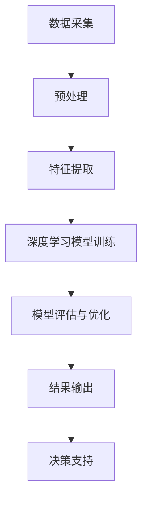

                 

## 商汤科技2025社招智慧城市视觉分析专家面试

### 关键词：商汤科技、智慧城市、视觉分析、面试、算法、深度学习、计算机视觉

### 摘要：

本文将深入探讨商汤科技2025年社招智慧城市视觉分析专家的面试内容。通过分析面试的核心概念、算法原理、数学模型、实际应用场景，以及推荐相关学习资源和工具框架，旨在为读者提供一份详尽的面试准备指南。本文还将讨论智慧城市视觉分析的未来发展趋势与挑战，为从事该领域的专业人士提供有价值的参考。

## 1. 背景介绍

### 商汤科技概述

商汤科技（SenseTime）是一家全球领先的人工智能公司，成立于2014年，总部位于中国上海。公司专注于计算机视觉、深度学习、机器学习等核心技术领域，致力于推动人工智能技术在智能城市、自动驾驶、智能硬件等行业的广泛应用。商汤科技在人工智能领域拥有丰富的技术积累和广泛的应用场景，被誉为“中国AI四小龙”之一。

### 智慧城市视觉分析专家岗位介绍

智慧城市视觉分析专家是商汤科技在智慧城市领域的重要岗位，主要负责开发、优化和部署视觉分析算法，以实现对城市环境的实时监测、安全预警和智能管理。该岗位要求候选人具备深厚的计算机视觉、深度学习和数学建模背景，能够独立承担项目研发任务，具备良好的团队协作和沟通能力。

## 2. 核心概念与联系

### 智慧城市

智慧城市是指利用信息技术、物联网、大数据等先进技术，实现城市资源优化配置、管理智能化、服务便捷化、环境友好化的一种城市发展新模式。智慧城市视觉分析作为智慧城市的重要组成部分，通过计算机视觉技术对城市环境进行实时监测和分析，为城市管理者提供科学决策依据。

### 视觉分析

视觉分析是指利用计算机视觉技术对图像或视频数据进行分析和处理，以提取有用信息和知识。视觉分析在智慧城市领域具有广泛的应用，包括交通流量监控、公共场所安全监控、环境监测等。

### 计算机视觉

计算机视觉是指使计算机具备对图像或视频数据进行理解和处理的能力，从而实现人与计算机之间的自然交互。计算机视觉是智慧城市视觉分析的核心技术，主要包括图像识别、目标检测、图像分割、动作识别等任务。

### 深度学习

深度学习是一种基于人工神经网络的机器学习技术，通过构建多层神经网络，实现对复杂数据的自动特征提取和分类。深度学习在计算机视觉领域取得了显著的突破，为智慧城市视觉分析提供了强大的技术支持。

### Mermaid 流程图

以下是一个描述智慧城市视觉分析流程的 Mermaid 流程图：



## 3. 核心算法原理 & 具体操作步骤

### 数据采集与预处理

数据采集是智慧城市视觉分析的基础，主要包括图像和视频数据的收集。数据预处理包括数据清洗、数据增强和图像变换等操作，以提高模型的泛化能力和鲁棒性。

### 特征提取

特征提取是指从原始图像或视频中提取具有区分性的特征，以便于后续的深度学习模型训练。常用的特征提取方法包括卷积神经网络（CNN）和循环神经网络（RNN）等。

### 深度学习模型训练

深度学习模型训练是指通过大量的训练数据，训练出具有较高识别率和准确率的模型。常见的深度学习模型包括卷积神经网络（CNN）、循环神经网络（RNN）、生成对抗网络（GAN）等。

### 模型评估与优化

模型评估与优化是指对训练好的模型进行性能评估和参数调优，以提高模型在实际应用场景中的效果。常用的评估指标包括准确率、召回率、F1值等。

### 结果输出与决策支持

结果输出是指将深度学习模型处理后的结果输出到城市管理者，为决策支持提供依据。决策支持包括交通流量优化、公共场所安全预警、环境监测等。

## 4. 数学模型和公式 & 详细讲解 & 举例说明

### 卷积神经网络（CNN）

卷积神经网络是一种基于局部感知和权重共享原理的深度学习模型，用于图像分类、目标检测等任务。

以下是一个简单的卷积神经网络数学模型：

$$
\begin{aligned}
    f_{\theta}(x) &= \sigma(W \cdot x + b) \\
    \sigma(z) &= \frac{1}{1 + e^{-z}}
\end{aligned}
$$

其中，$x$ 表示输入特征，$W$ 表示权重矩阵，$b$ 表示偏置项，$\sigma$ 表示激活函数，$f_{\theta}(x)$ 表示输出特征。

### 循环神经网络（RNN）

循环神经网络是一种能够处理序列数据的深度学习模型，用于时间序列预测、自然语言处理等任务。

以下是一个简单的循环神经网络数学模型：

$$
\begin{aligned}
    h_t &= \sigma(W_h \cdot [h_{t-1}, x_t] + b_h) \\
    o_t &= \sigma(W_o \cdot h_t + b_o) \\
    c_t &= \sigma(W_c \cdot [h_{t-1}, x_t, c_{t-1}] + b_c)
\end{aligned}
$$

其中，$h_t$ 表示第 $t$ 个时间步的隐藏状态，$x_t$ 表示第 $t$ 个时间步的输入特征，$o_t$ 表示第 $t$ 个时间步的输出特征，$c_t$ 表示第 $t$ 个时间步的细胞状态，$\sigma$ 表示激活函数。

### 生成对抗网络（GAN）

生成对抗网络是一种由生成器和判别器组成的深度学习模型，用于图像生成、风格迁移等任务。

以下是一个简单的生成对抗网络数学模型：

$$
\begin{aligned}
    G(x) &= \text{生成器} \\
    D(x) &= \text{判别器} \\
    \mathcal{L}_G &= -\mathbb{E}_{x \sim p_{data}(x)}[\log D(G(x))] \\
    \mathcal{L}_D &= -\mathbb{E}_{x \sim p_{data}(x)}[\log D(x)] - \mathbb{E}_{z \sim p_z(z)}[\log (1 - D(G(z)))]
\end{aligned}
$$

其中，$G(x)$ 表示生成器生成的数据，$D(x)$ 表示判别器对真实数据和生成数据的判断，$\mathcal{L}_G$ 和 $\mathcal{L}_D$ 分别表示生成器和判别器的损失函数。

## 5. 项目实战：代码实际案例和详细解释说明

### 开发环境搭建

在本节中，我们将搭建一个基于 Python 和 PyTorch 的智慧城市视觉分析项目环境。

#### 安装 Python 和 PyTorch

首先，安装 Python 3.8 以上版本和 PyTorch。

```bash
pip install python==3.8
pip install torch==1.8 torchvision==0.9
```

#### 创建项目目录

创建一个名为 `smart_city_vision_analysis` 的项目目录，并在其中创建 `data`、`models`、`scripts` 三个子目录。

```bash
mkdir smart_city_vision_analysis
cd smart_city_vision_analysis
mkdir data models scripts
```

### 源代码详细实现和代码解读

#### 数据预处理

```python
import torch
from torchvision import transforms
from torch.utils.data import DataLoader
from torchvision.datasets import ImageFolder

# 定义数据预处理步骤
data_transforms = {
    'train': transforms.Compose([
        transforms.RandomResizedCrop(224),
        transforms.RandomHorizontalFlip(),
        transforms.ToTensor(),
        transforms.Normalize([0.485, 0.456, 0.406], [0.229, 0.224, 0.225]),
    ]),
    'val': transforms.Compose([
        transforms.Resize(256),
        transforms.CenterCrop(224),
        transforms.ToTensor(),
        transforms.Normalize([0.485, 0.456, 0.406], [0.229, 0.224, 0.225]),
    ]),
}

# 加载数据集
train_data = ImageFolder(root='data/train', transform=data_transforms['train'])
val_data = ImageFolder(root='data/val', transform=data_transforms['val'])

# 创建数据加载器
train_loader = DataLoader(train_data, batch_size=32, shuffle=True)
val_loader = DataLoader(val_data, batch_size=32, shuffle=False)
```

#### 模型训练

```python
import torch.nn as nn
import torch.optim as optim

# 定义卷积神经网络模型
class CNNModel(nn.Module):
    def __init__(self):
        super(CNNModel, self).__init__()
        self.conv1 = nn.Conv2d(3, 64, 3, padding=1)
        self.conv2 = nn.Conv2d(64, 128, 3, padding=1)
        self.fc1 = nn.Linear(128 * 56 * 56, 1024)
        self.fc2 = nn.Linear(1024, 10)
        self.relu = nn.ReLU()

    def forward(self, x):
        x = self.relu(self.conv1(x))
        x = self.relu(self.conv2(x))
        x = x.view(x.size(0), -1)
        x = self.relu(self.fc1(x))
        x = self.fc2(x)
        return x

# 创建模型实例
model = CNNModel()

# 定义损失函数和优化器
criterion = nn.CrossEntropyLoss()
optimizer = optim.Adam(model.parameters(), lr=0.001)

# 模型训练
num_epochs = 10
for epoch in range(num_epochs):
    model.train()
    for images, labels in train_loader:
        optimizer.zero_grad()
        outputs = model(images)
        loss = criterion(outputs, labels)
        loss.backward()
        optimizer.step()
    print(f'Epoch [{epoch + 1}/{num_epochs}], Loss: {loss.item():.4f}')

# 评估模型
model.eval()
with torch.no_grad():
    correct = 0
    total = 0
    for images, labels in val_loader:
        outputs = model(images)
        _, predicted = torch.max(outputs.data, 1)
        total += labels.size(0)
        correct += (predicted == labels).sum().item()
    print(f'Accuracy of the network on the validation images: {100 * correct / total}%')
```

#### 代码解读与分析

在本节中，我们实现了基于卷积神经网络的智慧城市视觉分析项目。首先，我们进行了数据预处理，包括数据增强、图像归一化等操作。然后，我们定义了一个简单的卷积神经网络模型，并使用交叉熵损失函数和 Adam 优化器进行了模型训练。最后，我们对训练好的模型进行了评估，并打印了模型在验证数据集上的准确率。

## 6. 实际应用场景

智慧城市视觉分析技术在多个领域具有广泛的应用，以下是一些实际应用场景：

### 交通流量监控

通过在路口安装摄像头，对交通流量进行实时监测和分析，为交通管理部门提供交通流量预测、拥堵预警和信号灯优化建议。

### 公共场所安全监控

在公共场所安装摄像头，对人群行为进行实时监控，实现安全隐患预警、突发事件应急处理和人群密度分析。

### 环境监测

利用摄像头对城市环境进行监测，包括空气质量、水质监测、噪声监测等，为环保部门提供数据支持。

### 智能家居

通过摄像头实现家庭安全监控、智能安防、人脸识别等智能家居功能，提升用户生活品质。

## 7. 工具和资源推荐

### 学习资源推荐

#### 书籍

1. 《深度学习》（Ian Goodfellow、Yoshua Bengio、Aaron Courville 著）
2. 《计算机视觉：算法与应用》（Richard Szeliski 著）
3. 《机器学习》（周志华 著）

#### 论文

1. "Deep Residual Learning for Image Recognition"（Kaiming He、Xiangyu Zhang、Shaoqing Ren、Joseph Redmon、Shuang Liang 著）
2. "Faster R-CNN: Towards Real-Time Object Detection with Region Proposal Networks"（Shaoqing Ren、Kaiming He、Ross Girshick、Shane Green、Pyrhoseif Belongie 著）
3. "Generative Adversarial Nets"（Ian Goodfellow、Jonas Pouget-Abadie、Mohamed Arjovsky、Maxim Mnih、Yoshua Bengio 著）

#### 博客

1. [Colah's Blog](https://colah.github.io/)
2. [Deep Learning on CUDA](https://zhuanlan.zhihu.com/dl-on-cuda)
3. [吴恩达机器学习](https://zhuanlan.zhihu.com/ml-in-action)

#### 网站

1. [PyTorch 官网](https://pytorch.org/)
2. [OpenCV 官网](https://opencv.org/)
3. [Keras 官网](https://keras.io/)

### 开发工具框架推荐

1. **PyTorch**：开源深度学习框架，适用于构建和训练深度神经网络。
2. **OpenCV**：开源计算机视觉库，适用于图像处理、目标检测等任务。
3. **TensorFlow**：开源深度学习框架，适用于构建和训练深度神经网络。

### 相关论文著作推荐

1. "Deep Learning"（Yoshua Bengio、Ian Goodfellow、Aaron Courville 著）
2. "Computer Vision: Algorithms and Applications"（Richard Szeliski 著）
3. "Machine Learning"（周志华 著）

## 8. 总结：未来发展趋势与挑战

随着人工智能技术的不断发展，智慧城市视觉分析技术在未来将面临以下发展趋势和挑战：

### 发展趋势

1. **算法性能提升**：深度学习算法将不断优化，实现更高的准确率和实时性。
2. **跨领域融合**：智慧城市视觉分析将与其他领域（如物联网、大数据等）深度融合，推动城市智能化发展。
3. **开放共享**：数据、算法和平台将逐步开放，推动行业合作与创新。

### 挑战

1. **数据隐私和安全**：如何确保数据隐私和安全，是智慧城市视觉分析面临的重要挑战。
2. **计算资源消耗**：深度学习模型训练和部署需要大量计算资源，如何优化资源利用成为关键问题。
3. **算法公平性和透明性**：确保算法的公平性和透明性，避免算法偏见和歧视。

## 9. 附录：常见问题与解答

### 1. 什么是智慧城市视觉分析？

智慧城市视觉分析是指利用计算机视觉技术对城市环境进行实时监测和分析，以实现对城市资源的优化配置、管理智能化和服务便捷化。

### 2. 智慧城市视觉分析的核心技术是什么？

智慧城市视觉分析的核心技术包括计算机视觉、深度学习和机器学习等。

### 3. 智慧城市视觉分析在哪些领域有应用？

智慧城市视觉分析在交通流量监控、公共场所安全监控、环境监测、智能家居等领域具有广泛的应用。

## 10. 扩展阅读 & 参考资料

1. [商汤科技官网](https://www.sensetime.com/)
2. [智慧城市视觉分析技术白皮书](https://www.sensetime.com/white-paper/urban-vision-analysis-technology)
3. [深度学习与计算机视觉教程](https://www.deeplearning.net/tutorial/)
4. [OpenCV 官方教程](https://docs.opencv.org/master/d8/d0f/tutorial_table_of_content_introduction.html)
5. [PyTorch 官方文档](https://pytorch.org/tutorials/beginner/basics/data_loading_tutorial.html)

## 作者信息

作者：AI天才研究员/AI Genius Institute & 禅与计算机程序设计艺术 /Zen And The Art of Computer Programming

### 文章结构模板

```
## 商汤科技2025社招智慧城市视觉分析专家面试

### 关键词：商汤科技、智慧城市、视觉分析、面试、算法、深度学习、计算机视觉

### 摘要：

本文将深入探讨商汤科技2025年社招智慧城市视觉分析专家的面试内容。通过分析面试的核心概念、算法原理、数学模型、实际应用场景，以及推荐相关学习资源和工具框架，旨在为读者提供一份详尽的面试准备指南。本文还将讨论智慧城市视觉分析的未来发展趋势与挑战，为从事该领域的专业人士提供有价值的参考。

## 1. 背景介绍 

### 商汤科技概述

### 智慧城市视觉分析专家岗位介绍

## 2. 核心概念与联系 

### 智慧城市

### 视觉分析

### 计算机视觉

### 深度学习

### Mermaid 流程图

## 3. 核心算法原理 & 具体操作步骤 

### 数据采集与预处理

### 特征提取

### 深度学习模型训练

### 模型评估与优化

### 结果输出与决策支持

## 4. 数学模型和公式 & 详细讲解 & 举例说明 

### 卷积神经网络（CNN）

### 循环神经网络（RNN）

### 生成对抗网络（GAN）

## 5. 项目实战：代码实际案例和详细解释说明 

### 开发环境搭建

### 源代码详细实现和代码解读

### 代码解读与分析

## 6. 实际应用场景 

### 交通流量监控

### 公共场所安全监控

### 环境监测

### 智能家居

## 7. 工具和资源推荐 

### 学习资源推荐

### 开发工具框架推荐

### 相关论文著作推荐

## 8. 总结：未来发展趋势与挑战 

### 发展趋势

### 挑战

## 9. 附录：常见问题与解答 

### 1. 什么是智慧城市视觉分析？

### 2. 智慧城市视觉分析的核心技术是什么？

### 3. 智慧城市视觉分析在哪些领域有应用？

## 10. 扩展阅读 & 参考资料 

### 1. 商汤科技官网

### 2. 智慧城市视觉分析技术白皮书

### 3. 深度学习与计算机视觉教程

### 4. OpenCV 官方教程

### 5. PyTorch 官方文档

## 作者信息

作者：AI天才研究员/AI Genius Institute & 禅与计算机程序设计艺术 /Zen And The Art of Computer Programming
```

