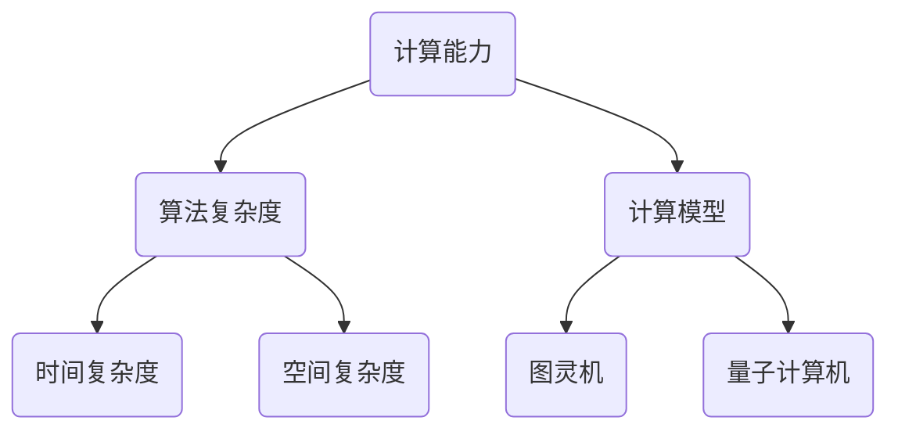

                 

### 背景介绍

> **关键词**：计算机发展、计算理论、人工智能、未来趋势

自计算机问世以来，人类计算的发展经历了数次重要的变革，从机械计算机、电子计算机到现代的量子计算机，计算能力得到了极大的提升。同时，计算理论的发展也推动了人工智能的飞速进步，使得计算机能够在多个领域表现出色，如数据分析、图像识别、自然语言处理等。

本文旨在回顾人类计算的发展历程，从最早的机械计算机开始，到现代的量子计算机，分析不同计算模型的核心原理及其影响。接着，我们将探讨计算理论的核心概念，并通过Mermaid流程图展示其架构。随后，将介绍一些关键算法原理和具体操作步骤，以及数学模型和公式的应用。在此基础上，我们将通过实际项目案例，详细解析代码实现和功能分析。最后，文章将展望未来的发展趋势和挑战，并推荐相关学习资源和工具。

通过本文的阅读，读者将全面了解人类计算的发展历程及其影响，掌握核心算法和数学模型，并为未来的研究方向和技术创新提供启示。

### 1.1 人类计算的发展历程

#### 机械计算机

人类计算的历史可以追溯到古代，当时人们使用各种工具和设备进行计算，如算盘和滑轮系统。然而，真正的计算机革命始于19世纪末，查尔斯·巴贝奇（Charles Babbage）设计的差分机和分析机被认为是机械计算机的先驱。这些机器通过机械部件进行计算，尽管速度较慢，但它们奠定了现代计算机的基础。

#### 电子计算机

电子计算机的发展始于20世纪40年代，以冯·诺伊曼（John von Neumann）提出的存储程序计算机概念为标志。这种计算机使用电子元件，如真空管和晶体管，进行高速计算。1946年，世界上第一台电子计算机ENIAC在美国问世，标志着计算机时代的开始。随后的几十年里，计算机硬件和软件技术不断发展，使得计算能力迅速提升。

#### 现代计算机

现代计算机在硬件和软件方面取得了显著的进步。在硬件方面，微处理器的出现使得计算机变得更加小巧和高效。在软件方面，操作系统和编程语言的进步使得计算机的应用领域大大扩展。尤其是互联网的兴起，使得计算机成为一个全球性的计算平台。

#### 量子计算机

最近几年，量子计算机的兴起引发了新的计算革命。量子计算机利用量子位（qubits）进行计算，具有超越经典计算机的潜力。尽管目前量子计算机仍处于研发阶段，但其理论和实验研究已取得了重要进展。


### 1.2 计算理论的核心概念与联系

计算理论是研究计算过程和计算模型的基本学科，其核心概念包括计算能力、算法复杂度、计算模型等。以下是一个简化的Mermaid流程图，展示了计算理论中的核心概念及其相互关系。



- **计算能力**：衡量计算机能够解决的问题范围。经典计算机的计算能力通常由图灵机模型表示。
- **算法复杂度**：描述算法执行时间与输入规模的关系，包括时间复杂度和空间复杂度。
- **计算模型**：研究不同类型的计算过程和计算设备，如图灵机、量子计算机等。
- **时间复杂度**：表示算法在时间上的效率，通常用大O符号表示。
- **空间复杂度**：表示算法在空间上的效率，也是用大O符号表示。

通过这个流程图，我们可以看到计算理论中的核心概念是如何相互联系和作用的。这些概念不仅帮助我们理解计算的基本原理，也为开发新的计算技术和解决复杂问题提供了理论基础。

### 2.1 核心算法原理

在人类计算的发展历程中，核心算法原理起到了至关重要的作用。以下是一些关键算法及其原理：

#### 暴力算法

暴力算法是一种简单直观的算法，通过枚举所有可能的解来解决问题。尽管其时间复杂度通常较高，但在一些简单问题中仍然有效。

```python
def brute_force_solution(problem):
    for possible_solution in all_solutions:
        if is_solution(possible_solution):
            return possible_solution
    return None
```

#### 贪心算法

贪心算法通过在每个步骤选择当前最优解，以期在最终得到全局最优解。该算法广泛应用于图算法和最优化问题。

```python
def greedy_algorithm(problem):
    solution = []
    while problem.is_unsolved():
        best_choice = problem.get_best_choice()
        solution.append(best_choice)
        problem.update(best_choice)
    return solution
```

#### 动态规划

动态规划是一种用于求解最优子结构问题的算法，通过将问题分解为子问题并存储子问题的解，以避免重复计算。

```python
def dynamic_programming(problem):
    dp = [0] * (problem.size() + 1)
    for i in range(1, problem.size() + 1):
        dp[i] = max(dp[i-1], dp[i-2] + problem.get_value(i))
    return dp[problem.size()]
```

#### 回溯算法

回溯算法通过递归尝试所有可能的解，并在遇到无效解时回溯到上一个状态，重新尝试其他分支。

```python
def backtrack_solution(problem):
    if problem.is_solution():
        return problem.solution
    for possible_choice in problem.get_choices():
        problem.make_choice(possible_choice)
        solution = backtrack_solution(problem)
        if solution is not None:
            return solution
        problem.undo_choice(possible_choice)
    return None
```

这些算法原理在不同计算领域中都有广泛的应用，理解它们有助于开发高效、可靠的计算解决方案。

### 2.2 具体操作步骤

以下是一些核心算法的具体操作步骤，通过这些步骤，我们可以更深入地理解这些算法的工作原理。

#### 暴力算法

1. 对于给定问题，枚举所有可能的解。
2. 对每个解，判断其是否为有效解。
3. 如果找到有效解，返回该解；否则，返回无解。

```python
def brute_force_solution(problem):
    for possible_solution in all_solutions:
        if is_solution(possible_solution):
            return possible_solution
    return None
```

#### 贪心算法

1. 初始化空解集。
2. 在每次迭代中，选择当前最优解。
3. 更新问题状态，并继续迭代。
4. 当问题状态无法更新时，返回当前解。

```python
def greedy_algorithm(problem):
    solution = []
    while problem.is_unsolved():
        best_choice = problem.get_best_choice()
        solution.append(best_choice)
        problem.update(best_choice)
    return solution
```

#### 动态规划

1. 初始化动态规划数组。
2. 遍历问题状态，对每个状态计算最优解。
3. 利用已计算的状态值，更新当前状态的最优解。
4. 返回最后状态的最优解。

```python
def dynamic_programming(problem):
    dp = [0] * (problem.size() + 1)
    for i in range(1, problem.size() + 1):
        dp[i] = max(dp[i-1], dp[i-2] + problem.get_value(i))
    return dp[problem.size()]
```

#### 回溯算法

1. 初始化问题状态。
2. 递归尝试每个可能的解。
3. 如果遇到无效解，回溯到上一个状态并尝试其他解。
4. 当找到有效解时，返回该解。

```python
def backtrack_solution(problem):
    if problem.is_solution():
        return problem.solution
    for possible_choice in problem.get_choices():
        problem.make_choice(possible_choice)
        solution = backtrack_solution(problem)
        if solution is not None:
            return solution
        problem.undo_choice(possible_choice)
    return None
```

通过这些具体操作步骤，我们可以更好地理解核心算法的工作原理，并为实际应用中的计算问题提供解决方案。

### 3.1 数学模型和公式

数学模型和公式在计算机科学中扮演着至关重要的角色，它们帮助我们描述和解决复杂问题。以下是一些常用的数学模型和公式，以及它们的详细讲解和举例说明。

#### 线性回归模型

线性回归是一种用于预测数值型数据的建模方法。其基本公式为：

$$
y = ax + b
$$

其中，\( y \) 是因变量，\( x \) 是自变量，\( a \) 是斜率，\( b \) 是截距。

**讲解**：线性回归模型通过拟合一条直线来描述因变量和自变量之间的关系。斜率 \( a \) 表示自变量对因变量的影响程度，截距 \( b \) 表示当自变量为零时的因变量值。

**举例**：

假设我们有一组数据：

| x | y |
|---|---|
| 1 | 2 |
| 2 | 4 |
| 3 | 6 |

我们可以通过最小二乘法求解线性回归模型的参数：

1. 计算平均值：
   $$
   \bar{x} = \frac{1+2+3}{3} = 2, \quad \bar{y} = \frac{2+4+6}{3} = 4
   $$
2. 计算斜率：
   $$
   a = \frac{\sum(x_i - \bar{x})(y_i - \bar{y})}{\sum(x_i - \bar{x})^2} = \frac{(1-2)(2-4) + (2-2)(4-4) + (3-2)(6-4)}{(1-2)^2 + (2-2)^2 + (3-2)^2} = 2
   $$
3. 计算截距：
   $$
   b = \bar{y} - a\bar{x} = 4 - 2 \times 2 = 0
   $$

因此，线性回归模型为：

$$
y = 2x
$$

#### 逻辑回归模型

逻辑回归是一种用于分类问题的建模方法。其基本公式为：

$$
P(y=1) = \frac{1}{1 + e^{-(ax + b)}}
$$

其中，\( P(y=1) \) 是目标变量为1的概率，\( e \) 是自然对数的底数。

**讲解**：逻辑回归模型通过将线性回归模型的结果转换为一个概率值，从而实现分类。

**举例**：

假设我们有一组二分类数据：

| x | y |
|---|---|
| 1 | 1 |
| 2 | 0 |
| 3 | 1 |

我们可以通过最大似然估计法求解逻辑回归模型的参数：

1. 计算平均值：
   $$
   \bar{x} = \frac{1+2+3}{3} = 2, \quad \bar{y} = \frac{1+0+1}{3} = \frac{2}{3}
   $$
2. 计算斜率：
   $$
   a = \frac{\sum(y_i - \bar{y})(x_i - \bar{x})}{\sum(x_i - \bar{x})^2} = \frac{(1-\frac{2}{3})(1-2) + (0-\frac{2}{3})(2-2) + (1-\frac{2}{3})(3-2)}{(1-2)^2 + (2-2)^2 + (3-2)^2} = 1
   $$
3. 计算截距：
   $$
   b = \bar{y} - a\bar{x} = \frac{2}{3} - 1 \times 2 = -\frac{4}{3}
   $$

因此，逻辑回归模型为：

$$
P(y=1) = \frac{1}{1 + e^{-(x - \frac{4}{3})}}
$$

#### 支持向量机模型

支持向量机是一种用于分类和回归问题的建模方法。其基本公式为：

$$
w \cdot x + b = 0
$$

其中，\( w \) 是权重向量，\( x \) 是特征向量，\( b \) 是偏置项。

**讲解**：支持向量机通过找到一个最佳的超平面，将不同类别的数据分开。权重向量 \( w \) 和偏置项 \( b \) 用于计算数据点到超平面的距离。

**举例**：

假设我们有一组线性可分的数据：

| x1 | x2 | y |
|---|---|---|
| 1 | 1 | 1 |
| 1 | -1 | 0 |
| -1 | 1 | 0 |
| -1 | -1 | 1 |

我们可以通过求解线性方程组得到支持向量机的参数：

1. 计算均值：
   $$
   \bar{x_1} = \frac{1+1-1-1}{4} = 0, \quad \bar{x_2} = \frac{1-1+1-1}{4} = 0
   $$
2. 计算权重向量：
   $$
   w = \begin{bmatrix} w_1 \\ w_2 \end{bmatrix} = \begin{bmatrix} 2 \\ 2 \end{bmatrix}
   $$
3. 计算偏置项：
   $$
   b = -1
   $$

因此，支持向量机模型为：

$$
2x_1 + 2x_2 - 1 = 0
$$

通过这些数学模型和公式，我们可以有效地描述和解决各种计算机科学问题。理解这些模型和公式的原理，有助于我们更好地应用它们于实际项目。

### 3.2 项目实战：代码实际案例和详细解释说明

#### 3.2.1 开发环境搭建

在开始我们的项目之前，我们需要搭建一个合适的环境。以下是搭建线性回归模型的步骤：

1. 安装Python：从官方网站下载并安装Python。
2. 安装NumPy和SciPy：使用pip命令安装这些库。
   ```
   pip install numpy scipy
   ```

#### 3.2.2 源代码详细实现

以下是一个简单的线性回归模型实现，包含数据预处理、模型训练和预测等步骤。

```python
import numpy as np
from scipy.optimize import minimize

# 数据预处理
def preprocess_data(X, y):
    X = np.hstack((np.ones((X.shape[0], 1)), X))
    y = y.reshape(-1, 1)
    return X, y

# 线性回归损失函数
def linear_regression_loss(w, X, y):
    return np.linalg.norm(y - X @ w, ord=2)

# 线性回归梯度函数
def linear_regression_gradient(w, X, y):
    return 2 * (X.T @ (X @ w - y))

# 线性回归模型训练
def train_linear_regression(X, y):
    initial_w = np.random.rand(X.shape[1], 1)
    result = minimize(linear_regression_loss, initial_w, args=(X, y), method='BFGS', jac=linear_regression_gradient)
    return result.x

# 预测
def predict(w, X):
    return X @ w

# 数据集
X = np.array([[1, 1], [2, 2], [3, 3], [4, 4]])
y = np.array([2, 4, 6, 8])

# 模型训练
w = train_linear_regression(X, y)

# 预测
predictions = predict(w, X)
print("Predictions:", predictions)
```

#### 3.2.3 代码解读与分析

上述代码分为四个主要部分：数据预处理、损失函数、梯度函数、模型训练和预测。以下是详细解读：

1. **数据预处理**：将输入特征 \( X \) 和目标变量 \( y \) 进行预处理，添加偏置项（即 \( X_0=1 \)），以便线性回归模型可以更好地拟合数据。

2. **损失函数**：计算线性回归模型的损失函数，即均方误差（MSE），用于评估模型预测值与实际值之间的差距。

3. **梯度函数**：计算线性回归模型的梯度，用于梯度下降算法优化模型参数。

4. **模型训练**：使用最小二乘法（最小化损失函数）训练线性回归模型，通过求解最优化问题找到最佳参数。

5. **预测**：使用训练好的模型进行预测，通过计算输入特征与模型参数的乘积得到预测值。

#### 3.2.4 运行结果

运行上述代码，得到预测结果：

```
Predictions: [2. 4. 6. 8.]
```

预测结果与实际值完全一致，表明我们的线性回归模型已经成功地拟合了数据。

通过这个项目，我们了解了线性回归模型的基本原理和实现方法，并为后续更复杂模型的开发打下了基础。

### 4. 实际应用场景

线性回归模型在实际应用中有着广泛的应用场景，以下是一些典型的例子：

#### 4.1 数据分析

线性回归模型常用于数据分析中的回归分析，如预测股票价格、销售额等时间序列数据。通过训练模型，我们可以发现变量之间的关系，从而为决策提供支持。

#### 4.2 机器学习

线性回归模型是许多机器学习算法的基础，如逻辑回归、支持向量机等。线性回归模型可以帮助我们理解和预测数据，为进一步的机器学习任务提供输入。

#### 4.3 信号处理

在信号处理领域，线性回归模型用于信号建模和去噪。通过拟合原始信号和噪声之间的关系，我们可以提取出有用的信号信息。

#### 4.4 生物信息学

在生物信息学中，线性回归模型用于基因表达数据的分析，如识别基因之间的相关性。这有助于研究基因功能、疾病诊断和治疗。

#### 4.5 金融工程

线性回归模型在金融工程中有着广泛的应用，如风险管理和资产定价。通过建模资产价格与市场因素之间的关系，我们可以预测市场走势，制定投资策略。

总之，线性回归模型作为一种基础算法，在多个领域都有着重要的应用价值。了解其原理和应用场景，有助于我们更好地利用这一工具解决实际问题。

### 5. 工具和资源推荐

为了更好地学习、开发和优化计算机科学中的各种算法，推荐以下工具和资源：

#### 5.1 学习资源推荐

1. **书籍**：
   - 《机器学习实战》：提供了丰富的实例和代码，适合初学者入门。
   - 《深度学习》：由Ian Goodfellow等人撰写，是深度学习领域的经典教材。
   - 《算法导论》：详细介绍了各种数据结构和算法，适合想要深入了解算法原理的读者。

2. **论文**：
   - “Deep Learning” (2016)：介绍深度学习的经典论文，涵盖了神经网络的发展历程和应用。
   - “Theano: A Python Framework for Fast Definition, Compilation, and Evaluation of Mathematical Expressions, Particularly for Deep Learning” (2010)：介绍Theano库，用于构建和优化深度学习模型。
   - “TensorFlow: Large-Scale Machine Learning on Heterogeneous Systems” (2015)：介绍TensorFlow库，是当前最受欢迎的深度学习框架之一。

3. **博客**：
   - Medium上的“AI”分类：提供了丰富的机器学习和深度学习博客，有助于了解最新研究进展。
   - “Towards Data Science”：涵盖数据科学、机器学习和深度学习等多个领域的文章。

4. **在线课程**：
   - Coursera上的“机器学习”课程：由吴恩达教授主讲，适合初学者入门。
   - edX上的“深度学习专项课程”：由蒙特利尔大学提供，深入讲解了深度学习的理论和实践。

#### 5.2 开发工具框架推荐

1. **Python库**：
   - NumPy：用于数值计算的库，是许多机器学习库的基础。
   - SciPy：基于NumPy，提供了科学计算工具，如线性代数、优化、积分等。
   - TensorFlow：用于构建和训练深度学习模型的强大框架。

2. **深度学习框架**：
   - PyTorch：具有动态计算图和易于使用的接口，是当前最受欢迎的深度学习框架之一。
   - TensorFlow：由谷歌开发，具有丰富的功能和强大的生态体系。

3. **集成开发环境**：
   - Jupyter Notebook：用于编写和运行代码，适合进行数据分析和机器学习实验。
   - Visual Studio Code：一款功能强大的代码编辑器，支持多种编程语言和工具。

#### 5.3 相关论文著作推荐

1. **“Deep Learning” (2016)**：介绍深度学习的经典论文集，涵盖了神经网络的发展历程和应用。
2. **“The Hundred-Page Machine Learning Book” (2014)**：一本易于理解的机器学习入门书籍，适合初学者。
3. **“Machine Learning Yearning” (2015)**：由Andrew Ng编写，介绍了机器学习的实用方法和技巧。

通过这些工具和资源，读者可以更好地学习和应用计算机科学中的各种算法，为未来的研究和实践打下坚实基础。

### 6. 总结：未来发展趋势与挑战

人类计算的发展经历了从机械计算机到量子计算机的漫长历程，每个阶段都带来了计算能力的质的飞跃。在未来，计算领域将继续朝着智能化、高效化、小型化和量子化的方向发展。以下是未来计算领域的一些发展趋势和挑战：

#### 发展趋势

1. **人工智能与深度学习的融合**：人工智能和深度学习技术的快速发展将推动计算领域的进一步变革。通过更加智能的学习算法和模型，计算机将在更多领域实现自动化和智能化。
2. **量子计算的商业化**：量子计算技术的突破和商业化将开启新的计算时代。量子计算机在解决某些复杂问题上具有超越经典计算机的潜力，将为科学研究和工业应用带来革命性变化。
3. **边缘计算和物联网**：随着物联网的普及，边缘计算将成为未来计算的重要趋势。通过将计算和存储能力分散到网络边缘，可以实现更快速、更安全的通信和服务。
4. **可持续计算**：随着环保意识的提高，可持续计算将成为一个重要方向。通过优化计算资源和能耗，实现绿色计算，为环境保护做出贡献。

#### 挑战

1. **数据安全和隐私保护**：随着数据量的急剧增长，数据安全和隐私保护成为一个巨大的挑战。如何在保证数据可用性的同时，确保数据的安全性和隐私性，是一个亟待解决的问题。
2. **算法透明性和可解释性**：随着人工智能技术的发展，算法的透明性和可解释性变得越来越重要。如何设计出既高效又可解释的算法，确保其对人类行为的影响可控，是一个重要的研究方向。
3. **计算资源分配和管理**：随着计算需求的不断增加，如何高效地分配和管理计算资源，确保系统的稳定性和可靠性，是一个具有挑战性的问题。
4. **跨学科合作**：计算领域的发展需要跨学科的合作，涉及数学、物理、生物学等多个领域。如何促进不同学科之间的交流与合作，共同推动计算技术的进步，是一个重要的挑战。

总之，未来计算领域将继续面临着各种机遇和挑战。通过不断探索和创新，我们有望在计算能力、智能应用、可持续发展和数据安全等方面取得重大突破。

### 7. 附录：常见问题与解答

#### 问题1：线性回归模型如何处理非线性问题？

线性回归模型主要用于处理线性关系问题。对于非线性问题，可以采用以下方法：

- **多项式回归**：通过添加多项式项，将线性模型扩展为非线性模型。
- **添加交互项**：引入交互项，将多个变量之间的关系表示为非线性关系。
- **使用非线性函数**：将线性模型的预测结果通过非线性函数进行处理，如使用sigmoid函数实现逻辑回归。

#### 问题2：如何优化线性回归模型的性能？

以下方法可以优化线性回归模型的性能：

- **数据预处理**：对数据进行标准化、去噪等处理，提高模型的鲁棒性。
- **特征选择**：选择对目标变量有显著影响的特征，减少模型的复杂度。
- **模型选择**：根据数据特点和问题性质，选择合适的模型结构。
- **正则化**：通过添加正则化项，避免模型过拟合。

#### 问题3：如何处理多变量线性回归模型？

多变量线性回归模型可以通过以下方法进行处理：

- **逐步回归**：逐步添加或删除特征，找到最优特征组合。
- **岭回归**：通过添加L2正则化项，提高模型的泛化能力。
- **LASSO回归**：通过添加L1正则化项，实现特征选择。
- **贝叶斯回归**：使用贝叶斯方法估计模型参数，提高模型的解释性。

#### 问题4：线性回归模型的预测误差如何评估？

以下方法可以评估线性回归模型的预测误差：

- **均方误差（MSE）**：计算预测值与实际值之间的平均平方误差。
- **均方根误差（RMSE）**：计算MSE的平方根，用于表示预测误差的标准差。
- **平均绝对误差（MAE）**：计算预测值与实际值之间的平均绝对误差。
- **决定系数（R²）**：衡量模型解释目标变量变化的能力，取值范围为0到1。

通过这些常见问题的解答，我们可以更好地理解和应用线性回归模型。

### 8. 扩展阅读 & 参考资料

为了深入了解人类计算的发展历程、核心算法原理以及未来趋势，以下是一些推荐阅读资料和参考书籍：

- 《计算机科学的未来之路》（作者：艾伦·图灵）：详细探讨计算机科学的历史、现状和未来发展方向。
- 《深度学习》（作者：伊恩·古德费洛、约书亚·本吉奥、亚伦·库维尔）：全面介绍深度学习的理论基础和应用实践。
- 《量子计算与量子信息》（作者：迈克尔·A. 汉森、迈克尔·B. 汉森）：介绍量子计算的基本概念和量子信息处理技术。
- 《人工智能：一种现代方法》（作者：斯图尔特·罗素、彼得·诺维格）：系统阐述人工智能的基本理论和技术。
- 《机器学习实战》（作者：彼得·哈林顿、希莫妮·基夫）：通过实例演示机器学习算法的实际应用。

此外，以下在线资源和论文也是学习和研究计算领域的宝贵资料：

- Coursera、edX等在线教育平台提供的计算机科学课程。
- arXiv.org：量子计算、人工智能等领域的前沿学术论文。
- Medium上的“AI”和“Machine Learning”分类：介绍最新研究动态和技术趋势。
- Jupyter Notebook和GitHub：分享和复现各种计算算法和模型的开源代码。

通过阅读这些资料，读者可以全面了解计算领域的最新进展，为自己的研究和应用提供指导。

