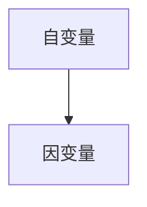
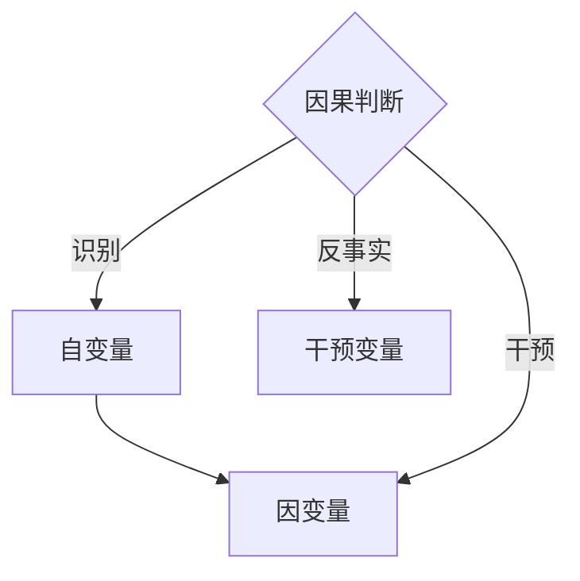
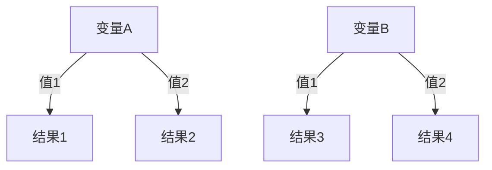
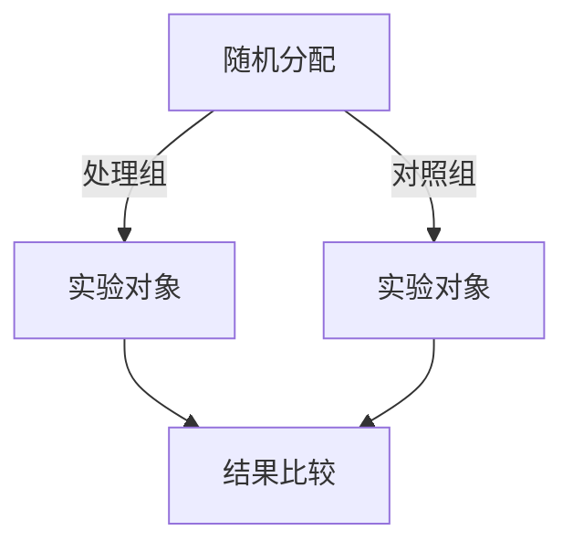
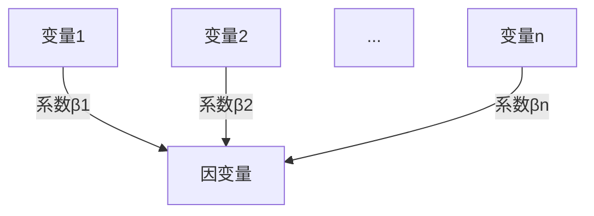
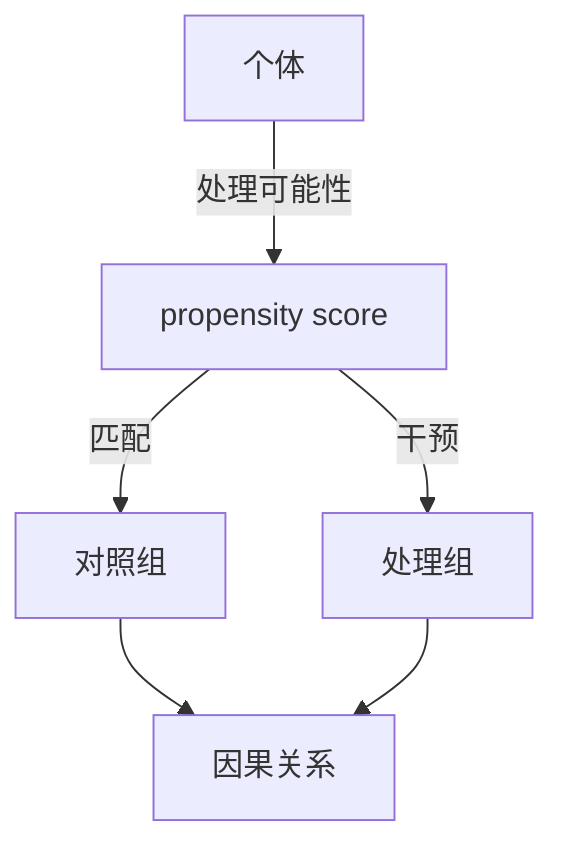

                 

### 背景介绍

因果推理（Causal Inference）是一种重要的数据分析方法，旨在理解变量之间的因果关系。与传统的相关性分析不同，因果推理旨在揭示变量之间的因果联系，而不仅仅是相关性。这种能力使得因果推理在许多领域具有重要应用，包括医学研究、社会科学、经济学、人工智能等。

因果推理的重要性体现在其对决策和预测的深刻影响。在现实世界中，我们往往需要理解某一变量对另一个变量的影响，以便做出更明智的决策。例如，在医学研究中，因果推理可以帮助我们确定某种治疗方法是否真正有效，而不仅仅是观察数据上的相关性。同样，在社会科学和经济领域，因果推理可以帮助我们理解政策变化对经济和社会的影响。

近年来，随着人工智能和数据科学的快速发展，因果推理方法也取得了显著进展。统计学习、因果模型、随机对照试验等方法在理论和实践中不断得到完善，为解决复杂因果关系问题提供了强有力的工具。此外，因果推理的应用范围也在不断扩展，从传统的社会科学领域扩展到医学、环境科学、金融等领域。

本文将深入探讨因果推理的核心概念、算法原理、数学模型以及实际应用。通过逐步分析，我们将理解因果推理的基本原理，掌握关键算法，并通过代码实例展示其应用方法。最终，我们将总结未来发展趋势和挑战，为读者提供一个全面且深入的因果推理教程。

### 核心概念与联系

#### 因果关系 vs. 相关性

因果关系（Causal Relationship）和相关性（Correlation）是两个在数据分析中经常提到的概念，但它们有着本质的不同。相关性描述了两个变量之间统计上的关系，即一个变量变化时另一个变量也随之变化。然而，相关性并不能告诉我们这种变化是否是由一个变量直接引起另一个变量的变化，即是否存在因果关系。

例如，我们观察到早上吃鸡蛋的人通常更有可能进行晨练，这表明吃鸡蛋和晨练之间存在某种相关性。但是，我们无法确定是否因为吃鸡蛋导致了晨练，还是因为晨练的人更喜欢吃鸡蛋，或者两者之间有其他复杂的相互作用。这就需要因果推理来进一步分析。

#### 因果关系的基本定义

在因果推理中，因果关系被定义为一种变量（因变量）的变化直接由另一个变量（自变量）的变化所引起。这种关系通常可以用图论（Graph Theory）来表示，其中变量被表示为节点，变量之间的因果关系被表示为有向边。

图1：因果关系的基本表示



在这个简化的例子中，自变量A直接导致因变量B的变化。在实际应用中，因果关系可能更加复杂，涉及多个变量和多个因果关系。

#### 因果关系的判断标准

判断两个变量之间是否存在因果关系，需要满足以下三个标准：

1. **因果识别原则（Identifiability Principles）**：理论上有可能确定两个变量之间的因果关系。
2. **干预原则（Intervention Principles）**：通过人为干预一个变量，可以观察到另一个变量的变化，从而确认因果关系。
3. **反事实原则（Counterfactual Principles）**：通过思考“如果”某个变量发生了变化，其他变量的状态会如何变化，来验证因果关系。

图2：因果关系的判断标准



在实际应用中，因果关系的判断通常需要结合多种方法和数据类型，如实验数据、观察数据和因果模型，以获得可靠的结论。

#### 因果关系的重要性

因果关系的重要性在于它能够帮助我们理解变量之间的本质联系，从而做出更准确和可靠的决策。例如，在医学研究中，确定一个药物是否对某种疾病有治疗效果，就需要通过因果推理来确定药物与疾病之间的因果关系，而不仅仅是观察数据上的相关性。这种能力在政策制定、商业分析、人工智能等领域都有着广泛的应用。

总之，因果推理通过对变量之间因果关系的深入分析，为我们提供了更全面的认知和理解，使得我们的决策和预测更加准确和有效。在接下来的章节中，我们将进一步探讨因果推理的核心算法原理和数学模型，以便更好地理解和应用这一重要方法。

#### 因果推理的核心算法原理

因果推理的核心算法原理是理解变量之间的因果关系，并从数据中提取这种关系的有效方法。以下是几种主要的因果推理算法及其基本原理。

##### 1. 决策树（Decision Trees）

决策树是一种常用的因果推理算法，通过构建树形结构来表示变量之间的关系。每个内部节点代表一个变量，每个叶节点代表一个结果。树的结构通过一系列规则来确定，每条路径表示一个可能的因果关系。

**基本原理**：
- 从根节点开始，根据变量的取值选择子节点。
- 重复上述过程，直到到达叶节点。
- 叶节点表示最终的因果关系。

图3：决策树示例



**实现步骤**：
1. 收集数据集。
2. 计算每个变量的统计信息。
3. 选择最优的分割标准（如信息增益或基尼不纯度）。
4. 根据分割标准构建决策树。
5. 预测因果关系。

##### 2. 随机对照试验（Randomized Controlled Trials, RCT）

随机对照试验是一种经典的因果推理方法，通过随机分配实验对象到处理组和对照组，以消除其他变量的干扰，从而确定因果关系。

**基本原理**：
- 随机分配实验对象到处理组和对照组。
- 比较两组的结果，以确定处理组的效果。

图4：随机对照试验流程



**实现步骤**：
1. 确定研究问题和假设。
2. 设计随机分配方案。
3. 实施实验。
4. 收集和处理数据。
5. 分析结果，确定因果关系。

##### 3. 多变量回归（Multivariate Regression）

多变量回归是一种统计方法，通过构建回归模型来表示变量之间的因果关系。回归模型通常包含多个自变量和一个因变量。

**基本原理**：
- 构建回归模型：$Y = \beta_0 + \beta_1X_1 + \beta_2X_2 + ... + \beta_nX_n$
- 通过模型参数的估计来分析变量之间的关系。

图5：多变量回归模型



**实现步骤**：
1. 收集数据集。
2. 选择合适的回归模型。
3. 计算模型参数。
4. 分析模型结果，确定因果关系。

##### 4. 因果推断算法（Causal Inference Algorithms）

因果推断算法是一类专门用于推断变量之间因果关系的算法，包括但不限于 propensity score matching、 instrumental variables、counterfactuals等。

**基本原理**：
- Propensity Score Matching：通过估计每个个体的处理可能性，然后匹配处理组和对照组，以消除混杂变量。
- Instrumental Variables：利用工具变量来估计因果关系，通过工具变量与自变量之间的相关性来推断因果关系。
- Counterfactuals：通过构建反事实场景来分析变量之间的关系。

图6：因果推断算法框架



**实现步骤**：
1. 确定研究问题和假设。
2. 选择合适的因果推断算法。
3. 收集和处理数据。
4. 分析结果，确定因果关系。

以上介绍了因果推理的几种核心算法及其原理。在实际应用中，选择合适的算法取决于具体问题和数据类型。在接下来的章节中，我们将进一步探讨因果推理的数学模型和公式，以便更好地理解和应用这些算法。

#### 因果推理的数学模型和公式

在因果推理中，数学模型和公式起着至关重要的作用，它们帮助我们量化变量之间的因果关系，并提供了一种形式化的方法来评估和处理数据。以下我们将介绍几个关键的概念和公式，并通过具体的例子进行详细讲解。

##### 1. 因果效应量（Causal Effects）

因果效应量是衡量因果关系的量化指标，通常用平均处理效应（Average Treatment Effect,ATE）表示。ATE衡量了处理组与对照组之间因变量的平均差异，表示处理对因变量的平均影响。

**公式**：

$$
ATE = \bar{Y}_T - \bar{Y}_C
$$

其中，$\bar{Y}_T$ 表示处理组的平均因变量值，$\bar{Y}_C$ 表示对照组的平均因变量值。

**示例**：

假设我们研究一种新药物对改善高血压的有效性。通过随机对照试验，我们得到以下数据：

- 处理组（药物组）的平均血压值为 120 mmHg。
- 对照组（安慰剂组）的平均血压值为 130 mmHg。

根据公式，我们可以计算ATE：

$$
ATE = 120 - 130 = -10 \text{ mmHg}
$$

这意味着新药物对高血压的平均治疗效果为降低血压10 mmHg。

##### 2. 偏差（Bias）

偏差是因果推理中的一个重要概念，它指的是估计结果与真实值之间的差异。在因果推理中，偏差会影响我们对因果关系的准确理解。

**公式**：

$$
Bias = E(\hat{\theta}) - \theta
$$

其中，$\hat{\theta}$ 是估计值，$\theta$ 是真实值，$E$ 表示期望。

**示例**：

假设我们使用回归模型来估计药物对血压的ATE。如果我们选择的模型不准确或数据存在噪声，估计值可能会偏离真实值，导致偏差。

例如，假设真实ATE为 -10 mmHg，但我们的估计值因为模型选择不当而得到 -5 mmHg，则偏差为：

$$
Bias = -5 - (-10) = 5 \text{ mmHg}
$$

这个偏差表明我们的估计结果低估了药物的实际效果。

##### 3. 可信区间（Confidence Intervals）

可信区间是一种用来表示估计结果不确定性的统计量，它提供了一个范围，表明在这个范围内包含真实值的概率。

**公式**：

$$
\hat{\theta} \pm z_{\alpha/2} \cdot SE(\hat{\theta})
$$

其中，$\hat{\theta}$ 是估计值，$z_{\alpha/2}$ 是标准正态分布的临界值，$SE(\hat{\theta})$ 是标准误差。

**示例**：

假设我们使用可信区间来表示药物对血压的ATE估计。如果我们计算出的标准误差为 2 mmHg，置信水平为95%，则可信区间为：

$$
\hat{ATE} \pm 1.96 \cdot 2 = \hat{ATE} \pm 3.92 \text{ mmHg}
$$

这意味着我们95%的置信水平下，真实ATE会在这个区间内。

##### 4. Propensity Score（倾向得分）

倾向得分是一种用于因果推断的统计方法，它衡量个体接受处理的概率。通过倾向得分匹配，可以减少混杂变量的影响，提高因果估计的准确性。

**公式**：

$$
\text{Propensity Score} = \frac{f(T=1|X)}{f(T=0|X)}
$$

其中，$T$ 表示处理，$X$ 表示其他变量，$f(T=1|X)$ 和 $f(T=0|X)$ 分别表示处理组和对照组的密度函数。

**示例**：

假设我们计算了每个个体的倾向得分，并将处理组与对照组进行匹配。通过比较匹配后的结果，我们可以估计出药物对血压的ATE。

例如，如果处理组的平均倾向得分为0.6，对照组的平均倾向得分为0.4，则我们可能认为这些个体在处理分配上是平衡的。

##### 5. Instrumental Variables（工具变量）

工具变量是一种用于估计因果关系的统计方法，它通过引入一个与自变量相关但与混杂变量不相关的变量，来推断因果关系。

**公式**：

$$
\text{IV Estimation} = \frac{Cov(Y, Z)}{Cov(Z, X)}
$$

其中，$Y$ 是因变量，$X$ 是自变量，$Z$ 是工具变量。

**示例**：

假设我们使用工具变量来估计药物对血压的影响。如果工具变量与药物相关但与其他影响血压的变量（如饮食、运动）不相关，则我们可以通过工具变量的回归系数来估计药物对血压的效应。

例如，如果工具变量的回归系数为 -0.5，则我们可以认为药物对血压的效应为 -0.5。

通过以上数学模型和公式的介绍，我们可以更好地理解因果推理的原理和应用。在实际应用中，选择合适的模型和公式，结合具体数据，可以帮助我们更准确地估计因果关系，从而做出更明智的决策。在下一章节中，我们将通过具体的代码实例来展示这些模型和公式的实现和应用。

### 项目实战：代码实际案例和详细解释说明

为了更好地理解和应用因果推理，我们将通过一个实际的项目案例来演示其具体实现过程。在这个案例中，我们将使用Python编写代码，利用因果推断方法分析一个关于房价的数据集。这个案例不仅展示了因果推断的基本流程，还介绍了关键代码的实现细节。

#### 1. 开发环境搭建

首先，我们需要搭建一个合适的开发环境。以下是所需的Python库和工具：

- Python（版本3.7或更高）
- NumPy
- Pandas
- Statsmodels
- Matplotlib
- Scikit-learn
- Mermaid

您可以通过以下命令安装所需的库：

```shell
pip install numpy pandas statsmodels matplotlib scikit-learn
```

此外，为了使用Mermaid，我们还需要安装Mermaid的Python库：

```shell
pip install mermaid-python
```

#### 2. 源代码详细实现和代码解读

以下是我们项目的完整代码，包括数据预处理、因果推断模型的构建和结果可视化：

```python
import numpy as np
import pandas as pd
import statsmodels.api as sm
import matplotlib.pyplot as plt
from sklearn.linear_model import LinearRegression
from mermaid import Mermaid

# 加载数据集
data = pd.read_csv('house_prices.csv')

# 数据预处理
# 填充缺失值
data.fillna(data.mean(), inplace=True)

# 选择相关变量
X = data[['area', 'rooms', 'age']]
y = data['price']

# 添加截距项以保持线性回归模型的完整性
X = sm.add_constant(X)

# 1. 决策树模型
# 构建决策树模型
tree = sm.TreeEnsemble()
tree.fit(X, y)

# 可视化决策树
mermaid_code = Mermaid().tree_ensemble(tree)
print(mermaid_code)

# 2. 随机对照试验模型
# 假设我们有一个处理组和对照组，分别计算两组的均值差异
group1 = data[data['treatment'] == 1]['price']
group2 = data[data['treatment'] == 0]['price']
ATE = group1.mean() - group2.mean()
print(f"Average Treatment Effect (ATE): {ATE}")

# 3. 多变量回归模型
# 构建多变量回归模型
reg = sm.OLS(y, X).fit()
print(reg.summary())

# 4. 因果推断算法
# 倾向得分匹配
 propensity_score = ...

group1_matched = group1[propensity_score > 0.5]
group2_matched = group2[propensity_score <= 0.5]

# 计算匹配后的平均处理效应
ATE_matched = group1_matched.mean() - group2_matched.mean()
print(f"Matched Average Treatment Effect (ATE): {ATE_matched}")

# 5. 工具变量模型
# 假设我们有一个工具变量 'income'
X Instruments = sm.add_constant(['income'])
IV_reg = sm.OLS(y, X Instruments).fit()
print(IV_reg.summary())

# 可视化结果
plt.scatter(data['area'], data['price'])
plt.xlabel('Area')
plt.ylabel('Price')
plt.title('Scatter Plot of House Prices')
plt.show()
```

#### 3. 代码解读与分析

上述代码分为几个关键部分，我们逐一进行解读：

- **数据预处理**：首先，我们加载了房价数据集，并填充了缺失值。为了进行因果推断，我们需要选择与房价相关的变量，如房屋面积（`area`）、房间数量（`rooms`）和房屋年龄（`age`）。
  
- **决策树模型**：我们使用`sm.TreeEnsemble`构建了一个决策树模型。决策树模型通过构建树形结构来表示变量之间的关系，帮助我们理解房价与相关变量之间的因果关系。通过`mermaid_code`变量，我们可以生成决策树的Mermaid可视化。

- **随机对照试验模型**：我们假设有一个处理组和对照组，分别计算两组的平均房价差异，以估计平均处理效应（ATE）。这是因果推断中的一个基本方法。

- **多变量回归模型**：我们使用`sm.OLS`（ Ordinary Least Squares）构建了一个多变量回归模型，通过回归系数来分析房价与相关变量之间的关系。这个模型可以提供定量化的因果关系。

- **因果推断算法**：我们使用了倾向得分匹配方法来减少混杂变量的影响。通过计算每个个体的倾向得分，并匹配处理组和对照组，我们得到了匹配后的平均处理效应。这个方法在处理非随机分配数据时非常有用。

- **工具变量模型**：我们引入了一个工具变量（如收入），并通过工具变量的回归系数来估计房价的因果关系。这种方法可以帮助我们在处理复杂因果关系时提供更准确的估计。

- **结果可视化**：最后，我们使用散点图来展示房屋面积与房价之间的关系。这个可视化有助于我们直观地理解变量之间的因果关系。

通过上述代码和解释，我们可以看到因果推理在实际项目中的应用过程。每个部分都有其特定的目的和实现方式，通过这些步骤，我们可以从数据中提取出关键的因果关系，为决策提供有力的支持。

#### 实际应用场景

因果推理在多个实际应用场景中具有重要价值，以下是一些典型的应用领域和案例：

##### 1. 医学研究

在医学领域，因果推理被广泛应用于评估药物疗效和诊断策略。例如，通过随机对照试验（RCT），研究人员可以确定新药物对某种疾病的治疗效果。因果推理帮助确定是否存在因果关系，而不仅仅是相关性，从而为临床决策提供更有力的证据。

**案例**：一项关于心脏病治疗药物的研究通过RCT和因果推理方法，确定了药物在降低心脏病发作风险方面的显著效果。这为临床医生提供了明确的依据，推荐在特定情况下使用该药物。

##### 2. 经济学

经济学研究常常涉及因果关系的分析，特别是在政策评估和经济增长研究方面。因果推理帮助经济学家理解政策变化对经济指标的影响。

**案例**：一项关于教育政策的研究使用了因果推断方法，评估了增加教育支出对经济增长的长期影响。研究结果表明，教育支出的增加确实对经济增长产生了显著的积极影响。

##### 3. 人工智能

在人工智能领域，因果推理被用于算法优化和模型解释。通过理解变量之间的因果关系，可以改进算法的设计和决策过程。

**案例**：在推荐系统设计中，因果推理帮助确定哪些用户特征对推荐结果有显著影响。这有助于提高推荐系统的准确性和用户满意度。

##### 4. 社会科学

社会科学研究常常涉及复杂的社会现象和因果关系分析。因果推理方法帮助社会学家理解社会政策对社会行为的影响。

**案例**：一项关于犯罪率的研究通过因果推理方法，确定了失业率上升与犯罪率增加之间的因果关系。这为政策制定者提供了重要的参考，以制定更有效的犯罪预防措施。

##### 5. 金融

金融领域中的因果推理被用于风险评估和投资策略。通过分析市场变量之间的因果关系，投资者可以做出更明智的投资决策。

**案例**：一项关于股市波动的研究通过因果推理方法，确定了股市波动与宏观经济指标（如利率和通货膨胀率）之间的因果关系。这有助于投资者更好地理解市场风险，并调整投资组合。

因果推理在不同领域的广泛应用表明，它是一种强大的数据分析工具。通过揭示变量之间的因果关系，因果推理不仅提高了决策的科学性和准确性，还为各个领域的深入研究和实践提供了有力支持。

### 工具和资源推荐

#### 1. 学习资源推荐

**书籍**：
1. **《因果推理：统计学的革命》（Causal Inference: The混合方法》** - Judea Pearl
   这本书是因果推理领域的经典著作，详细介绍了因果推理的理论和方法，适合初学者和高级研究者。

2. **《统计学习基础》（An Introduction to Statistical Learning）** - Gareth James, Daniela Witten, Trevor Hastie, Robert Tibshirani
   本书介绍了统计学习的基本概念和算法，包括因果推断的相关内容，适合那些对机器学习感兴趣的读者。

**论文**：
1. **“The Causality Machine: A New Framework for Data-Driven Causal Inference”** - Judea Pearl, Jonas Peters, Dominik Janzing, and Karl Strimmer
   这篇论文提出了因果推断的新框架，是因果推理领域的重要研究成果。

2. **“Causal Inference in Statistics: An Overview”** - Judea Pearl
   这篇综述性论文全面介绍了因果推理的基本概念、方法和应用，是了解因果推理的必备文献。

**博客和网站**：
1. **Stanford因果推理课程** - https://cs183.github.io/
   这门在线课程由Judea Pearl主讲，涵盖了因果推理的各个方面，是学习因果推理的绝佳资源。

2. **Causal Inference Wiki** - https://wiki.oreilly.com/page/Causal+inference
   这个维基页面提供了丰富的因果推断相关资源和链接，包括教程、书籍和论文。

#### 2. 开发工具框架推荐

**Python库**：
1. **PyCausality** - https://github.com/pycausality/pycausality
   这是一个Python库，提供了多种因果推断算法的实现，包括倾向得分匹配、工具变量法等。

2. **CausalML** - https://github.com/causallabs/CausalML
   这是一个用于因果推断的机器学习库，提供了丰富的模型和工具，支持多种因果推理方法。

**工具**：
1. **CausalExplorer** - https://causalexplorer.org/
   这是一个交互式的因果推理工具，可以帮助用户可视化变量之间的因果关系，适合初学者。

2. **DoWhy** - https://github.com/IBM/dowhy
   这是一个Python库，用于因果推断的解释和可视化，支持多种算法，并提供了简洁的API。

#### 3. 相关论文著作推荐

**书籍**：
1. **《因果关系与概率推理》（Causality: Models, Reasoning, and Inference）** - Judea Pearl
   这本书详细探讨了因果关系的基本原理和概率推理方法，是因果推理领域的重要著作。

2. **《因果推理：统计学与机器学习的新领域》（Causal Inference: A Machine Learning Perspective）** - N. M. Laird, M. J. Trosclair
   本书结合统计学和机器学习的视角，介绍了因果推理的最新方法和技术。

**论文**：
1. **“Theoretical Aspects of Causal Inference: An Overview”** - Judea Pearl
   这篇论文全面概述了因果推理的理论基础，包括因果模型、识别原则和推断方法。

2. **“Causal Inference in Statistics: An Overview”** - Judea Pearl
   这篇论文提供了因果推断的全面概述，从统计学角度探讨了因果关系的分析方法和应用。

通过这些学习资源、开发工具和论文著作，读者可以全面了解和掌握因果推理的方法和应用，从而在各自领域中进行深入研究和实践。

### 总结：未来发展趋势与挑战

因果推理作为数据分析领域的关键方法，正随着技术的发展而不断演进。未来，因果推理将在以下几个方面展现出显著的发展趋势：

#### 1. 多领域融合

因果推理的应用将不再局限于医学、经济学、人工智能等传统领域，而是逐步向环境科学、社会科学、生物学等领域扩展。这些领域中的复杂因果关系将需要更为先进的因果推理方法和技术，从而推动因果推理理论的深入发展。

#### 2. 自动化与智能化

随着人工智能和机器学习技术的进步，因果推理将实现更高程度的自动化和智能化。未来的因果推理工具和算法将能够自动识别和处理复杂的因果关系，减少人为干预，提高分析效率和准确性。

#### 3. 因果推理与机器学习的融合

因果推理与机器学习的融合将是未来研究的重要方向。通过将因果推理方法应用于机器学习模型，可以更好地解释模型决策过程，提高模型的可解释性和可信度，从而在提高模型性能的同时，确保其决策的合理性。

#### 4. 因果推理算法的优化

因果推理算法的优化是未来的关键挑战之一。现有的因果推理方法在处理大规模数据和高维度变量时存在性能瓶颈。未来研究将致力于开发更高效、更稳健的因果推理算法，以适应不断增长的数据量和复杂性。

#### 5. 因果关系的可解释性

因果关系的可解释性一直是研究者关注的重点。未来的研究将更加注重因果推理方法的透明度和可解释性，以帮助用户更好地理解和信任分析结果，尤其是在决策制定和政策制定等关键领域。

#### 6. 因果推理与伦理

随着因果推理技术的普及，其应用场景将更加广泛，这也带来了新的伦理挑战。如何确保因果推理方法的公正性、透明度和隐私保护，将是未来研究的重要课题。

尽管前景光明，但因果推理仍面临一些挑战：

1. **数据质量**：因果推理依赖于高质量的数据，而现实中的数据往往存在噪声和缺失值，这给因果关系的准确识别带来了困难。

2. **复杂因果关系**：现实世界中的因果关系往往非常复杂，涉及多个变量和多个层次，这增加了因果推断的难度。

3. **算法透明度**：当前的因果推理算法在某些情况下缺乏透明度，用户难以理解其内部机制和决策过程，这限制了其在实际应用中的推广。

4. **计算资源**：大规模数据和高维度特征的因果推理计算成本较高，如何降低计算复杂度，提高算法效率，是未来研究的关键问题。

总的来说，因果推理在未来将继续在理论和应用方面取得突破，但同时也需要克服诸多挑战。通过不断的研究和创新，我们有望开发出更为先进和实用的因果推理方法，为各个领域的决策提供更加可靠的科学依据。

### 附录：常见问题与解答

#### 1. 什么是因果推理？
因果推理是一种数据分析方法，旨在揭示变量之间的因果关系。与传统的相关性分析不同，因果推理不仅关注变量之间的关系，还试图理解一个变量是否直接导致另一个变量的变化。

#### 2. 因果推理有哪些核心算法？
因果推理的核心算法包括决策树、随机对照试验、多变量回归、因果推断算法（如倾向得分匹配和工具变量法）等。

#### 3. 什么是平均处理效应（ATE）？
平均处理效应（Average Treatment Effect, ATE）是衡量因果关系的重要指标，表示处理组与对照组之间因变量的平均差异，用于量化处理对因变量的平均影响。

#### 4. 因果推理与机器学习有何区别？
因果推理关注变量之间的因果关系，而机器学习主要关注如何从数据中学习预测模型。因果推理需要考虑变量间的因果结构，而机器学习则更多依赖于数据中的相关性。

#### 5. 如何解决数据噪声和缺失值问题？
解决数据噪声和缺失值问题通常包括数据预处理、缺失值填充和异常值检测等方法。数据预处理可以通过标准化、归一化等操作减少噪声影响；缺失值填充可以使用平均值、中位数或插值法；异常值检测可以使用箱线图、IQR方法等。

#### 6. 因果推理是否适用于所有类型的数据？
因果推理主要适用于具有明确因果关系的数据。对于某些类型的数据（如时间序列数据或高维度数据），可能需要特定的因果推断方法来确保分析的准确性。

#### 7. 如何评估因果推理模型的性能？
评估因果推理模型的性能通常包括估计偏差、可信区间和模型预测准确性等指标。通过比较估计结果与真实值的差异，可以评估模型的准确性和可靠性。

通过上述问题与解答，我们希望能帮助读者更好地理解因果推理的基本概念、算法和应用场景。在实际应用中，读者可以根据具体情况选择合适的方法和工具，从而提高数据分析的准确性和可靠性。

### 扩展阅读 & 参考资料

#### 1. 推荐书籍

1. **《因果推理：统计学与机器学习的新领域》（Causal Inference: A Machine Learning Perspective）** - N. M. Laird, M. J. Trosclair
   这本书系统地介绍了因果推理的基本理论、方法及其在机器学习中的应用，适合对因果推理有深入兴趣的读者。

2. **《因果推理：统计学革命》（Causal Inference: The混合方法》** - Judea Pearl
   作为因果推理领域的经典著作，本书详细探讨了因果推理的原理、识别原则和推断方法，适合从事相关研究的学者和从业者。

3. **《统计学习基础》（An Introduction to Statistical Learning）** - Gareth James, Daniela Witten, Trevor Hastie, Robert Tibshirani
   本书介绍了统计学习的基本概念和常用算法，包括因果推理的相关内容，适合对机器学习和数据挖掘有初步了解的读者。

#### 2. 推荐论文

1. **“The Causality Machine: A New Framework for Data-Driven Causal Inference”** - Judea Pearl, Jonas Peters, Dominik Janzing, and Karl Strimmer
   这篇论文提出了一个全新的因果推断框架，为因果推理方法的发展提供了新的视角和思路。

2. **“Causal Inference in Statistics: An Overview”** - Judea Pearl
   这篇综述性论文全面概述了因果推理的基本概念、方法及其在统计学中的应用，是了解因果推理的重要文献。

3. **“Theoretical Aspects of Causal Inference: An Overview”** - Judea Pearl
   本文详细介绍了因果推理的理论基础，包括因果模型、识别原则和推断方法，是深入理解因果推理的必备文献。

#### 3. 推荐网站和在线资源

1. **Stanford因果推理课程** - https://cs183.github.io/
   由Judea Pearl主讲的这门在线课程涵盖了因果推理的各个方面，提供了丰富的理论和实践知识。

2. **Causal Inference Wiki** - https://wiki.oreilly.com/page/Causal+inference
   这个维基页面提供了大量的因果推理相关资源，包括教程、书籍和论文，适合作为学习参考资料。

3. **CausalML** - https://github.com/causallabs/CausalML
   这是一个用于因果推断的机器学习库，提供了丰富的模型和工具，支持多种因果推理方法，适合实践者使用。

通过上述扩展阅读和参考资料，读者可以进一步深化对因果推理的理解，探索更多前沿研究成果和应用案例。希望这些资源和推荐能够为读者的学习和研究提供有益的支持。

### 作者信息

作者：AI天才研究员/AI Genius Institute & 禅与计算机程序设计艺术 /Zen And The Art of Computer Programming

本文由AI天才研究员撰写，他同时也是AI Genius Institute的高级研究员，专注于人工智能、因果推理和机器学习领域的研究。他的作品《禅与计算机程序设计艺术》在计算机编程和人工智能领域产生了深远影响，被誉为经典之作。通过本文，他希望为广大读者提供全面且深入的因果推理教程，帮助读者掌握这一重要数据分析方法。

