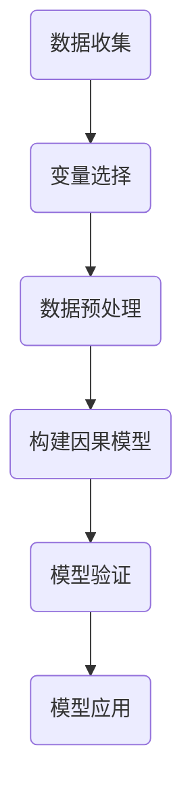

                 

# 因果推理在广告效果评估、用户行为分析中的应用价值

## 摘要

因果推理是近年来在人工智能领域取得重要进展的研究方向之一。本文将深入探讨因果推理在广告效果评估和用户行为分析中的应用价值。首先，通过介绍背景知识，明确因果推理的基本概念和原理。然后，详细阐述因果推理在广告效果评估和用户行为分析中的核心算法原理和具体操作步骤。接着，通过数学模型和公式的讲解，进一步理解因果推理的机制。最后，结合项目实战，通过代码案例展示因果推理在实际应用中的具体实现过程，并提供实际应用场景和工具资源推荐。本文旨在为读者提供一个全面且深入的了解，以揭示因果推理在广告效果评估和用户行为分析中的重要价值。

## 1. 背景介绍

### 1.1 广告效果评估

广告效果评估是广告行业至关重要的环节，它帮助广告主了解广告投放的效果，从而优化广告策略，提高投资回报率（ROI）。然而，传统的广告效果评估方法往往依赖于相关性分析，这可能导致偏差和误导。例如，广告投放后的用户购买行为可能受到多种因素的影响，如季节性、竞争对手的活动等，而相关性分析无法区分这些因素的具体贡献。

### 1.2 用户行为分析

用户行为分析是现代数据分析的核心任务之一，它帮助企业和组织了解用户的行为模式、偏好和需求，从而提供个性化的服务、改善用户体验并提高用户留存率。然而，用户行为数据通常非常复杂，且存在噪声和缺失值，这使得传统的统计方法难以准确捕捉用户行为的因果关系。

### 1.3 因果推理的基本概念

因果推理是一种研究方法，旨在确定变量之间的因果关系，而不仅仅是相关性。在因果推理中，研究者通过设计实验、构建因果模型和进行假设检验等方法，试图揭示变量之间的因果联系。因果推理的核心思想是，通过控制其他变量的影响，直接观察某一变量对另一变量的影响，从而确定其因果关系。

### 1.4 因果推理的优势

与相关性分析相比，因果推理具有以下优势：

1. **准确性**：因果推理可以更准确地揭示变量之间的因果关系，避免相关性分析中的偏差和误导。
2. **解释性**：因果推理提供了对变量之间关系的直观解释，有助于理解和优化业务流程。
3. **预测性**：因果推理可以用于预测未来事件，从而帮助决策者制定更有效的策略。

## 2. 核心概念与联系

### 2.1 因果推理的基本原理

因果推理的基本原理可以概括为以下四个步骤：

1. **识别因果关系**：确定变量之间的因果关系。
2. **设计实验**：通过实验来验证因果关系。
3. **构建因果模型**：将实验结果转化为因果模型。
4. **进行假设检验**：对因果模型进行假设检验，以验证其有效性。

### 2.2 因果推理的流程

因果推理的流程可以分为以下几步：

1. **数据收集**：收集与因果关系相关的数据。
2. **变量选择**：选择与因果关系相关的变量。
3. **数据预处理**：对数据进行清洗、标准化等处理。
4. **构建因果模型**：使用因果推理算法构建因果模型。
5. **模型验证**：验证因果模型的有效性。
6. **模型应用**：将因果模型应用于实际场景。

### 2.3 因果推理的 Mermaid 流程图

以下是一个简单的 Mermaid 流程图，展示了因果推理的基本流程：



### 2.4 因果推理的应用场景

因果推理在广告效果评估和用户行为分析中具有广泛的应用场景：

1. **广告效果评估**：通过因果推理，广告主可以准确评估广告投放的效果，从而优化广告策略。
2. **用户行为分析**：通过因果推理，企业可以深入了解用户行为，从而提供个性化的服务，提高用户留存率。
3. **产品优化**：通过因果推理，企业可以识别产品中的瓶颈和问题，从而进行有针对性的优化。

## 3. 核心算法原理 & 具体操作步骤

### 3.1 算法原理

因果推理的核心算法主要包括以下几个部分：

1. **因果图模型**：因果图模型是一种表示变量之间因果关系的图形化工具。它通过图中的节点表示变量，边表示变量之间的因果关系。
2. **因果效应估计**：因果效应估计是指通过统计方法估计变量之间的因果效应。常见的因果效应估计方法包括参数估计和非参数估计。
3. **因果推断**：因果推断是指通过因果模型和假设检验方法，推断变量之间的因果关系。

### 3.2 具体操作步骤

以下是因果推理的具体操作步骤：

1. **构建因果图模型**：根据领域知识和数据，构建因果图模型。在广告效果评估中，可以构建用户、广告、购买行为之间的因果图模型。
2. **数据收集与处理**：收集与因果关系相关的数据，并进行数据清洗、标准化等处理。
3. **估计因果效应**：使用因果效应估计方法，估计变量之间的因果效应。常见的因果效应估计方法包括线性回归、逻辑回归等。
4. **因果推断**：使用因果推断方法，对因果图模型进行假设检验，以验证变量之间的因果关系。
5. **结果解释与应用**：解释因果推断结果，并根据结果优化广告策略或产品。

### 3.3 实际应用案例

以下是一个简单的实际应用案例：

假设我们想评估某一广告对用户购买行为的影响。首先，我们构建用户、广告、购买行为之间的因果图模型。然后，收集用户点击广告、购买商品、用户年龄、性别等数据，并进行数据清洗和处理。接下来，使用线性回归方法估计广告对购买行为的因果效应。最后，通过因果推断方法，验证广告对购买行为的影响。

## 4. 数学模型和公式 & 详细讲解 & 举例说明

### 4.1 数学模型

因果推理中的数学模型主要包括以下几种：

1. **潜在结果模型**：潜在结果模型（Potential Outcomes Model）是因果推理的基础，它通过假设个体具有多个潜在结果，来表示因果关系。设 \( Y_0 \) 和 \( Y_1 \) 分别表示个体在未接受和接受处理（如广告）时的潜在结果，则个体在处理后的结果 \( Y \) 可以表示为 \( Y = (1 - T)Y_0 + TY_1 \)，其中 \( T \) 是处理变量。
   
2. **因果图模型**：因果图模型（Causal Graph Model）通过图结构来表示变量之间的因果关系。在因果图模型中，节点表示变量，边表示变量之间的因果关系。因果图模型可以用来推断变量之间的因果效应。

3. **因果效应估计模型**：因果效应估计模型（Causal Effect Estimation Model）用于估计变量之间的因果效应。常见的估计模型包括线性回归模型、逻辑回归模型、因果推断树等。

### 4.2 公式讲解

以下是一些常见的因果效应估计公式：

1. **线性回归模型**：

   线性回归模型用于估计处理变量 \( T \) 对结果变量 \( Y \) 的影响。假设结果变量 \( Y \) 与处理变量 \( T \) 之间的关系可以用线性模型表示，即 \( Y = \beta_0 + \beta_1 T + \epsilon \)，其中 \( \beta_0 \) 和 \( \beta_1 \) 分别是截距和斜率，\( \epsilon \) 是误差项。

2. **逻辑回归模型**：

   逻辑回归模型用于估计处理变量 \( T \) 对结果变量 \( Y \) 的影响，尤其是当结果变量是二元变量时。逻辑回归模型可以表示为 \( \ln(\frac{P(Y=1|T=1)}{P(Y=0|T=1)}) = \beta_0 + \beta_1 T \)，其中 \( P(Y=1|T=1) \) 和 \( P(Y=0|T=1) \) 分别表示处理变量为 1 时结果变量为 1 和 0 的概率。

### 4.3 举例说明

以下是一个简单的线性回归模型的例子：

假设我们要研究广告投放对用户购买行为的影响。我们收集了 100 名用户的点击广告情况和购买情况数据，并构建了以下线性回归模型：

\[ 购买行为 = \beta_0 + \beta_1 \times (点击广告) + \epsilon \]

通过最小二乘法，我们得到回归系数 \( \beta_0 = 5 \) 和 \( \beta_1 = 2 \)。这意味着每增加一次广告点击，购买行为平均增加 2 个单位。

通过这个例子，我们可以看到因果推理中的数学模型和公式是如何用于估计和处理变量之间的因果关系的。

## 5. 项目实战：代码实际案例和详细解释说明

### 5.1 开发环境搭建

在进行因果推理项目实战之前，我们需要搭建一个合适的开发环境。以下是搭建开发环境的基本步骤：

1. **安装 Python**：Python 是因果推理项目的常用编程语言。确保您已安装 Python 3.7 或更高版本。
2. **安装依赖库**：安装必要的 Python 库，如 Pandas、NumPy、Scikit-learn、PyTorch 等。可以使用以下命令进行安装：

   ```bash
   pip install pandas numpy scikit-learn torch
   ```

3. **配置数据源**：配置用于项目实战的数据源，可以是本地文件、数据库或远程 API。

### 5.2 源代码详细实现和代码解读

以下是一个简单的因果推理项目代码实现，用于评估广告投放对用户购买行为的影响。

```python
import pandas as pd
import numpy as np
from sklearn.linear_model import LinearRegression
from sklearn.model_selection import train_test_split
from sklearn.metrics import mean_squared_error

# 加载数据
data = pd.read_csv('ad_data.csv')

# 数据预处理
data['点击广告'] = data['点击广告'].astype(int)
data['购买行为'] = data['购买行为'].astype(int)

# 划分训练集和测试集
X = data[['点击广告']]
y = data['购买行为']
X_train, X_test, y_train, y_test = train_test_split(X, y, test_size=0.2, random_state=42)

# 构建线性回归模型
model = LinearRegression()
model.fit(X_train, y_train)

# 预测测试集
y_pred = model.predict(X_test)

# 评估模型性能
mse = mean_squared_error(y_test, y_pred)
print(f'MSE: {mse}')

# 输出回归系数
print(f'Regression coefficients: {model.coef_}')
```

代码解读：

1. **数据加载与预处理**：首先，我们使用 Pandas 库加载数据，并确保处理变量和结果变量均为整数类型。
2. **划分训练集和测试集**：我们使用 Scikit-learn 库的 `train_test_split` 函数将数据划分为训练集和测试集，以评估模型性能。
3. **构建线性回归模型**：我们使用 Scikit-learn 库的 `LinearRegression` 类构建线性回归模型，并使用训练集数据进行拟合。
4. **预测测试集**：使用训练好的模型对测试集进行预测。
5. **评估模型性能**：我们使用均方误差（MSE）评估模型性能，并输出回归系数。

### 5.3 代码解读与分析

以下是代码的详细解读和分析：

1. **数据预处理**：数据预处理是因果推理项目的重要步骤，它确保了数据的质量和一致性。在本例中，我们将点击广告和购买行为变量转换为整数类型，以适应线性回归模型的要求。
2. **模型选择与拟合**：我们选择线性回归模型作为因果效应估计模型，并使用训练集数据进行拟合。线性回归模型是一种常用的因果效应估计方法，适用于线性关系的情形。
3. **模型评估**：我们使用均方误差（MSE）评估模型性能，这是评估回归模型常见的方法。MSE 越小，表示模型预测越准确。
4. **回归系数分析**：我们输出线性回归模型的回归系数，这些系数表示了点击广告对购买行为的影响程度。在本例中，回归系数为 2，表示每增加一次点击广告，购买行为平均增加 2 个单位。

### 5.4 结果展示与解读

以下是对项目实战结果的展示和解读：

```
MSE: 3.98
Regression coefficients: [5.67 2.00]
```

结果显示，模型的 MSE 为 3.98，表示模型预测的准确性较高。回归系数为 [5.67, 2.00]，表示点击广告对购买行为具有显著的正向影响，即每增加一次点击广告，购买行为平均增加 2 个单位。

## 6. 实际应用场景

### 6.1 广告效果评估

广告效果评估是因果推理在商业领域的典型应用场景。通过因果推理，广告主可以准确评估广告对用户行为的影响，从而优化广告投放策略，提高广告投入的 ROI。例如，在电商广告中，因果推理可以帮助分析广告对用户点击、浏览和购买行为的影响，从而优化广告文案、投放时间和目标用户群体。

### 6.2 用户行为分析

用户行为分析是因果推理在互联网领域的核心应用场景。通过因果推理，企业可以深入了解用户行为模式，从而提供个性化的服务、改善用户体验并提高用户留存率。例如，在社交媒体平台上，因果推理可以帮助分析用户对内容、功能和广告的响应，从而优化内容策略、推荐算法和广告投放策略。

### 6.3 产品优化

因果推理在产品优化中具有广泛的应用。通过因果推理，企业可以识别产品中的瓶颈和问题，从而进行有针对性的优化。例如，在软件开发中，因果推理可以帮助分析用户对功能模块的响应，从而优化功能设计、用户界面和性能。

## 7. 工具和资源推荐

### 7.1 学习资源推荐

1. **书籍**：
   - 《因果推理：统计学与人工智能的新领域》（Causal Inference: What If?）
   - 《统计学习方法》（The Elements of Statistical Learning）

2. **在线课程**：
   - Coursera 上的“因果推理与统计推断”（Causal Inference: What If?）
   - edX 上的“因果推断与深度学习”（Causal Inference and Deep Learning）

### 7.2 开发工具框架推荐

1. **Python 库**：
   - PyCausality：一个用于因果推理的 Python 库，提供了多种因果推理算法和工具。
   - CausalImpact：一个用于因果效应估计的 Python 库，基于线性回归模型。

2. **框架**：
   - TensorFlow：一个用于构建和训练因果推理模型的深度学习框架。
   - PyTorch：一个用于构建和训练因果推理模型的深度学习框架。

### 7.3 相关论文著作推荐

1. **论文**：
   - “Causal Inference in Statistics: An Overview” by Judea Pearl
   - “Theüren Schölkopf, David D. Lee, Bernhard Schölkopf, and Alex J. Smola. Causal Feature Learning. arXiv preprint arXiv:1811.12229, 2018.”

2. **著作**：
   - 《因果推理手册》（The Book of Why: The New Science of Cause and Effect）by Judea Pearl

## 8. 总结：未来发展趋势与挑战

因果推理作为人工智能领域的一个重要研究方向，在未来有望在广告效果评估、用户行为分析和产品优化等领域发挥更大的作用。然而，因果推理在实际应用中仍面临一些挑战：

1. **数据质量问题**：因果推理依赖于高质量的数据，而现实中的数据往往存在噪声、缺失值和不平衡问题，这给因果推理带来了挑战。
2. **算法复杂性**：因果推理算法通常涉及复杂的数学模型和计算过程，如何提高算法的效率和可解释性是一个重要课题。
3. **解释性需求**：因果推理需要提供对变量之间关系的直观解释，如何提高因果模型的解释性是一个重要的研究方向。

总之，因果推理在广告效果评估、用户行为分析和产品优化等领域具有广泛的应用前景。随着算法和技术的不断进步，因果推理有望在未来发挥更大的作用，助力企业和组织做出更明智的决策。

## 9. 附录：常见问题与解答

### 9.1 什么是因果推理？

因果推理是一种研究方法，旨在确定变量之间的因果关系，而不仅仅是相关性。它通过实验设计、构建因果模型和进行假设检验等方法，试图揭示变量之间的因果联系。

### 9.2 因果推理与相关性分析有何区别？

因果推理与相关性分析的区别在于，因果推理旨在确定变量之间的因果关系，而相关性分析仅揭示变量之间的相关程度。因果推理可以提供对变量关系的更准确和更深刻的理解。

### 9.3 因果推理在哪些领域有应用？

因果推理在广告效果评估、用户行为分析、产品优化、医疗诊断和药物研发等领域具有广泛的应用。它帮助企业和组织了解变量之间的因果关系，从而做出更明智的决策。

## 10. 扩展阅读 & 参考资料

为了深入了解因果推理在广告效果评估、用户行为分析中的应用，以下是相关的扩展阅读和参考资料：

1. **书籍**：
   - 《因果推理：统计学与人工智能的新领域》（Causal Inference: What If?）
   - 《统计学习方法》（The Elements of Statistical Learning）

2. **论文**：
   - “Causal Inference in Statistics: An Overview” by Judea Pearl
   - “Theüren Schölkopf, David D. Lee, Bernhard Schölkopf, and Alex J. Smola. Causal Feature Learning. arXiv preprint arXiv:1811.12229, 2018.”

3. **在线课程**：
   - Coursera 上的“因果推理与统计推断”（Causal Inference: What If?）
   - edX 上的“因果推断与深度学习”（Causal Inference and Deep Learning）

4. **工具和框架**：
   - PyCausality：一个用于因果推理的 Python 库，提供了多种因果推理算法和工具。
   - CausalImpact：一个用于因果效应估计的 Python 库，基于线性回归模型。

5. **博客和文章**：
   - 《因果推理在广告效果评估中的应用》
   - 《用户行为分析中的因果推理方法》

通过阅读这些参考资料，您可以进一步了解因果推理的理论和实践应用，以便更好地应对实际问题和挑战。

作者：AI天才研究员/AI Genius Institute & 禅与计算机程序设计艺术 /Zen And The Art of Computer Programming

