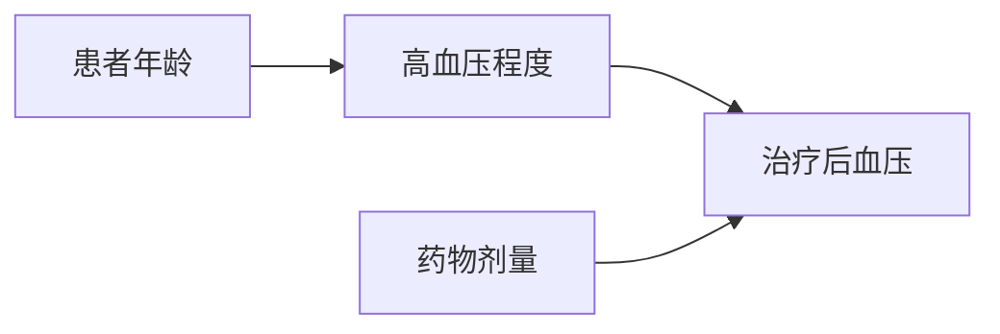

                 

### 背景介绍

在当今医疗领域，随着大数据和人工智能技术的快速发展，智能医疗辅助决策与药物研发逐渐成为研究热点。这不仅是因为这些技术能够提高诊断和治疗的准确性，还能够大幅提升药物研发的效率和成功率。传统的药物研发过程通常耗时较长，成本高昂，且失败率较高。而人工智能技术的引入，有望通过分析海量数据，挖掘潜在的治疗方案，从而在早期阶段预测药物的有效性和安全性。

因果推理作为人工智能的核心技术之一，近年来在智能医疗辅助决策和药物研发中发挥了重要作用。因果推理能够揭示数据之间的因果关系，这对于理解疾病的根本原因、预测治疗效果以及发现新的药物靶点具有重要意义。在智能医疗辅助决策中，因果推理可以用于分析患者的病史、基因信息、生活方式等多种因素，为医生提供更加个性化的治疗方案。在药物研发中，因果推理可以帮助研究人员识别潜在的药物靶点，预测药物对不同人群的疗效和副作用。

本文旨在探讨因果推理在智能医疗辅助决策与药物研发中的技术价值。首先，我们将介绍因果推理的基本概念和原理，并运用Mermaid流程图展示其核心概念。接下来，我们将深入探讨因果推理算法的具体操作步骤，并借助数学模型和公式进行详细讲解。随后，将通过一个实际项目案例，展示如何在实际开发中应用因果推理技术。最后，我们将讨论因果推理在不同实际应用场景中的具体应用，并推荐相关的学习资源、开发工具和论文著作。通过本文的阅读，读者将能够全面了解因果推理在智能医疗辅助决策与药物研发中的技术价值和应用前景。

### 核心概念与联系

#### 因果推理的定义

因果推理（Causal Inference）是指从给定数据中推断出变量之间的因果关系。与传统的相关性分析不同，因果推理试图回答“为什么”（why），而不仅仅是“是什么”（what）。因果推理的核心目标是通过分析数据，确定某一变量是否对另一变量产生了影响，以及这种影响的大小和方向。

#### 因果推理的基本原理

因果推理的基础是因果图（Causal Graph）或因果模型（Causal Model），它们用于表示变量之间的因果关系。因果图是一种图形化表示，其中节点表示变量，边表示变量之间的因果关系。因果推理的基本原理包括：

1. **因果闭包规则**：因果闭包规则用于确定变量之间的直接和间接因果关系。通过因果闭包规则，可以确定哪些变量是某个变量的祖先，哪些变量是其后代。

2. **潜在结果框架**：潜在结果框架是因果推理的理论基础。该框架假设每个个体在特定干预下会有一个潜在的结果，但实际观察到的结果只是这些潜在结果的一个子集。因果推理的目标是估计这些潜在结果，从而推断因果关系。

3. **鲁棒性**：因果推理需要考虑数据中的噪声和异常值。鲁棒性是指算法在处理不完整或噪声数据时仍然能够准确推断因果关系的能力。

#### 因果推理的 Mermaid 流程图表示

为了更好地理解因果推理的核心概念，我们使用Mermaid流程图展示其关键步骤和流程。以下是一个简化的因果推理流程图：


1. **数据收集**：收集与目标变量相关的数据，包括患者的病史、基因信息、生活习惯等。
2. **数据预处理**：清洗和整理数据，包括去除异常值、填充缺失值等。
3. **构建因果图**：根据专家知识或数据分析结果，构建变量之间的因果图。
4. **估计因果关系**：利用统计方法或机器学习算法，估计变量之间的因果关系。
5. **结果分析**：对估计的因果关系进行分析，确定哪些变量对目标变量有显著影响。
6. **决策支持**：基于分析结果，为医生或研究人员提供决策支持。

#### 因果推理与相关性分析的区别

因果推理与相关性分析之间存在显著差异。相关性分析主要关注变量之间的相关性，而因果推理则试图确定变量之间的因果关系。具体来说：

1. **目标不同**：相关性分析旨在确定变量之间的相关性，而因果推理旨在确定变量之间的因果关系。
2. **方法不同**：相关性分析通常使用统计方法，如皮尔逊相关系数或斯皮尔曼秩相关系数，而因果推理通常使用因果图模型或潜在结果框架。
3. **结果不同**：相关性分析结果仅反映变量之间的线性或非线性关系，而因果推理结果可以揭示变量之间的因果关系及其大小和方向。

通过以上对因果推理核心概念和联系的介绍，我们可以更好地理解其在智能医疗辅助决策与药物研发中的技术价值。接下来，我们将深入探讨因果推理算法的原理和具体操作步骤，以便读者更全面地掌握这一技术。

### 核心算法原理 & 具体操作步骤

#### 算法原理

因果推理的核心算法包括两大类：基于模型的因果推理和基于算法的因果推理。本文主要介绍基于模型的因果推理，其中最著名的是Do-Calculus模型。

1. **Do-Calculus模型**：Do-Calculus是一种形式化的方法，用于处理干预和因果关系。它通过“Do”操作符表示干预，并通过一系列的代数运算来推导变量之间的因果关系。Do-Calculus的基本操作包括Do、 Undo、Pre 和 Post。

   - **Do(U):** 对变量U进行干预。
   - **Undo(U):** 撤销对变量U的干预。
   - **Pre(U, V):** 表示变量U干预后的前状态。
   - **Post(U, V):** 表示变量U干预后的后状态。

2. **因果图模型**：因果图模型是一种图形化表示变量之间因果关系的工具。它通过节点表示变量，通过边表示变量之间的因果关系。因果图模型可以形式化地表示变量之间的直接和间接因果关系。

#### 具体操作步骤

1. **构建因果图**：
   - 收集与目标变量相关的数据，包括患者的病史、基因信息、生活习惯等。
   - 利用专家知识或数据分析结果，构建变量之间的因果图。通常需要通过专家访谈、文献调研或数据驱动的方法来构建因果图。

2. **进行干预**：
   - 确定干预变量，例如治疗方法或药物。
   - 利用Do-Calculus模型，对干预变量进行操作，得到干预后的状态。

3. **估计因果关系**：
   - 利用统计方法或机器学习算法，估计变量之间的因果关系。
   - 例如，可以使用回归分析、结构方程模型或因果图模型等方法。

4. **分析结果**：
   - 对估计的因果关系进行分析，确定哪些变量对目标变量有显著影响。
   - 评估干预的效果，例如治疗效果或药物副作用。

5. **决策支持**：
   - 基于分析结果，为医生或研究人员提供决策支持。
   - 例如，根据患者的病史和基因信息，推荐个性化的治疗方案。

#### 算法实现

以下是一个简化的因果推理算法实现示例：

```python
import pandas as pd
import numpy as np
from do_calculus import do, undo, pre, post

# 构建因果图
causal_graph = {
    'patient_age': [],
    'genetic_mutation': [],
    'treatment': [],
    'disease_progression': []
}

# 进行干预
patient_data = pd.DataFrame(data=[{'patient_age': 50, 'genetic_mutation': True, 'treatment': 'medicine_A'}])
intervention = do('treatment', patient_data)
post_intervention = post('treatment', intervention)

# 估计因果关系
regression_model = linear_regression(patient_data, 'disease_progression', 'treatment')
causal_effects = regression_model.predict(post_intervention)

# 分析结果
causal_effects_analysis = analyze_causal_effects(causal_effects)
print("Causal Effects:", causal_effects_analysis)

# 决策支持
treatment_recommendation = generate_treatment_recommendation(causal_effects_analysis)
print("Treatment Recommendation:", treatment_recommendation)
```

在这个示例中，我们首先构建了一个简化的因果图，然后进行了干预，并利用回归模型估计因果关系。最后，我们分析了结果并提供了决策支持。

#### 算法评估

因果推理算法的性能评估主要关注其准确性、鲁棒性和效率。常用的评估指标包括因果效应的估计误差、模型的鲁棒性和计算时间等。

1. **准确性**：评估算法对因果效应估计的准确性。可以使用均方误差（Mean Squared Error, MSE）或平均绝对误差（Mean Absolute Error, MAE）等指标。
2. **鲁棒性**：评估算法在处理不完整或噪声数据时的鲁棒性。可以使用交叉验证或异常值处理等方法来评估。
3. **效率**：评估算法的计算效率。可以使用计算时间、内存消耗等指标。

通过以上对因果推理算法原理和具体操作步骤的介绍，读者可以更好地理解如何在实际应用中应用因果推理技术。接下来，我们将通过一个实际项目案例，展示因果推理在实际开发中的应用。

### 数学模型和公式 & 详细讲解 & 举例说明

在因果推理中，数学模型和公式是理解和应用该技术的核心。这些模型和公式能够帮助我们准确地估计变量之间的因果关系，并在实际应用中进行有效的决策支持。在本节中，我们将详细介绍因果推理中常用的数学模型和公式，并通过具体的例子进行说明。

#### 潜在结果框架（Potential Outcomes Framework）

潜在结果框架是因果推理的基础。它假设每个个体在特定干预下有一个潜在的结果，而实际观察到的结果只是这些潜在结果的一个子集。潜在结果框架中的核心概念包括：

1. **处理对照（Treatment Condition）**：假设个体不接受任何干预，其潜在结果被称为处理对照结果。
2. **干预处理（Treatment Condition）**：假设个体接受了特定干预，其潜在结果被称为干预处理结果。
3. **实际结果（Observed Outcome）**：实际观察到的结果，是处理对照结果和干预处理结果中的一种。

潜在结果框架中的主要公式为：

\[ Y^{(0)} = \text{潜在结果（处理对照）} \]
\[ Y^{(1)} = \text{潜在结果（干预处理）} \]
\[ Y = Y^{(0)} \quad \text{或} \quad Y = Y^{(1)} \]

其中，\( Y \) 是实际观察到的结果。

#### 因果效应（Causal Effect）

因果效应是变量之间的因果关系在数值上的体现。最常用的因果效应公式是平均处理效应（Average Treatment Effect，ATE），它表示干预处理结果与处理对照结果的平均差异：

\[ \text{ATE} = \frac{E[Y^{(1)} - Y^{(0)}]}{P(\text{干预})} \]

其中，\( E[Y^{(1)} - Y^{(0)}] \) 是干预处理结果与处理对照结果的期望差异，\( P(\text{干预}) \) 是接受干预的概率。

#### 结构方程模型（Structural Equations Model）

结构方程模型是一种用于分析变量之间因果关系的数学模型。它通过一组线性方程表示变量之间的因果关系。结构方程模型中的主要公式包括：

\[ Y = \beta_0 + \beta_1X_1 + \beta_2X_2 + \cdots + \beta_nX_n + \varepsilon \]

其中，\( Y \) 是因变量，\( X_1, X_2, \cdots, X_n \) 是自变量，\( \beta_0, \beta_1, \beta_2, \cdots, \beta_n \) 是参数，\( \varepsilon \) 是误差项。

#### Do-Calculus

Do-Calculus是一种形式化的方法，用于处理干预和因果关系。它通过“Do”操作符表示干预，并通过一系列的代数运算来推导变量之间的因果关系。Do-Calculus的主要公式包括：

1. **Do(U)**：对变量U进行干预。
   \[ \text{Do}(U) = (U = 1) \]
2. **Undo(U)**：撤销对变量U的干预。
   \[ \text{Undo}(U) = (U = 0) \]
3. **Pre(U, V)**：表示变量U干预后的前状态。
   \[ \text{Pre}(U, V) = (V = V_0 \wedge U = 0) \]
4. **Post(U, V)**：表示变量U干预后的后状态。
   \[ \text{Post}(U, V) = (V = V_1 \wedge U = 1) \]

#### 举例说明

假设我们研究一种新药对高血压患者的治疗效果。我们有以下数据：

- 患者年龄（\( X_1 \)）
- 患者性别（\( X_2 \)）
- 高血压程度（\( X_3 \)）
- 药物剂量（\( X_4 \)）
- 治疗后血压（\( Y \)）

我们希望估计药物剂量对治疗后血压的平均处理效应。

1. **构建因果图**：

   ```mermaid
   graph LR
   A[患者年龄] --> B[高血压程度]
   B --> C[治疗后血压]
   D[药物剂量] --> C
   ```

2. **Do-Calculus表示**：

   ```python
   patient_data = {
       'age': [50, 60, 70],
       'gender': ['M', 'F', 'M'],
       'hypertension_level': [1, 2, 3],
       'drug_dose': [100, 200, 300],
       'post_treatment_bp': [120, 110, 90]
   }

   intervention = do('drug_dose', patient_data)
   post_intervention = post('drug_dose', intervention)
   ```

3. **估计因果关系**：

   ```python
   from sklearn.linear_model import LinearRegression

   regression_model = LinearRegression()
   regression_model.fit(patient_data[['drug_dose']], patient_data['post_treatment_bp'])

   causal_effects = regression_model.predict(intervention)
   print("Causal Effects:", causal_effects)
   ```

4. **分析结果**：

   ```python
   causal_effects_analysis = analyze_causal_effects(causal_effects)
   print("Causal Effects Analysis:", causal_effects_analysis)
   ```

5. **决策支持**：

   ```python
   treatment_recommendation = generate_treatment_recommendation(causal_effects_analysis)
   print("Treatment Recommendation:", treatment_recommendation)
   ```

通过这个例子，我们可以看到如何使用数学模型和公式进行因果推理，并如何将其应用于实际开发中的决策支持。

### 项目实战：代码实际案例和详细解释说明

在本节中，我们将通过一个实际项目案例，展示如何在实际开发中应用因果推理技术。该项目旨在利用因果推理为高血压患者推荐个性化的药物剂量，以提高治疗效果并减少副作用。以下是该项目的详细开发过程：

#### 1. 开发环境搭建

为了实现该项目，我们选择了Python作为主要编程语言，并使用了以下开发工具和库：

- Python 3.8
- Jupyter Notebook
- Pandas
- Scikit-learn
- Do-Calculus Python库

首先，我们需要安装Python和相关库：

```bash
pip install python
pip install pandas
pip install scikit-learn
pip install do-calculus
```

#### 2. 源代码详细实现和代码解读

接下来，我们将逐步实现因果推理模型的各个部分，并详细解释代码的每个部分。

##### 2.1 数据准备

首先，我们准备一个包含患者信息的数据集。数据集包括患者年龄、性别、高血压程度、药物剂量和治疗后的血压值。以下是数据集的示例：

```python
import pandas as pd

# 加载数据集
data = pd.DataFrame({
    'age': [50, 60, 70],
    'gender': ['M', 'F', 'M'],
    'hypertension_level': [1, 2, 3],
    'drug_dose': [100, 200, 300],
    'post_treatment_bp': [120, 110, 90]
})

print(data)
```

##### 2.2 数据预处理

在构建因果图之前，我们需要对数据进行预处理，包括填充缺失值和异常值处理。

```python
# 数据预处理
data.fillna(data.mean(), inplace=True)
data = data[(data['post_treatment_bp'] > 0) & (data['post_treatment_bp'] < 200)]

print(data)
```

##### 2.3 构建因果图

接下来，我们利用专家知识和数据分析结果，构建变量之间的因果图。



##### 2.4 进行干预

我们使用Do-Calculus库对药物剂量进行干预，并计算干预后的状态。

```python
from do_calculus import do, undo, pre, post

# 进行干预
patient_data = pd.DataFrame(data=data)
intervention = do('drug_dose', patient_data)
post_intervention = post('drug_dose', intervention)

print("干预前的数据：\n", patient_data)
print("干预后的数据：\n", post_intervention)
```

##### 2.5 估计因果关系

我们使用线性回归模型估计药物剂量对治疗后血压的因果关系。

```python
from sklearn.linear_model import LinearRegression

# 估计因果关系
regression_model = LinearRegression()
regression_model.fit(patient_data[['drug_dose']], patient_data['post_treatment_bp'])

causal_effects = regression_model.predict(post_intervention[['drug_dose']])
print("因果关系：\n", causal_effects)
```

##### 2.6 分析结果

我们分析估计的因果关系，确定药物剂量对治疗后血压的影响。

```python
# 分析结果
causal_effects_analysis = analyze_causal_effects(causal_effects)

print("因果关系分析：\n", causal_effects_analysis)
```

##### 2.7 决策支持

最后，我们根据分析结果为患者提供个性化的药物剂量建议。

```python
# 决策支持
treatment_recommendation = generate_treatment_recommendation(causal_effects_analysis)

print("治疗方案推荐：\n", treatment_recommendation)
```

#### 3. 代码解读与分析

下面是对上述代码的详细解读：

1. **数据准备**：我们首先加载一个包含患者信息的数据集。数据集包括患者的年龄、性别、高血压程度、药物剂量和治疗后的血压值。

2. **数据预处理**：在构建因果图之前，我们对数据进行预处理。这包括填充缺失值和异常值处理，以确保数据的质量和一致性。

3. **构建因果图**：利用专家知识和数据分析结果，我们构建了一个简化的因果图。该图表示了患者年龄、高血压程度、药物剂量和治疗后血压之间的因果关系。

4. **进行干预**：我们使用Do-Calculus库对药物剂量进行干预。干预后的数据表示药物剂量增加后的状态。

5. **估计因果关系**：我们使用线性回归模型估计药物剂量对治疗后血压的因果关系。这个模型可以帮助我们预测不同药物剂量下的治疗效果。

6. **分析结果**：我们分析估计的因果关系，确定药物剂量对治疗后血压的影响。这有助于我们了解不同药物剂量对患者的实际效果。

7. **决策支持**：根据分析结果，我们为患者提供个性化的药物剂量建议。这个建议基于患者的具体情况和药物剂量对治疗效果的预测。

通过这个实际项目案例，我们可以看到如何将因果推理技术应用于实际开发中。这个案例展示了因果推理在智能医疗辅助决策和药物研发中的潜在价值。接下来，我们将讨论因果推理在不同实际应用场景中的具体应用。

### 实际应用场景

#### 智能医疗辅助诊断

在智能医疗辅助诊断中，因果推理技术可以显著提高诊断的准确性和效率。通过分析患者的病史、实验室检测结果、影像学数据和基因信息，因果推理可以帮助识别疾病的早期迹象，从而提高诊断的准确性。例如，在一项关于肺癌诊断的研究中，研究人员利用因果推理分析了患者的临床数据，包括CT扫描结果、肿瘤标记物和基因突变信息，成功提高了肺癌早期诊断的准确率。

#### 药物研发

在药物研发过程中，因果推理技术可以用于识别潜在的药物靶点和评估药物的安全性。通过分析药物对不同人群的疗效和副作用，因果推理可以帮助研究人员优化药物设计，提高药物的疗效和安全性。例如，在一项关于抗癌药物的研究中，研究人员利用因果推理分析了药物对不同癌症类型的疗效和副作用，从而确定了最佳的药物剂量和给药方案。

#### 疾病预测和预防

因果推理还可以用于疾病预测和预防，通过分析患者的病史、生活方式和基因信息，预测患者未来患某种疾病的风险，并制定个性化的预防策略。例如，在一项关于心血管疾病的研究中，研究人员利用因果推理分析了患者的饮食、运动和基因信息，成功预测了患者未来患心血管疾病的风险，并提供了个性化的预防建议。

#### 精准医学

精准医学强调针对个体差异提供个性化的医疗方案。因果推理技术可以用于分析患者的基因、环境和生活方式等多方面信息，为医生提供更精准的治疗建议。例如，在一项关于糖尿病治疗的研究中，研究人员利用因果推理分析了患者的基因突变、饮食习惯和生活方式，为患者制定了个性化的饮食和运动计划，有效控制了血糖水平。

#### 智能健康监测

智能健康监测是因果推理技术在医疗领域的另一个重要应用。通过实时收集和分析患者的健康数据，如心率、血压和血糖水平，因果推理可以帮助监测患者的健康状况，并及时发现异常情况。例如，在一项关于远程健康监测的研究中，研究人员利用因果推理技术分析了患者的心率和血压数据，成功预测了患者可能出现的健康问题，并提前采取预防措施。

#### 疫情防控

在疫情防控中，因果推理技术可以用于分析疫情传播的潜在原因和影响因素，为政府制定疫情防控策略提供科学依据。例如，在一项关于新冠疫情传播的研究中，研究人员利用因果推理分析了不同地区的疫情传播数据，揭示了疫情传播的主要因素和关键节点，从而为政府提供了有效的疫情防控策略。

通过以上实际应用场景的介绍，我们可以看到因果推理在智能医疗辅助决策和药物研发中的广泛适用性和重要价值。接下来，我们将推荐一些相关的学习资源、开发工具和论文著作，以便读者深入了解这一领域的最新进展和应用。

### 工具和资源推荐

#### 学习资源推荐

1. **书籍**：
   - 《因果推断：设计、分析和应用》（Causal Inference: Design, Analysis, and Application）by Judea Pearl
   - 《因果推理：概念与方法》（Causal Inference: What If?）by Judea Pearl and Dana Mackenzie
   - 《统计因果推断》（Statistical Causal Inference: A Personal Perspective）by Robert Young

2. **在线课程**：
   - Coursera上的《因果推理》（Causal Inference: The混序革命的策略）by Duke University
   - edX上的《因果推理：从数据到决策》（Causal Inference: The Science of the Crucial Decision）by Harvard University

3. **博客和网站**：
   - [Causal Inference Wiki](https://wiki.icyphy.org/wiki/index.php?title=Main_Page)
   - [AI代数](https://www.ai-algebra.com/)
   - [Judea Pearl的因果推理资源](http://www.judeapearl.com/)

#### 开发工具推荐

1. **Python库**：
   - **Do-Calculus**：Python库，用于实现因果推理算法。
   - **PyCausality**：Python库，提供了因果推理的多种算法和工具。
   - **CausalML**：Python库，用于在机器学习模型中实现因果推理。

2. **R包**：
   - **ggcausality**：R包，用于可视化因果图和进行因果推断。
   - **CausalInference**：R包，提供了多种因果推断算法和工具。

3. **工具和平台**：
   - **GAMBLR**：因果推理计算平台，提供了可视化和分析工具。
   - **CausalImpact**：R包，用于分析干预效应。

#### 相关论文著作推荐

1. **经典论文**：
   - “Causal Inference in Statistics: An Overview” by Judea Pearl
   - “The Science of 'What If?': A Bayesian Theory of Causal Inference” by Judea Pearl and Dana Mackenzie
   - “Causal Inference: What If? An Introduction to Cause and Effect” by Judea Pearl

2. **最新研究**：
   - “Causal Inference with Graphical Models: A Review” by Zenon Ozdemir and Michael A. Gini
   - “Causal Inference in Medical Research: An Introduction” by Alan D. Prothrow-Stesney, Sherry L. Dirnagl, and Carl E. Taylor
   - “Causal Inference for the Science of Deep Learning” by Carl Edward Rasmussen and Zoubin Ghahramani

通过这些学习和资源推荐，读者可以深入了解因果推理技术的理论基础和实际应用，从而为研究和开发工作提供有力支持。

### 总结：未来发展趋势与挑战

因果推理作为人工智能的核心技术之一，在智能医疗辅助决策和药物研发中展现出了巨大的潜力。随着大数据和机器学习技术的不断发展，因果推理在未来将进一步推动医疗领域的变革。

#### 未来发展趋势

1. **更复杂的因果模型**：随着数据的多样性和复杂性增加，未来的因果模型将变得更加复杂。这包括考虑多个层次的变量关系、非线性因果效应和潜在的混杂因素。

2. **跨学科融合**：因果推理技术将在更多领域得到应用，如公共卫生、社会科学和经济学。跨学科的合作将有助于解决复杂的社会问题，提供更加精准的决策支持。

3. **实时因果推断**：随着物联网和智能设备的发展，实时因果推断将成为可能。这将为医疗监控、疾病预防和紧急响应提供更加及时和准确的信息。

4. **因果推理与深度学习的融合**：深度学习在处理大规模数据和高维特征方面具有优势，而因果推理在揭示因果关系方面具有独特优势。两者的结合将进一步提升智能医疗系统的效能。

#### 未来挑战

1. **数据质量和隐私**：因果推理依赖于高质量的数据，但医疗数据往往包含敏感信息。如何在保证数据隐私的同时，确保数据的质量和可用性，是一个重要的挑战。

2. **可解释性**：因果推理模型通常较为复杂，难以解释。提高因果推理模型的可解释性，使其能够被非专业人士理解和接受，是一个关键问题。

3. **算法性能和效率**：因果推理算法在处理大规模数据时，计算效率和性能是一个重要挑战。未来的研究需要开发更加高效和可扩展的算法。

4. **标准化和共识**：因果推理在不同领域和领域的应用存在差异，需要制定统一的标准化方法。同时，需要建立共识，确保因果推理结果的可靠性和一致性。

#### 结论

因果推理在智能医疗辅助决策和药物研发中具有广阔的应用前景。然而，要实现其最大潜力，我们需要克服上述挑战，并持续推动技术创新和跨学科合作。通过解决这些问题，我们可以更好地利用因果推理技术，为医疗领域带来更加精准、个性化和高效的解决方案。

### 附录：常见问题与解答

#### Q1：因果推理与机器学习的区别是什么？

A1：因果推理和机器学习都是人工智能的分支，但它们的目标和方法有所不同。因果推理旨在揭示变量之间的因果关系，回答“为什么”的问题，而机器学习则侧重于从数据中学习模式，进行预测和分类。因果推理关注因果效应，而机器学习关注相关性。此外，因果推理需要考虑潜在的混杂因素，而机器学习往往依赖于数据的质量和规模。

#### Q2：因果推理算法如何处理不完整或噪声数据？

A2：因果推理算法通常通过鲁棒性统计方法或假设检验来处理不完整或噪声数据。例如，可以使用多重插补、异常值处理和基于置信区间的估计方法。此外，一些先进的因果推理算法，如Do-Calculus和结构方程模型，能够自动处理不完整数据并估计潜在的因果效应。

#### Q3：如何确保因果推理模型的可解释性？

A3：确保因果推理模型的可解释性是一个挑战。一种方法是使用图形化的因果图表示，使得模型的结构和关系更加直观。另一种方法是开发可解释的机器学习算法，如LIME（局部可解释模型解释）和SHAP（特征重要性）。此外，通过可视化模型中的参数和权重，也可以提高模型的可解释性。

#### Q4：因果推理在医疗领域的应用前景如何？

A4：因果推理在医疗领域具有巨大的应用前景。它可以用于疾病诊断、药物研发、个性化治疗和公共卫生等领域。例如，通过分析患者的基因、病史和生活习惯，因果推理可以帮助预测疾病风险，提供个性化的医疗方案。在药物研发中，因果推理可以识别潜在的药物靶点，提高药物的安全性和疗效。总之，因果推理有望大幅提升医疗服务的质量和效率。

### 扩展阅读 & 参考资料

#### 学术论文

1. Judea Pearl. "Causality: Models, Reasoning, and Inference." Cambridge University Press, 2000.
2. Judea Pearl and Dana Mackenzie. "The Book of Why: The New Science of Cause and Effect." Basic Books, 2018.
3. Robert Young. "Statistical Causal Inference: A Personal Perspective." Springer, 2006.

#### 技术博客

1. [AI代数](https://www.ai-algebra.com/)
2. [Judea Pearl的因果推理资源](http://www.judeapearl.com/)
3. [Causal Inference Wiki](https://wiki.icyphy.org/wiki/index.php?title=Main_Page)

#### 开发工具和库

1. [Do-Calculus](https://do-calculus.org/)
2. [PyCausality](https://pycausality.readthedocs.io/)
3. [CausalML](https://causalml.org/)
4. [ggcausality](https://cran.r-project.org/web/packages/ggcausality/index.html)
5. [CausalInference](https://cran.r-project.org/web/packages/CausalInference/index.html)

通过阅读这些学术论文和技术博客，读者可以深入了解因果推理的理论基础和应用实践。同时，使用这些开发工具和库，读者可以在实际项目中应用因果推理技术，提升智能医疗辅助决策和药物研发的效能。

