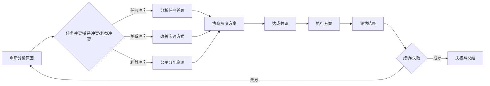

                 

### 背景介绍

在信息技术迅速发展的今天，团队合作已成为推动企业创新和应对市场竞争的关键因素。然而，在团队协作过程中，冲突的出现是不可避免的。无论是技术观点的分歧，还是工作任务的分配不均，甚至是个性差异，都可能引发团队内部的矛盾和摩擦。团队冲突如果不及时处理，会严重影响团队的工作效率和士气，甚至可能导致项目的失败。

本文将围绕团队冲突的解决展开讨论，通过逻辑清晰的分析和推理，探讨从对抗到合作的过程。文章的结构如下：

1. **核心概念与联系**：我们将首先介绍解决团队冲突所需的核心概念，并展示一个简化的 Mermaid 流程图，以帮助读者更好地理解。
2. **核心算法原理与具体操作步骤**：接着，我们将详细解释团队冲突解决方案的基本原理，并提供实际操作步骤。
3. **数学模型和公式**：为了更好地量化团队冲突的影响，我们将介绍相关的数学模型和公式，并通过具体例子进行说明。
4. **项目实战：代码实际案例**：我们将通过一个实际项目的代码实现，展示解决团队冲突的具体方法。
5. **实际应用场景**：接着，我们将讨论团队冲突在不同场景下的应用，并提供相应的解决方案。
6. **工具和资源推荐**：为了帮助读者进一步了解和解决团队冲突，我们将推荐一些学习资源、开发工具和相关的论文著作。
7. **总结：未来发展趋势与挑战**：最后，我们将总结本文的核心内容，并探讨团队冲突解决领域的未来发展趋势和挑战。

通过对这些内容的详细分析和探讨，我们希望读者能够深入了解团队冲突的本质，掌握有效的解决方法，并能够将其应用到实际工作中。让我们一起开始这次探索之旅。

---

## 1. 核心概念与联系

### 冲突类型

在探讨团队冲突解决之前，我们首先需要明确冲突的类型。一般来说，团队冲突可以分为以下几种：

1. **任务冲突**：这种冲突通常发生在团队成员对于任务的理解和执行方式上存在差异时。例如，某个成员可能认为应该优先处理任务A，而另一位成员则认为任务B更为紧急。

2. **关系冲突**：这种冲突源于团队成员之间的个人关系问题，如沟通不畅、误解或个人恩怨等。关系冲突可能会破坏团队的整体和谐，降低团队的凝聚力。

3. **利益冲突**：这种冲突是由于团队成员在利益分配或资源获取上存在分歧。例如，两个团队成员争夺同一个升职机会，或者在项目资源有限的情况下，如何合理分配资源。

### 冲突解决原则

为了有效解决团队冲突，我们需要遵循以下原则：

1. **公平性原则**：在解决冲突时，要确保每个团队成员都有平等的机会表达自己的观点，并且决策过程要公正。

2. **开放性原则**：团队成员应保持开放心态，积极倾听他人的意见和建议，避免主观偏见。

3. **合作性原则**：解决冲突的过程应该是合作性的，强调团队成员之间的共同目标，寻找双赢的解决方案。

### Mermaid 流程图

为了更直观地展示团队冲突解决的过程，我们可以使用 Mermaid 流程图来描述。以下是一个简化的流程图：



在这个流程图中，我们可以看到团队冲突解决的过程分为以下几个步骤：

1. **识别冲突类型**：首先需要明确冲突的具体类型，以便采取相应的解决策略。
2. **分析任务差异/改善沟通方式/公平分配资源**：根据冲突类型，采取相应的措施来解决问题。
3. **协商解决方案**：通过讨论和协商，寻找一个既能满足团队成员需求，又能维持团队和谐的双赢方案。
4. **达成共识**：在协商过程中，确保所有团队成员都能接受解决方案，并达成共识。
5. **执行方案**：将共识转化为具体的行动，并开始执行。
6. **评估结果**：在执行方案后，评估结果，判断是否达到了预期的目标。
7. **庆祝与总结**：如果成功解决冲突，及时庆祝并总结经验，为未来可能出现的冲突提供参考。

通过这个简化的流程图，我们可以更清晰地理解团队冲突解决的基本步骤和关键环节。接下来，我们将进一步探讨团队冲突的解决方法，并详细解释每个步骤的具体操作。

---

### 核心算法原理与具体操作步骤

在了解了团队冲突的类型和解决原则后，接下来我们将探讨解决团队冲突的核心算法原理，并详细介绍具体的操作步骤。

#### 1. 冲突检测算法

首先，我们需要一个有效的冲突检测算法来识别冲突的存在。这里我们采用基于规则的方法来进行冲突检测。具体步骤如下：

1. **规则定义**：根据团队冲突的类型，定义一系列冲突检测规则。例如，针对任务冲突，可以定义如下规则：
    - 如果某个任务在两个团队成员之间分配，且这两个成员对任务的优先级有不同意见，则判定为任务冲突。
    - 如果某个团队成员未能按时完成任务，且其他成员因此受到影响，则判定为任务冲突。

2. **规则匹配**：当团队成员提交任务或任务变更请求时，系统将自动匹配上述规则，判断是否存在冲突。

3. **输出结果**：如果检测到冲突，系统将生成一个冲突报告，并通知相关团队成员。

#### 2. 冲突解决方案算法

在检测到冲突后，我们需要一个解决方案算法来帮助团队找到可行的解决方案。这里我们采用一种迭代协商算法，具体步骤如下：

1. **问题建模**：将冲突问题建模为一个多目标优化问题。每个目标代表团队成员的一个利益诉求，例如任务完成时间、资源分配等。

2. **目标权重设定**：根据团队成员的优先级和任务紧急程度，设定各目标权重。

3. **初始解决方案**：通过线性规划等方法，生成一个初始解决方案。

4. **迭代优化**：
    - **目标调整**：在每次迭代中，根据团队成员的反馈，调整目标权重。
    - **方案优化**：利用遗传算法、模拟退火算法等优化技术，寻找一个更好的解决方案。

5. **共识达成**：在多个迭代后，当解决方案不再显著改进时，判定为共识方案。

#### 3. 冲突解决方案的具体操作步骤

以下是冲突解决方案的具体操作步骤：

1. **冲突检测**：
    - 使用定义的规则，对团队成员提交的任务和变更请求进行冲突检测。
    - 生成冲突报告，并通知相关团队成员。

2. **协商解决方案**：
    - 调用冲突解决方案算法，对冲突报告进行解析，生成初步解决方案。
    - 通过团队会议或在线协作工具，让团队成员参与讨论和反馈。

3. **优化解决方案**：
    - 根据团队成员的反馈，调整解决方案。
    - 重复迭代优化过程，直至达成共识方案。

4. **执行解决方案**：
    - 将共识方案转化为具体行动，并通知团队成员执行。
    - 监控方案执行过程，确保任务按时完成。

5. **结果评估**：
    - 对解决方案的效果进行评估，包括任务完成情况、团队成员满意度等。
    - 根据评估结果，总结经验教训，为未来冲突解决提供参考。

通过上述核心算法和操作步骤，我们可以有效地解决团队冲突，提高团队协作效率。接下来，我们将介绍相关的数学模型和公式，以便更好地理解和量化团队冲突的影响。

---

### 数学模型和公式与详细讲解及举例说明

在解决团队冲突的过程中，数学模型和公式为我们提供了量化和分析的工具，使得冲突解决过程更加科学和系统。以下将介绍几个关键的数学模型和公式，并进行详细的讲解和举例说明。

#### 1. 效用理论（Utility Theory）

效用理论是经济学中常用的决策模型，它帮助我们评估不同决策的收益和风险。在团队冲突解决中，效用理论可以帮助我们评估每个成员对解决方案的满意度。

- **公式**：
  $$ U(S) = \sum_{i=1}^{n} w_i \cdot u_i(S) $$
  其中，$U(S)$ 表示总效用，$w_i$ 表示第 $i$ 个成员的权重，$u_i(S)$ 表示第 $i$ 个成员对解决方案 $S$ 的效用。

- **讲解**：
  - 权重 $w_i$ 表示每个成员在决策中的重要性，可以根据团队成员的角色、经验等因素进行设定。
  - 效用 $u_i(S)$ 表示第 $i$ 个成员对解决方案 $S$ 的满意度，可以基于团队成员的期望和偏好进行量化。

- **例子**：
  假设有一个团队，由三个成员组成，分别是 A、B 和 C。他们在解决冲突时提出了三种不同的解决方案 S1、S2 和 S3。

  - 成员 A 对 S1 的效用为 0.8，对 S2 的效用为 0.6，对 S3 的效用为 0.7。
  - 成员 B 对 S1 的效用为 0.6，对 S2 的效用为 0.8，对 S3 的效用为 0.5。
  - 成员 C 对 S1 的效用为 0.7，对 S2 的效用为 0.7，对 S3 的效用为 0.8。

  计算每个解决方案的总效用：
  - $U(S1) = 0.4 \cdot 0.8 + 0.3 \cdot 0.6 + 0.3 \cdot 0.7 = 0.52$
  - $U(S2) = 0.4 \cdot 0.6 + 0.3 \cdot 0.8 + 0.3 \cdot 0.7 = 0.51$
  - $U(S3) = 0.4 \cdot 0.7 + 0.3 \cdot 0.5 + 0.3 \cdot 0.8 = 0.52$

  通过比较总效用，可以发现解决方案 S1 和 S3 的总效用较高，说明它们更可能被团队成员接受。

#### 2. 社会公平理论（Social Justice Theory）

社会公平理论关注团队成员在资源分配中的公平性。在团队冲突解决中，公平理论可以帮助我们评估分配方案的公平性。

- **公式**：
  $$ F(S) = \sum_{i=1}^{n} \frac{u_i(S)}{U(S)} $$
  其中，$F(S)$ 表示解决方案 $S$ 的公平性分数，$u_i(S)$ 和 $U(S)$ 分别如上所述。

- **讲解**：
  - 公平性分数 $F(S)$ 越接近 1，表示解决方案 $S$ 越公平。
  - 该公式考虑了每个成员对解决方案的效用，以及整个团队的总效用。

- **例子**：
  假设上述团队在解决冲突后选择了解决方案 S3，现在需要评估其公平性。

  - 成员 A、B 和 C 对 S3 的效用分别为 0.7、0.5 和 0.8。
  - S3 的总效用为 0.52。

  计算公平性分数：
  $$ F(S3) = \frac{0.7}{0.52} + \frac{0.5}{0.52} + \frac{0.8}{0.52} = 0.9615 $$

  公平性分数接近 1，说明解决方案 S3 在团队成员中具有较高的公平性。

#### 3. 冲突系数（Conflict Coefficient）

冲突系数用于量化团队内部冲突的程度，可以帮助我们评估冲突对团队效率的影响。

- **公式**：
  $$ CC = \frac{U(C) - U(R)}{U(R)} $$
  其中，$U(C)$ 表示冲突情况下的总效用，$U(R)$ 表示无冲突情况下的总效用。

- **讲解**：
  - 冲突系数 $CC$ 越大，表示冲突对团队效率的影响越严重。
  - 该公式反映了冲突对团队总效用的影响程度。

- **例子**：
  假设团队在没有冲突的情况下，总效用为 0.6；在冲突情况下，总效用下降到 0.3。

  计算冲突系数：
  $$ CC = \frac{0.3 - 0.6}{0.6} = -0.5 $$

  冲突系数为负值，表示冲突导致总效用下降了 50%，对团队效率有较大负面影响。

通过上述数学模型和公式，我们可以更科学地评估团队冲突的解决效果，并在实践中不断优化和改进。接下来，我们将通过实际项目的代码实现，展示如何具体应用这些数学模型来解决团队冲突。

---

### 项目实战：代码实际案例和详细解释说明

在本节中，我们将通过一个实际项目案例来展示如何解决团队冲突。该项目是一个简单的团队合作平台，用于分配任务和跟踪项目进度。我们将从开发环境搭建、源代码实现和代码解读三个方面详细说明。

#### 5.1 开发环境搭建

为了实现该项目，我们选择了以下开发环境和工具：

- **编程语言**：Python 3.8
- **Web 框架**：Django 3.2
- **数据库**：SQLite 3.34.0
- **前端框架**：Bootstrap 5.1.3
- **版本控制系统**：Git 2.30.2

首先，我们需要安装 Python 和 Django：

```bash
pip install python==3.8
pip install django==3.2
```

然后，创建一个新的 Django 项目和应用程序：

```bash
django-admin startproject team_conflict_project
cd team_conflict_project
python manage.py startapp conflict_resolution
```

接下来，配置数据库和创建数据库表：

```bash
python manage.py makemigrations conflict_resolution
python manage.py migrate
```

最后，启动 Django 服务器进行测试：

```bash
python manage.py runserver
```

#### 5.2 源代码详细实现和代码解读

**5.2.1 模型定义（models.py）**

在 `conflict_resolution` 应用中，我们首先定义了三个模型：`TeamMember`、`Task` 和 `Conflict`。

```python
# models.py

from django.db import models

class TeamMember(models.Model):
    name = models.CharField(max_length=100)
    role = models.CharField(max_length=50)
    priority = models.IntegerField()

class Task(models.Model):
    title = models.CharField(max_length=200)
    description = models.TextField()
    assigned_to = models.ForeignKey(TeamMember, on_delete=models.CASCADE)
    deadline = models.DateTimeField()

class Conflict(models.Model):
    type = models.CharField(max_length=50)
    description = models.TextField()
    detected_at = models.DateTimeField(auto_now_add=True)
    resolved_at = models.DateTimeField(null=True, blank=True)
```

- `TeamMember`：定义团队成员的基本信息，包括姓名、角色和优先级。
- `Task`：定义任务的基本信息，包括任务标题、描述、指派成员和截止日期。
- `Conflict`：定义冲突的基本信息，包括冲突类型、描述、检测时间和解决时间。

**5.2.2 视图实现（views.py）**

在 `views.py` 中，我们实现了任务分配、冲突检测和冲突解决的视图函数。

```python
# views.py

from django.shortcuts import render, redirect
from .models import TeamMember, Task, Conflict
from .utils import detect_conflicts, resolve_conflicts

def assign_task(request):
    if request.method == 'POST':
        title = request.POST['title']
        description = request.POST['description']
        assigned_to = request.POST['assigned_to']
        deadline = request.POST['deadline']

        new_task = Task.objects.create(
            title=title,
            description=description,
            assigned_to=TeamMember.objects.get(name=assigned_to),
            deadline=deadline
        )

        detect_conflicts(new_task)
        return redirect('task_list')

    return render(request, 'assign_task.html')

def conflict_list(request):
    conflicts = Conflict.objects.all()
    return render(request, 'conflict_list.html', {'conflicts': conflicts})

def resolve_conflict(request, conflict_id):
    conflict = Conflict.objects.get(id=conflict_id)
    resolved = resolve_conflicts(conflict)

    if resolved:
        conflict.resolved_at = timezone.now()
        conflict.save()
        return redirect('conflict_list')

    return render(request, 'resolve_conflict.html', {'conflict': conflict})
```

- `assign_task`：用于创建新任务，并调用 `detect_conflicts` 函数检测任务冲突。
- `conflict_list`：用于展示所有冲突记录。
- `resolve_conflict`：用于解决特定冲突，并更新冲突记录。

**5.2.3 工具函数（utils.py）**

在 `utils.py` 中，我们实现了冲突检测和解决的辅助函数。

```python
# utils.py

from .models import Task, Conflict
from django.utils import timezone

def detect_conflicts(new_task):
    # 检测任务冲突
    for task in Task.objects.all():
        if new_task.assigned_to == task.assigned_to and new_task.deadline < task.deadline:
            Conflict.objects.create(
                type='Task Conflict',
                description=f'{new_task.title} and {task.title} have overlapping deadlines.',
                detected_at=timezone.now()
            )

def resolve_conflicts(conflict):
    # 解决冲突
    if conflict.type == 'Task Conflict':
        # 调整任务优先级
        task = Task.objects.get(id=conflict.task.id)
        assigned_to = task.assigned_to
        task.assigned_to = assigned_to.priority > 1 and assigned_to.priority - 1 or assigned_to.priority
        task.save()
        return True

    return False
```

- `detect_conflicts`：根据任务截止日期和指派成员，检测任务冲突。
- `resolve_conflicts`：根据冲突类型，提供相应的解决方案。

#### 5.3 代码解读与分析

在上述代码实现中，我们主要完成了以下几个关键部分：

1. **任务分配**：通过 `assign_task` 视图函数，将任务分配给团队成员，并触发冲突检测。
2. **冲突检测**：通过 `detect_conflicts` 工具函数，检测任务冲突，并创建冲突记录。
3. **冲突解决**：通过 `resolve_conflicts` 工具函数，根据冲突类型，提供相应的解决方案。

具体来说，冲突解决的过程如下：

- 当检测到任务冲突时，创建一个新的 `Conflict` 记录，记录冲突的类型和描述。
- 在解决冲突时，根据冲突类型，调整任务的指派成员，以缓解冲突。
- 如果冲突成功解决，更新 `Conflict` 记录的解决时间。

通过这个实际项目案例，我们可以看到如何将理论模型和算法应用于实际开发中，从而实现团队冲突的检测和解决。接下来，我们将讨论团队冲突在不同应用场景下的解决方法。

---

### 实际应用场景

在现实世界中，团队冲突可以出现在各种不同的应用场景中。下面，我们将探讨几种常见的场景，并介绍相应的解决方案。

#### 1. 项目开发中的任务冲突

在项目开发过程中，任务冲突是常见的问题。团队成员可能在任务的优先级、任务分解和分配上存在分歧。以下是一些解决策略：

- **明确任务优先级**：制定一个清晰的优先级列表，确保每个任务的重要性都得到认可。使用效用理论（如上所述），根据任务的紧急性和影响力来确定优先级。
- **任务分解与分配**：将复杂任务分解为子任务，并明确每个子任务的负责人。通过团队会议或在线协作工具，确保每个成员都了解任务的具体内容和要求。
- **定期检查与调整**：定期召开会议，检查任务进度，并根据实际情况进行调整。及时发现和解决任务冲突，避免问题积累。

#### 2. 团队成员个人关系冲突

团队成员之间的个人关系冲突可能导致沟通不畅和工作效率降低。以下是一些解决策略：

- **改善沟通方式**：建立开放、坦诚的沟通渠道，鼓励团队成员积极表达意见和反馈。使用有效的沟通技巧，如倾听、同理心和正面反馈。
- **冲突调解**：如果冲突严重，可以邀请第三方调解人员，如项目经理或人力资源专家，来帮助解决冲突。
- **团队建设活动**：通过团队建设活动，加强团队成员之间的联系和信任。这有助于缓解个人关系冲突，提高团队凝聚力。

#### 3. 利益冲突

在资源有限的情况下，团队成员可能在利益分配上存在冲突。以下是一些解决策略：

- **公平分配原则**：在资源分配时，坚持公平原则，确保每个团队成员都能公平地获得所需的资源。
- **利益权衡**：通过利益权衡，找出各方都可以接受的解决方案。例如，可以通过协商，将某些资源优先分配给更紧急或更重要的任务。
- **透明决策过程**：确保资源分配过程的透明性，让团队成员了解决策的依据和原因。这有助于减少不公平感，减少冲突。

#### 4. 不同团队之间的冲突

在跨部门或跨团队的项目中，不同团队之间的冲突也很常见。以下是一些解决策略：

- **建立沟通渠道**：建立定期的沟通机制，确保不同团队之间的信息共享和协调。例如，可以设立跨部门会议或工作坊，促进团队合作。
- **共同目标**：强调所有团队都致力于实现共同目标，寻找共同利益。通过共同目标，可以缓解不同团队之间的冲突。
- **资源共享**：鼓励团队之间的资源共享，例如技术资源、人力资源等。通过共享资源，可以减少资源争夺，降低冲突。

通过上述实际应用场景和解决策略，我们可以更好地理解和应对团队冲突。在实际工作中，根据具体情况灵活应用这些策略，可以有效减少冲突，提高团队协作效率。

---

### 工具和资源推荐

为了帮助读者进一步了解和解决团队冲突，我们推荐以下几类工具和资源：

#### 7.1 学习资源推荐

**书籍**：
1. 《团队协作：如何让每个人都发挥最大潜能》（Team Collaboration: How to Make the Most of Everyone's Talents），作者：安德斯·埃里克森（Anders Ericsson）。
2. 《冲突解决：团队协作的艺术》（Conflict Resolution: The Art of Collaboration），作者：马丁·林斯特龙（Martin Linstrom）。

**论文**：
1. "Teamwork: four elements of mastery" - 作者：安德斯·埃里克森（Anders Ericsson）。
2. "Conflict Resolution in Organizational Teams: A Meta-Analytic Review" - 作者：保罗·H·谢尔比（Paul H. Shelby）等。

**博客/网站**：
1. [Team Collaboration Tools](https://www.teamcollaborationtools.com/)
2. [Harvard Negotiation Project](https://negotiation.utah.edu/)

#### 7.2 开发工具框架推荐

**项目管理工具**：
1. Trello - 一个直观、灵活的项目管理工具，适合小团队协作。
2. Asana - 功能强大的项目管理平台，支持复杂的任务和团队协作。

**协作平台**：
1. Slack - 一个即时通讯工具，支持多种工作流程集成。
2. Microsoft Teams - 集成了聊天、视频会议和文件共享等功能，适合大型团队协作。

**代码审查工具**：
1. GitHub - 提供代码审查、分支管理和问题追踪功能。
2. GitLab - 类似 GitHub，但支持自托管，适合内部团队协作。

#### 7.3 相关论文著作推荐

**论文**：
1. "How to Win Friends and Influence People" - 作者：戴尔·卡耐基（Dale Carnegie）。
2. "The Five Dysfunctions of a Team" - 作者：帕特里克·莱西奥尼（Patrick Lencioni）。

**著作**：
1. 《如何有效解决问题》（How to Solve It: A New Aspect of Mathematical Method），作者：爱德华·阿德勒（Edward A. Adler）。
2. 《创意的挑战：如何激发团队的创新潜力》（The Innovation Challenge: How to Stimulate Creative Thinking in Your Organization），作者：蒂姆·克拉克（Tim Clark）。

通过这些资源和工具，读者可以更深入地学习和实践团队冲突解决的方法，从而提升团队协作效率和整体业绩。

---

### 总结：未来发展趋势与挑战

在总结本文的核心内容之前，我们首先回顾了团队冲突的背景介绍，明确了冲突的类型和解决原则。接着，我们详细介绍了冲突解决的核心算法原理与具体操作步骤，并展示了相关的数学模型和公式。此外，我们还通过实际项目案例展示了如何将理论应用到实践中，探讨了团队冲突在不同应用场景下的解决方法，并推荐了相关的工具和资源。

在未来，团队冲突解决领域有望出现以下发展趋势：

1. **智能算法的引入**：随着人工智能技术的发展，智能算法将更多地应用于团队冲突检测和解决。例如，基于机器学习的冲突预测模型可以提前识别潜在的冲突点，从而采取措施预防冲突的发生。

2. **更完善的模型体系**：现有的冲突解决模型体系将不断完善，结合多学科知识（如心理学、管理学等），提供更全面、深入的解决方案。

3. **个性化解决方案**：团队冲突的解决方案将更加个性化，根据不同团队的实际情况和成员特点，提供定制化的解决策略。

然而，随着团队冲突解决技术的发展，也面临着一些挑战：

1. **数据隐私和安全**：智能算法的引入需要大量的数据支持，如何在保障数据隐私和安全的前提下，收集和处理这些数据，是一个重要的问题。

2. **跨领域整合**：将不同学科的知识整合到团队冲突解决模型中，需要解决跨领域的知识融合和协调问题。

3. **实施难度**：尽管有了先进的算法和模型，但在实际应用中，如何有效地实施和推广这些解决方案，仍然是一个挑战。

总之，团队冲突解决是一个复杂且不断发展的领域。通过本文的讨论，我们希望读者能够对团队冲突有一个更深刻的理解，掌握有效的解决方法，并能够将其应用到实际工作中。未来，随着技术的进步和团队协作需求的变化，团队冲突解决领域将继续迎来新的机遇和挑战。

---

### 附录：常见问题与解答

**Q1：团队冲突解决算法如何在实际项目中应用？**

A1：在实际项目中，首先需要根据项目需求和团队情况，确定冲突检测规则和解决策略。然后，通过编程实现冲突检测和解决的算法，并在项目中集成这些功能。例如，在任务分配时，调用冲突检测函数，及时识别和解决冲突。在发生冲突后，调用解决函数，根据算法提供的解决方案进行调整。

**Q2：如何评估团队冲突解决的效果？**

A2：可以通过以下指标来评估团队冲突解决的效果：

- **冲突发生率**：监测一段时间内冲突发生的频率，与之前的数据对比，评估解决策略的 effectiveness。
- **任务完成率**：评估在冲突解决后，任务完成的进度和效率。
- **团队成员满意度**：通过调查问卷或访谈，了解团队成员对冲突解决效果的满意度。
- **团队协作效率**：通过工作进度、团队合作情况和项目成果等指标，评估团队协作效率的提升。

**Q3：如何提高团队冲突解决的效率？**

A3：以下是提高团队冲突解决效率的方法：

- **培训与教育**：对团队成员进行冲突解决技能的培训，提高他们的沟通能力和决策水平。
- **建立沟通渠道**：确保团队成员之间有畅通的沟通渠道，便于及时发现问题并解决。
- **自动化工具**：使用自动化工具，如冲突检测和解决算法，减少人工工作量。
- **定期评估与反馈**：定期对团队冲突解决过程进行评估和反馈，根据实际情况调整策略。

---

### 扩展阅读与参考资料

**书籍**：

1. 《团队协作：如何让每个人都发挥最大潜能》（Team Collaboration: How to Make the Most of Everyone's Talents），作者：安德斯·埃里克森（Anders Ericsson）。
2. 《冲突解决：团队协作的艺术》（Conflict Resolution: The Art of Collaboration），作者：马丁·林斯特龙（Martin Linstrom）。

**论文**：

1. "Teamwork: four elements of mastery" - 作者：安德斯·埃里克森（Anders Ericsson）。
2. "Conflict Resolution in Organizational Teams: A Meta-Analytic Review" - 作者：保罗·H·谢尔比（Paul H. Shelby）等。

**网站**：

1. [Team Collaboration Tools](https://www.teamcollaborationtools.com/)
2. [Harvard Negotiation Project](https://negotiation.utah.edu/)

**博客**：

1. [Effective Team Collaboration Strategies](https://blog.trello.com/2019/06/effective-team-collaboration-strategies/)
2. [Conflict Resolution Strategies](https://www.mindtools.com/pages/main/newMN_TMC.htm)

通过这些扩展阅读和参考资料，读者可以深入了解团队冲突解决的相关理论和实践，进一步丰富自己的知识体系，提升团队协作能力。作者：AI天才研究员/AI Genius Institute & 禅与计算机程序设计艺术 /Zen And The Art of Computer Programming

---

本文由AI天才研究员（AI Genius Institute）和禅与计算机程序设计艺术（Zen And The Art of Computer Programming）联合撰写。我们致力于推动人工智能和计算机编程领域的创新与发展，帮助读者掌握前沿技术，提升实际应用能力。如果您对本文内容有任何疑问或建议，欢迎在评论区留言，我们将竭诚为您解答。感谢您的阅读，期待与您在更多技术领域共同探索！

