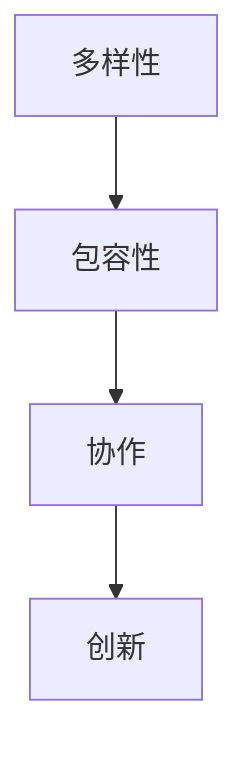

                 

# 团队多元化优势激活：将差异转化为创新源

## 关键词：团队多元化，差异，创新，协作，创新思维，沟通，技术突破

## 摘要：
本文探讨了团队多元化的重要性，以及如何通过激活团队中不同的视角和技能，将差异转化为创新源。通过分析多元化的概念和其在IT行业中的应用，文章提出了一系列策略和工具，帮助团队更好地利用多样性来推动技术突破。文章还提供了实际案例和资源推荐，以供读者进一步学习和实践。

### 1. 背景介绍

在当今快速变化的IT行业中，创新是企业和个人成功的关键。然而，创新并非一蹴而就，它需要丰富的知识、技能和思维方式的碰撞。团队多元化作为一种促进创新的有效手段，逐渐受到广泛关注。多元化不仅仅是指性别、种族或年龄的多样性，更包括知识、经验、技能和思考方式的差异。

近年来，许多研究表明，多元化的团队能够带来以下几个方面的优势：

1. **提高创新能力**：不同的观点和思维方式可以激发新的想法和解决方案。
2. **增强问题解决能力**：多元化的团队能够从多个角度审视问题，提高问题解决的效率和质量。
3. **促进团队合作**：多样化的团队成员能够更好地理解和尊重彼此的视角，增强团队的凝聚力。
4. **提高决策质量**：多元化的团队能够提供更全面的信息和观点，帮助团队做出更明智的决策。

然而，实现团队多元化并非易事。团队中的差异可能会引发冲突和误解，阻碍协作和创新的进程。因此，如何有效地管理和激活团队中的多样性，成为了一个关键问题。

### 2. 核心概念与联系

为了更好地理解团队多元化，我们首先需要明确几个核心概念：

#### 多样性（Diversity）
多样性是指团队中成员在性别、种族、文化、背景、技能和经验等方面的差异。多样性的本质在于其差异性，这种差异是推动创新和协作的重要源泉。

#### 包容性（Inclusivity）
包容性是指团队创造一个环境，让每个成员都感到被尊重和被重视。包容性不仅仅是接受多样性，更重要的是确保每个人都能在团队中发挥其最大潜力。

#### 协作（Collaboration）
协作是指团队成员共同努力，共同解决问题和实现目标的过程。协作是利用多元化优势的重要手段。

以下是一个简化的Mermaid流程图，展示了这些概念之间的关系：



在这个流程图中，多样性是创新的基石。通过包容性，我们可以确保多样化的观点和技能得到充分利用，从而促进协作和创新。

### 3. 核心算法原理 & 具体操作步骤

要激活团队多元化优势，我们需要采取一系列策略和工具。以下是一个简单的算法原理和具体操作步骤：

#### 步骤 1：识别多样性

- **技能和经验差异**：了解团队成员的不同技能和经验，识别其在团队中的独特价值。
- **文化背景差异**：了解团队成员的文化背景，包括语言、习俗和价值观，促进相互理解和尊重。

#### 步骤 2：建立包容性环境

- **鼓励开放沟通**：创建一个安全的环境，让团队成员可以自由表达不同的观点和想法。
- **尊重差异**：确保每个成员的声音都被听到，并尊重彼此的差异。
- **培训与教育**：提供相关的培训和教育，提高团队成员对多样性和包容性的认识。

#### 步骤 3：促进协作

- **跨功能团队**：建立跨功能的团队，让不同领域的成员共同工作，促进知识的交流和融合。
- **头脑风暴**：定期组织头脑风暴会议，鼓励团队成员提出新的想法和解决方案。
- **角色扮演**：通过角色扮演等活动，让团队成员体验不同的视角和思维模式。

#### 步骤 4：利用多样性推动创新

- **创新挑战**：设定创新挑战，鼓励团队成员利用各自的技能和经验，提出创新的解决方案。
- **奖励机制**：建立奖励机制，鼓励团队成员积极参与创新活动，并对创新成果给予认可。

### 4. 数学模型和公式 & 详细讲解 & 举例说明

为了更好地理解团队多元化的影响，我们可以使用一些数学模型和公式来量化其效果。以下是一个简化的模型：

#### 多样性指数（Diversity Index）

多样性指数是一个用于衡量团队多样性的指标，通常使用以下公式表示：

$$DI = \frac{1}{n}\sum_{i=1}^{n}(p_i - \bar{p})^2$$

其中，$DI$ 是多样性指数，$n$ 是团队成员的数量，$p_i$ 是第 $i$ 个成员的多样性值，$\bar{p}$ 是平均多样性值。

#### 协作效率（Collaboration Efficiency）

协作效率是衡量团队协作效果的一个指标，通常使用以下公式表示：

$$CE = \frac{C}{T}$$

其中，$CE$ 是协作效率，$C$ 是团队在规定时间内完成的工作量，$T$ 是团队的总工作时间。

#### 创新能力（Innovation Capability）

创新能力是衡量团队创新能力的一个指标，通常使用以下公式表示：

$$IC = \frac{I}{T}$$

其中，$IC$ 是创新能力，$I$ 是团队在规定时间内产生的创新点数，$T$ 是团队的总工作时间。

以下是一个具体的例子：

假设一个团队有5个成员，他们的多样性值分别为 0.3、0.4、0.5、0.6 和 0.7。平均多样性值为 0.5。团队在一个月内完成了 100 个工作任务，花费了 100 小时。期间产生了 20 个创新点数。

根据上述公式，我们可以计算出：

- 多样性指数（DI）: $$DI = \frac{1}{5} \times (0.3 - 0.5)^2 + (0.4 - 0.5)^2 + (0.5 - 0.5)^2 + (0.6 - 0.5)^2 + (0.7 - 0.5)^2 = 0.06$$
- 协作效率（CE）: $$CE = \frac{100}{100} = 1$$
- 创新能力（IC）: $$IC = \frac{20}{100} = 0.2$$

通过这些指标，我们可以评估团队在多样性、协作和创新能力方面的表现。

### 5. 项目实战：代码实际案例和详细解释说明

#### 5.1 开发环境搭建

在本案例中，我们将使用Python作为编程语言，并使用Jupyter Notebook作为开发环境。以下是搭建开发环境的基本步骤：

1. 安装Python（版本3.8及以上）
2. 安装Jupyter Notebook
3. 安装必要的Python库（如NumPy、Pandas、Matplotlib等）

#### 5.2 源代码详细实现和代码解读

以下是一个简单的Python脚本，用于计算团队多样性指数、协作效率和创新能力：

```python
import numpy as np
import pandas as pd

# 定义多样性指数、协作效率和创新能力计算函数
def diversity_index(values):
    avg_value = np.mean(values)
    diversity = np.sum((values - avg_value) ** 2)
    return diversity / len(values)

def collaboration_efficiency(completed_work, total_time):
    return completed_work / total_time

def innovation_capability(innovations, total_time):
    return innovations / total_time

# 假设数据
team_members = [0.3, 0.4, 0.5, 0.6, 0.7]
completed_work = 100
total_time = 100
innovations = 20

# 计算多样性指数、协作效率和创新能力
diversity = diversity_index(team_members)
ce = collaboration_efficiency(completed_work, total_time)
ic = innovation_capability(innovations, total_time)

# 输出结果
print("多样性指数 (Diversity Index):", diversity)
print("协作效率 (Collaboration Efficiency):", ce)
print("创新能力 (Innovation Capability):", ic)
```

这段代码定义了三个函数，用于计算多样性指数、协作效率和创新能力。然后，我们使用假设的数据进行计算，并输出结果。

#### 5.3 代码解读与分析

- **多样性指数计算**：多样性指数通过计算每个成员的多样性值与平均值之间的差异，并求和后除以成员数量得到。这个指标反映了团队成员之间的差异程度。
- **协作效率计算**：协作效率是团队完成的工作量与总工作时间的比值。这个指标反映了团队的效率。
- **创新能力计算**：创新能力是团队在规定时间内产生的创新点数与总工作时间的比值。这个指标反映了团队的创新能力。

通过这些计算，我们可以评估团队在多样性、协作和创新能力方面的表现，从而为团队优化提供参考。

### 6. 实际应用场景

团队多元化在IT行业的实际应用场景非常广泛。以下是一些具体的应用场景：

- **产品开发**：在产品开发过程中，多元化的团队能够提供多样化的用户视角，从而开发出更符合用户需求的产品。
- **技术创新**：在技术创新项目中，多元化的团队能够从多个角度审视问题，提高创新效率和成果质量。
- **项目管理**：在项目管理中，多元化的团队能够提供不同的解决方案和观点，提高项目的成功率和效率。
- **用户支持**：在用户支持中，多元化的团队能够更好地理解和解决不同用户的问题，提高用户满意度。

### 7. 工具和资源推荐

为了更好地实现团队多元化，以下是一些建议的资源和工具：

#### 7.1 学习资源推荐

- **书籍**：《多元智能》（Howard Gardner）、《包容性领导》（Sapna Maheshwari）
- **论文**：《团队多样性的影响》（Diversity in Teams: A Meta-Analysis of Team Performance and Member Potential Outcomes）（作者：Paulus, Nijstad, & van de Ven）
- **博客**：HBR.org上的关于多样性和包容性的文章

#### 7.2 开发工具框架推荐

- **Jupyter Notebook**：用于数据分析和协作编程
- **Git**：用于版本控制和团队协作
- **Docker**：用于容器化和微服务开发

#### 7.3 相关论文著作推荐

- **论文**：《促进团队多样性的策略》（Strategies for Promoting Team Diversity）（作者：Paulus, Nijstad, & van de Ven）
- **著作**：《包容性领导的艺术》（The Art of Inclusive Leadership）（作者：Sapna Maheshwari）

### 8. 总结：未来发展趋势与挑战

团队多元化作为推动创新和协作的重要手段，在未来将继续发挥重要作用。然而，要实现团队多元化并最大化其优势，我们仍面临以下挑战：

- **文化变革**：企业需要从文化层面进行变革，以真正实现包容性和尊重多样性。
- **技能提升**：团队成员需要不断提升自己的技能和知识，以适应多元化的工作环境。
- **领导力培养**：领导者需要具备多元化的领导力，能够激发和引导团队成员发挥其最大潜力。

总之，通过积极应对这些挑战，企业可以更好地利用团队多元化优势，推动技术突破和业务增长。

### 9. 附录：常见问题与解答

**Q：团队多元化是否适用于所有行业？**

A：是的，团队多元化适用于几乎所有行业。然而，不同行业可能需要关注不同的多样性维度，如技术技能、行业经验或文化背景。

**Q：如何确保团队成员感受到包容性？**

A：确保团队成员感受到包容性的关键在于提供培训、建立沟通渠道和创建一个安全的工作环境。此外，领导者应树立榜样，通过言行一致地展示对多样性的尊重和包容。

**Q：如何评估团队多元化的效果？**

A：可以使用多种指标来评估团队多元化的效果，如多样性指数、协作效率和创新能力。此外，可以通过定期的团队反馈和评估来了解团队成员的感受和意见。

### 10. 扩展阅读 & 参考资料

- **论文**：《团队多样性：理论与实践》（Team Diversity: Theory and Practice）（作者：Paulus, Nijstad, & van de Ven）
- **书籍**：《包容性创新》（Inclusive Innovation）（作者：Padin & Rizvi）
- **网站**：HBR.org，关于多样性和包容性的文章

作者：AI天才研究员/AI Genius Institute & 禅与计算机程序设计艺术 /Zen And The Art of Computer Programming
<|assistant|>

