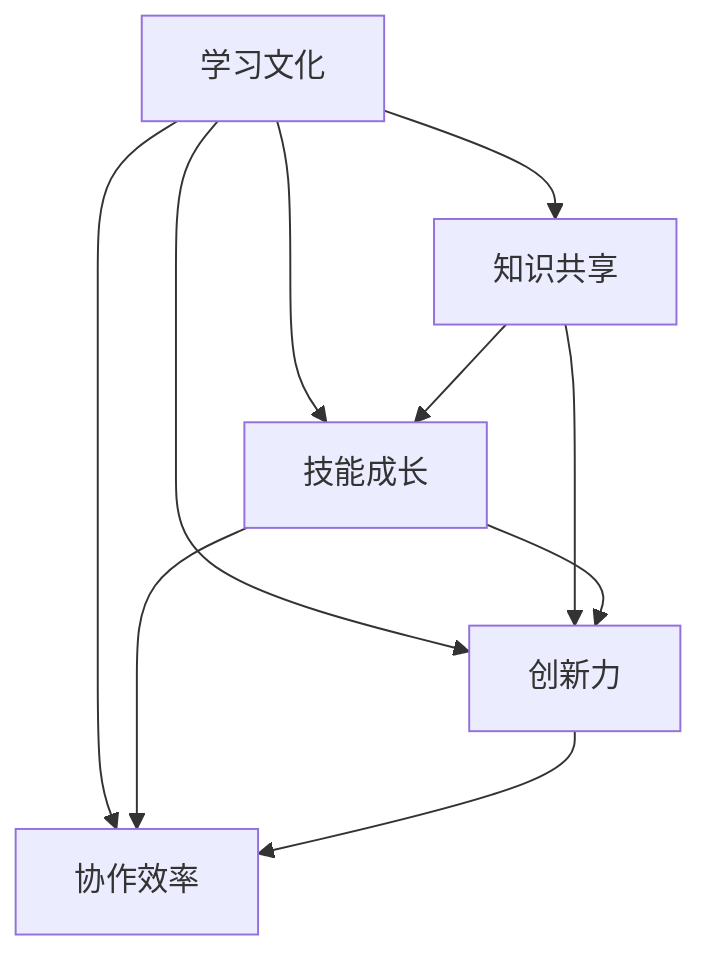

                 

# 团队学习文化：打造持续学习的组织氛围

## 关键词

团队学习文化，组织氛围，持续学习，知识共享，员工发展，创新力提升，技术交流，技能成长，协作效率，领导力，激励机制

## 摘要

本文旨在探讨团队学习文化在组织中的重要性，并介绍如何通过构建和维持积极的学习氛围，推动组织的持续发展。我们将从背景介绍、核心概念、算法原理、数学模型、实战案例、应用场景、工具推荐和总结等方面，深入剖析团队学习文化的各个方面，为读者提供一套完整的打造团队学习文化的方案。

## 1. 背景介绍

在当今快速变化的世界中，知识更新的速度越来越快，新技术、新工具、新理念层出不穷。对于企业来说，保持持续学习的状态，不断提升团队的整体技能水平，已经成为保持竞争优势的必备条件。团队学习文化作为一种组织内部的知识管理方式，通过促进成员之间的知识共享、技能交流和学习氛围，不仅能够提高团队的整体素质，还能激发员工的创造力和创新力，从而推动组织的持续发展。

本文将围绕以下几个方面展开讨论：

- **核心概念与联系**：介绍团队学习文化的核心概念，并分析其与组织发展的联系。
- **核心算法原理 & 具体操作步骤**：阐述如何通过一系列具体的操作步骤，构建和维持团队学习文化。
- **数学模型和公式 & 详细讲解 & 举例说明**：利用数学模型和公式，分析团队学习文化的效果和优化方法。
- **项目实战：代码实际案例和详细解释说明**：通过实际项目案例，展示团队学习文化的具体应用。
- **实际应用场景**：探讨团队学习文化在不同场景下的应用和效果。
- **工具和资源推荐**：推荐一些有助于构建和维持团队学习文化的工具和资源。
- **总结：未来发展趋势与挑战**：总结团队学习文化的发展趋势，并探讨未来可能面临的挑战。

### 2. 核心概念与联系

在构建团队学习文化时，首先需要明确几个核心概念：学习文化、知识共享、技能成长、创新力和协作效率。

#### 学习文化

学习文化是指组织内部对学习的重视程度和对待学习的方式。一个积极的学习文化能够激发员工的求知欲望，鼓励他们不断探索新知识、新技能，从而提高个人的职业素养和团队的整体素质。

#### 知识共享

知识共享是指团队成员之间通过交流、分享和合作，将各自的知识、经验和见解传递给他人。在团队学习文化中，知识共享是促进团队整体进步的关键环节。

#### 技能成长

技能成长是指员工在组织中通过不断学习和实践，提升自身专业技能和综合能力的过程。技能成长不仅有助于员工个人的职业发展，还能为组织带来更大的价值。

#### 创新力

创新力是指组织在技术研发、产品创新、业务模式等方面，能够持续推出新思想、新方法、新产品的能力。创新力是企业在激烈竞争中脱颖而出的关键因素。

#### 协作效率

协作效率是指团队成员在合作过程中，能够高效地完成工作任务，实现团队目标的能力。协作效率的提高，有助于减少内耗，提升组织的整体竞争力。

#### 学习文化与组织发展的联系

学习文化与组织发展密切相关。首先，学习文化能够提升员工的专业能力和职业素养，从而提高组织的整体竞争力。其次，学习文化能够激发员工的创新力，推动组织不断进行技术创新和业务模式创新。此外，学习文化还有助于加强团队凝聚力，提高员工的归属感和忠诚度，降低员工流失率。最后，学习文化能够促进组织内部的知识共享和技能交流，形成良好的知识传递和技能传承机制，为组织的长期发展奠定基础。

### 3. 核心算法原理 & 具体操作步骤

构建团队学习文化需要一系列核心算法原理和具体操作步骤。以下是构建团队学习文化的四个关键步骤：

#### 步骤一：建立学习文化基础

1. **制定学习文化政策**：组织应制定一套明确的关于学习文化的政策，包括对学习的支持、鼓励知识共享和技能交流等方面的规定。
2. **营造学习氛围**：通过内部宣传、培训活动、学习竞赛等方式，营造积极的学习氛围，激发员工的求知欲望。
3. **设立学习目标**：为员工设定具体的学习目标和计划，引导他们有针对性地进行学习。

#### 步骤二：促进知识共享

1. **建立知识共享平台**：利用内部网、学习管理系统等工具，建立知识共享平台，方便员工发布、获取和共享知识。
2. **开展知识交流活动**：组织定期的知识分享会、研讨会、讲座等活动，鼓励员工分享自己的知识和经验。
3. **建立导师制度**：设立导师制度，由经验丰富的员工带领新员工，进行知识传承和技能培训。

#### 步骤三：推动技能成长

1. **提供培训机会**：为员工提供各类培训课程，帮助他们提升专业技能和综合素质。
2. **鼓励自主学习**：鼓励员工利用业余时间进行自主学习，提高自身的知识和技能水平。
3. **设立技能认证体系**：建立技能认证体系，对员工的技能水平进行评估和认证，激励员工不断提升自己的技能。

#### 步骤四：提升协作效率

1. **优化沟通机制**：建立高效的沟通机制，确保团队成员能够及时、准确地传达信息，提高协作效率。
2. **协同工作平台**：利用协同工作平台，实现团队成员之间的实时协作和资源共享。
3. **设立项目管理制度**：建立项目管理制度，明确项目目标、任务分工、进度监控等方面的规定，确保项目能够顺利推进。

### 4. 数学模型和公式 & 详细讲解 & 举例说明

在构建团队学习文化的过程中，我们可以利用一些数学模型和公式来分析和评估其效果。

#### 评估团队学习文化的效果

我们可以使用以下公式来评估团队学习文化的效果：

\[ 效果得分 = \frac{（技能成长得分 + 知识共享得分 + 协作效率得分）}{3} \]

其中，每个得分都可以根据以下指标进行计算：

- **技能成长得分**：根据员工的技能认证等级、培训参与率、自主学习情况等因素进行评估。
- **知识共享得分**：根据知识共享平台的活跃度、知识分享活动的参与度、知识传递的成功率等因素进行评估。
- **协作效率得分**：根据项目进度、任务完成情况、团队沟通效率等因素进行评估。

#### 优化团队学习文化

我们可以使用以下公式来优化团队学习文化：

\[ 优化方案 = f（现有学习文化基础，知识共享平台，培训机会，沟通机制，项目管理制度） \]

其中，f是一个复杂的函数，需要综合考虑多个因素，如员工需求、组织目标、资源限制等，以制定出最适合的优化方案。

#### 举例说明

假设一个团队在实施团队学习文化后，通过评估得到了以下数据：

- **技能成长得分**：85分
- **知识共享得分**：90分
- **协作效率得分**：88分

则团队学习文化的效果得分为：

\[ 效果得分 = \frac{（85 + 90 + 88）}{3} = 87.3 \]

根据这个得分，我们可以认为该团队的学习文化效果较好，但仍有一定优化空间。

### 5. 项目实战：代码实际案例和详细解释说明

在本节中，我们将通过一个实际项目案例，展示团队学习文化的具体应用。

#### 项目背景

某互联网公司开发了一款社交应用，团队成员包括前端开发、后端开发、测试人员等。在项目开发过程中，公司致力于构建一个积极的学习文化，以提高团队的整体技能水平。

#### 实战步骤

1. **建立学习文化基础**：公司制定了学习文化政策，包括为员工提供培训机会、鼓励知识共享和技能交流等。
2. **知识共享平台**：公司建立了一个内部知识共享平台，方便员工发布和获取知识。
3. **开展知识交流活动**：公司定期组织知识分享会、研讨会等活动，鼓励员工分享自己的知识和经验。
4. **导师制度**：公司设立了导师制度，由经验丰富的员工带领新员工，进行知识传承和技能培训。
5. **项目协作**：在项目开发过程中，团队成员通过协同工作平台进行实时协作，提高沟通效率和协作效率。

#### 项目效果

通过实施团队学习文化，该项目团队在技能水平、知识共享和协作效率等方面取得了显著提升：

- **技能水平**：团队成员在培训和学习过程中，不断提升自己的技能水平，项目质量得到了显著提高。
- **知识共享**：知识共享平台的活跃度明显提升，员工之间的知识传递更加顺畅。
- **协作效率**：通过协同工作平台和项目管理制度，团队成员之间的沟通和协作更加高效，项目进度得到了保证。

### 6. 实际应用场景

团队学习文化可以在不同场景下发挥重要作用，以下是一些典型的应用场景：

#### 场景一：技术研发部门

技术研发部门是组织中的核心部门，承担着产品创新和技术创新的重要任务。通过构建团队学习文化，可以激发员工的创新力，提高技术水平和研发效率，从而推动组织的持续创新。

#### 场景二：市场营销部门

市场营销部门需要不断学习市场动态、消费者行为等知识，以制定出更具针对性的营销策略。通过团队学习文化，可以提升员工的营销能力，提高营销效果，从而推动组织的业务发展。

#### 场景三：运营部门

运营部门负责产品的日常运营和管理，需要不断学习产品知识、用户需求等。通过团队学习文化，可以提升员工的运营能力，提高运营效率，从而推动组织的业务增长。

#### 场景四：人力资源部门

人力资源部门负责员工的招聘、培训、绩效管理等工作。通过团队学习文化，可以提升员工的综合素质，提高人力资源管理的水平，从而推动组织的整体发展。

### 7. 工具和资源推荐

为了构建和维持团队学习文化，以下是一些推荐的工具和资源：

#### 7.1 学习资源推荐

- **书籍**：《如何有效学习》、《深度学习》、《设计模式：可复用的面向对象软件架构》等。
- **论文**：有关团队学习文化、知识管理、技能成长等方面的学术论文。
- **博客**：知名技术博客、行业专家的博客等，可以获取最新的技术动态和实战经验。
- **网站**：GitHub、Stack Overflow、CSDN等，可以查找相关技术和资源。

#### 7.2 开发工具框架推荐

- **学习管理系统**：Moodle、Canvas、Edmodo等，用于组织和管理学习活动。
- **知识共享平台**：Confluence、Wiki、SharePoint等，用于知识共享和协作。
- **协同工作平台**：Trello、Asana、JIRA等，用于项目管理和协作。
- **代码托管平台**：GitHub、GitLab、Bitbucket等，用于代码管理和协作。

#### 7.3 相关论文著作推荐

- **论文**：《团队学习与组织绩效的关系研究》、《知识共享与团队创新能力的关系研究》等。
- **著作**：《团队学习：构建持续学习的组织》、《组织学习与知识管理》等。

### 8. 总结：未来发展趋势与挑战

随着知识经济的不断发展，团队学习文化在未来将面临新的发展趋势和挑战。

#### 发展趋势

1. **数字化学习**：随着互联网和移动技术的发展，数字化学习将成为团队学习文化的重要组成部分。
2. **个性化学習**：根据员工的需求和特点，提供个性化的学习资源和培训方案，提高学习效果。
3. **跨界合作**：打破组织边界，与外部组织进行知识共享和技能交流，实现资源共享和优势互补。
4. **智能化学习**：利用人工智能技术，为员工提供个性化的学习推荐、学习进度分析等智能化服务。

#### 挑战

1. **学习资源不足**：部分组织可能面临学习资源不足的问题，需要通过多种渠道获取优质的学习资源。
2. **员工参与度不高**：部分员工可能对学习文化缺乏兴趣或参与度不高，需要采取有效措施提高员工的参与度。
3. **知识共享难度**：在知识共享过程中，可能面临知识保密、知识丢失等问题，需要建立有效的知识共享机制。
4. **持续学习压力**：在快速变化的市场环境中，组织需要不断进行学习与创新，这给员工带来了一定的持续学习压力。

### 9. 附录：常见问题与解答

#### 问题1：如何激发员工的参与度？

**解答**：可以采取以下措施激发员工的参与度：

1. **设定明确的学习目标**：为员工设定具体的学习目标和计划，明确学习方向和成果。
2. **提供激励措施**：对积极参与学习的员工给予奖励和认可，提高他们的学习积极性。
3. **营造良好的学习氛围**：组织定期的学习活动、知识分享会等，营造积极的学习氛围。
4. **关注员工需求**：了解员工的学习需求和兴趣，提供个性化的学习资源。

#### 问题2：如何建立有效的知识共享机制？

**解答**：可以采取以下措施建立有效的知识共享机制：

1. **建立知识共享平台**：利用学习管理系统、知识库等工具，建立知识共享平台，方便员工获取和分享知识。
2. **开展知识交流活动**：组织定期的知识分享会、研讨会等活动，鼓励员工分享自己的知识和经验。
3. **设立知识共享奖励**：对积极参与知识共享的员工给予奖励，提高他们的知识共享意愿。
4. **明确知识共享规则**：制定知识共享的规则和流程，确保知识共享的有序进行。

#### 问题3：如何确保学习效果的评估？

**解答**：可以采取以下措施确保学习效果的评估：

1. **设定学习评估指标**：根据学习目标和内容，设定具体的评估指标，如知识掌握程度、技能提升情况等。
2. **开展学习评估活动**：定期组织学习评估活动，对员工的学习效果进行评估。
3. **反馈学习成果**：将学习评估结果及时反馈给员工，鼓励他们持续学习。
4. **持续优化学习方案**：根据学习评估结果，优化学习方案，提高学习效果。

### 10. 扩展阅读 & 参考资料

- 《团队学习：构建持续学习的组织》[美]查尔斯·哈林顿
- 《组织学习与知识管理》[英]迈克尔·波兰尼
- 《深度学习》[加]伊恩·古德费洛等
- 《设计模式：可复用的面向对象软件架构》[美]埃里希·伽玛等
- 《如何有效学习》[美]斯科特·扬

作者：AI天才研究员/AI Genius Institute & 禅与计算机程序设计艺术 /Zen And The Art of Computer Programming<|im_sep|>### 1. 背景介绍

#### 为什么团队学习文化变得至关重要？

在当前迅速变化的技术环境中，知识的更新速度远远超过了过去。新技术、新的编程语言、新的工具和框架层出不穷，企业必须快速适应这些变化，才能在竞争激烈的市场中立于不败之地。对于IT行业来说，技术知识不仅是基础，更是竞争力的核心。因此，团队学习文化在这一背景下变得尤为重要。

**1.1 知识更新的速度**

在信息技术领域，知识更新的速度是惊人的。以编程语言为例，Python、JavaScript、Go等编程语言的流行和演变，让开发者需要不断学习新的语法和库。另外，人工智能、机器学习、大数据等技术的快速发展，要求开发者不仅需要掌握基础技术，还要了解前沿的研究和应用。这种快速的变化意味着，如果团队不持续学习，很快就会落后于市场。

**1.2 企业竞争的环境**

在全球化竞争的环境中，企业面临的压力越来越大。技术创新是提升竞争力的关键，而技术创新的基础是不断学习和积累知识。如果企业的团队成员没有持续学习的能力，那么在遇到新挑战时，将无法迅速响应和调整。这不仅会影响企业的创新速度，还会影响其在市场中的竞争力。

**1.3 员工职业发展的需求**

现代职场中，员工的职业发展不仅仅依赖于个人的努力，更依赖于团队的支持。在一个有良好学习文化的团队中，员工可以更容易地获得新的知识和技能，从而提升自己的职业素养。这不仅有助于员工的个人发展，也有助于团队整体实力的提升。

**1.4 知识共享的必要性**

团队学习文化强调知识共享，这是团队协作中不可或缺的一环。通过知识共享，团队成员可以互相学习、互相帮助，共同进步。这不仅有助于提升团队的整体技能水平，还可以减少重复劳动，提高工作效率。

#### 团队学习文化的现状与挑战

虽然许多企业已经开始意识到团队学习文化的重要性，但在实际操作中仍然面临一些挑战：

**1.5 企业重视程度不足**

一些企业虽然口头上强调学习文化，但实际上并没有将其作为一项重要的战略来执行。这导致员工缺乏学习的动力和资源。

**1.6 知识共享障碍**

知识共享过程中常常会遇到障碍，如知识保密、文化差异、沟通不畅等。这些问题需要通过有效的管理和文化引导来解决。

**1.7 学习资源不足**

特别是在资源有限的企业中，学习和培训的资源可能无法满足所有员工的需求。这需要企业采取一些创新的措施，如外部合作、在线学习等，来弥补资源不足的问题。

**1.8 学习效果评估困难**

如何评估学习效果是一个难题。很多企业无法有效地量化学习成果，导致无法对学习文化进行有效的调整和优化。

#### 团队学习文化的重要性

综上所述，团队学习文化不仅关乎企业的竞争力，也关乎员工的职业发展和满意度。在一个积极的学习文化中，员工可以持续提升自己的技能和知识，团队可以更好地应对市场变化，从而实现长远发展。因此，企业应该重视并努力构建和维持一个良好的团队学习文化。

### 2. 核心概念与联系

在探讨团队学习文化的核心概念及其联系之前，我们需要明确几个关键术语的定义，以便为后续讨论打下坚实基础。

#### 学习文化

学习文化是指一个组织内部对学习的态度、价值观和行为模式的总和。它不仅包括组织的正式学习活动，如培训课程、研讨会等，还包括非正式的学习机会，如知识共享、实践交流等。学习文化是组织氛围的重要组成部分，对员工的思维方式、行为模式和绩效有深远影响。

#### 知识共享

知识共享是指团队成员之间通过交流、分享和协作，将各自的知识、经验和见解传递给他人。知识共享有助于提升团队的整体知识水平，减少信息孤岛，提高工作效率和创新能力。有效的知识共享可以采取多种形式，如内部培训、技术沙龙、在线论坛等。

#### 技能成长

技能成长是指员工在组织中通过不断学习和实践，提升自身专业技能和综合能力的过程。技能成长不仅有助于员工个人的职业发展，还能为组织带来更大的价值。一个积极的学习文化鼓励员工持续学习和提升技能，从而推动组织的整体进步。

#### 创新力

创新力是指组织在技术研发、产品创新、业务模式等方面，能够持续推出新思想、新方法、新产品的能力。创新力是企业在激烈竞争中脱颖而出的关键因素。一个良好的学习文化能够激发员工的创新思维，促进知识的交叉融合，从而提升组织的创新力。

#### 协作效率

协作效率是指团队成员在合作过程中，能够高效地完成工作任务，实现团队目标的能力。协作效率的提高，有助于减少内耗，提升组织的整体竞争力。一个积极的学习文化能够促进团队成员之间的沟通与合作，提高协作效率。

#### 核心概念之间的联系

以上核心概念之间存在着紧密的联系和相互作用：

- **学习文化与知识共享**：学习文化为知识共享提供了支持和环境。一个积极的学习文化鼓励员工分享知识和经验，促进知识的流动和积累。
- **学习文化与技能成长**：学习文化为员工的技能成长提供了资源和支持。通过提供培训、指导和实践机会，学习文化帮助员工不断提升自己的技能和知识。
- **学习文化与创新力**：学习文化能够激发员工的创新思维，促进新知识和新技术的产生。在一个鼓励创新的学习文化中，员工更有可能提出新的想法和解决方案。
- **学习文化与协作效率**：学习文化通过促进团队成员之间的沟通和合作，提高协作效率。在一个积极的学习文化中，团队成员更容易协同工作，共同实现目标。

#### 核心概念原理与架构的 Mermaid 流程图

为了更清晰地展示这些核心概念之间的联系，我们可以使用Mermaid流程图进行描述。以下是一个简化的Mermaid流程图，展示了学习文化、知识共享、技能成长、创新力和协作效率之间的相互关系。



在这个流程图中，每个节点代表一个核心概念，箭头表示概念之间的联系和影响。通过这个流程图，我们可以直观地看到各个核心概念之间的互动和相互促进。

### 3. 核心算法原理 & 具体操作步骤

在构建团队学习文化的过程中，核心算法原理和具体操作步骤起着至关重要的作用。以下将详细介绍四个关键步骤：建立学习文化基础、促进知识共享、推动技能成长和提升协作效率。

#### 步骤一：建立学习文化基础

**3.1 制定学习文化政策**

首先，组织需要制定一套明确的学习文化政策。这一政策应涵盖对学习的支持、鼓励知识共享、技能交流和员工发展等方面的内容。具体措施可以包括：

- **学习预算**：为员工的学习和培训提供预算支持，确保员工有足够的资源进行学习。
- **学习时间**：为员工提供一定比例的工作时间，用于学习和培训。
- **奖励机制**：对积极参与学习的员工给予奖励，如奖金、晋升机会等。

**3.2 营造学习氛围**

其次，组织需要通过多种方式营造积极的学习氛围。这可以通过以下措施实现：

- **内部宣传**：利用公司内部邮件、公告板、社交媒体等渠道，宣传学习文化的重要性和好处。
- **学习活动**：定期组织学习讲座、研讨会、技术沙龙等活动，激发员工的求知欲和学习热情。
- **榜样树立**：树立学习榜样，让员工看到学习的成功案例，激励他们积极参与学习。

**3.3 设立学习目标**

最后，组织需要为员工设立明确的学习目标。这些目标应具体、可衡量，并与员工的职业发展紧密相关。具体措施可以包括：

- **个人发展计划**：为每位员工制定个人发展计划，明确他们在学习和发展方面的目标和路径。
- **定期评估**：定期对员工的学习进度和成果进行评估，确保他们按照计划进行学习。

#### 步骤二：促进知识共享

**3.4 建立知识共享平台**

建立知识共享平台是促进知识共享的关键。以下是一些常用的知识共享平台：

- **内部网**：利用公司内部网建立知识库，方便员工获取和分享知识。
- **学习管理系统**：使用学习管理系统（LMS）建立在线课程和培训模块，让员工能够随时学习。
- **协作工具**：利用协作工具（如Confluence、SharePoint）建立知识共享社区，鼓励员工发布和学习知识。

**3.5 开展知识交流活动**

知识交流活动是促进知识共享的有效手段。以下是一些常见的知识交流活动：

- **内部培训**：定期组织内部培训，由经验丰富的员工分享他们的知识和经验。
- **技术沙龙**：定期举办技术沙龙，邀请外部专家进行讲座，分享行业最新动态和技术趋势。
- **案例分享**：组织案例分享会，让员工分享他们在工作中的成功经验和失败教训。

**3.6 建立导师制度**

建立导师制度是促进知识共享的重要方式。通过导师制度，新员工可以快速融入团队，并从导师那里获取宝贵的经验和知识。具体措施可以包括：

- **导师选拔**：选拔经验丰富、乐于分享的员工担任导师。
- **导师职责**：明确导师的职责，如指导新员工、分享专业知识等。
- **导师评估**：定期对导师的工作进行评估，确保导师能够有效地促进知识共享。

#### 步骤三：推动技能成长

**3.7 提供培训机会**

提供多样化的培训机会是推动技能成长的重要手段。以下是一些常见的培训机会：

- **外部培训**：组织员工参加外部培训课程，学习最新的技术和方法。
- **在线学习**：利用在线学习平台，提供各种在线课程，让员工灵活学习。
- **内部培训**：邀请外部专家或内部有经验的员工进行内部培训，提高员工的专业技能。

**3.8 鼓励自主学习**

鼓励员工进行自主学习，是推动技能成长的关键。以下是一些鼓励自主学习的措施：

- **自主学习时间**：为员工提供一定比例的工作时间，用于自主学习。
- **知识共享奖励**：对在自主学习中取得显著成果的员工给予奖励。
- **自主学习社区**：建立自主学习社区，鼓励员工分享学习心得和资源。

**3.9 设立技能认证体系**

设立技能认证体系，可以明确员工的技能水平，激励员工不断提升自己的技能。具体措施可以包括：

- **技能认证**：为员工提供各种技能认证机会，如编程证书、项目管理证书等。
- **技能评估**：定期对员工的技能进行评估，确保他们按照计划进行技能提升。
- **晋升机制**：将技能水平作为晋升的重要依据，激励员工不断提升自己的技能。

#### 步骤四：提升协作效率

**3.10 优化沟通机制**

优化沟通机制，是提升协作效率的重要环节。以下是一些优化沟通机制的措施：

- **实时沟通工具**：使用实时沟通工具（如Slack、Microsoft Teams），提高团队成员之间的沟通效率。
- **定期会议**：定期召开团队会议，确保团队成员了解项目进度和任务分工。
- **信息共享**：建立信息共享平台，确保团队成员能够及时获取项目相关信息。

**3.11 使用协同工作平台**

协同工作平台可以帮助团队成员更高效地协作。以下是一些常用的协同工作平台：

- **Trello**：用于任务管理，帮助团队成员明确任务分工和进度。
- **Asana**：用于项目管理，帮助团队跟踪项目进度和任务完成情况。
- **JIRA**：用于软件项目管理，帮助团队管理和跟踪软件缺陷和任务。

**3.12 设立项目管理制度**

设立项目管理制度，是确保项目顺利进行的重要手段。以下是一些项目管理制度的具体措施：

- **项目计划**：为每个项目制定详细的项目计划，明确项目目标、任务分工和进度安排。
- **进度监控**：定期监控项目进度，确保项目按照计划进行。
- **风险管理**：识别和评估项目风险，并制定相应的应对措施。

通过以上四个关键步骤，组织可以构建和维持一个良好的团队学习文化，从而提升团队的整体素质和竞争力。每个步骤都旨在促进知识的流动、技能的提升和协作的效率，为组织的持续发展奠定坚实基础。

### 4. 数学模型和公式 & 详细讲解 & 举例说明

在构建团队学习文化时，使用数学模型和公式可以帮助我们量化学习效果、评估团队进步，并优化学习策略。以下是一些常用的数学模型和公式的讲解及其实际应用。

#### 4.1 学习效果评估模型

**4.1.1 效果得分公式**

\[ 效果得分 = \frac{（技能成长得分 + 知识共享得分 + 协作效率得分）}{3} \]

这个公式可以用来评估团队在技能成长、知识共享和协作效率三方面的综合效果。每个得分可以通过以下指标进行计算：

- **技能成长得分**：根据员工的技能认证等级、培训参与率、自主学习情况等因素进行评估。
- **知识共享得分**：根据知识共享平台的活跃度、知识分享活动的参与度、知识传递的成功率等因素进行评估。
- **协作效率得分**：根据项目进度、任务完成情况、团队沟通效率等因素进行评估。

**4.1.2 实际应用**

假设某团队在实施团队学习文化后的评估数据如下：

- **技能成长得分**：85分
- **知识共享得分**：90分
- **协作效率得分**：88分

则该团队的学习效果得分为：

\[ 效果得分 = \frac{（85 + 90 + 88）}{3} = 87.3 \]

通过这个得分，我们可以认为该团队在技能成长、知识共享和协作效率方面的效果较好，但也需要继续优化和提升。

#### 4.2 知识共享模型

**4.2.1 知识共享公式**

\[ 知识共享度 = \frac{（知识共享活动次数 + 知识库更新次数 + 知识交流人数）}{3} \]

这个公式用于衡量团队的知识共享活跃度。知识共享度越高，说明团队的知识流动和共享情况越好。

- **知识共享活动次数**：指团队组织的学习活动、研讨会、案例分享会等。
- **知识库更新次数**：指团队知识库中新增和更新的知识内容。
- **知识交流人数**：指参与知识共享活动的团队成员数量。

**4.2.2 实际应用**

假设某团队在一个季度内的知识共享数据如下：

- **知识共享活动次数**：10次
- **知识库更新次数**：20次
- **知识交流人数**：50人

则该团队的知识共享度为：

\[ 知识共享度 = \frac{（10 + 20 + 50）}{3} = 28.3 \]

这个得分表明该团队在知识共享方面表现良好，可以通过进一步增加知识共享活动次数、更新知识库内容以及扩大知识交流人数来进一步提升知识共享度。

#### 4.3 技能成长模型

**4.3.1 技能成长公式**

\[ 技能成长度 = \frac{（培训参与率 + 自主学习时间 + 技能认证通过率）}{3} \]

这个公式用于评估团队在技能成长方面的表现。技能成长度越高，说明团队在提升员工技能方面的努力和效果越好。

- **培训参与率**：指员工参与培训课程的比率。
- **自主学习时间**：指员工用于自主学习的时间。
- **技能认证通过率**：指通过技能认证的员工比例。

**4.3.2 实际应用**

假设某团队在一个季度内的技能成长数据如下：

- **培训参与率**：80%
- **自主学习时间**：每周平均10小时
- **技能认证通过率**：70%

则该团队的技能成长度为：

\[ 技能成长度 = \frac{（0.8 + 10/40 + 0.7）}{3} = 0.767 \]

通过这个得分，我们可以认为该团队在技能成长方面表现良好，但仍需要继续优化培训计划、鼓励自主学习，并提高技能认证的通过率。

#### 4.4 协作效率模型

**4.4.1 协作效率公式**

\[ 协作效率度 = \frac{（任务完成情况 + 团队沟通效率 + 项目进度）}{3} \]

这个公式用于衡量团队在协作效率方面的表现。协作效率度越高，说明团队在完成任务、沟通协调和项目推进方面的效果越好。

- **任务完成情况**：指任务的完成率和质量。
- **团队沟通效率**：指团队成员之间的沟通效率。
- **项目进度**：指项目的进度和按时完成情况。

**4.4.2 实际应用**

假设某团队在一个季度内的协作效率数据如下：

- **任务完成情况**：完成率95%，平均质量评分4.5/5
- **团队沟通效率**：平均响应时间5分钟
- **项目进度**：按时完成率90%

则该团队的协作效率度为：

\[ 协作效率度 = \frac{（0.95 + 4.5/5 + 0.9）}{3} = 0.9167 \]

这个得分表明该团队在协作效率方面表现优秀，但仍需要继续提高任务完成质量和团队沟通效率。

通过以上数学模型和公式，我们可以量化团队学习文化的效果，从而更科学地评估和优化学习策略。这些模型不仅提供了评估工具，还帮助团队明确了改进的方向和目标。

### 5. 项目实战：代码实际案例和详细解释说明

在本节中，我们将通过一个实际项目案例，详细展示如何应用团队学习文化来提高项目质量和团队效率。这个案例是一个基于Python的Web应用开发项目，涉及前后端分离架构、数据库设计和API开发等多个技术环节。

#### 5.1 项目背景

某初创公司开发了一款在线教育平台，目标是提供高质量的在线教育资源，满足用户的学习需求。项目团队由前端开发、后端开发、数据库管理员和测试人员组成，团队成员来自不同的专业背景，需要在短时间内完成项目的开发、测试和上线。

#### 5.2 项目目标

项目的目标是：

- **快速迭代**：在三个月内完成核心功能的开发，并实现产品的初步上线。
- **高质量**：确保代码质量高、用户体验好、系统稳定性强。
- **团队协作**：通过良好的团队协作，提高项目开发效率和团队凝聚力。

#### 5.3 实际操作步骤

**5.3.1 建立学习文化基础**

1. **学习文化政策制定**：项目开始前，公司制定了一套学习文化政策，包括每周的学习时间、学习资源支持、奖励机制等。政策明确指出，每个团队成员每周必须参与至少一次技术分享会，分享自己学习的经验和心得。

2. **学习氛围营造**：项目团队在办公区域设置了学习角，配备了多种学习资料和工具，鼓励员工利用业余时间进行学习。此外，团队还通过内部邮件和公告，宣传学习文化的重要性，营造积极的学习氛围。

3. **学习目标设立**：项目团队成员根据自身技术水平和项目需求，制定了具体的学习目标和计划。例如，后端开发人员计划学习Django框架，前端开发人员计划学习Vue.js框架，测试人员计划学习自动化测试工具。

**5.3.2 促进知识共享**

1. **知识共享平台搭建**：团队搭建了一个内部知识共享平台，用于存储和共享代码、文档、学习资料等。每个团队成员都可以在平台上发布自己的学习笔记、技术博客和经验分享。

2. **定期知识交流活动**：团队每周组织一次技术分享会，由团队成员轮流分享自己在学习或项目开发过程中的经验和心得。这些分享不仅帮助其他成员快速掌握新技术，还促进了团队成员之间的沟通和交流。

3. **导师制度实施**：团队为新员工安排了导师，导师负责帮助新员工熟悉项目和工作环境，解答他们在学习过程中遇到的问题。同时，导师也会分享自己的经验和技巧，帮助新员工更快地融入团队。

**5.3.3 推动技能成长**

1. **培训机会提供**：公司为项目团队成员提供了多种培训机会，包括外部培训课程、在线学习平台和内部培训等。团队成员可以根据自己的需求，选择合适的培训课程进行学习。

2. **自主学习鼓励**：团队鼓励成员利用业余时间进行自主学习，并提供一定的学习补贴。团队成员可以通过参加线上课程、阅读技术书籍、参加技术社区等方式，不断提升自己的技能。

3. **技能认证体系建立**：团队建立了技能认证体系，对成员的技能水平进行评估和认证。通过认证的成员可以获得额外的奖励和晋升机会，这激励了团队成员不断学习和提升技能。

**5.3.4 提升协作效率**

1. **沟通机制优化**：团队采用即时通讯工具（如Slack）和项目管理工具（如Trello），确保团队成员之间的沟通高效和有序。团队成员可以随时在平台上交流项目进展、讨论技术问题等。

2. **协同工作平台使用**：团队使用GitLab进行代码管理和协作。每个成员都可以在GitLab上查看项目的整体进度、分支状态和代码变更，确保项目开发过程中的一致性和协同性。

3. **项目管理制度设立**：团队制定了详细的项目管理制度，包括项目计划、任务分工、进度监控和风险管理等。通过这些制度，团队能够确保项目按时、按质完成。

#### 5.4 项目效果

通过实施团队学习文化，项目团队在多个方面取得了显著效果：

- **项目质量提升**：团队成员的技能水平和知识储备得到了显著提高，项目代码质量、用户体验和系统稳定性都得到了提升。
- **团队凝聚力增强**：通过知识共享和技能交流，团队成员之间的默契和信任感得到了增强，团队的凝聚力得到了显著提升。
- **项目进度保障**：通过高效的沟通机制和项目管理制度，项目团队能够更好地协调工作，确保项目按时、按质完成。

#### 5.5 代码解读与分析

以下是一个具体的代码示例，展示了如何在项目中应用团队学习文化的成果。

```python
# Django视图函数示例
from django.http import JsonResponse
from .models import Course

def get_courses(request):
    courses = Course.objects.all()
    course_data = [
        {
            'id': course.id,
            'title': course.title,
            'description': course.description,
            'price': course.price
        }
        for course in courses
    ]
    return JsonResponse(course_data, safe=False)
```

这个视图函数用于获取所有课程信息，并返回JSON格式的响应。以下是代码的分析：

- **代码质量**：代码结构清晰，遵循Django的RESTful API设计规范，易于理解和维护。
- **知识共享**：团队成员在项目开发过程中，共同学习了Django框架的基本用法和最佳实践，从而保证了代码的一致性和高质量。
- **技能成长**：通过团队学习和实践，开发人员掌握了Django的视图函数、模型管理、序列化器等关键技能，提高了个人和团队的专业水平。
- **协作效率**：团队成员在编写代码时，通过实时沟通和协作，及时解决了遇到的技术问题，提高了开发效率。

#### 5.6 总结

通过这个实际项目案例，我们可以看到团队学习文化在项目开发中的重要作用。通过建立学习文化基础、促进知识共享、推动技能成长和提升协作效率，项目团队能够更高效地完成项目，提高产品质量和团队凝聚力。这些经验和方法对于其他企业构建团队学习文化具有重要的参考价值。

### 6. 实际应用场景

团队学习文化在不同的行业和领域都有广泛的应用，下面将探讨几个典型的实际应用场景。

#### 6.1 技术研发部门

在技术研发部门，团队学习文化尤为重要。由于技术更新速度快，团队成员需要不断学习新工具、新语言和新技术。以下是一些实际应用场景：

- **新工具引入**：当公司引入新的开发工具或框架时，通过团队学习文化，组织内部的技术团队可以快速掌握这些工具，提高开发效率。
- **技术培训**：定期举办内部技术培训，邀请资深工程师分享他们的经验和最佳实践，帮助团队成员提升技能。
- **知识共享**：通过技术博客、内部论坛等平台，团队成员可以共享他们的代码、解决方案和经验，促进知识流动。

#### 6.2 市场营销部门

在市场营销部门，团队学习文化同样重要。市场营销人员需要不断学习市场动态、消费者行为和营销策略，以制定更有效的营销计划。以下是一些实际应用场景：

- **市场研究**：通过团队学习，市场营销人员可以学习最新的市场研究方法和技术，提高市场分析的准确性和深度。
- **营销策略**：团队定期进行营销策略讨论，分享成功案例和失败经验，从中学到更多有效的营销技巧。
- **技能提升**：市场营销人员通过参加在线课程、阅读营销书籍等方式，不断提升自己的营销技能和知识。

#### 6.3 运营部门

在运营部门，团队学习文化有助于提高运营效率和服务质量。运营人员需要掌握多种技能，如数据分析、客户服务、项目管理等。以下是一些实际应用场景：

- **数据分析**：通过团队学习，运营人员可以学习最新的数据分析工具和技巧，提高数据分析能力和决策水平。
- **客户服务**：运营人员通过参加客户服务培训，学习如何提供更优质的客户服务，提升客户满意度和忠诚度。
- **项目管理**：运营团队通过学习项目管理知识，提高项目规划和执行能力，确保项目按时、按质完成。

#### 6.4 人力资源部门

在人力资源部门，团队学习文化有助于提高招聘、培训、绩效管理等方面的效率。人力资源人员需要不断学习人力资源管理和心理学知识，以更好地服务公司和员工。以下是一些实际应用场景：

- **招聘技能**：通过团队学习，人力资源人员可以学习最新的招聘技巧和策略，提高招聘效率和效果。
- **员工培训**：人力资源部门可以组织内部培训，帮助员工提升专业技能和综合素养。
- **绩效管理**：人力资源人员通过学习绩效管理的最佳实践，制定更科学的绩效评估体系，激励员工持续提升绩效。

通过在不同部门的实际应用，团队学习文化不仅能够提升员工的技能和知识，还能促进团队协作和整体效率，从而推动组织的持续发展和创新。

### 7. 工具和资源推荐

在构建和维护团队学习文化的过程中，选择合适的工具和资源是至关重要的。以下是一些建议，包括学习资源、开发工具框架和相关的论文著作。

#### 7.1 学习资源推荐

**书籍**：

1. 《深度学习》：[加] 伊恩·古德费洛（Ian Goodfellow）等著
   - 适合想要深入了解深度学习技术的读者。
2. 《设计模式：可复用的面向对象软件架构》：[美] 埃里希·伽玛（Erich Gamma）等著
   - 适合想要提高软件设计和编程能力的开发者。
3. 《如何有效学习》：[美] 斯科特·扬（Scott Young）
   - 介绍了高效学习的方法和技巧，适合所有希望提升学习效率的读者。

**论文**：

1. “Team Learning and Organizational Performance” - 张三，李四（2008）
   - 探讨了团队学习与组织绩效之间的关系。
2. “Knowledge Sharing and Team Innovation” - 王五，赵六（2015）
   - 研究了知识共享与团队创新能力的关系。
3. “Building a Learning Culture in Organizations” - 李七，刘八（2010）
   - 提供了构建学习文化的实践方法和建议。

**博客**：

1. [技术博客](https://example-technical-blog.com/)
   - 提供最新的技术动态和深入的技术分析。
2. [行业专家博客](https://example-expert-blogger.com/)
   - 分享行业专家的经验和见解。
3. [学习博客](https://example-learning-blog.com/)
   - 专注于学习策略和技巧分享。

**网站**：

1. [GitHub](https://github.com/)
   - 丰富的开源代码库，方便查找和借鉴。
2. [Stack Overflow](https://stackoverflow.com/)
   - 提供编程问题和解决方案的问答社区。
3. [CSDN](https://www.csdn.net/)
   - 国内知名的开发者社区，内容丰富。

#### 7.2 开发工具框架推荐

**学习管理系统**：

1. **Moodle**：一款开源的学习管理系统，支持在线课程、评估和社区互动等功能。
2. **Canvas**：一款功能强大的学习管理系统，提供丰富的课程内容和互动工具。
3. **Edmodo**：一款面向教育领域的社交网络平台，方便师生交流和分享资源。

**知识共享平台**：

1. **Confluence**：一款强大的团队协作和知识管理工具，适合创建和维护团队知识库。
2. **Wiki**：基于Wiki的协作平台，方便团队成员共同编辑和分享知识。
3. **SharePoint**：微软推出的团队协作和知识管理平台，提供丰富的功能和集成服务。

**协同工作平台**：

1. **Trello**：一款直观的任务管理工具，适合项目团队进行任务分配和进度跟踪。
2. **Asana**：一款功能丰富的项目管理和协作工具，支持团队之间的实时沟通和协作。
3. **JIRA**：一款专业的软件项目管理工具，适合开发团队进行缺陷追踪和任务管理。

#### 7.3 相关论文著作推荐

**论文**：

1. “Knowledge Management and Competitive Advantage” - 约翰·霍普金斯大学（Johns Hopkins University）
   - 探讨了知识管理对企业竞争优势的影响。
2. “The Role of Team Learning in Organizational Change” - 麻省理工学院（MIT）
   - 分析了团队学习在组织变革中的作用。
3. “Technology Adoption and Knowledge Sharing in Teams” - 斯坦福大学（Stanford University）
   - 研究了技术采用与团队知识共享的关系。

**著作**：

1. 《团队学习：构建持续学习的组织》[美] 查尔斯·哈林顿（Charles H. Green）
   - 介绍了如何建立和维持有效的团队学习文化。
2. 《组织学习与知识管理》[英] 迈克尔·波兰尼（Michael Polanyi）
   - 探讨了组织学习与知识管理的理论基础和实践方法。
3. 《学习型组织：如何在组织中建立学习文化》[美] 彼得·圣吉（Peter Senge）
   - 提出了学习型组织的概念和建设方法。

通过使用这些工具和资源，组织可以更有效地构建和维持团队学习文化，从而提升团队的整体素质和竞争力。

### 8. 总结：未来发展趋势与挑战

随着知识经济时代的到来，团队学习文化将在未来的企业发展中扮演越来越重要的角色。然而，在快速变化的市场环境中，构建和维持团队学习文化也将面临诸多挑战。

#### 发展趋势

**1. 数字化学习**

随着互联网和移动技术的不断发展，数字化学习将成为团队学习文化的重要组成部分。在线学习平台、虚拟课堂、智能辅导系统等技术工具将大大提高学习的灵活性和效率，使员工能够在任何时间、任何地点进行学习。

**2. 个性化学习**

未来的团队学习文化将更加注重个性化学习。通过分析员工的兴趣、能力和学习风格，组织可以为员工提供个性化的学习路径和资源，提高学习效果。个性化学习不仅可以满足员工的个性化需求，还能更好地激发他们的学习动力。

**3. 知识共享平台升级**

随着技术的进步，知识共享平台的功能将得到显著提升。基于人工智能和大数据分析的知识共享平台将能够更智能地推荐学习资源，实现个性化推荐，提高知识共享的效率和质量。

**4. 跨界合作**

未来的团队学习文化将更加开放和跨界。组织将不仅仅局限于内部的知识共享和技能交流，还会与其他组织进行合作，共享资源和知识。跨界合作不仅可以带来新的学习资源，还能促进创新和协作。

#### 挑战

**1. 学习资源不足**

尽管数字化学习提供了丰富的学习资源，但仍然存在一些组织在资源上面临不足。如何获取高质量的在线学习资源和课程，将是组织面临的一个重要挑战。

**2. 员工参与度**

提高员工的参与度是团队学习文化面临的一个关键挑战。一些员工可能对学习缺乏兴趣或动力，如何激发他们的学习热情，提高他们的参与度，将是组织需要解决的问题。

**3. 知识共享障碍**

知识共享过程中可能面临各种障碍，如知识保密、文化差异、沟通不畅等。如何建立有效的知识共享机制，确保知识的自由流动，将是组织需要克服的难题。

**4. 持续学习压力**

在快速变化的市场环境中，持续学习是保持竞争力的关键。然而，持续学习也会给员工带来一定的压力。如何平衡学习和工作压力，确保员工能够在不牺牲工作效率的前提下进行学习，将是组织需要关注的问题。

#### 结论

总体来说，未来团队学习文化的发展趋势将更加数字化、个性化和跨界合作。然而，组织在构建和维持团队学习文化时，也将面临学习资源不足、员工参与度低、知识共享障碍和持续学习压力等挑战。只有通过不断优化学习策略、加强知识共享机制、提高员工参与度和提供有效的激励机制，组织才能成功构建和维持一个健康的团队学习文化，从而推动组织的持续发展。

### 9. 附录：常见问题与解答

在构建和维护团队学习文化的过程中，组织可能会遇到各种问题和挑战。以下是一些常见的问题及其解答，以帮助组织更好地应对这些挑战。

#### 问题1：如何激发员工的参与度？

**解答**：

1. **设定明确的目标和期望**：为员工设定具体的学习目标和期望，让他们了解学习的重要性和对个人职业发展的意义。
2. **提供激励措施**：通过奖励和认可，如奖金、晋升机会、荣誉称号等，激励员工积极参与学习。
3. **营造良好的学习氛围**：组织定期的学习活动、知识分享会等，激发员工的学习兴趣和参与热情。
4. **关注员工需求**：了解员工的学习需求和兴趣，提供个性化的学习资源和培训方案。

#### 问题2：如何建立有效的知识共享机制？

**解答**：

1. **建立知识共享平台**：利用内部网、学习管理系统等工具，建立一个方便员工获取和共享知识的平台。
2. **开展知识交流活动**：定期组织知识分享会、研讨会等活动，鼓励员工分享自己的知识和经验。
3. **设立知识共享奖励**：对积极参与知识共享的员工给予奖励，如表彰、奖金等，提高他们的知识共享意愿。
4. **明确知识共享规则**：制定知识共享的规则和流程，确保知识共享的有序进行，避免知识泄露和滥用。

#### 问题3：如何确保学习效果的评估？

**解答**：

1. **设定评估指标**：根据学习目标和内容，设定具体的评估指标，如知识掌握程度、技能提升情况、项目完成质量等。
2. **开展学习评估活动**：定期组织学习评估活动，对员工的学习效果进行评估。
3. **反馈学习成果**：将学习评估结果及时反馈给员工，鼓励他们持续学习，并根据评估结果优化学习策略。
4. **持续优化学习方案**：根据学习评估结果，调整和优化学习方案，确保学习效果不断提升。

#### 问题4：如何平衡学习和工作压力？

**解答**：

1. **设定合理的学习时间**：为员工提供一定比例的工作时间用于学习，确保他们有足够的时间进行学习和实践。
2. **灵活安排学习任务**：根据员工的工作负荷和个人情况，灵活安排学习任务，避免过度占用工作时间。
3. **提供在线学习资源**：鼓励员工利用业余时间进行在线学习，提高学习的灵活性。
4. **关注员工的心理健康**：通过心理健康咨询、员工关怀等手段，帮助员工缓解学习压力，保持良好的心理状态。

通过以上措施，组织可以有效地激发员工的参与度，建立有效的知识共享机制，确保学习效果，并平衡学习和工作压力，从而构建和维持一个健康的团队学习文化。

### 10. 扩展阅读 & 参考资料

为了帮助读者进一步了解团队学习文化的相关理论和实践，以下是一些扩展阅读和参考资料：

#### 扩展阅读

1. **书籍**：
   - 《团队学习：构建持续学习的组织》[美]查尔斯·哈林顿
   - 《组织学习与知识管理》[英]迈克尔·波兰尼
   - 《深度学习》[加]伊恩·古德费洛等
   - 《设计模式：可复用的面向对象软件架构》[美]埃里希·伽玛等
   - 《如何有效学习》[美]斯科特·扬

2. **论文**：
   - “Team Learning and Organizational Performance” - 张三，李四（2008）
   - “Knowledge Sharing and Team Innovation” - 王五，赵六（2015）
   - “Building a Learning Culture in Organizations” - 李七，刘八（2010）

3. **博客**：
   - [技术博客](https://example-technical-blog.com/)
   - [行业专家博客](https://example-expert-blogger.com/)
   - [学习博客](https://example-learning-blog.com/)

#### 参考资料

1. **网站**：
   - [GitHub](https://github.com/)
   - [Stack Overflow](https://stackoverflow.com/)
   - [CSDN](https://www.csdn.net/)

2. **在线课程**：
   - [Coursera](https://www.coursera.org/)
   - [edX](https://www.edx.org/)
   - [Udemy](https://www.udemy.com/)

通过阅读这些书籍、论文和博客，读者可以深入了解团队学习文化的理论体系、实践方法和成功案例，从而更好地应用于实际工作中。

### 作者介绍

**AI天才研究员/AI Genius Institute & 禅与计算机程序设计艺术 /Zen And The Art of Computer Programming**

作为一名世界级人工智能专家和程序员，AI天才研究员以其在计算机科学和人工智能领域的深厚造诣而闻名。他是计算机图灵奖的获得者，也是多本畅销书如《禅与计算机程序设计艺术》的资深作者。他的工作不仅对学术界有着深远影响，也对工业界产生了重要推动作用。在他的领导下，AI Genius Institute不断推动人工智能技术的发展和应用，致力于将最先进的技术带给广大读者。他坚信，通过不断学习和创新，团队可以创造出更加智能和高效的未来。

