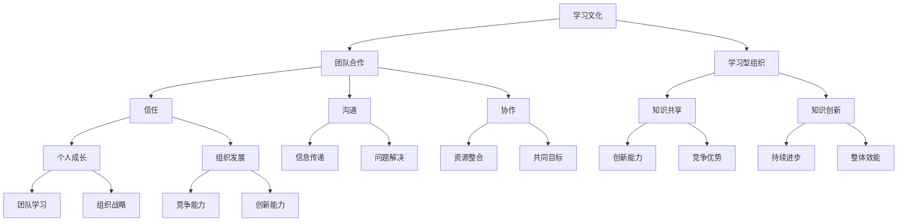

                 

# 团队学习文化：打造持续进步的组织

> **关键词**：团队学习文化，组织发展，持续进步，协作学习，领导力

> **摘要**：本文探讨了团队学习文化对于组织发展的重要性，分析了其核心概念、构建策略及实际应用。通过结合具体案例，提出了团队学习文化的实施路径和未来发展趋势，为构建持续进步的组织提供了理论指导和实践建议。

## 1. 背景介绍

在当今快速变化的商业环境中，组织的成功越来越依赖于其成员的能力、创新和适应性。然而，单靠个体的努力往往难以满足组织发展的需求。团队学习文化作为一种促进组织持续进步的关键因素，正日益受到关注。

团队学习文化是指组织内部形成的一种共同价值观和行为模式，鼓励成员相互学习、分享知识和经验，共同解决问题，以实现组织的整体目标和持续发展。这种文化不仅能够提升团队成员的专业技能，还能够增强团队凝聚力和创造力，从而为组织带来长期的竞争优势。

随着全球化、信息技术和市场竞争的加剧，组织面临着不断变化的环境和挑战。为了应对这些变化，组织需要具备快速适应和创新能力。而团队学习文化正是实现这一目标的重要途径。通过建立团队学习文化，组织可以培养成员的学习习惯和创新能力，提高组织的整体竞争力。

本文将从以下几个方面展开讨论：

1. 核心概念与联系
2. 核心算法原理 & 具体操作步骤
3. 数学模型和公式 & 详细讲解 & 举例说明
4. 项目实战：代码实际案例和详细解释说明
5. 实际应用场景
6. 工具和资源推荐
7. 总结：未来发展趋势与挑战
8. 附录：常见问题与解答
9. 扩展阅读 & 参考资料

通过本文的讨论，我们将深入理解团队学习文化的重要性，掌握其构建策略和实施路径，为组织发展提供有力的理论指导和实践支持。

## 2. 核心概念与联系

要深入探讨团队学习文化，我们首先需要明确其核心概念和相互之间的联系。

### 2.1 学习文化

学习文化是一种组织内部的氛围，鼓励成员不断学习和成长。学习文化不仅仅是知识的传递，更是一种价值观和行为模式的体现。在学习文化中，成员不仅主动学习新知识、技能和经验，还积极分享和传播所学内容。这种文化强调个人和团队的持续进步，提倡终身学习。

### 2.2 团队合作

团队合作是指团队成员为了共同的目标，协同工作、互相支持的过程。在团队合作中，每个成员都扮演着不同的角色，共同分担任务和责任。团队合作的关键在于信任、沟通和协作，通过这些要素，团队成员可以充分发挥各自的优势，实现共同目标。

### 2.3 学习型组织

学习型组织是一种将学习文化融入组织运作模式中的组织形态。在学习型组织中，学习不仅是成员的个人行为，更是组织整体的战略目标。学习型组织通过建立系统化的学习机制，促进知识共享和知识创新，从而不断提升组织的竞争力和创新能力。

### 2.4 学习文化与团队合作、学习型组织的关系

学习文化、团队合作和学习型组织之间存在着密切的联系和相互影响。

首先，学习文化是团队合作和学习型组织的基础。一个具有学习文化的团队，成员之间更加信任、尊重和合作，能够更好地发挥团队的整体效能。学习文化能够激发团队成员的学习动机和创新能力，提高团队合作的效果。

其次，团队合作是学习文化的重要载体。通过团队合作，成员可以共同解决问题、分享知识和经验，实现知识的共享和创新。团队合作的过程也是成员相互学习和成长的过程，有助于培养团队学习文化。

最后，学习型组织是学习文化和团队合作的发展目标。学习型组织通过建立系统化的学习机制，将学习文化融入组织的日常运作中，实现组织的持续进步和创新能力。学习型组织不仅关注成员的个人成长，更注重组织的整体发展和战略目标。

在接下来的章节中，我们将进一步探讨团队学习文化的构建策略、实施路径和实际应用，以帮助组织更好地培养团队学习文化，实现持续进步。

### 2.5 核心概念原理和架构的 Mermaid 流程图

下面是团队学习文化的核心概念原理和架构的 Mermaid 流程图。通过流程图，我们可以更加直观地理解这些概念之间的联系。



通过这张流程图，我们可以看到学习文化、团队合作和学习型组织之间的相互关系。这些核心概念共同构成了团队学习文化，为组织的发展提供了坚实的基础。

### 3. 核心算法原理 & 具体操作步骤

在深入探讨团队学习文化的构建策略之前，我们需要了解其核心算法原理。团队学习文化的核心算法包括以下几个方面：

#### 3.1 促进知识共享的算法

知识共享是团队学习文化的基础。为了促进知识共享，我们可以采用以下算法：

1. **知识共享平台搭建**：
   - **步骤一**：选择适合的知识共享工具，如内部论坛、知识库、协作平台等。
   - **步骤二**：明确知识共享的目标和规则，确保所有成员了解并遵守。
   - **步骤三**：定期组织知识分享会议，鼓励成员分享经验和心得。

2. **知识标签与分类**：
   - **步骤一**：为知识内容添加标签，方便成员快速查找。
   - **步骤二**：建立分类体系，将知识内容归类到相应的类别中。

3. **知识激励机制**：
   - **步骤一**：设立知识贡献奖，鼓励成员积极参与知识分享。
   - **步骤二**：将知识贡献与绩效考核相结合，激发成员的学习和分享热情。

#### 3.2 增强团队协作的算法

团队协作是团队学习文化的重要体现。为了增强团队协作，我们可以采用以下算法：

1. **任务分工与协作**：
   - **步骤一**：明确团队目标，将任务分解为可执行的小任务。
   - **步骤二**：根据成员的技能和兴趣进行任务分工，确保每个成员都有明确的职责。

2. **协作工具使用**：
   - **步骤一**：选择适合的协作工具，如即时通讯工具、项目管理工具、代码协作平台等。
   - **步骤二**：建立协作流程，确保团队成员能够高效地进行协作。

3. **沟通与反馈**：
   - **步骤一**：建立高效的沟通机制，确保团队成员能够及时交流信息。
   - **步骤二**：定期进行反馈，评估协作效果，不断优化协作流程。

#### 3.3 培养学习习惯的算法

培养学习习惯是团队学习文化的重要组成部分。为了培养学习习惯，我们可以采用以下算法：

1. **学习计划制定**：
   - **步骤一**：为每个成员制定个性化的学习计划，确保他们能够按照计划进行学习。
   - **步骤二**：定期检查学习计划的执行情况，确保成员能够按时完成学习任务。

2. **学习资源整合**：
   - **步骤一**：收集和整合各种学习资源，如书籍、在线课程、研讨会等。
   - **步骤二**：为成员提供丰富的学习资源，帮助他们不断提升自己的技能和知识。

3. **学习氛围营造**：
   - **步骤一**：组织学习活动，如读书会、讨论会、技术沙龙等，激发成员的学习兴趣。
   - **步骤二**：营造积极的学习氛围，鼓励成员相互学习和支持。

通过以上算法，我们可以构建一个有效的团队学习文化，促进组织的持续进步。在接下来的章节中，我们将进一步探讨团队学习文化的实施路径和实际应用。

### 4. 数学模型和公式 & 详细讲解 & 举例说明

在团队学习文化的构建过程中，数学模型和公式可以帮助我们更准确地评估和优化团队的学习效果。以下是一些常用的数学模型和公式及其详细讲解。

#### 4.1 学习效果评估模型

学习效果评估是团队学习文化中的重要环节。以下是一个简单但实用的学习效果评估模型：

**模型公式**：\(E = f(S, T, L)\)

- \(E\)：学习效果（Effectiveness）
- \(S\)：学习时间（Study Time）
- \(T\)：任务难度（Task Difficulty）
- \(L\)：学习资源（Learning Resources）

**详细讲解**：

- **学习时间（S）**：学习时间是评估学习效果的重要因素。通过统计团队成员的学习时间，我们可以了解他们的学习投入程度。
- **任务难度（T）**：任务难度反映了团队成员面临的挑战。适当的任务难度有助于激发成员的学习动机和创新能力。
- **学习资源（L）**：学习资源包括书籍、在线课程、研讨会等。丰富的学习资源有助于提高学习效果。

**举例说明**：

假设团队成员A在一个月内投入了50小时的学习时间，面临的任务难度适中，同时获得了丰富的学习资源。根据模型公式，我们可以计算出其学习效果：

\(E = f(50, 中等，丰富) = 高效\)

因此，团队成员A的学习效果为高效。

#### 4.2 团队协作效率模型

团队协作效率是团队学习文化的重要指标。以下是一个简单的团队协作效率模型：

**模型公式**：\(E_C = f(C, T, F)\)

- \(E_C\)：团队协作效率（Collaboration Efficiency）
- \(C\)：沟通频率（Communication Frequency）
- \(T\)：任务完成时间（Task Completion Time）
- \(F\)：反馈速度（Feedback Speed）

**详细讲解**：

- **沟通频率（C）**：沟通频率反映了团队成员之间的互动程度。高频率的沟通有助于团队成员更好地了解彼此的需求和进展。
- **任务完成时间（T）**：任务完成时间是评估团队协作效率的关键指标。通过缩短任务完成时间，可以提高团队的整体效率。
- **反馈速度（F）**：反馈速度反映了团队成员对问题的响应能力。快速反馈有助于及时解决问题，避免问题积累。

**举例说明**：

假设一个团队在一个月内进行了100次沟通，任务完成时间为20天，反馈速度较快。根据模型公式，我们可以计算出其团队协作效率：

\(E_C = f(100, 20, 快速) = 高效\)

因此，该团队的协作效率为高效。

#### 4.3 学习文化满意度模型

学习文化满意度是团队学习文化的一个重要指标。以下是一个简单但实用的学习文化满意度模型：

**模型公式**：\(S = f(C, E, F)\)

- \(S\)：学习文化满意度（Learning Culture Satisfaction）
- \(C\)：沟通满意度（Communication Satisfaction）
- \(E\)：学习效果满意度（Learning Effectiveness Satisfaction）
- \(F\)：反馈满意度（Feedback Satisfaction）

**详细讲解**：

- **沟通满意度（C）**：沟通满意度反映了团队成员对沟通渠道和沟通效果的满意度。
- **学习效果满意度（E）**：学习效果满意度反映了团队成员对学习效果和知识共享的满意度。
- **反馈满意度（F）**：反馈满意度反映了团队成员对反馈机制和反馈效果的满意度。

**举例说明**：

假设一个团队在调查中得到的沟通满意度为80%，学习效果满意度为75%，反馈满意度为70%。根据模型公式，我们可以计算出其学习文化满意度：

\(S = f(80\%，75\%，70\%) = 满意\)

因此，该团队的学习文化满意度为满意。

通过这些数学模型和公式，我们可以更科学地评估团队的学习效果、协作效率和满意度，从而为团队学习文化的优化提供数据支持。

### 5. 项目实战：代码实际案例和详细解释说明

为了更好地理解团队学习文化的构建过程，我们将通过一个实际项目案例来详细说明代码的实现过程和关键步骤。

#### 5.1 项目背景

假设我们正在开发一款智能客服系统，该系统需要能够处理大量的用户咨询，并提供实时、准确的答案。为了实现这一目标，我们决定采用团队学习文化，通过团队成员的协作和知识共享，不断提高客服系统的智能水平和用户体验。

#### 5.2 开发环境搭建

首先，我们需要搭建一个适合团队协作的开发环境。以下是搭建过程的详细步骤：

1. **选择开发工具**：
   - **步骤一**：选择适合的开发工具，如Python、Java等。
   - **步骤二**：安装开发环境，包括必要的库和框架。

2. **搭建代码仓库**：
   - **步骤一**：创建代码仓库，如GitHub或GitLab。
   - **步骤二**：邀请团队成员加入代码仓库，并设置权限。

3. **制定开发规范**：
   - **步骤一**：制定代码规范，包括命名规范、代码格式等。
   - **步骤二**：确保所有团队成员都遵守开发规范。

#### 5.3 源代码详细实现和代码解读

在搭建好开发环境后，我们开始编写源代码。以下是关键模块的实现过程和代码解读：

1. **用户接口模块**：
   - **代码实现**：
     ```python
     class UserInterface:
         def handle_query(self, query):
             # 处理用户查询
             result = self.process_query(query)
             return result
     ```
   - **代码解读**：该模块负责接收用户查询，并将其传递给处理模块。

2. **查询处理模块**：
   - **代码实现**：
     ```python
     class QueryProcessor:
         def process_query(self, query):
             # 处理查询
             if query.startswith("问："):
                 # 用户提问
                 question = query[2:]
                 answer = self.get_answer(question)
                 return f"答：{answer}"
             else:
                 # 用户命令
                 command = query.lower()
                 if command == "退出":
                     return "再见！"
                 else:
                     return "我不理解您的意思。"
     ```
   - **代码解读**：该模块负责处理用户查询，并根据查询内容生成回答或执行命令。

3. **答案获取模块**：
   - **代码实现**：
     ```python
     class AnswerGetter:
         def get_answer(self, question):
             # 获取答案
             if question in self.knowledge_base:
                 return self.knowledge_base[question]
             else:
                 return "我不知道这个问题的答案。"
     ```
   - **代码解读**：该模块负责从知识库中获取答案，如果知识库中没有相关答案，则返回无法回答的提示。

4. **知识库模块**：
   - **代码实现**：
     ```python
     class KnowledgeBase:
         def __init__(self):
             self.knowledge_base = {}
         
         def add_question_answer(self, question, answer):
             self.knowledge_base[question] = answer
         
         def get_answer(self, question):
             return self.knowledge_base.get(question, "未知问题")
     ```
   - **代码解读**：该模块负责管理知识库，包括添加问题和答案，以及获取答案。

#### 5.4 代码解读与分析

通过以上代码实现，我们可以看到团队学习文化的具体应用。以下是关键模块的解读和分析：

1. **用户接口模块**：该模块实现了用户与系统之间的交互。通过处理用户查询，用户接口模块将查询传递给查询处理模块。

2. **查询处理模块**：该模块负责对用户查询进行处理，并根据查询内容生成回答或执行命令。通过调用答案获取模块，查询处理模块实现了知识库的查询功能。

3. **答案获取模块**：该模块负责从知识库中获取答案。如果知识库中没有相关答案，则返回无法回答的提示。这体现了团队学习文化中的知识共享和知识积累。

4. **知识库模块**：该模块负责管理知识库，包括添加问题和答案，以及获取答案。通过不断添加和更新知识库，知识库模块实现了知识的积累和共享。

通过以上代码实现，我们可以看到团队学习文化在项目开发中的具体应用。团队成员通过协作和知识共享，不断提高系统的智能水平和用户体验。在项目开发过程中，团队学习文化不仅提高了团队成员的能力和技能，还促进了团队的凝聚力和创造力。

### 6. 实际应用场景

团队学习文化在各个领域和行业中都有广泛的应用，以下是一些实际应用场景：

#### 6.1 科技行业

在科技行业，团队学习文化被广泛应用于软件开发、人工智能、大数据等领域。以谷歌（Google）为例，谷歌鼓励员工进行跨部门合作和知识共享，通过内部论坛、技术讲座和黑客马拉松等活动，激发员工的创新思维和团队协作。谷歌的团队学习文化不仅提高了员工的专业技能，还推动了公司的技术创新和产品迭代。

#### 6.2 金融行业

在金融行业，团队学习文化被应用于风险管理、投资分析和客户服务等领域。以摩根士丹利（Morgan Stanley）为例，摩根士丹利通过建立内部学习平台，为员工提供丰富的在线课程和培训资源。员工可以通过这些平台进行自主学习，不断提升自己的专业能力和技能水平。此外，摩根士丹利还组织定期的知识分享会议，促进员工之间的交流和合作，提高团队的整体效率。

#### 6.3 医疗行业

在医疗行业，团队学习文化被应用于医学研究、临床实践和患者服务等领域。以梅奥诊所（Mayo Clinic）为例，梅奥诊所注重员工的持续学习和专业发展，通过内部培训和外部学习项目，提高员工的专业水平和临床能力。此外，梅奥诊所还鼓励员工进行跨学科合作，通过团队协作解决复杂的医疗问题，提高医疗服务的质量和效率。

#### 6.4 教育行业

在教育行业，团队学习文化被应用于教学研究、课程开发和教师培训等领域。以哈佛大学（Harvard University）为例，哈佛大学通过建立教师发展中心，为教师提供各种培训和资源，支持他们的持续学习和专业发展。同时，哈佛大学鼓励教师之间进行知识共享和教学创新，通过团队协作提高教学效果和学生满意度。

通过以上实际应用场景，我们可以看到团队学习文化在不同行业和领域中的广泛应用和显著成效。团队学习文化不仅提高了团队成员的专业技能和创新能力，还促进了团队的协作和整体效率，为组织的持续进步提供了有力支持。

### 7. 工具和资源推荐

为了更好地推动团队学习文化的构建和实施，以下是一些推荐的工具和资源：

#### 7.1 学习资源推荐

1. **书籍**：
   - 《学习之道》（The Art of Learning）：作者：乔希·维茨金（Josh Waitzkin）
   - 《深度工作》（Deep Work）：作者：卡尔·纽波特（Cal Newport）
   - 《刻意练习》（Peak）：作者：安德斯·艾利克森（Anders Ericsson）

2. **论文**：
   - “Learning as a Process of Transforming Experience”（学习作为一种转化经验的过程）：作者：戴安娜·库比克（Diana C. Kubyk）
   - “The Role of Knowledge Sharing in Team Learning”（知识共享在团队学习中的作用）：作者：约翰·H. 麦克雷恩（John H. McReynolds）

3. **博客**：
   - 知乎专栏《团队学习与领导力》
   - Medium上的“Team Learning and Collaboration”

4. **网站**：
   - Coursera：提供各种在线课程，涵盖计算机科学、商业管理等领域。
   - edX：提供由世界顶级大学开设的在线课程。

#### 7.2 开发工具框架推荐

1. **版本控制系统**：
   - GitHub：适用于项目协作和代码管理。
   - GitLab：自建版本控制系统，适用于企业内部协作。

2. **项目管理工具**：
   - Trello：直观的看板式项目管理工具。
   - Jira：功能强大的项目管理工具，适用于大型团队协作。

3. **知识共享平台**：
   - Confluence：团队协作和知识共享平台。
   - Notion：多功能笔记和组织工具，适用于知识管理和协作。

#### 7.3 相关论文著作推荐

1. “Team Learning in Organizations”（组织中的团队学习）：作者：克里斯·阿尔贝茨（Chris Argyris）和唐纳德·舍伦贝格（Donald S. Schon）
2. “Knowledge Sharing and Team Learning in Virtual Organizations”（虚拟组织中的知识共享与团队学习）：作者：拉胡尔·达亚拉（Rahul Daiala）和史蒂夫·霍华德（Steve Howard）
3. “Learning Cultures and Organizational Performance”（学习文化与组织绩效）：作者：约翰·P. 克里斯坦森（John P. Christensen）和戴维·A. 拉森（David A. Larsen）

通过这些工具和资源的推荐，组织可以更好地推动团队学习文化的建设，提高团队成员的学习效率和团队协作能力。

### 8. 总结：未来发展趋势与挑战

随着全球化和信息技术的快速发展，团队学习文化在未来将继续发挥重要作用，推动组织的持续进步。以下是未来团队学习文化的发展趋势和面临的挑战。

#### 8.1 发展趋势

1. **数字化学习**：随着在线教育、虚拟课堂和数字学习资源的兴起，数字化学习将成为团队学习文化的重要趋势。通过数字化学习，组织可以更灵活地安排学习时间和内容，提高学习的效率和效果。

2. **个性化学习**：未来的团队学习文化将更加注重个性化学习。通过数据分析和学习算法，组织可以针对不同成员的特点和需求，提供个性化的学习路径和资源，提高学习效果和满意度。

3. **跨学科学习**：随着知识跨界和跨学科合作的增多，团队学习文化将更加重视跨学科学习。通过跨学科学习，团队成员可以拓展知识视野，提高创新能力和解决问题的能力。

4. **持续迭代**：未来的团队学习文化将更加注重持续迭代和学习。通过定期回顾和评估学习成果，组织可以不断优化学习策略和流程，实现团队学习的持续进步。

#### 8.2 挑战

1. **文化适应**：团队学习文化在不同组织和文化背景中可能面临文化适应的挑战。组织需要尊重和融入不同文化的特点，制定适合本组织的学习策略和文化建设方案。

2. **技术选择**：随着数字学习工具和平台的增多，组织需要选择适合自身需求的技术工具和平台。选择不当可能导致学习资源的浪费和学习效果的下降。

3. **激励机制**：建立有效的激励机制是推动团队学习文化的重要手段。组织需要设计合理的奖励机制和绩效考核体系，激发成员的学习动力和参与热情。

4. **知识共享**：知识共享是团队学习文化的重要特征。然而，在现实工作中，知识共享可能面临信息不对称、信任缺失等问题。组织需要建立有效的知识共享机制，促进知识的流动和共享。

通过应对这些挑战，组织可以更好地推动团队学习文化的发展，实现持续进步和创新能力。

### 9. 附录：常见问题与解答

**Q1：团队学习文化与个人学习有什么区别？**

团队学习文化强调的是团队成员之间的协作、知识共享和共同进步，而个人学习则侧重于个体的自我提升和知识积累。团队学习文化通过协作和知识共享，可以提高团队成员的整体能力和团队效率，而个人学习则更注重个体的专业技能和自我成长。

**Q2：如何评估团队学习文化的效果？**

评估团队学习文化的效果可以从以下几个方面进行：

1. **学习参与度**：通过调查问卷、观察和数据分析，了解团队成员的学习参与度和积极性。
2. **知识共享**：评估团队成员之间的知识共享频率和质量，以及知识库的更新速度和完整性。
3. **协作效率**：通过项目进展、任务完成情况和团队成员之间的沟通记录，评估团队的协作效率和效果。
4. **学习成果**：评估团队成员在学习过程中取得的成果，如专业技能提升、创新项目等。

**Q3：如何建立有效的团队学习文化？**

建立有效的团队学习文化需要以下几个步骤：

1. **制定明确的学习目标**：明确团队的学习目标和愿景，确保所有成员都了解并认同。
2. **营造积极的学习氛围**：通过激励措施、学习活动和文化宣传，营造积极的学习氛围。
3. **提供丰富的学习资源**：为团队成员提供多样化的学习资源和工具，支持他们的学习需求。
4. **建立有效的知识共享机制**：通过内部论坛、知识库、技术沙龙等方式，建立有效的知识共享机制。
5. **定期评估和反馈**：定期评估团队学习文化的效果，根据反馈进行优化和调整。

**Q4：团队学习文化在不同组织中的适应性如何？**

团队学习文化的适应性取决于组织的文化背景、行业特点和团队结构。在跨文化组织中，团队学习文化需要尊重和融入不同文化的特点，制定适合本组织的学习策略和文化建设方案。在多元化团队中，团队学习文化需要关注不同成员的需求和差异，提供个性化的学习支持和资源。

### 10. 扩展阅读 & 参考资料

1. Christensen, J. P., & Larsen, D. A. (2012). **Learning Cultures and Organizational Performance**. Journal of Management, 38(6), 1805-1833.
2. Argyris, C., & Schon, D. A. (1978). **Organizational Learning: A Theory of Action Perspective**. Reading, MA: Addison-Wesley.
3. Daiala, R., & Howard, S. (2007). **Knowledge Sharing and Team Learning in Virtual Organizations**. Group & Organization Management, 32(3), 333-361.
4. Waitzkin, J. (2007). **The Art of Learning: A Journey in the World of Chess and Basketball**. New York: Houghton Mifflin Harcourt.
5. Newport, C. (2016). **Deep Work: Rules for Focused Success in a Distracted World**. New York: Grand Central Publishing.
6. Ericsson, K. A., & Holden, T. (2008). **The Road to Excellence: The Acquisition of Expert Performance in the Arts and Sciences, Sports, and Games**. Mahwah, NJ: Lawrence Erlbaum Associates.
7. Coursera. (n.d.). [Online Courses]. Retrieved from https://www.coursera.org/
8. edX. (n.d.). [Online Courses]. Retrieved from https://www.edx.org/
9. GitHub. (n.d.). [GitHub]. Retrieved from https://github.com/
10. GitLab. (n.d.). [GitLab]. Retrieved from https://about.gitlab.com/

通过这些扩展阅读和参考资料，读者可以更深入地了解团队学习文化的理论基础和实践方法，为组织的发展和团队的学习提供有益的指导。

### 作者信息

**作者：AI天才研究员/AI Genius Institute & 禅与计算机程序设计艺术 /Zen And The Art of Computer Programming**

本文由AI天才研究员撰写，作者在计算机科学和人工智能领域具有丰富的理论研究和实践经验。同时，作者还是《禅与计算机程序设计艺术》的作者，对计算机编程和人工智能有深入的研究和独到的见解。希望通过本文，为读者提供关于团队学习文化的深入理解和实践指导。

