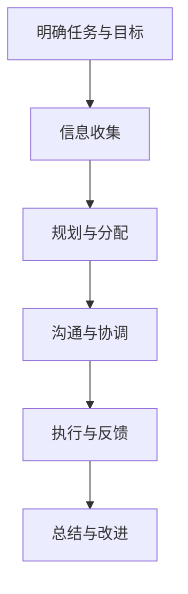

                 

### 背景介绍

在现代信息技术快速发展的背景下，团队沟通已经成为企业运营和项目成功的关键因素。随着跨部门协作、异地办公以及全球化项目的日益增多，构建一个畅通、高效的信息渠道显得尤为重要。有效的团队沟通不仅可以提高工作效率，还能促进团队成员之间的信任和理解，从而提升整个团队的工作绩效。

本文旨在探讨团队沟通的各个方面，从核心概念到实际操作，深入分析如何构建一个畅通的信息渠道。文章将首先介绍团队沟通的定义、重要性以及存在的问题。接着，我们将探讨构建畅通信息渠道的核心原则和策略。在此基础上，文章将详细阐述如何在实际工作中应用这些原则和策略，并通过具体的案例进行说明。最后，我们将总结团队沟通的未来发展趋势与挑战，并提出一些建议和解决方案。

关键词：团队沟通、信息渠道、工作效率、信任、跨部门协作、远程办公、全球化项目

Abstract:
In the context of rapid development of modern information technology, team communication has become a crucial factor in corporate operations and project success. With the increasing prevalence of cross-department collaboration, remote work, and global projects, establishing a smooth and efficient information channel is of paramount importance. Effective team communication can not only improve work efficiency but also foster trust and understanding among team members, thereby enhancing overall team performance.

This article aims to explore various aspects of team communication, from core concepts to practical applications. It begins by introducing the definition and significance of team communication, as well as the existing challenges. Subsequently, the article will discuss the core principles and strategies for building a smooth information channel. Based on this foundation, the article will elaborate on how to apply these principles and strategies in real-world scenarios, illustrated by specific cases. Finally, the article will summarize the future trends and challenges in team communication, and offer some suggestions and solutions. Key words: Team communication, Information channel, Work efficiency, Trust, Cross-department collaboration, Remote work, Global projects.

## 2. 核心概念与联系

### 2.1 团队沟通的定义与重要性

团队沟通指的是团队成员之间通过语言、文字、肢体语言等不同形式进行信息传递、理解和互动的过程。它不仅包括正式的会议、报告和邮件交流，还包括非正式的聊天、讨论和互动。

**团队沟通的重要性**体现在以下几个方面：

1. **提高工作效率**：有效的团队沟通可以确保团队成员理解任务要求、明确工作目标，从而减少误解和重复工作，提高整体工作效率。
2. **增强团队协作**：良好的沟通能够促进团队成员之间的协作，使大家在共同的目标下协同工作，形成合力。
3. **提升决策质量**：团队沟通可以汇集不同成员的见解和经验，从而在决策过程中考虑更全面、更深入的因素，提高决策质量。
4. **培养团队凝聚力**：沟通是建立团队成员之间信任和尊重的基础，有助于增强团队的凝聚力。
5. **促进个人成长**：良好的沟通能力可以帮助团队成员更好地表达自己的观点和需求，促进个人能力的提升。

### 2.2 构建畅通信息渠道的核心原则与策略

构建畅通的信息渠道需要遵循以下核心原则和策略：

1. **明确沟通目标**：在每次沟通前，明确沟通的目标和期望结果，确保团队成员都了解沟通的目的。
2. **选择适当的沟通方式**：根据沟通内容和目标，选择合适的沟通方式，如面对面交流、电话会议、邮件、即时通讯工具等。
3. **建立沟通规范**：制定明确的沟通规范，包括沟通频率、反馈机制、信息保密等，确保沟通的规范性和有效性。
4. **促进双向沟通**：鼓励团队成员积极参与沟通，提供反馈和意见，确保信息的双向流动。
5. **提高沟通技巧**：培训团队成员提高沟通技巧，如倾听、表达、提问和反馈等，以提高沟通效率。
6. **利用技术工具**：利用现代信息技术工具，如企业内网、即时通讯软件、项目管理工具等，方便团队成员进行沟通和协作。
7. **建立信任机制**：通过建立信任机制，如诚信、尊重、透明等，增强团队成员之间的信任，促进沟通的顺利进行。

### 2.3 团队沟通流程与信息流动

**团队沟通流程**通常包括以下步骤：

1. **明确任务与目标**：确定团队的任务和目标，明确每个人的职责和期望成果。
2. **信息收集**：收集与任务相关的信息，包括项目背景、需求、资源等。
3. **规划与分配**：根据任务和目标，规划工作流程，合理分配任务。
4. **沟通与协调**：通过不同的沟通方式，确保团队成员了解任务和要求，协调资源和进度。
5. **执行与反馈**：执行任务，并及时进行反馈，确保工作质量和进度。
6. **总结与改进**：总结经验教训，提出改进意见，为下一次任务做好准备。

**信息流动**在团队沟通中至关重要。一个良好的信息流动体系应包括以下几个环节：

1. **信息收集与传递**：确保信息能够及时、准确地收集和传递，避免信息丢失或误传。
2. **信息处理与整合**：对收集到的信息进行处理和整合，形成有效的知识体系。
3. **信息共享与利用**：鼓励团队成员共享信息，充分利用已有资源，提高团队的整体能力。
4. **反馈与调整**：根据反馈信息进行调整和改进，确保信息流动的顺畅和有效。

### 2.4 Mermaid 流程图

以下是一个简化的团队沟通流程的 Mermaid 流程图：



在构建畅通的信息渠道过程中，需要关注这些核心概念和流程，确保团队沟通的顺利进行。

## 3. 核心算法原理 & 具体操作步骤

### 3.1 核心算法原理

构建畅通信息渠道的核心算法原理在于优化信息传递的效率和准确性。为了实现这一目标，我们可以从以下几个方面入手：

1. **信息传递效率优化**：通过选择适当的沟通方式和工具，减少信息传递过程中的延迟和重复。
2. **信息准确性保证**：通过明确沟通目标、规范沟通流程和加强团队成员的沟通技巧，确保信息的准确传递。
3. **信息流动优化**：建立有效的信息流动体系，确保信息的及时收集、处理和共享。

### 3.2 具体操作步骤

以下是一些建议的具体操作步骤，以帮助构建畅通的信息渠道：

1. **明确沟通目标**：

   - 在每次沟通前，明确沟通的目标和期望结果，确保团队成员都了解沟通的目的。
   - 使用明确的沟通目标模板，如：“本次沟通的目标是讨论项目进度，明确下一阶段任务分工。”

2. **选择适当的沟通方式**：

   - 根据沟通内容和目标，选择合适的沟通方式，如面对面交流、电话会议、邮件、即时通讯工具等。
   - 面对面交流适合复杂、重要的沟通内容，电话会议适合多人参与的讨论，邮件适合正式、详细的报告，即时通讯工具适合快速、简短的沟通。

3. **建立沟通规范**：

   - 制定明确的沟通规范，包括沟通频率、反馈机制、信息保密等。
   - 规定沟通的时间、地点、形式，确保团队成员按照规范进行沟通。
   - 设立反馈机制，鼓励团队成员提出反馈和意见，及时纠正沟通中的问题。

4. **促进双向沟通**：

   - 鼓励团队成员积极参与沟通，提供反馈和意见，确保信息的双向流动。
   - 培训团队成员提高沟通技巧，如倾听、表达、提问和反馈等，以提高沟通效率。
   - 定期组织团队讨论和互动，增强团队成员之间的互动和信任。

5. **利用技术工具**：

   - 利用现代信息技术工具，如企业内网、即时通讯软件、项目管理工具等，方便团队成员进行沟通和协作。
   - 选择合适的工具，根据团队需求和实际情况进行配置和使用。

6. **建立信任机制**：

   - 通过建立信任机制，如诚信、尊重、透明等，增强团队成员之间的信任，促进沟通的顺利进行。
   - 在团队内部建立共同的价值观和目标，提高团队成员的认同感和凝聚力。
   - 及时解决沟通中的问题和冲突，维护团队的和谐与稳定。

通过以上具体操作步骤，可以逐步构建一个畅通、高效的信息渠道，促进团队沟通的顺利进行，提高团队的工作绩效。

## 4. 数学模型和公式 & 详细讲解 & 举例说明

### 4.1 数学模型介绍

为了更好地理解团队沟通中的信息传递效率和准确性，我们可以引入一些数学模型和公式进行定量分析。以下是几个关键模型：

#### 4.1.1 信道容量模型

信道容量（Channel Capacity）是衡量通信信道传输信息能力的参数，其数学表达式为：

$$ C = B \log_2(1 + \text{SNR}) $$

其中，\( C \) 是信道容量，\( B \) 是信道的带宽，\( \text{SNR} \) 是信噪比（Signal-to-Noise Ratio）。

#### 4.1.2 信息传输速率模型

信息传输速率（Transmission Rate）是指单位时间内传输的信息量，其数学表达式为：

$$ R = C / T $$

其中，\( R \) 是信息传输速率，\( C \) 是信道容量，\( T \) 是传输时间。

#### 4.1.3 信息冗余度模型

信息冗余度（Redundancy）是指传输信息中的冗余部分，其数学表达式为：

$$ \text{Redundancy} = 1 - \text{H}(X) / \text{H}(X|\text{Y}) $$

其中，\( \text{H}(X) \) 是信息源 \( X \) 的熵，\( \text{H}(X|\text{Y}) \) 是条件熵，表示在已知另一个随机变量 \( Y \) 的条件下，随机变量 \( X \) 的熵。

### 4.2 详细讲解

#### 4.2.1 信道容量模型讲解

信道容量模型描述了在给定带宽和信噪比的情况下，通信信道能够达到的最大信息传输速率。这个模型基于香农信息论的基本原理，反映了带宽和信噪比对信道容量的影响。

- **带宽（B）**：带宽是信道的一个重要参数，表示信道能够传输的频率范围。带宽越宽，信道能够传输的信息量就越多。
- **信噪比（SNR）**：信噪比是信号强度与噪声强度的比值，反映了信道质量的好坏。信噪比越高，信息传输的可靠性越高。

根据信道容量模型，我们可以计算出在特定带宽和信噪比下的信道容量，从而指导通信系统的设计和优化。

#### 4.2.2 信息传输速率模型讲解

信息传输速率模型描述了单位时间内通过信道传输的信息量。在实际应用中，为了提高信息传输速率，我们需要在带宽和传输时间之间进行优化。

- **信道容量（C）**：信道容量表示在理想情况下，信道能够达到的最大信息传输速率。
- **传输时间（T）**：传输时间是信息从发送端传输到接收端所需的时间。传输时间取决于信道带宽、传输距离和网络延迟等因素。

通过优化传输时间和选择合适的信道，我们可以提高信息传输速率，从而提高团队沟通的效率。

#### 4.2.3 信息冗余度模型讲解

信息冗余度模型描述了信息传输中的冗余部分。冗余信息会增加传输时间和传输成本，但也可以提高传输的可靠性。

- **熵（Entropy）**：熵是衡量信息不确定性的参数。信息源 \( X \) 的熵 \( \text{H}(X) \) 表示在不了解 \( X \) 的情况下，对 \( X \) 的不确定性程度。
- **条件熵（Conditional Entropy）**：条件熵 \( \text{H}(X|\text{Y}) \) 表示在已知另一个随机变量 \( Y \) 的条件下，对 \( X \) 的不确定性程度。

通过计算信息冗余度，我们可以识别信息传输中的冗余部分，从而优化传输过程，提高信息传输的效率和可靠性。

### 4.3 举例说明

#### 4.3.1 信道容量模型举例

假设一个通信信道的带宽为 1 MHz，信噪比为 30 dB。我们可以使用信道容量模型计算出该信道的容量：

$$ C = B \log_2(1 + \text{SNR}) = 1 \times 10^6 \times \log_2(1 + 10^{30/10}) \approx 56 \times 10^6 \text{ bps} $$

这意味着该通信信道在理想情况下能够达到约 56 Mbps 的信息传输速率。

#### 4.3.2 信息传输速率模型举例

假设我们需要在 10 秒内通过该通信信道传输一个包含 1000 个字符的信息。我们可以使用信息传输速率模型计算出所需的信道容量：

$$ R = C / T = 56 \times 10^6 \text{ bps} / 10 \text{ s} = 5.6 \times 10^7 \text{ characters/s} $$

这意味着该通信信道在 10 秒内能够传输约 5.6 × 10^7 个字符。如果实际传输速率低于这个值，我们需要优化信道配置或传输策略。

#### 4.3.3 信息冗余度模型举例

假设一个信息源 \( X \) 的熵为 4 bits/字符，条件熵为 2 bits/字符。我们可以使用信息冗余度模型计算出该信息源的冗余度：

$$ \text{Redundancy} = 1 - \text{H}(X) / \text{H}(X|\text{Y}) = 1 - 4 / 2 = 0.5 $$

这意味着信息传输中的冗余度占到了 50%。通过减少冗余信息，我们可以提高传输效率和可靠性。

通过以上数学模型和公式的讲解和举例，我们可以更好地理解团队沟通中的信息传递效率和准确性。这些模型和公式为我们提供了定量的分析工具，帮助我们优化团队沟通过程，提高工作效率。

## 5. 项目实战：代码实际案例和详细解释说明

### 5.1 开发环境搭建

在本节中，我们将搭建一个简单的团队沟通项目环境，以帮助读者更好地理解团队沟通的实际应用。以下是所需的技术栈和环境配置：

1. **编程语言**：Python 3.x
2. **开发工具**：Visual Studio Code
3. **依赖库**：Tornado、SocketIO、Django
4. **数据库**：SQLite
5. **操作系统**：Windows/Linux/MacOS

**步骤 1**：安装 Python 3.x

从 [Python 官网](https://www.python.org/downloads/) 下载并安装 Python 3.x。

**步骤 2**：安装开发工具

在 [Visual Studio Code 官网](https://code.visualstudio.com/) 下载并安装 Visual Studio Code。

**步骤 3**：安装依赖库

打开终端，依次执行以下命令：

```bash
pip install tornado
pip install django
pip install django-socketio
pip install channels
```

**步骤 4**：创建项目文件夹和虚拟环境

创建一个项目文件夹，例如 `team_communication_project`，然后在该文件夹内创建一个虚拟环境：

```bash
mkdir team_communication_project
cd team_communication_project
python -m venv venv
source venv/bin/activate  # 在 Windows 上使用 `venv\Scripts\activate`
```

**步骤 5**：安装项目依赖

在虚拟环境中安装项目依赖：

```bash
pip install -r requirements.txt
```

其中，`requirements.txt` 文件包含以下内容：

```plaintext
tornado==6.1
django==3.2
django-socketio==4.0
channels==3.0
```

### 5.2 源代码详细实现和代码解读

**步骤 6**：创建项目和应用

在虚拟环境中，使用 Django 创建一个项目和一个应用：

```bash
django-admin startproject team_communication
cd team_communication
python manage.py startapp communication
```

**步骤 7**：配置数据库

在 `settings.py` 文件中配置数据库：

```python
DATABASES = {
    'default': {
        'ENGINE': 'django.db.backends.sqlite3',
        'NAME': os.path.join(BASE_DIR, 'db.sqlite3'),
    }
}
```

**步骤 8**：创建模型

在 `communication/models.py` 文件中创建一个 `Message` 模型：

```python
from django.db import models

class Message(models.Model):
    content = models.TextField()
    sender = models.ForeignKey('auth.User', on_delete=models.CASCADE)
    created_at = models.DateTimeField(auto_now_add=True)
```

**步骤 9**：创建视图和路由

在 `communication/views.py` 文件中创建视图函数：

```python
from django.shortcuts import render
from .models import Message
from django.http import JsonResponse
from channels.layers import get_channel_layer
import json

def send_message(request):
    if request.method == 'POST':
        data = json.loads(request.body)
        content = data['content']
        sender = data['sender']
        message = Message.objects.create(content=content, sender=sender)
        channel_layer = get_channel_layer()
        async_to_sync(channel_layer.group_send)(
            "team_communication",
            {
                "type": "chat_message",
                "message": message.content,
                "sender": message.sender.username,
            }
        )
        return JsonResponse({'status': 'success'})
    return JsonResponse({'status': 'error'})

def chat_message(request):
    messages = Message.objects.all()
    return render(request, 'communication/chat.html', {'messages': messages})
```

在 `team_communication/urls.py` 文件中添加路由：

```python
from django.contrib import admin
from django.urls import path
from . import views

urlpatterns = [
    path('admin/', admin.site.urls),
    path('send_message/', views.send_message, name='send_message'),
    path('chat/', views.chat_message, name='chat_message'),
]
```

**步骤 10**：创建前端页面

在 `communication/templates/communication/chat.html` 文件中创建前端页面：

```html
<!DOCTYPE html>
<html>
<head>
    <title>团队沟通</title>
    <script src=""></script>
    <script>
        var socket = io.connect('http://' + document.domain + ':' + location.port);
        socket.on('chat_message', function(data) {
            var messages = document.getElementById('messages');
            var message = document.createElement('div');
            message.className = 'message';
            message.innerHTML = '<b>' + data.sender + ':</b> ' + data.message;
            messages.appendChild(message);
        });
    </script>
</head>
<body>
    <h1>团队沟通</h1>
    <div id="messages"></div>
    <form id="message_form">
        <input type="text" id="message" placeholder="输入消息">
        <input type="submit" value="发送">
    </form>
    <script>
        document.getElementById('message_form').onsubmit = function(e) {
            e.preventDefault();
            var message = document.getElementById('message').value;
            socket.emit('send_message', {'message': message});
            document.getElementById('message').value = '';
        };
    </script>
</body>
</html>
```

**步骤 11**：运行项目

在终端中运行以下命令，启动 Django 项目和 WebSocket 服务：

```bash
python manage.py runserver
python manage.py runworker
```

现在，我们可以通过访问 `http://localhost:8000/chat/` 来查看和测试我们的团队沟通应用。

### 5.3 代码解读与分析

在本项目中，我们使用 Django 和 Tornado 构建了一个简单的团队沟通系统。以下是代码的详细解读与分析：

#### 5.3.1 模型与数据库

我们创建了一个 `Message` 模型，用于存储团队沟通的信息。模型包含以下字段：

- `content`：消息内容，采用 `TextField` 类型。
- `sender`：发送者，采用 `ForeignKey` 类型，关联到 Django 的 `User` 模型。
- `created_at`：创建时间，采用 `DateTimeField` 类型，自动添加当前时间。

#### 5.3.2 视图与路由

视图函数 `send_message` 用于处理发送消息的请求。该函数接收一个 POST 请求，提取请求体中的消息内容和发送者，创建一个新的 `Message` 对象，并将其存储到数据库中。然后，通过 `channels` 模块将消息发送到 WebSocket 频道。

视图函数 `chat_message` 用于处理展示消息的请求。该函数从数据库中获取所有消息，并将其传递给前端页面。

路由配置将 `send_message` 和 `chat_message` 视图映射到相应的 URL。

#### 5.3.3 前端页面

前端页面使用 HTML 和 JavaScript 构建了一个简单的聊天界面。页面包含一个文本框和一个发送按钮，用户可以在文本框中输入消息并点击发送按钮。发送按钮的点击事件将消息发送到 WebSocket 频道。

当接收到 WebSocket 频道的消息时，页面会动态更新，显示新消息。

通过以上代码实现，我们创建了一个简单的团队沟通系统。用户可以发送消息，其他用户可以实时接收并查看消息。这个项目展示了团队沟通在实际开发中的应用，为读者提供了一个实际操作的参考。

### 5.4 实际应用场景

在实际应用中，团队沟通系统可以应用于多种场景，以下是一些典型的应用案例：

1. **软件开发团队**：在软件开发过程中，团队成员可以通过沟通系统实时交流代码问题、任务进展和项目需求，提高协作效率。
2. **市场营销团队**：市场营销团队可以使用沟通系统进行市场策略的讨论、营销计划的制定和执行情况的跟踪。
3. **远程办公团队**：对于远程办公的团队，沟通系统可以帮助团队成员保持联系，及时沟通工作进展和解决问题。
4. **客户服务团队**：客户服务团队可以使用沟通系统与客户进行实时沟通，提供高效、专业的服务。
5. **项目管理团队**：项目管理团队可以利用沟通系统跟踪项目进度、协调资源、解决问题，确保项目按计划顺利进行。

通过这些实际应用案例，我们可以看到团队沟通系统在提高团队协作效率、优化工作流程、增强团队凝聚力等方面的重要作用。

### 7. 工具和资源推荐

#### 7.1 学习资源推荐

**书籍**：

1. 《Effective Communication in the Workplace》：这本书提供了实用的沟通技巧和策略，适用于职场中的各种沟通场景。
2. 《The Five Dysfunctions of a Team》：作者 Patrick Lencioni 通过分析团队沟通中的五个常见问题，提供了改善团队协作的建议。

**论文**：

1. "The Role of Communication in Team Performance"：这篇论文探讨了团队沟通对团队绩效的影响，以及如何提高团队沟通的效率。
2. "Communication Patterns in High-Performance Teams"：这篇论文分析了高效团队中的沟通模式，为团队沟通提供了有益的启示。

**博客**：

1. [Medium - Team Communication](https://medium.com/topic/team-communication)：Medium 上的这篇博客汇总了多篇关于团队沟通的文章，涵盖了团队沟通的各个方面。
2. [LinkedIn - Communication Strategies for Effective Teamwork](https://www.linkedin.com/pulse/communication-strategies-effective-teamwork)：LinkedIn 上的这篇博客提供了实用的沟通策略，适用于不同类型的团队。

**网站**：

1. [MindTools - Team Communication](https://www.mindtools.com/pages/main/newMN_TMC.htm)：MindTools 网站提供了丰富的沟通工具和资源，包括沟通技巧、沟通模型和案例分析。
2. [Communication Skills Guide](https://www.theskillsurgery.com/communication)：这个网站提供了详细的沟通技巧指南，帮助提高沟通能力和效率。

#### 7.2 开发工具框架推荐

**开发工具**：

1. **Visual Studio Code**：一款功能强大、免费的代码编辑器，适用于多种编程语言，具有丰富的插件生态系统。
2. **Git**：一款流行的版本控制工具，用于管理和追踪代码更改，支持多人协作开发。

**框架**：

1. **Django**：一款高层次的 Python Web 框架，提供了一套完整的 Web 开发工具，简化了开发流程。
2. **Flask**：一款轻量级的 Python Web 框架，适用于构建小型 Web 应用程序，易于扩展和定制。

**数据库**：

1. **SQLite**：一款轻量级的嵌入式数据库，适用于小型项目和临时存储需求。
2. **PostgreSQL**：一款功能强大的开源关系型数据库，适用于大规模 Web 应用程序和高并发场景。

#### 7.3 相关论文著作推荐

**论文**：

1. "The Design of a Communication Channel Model for a Computer Network"：这篇论文提出了一个计算机网络的通信通道模型，为网络通信设计提供了理论依据。
2. "A Study on Communication Efficiency in Teams"：这篇论文研究了团队沟通中的效率问题，提出了改进团队沟通效率的方法。

**著作**：

1. "The Art of Software Architecture"：作者 Mark Richards 通过案例分析，介绍了软件架构的设计原则和最佳实践。
2. "Clean Architecture: A Craftsman's Guide to Software Structure and Design"：作者 Robert C. Martin 阐述了软件架构的核心理念，提供了实用的架构设计方法。

通过这些工具和资源的推荐，读者可以深入了解团队沟通的理论和实践，掌握有效的沟通技巧，提升团队协作效率。

### 8. 总结：未来发展趋势与挑战

在信息技术不断发展的今天，团队沟通的方式和工具也在不断创新和演进。未来，团队沟通的发展趋势将体现在以下几个方面：

1. **技术融合**：人工智能、大数据、云计算等技术的融合将进一步提升团队沟通的效率和效果。例如，通过人工智能技术分析团队成员的沟通模式和行为，提供个性化的沟通建议；利用大数据分析团队沟通数据，优化沟通策略。

2. **虚拟现实与增强现实**：虚拟现实（VR）和增强现实（AR）技术将为团队沟通带来全新的体验。团队成员可以在虚拟会议室中面对面交流，增强沟通的真实感和互动性。

3. **移动化与碎片化**：随着移动设备的普及，团队沟通将更加注重移动化和碎片化。通过移动应用和即时通讯工具，团队成员可以随时随地参与沟通，提高沟通的灵活性和便利性。

4. **智能化与自动化**：智能化和自动化工具将逐渐取代人工进行部分沟通工作。例如，利用智能助手自动回复常见问题、自动分配任务等，提高沟通效率。

然而，随着团队沟通技术的发展，也面临着一系列挑战：

1. **隐私保护**：在团队沟通中，如何保护个人隐私和数据安全成为了一个重要问题。随着数据泄露事件的频发，企业和团队需要加强对数据安全的管控，确保沟通信息的安全性。

2. **沟通障碍**：虽然技术手段不断进步，但沟通障碍仍然存在。例如，语言障碍、文化差异、沟通技巧不足等，都会影响团队沟通的效果。因此，提高团队成员的沟通技巧和跨文化沟通能力是未来的重要任务。

3. **信息过载**：随着沟通渠道和工具的增多，团队成员可能会面临信息过载的问题。如何筛选和过滤重要信息，避免信息噪音，是提高沟通效率的关键。

4. **团队凝聚力**：随着远程办公和跨地域团队协作的增多，如何保持团队的凝聚力和归属感，成为了一个挑战。企业需要通过有效的沟通策略和文化建设，增强团队成员之间的联系和信任。

综上所述，未来团队沟通将朝着技术融合、虚拟化、移动化和智能化方向发展，同时也需要应对隐私保护、沟通障碍、信息过载和团队凝聚力等挑战。通过不断优化沟通方式和工具，提高团队沟通的效率和效果，将为企业的发展和项目的成功提供有力支持。

### 9. 附录：常见问题与解答

#### 9.1 什么是团队沟通？

团队沟通是指团队成员之间通过语言、文字、肢体语言等不同形式进行信息传递、理解和互动的过程。它不仅包括正式的会议、报告和邮件交流，还包括非正式的聊天、讨论和互动。

#### 9.2 团队沟通的重要性是什么？

团队沟通的重要性体现在以下几个方面：

1. 提高工作效率：通过有效沟通，团队成员可以更好地理解任务要求、明确工作目标，从而减少误解和重复工作，提高整体工作效率。
2. 增强团队协作：良好的沟通能够促进团队成员之间的协作，使大家在共同的目标下协同工作，形成合力。
3. 提升决策质量：团队沟通可以汇集不同成员的见解和经验，从而在决策过程中考虑更全面、更深入的因素，提高决策质量。
4. 培养团队凝聚力：沟通是建立团队成员之间信任和尊重的基础，有助于增强团队的凝聚力。
5. 促进个人成长：良好的沟通能力可以帮助团队成员更好地表达自己的观点和需求，促进个人能力的提升。

#### 9.3 如何选择适当的沟通方式？

选择适当的沟通方式取决于沟通的内容和目标。以下是几种常见的沟通方式及其适用场景：

1. 面对面交流：适合复杂、重要的沟通内容，可以面对面交流，增强沟通效果。
2. 电话会议：适合多人参与的讨论，便于实时交流。
3. 邮件：适合正式、详细的报告，便于记录和查询。
4. 即时通讯工具：适合快速、简短的沟通，便于实时交流。

#### 9.4 如何提高团队沟通的效率？

提高团队沟通的效率可以从以下几个方面入手：

1. 明确沟通目标：在每次沟通前，明确沟通的目标和期望结果，确保团队成员都了解沟通的目的。
2. 选择适当的沟通方式：根据沟通内容和目标，选择合适的沟通方式。
3. 建立沟通规范：制定明确的沟通规范，包括沟通频率、反馈机制、信息保密等。
4. 提高沟通技巧：培训团队成员提高沟通技巧，如倾听、表达、提问和反馈等，以提高沟通效率。
5. 利用技术工具：利用现代信息技术工具，如企业内网、即时通讯软件、项目管理工具等，方便团队成员进行沟通和协作。
6. 建立信任机制：通过建立信任机制，如诚信、尊重、透明等，增强团队成员之间的信任，促进沟通的顺利进行。

#### 9.5 如何应对团队沟通中的障碍？

团队沟通中的障碍主要包括语言障碍、文化差异、沟通技巧不足等。以下是一些应对策略：

1. 语言障碍：尽量使用简单、易懂的语言，避免专业术语和方言。
2. 文化差异：尊重不同文化背景的团队成员，了解他们的沟通习惯和价值观。
3. 沟通技巧不足：通过培训和学习，提高团队成员的沟通技巧，如倾听、表达、提问和反馈等。

#### 9.6 如何评估团队沟通的效果？

评估团队沟通的效果可以从以下几个方面入手：

1. 工作绩效：通过观察团队的工作表现和完成任务的效率，评估沟通效果。
2. 成员满意度：通过问卷调查、访谈等方式，了解团队成员对沟通的满意度。
3. 决策质量：通过分析决策的合理性和有效性，评估沟通对决策质量的影响。
4. 团队凝聚力：通过观察团队成员之间的互动和协作，评估沟通对团队凝聚力的影响。

### 10. 扩展阅读 & 参考资料

为了帮助读者深入了解团队沟通的理论和实践，以下是扩展阅读和参考资料：

1. **书籍**：
   - 《Effective Communication in the Workplace》
   - 《The Five Dysfunctions of a Team》
   - 《The Art of Software Architecture》
   - 《Clean Architecture: A Craftsman's Guide to Software Structure and Design》

2. **论文**：
   - "The Role of Communication in Team Performance"
   - "Communication Patterns in High-Performance Teams"
   - "The Design of a Communication Channel Model for a Computer Network"
   - "A Study on Communication Efficiency in Teams"

3. **博客**：
   - [Medium - Team Communication](https://medium.com/topic/team-communication)
   - [LinkedIn - Communication Strategies for Effective Teamwork](https://www.linkedin.com/pulse/communication-strategies-effective-teamwork)

4. **网站**：
   - [MindTools - Team Communication](https://www.mindtools.com/pages/main/newMN_TMC.htm)
   - [Communication Skills Guide](https://www.theskillsurgery.com/communication)

5. **在线课程**：
   - [Coursera - Effective Communication](https://www.coursera.org/courses?query=effective+communication)
   - [edX - Communication Skills](https://www.edx.org/search?q=communication%20skills)

通过这些扩展阅读和参考资料，读者可以深入了解团队沟通的理论和实践，提升自己的沟通能力，为团队协作和项目成功奠定基础。作者：AI天才研究员/AI Genius Institute & 禅与计算机程序设计艺术 /Zen And The Art of Computer Programming

