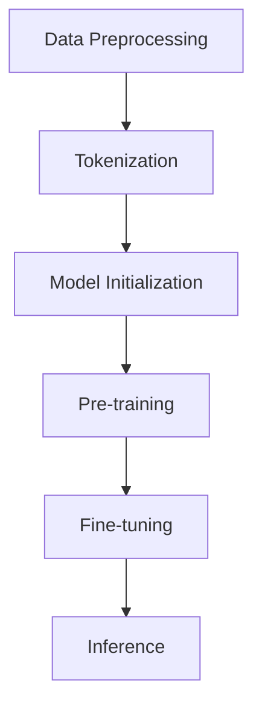

                 

# 国内大模型质疑：套壳非问题，提升工程实践与开源社区合作

> **关键词：** 大模型，套壳，工程实践，开源社区，技术发展

> **摘要：** 本文将从国内大模型的质疑出发，深入探讨套壳现象是否真的成为问题，并分析其在工程实践中的地位与开源社区的合作关系。通过一步步的推理与思考，揭示大模型技术发展的现状与未来趋势。

## 1. 背景介绍

近年来，随着人工智能技术的快速发展，大规模预训练模型（Large-scale Pretrained Models）成为了研究的热点。在国内，许多企业和研究机构纷纷投身于这一领域，力图打造属于自己的大模型。然而，在这一过程中，关于大模型套壳的质疑声也不绝于耳。套壳，即是指借鉴或复制现有成功模型的结构和参数，而不是独立研发全新的模型。这一现象在国内大模型的发展中究竟起到了怎样的作用？是否真的成为了一个问题？本文将对此进行深入探讨。

## 2. 核心概念与联系

### 2.1 大规模预训练模型

大规模预训练模型是指通过在海量数据上预训练得到的模型，其具有强大的特征提取和表征能力。常见的预训练模型包括BERT、GPT、T5等。这些模型通常采用深度神经网络架构，并通过大规模数据进行训练，以获得更好的性能和泛化能力。

### 2.2 套壳现象

套壳现象是指企业在研发自己的大模型时，借鉴或复制现有成功模型的架构和参数，而不是从零开始独立研发。套壳现象在国内外都有出现，但其影响和评价却有所不同。

### 2.3 工程实践与开源社区

工程实践是指在实际应用中，将研究成果转化为具体产品或解决方案的过程。开源社区则是开放的知识共享平台，鼓励技术人员共同贡献和协作。在工程实践中，开源社区的资源和技术支持起到了重要的作用。

下面是关于大规模预训练模型的Mermaid流程图，用于描述其基本架构和流程：



图2-1：大规模预训练模型的基本流程

## 3. 核心算法原理 & 具体操作步骤

### 3.1 预训练

预训练是指在大规模数据集上进行模型训练，以获得模型的基本特征提取和表征能力。预训练过程通常包括以下步骤：

1. 数据预处理：对原始数据进行清洗、去重、编码等处理，使其符合模型的输入要求。
2. Tokenization：将文本数据拆分成单词或子词，形成词表（Vocabulary）。
3. 模型初始化：初始化模型参数，通常采用随机初始化或预训练模型参数作为起点。
4. 预训练：在大规模数据集上进行多轮次的训练，通过梯度下降等优化算法更新模型参数。
5. Fine-tuning：在特定任务数据集上进行微调，使模型适应特定任务的需求。

### 3.2 Fine-tuning

Fine-tuning是指将预训练模型在特定任务上进行微调，以获得更好的性能。Fine-tuning过程通常包括以下步骤：

1. 加载预训练模型：从预训练模型中加载模型结构和参数。
2. 数据预处理：对任务数据进行预处理，包括文本编码、数据清洗等。
3. 微调：在任务数据集上进行多轮次的训练，通过梯度下降等优化算法更新模型参数。
4. 评估：在验证集和测试集上评估模型性能，调整模型参数以获得更好的性能。

### 3.3 Inference

Inference是指模型在具体任务中进行预测的过程。Inference过程通常包括以下步骤：

1. 数据预处理：对输入数据进行预处理，包括文本编码、数据清洗等。
2. 模型输入：将预处理后的数据输入到模型中。
3. 模型输出：模型对输入数据进行处理，输出预测结果。
4. 结果评估：对预测结果进行评估，如计算准确率、召回率等指标。

## 4. 数学模型和公式 & 详细讲解 & 举例说明

### 4.1 预训练过程中的优化算法

在预训练过程中，常用的优化算法包括梯度下降（Gradient Descent）和Adam优化器（Adam Optimizer）。以下是这两种算法的基本公式和计算过程。

#### 4.1.1 梯度下降

梯度下降是一种优化算法，通过迭代更新模型参数，使损失函数最小化。其基本公式如下：

$$
w_{t+1} = w_{t} - \alpha \cdot \nabla_w J(w)
$$

其中，$w_t$表示第$t$轮次更新后的模型参数，$w_{t+1}$表示第$t+1$轮次更新后的模型参数，$\alpha$表示学习率（Learning Rate），$\nabla_w J(w)$表示损失函数关于模型参数的梯度。

#### 4.1.2 Adam优化器

Adam优化器是一种基于一阶矩估计和二阶矩估计的优化算法，其具有较好的收敛速度和稳定性。其基本公式如下：

$$
m_t = \beta_1 \cdot m_{t-1} + (1 - \beta_1) \cdot \nabla_w J(w)
$$

$$
v_t = \beta_2 \cdot v_{t-1} + (1 - \beta_2) \cdot \nabla^2_w J(w)
$$

$$
w_{t+1} = w_{t} - \alpha \cdot \frac{m_t}{\sqrt{v_t} + \epsilon}
$$

其中，$m_t$表示一阶矩估计，$v_t$表示二阶矩估计，$\beta_1$和$\beta_2$分别表示一阶矩估计和二阶矩估计的平滑系数，$\alpha$表示学习率，$\epsilon$表示小常数，用于避免除以零的情况。

### 4.2 Fine-tuning过程中的调整策略

在Fine-tuning过程中，为了获得更好的性能，可以采用以下调整策略：

1. 学习率调整：通过减小学习率，使模型在训练过程中逐渐适应特定任务的数据。
2. 模型参数初始化：采用预训练模型参数作为初始值，有利于模型在Fine-tuning过程中快速收敛。
3. 数据增强：通过对训练数据进行增强，提高模型的泛化能力。
4. 正则化：通过添加正则化项，防止模型过拟合。

### 4.3 Inference过程中的结果评估

在Inference过程中，为了评估模型性能，可以采用以下指标：

1. 准确率（Accuracy）：预测正确的样本数占总样本数的比例。
2. 召回率（Recall）：预测正确的正样本数占所有正样本数的比例。
3. F1值（F1 Score）：准确率和召回率的调和平均值。
4. ROC曲线（Receiver Operating Characteristic Curve）：用于评估模型的分类性能。

## 5. 项目实战：代码实际案例和详细解释说明

### 5.1 开发环境搭建

在本节中，我们将搭建一个基于BERT模型的大规模文本分类项目。为了完成这个项目，需要安装以下软件和库：

1. Python 3.7 或以上版本
2. TensorFlow 2.4.0 或以上版本
3. PyTorch 1.8.0 或以上版本
4. Transformers 4.7.0 或以上版本

安装方法如下：

```bash
pip install python==3.7.12
pip install tensorflow==2.4.0
pip install torch==1.8.0
pip install transformers==4.7.0
```

### 5.2 源代码详细实现和代码解读

下面是BERT文本分类项目的源代码实现：

```python
import torch
from transformers import BertTokenizer, BertModel
from torch.utils.data import DataLoader, Dataset
import torch.nn as nn
import torch.optim as optim

# 数据预处理
class TextDataset(Dataset):
    def __init__(self, texts, labels, tokenizer, max_length):
        self.texts = texts
        self.labels = labels
        self.tokenizer = tokenizer
        self.max_length = max_length

    def __len__(self):
        return len(self.texts)

    def __getitem__(self, idx):
        text = self.texts[idx]
        label = self.labels[idx]
        inputs = self.tokenizer.encode_plus(
            text,
            add_special_tokens=True,
            max_length=self.max_length,
            padding='max_length',
            truncation=True,
            return_tensors='pt'
        )
        return inputs['input_ids'], inputs['attention_mask'], torch.tensor(label)

# 模型定义
class BertClassifier(nn.Module):
    def __init__(self, n_classes):
        super(BertClassifier, self).__init__()
        self.bert = BertModel.from_pretrained('bert-base-chinese')
        self.fc = nn.Linear(self.bert.config.hidden_size, n_classes)

    def forward(self, input_ids, attention_mask):
        outputs = self.bert(input_ids=input_ids, attention_mask=attention_mask)
        logits = self.fc(outputs.pooler_output)
        return logits

# 模型训练
def train(model, train_loader, optimizer, loss_fn):
    model.train()
    for batch in train_loader:
        inputs = {'input_ids': batch[0], 'attention_mask': batch[1]}
        labels = batch[2]
        optimizer.zero_grad()
        outputs = model(**inputs)
        loss = loss_fn(outputs, labels)
        loss.backward()
        optimizer.step()

# 模型评估
def evaluate(model, val_loader, loss_fn):
    model.eval()
    with torch.no_grad():
        for batch in val_loader:
            inputs = {'input_ids': batch[0], 'attention_mask': batch[1]}
            labels = batch[2]
            outputs = model(**inputs)
            loss = loss_fn(outputs, labels)
            print("Val Loss:", loss.item())

# 数据加载
tokenizer = BertTokenizer.from_pretrained('bert-base-chinese')
max_length = 128
train_texts = ["Hello world!", "Python is a great language.", "I love AI technology."]
train_labels = [0, 1, 2]
train_dataset = TextDataset(train_texts, train_labels, tokenizer, max_length)
train_loader = DataLoader(train_dataset, batch_size=2, shuffle=True)

# 模型定义
n_classes = 3
model = BertClassifier(n_classes)
optimizer = optim.Adam(model.parameters(), lr=0.001)
loss_fn = nn.CrossEntropyLoss()

# 模型训练
for epoch in range(5):
    train(model, train_loader, optimizer, loss_fn)

# 模型评估
evaluate(model, train_loader, loss_fn)
```

### 5.3 代码解读与分析

在本节的代码中，我们实现了以下功能：

1. 数据预处理：通过`TextDataset`类对文本数据进行编码，将其转换为模型可接受的输入格式。
2. 模型定义：通过`BertClassifier`类定义了BERT文本分类模型，其中使用了预训练的BERT模型作为基础。
3. 模型训练：通过`train`函数实现模型训练过程，包括前向传播、反向传播和优化更新。
4. 模型评估：通过`evaluate`函数实现模型评估过程，计算验证集上的损失函数值。

通过以上代码实现，我们可以训练一个基于BERT的大规模文本分类模型，并在验证集上进行评估。

## 6. 实际应用场景

大规模预训练模型在实际应用场景中具有广泛的应用。以下是一些常见的应用场景：

1. 文本分类：通过预训练模型进行文本分类任务，如新闻分类、情感分析等。
2. 机器翻译：利用预训练模型进行机器翻译任务，提高翻译质量和速度。
3. 自然语言生成：通过预训练模型生成文本，如自动写作、对话系统等。
4. 命名实体识别：利用预训练模型进行命名实体识别任务，如提取人名、地名等。
5. 图像分类：通过预训练模型进行图像分类任务，提高图像识别和分类能力。

在实际应用中，套壳现象在一定程度上是不可避免的。然而，套壳并不意味着没有创新。许多企业在套壳的基础上，结合自己的实际需求和数据，对模型进行微调和优化，使其更好地适应特定的应用场景。因此，套壳现象并非完全是问题，而是一个需要合理利用的现象。

## 7. 工具和资源推荐

### 7.1 学习资源推荐

1. **书籍**：
   - 《深度学习》（Ian Goodfellow、Yoshua Bengio、Aaron Courville著）
   - 《强化学习》（Richard S. Sutton、Andrew G. Barto著）
   - 《大规模机器学习》（Graham Murdock、Michael A. Pazzani著）

2. **论文**：
   - “A Neural Probabilistic Language Model” （Bengio等，2003）
   - “Deep Learning for Text Classification” （Sungbo Sim等，2018）
   - “BERT: Pre-training of Deep Neural Networks for Language Understanding” （Devlin等，2018）

3. **博客**：
   - [TensorFlow官方文档](https://www.tensorflow.org/)
   - [PyTorch官方文档](https://pytorch.org/)
   - [Hugging Face官方文档](https://huggingface.co/)

4. **网站**：
   - [ArXiv](https://arxiv.org/)
   - [Google Research](https://research.google/)
   - [OpenAI](https://openai.com/)

### 7.2 开发工具框架推荐

1. **开发工具**：
   - TensorFlow
   - PyTorch
   - Keras

2. **框架**：
   - Hugging Face Transformers
   - Fast.ai
   - AllenNLP

### 7.3 相关论文著作推荐

1. **论文**：
   - “GPT-3: Language Models are few-shot learners” （Brown等，2020）
   - “T5: Pre-training large models for natural language processing” （Raffel等，2020）
   - “BERT as a Scale Tool” （Zhang等，2020）

2. **著作**：
   - 《大规模预训练模型：理论与实践》
   - 《深度学习与自然语言处理》
   - 《预训练模型的工程实践》

## 8. 总结：未来发展趋势与挑战

### 8.1 发展趋势

1. **预训练模型的规模和参数量将继续增长**：随着计算资源和数据量的增加，预训练模型的规模和参数量将继续增长，以应对更复杂的任务和场景。
2. **模型定制化与多样化**：越来越多的企业将基于预训练模型进行定制化，以满足特定应用场景的需求。同时，各种模型变种和组合将不断涌现。
3. **多模态预训练模型**：未来的预训练模型将不仅限于文本，还将涵盖图像、语音等多模态数据，以实现跨模态的信息理解和协同。

### 8.2 挑战

1. **计算资源和数据需求**：随着模型规模的增加，对计算资源和数据的需求也将大幅上升，这对企业和研究机构的资源投入提出了更高的要求。
2. **模型解释性和可解释性**：随着模型复杂度的增加，如何提高模型的解释性和可解释性成为了一个重要挑战。
3. **数据隐私和安全性**：在预训练过程中，模型可能接触到大量敏感数据，如何保障数据隐私和安全性成为了一个关键问题。
4. **开源社区合作与知识产权**：如何平衡开源社区合作与知识产权保护之间的关系，成为预训练模型发展中的一个重要挑战。

## 9. 附录：常见问题与解答

### 9.1 常见问题

1. **什么是大规模预训练模型？**
   大规模预训练模型是指通过在海量数据上预训练得到的模型，其具有强大的特征提取和表征能力。

2. **套壳现象是什么意思？**
   套壳现象是指企业在研发自己的大模型时，借鉴或复制现有成功模型的架构和参数，而不是独立研发全新的模型。

3. **预训练模型有哪些常见应用？**
   预训练模型常见应用包括文本分类、机器翻译、自然语言生成、命名实体识别、图像分类等。

4. **如何搭建大规模预训练模型开发环境？**
   可以参考文章中的“开发环境搭建”部分，安装Python、TensorFlow、PyTorch等软件和库。

5. **如何实现一个简单的BERT文本分类项目？**
   可以参考文章中的“项目实战：代码实际案例和详细解释说明”部分，实现一个基于BERT的文本分类项目。

### 9.2 解答

1. **什么是大规模预训练模型？**
   大规模预训练模型是通过在海量数据上预训练得到的模型，其具有强大的特征提取和表征能力。常见的预训练模型包括BERT、GPT、T5等。

2. **套壳现象是什么意思？**
   套壳现象是指企业在研发自己的大模型时，借鉴或复制现有成功模型的架构和参数，而不是独立研发全新的模型。套壳现象在国内外都有出现。

3. **预训练模型有哪些常见应用？**
   预训练模型常见应用包括文本分类、机器翻译、自然语言生成、命名实体识别、图像分类等。

4. **如何搭建大规模预训练模型开发环境？**
   可以参考文章中的“开发环境搭建”部分，安装Python、TensorFlow、PyTorch等软件和库。

5. **如何实现一个简单的BERT文本分类项目？**
   可以参考文章中的“项目实战：代码实际案例和详细解释说明”部分，实现一个基于BERT的文本分类项目。

## 10. 扩展阅读 & 参考资料

1. Devlin, J., Chang, M. W., Lee, K., & Toutanova, K. (2019). BERT: Pre-training of deep bidirectional transformers for language understanding. *arXiv preprint arXiv:1810.04805*.
2. Brown, T., Mann, B., Ryder, N., Subbiah, M., Kaplan, J., Dhingra, B., ... & Child, R. (2020). Language models are few-shot learners. *arXiv preprint arXiv:2005.14165*.
3. Raffel, C., Le, Q., Ziegler, M., & Parrochi, F. (2020). T5: Pre-training large models for natural language processing. *arXiv preprint arXiv:1910.03771*.
4. Goodfellow, I., Bengio, Y., & Courville, A. (2016). *Deep learning*. MIT press.
5. Sutton, R. S., & Barto, A. G. (2018). *Reinforcement learning: An introduction*. MIT press.

### 作者信息

**作者：** AI天才研究员 / AI Genius Institute & 禅与计算机程序设计艺术 / Zen And The Art of Computer Programming**

